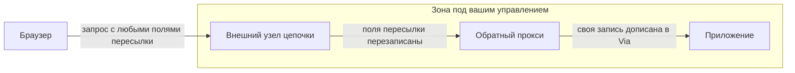

# Устройство приложения: рендеринг, прокси, кеш, API

Уровень **L2** · время 30 мин (теория 15 / задача 10 / самопроверка 5,
оценка)

Что прочитать сначала: `http-basics`, `tls-and-proxy`.

Тема несущая: она задаёт карту, на которую ложатся разборы этапов 1–5.

## 0. Коротко

Приложение, которое приходит на ревью, состоит не из одного узла. Логика
разложена между браузером и сервером — по-разному в зависимости от способа
рендеринга. Перед приложением стоит цепочка из обратного прокси, сети доставки
и кешей. За ним — один или несколько API. Для разбора важны два следствия.
Всё, что уехало на клиент, доступно атакующему целиком. А всё, что приложение
знает о клиенте, оно узнаёт от промежуточных узлов, а не напрямую.

**Зачем это в работе AppSec-инженера.** Первый вопрос на любом ревью — «где
это выполняется», второй — «кто это уже переписал по дороге». Без карты узлов
находка либо не воспроизводится, либо адресуется не той команде.

## 1. Цели

После этого раздела вы сможете:

1. Назвать место выполнения логики для четырёх способов рендеринга.
2. Перечислить узлы между браузером и приложением и сказать, что добавляет
   каждый.
3. Отличить утверждение о клиенте, пришедшее от доверенного узла, от
   присланного самим клиентом.
4. Найти в коде решение о доступе, принятое по заголовку пересылки.
5. Назвать условия, при которых общий кеш отдаст готовый ответ другому
   пользователю.

## 3. Механика

**Откуда это взялось.** Пока между клиентом и сервером никого не стояло,
сервер узнавал адрес клиента из самого соединения. Прокси поставили ради
балансировки нагрузки, разгрузки шифрования и кеширования, и запрос стал
приходить с адреса прокси. RFC 7239 называет это потерей информации об
исходном запросе. Ломается на ней всё, что делалось по адресу клиента:
журналирование, ограничение доступа по списку, разбор злоупотреблений. Ответ,
который приняли, — дописывать потерянное отдельным полем заголовка. Отсюда
растёт главное следствие темы: сервер узнаёт клиента не из соединения, а из
текста, который поставил промежуточный узел.

### Где выполняется код

Статья web.dev задаёт термины, которые дальше используются как общий словарь.

- **Серверный рендеринг** — приложение отрисовывается на сервере, и клиенту
  уходит HTML, а не JavaScript.
- **Клиентский рендеринг** — отрисовка в браузере изменением DOM. Приложение,
  целиком построенное на нём, принято называть SPA, single-page application.
- **Предварительный рендеринг** — прогон клиентского приложения на этапе
  сборки, чтобы получить начальное состояние статическим HTML.
- **Гидратация** — исполнение клиентских сценариев, добавляющих состояние и
  интерактивность к разметке, отрисованной на сервере.

> **Примечание.** Различие важно не производительностью, а тем, что уезжает на
> клиент. При клиентском рендеринге на клиенте оказывается логика, а вместе с
> ней — адреса эндпоинтов, имена полей и признаки ролей, из которых собирается
> карта API.

### Кто стоит между

MDN различает два вида посредников. **Прямой прокси** обслуживает клиента или
группу клиентов и может скрывать их адреса. **Обратный прокси** делает
противоположное — скрывает серверы и берёт на себя балансировку нагрузки,
кеширование статики и сжатие. Туннель поверх HTTP открывается методом
`CONNECT`: так клиент за прокси добирается до сайтов по TLS. MDN сразу
оговаривает, что не всякий прокси поддерживает этот метод либо ограничивает
его портом 443.

Сведения о клиенте, теряющиеся при пересылке, узлы передают полями заголовка:
стандартизованное `Forwarded` и де-факто принятые `X-Forwarded-For`,
`X-Forwarded-Host`, `X-Forwarded-Proto`. Сведения о самом посреднике несёт
`Via`.

### Насколько этим полям можно верить

RFC 7239 отвечает прямо, и это главный факт темы. Поле `Forwarded` **нельзя
считать верным**: его может изменить, по ошибке или намеренно, каждый узел на
пути к серверу, включая сам клиент. У подхода «проверить прокси и внести их в
список доверенных» спецификация называет две слабости. Первая: цепочка
адресов, перечисленных до того, как запрос пришёл на прокси, доверия не
заслуживает. Вторая: при незащищённой связи между прокси и конечным узлом
данные изменит любой, у кого есть доступ к сети.

Отсюда же два правила гигиены: поле предназначено только для запросов и не
используется в ответах, а серверам и посредникам не следует копировать его в
ответ. Иначе клиенту раскрывается вся цепочка прокси.

Вопрос, на который отвечает схема: где именно поле пересылки перестаёт быть
утверждением клиента и становится утверждением вашего узла.



**Описание схемы.** Слева браузер, справа приложение, между ними два узла.
Рамка — граница управления: всё, что внутри, настраиваете вы, всё, что слева от
неё, присылает кто угодно. Подписи на стрелках говорят, что происходит с полями
пересылки на каждом переходе.

Граница проходит по одному узлу — внешнему. Приложение отличает утверждение
клиента от утверждения своего узла ровно потому, что этот узел стирает
присланное и пишет своё. Если он **дополняет** цепочку вместо перезаписи,
рамка на схеме остаётся, а смысла у неё больше нет. Приложение читает то же
самое поле и не может отделить свою запись от чужой.

### Что делает кеш

RFC 9111 разделяет **общий** кеш, хранящий ответы для нескольких
пользователей, и **приватный**, обслуживающий одного. Сеть доставки — общий
кеш, и его правила определяют, увидит ли один пользователь ответ, собранный
для другого. Хранимый ответ переиспользуется только при всех условиях сразу:

- совпал целевой URI;
- метод это позволяет;
- совпали поля запроса, названные в `Vary`;
- ответ не несёт `no-cache`;
- ответ свеж, либо допущен к отдаче несвежим, либо успешно провалидирован.

Отдельное требование закрывает самый частый случай утечки. Общий кеш **не
должен** отвечать на запрос с полем `Authorization` из кеша, если в ответе нет
директивы, разрешающей такое хранение. Таких директив ровно три:
`must-revalidate`, `public`, `s-maxage`.

## 5. Как выглядит в коде

Ревьюер ищет места, где приложение принимает решение по данным, пришедшим от
узлов цепочки.

```text
# Псевдокод, не исполняется. УЯЗВИМО — демонстрация, не для продакшена.
xff = header("X-Forwarded-For")
client_ip = xff.split(",")[0].strip()        # (1)

if client_ip.startswith("10."):              # (2)
    allow_admin_panel()

base = header("X-Forwarded-Host")            # (3)
send_reset_link(base + "/reset?token=" + t)
```

1. Берётся крайний слева элемент — тот, который целиком контролирует клиент:
   он дописывает своё значение первым.
2. Решение о доступе принимается по этому значению. Внутренняя сеть
   «опознаётся» строкой, присланной снаружи.
3. Адрес для письма собирается из другого поля пересылки. Подмена уводит
   ссылку восстановления на чужой узел.

**Что искать глазами.** Признак — не имя поля, а то, что с ним делают. Запись
адреса в журнал по `X-Forwarded-For` допустима и полезна. А решение о доступе,
ограничение частоты и сборка ссылок по тому же полю — три разных дефекта с
одним источником.

> **Примечание.** Наличие `X-Forwarded-For` в запросе, пришедшем в приложение,
> само по себе нормально: его ставит ваш обратный прокси. Смотреть надо, что
> прокси делает с полем, которое пришло от клиента, — добавляет к нему своё
> значение или заменяет целиком.

## 6. Как чинится

```text
# Псевдокод, не исполняется. Исправленный вариант.
# Внешний узел цепочки:
set_header("X-Forwarded-For", connection.remote_addr)   # (1)

# Приложение:
client_ip = header("X-Forwarded-For")                   # (2)
if is_internal(client_ip) and has_admin_role(user):
    allow_admin_panel()                                 # (3)

base = CONFIG["public_base_url"]                        # (4)
```

Синтаксис конкретного прокси здесь намеренно не приводится: документации ни
одного обратного прокси в реестре источников нет, а выписывать директиву по
памяти правило достоверности запрещает.

До того как раскрыть выноски: скажите, какая из четырёх строк перестала бы
работать, если бы обратных прокси в цепочке стало два.

<details>
<summary>Разбор выносок</summary>

1. Прокси перезаписывает поле адресом соединения, а не дописывает к
   присланному. При двух прокси такая настройка на внешнем узле верна, а на
   внутреннем — стирает адрес клиента. Внутренний должен дописывать, и
   доверенной становится ровно та часть списка, которую вы контролируете.
2. Приложение читает поле, зная, что его формирует свой прокси.
3. Адрес перестал быть единственным основанием: сетевой признак дополнен
   проверкой роли. Требование к сети — не контроль доступа, а его сужение.
4. Публичный адрес взят из конфигурации, а не из запроса. Поле пересылки
   вообще не участвует в сборке ссылок.

</details>

**Что остаётся снаружи.** Доверие к своей цепочке держится на защищённости
связи внутри неё. RFC 7239 указывает, что при незащищённой связи между прокси
и конечным узлом данные изменит любой, кто имеет доступ к сети. Список
доверенных прокси эту слабость не устраняет.

**Цена перехода.** Каждый новый узел в цепочке меняет смысл полей пересылки, и
настройку приходится пересматривать целиком, а не добавлять к ней. Ошибка
проявляется не отказом, а тихой подменой адреса в журналах.

## 9. Ловушка

Привычное допущение: за обратным прокси приложение видит настоящий адрес
клиента.

**Оно не выполняется.** Приложение видит то, что записал последний узел, а
записать он мог что угодно.

Механика. Соединение к приложению открывает прокси, поэтому адрес соединения —
адрес прокси. Настоящий адрес приходит полем заголовка, а поле — обычные
данные запроса: спецификация прямо говорит, что изменить его может любой узел
на пути, включая клиента. Различие между «прокси добавил» и «клиент прислал»
существует только в настройке прокси и нигде больше.

Ситуация, в которой это видно. Ограничение частоты считает попытки входа по
`X-Forwarded-For`. Атакующий меняет значение в каждом запросе — счётчик
никогда не достигает порога, а в журнале остаются тысячи разных «клиентов».
Дефект при этом не в ограничителе, а в том, что источник адреса не назван.

## 10. Чеклист ревью

1. Verify that ни одно решение о доступе не принимается по полю
   `X-Forwarded-For` или `Forwarded` в одиночку.
2. Verify that внешний узел цепочки перезаписывает поля пересылки, а не
   дополняет присланные клиентом.
3. Verify that абсолютные адреса в письмах и перенаправлениях собираются из
   конфигурации, а не из `X-Forwarded-Host`.
4. Verify that поле `Forwarded` не копируется в ответы.
5. Verify that ответы на запросы с полем `Authorization` не попадают в общий
   кеш без директивы, которая это разрешает.
6. Verify that ответ, зависящий от полей запроса, называет их в `Vary`.
7. Verify that в клиентском бандле нет решений о доступе: признаки роли,
   приехавшие на клиент, управляют видимостью элементов, а не правами.

## 11. Задача

Составьте карту цепочки для одного приложения, к которому у вас есть доступ:
от браузера до кода, включая всё, что стоит между.

Единственное указание: узлы опознаются по следам в ответе — поля `Via`, `Age`,
`Server`, набор заголовков кеширования и различия между ответом на первый и
второй одинаковые запросы.

**Критерий выполнения.** Готов нумерованный список узлов в порядке
прохождения запроса. Против каждого записано: какие поля заголовка он
добавляет, какие переписывает, терминирует ли TLS, кеширует ли ответы.
Последним пунктом названо, какому узлу приложение доверяет в вопросе адреса
клиента и на каком основании.

## 12. Проверь себя

1. Чем гидратация отличается от предварительного рендеринга и что при каждом
   из них оказывается на клиенте?
2. Почему крайний слева элемент `X-Forwarded-For` не годится как адрес
   клиента?
3. Две слабости подхода «список доверенных прокси» — назовите их.
4. При каких условиях общий кеш вправе ответить из хранилища на запрос с полем
   `Authorization`?
5. Возврат к теме `tls-and-proxy`: если обратный прокси терминирует TLS, что
   именно проверяет приложение за ним и что оно проверить уже не может?
6. Возврат к теме `cors`: почему настройка разрешений на прокси и в
   приложении одновременно приводит к отказу браузера?

<details>
<summary>Ответы</summary>

1. Предварительный рендеринг — прогон клиентского приложения на этапе сборки,
   чтобы получить начальное состояние статическим HTML. Гидратация — исполнение
   клиентских сценариев, добавляющих состояние и интерактивность к разметке,
   отрисованной на сервере. В обоих случаях на клиент уезжает код приложения;
   различается момент, когда получена начальная разметка.
2. Его добавляет клиент. Прокси дописывает своё значение справа, поэтому
   слева оказывается то, что прислали снаружи.
3. Цепочка адресов, перечисленных до прихода запроса на прокси, доверия не
   заслуживает. При незащищённой связи между прокси и конечным узлом данные
   изменит любой, у кого есть доступ к сети.
4. Если ответ содержит директиву `must-revalidate`, `public` или `s-maxage` и
   кеш соблюдает требования этой директивы.
5. Приложение проверяет то, что сообщил прокси: схему в
   `X-Forwarded-Proto` и признаки клиента в полях пересылки. Сертификат
   клиента и факт защищённости исходного соединения оно проверить не может —
   рукопожатие закончилось на прокси.
6. Браузер отвергает ответ с несколькими полями `Access-Control-Allow-Origin`
   — MDN называет эту причину отдельной строкой в списке отказов: «Reason:
   Multiple CORS header 'Access-Control-Allow-Origin' not allowed».

</details>

## 13. Дальше

- `rest-and-graphql` — что стоит за той частью цепочки, которая называется
  «API».
- `cors` — почему настройка разрешений зависит от того, какой узел отвечает.
- `tls-and-proxy` — где в этой цепочке заканчивается защищённое соединение.
- `access-control-bypass-headers` — обход контроля доступа подменой полей
  пересылки.

## 14. Источники

1. «Rendering on the Web», web.dev, опубликовано 6 февраля 2019, правка
   5 января 2026; реестр `webdev-rendering-on-the-web`. Раздел Terminology,
   Server-side rendering.
   <https://web.dev/articles/rendering-on-the-web>
2. «Proxy servers and tunneling», MDN Web Docs, правка 9 ноября 2025; реестр
   `mdn-proxy-tunneling`. Разделы: Forward proxies, Reverse proxies,
   Forwarding client information through proxies, HTTP tunneling.
   <https://developer.mozilla.org/en-US/docs/Web/HTTP/Guides/Proxy_servers_and_tunneling>
3. RFC 7239 «Forwarded HTTP Extension», IETF, Standards Track, июнь 2014;
   реестр `rfc7239-forwarded`. Разделы: § 4 поле `Forwarded`,
   § 8.1 достоверность, § 8.2 утечка сведений.
   <https://www.rfc-editor.org/rfc/rfc7239.html>
4. RFC 9111 «HTTP Caching», IETF, STD 98, июнь 2022; реестр
   `rfc9111-http-caching`. Разделы: § 3.5 ответы на аутентифицированные
   запросы, § 4 построение ответа из кеша, § 4.1 ключ кеша и `Vary`,
   § 7 вопросы безопасности.
   <https://www.rfc-editor.org/rfc/rfc9111.html>
5. «CORS errors», MDN Web Docs, правка 23 марта 2026; реестр
   `mdn-cors-errors`. Раздел: перечень причин отказа — сюда сведён ответ на
   шестой вопрос самопроверки.
   <https://developer.mozilla.org/en-US/docs/Web/HTTP/Guides/CORS/Errors>

Каркас этапа: `owasp-asvs-5-document` (ASVS v5.0.0) — наследуется всеми темами
этапа 0.

**Скоропортящийся слой.** Словарь способов рендеринга принадлежит статье
web.dev и меняется вместе с практикой фронтенда; сама статья с 2019 года
правилась не раз. Спецификации в этой теме устойчивы: RFC 7239 не обсолечен,
RFC 9111 имеет статус STD 98.

**Число источников.** Пять собственных источников: у каждого своя опора в
тексте. Страница MDN про прокси перечисляет поля пересылки, но об их подделке
не говорит ничего, а сеть доставки не описана ни одним из первых двух
источников; пятый добавлен под ответ на шестой вопрос самопроверки, который
до этого ссылался на MDN, не назвав её.

**Маркеры уверенности.** Определения способов рендеринга — по документации
(web.dev, открыта лично 2026-08-22). Виды прокси, поля пересылки,
туннелирование — по документации (MDN, открыта лично 2026-08-22).
Недостоверность поля `Forwarded`, две слабости списка доверенных, потеря
сведений о клиенте при пересылке и причины, по которым ставят прокси, — по
спецификации (RFC 7239, § 1 и § 8, открыт лично 2026-08-22). Правила кеша, условия
переиспользования и требование к запросам с `Authorization` — по спецификации
(RFC 9111, открыт лично 2026-08-22). Сообщение браузера о нескольких полях
`Access-Control-Allow-Origin` — по документации (MDN «CORS errors», открыта
лично 2026-08-23). Цепочка узлов не разбиралась на живой системе: стенда под рукой
не было.
