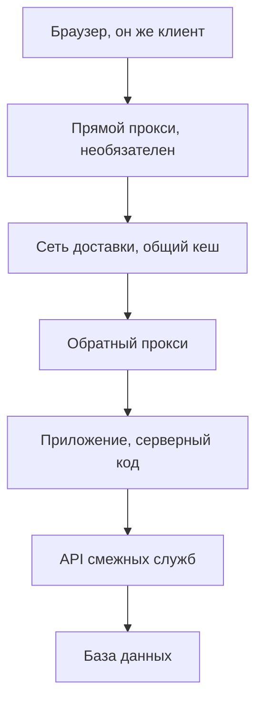
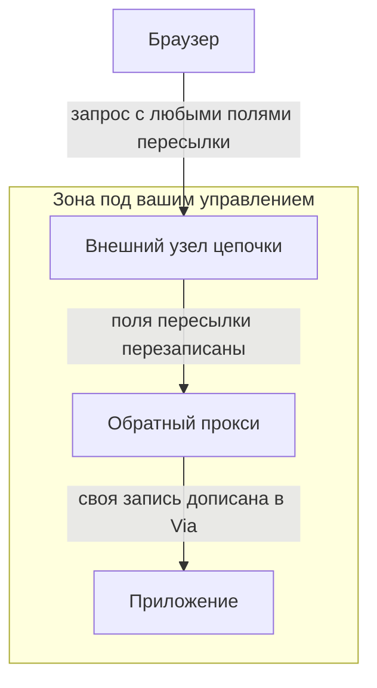

# Устройство приложения: рендеринг, прокси, кеш, API

Представьте ревью интернет-магазина, где панель администратора закрыта
правилом: пускать только запросы с адресов внутренней сети
`10.0.0.0/8`. Выглядит надёжно, потому что чужой компьютер в офисную сеть
физически не подключишь. Но админку открыл человек, который к офису
отношения не имел: он дописал к запросу одну строку, поле заголовка
`X-Forwarded-For: 10.0.0.7`, и приложение его пропустило. Пароль никто не
подбирал, шифрование никто не ломал. Чтобы понять, как такое возможно и где
ещё оно прячется, нужна карта: из каких узлов состоит веб-приложение и кто
в нём кому верит.

## Сначала карта: из чего состоит веб-приложение

Любое веб-приложение состоит минимум из двух сторон. Клиент — это программа,
которая посылает запросы: браузер на вашем ноутбуке или мобильное приложение
на телефоне. Сервер — программа, которая на них отвечает, и работает она на
машине в дата-центре. Именно на сервере живёт код, который пишете вы и ваша
команда.

Бытовой пример — ресторан. Клиент — посетитель за столиком, сервер — кухня.
Посетитель видит зал и меню, но не видит, что происходит на кухне. Кухня,
наоборот, не видит посетителя и знает о нём только то, что передал
официант.

Соответствие точное в обе стороны. Как посетитель может перечитать меню
вдоль и поперёк, так и пользователь может открыть в браузере весь приехавший
к нему код страницы. А как кухня узнаёт о посетителе только со слов
официанта, так и сервер знает о клиенте только то, что пришло в запросе.
Где аналогия перестаёт работать: официант — живой человек и вправе
заподозрить подвох, а узлы в сети передают байты дальше и ничего не
заподозрят.

Между браузером и серверным кодом в реальном приложении стоит цепочка
посредников. От браузера до базы она выглядит так. Сам браузер. Прямой
прокси, если он есть, — посредник на стороне клиента: через него, например,
офис выходит в интернет. Сеть доставки — общий кеш, склад готовых ответов
на пути. Обратный прокси — посредник на стороне сервера, он встречает все
запросы к приложению. И само приложение, а за ним — чужие службы и база
данных.

Каждый узел цепочки правит запрос по дороге: что-то дописывает, что-то
стирает, а что-то отдаёт из своей памяти, вообще не спрашивая приложение.
Каждого из посредников разберём по очереди ниже.


```mermaid
flowchart TB
    C[Браузер, он же клиент]
    F[Прямой прокси, необязателен]
    N[Сеть доставки, общий кеш]
    R[Обратный прокси]
    A[Приложение, серверный код]
    P[API смежных служб]
    D[База данных]
    C --> F --> N --> R --> A --> P --> D
```

**Описание схемы.** Схема читается сверху вниз, по ходу запроса. Браузер
отправляет запрос, и до приложения тот проходит через три посредника:
прямой прокси на стороне клиента, сеть доставки и обратный прокси на стороне
сервера. Приложение отвечает само либо обращается к API других служб и к
базе данных. Ответ идёт по той же цепочке обратно.

Предпоследний узел стоит назвать отдельно. API (application programming
interface, «программный интерфейс приложения») — это набор адресов и правил,
по которым одна программа обращается к другой. Например, страница корзины в
браузере запрашивает адрес `/api/cart`, а служба оплаты обращается к API
банка. В ресторанной аналогии API — это официант: единственный легальный
способ посетителя попросить что-то у кухни.

Границей доверия его называют потому, что всё приходящее через API приходит
снаружи. Приложение обязано проверять каждый такой запрос, даже если его
прислала собственная страница приложения. Почему «даже собственная», станет
ясно из раздела про рендеринг: страница живёт на клиенте, а клиентом
управляет пользователь.

Эта карта опорная: на неё ложатся разборы этапов 1–5.

**Зачем это в работе AppSec-инженера.** Приложение за обратным прокси вы
поднимали и адрес клиента в журнале видели. Откуда этот адрес взялся — из
соединения или из текста, дописанного прокси, — при настройке спросить
незачем: работает и так. На ревью это первый вопрос, вместе со вторым: где
именно выполняется код, который вы читаете. Без карты узлов находка либо не
воспроизводится, либо адресуется не той команде.

## Как это работает

### Где выполняется код: четыре способа рендеринга

Первый вопрос к карте — где вообще выполняется код приложения. Рендеринг —
это сборка страницы, которую увидит пользователь, и собирать её можно в
разных местах. Словарь из четырёх терминов задаёт статья web.dev, и дальше
он используется как общий.

- **Серверный рендеринг** — приложение отрисовывается на сервере, и клиенту
  уходит готовый HTML, а не JavaScript. Бытовой пример — готовое блюдо из
  кухни: посетителю остаётся только есть.
- **Клиентский рендеринг** — отрисовка в браузере изменением DOM, то есть
  живого представления страницы, которое скрипт перестраивает на ходу.
  Сервер отдаёт почти пустую страницу и большой JavaScript, а собирает
  страницу уже браузер. Приложение, целиком построенное на этом принципе,
  принято называть SPA (single-page application, «одностраничное
  приложение»). Страница в нём загружается один раз, а дальше скрипт сам
  подменяет её части, обращаясь к API за данными. Бытовой пример —
  конструктор: вам привезли детали и инструкцию, а собираете вы у себя
  дома.
- **Предварительный рендеринг** — прогон клиентского приложения на этапе
  сборки, чтобы получить начальное состояние статическим HTML. Это тот же
  конструктор, но первую страницу за вас собрали на фабрике.
- **Гидратация** — исполнение клиентских сценариев, добавляющих состояние и
  интерактивность к разметке, отрисованной на сервере. Страница приехала
  готовой, а скрипт её оживляет: навешивает обработчики на кнопки и формы.

Сводно четыре способа различаются двумя вещами: где собирается страница и
что уезжает клиенту.

| Способ | Где собирается страница | Что уезжает клиенту |
|---|---|---|
| Серверный рендеринг | на сервере | готовый HTML |
| Клиентский рендеринг | в браузере | JavaScript и логика сборки |
| Предварительный | при сборке, заранее | статический HTML |
| Гидратация | на сервере, оживление в браузере | HTML плюс скрипты |

> **Примечание.** Производительность здесь вторична. Важно то, что уезжает
> на клиент. При клиентском рендеринге на клиенте оказывается логика, а
> вместе с ней адреса эндпоинтов, имена полей и признаки ролей — из них
> собирается карта API. Эндпоинт — это конкретный адрес, на который можно
> послать запрос, например `/api/cart`.

### Кто стоит между браузером и сервером

Второй вопрос к карте — кто эти посредники. Прокси — это сервер-посредник,
который принимает запрос от вашего имени и передаёт его дальше. MDN
различает два вида, и различаются они тем, чью сторону обслуживают.

**Прямой прокси** обслуживает клиента или группу клиентов и может скрывать
их адреса. Бытовой пример — секретарь, через которого вы звоните наружу:
снаружи виден номер офиса, а не ваш личный. Корпоративный прокси, через
который в интернет выходит весь офис, устроен именно так.

**Обратный прокси** делает противоположное — скрывает серверы. Посетитель
сайта думает, что говорит с сайтом. На самом деле он говорит с обратным
прокси, и тот уже решает, какому из одинаковых серверов передать запрос.
Это и есть балансировка нагрузки — распределение запросов между копиями
приложения. Кроме неё обратный прокси обычно берёт на себя кеширование
статики и сжатие ответов. Статика — это файлы, которые не собираются заново
под каждый запрос: картинки, стили, скрипты.

Бытовой пример — приёмная большой компании: вы пришли «в компанию», вас
встретил администратор и сам решил, в какой отдел вас проводить. Где
аналогия ломается: администратор видит посетителя в лицо и записывает его
сам. А обратный прокси как раз теряет из виду исходный адрес клиента — и
это следующая история.

Через прокси ходит и зашифрованный трафик. Туннель поверх HTTP открывается
методом `CONNECT`: клиент просит прокси проложить до адреса сквозную трубу,
и дальше по ней идёт TLS-соединение, которое прокси не читает. MDN сразу
оговаривает, что не всякий прокси поддерживает этот метод либо ограничивает
его портом 443.

### Откуда взялись поля пересылки

**Откуда это взялось.** Пока между клиентом и сервером никого не стояло,
сервер узнавал адрес клиента из самого соединения. Соединение как труба: с
какого адреса она открыта, с того адреса и клиент. Прокси поставили ради
балансировки нагрузки, кеширования и разгрузки шифрования — это когда TLS
заканчивается на прокси, и приложение не тратит ресурсы на шифрование. Но
запрос стал приходить уже с адреса прокси.

Стандарт RFC 7239 называет это потерей информации об исходном запросе. RFC
— открытые спецификации, по которым устроен интернет; RFC 7239 как раз
вводит поле `Forwarded`. Ломается на этой потере всё, что делалось по
адресу клиента: журналирование, ограничение доступа по списку, разбор
злоупотреблений.

Ответ, который приняли, — дописывать потерянное отдельным полем заголовка.
Отсюда растёт главное следствие темы: сервер узнаёт клиента из текста,
который поставил промежуточный узел, а не из самого соединения.

Таких полей четыре. Стандартизованное `Forwarded` и де-факто принятые
`X-Forwarded-For`, `X-Forwarded-Host`, `X-Forwarded-Proto` несут адрес
клиента, имя хоста и схему исходного запроса. Сведения о самих посредниках
несёт поле `Via`.

### Насколько этим полям можно верить

RFC 7239 отвечает на этот вопрос прямо, и это главный факт темы. Поле
`Forwarded` нельзя считать верным: его может изменить, по ошибке или
намеренно, каждый узел на пути к серверу, включая сам клиент. У подхода
«проверить прокси и внести их в список доверенных» спецификация называет
две слабости. Первая: цепочка адресов, перечисленных до того, как запрос
пришёл на прокси, доверия не заслуживает, потому что левее вашего первого
узла вы не контролируете ничего. Вторая: при незащищённой связи между
прокси и конечным узлом данные изменит любой, у кого есть доступ к сети.

Отсюда же два правила гигиены: поле предназначено только для запросов и не
используется в ответах, а серверам и посредникам не следует копировать его
в ответ. Иначе клиенту раскрывается вся цепочка прокси.

Вопрос, на который отвечает схема: где именно поле пересылки перестаёт быть
утверждением клиента и становится утверждением вашего узла.


```mermaid
flowchart TB
    C[Браузер]
    subgraph T[Зона под вашим управлением]
        direction TB
        E[Внешний узел цепочки]
        P[Обратный прокси]
        A[Приложение]
        E -->|поля пересылки перезаписаны| P
        P -->|своя запись дописана в Via| A
    end
    C -->|запрос с любыми полями пересылки| E
```

**Описание схемы.** Схема читается сверху вниз. Сверху браузер, снизу
приложение, между ними два узла. Рамка — граница управления: всё, что внутри
неё, настраиваете вы, всё, что выше неё, присылает кто угодно. Подписи на
стрелках говорят, что происходит с полями пересылки на каждом переходе.

Граница проходит по одному узлу — внешнему. Приложение отличает утверждение
клиента от утверждения своего узла ровно потому, что этот узел стирает
присланное и пишет своё. Если он дополняет цепочку вместо перезаписи, рамка
на схеме остаётся, а смысла у неё больше нет. Приложение читает то же самое
поле и не может отделить свою запись от чужой.

### Кеш: три слоя

Третий вопрос к карте — кто отвечает из памяти. Кеш — это хранилище готовых
ответов: если ответ уже собран, незачем собирать его заново. Бытовой пример
— стопка типовых бланков у администратора: справку не пишут с нуля, а берут
готовую. Кешей в приложении обычно три, и стоят они на разных этажах карты.

Первый — кеш браузера. Он приватный, то есть обслуживает одного
пользователя: ваш браузер запоминает картинки и стили сайта, чтобы не
скачивать их заново при каждом переходе. Второй — сеть доставки (CDN,
content delivery network), общий кеш: она хранит копии ответов на узлах по
всему миру и отдаёт их ближайшему пользователю. Общий — значит хранит
ответы сразу для многих пользователей, как библиотека хранит книги для
всех читателей. Третий — кеш внутри самого приложения: например, результат
тяжёлого запроса к базе запоминается на минуту, и сотня одинаковых запросов
получает готовый ответ.

Деление на приватный и общий — это термины стандарта кеширования HTTP,
RFC 9111. Для разбора важен именно общий кеш: его правила определяют,
увидит ли один пользователь ответ, собранный для другого. Хранимый ответ
переиспользуется только при всех условиях сразу:

- совпал целевой URI, то есть адрес, к которому шёл запрос;
- метод это позволяет;
- совпали поля запроса, названные в `Vary` — поле `Vary` в ответе
  перечисляет, от каких полей запроса этот ответ зависит;
- ответ не несёт директиву `no-cache`, то есть запрет отдавать его без
  проверки;
- ответ свеж, то есть не истёк срок годности, который кеш для него
  посчитал. Либо ответ допущен к отдаче несвежим, либо он успешно
  провалидирован: кеш переспросил сервер, и тот подтвердил, что ответ не
  устарел.

Отдельное требование закрывает самый частый случай утечки. Общий кеш **не
должен** отвечать на запрос с полем `Authorization` из кеша, если в ответе
нет директивы, разрешающей такое хранение. Таких директив ровно три:
`must-revalidate`, `public`, `s-maxage`. Логика понятна из деления выше.
Ответ на запрос с чужим токеном собран для конкретного пользователя, и
отдать его другому из общей памяти — значит показать чужие данные.

### Где в этой картине живут уязвимости

Соберём следствия карты в одном месте — дальше тема в основном про них. Их
три.

Первое: всё, что уехало на клиент, доступно атакующему целиком. Код
страницы, адреса эндпоинтов, имена полей и признаки ролей пользователь
читает у себя в браузере без всякого взлома. Поэтому решения о доступе не
могут жить на клиенте: признак роли, приехавший на клиент, управляет
видимостью кнопок, а не правами.

Второе: всё, что приложение знает о клиенте, оно узнаёт от промежуточных
узлов. Своего клиента приложение не видит — ему рассказывает о нём сосед по
цепочке, текстом в поле заголовка, а текст в это поле пишет кто угодно.

Третье: общий кеш при неверно выставленных правилах отдаёт ответ, собранный
для одного пользователя, другому.

## Как это атакуют

Теперь к истории из начала темы. Вот запрос целиком, каким он ушёл от
обычного посетителя магазина:

**Запрос**

```http
GET /admin HTTP/1.1
Host: shop.example.com
X-Forwarded-For: 10.0.0.7
Cookie: session=a3fWa
```

**Ответ**

```http
HTTP/1.1 200 OK
Content-Type: text/html; charset=utf-8
```

Разложим, что здесь произошло, по шагам. Приложение проверяло адрес клиента
по полю `X-Forwarded-For`. На адрес самого соединения оно не смотрело. Поле
заголовка — обычный
текст запроса, и написать в него можно что угодно: хоть из curl, хоть из
расширения браузера. Посетитель написал туда адрес из внутренней сети.
Приложение приняло этот текст за сведение от своего прокси: отличить одно
от другого ему нечем, и то и другое выглядит одной и той же строкой. Сессия
и права при этом были настоящими: ничего взламывать не потребовалось.

Тот же приём работает и в соседних местах. Если ограничение частоты входа
считает попытки по `X-Forwarded-For`, атакующий меняет значение в каждом
запросе, и счётчик никогда не достигает порога. Если адрес для ссылки
восстановления пароля собирается из поля `X-Forwarded-Host`, подмена этого
поля уводит ссылку с токеном на чужой узел. Случай со ссылкой разобран
ниже в коде, а к ограничению частоты вернёмся в разделе про частую ошибку.

Вопрос на выход: что поменялось бы для приложения, перезапиши внешний узел
цепочки это поле своим значением? Держите его в голове — ответ на него и
есть починка.

## Как это выглядит в коде

Ревьюер ищет места, где приложение принимает решение по данным, пришедшим
от узлов цепочки. Таких мест в фрагменте два — попробуйте назвать оба до
разбора.

```text
# Псевдокод, не исполняется. УЯЗВИМО — демонстрация, не для продакшена
xff = header("X-Forwarded-For")
client_ip = xff.split(",")[0].strip()        # (1)

if client_ip.startswith("10."):              # (2)
    allow_admin_panel()

base = header("X-Forwarded-Host")            # (3)
send_reset_link(base + "/reset?token=" + t)
```

1. Берётся крайний слева элемент — тот, который целиком контролирует клиент:
   он дописывает своё значение первым.
2. Решение о доступе принимается по этому значению. Внутренняя сеть
   «опознаётся» строкой, присланной снаружи, — так и открылась админка в
   запросе, с которого тема началась.
3. Адрес для письма собирается из другого поля пересылки. Подмена уводит
   ссылку восстановления на чужой узел.

**Что искать глазами.** Признак — то, что делают с полем; само имя поля ни
о чём не говорит. Запись адреса в журнал по `X-Forwarded-For` допустима и
полезна. А решение
о доступе, ограничение частоты и сборка ссылок по тому же полю — три разных
дефекта с одним источником.

> **Примечание.** Наличие `X-Forwarded-For` в запросе, пришедшем в
> приложение, само по себе нормально: его ставит ваш обратный прокси.
> Смотреть надо, что прокси делает с полем, которое пришло от клиента, —
> добавляет к нему своё значение или заменяет целиком.

## Как защититься

Дефект из примера чинится в двух местах сразу: на внешнем узле цепочки и в
самом приложении. Почему именно в двух. Перезапись на внешнем узле
превращает поле из утверждения клиента в утверждение вашего узла. Но это
только делает адрес достоверным, а доступ по одному адресу отдавать всё
равно нельзя. Поэтому приложение добавляет проверку роли.

```text
# Псевдокод, не исполняется. Исправленный вариант.
# Внешний узел цепочки:
set_header("X-Forwarded-For", connection.remote_addr)   # (1)

# Приложение:
client_ip = header("X-Forwarded-For")                   # (2)
if is_internal(client_ip) and has_admin_role(user):
    allow_admin_panel()                                 # (3)

base = CONFIG["public_base_url"]                        # (4)
```

Синтаксис конкретного прокси здесь намеренно не приводится: документации ни
одного обратного прокси в реестре источников нет, а выписывать директиву по
памяти правило достоверности запрещает.

До того как раскрыть выноски: скажите, какая из четырёх строк перестала бы
работать, если бы обратных прокси в цепочке стало два.

<details markdown="1">
<summary>Разбор выносок</summary>

1. Прокси перезаписывает поле адресом соединения, а не дописывает к
   присланному. При двух прокси такая настройка на внешнем узле верна, а на
   внутреннем — стирает адрес клиента. Внутренний должен дописывать, и
   доверенной становится ровно та часть списка, которую вы контролируете.
2. Приложение читает поле, зная, что его формирует свой прокси.
3. Адрес перестал быть единственным основанием: сетевой признак дополнен
   проверкой роли. Требование к сети — сужение доступа, а не контроль над
   ним.
4. Публичный адрес взят из конфигурации, а не из запроса. Поле пересылки
   вообще не участвует в сборке ссылок.

</details>

**Что остаётся снаружи.** Доверие к своей цепочке держится на защищённости
связи внутри неё. RFC 7239 указывает, что при незащищённой связи между
прокси и конечным узлом данные изменит любой, кто имеет доступ к сети.
Список доверенных прокси эту слабость не устраняет.

**Цена перехода.** Каждый новый узел в цепочке меняет смысл полей пересылки,
и настройку приходится пересматривать целиком, а не добавлять к ней. Ошибка
проявляется не отказом, а тихой подменой адреса в журналах.

## Как убедиться, что защита работает

Проверить такую защиту можно только снаружи, потому что дефект жил не в
одном коде, а в стыке узлов. Три испытания ниже повторяют три дефекта из
раздела про код: смотрите, как система ведёт себя на подделанном запросе.

Первое испытание — поле пересылки. Отправьте через внешний узел запрос с
самодельным значением `X-Forwarded-For` и посмотрите в журнал приложения,
что дошло. Если в журнал попало ваше значение или оно стоит в списке
первым, внешний узел дополняет поле вместо перезаписи, и граница доверия не
настроена. Если приложение видит только адрес соединения, записанный вашим
прокси, настройка верна. Как выглядит разница между адресом соединения и
полем вживую, показывает прогон в ответе на второй вопрос самопроверки.

Второе испытание — ссылки. Запросите на стенде, то есть на тестовой копии
системы, восстановление пароля, подменив `X-Forwarded-Host`, и посмотрите,
какой адрес попал в письмо.
Адрес из конфигурации — норма, адрес из вашего поля — дефект: ссылка с
токеном уедет на чужой узел.

Третье испытание — общий кеш. Два одинаковых запроса к одному адресу с
разными токенами в поле `Authorization` обязаны получить разные ответы.
Признак того, что ответ взят из кеша, — поле `Age` в ответе: оно показывает,
сколько секунд ответ пролежал в хранилище. Если второй ответ пришёл с
полем `Age` и совпал с первым, кеш отдал чужие данные.

На ревью пройдите по списку.

1. Проверьте, что ни одно решение о доступе не принимается по полю
   `X-Forwarded-For` или `Forwarded` в одиночку.
2. Проверьте, что внешний узел цепочки перезаписывает поля пересылки, а не
   дополняет присланные клиентом.
3. Проверьте, что абсолютные адреса в письмах и перенаправлениях собираются
   из конфигурации, а не из `X-Forwarded-Host`.
4. Проверьте, что поле `Forwarded` не копируется в ответы.
5. Проверьте, что ответы на запросы с полем `Authorization` не попадают в
   общий кеш без директивы, которая это разрешает.
6. Проверьте, что ответ, зависящий от полей запроса, называет их в `Vary`.
7. Проверьте, что в клиентском бандле (собранном для браузера JavaScript)
   нет решений о доступе: признаки роли, приехавшие на клиент, управляют
   видимостью элементов, а не правами.

## Частая ошибка

Привычное допущение: за обратным прокси приложение видит настоящий адрес
клиента. Проверьте его на запросе из начала темы, прежде чем читать разбор.

Оно не выполняется. Приложение видит то, что записал последний узел, а
записать он мог что угодно.

Механика здесь такая. Соединение к приложению открывает прокси, поэтому
адрес соединения — адрес прокси. Настоящий адрес приходит полем заголовка,
а поле — обычные данные запроса: спецификация прямо говорит, что изменить
его может любой узел на пути, включая клиента. Различие между «прокси
добавил» и «клиент прислал» существует только в настройке прокси и нигде
больше.

Контрпример уже прочитан. Адрес `10.0.0.7`, по которому открылась админка,
офисной сети не принадлежал: его написал в поле тот же, кто послал запрос.
Вторая ситуация, в которой это видно, — ограничение частоты. Если оно
считает попытки входа по `X-Forwarded-For`, атакующий меняет значение в
каждом запросе, счётчик никогда не достигает порога, а в журнале остаются
тысячи разных «клиентов». Дефект при этом не в ограничителе: источник
адреса не назван.

## Попробуй сам

Составьте карту цепочки для одного приложения, к которому у вас есть
доступ: от браузера до кода, включая всё, что стоит между. Это то же
упражнение, которое ревьюер проделывает с чужой системой, только на своей.

Единственное указание: узлы опознаются по следам в ответе. Поле `Via`
называет посредников по имени, поле `Age` выдаёт ответ из кеша, поле
`Server` — программу, которая отдала ответ. А различия между ответом на
первый и второй одинаковые запросы показывают, кто ответил из памяти.

**Критерий выполнения.** Готов нумерованный список узлов в порядке
прохождения запроса. Против каждого записано: какие поля заголовка он
добавляет, какие переписывает, терминирует ли TLS (то есть расшифровывает
соединение у себя), кеширует ли ответы. Последним пунктом названо, какому
узлу приложение доверяет в вопросе адреса клиента и на каком основании.

## Проверь себя

1. Внешний прокси дописывает адрес соединения в конец цепочки. В приложение
   запрос пришёл таким.

```http
GET /admin HTTP/1.1
Host: shop.example.com
X-Forwarded-For: 203.0.113.9, 198.51.100.4
```

   Кто поставил каждое из двух значений и какое возьмёт код, читающий крайний
   левый элемент?

2. Обработчик печатает адрес соединения и поле пересылки.

```text
def who(req):
    print(connection_addr(req), header(req, "X-Forwarded-For"))
```

   Что вернёт он на запрос с самодельным `X-Forwarded-For: 10.0.0.7`?

3. Панель администратора закрыта «только для внутренней сети». Какую починку
   выбрать?

   A. Проверять `X-Forwarded-For` на вхождение в `10.0.0.0/8`.

   B. Внешний узел перезаписывает поле адресом соединения; приложение сверяет
      и сеть, и роль.

   C. Проверять поле `Forwarded`: оно нормировано RFC 7239.

4. Почему общий кеш не должен отвечать из хранилища на запрос с полем
   `Authorization`, если ответ этого явно не разрешил?

5. Возврат к теме `tls-and-proxy`: если обратный прокси терминирует TLS, что
   именно проверяет приложение за ним и что оно проверить уже не может?

6. Возврат к теме `http-basics`: внешний узел перезаписывает
   `X-Forwarded-For`, но пропускает от клиента `X-HTTP-Method-Override`. Что
   осталось открытым?

<details markdown="1">
<summary>Ответ 1</summary>

1. `203.0.113.9` прислал клиент — это значение целиком под его контролем;
   `198.51.100.4` — адрес соединения, записанный прокси. Код возьмёт
   клиентское: крайний левый элемент всегда самый недоверенный. Читать надо
   справа ровно столько элементов, сколько узлов вы контролируете.

</details>

<details markdown="1">
<summary>Ответ 2</summary>

2. Адрес соединения `127.0.0.1` и присланное поле `10.0.0.7`. Прогон — сервер
   из девяти строк:

   ```python
   from http.server import BaseHTTPRequestHandler, HTTPServer

   class H(BaseHTTPRequestHandler):
       def do_GET(self):
           self.send_response(200)
           self.end_headers()
           seen = self.client_address[0], self.headers.get("X-Forwarded-For")
           text = f"соединение: {seen[0]}, поле: {seen[1]}\n"
           self.wfile.write(text.encode())

   HTTPServer(("127.0.0.1", 8904), H).serve_forever()
   ```

   ```bash
   python3 srv.py &
   curl -s -H "X-Forwarded-For: 10.0.0.7" http://127.0.0.1:8904/admin
   ```

   ```text
   соединение: 127.0.0.1, поле: 10.0.0.7
   ```

   Адрес соединения подделать нельзя, поле — можно: это обычный текст запроса.

</details>

<details markdown="1">
<summary>Ответ 3: разбор вариантов</summary>

3. Верный вариант — B.

   A. Неверно: поле пишет клиент, и проверка опознаёт внутреннюю сеть по
      строке, присланной снаружи, — так и открылась админка в начале темы.

   B. Верно: перезапись на внешнем узле делает поле утверждением вашего узла,
      а проверка роли не отдаёт доступ одной сети.

   C. Неверно: RFC 7239 сам говорит, что полю нельзя верить, — стандартность
      формата не делает значение достоверным.

</details>

<details markdown="1">
<summary>Ответ 4</summary>

4. Потому что общий кеш хранит ответы для нескольких пользователей: ответ,
   собранный для одного, уйдёт другому. Поэтому RFC 9111 разрешает хранение
   ответа на такой запрос только трём директивам: `must-revalidate`, `public`,
   `s-maxage`.

</details>

<details markdown="1">
<summary>Ответ 5</summary>

5. Приложение проверяет то, что сообщил прокси: схему в `X-Forwarded-Proto` и
   признаки клиента в полях пересылки. Сертификат клиента и защищённость
   исходного соединения оно проверить не может — рукопожатие закончилось на
   прокси.

</details>

<details markdown="1">
<summary>Ответ 6</summary>

6. Метод подменяется полем: прокси увидит разрешённый метод, а приложение
   исполнит присланный в поле. Перезапись одних полей при пропуске других —
   половинчатость: поля подмены метода снимают на границе так же, как поля
   пересылки.

</details>

## Источники

1. «Rendering on the Web», web.dev, опубликовано 6 февраля 2019, правка
   5 января 2026; реестр `webdev-rendering-on-the-web`. Раздел Terminology,
   Server-side rendering.
   <https://web.dev/articles/rendering-on-the-web>
2. «Proxy servers and tunneling», MDN Web Docs, правка 9 ноября 2025; реестр
   `mdn-proxy-tunneling`. Разделы: Forward proxies, Reverse proxies,
   Forwarding client information through proxies, HTTP tunneling.
   <https://developer.mozilla.org/en-US/docs/Web/HTTP/Guides/Proxy_servers_and_tunneling>
3. RFC 7239 «Forwarded HTTP Extension», IETF, Standards Track, июнь 2014;
   реестр `rfc7239-forwarded`. Разделы: § 4 поле `Forwarded`,
   § 8.1 достоверность, § 8.2 утечка сведений.
   <https://www.rfc-editor.org/rfc/rfc7239.html>
4. RFC 9111 «HTTP Caching», IETF, STD 98, июнь 2022; реестр
   `rfc9111-http-caching`. Разделы: § 3.5 ответы на аутентифицированные
   запросы, § 4 построение ответа из кеша, § 4.1 ключ кеша и `Vary`,
   § 7 вопросы безопасности.
   <https://www.rfc-editor.org/rfc/rfc9111.html>
5. «CORS errors», MDN Web Docs, правка 23 марта 2026; реестр
   `mdn-cors-errors`. Раздел: перечень причин отказа — сюда сведён ответ на
   шестой вопрос самопроверки.
   <https://developer.mozilla.org/en-US/docs/Web/HTTP/Guides/CORS/Errors>

Каркас этапа: `owasp-asvs-5-document` (ASVS v5.0.0) — наследуется всеми темами
этапа 0.

**Скоропортящийся слой.** Словарь способов рендеринга принадлежит статье
web.dev и меняется вместе с практикой фронтенда; сама статья с 2019 года
правилась не раз. Спецификации в этой теме устойчивы: RFC 7239 не обсолечен,
RFC 9111 имеет статус STD 98.

**Число источников.** Пять собственных источников: у каждого своя опора в
тексте. Страница MDN про прокси перечисляет поля пересылки, но об их подделке
не говорит ничего; сеть доставки не описана ни одним из первых двух
источников; пятый добавлен под ответ на шестой вопрос самопроверки, который
до этого ссылался на MDN, не назвав её.

**Маркеры уверенности.** Определения способов рендеринга — по документации
(web.dev, открыта лично 2026-08-22). Виды прокси, поля пересылки,
туннелирование — по документации (MDN, открыта лично 2026-08-22).
Недостоверность поля `Forwarded`, две слабости списка доверенных, потеря
сведений о клиенте при пересылке и причины, по которым ставят прокси, — по
спецификации (RFC 7239, § 1 и § 8, открыт лично 2026-08-22). Правила кеша,
деление на общий и приватный, условия переиспользования и требование к
запросам с `Authorization` — по спецификации (RFC 9111, открыт лично
2026-08-22). Сообщение браузера о нескольких полях
`Access-Control-Allow-Origin` — по документации (MDN «CORS errors», открыта
лично 2026-08-23). Ресторанная аналогия для клиента и сервера, приёмная для
обратного прокси, три слоя кеша и кеш внутри приложения — общеизвестные
способы объяснения, отдельным источником не подкреплены. Цепочка узлов не
разбиралась на живой системе: стенда под рукой не было.
