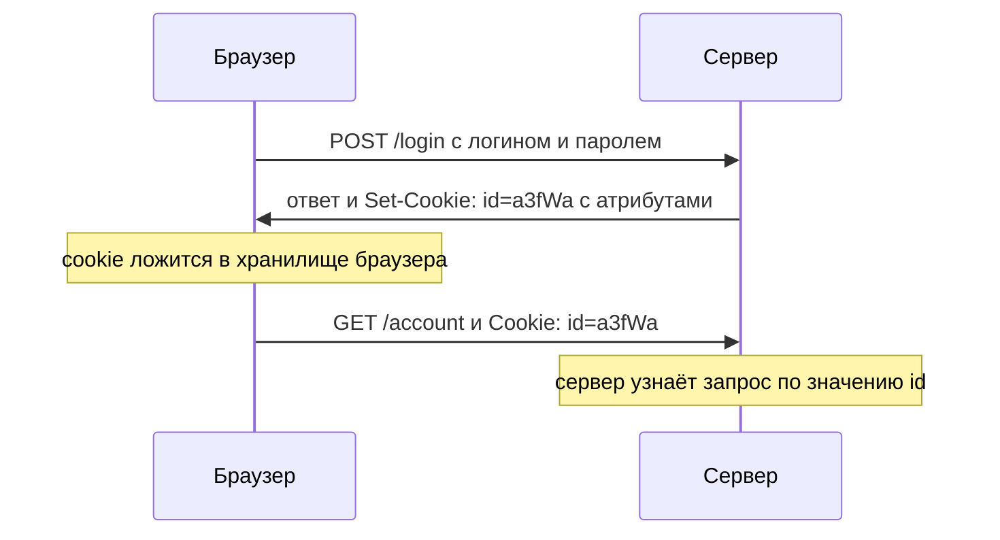
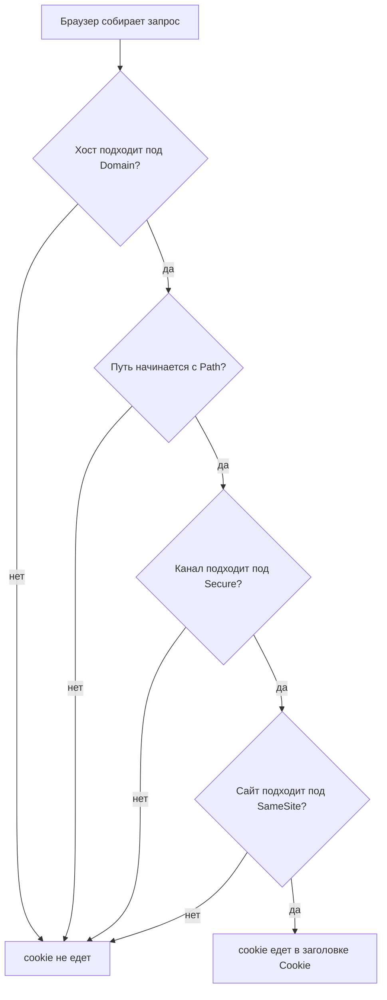

# Cookies и их атрибуты

У одного учебного сайта блог живёт по адресу `site.example/blog`, а админка —
по адресу `site.example/admin`. Комментарии в блоге рисует сторонний виджет:
чужой скрипт, который страница запускает у себя. При входе в
админку сервер ставит cookie входа и ограничивает её: путь `/admin` и домен
`site.example` со всеми поддоменами. Выглядит аккуратно: cookie вроде бы нужна
только админке и только своим. Теперь откроем обычную страницу блога. Виджет
ничего не взламывает, а значение cookie входа всё равно читает. Как это вышло
и почему ограничения оказались не теми, разбирает эта тема. Заодно вы
научитесь читать `Set-Cookie` глазами ревьюера: какой атрибут что обещает.

## Что такое cookie

HTTP сам по себе ничего не помнит: каждый запрос для сервера выглядит как
первый. Для магазина это проблема. Вы вошли в учётную запись на одной
странице, перешли на другую, а сервер снова не знает, кто вы. Чтобы сервер
мог узнавать ваши запросы, и придумали cookie.

**Cookie — это пара «имя=значение», которую сервер просит браузер запомнить и
присылать обратно.** Ставит её сервер в ответе, заголовком `Set-Cookie`: один
заголовок — одна cookie. Хранится пара на вашей стороне, в хранилище браузера,
а не на сервере; это хранилище вы видели в девтулзах, на вкладке Application в
списке Cookies. Дальше работает автоматика. При каждом следующем запросе к
подходящему адресу браузер сам добавляет в запрос заголовок `Cookie` со всеми
подходящими парами, без кода страницы и без вашего участия.

Бытовой аналог — номерок из гардероба. Соответствие такое.

| В гардеробе | В браузере |
|---|---|
| Гардеробщик выдаёт номерок при сдаче вещей | Сервер ставит cookie заголовком `Set-Cookie` |
| Номерок лежит в вашем кармане | cookie лежит в хранилище браузера |
| По номерку гардеробщик узнаёт, чьи вещи отдавать | По значению cookie сервер узнаёт, чей это запрос |

Где аналогия ломается. Номерок вы предъявляете один раз и сами, когда пришли
за вещами. Cookie браузер прикладывает к каждому подходящему запросу, делает
это без вашего участия и прикладывает сразу все подходящие. Поэтому ошибка в
настройке cookie повторяется при каждом запросе, а не один раз.

Вот обмен целиком. Сервер в ответе на вход ставит cookie входа и заодно тему
оформления.

**Ответ сервера**

```http
HTTP/1.1 200 OK
Set-Cookie: id=a3fWa; Max-Age=2592000; Secure; HttpOnly; SameSite=Lax
Set-Cookie: theme=dark; Path=/
Content-Type: text/html
```

**Следующий запрос браузера к тому же серверу**

```http
GET /account HTTP/1.1
Host: example.com
Cookie: id=a3fWa; theme=dark
```

Обратите внимание на асимметрию. Сервер отдаёт cookie по одной, каждую в
отдельном заголовке и вместе со всеми её атрибутами, то есть условиями, при
которых её надо возвращать. Браузер возвращает все подходящие cookie одной
строкой и без атрибутов: в заголовке `Cookie` едут только пары «имя=значение».
Отсюда следует вещь, на которой держится половина темы. Сервер не видит, с
какими атрибутами присланная cookie когда-то была установлена, и не видит,
почему браузер решил её прислать.



**Описание схемы.** Сервер ставит cookie в ответе на вход, и браузер сохраняет
её в своём хранилище. Каждый следующий запрос к тому же серверу браузер сам
дополняет заголовком `Cookie`, и по значению `id` сервер узнаёт, чей это
запрос. Атрибуты обратно не едут: их браузер использует сам, решая,
прикладывать ли cookie.

## Как это работает

К паре «имя=значение» сервер может приложить атрибуты. Список выглядит
однородным: `Expires`, `Max-Age`, `Domain`, `Path`, `Secure`, `HttpOnly`,
`SameSite`. Работают они по-разному, и в этом главный подвох темы. Одни
атрибуты решают, отправит ли браузер cookie на этот адрес. Другие решают,
прочитает ли её код на странице. Третьи задают только срок жизни. Разберём
каждый по порядку.

### Сколько живёт cookie: Expires и Max-Age

Если атрибутов срока нет вовсе, cookie называется сессионной: она живёт, пока
длится ваша работа с браузером, и удаляется при его закрытии. Такой обычно
делают cookie входа: сессия кончилась, и узнавать вас больше не по чему.

`Expires` и `Max-Age` делают cookie постоянной, то есть переживающей закрытие
браузера. `Expires=Wed, 21 Oct 2026 07:28:00 GMT` называет дату, после которой
cookie удаляется. `Max-Age=2592000` задаёт срок жизни в секундах с момента
установки — те же тридцать дней, но без привязки к часам. Бытовая разница —
между «пропуск действует до 21 октября» и «пропуск действует месяц со дня
выдачи». Если часы на компьютере врут, первый пропуск сработает неверно, а
второй нет. Если заданы оба атрибута, браузер берёт `Max-Age`. На область
действия cookie эти два атрибута не влияют: они отвечают только на вопрос
«сколько жить».

### Куда уйдёт cookie: Domain

Следующий вопрос — каким адресатам браузер понесёт cookie. По умолчанию, без
атрибута `Domain`, cookie возвращается ровно тому хосту, который её поставил:
поставил `app.site.example` — уйдёт только на `app.site.example`. Поддомены в
умолчание не входят, и это важно держать в голове дословно.

Атрибут `Domain` область расширяет, а не сужает. Ответ с `Domain=site.example`
делает cookie общей для всего сайта: её получат и `app.site.example`, и
`blog.site.example`, и сам `site.example`. Зачем так нужно, видно на входе:
форма входа живёт на `login.site.example`, а работает человек на
`app.site.example`, и cookie входа обязана доехать до обоих. Плата за это —
каждый поддомен получает доступ к значению, и каждый становится частью
поверхности атаки, то есть ещё одним местом, откуда значение можно увести.

В другую сторону правило тоже работает. Назвать в `Domain` можно только свой
домен или родительский. Так, `app.site.example` вправе поставить cookie на
`site.example`, но не на чужой `other.example` и не на собственный поддомен
`api.app.site.example`. Такую установку браузер отвергает.

### По каким путям: Path

Атрибут `Path` добавляет к хосту префикс пути. Cookie с `Path=/admin` уходит
только на адреса, чей путь начинается с `/admin`: на `/admin/panel` уйдёт, на
`/blog` нет. Если `Path` не задан, браузер подставляет его сам — «директорию»
адреса, которым cookie поставили.

Соблазн прочитать здесь защиту велик: кажется, что `Path=/admin` отгораживает
админку от остального сайта. Не отгораживает, и разбор этого займёт раздел
«Частая ошибка». Пока запомним формулировку: `Path` управляет маршрутом
отправки, то есть тем, приложит ли браузер cookie к запросу. Доступ к значению
он не ограничивает никому.

### По какому каналу: Secure

Атрибут `Secure` привязывает cookie к защищённому каналу. Браузер возвращает
такую cookie только по HTTPS, а по открытому HTTP её нельзя и поставить:
сервер отдаёт, клиент не сохраняет. Опыт, который показывает это, стоит в
ответе 3 блока «Проверь себя».

Зачем это нужно: по открытому каналу запрос читает любой посредник, например
владелец точки доступа в кафе, а в запросе едет значение cookie. Чего `Secure`
не делает: не прячет значение в хранилище и не закрывает его от скриптов
страницы — он про канал, и только про него. Граница есть и в другую сторону.
Посредник в открытом канале не может прочитать cookie с `Secure`, но может
установить свою. Ответ по HTTP вправе поставить cookie без `Secure`, и она
потом уедет на HTTPS-адрес того же хоста. Поэтому `Secure` защищает
содержимое, но не целостность набора cookie.

### Кому видно значение: HttpOnly

Вторая дверь к значению — скрипты на странице. Любой скрипт, который
выполняется на странице, читает её cookie через свойство `document.cookie`. Вы
видели это в девтулзах: та же команда в консоли печатает все видимые cookie
страницы одной строкой.

Атрибут `HttpOnly` эту дверь закрывает. Cookie с ним браузер по-прежнему сам
прикладывает к запросам, но скриптам не показывает: в `document.cookie` её
нет. Зачем это нужно, если на странице только свои скрипты? Потому что своими
они остаются до первой ошибки. XSS — это чужой скрипт, попавший на страницу
вашего сайта, например через комментарий, который сайт показал без
экранирования. Как именно скрипт туда попадает, разбирают темы
`xss-reflected`, `xss-stored` и `xss-dom`. `HttpOnly` не мешает такому скрипту
появиться, но не даёт прочитать значение. Полностью кражу он не исключает:
остаются обходные каналы, и один старинный, через метод `TRACE`, разобран в
ответе 5 самопроверки.

`Secure` и `HttpOnly` независимы, и спецификация оговаривает это отдельно:
cookie может иметь оба атрибута сразу. Первый про канал, второй про интерфейс.

### SameSite и сторонние cookie

Последний атрибут управляет самым тонким условием: сайтом, со страницы
которого уходит запрос. Здесь «сайт» — не origin. Origin — это тройка «схема,
хост, порт», и подробно её разбирает тема `same-origin-policy`; по этой тройке
`app.site.example` и `blog.site.example` разные. Для `SameSite` они один сайт.
Сайтом считается регистрируемый домен со всеми поддоменами: `site.example`
можно купить у регистратора, а его кусок `app.site.example` — нельзя, и
граница сайта проходит по первому. Браузеры при сравнении учитывают ещё и
схему. Запрос со страницы блога на `api.site.example` — внутрисайтовый,
same-site. Запрос со страницы чужого `other.example` на `site.example` —
межсайтовый, cross-site.

Отсюда прямое следствие — понятие сторонней cookie. Когда страница
`site.example` встраивает картинку, счётчик или виджет комментариев с чужого
сайта `widget.example`, запрос к виджету уходит межсайтовым. Cookie
`widget.example` в таком запросе называется сторонней, third-party: для самого
виджета она своя, а для встроившей страницы чужая. На сторонних cookie
держится трекинг: рекламная сеть видит один и тот же свой идентификатор на
всех сайтах, где стоит её баннер.

`SameSite` решает, уйдёт ли cookie в межсайтовом запросе, и принимает три
значения.

- `Strict` — cookie едет только во внутрисайтовых запросах. Переход по ссылке
  из письма или мессенджера межсайтовый, и cookie входа в нём не уедет:
  человек, открывший сайт по ссылке, окажется «не вошедшим».
- `Lax` — то же, но с послаблением: cookie едет ещё и в переходах верхнего
  уровня, то есть когда клик по ссылке меняет адрес в адресной строке.
  Картинка с чужого сайта, кадр и скрипт cookie по-прежнему не получают.
- `None` — cookie едет во всех запросах, и внутрисайтовых, и межсайтовых. Это
  режим сторонних cookie, и браузер соглашается на него только вместе с
  `Secure`.

Значение вне этих трёх обрабатывается по режиму, эквивалентному `Lax`.
Отсутствие атрибута браузеры трактуют так же: умолчанием стал `Lax`. Раньше
умолчанием был `None`, и его смена — ровно та самая история про сторонние
cookie и трекинг.

### Префиксы имени: требования, зашитые в имя

Соберём концы вместе. Выше выяснилось: браузер возвращает cookie без
атрибутов, и сервер не видит, как она была установлена. Как тогда серверу
убедиться, что cookie входа поставили с `Secure`, а не подменили по открытому
каналу?

**Откуда это взялось.** Наивный ответ — «пусть браузер присылает атрибуты» —
сломал бы совместимость со всем, что уже развёрнуто. Ответ, который приняли:
закодировать требования в самом имени cookie. Имя приходит в запросе всегда,
поэтому проверка становится возможной без изменения протокола.

Стандарт, который описывает cookie, живёт в черновике rfc6265bis-22: RFC — это
документы-стандарты интернета, а bis в имени означает переработку прежнего
RFC 6265. Черновик определяет два префикса имени.

- `__Secure-` — cookie обязана быть установлена с атрибутом `Secure`;
- `__Host-` — с `Secure`, с `Path=/` и без `Domain`.

Договор исполняет браузер: cookie с именем `__Host-SID`, но без `Secure` или с
`Domain`, он не ставит вовсе. Примеры из спецификации. Отвергается:
`Set-Cookie: __Host-SID=12345; Secure; Domain=site.example; Path=/`, потому
что префикс `__Host-` запрещает `Domain`. Принимается с защищённого источника:
`Set-Cookie: __Host-SID=12345; Secure; Path=/`.

Почему набор именно такой, видно из разделов выше. Без `Domain` cookie
привязана к одному хосту и не делится с поддоменами. `Path=/` не даёт
переопределить её на отдельном пути. `Secure` не даёт изменить её с
незащищённого источника. Сам документ формулирует это так: получается набор,
настолько близкий к трактовке origin как границы безопасности, насколько
cookie вообще на это способны. Одна щель остаётся: порты модель cookie
игнорирует, и `__Host-` этого не меняет.

Проверять префикс должен сам сервер: браузер не срезает префикс и присылает
имя целиком, поэтому в обработчике входа cookie называется `__Host-SID`, а не
`SID`.

> **Примечание: источники расходятся.** MDN на правке от 17 августа 2026
> перечисляет четыре префикса: к двум спецификационным добавлены `__Http-` и
> `__Host-Http-`, требующие атрибута `HttpOnly`. В черновике rfc6265bis-22 от
> 1 декабря 2025 их нет. Перед тем как опираться на два последних, проверьте
> поддержку в целевых браузерах.

### Что ограничивает каждый атрибут

Когда браузер собирает запрос, он проверяет каждую сохранённую cookie по
цепочке условий.



**Описание схемы.** Четыре проверки идут сверху вниз, и каждая соответствует
одному атрибуту. Провал любой — и cookie в запрос не попадает. В цепочке нет
`Expires` и `Max-Age`: они про срок жизни, а не про отправку. Нет и `HttpOnly`:
он решает другой вопрос, показывать ли значение скриптам.

Та же картина по атрибутам.

| Атрибут | Что ограничивает | Чего не делает |
|---|---|---|
| `Secure` | отправку: только по защищённому каналу | не мешает прочитать из хранилища или из JavaScript |
| `HttpOnly` | доступ: cookie не выдаётся не-HTTP-интерфейсам | не ограничивает канал |
| `SameSite` | отправку: по признаку «свой сайт или чужой» | не ограничивает доступ |
| `Domain` | **расширяет** область на поддомены | не сужает |
| `Path` | отправку по префиксу пути | не даёт никакой защиты |
| `Expires`, `Max-Age` | время жизни | не влияет на область |

**Зачем это в работе AppSec-инженера.** Строку `Set-Cookie` вы писали — скорее
всего, скопировав набор атрибутов из соседнего обработчика, где вход работал.
Что именно обещает каждый атрибут, при копировании узнавать незачем. На ревью
аутентификации разговор упирается ровно в этот вопрос, и приблизительного
ответа он не принимает.

## Как это атакуют

Вернёмся к истории из начала темы. Напомним расклад: сайт живёт на нескольких
поддоменах, админка — по пути `/admin`, на странице блога работает сторонний
виджет комментариев. Вот ответ, которым сервер выдаёт cookie входа.

**Ответ на вход в админку**

```http
HTTP/1.1 302 Found
Set-Cookie: SID=a3fWa; Path=/admin; Domain=.site.example
Location: /admin/
```

Атрибуты выглядят защитой: `Path=/admin` вроде бы прячет cookie от блога, а
`Domain=.site.example` ограничивает её своими. Точка в начале `Domain` —
наследие старого синтаксиса: браузер её игнорирует, и запись
`Domain=.site.example` равнозначна `Domain=site.example` из раздела выше.
Проверим, что видит скрипт виджета прямо на странице блога.

```javascript
document.cookie
// "theme=dark"
```

Значения входа здесь нет: `document.cookie` сверяет путь cookie с адресом
страницы, и блог под `/admin` не подходит. Но блог и админка живут на одном
origin: схема, хост и порт у них совпадают. Поэтому странице блога никто не
запрещает встроить кадр — элемент `iframe`, страницу внутри страницы — с
адресом внутри `/admin` и прочитать cookie уже из документа кадра.

```javascript
// Демонстрация, не для продакшена.
const frame = document.createElement('iframe');
frame.src = '/admin/';
frame.onload = () => console.log(frame.contentDocument.cookie);
// "SID=a3fWa; theme=dark"
document.body.append(frame);
```

Получилось. Ни дефекта в коде страницы, ни перехвата трафика здесь нет: виджет
сторонний и работает штатно. Путь `/admin` остановил прямое чтение, но не
кадр: встроить страницу своего origin с таким адресом браузер не запрещает.
Атрибут, который закрыл бы значение от скриптов, — `HttpOnly`, и его в ответе
нет. Пример сверен прогоном: 2026-09-03 в chrome-headless-shell 152.0.7977.42
со страницы вне пути `/admin` cookie не читалась, а из кадра с адресом внутри
пути читалась.

Это одна из трёх обычных дорог к чужой cookie. Вторая — открытый канал: без
`Secure` значение едет в запросах по HTTP, и его читает любой посредник на
линии. Третья не крадёт значение, а пользуется им: атакующий заставляет
браузер жертвы сам отправить запрос на сайт, где она вошла, и браузер послушно
прикладывает cookie. Это CSRF (Cross-Site Request Forgery), межсайтовая
подделка запроса; механику разбирает тема `csrf-mechanics`, а роль `SameSite`
в защите — тема `samesite-cookies`. Отдельная история — подсадить жертве заранее известное
значение cookie входа, session fixation; ей посвящена тема `session-fixation`.

## Как это выглядит в коде

На ревью строк с `Set-Cookie` ревьюер ищет четыре вещи.

**Первое: чувствительное значение без `HttpOnly`.** Признак — cookie, по
которой определяется вход в систему, и отсутствие атрибута, закрывающего её от
`document.cookie`.

```text
# Псевдокод, не исполняется. УЯЗВИМО — демонстрация, не для продакшена
response.set_cookie(
    name  = "SID",              # (1)
    value = session_id,
    path  = "/admin",           # (2)
    domain = ".site.example",   # (3)
)                               # (4)
```

1. Имя без префикса: сервер потом не сможет проверить, как cookie установили.
2. `Path` выглядит ограничением области, но области не ограничивает: читателю
   того же origin хватает кадра на путь `/admin` из примера с виджетом.
3. `Domain` расширяет область на все поддомены; точка в начале — старый
   синтаксис, браузер её игнорирует.
4. Ни `Secure`, ни `HttpOnly`, ни `SameSite` не заданы.

**Второе: `Domain`, поставленный «чтобы работало».** Атрибут часто добавляют,
когда сайт живёт на нескольких поддоменах, и не убирают, когда надобность
отпала. Каждый поддомен после этого становится частью поверхности атаки.

**Третье: запись cookie из JavaScript.** Присваивание `document.cookie = "…"`
— сразу два сигнала: у cookie заведомо нет `HttpOnly`, и её значение
находится в области досягаемости любого скрипта на странице.

**Четвёртое: проверка имени без префикса.** Если код ищет `SID`, а cookie
называется `__Host-SID`, проверка не сработает. Если наоборот — префикс
поставлен, но сервер его не проверяет, — он не даёт ничего.

> **Примечание.** `SameSite=None` сам по себе не находка: спецификация прямо
> называет случаи, где он необходим, — встраиваемые виджеты, сервисы
> комментариев, часть схем единого входа. Находкой его делает отсутствие
> `Secure` рядом или сессионная роль такой cookie.

## Как защититься

Та же cookie входа в защищённом виде.

```text
# Псевдокод, не исполняется. Исправленный вариант.
response.set_cookie(
    name  = "__Host-SID",       # (1)
    value = session_id,
    path  = "/",                # (2)
    secure = True,
    http_only = True,
    same_site = "Lax",          # (3)
)
```

1. Префикс `__Host-` делает набор атрибутов проверяемым: по самому имени
   сервер узнаёт, что cookie ставилась с `Secure`, с `Path=/` и без `Domain`.
2. `Path=/` и отсутствие `Domain` — требования префикса, и заодно полезная
   работа: cookie привязана к одному хосту и не делится с поддоменами.
3. `Lax` как отправная точка. `Strict` — если у cookie нет роли при переходе
   извне; почему это не всегда так, разобрано ниже.

Пара различается с исходной минимально: изменены имя и `Path`, убран `Domain`,
добавлены три атрибута. Каждый закрывает свою дорогу из разбора атак: `Secure`
— открытый канал, `HttpOnly` — чтение из скриптов, `SameSite=Lax` — отправку с
чужих страниц. Виджет из начала темы после такой правки не прочитает ничего:
значение закрывает `HttpOnly`, а не путь.

Проверить набор помогает ASVS, Application Security Verification Standard —
каталог требований OWASP к приложениям. Раздел про cookie совпадает с нашим
набором по пунктам.

- Пункт v5.0-3.3.1 требует `Secure` и префикс `__Secure-`, если не
  используется `__Host-`.
- Пункт v5.0-3.3.2 требует `SameSite`, выбранный по назначению cookie.
- Пункт v5.0-3.3.3 требует `__Host-`, если cookie не предназначена для
  совместного использования поддоменами.
- Пункт v5.0-3.3.4 требует `HttpOnly` для значений, которым не нужно быть
  доступными клиентским скриптам.
- Пункт v5.0-3.3.5 ограничивает имя и значение вместе 4096 байтами.

**Границы применимости.** `SameSite=Strict` — самая сильная настройка и самая
неудобная. Спецификация разбирает конкретный сценарий: пользователь переходит
по ссылке из письма на защищённую страницу, cookie не отправляется, страница
отдаёт ошибку, и человек не понимает, почему. Предлагаемый там же выход — две
cookie вместо одной: одна, условно «на чтение», с `Lax` или `None`, вторая,
«на запись», со `Strict`. Отсутствие второй требует повторной аутентификации
перед любым действием, которое что-то меняет: переводом, заказом, удалением.

**Цена.** Две cookie — это два срока жизни, два места отзыва и два состояния,
которые могут разойтись. И атрибуты не отменяют серверных защит: тот же
документ настойчиво советует применять обычные средства, CSRF-токены и
идемпотентность безопасных методов. Идемпотентность здесь означает, что
повторный такой же запрос не меняет состояние второй раз: два `GET /account`
подряд читают одно и то же. Причина в том, что внутрисайтовые запросы вполне
исполняются в связке с XSS или злоупотреблением редиректами.

## Как убедиться, что защита работает

Проверить набор атрибутов можно глазами, и инструмент вам уже знаком — те
самые девтулзы. Откройте вкладку Network, отправьте форму входа и найдите
ответ на сам запрос аутентификации. Набор атрибутов чаще всего задаётся именно
в нём, а не в последующих ответах. Вкладка Application показывает хранилище
целиком: для каждой cookie там есть столбцы Secure, HttpOnly, SameSite,
Domain, Path и срок жизни. Пустая клетка означает, что атрибута нет, а не что
стоит «значение по умолчанию».

Поведение стоит проверить так же, как набор. Cookie с `Secure` не должна
ставиться по открытому HTTP: сервер отдаёт, а клиент не сохраняет. Опыт,
который это проверяет, есть в ответе 3 блока «Проверь себя». Сервер по HTTP
ставит две cookie, и та, что с `Secure`, в хранилище не попадает. Если ваш
клиент такую cookie спокойно принял, проверяйте уже его.

На ревью пройдите по списку.

1. Проверьте, что каждая cookie с чувствительным значением имеет атрибут
   `Secure` и префикс `__Secure-` либо `__Host-` (ASVS v5.0-3.3.1).
2. Проверьте, что значения, не предназначенные клиентским скриптам, имеют
   `HttpOnly` и передаются только заголовком `Set-Cookie` (ASVS v5.0-3.3.4).
3. Проверьте, что значение `SameSite` выбрано под назначение cookie, а не по
   умолчанию. Проверьте, что `SameSite=None` стоит только вместе с `Secure` и
   только там, где cookie действительно нужна в межсайтовом контексте
   (ASVS v5.0-3.3.2).
4. Проверьте, что атрибут `Domain` отсутствует, если cookie не предназначена
   для совместного использования поддоменами (ASVS v5.0-3.3.3).
5. Проверьте, что сервер проверяет имя cookie вместе с префиксом.
6. Проверьте, что `Path` нигде не используется как граница безопасности между
   частями одного хоста.
7. Проверьте, что длина имени и значения вместе не превышает 4096 байт
   (ASVS v5.0-3.3.5).

## Частая ошибка

Знакомое рассуждение: `Path` ограничивает доступ к cookie, поэтому
`Path=/admin` защищает административную cookie от остального сайта. Прежде чем
читать дальше, решите для себя, держится ли оно.

Оно не держится. `Path` управляет маршрутизацией, а не доступом, и не даёт
никаких гарантий целостности.

Механизм собирается из двух фактов. Во-первых, браузер принимает любое
значение `Path` в `Set-Cookie`: ответ на запрос `http://site.example/foo/bar`
спокойно ставит cookie с `Path=/qux`. Во-вторых, ограничение действует и на
`document.cookie`: геттер сверяет путь cookie с адресом документа, и со
страницы блога cookie с `Path=/admin` не видна. Но видна она из кадра с
адресом внутри `/admin`, а встроить такой кадр странице того же origin никто
не запрещает. Именно это и проделал виджет из начала темы.

Спецификация делает из этого прямой вывод: не следует держать взаимно
недоверяющие сервисы на разных путях одного хоста и хранить в cookie
чувствительные данные. MDN формулирует то же короче: `Path` не задуман как
мера безопасности.

То же рассуждение переносится на порт и схему. Cookie не изолированы по порту:
если её читает сервис на одном порту, её читает и сервис на другом порту того
же хоста. Не изолированы они и по схеме: для модели cookie HTTP и HTTPS одного
хоста не различаются. Отделить их друг от друга может только атрибут `Secure`.

## Попробуй сам

Возьмите одно приложение на своём стенде, войдите в него и выпишите все
заголовки `Set-Cookie`, которые оно отдаёт при входе. Девтулзов для этого
достаточно: вкладка Network, ответ на запрос входа.

Одна подсказка: смотрите ответ на сам запрос аутентификации, а не на
последующие, — набор атрибутов чаще всего задаётся именно там.

**Критерий выполнения** наблюдаемый: у вас есть таблица, где на каждую cookie
приходится строка, а в столбцах — `Secure`, `HttpOnly`, `SameSite`, `Domain`,
`Path`, префикс имени. Для каждой пустой ячейки записано одно из двух:
«обосновано, потому что…» или «дефект».

## Проверь себя

1. Примет ли браузер такую cookie и почему?

```http
Set-Cookie: __Host-SID=9f2Le; Secure; Path=/; Domain=site.example
```

2. Сервер поставил такую cookie.

```http
Set-Cookie: prefs=dark; Path=/admin
```

   Страница того же хоста встраивает кадр с `/admin/panel`. Прочитает ли её
   скрипт эту cookie?

3. Сервер по `http://` ставит `sec=1; Secure` и `plain=2`. Что вернётся
   следующим запросом?

4. Найдена сессионная cookie без атрибутов. Какую правку выбрать?

   A. Добавить `Path=/admin` — пусть не уходит на чужие пути.

   B. Дать `Secure`, `HttpOnly`, `SameSite=Lax` и имя с `__Host-`.

   C. Ограничиться именем с `__Host-` — префикс сам включает атрибуты.

5. Возврат к теме `http-basics`: `TRACE` отражает запрос обратно клиенту. Как
   это связано с `HttpOnly`?

<details markdown="1">
<summary>Ответ 1</summary>

1. Нет. Префикс `__Host-` запрещает атрибут `Domain` и требует `Secure` с
   `Path=/`; набор здесь противоречив, и браузер такую cookie не ставит. Сама
   проверка префикса нужна потому, что браузер возвращает cookie одной строкой
   `Cookie: имя=значение`, без атрибутов: по имени сервер и узнаёт, как cookie
   установили.

</details>

<details markdown="1">
<summary>Ответ 2</summary>

2. Прочитает. `Path` сверяется с адресом документа кадра, а встроить кадр с
   адресом внутри `/admin` странице того же origin никто не запрещает. `Path`
   управляет маршрутом отправки, доступ не ограничивает; чтению мешал бы
   `HttpOnly`.

</details>

<details markdown="1">
<summary>Ответ 3</summary>

3. Только `plain=2`. Прогон — такой сервер и два запроса:

   ```python
   from http.server import BaseHTTPRequestHandler, HTTPServer

   class H(BaseHTTPRequestHandler):
       def do_GET(self):
           self.send_response(200)
           if self.path == "/set":
               self.send_header("Set-Cookie", "sec=1; Secure; Path=/")
               self.send_header("Set-Cookie", "plain=2; Path=/")
           self.end_headers()
           seen = self.headers.get("Cookie") or "<нет>"
           self.wfile.write(f"cookie: {seen}".encode())

   HTTPServer(("127.0.0.1", 8901), H).serve_forever()
   ```

   ```bash
   python3 srv.py &
   curl -s --resolve shop.example:8901:127.0.0.1 -c jar.txt \
     http://shop.example:8901/set -o /dev/null
   curl -s --resolve shop.example:8901:127.0.0.1 -b jar.txt \
     http://shop.example:8901/
   ```

   ```text
   cookie: plain=2
   ```

   Cookie с `Secure` curl даже не сохранил: по открытому каналу она не
   принимается и не возвращается. Атрибут ограничивает канал, и только его.

</details>

<details markdown="1">
<summary>Ответ 4: разбор вариантов</summary>

4. Верный вариант — B.

   A. Неверно: `Path` управляет маршрутом отправки, а не доступом — cookie с
      ним читается из кадра с адресом внутри `/admin`.

   B. Верно: `Secure` закрывает открытый канал, `HttpOnly` — чтение из
      скриптов, `SameSite=Lax` — отправку с чужих сайтов, а имя с `__Host-`
      делает набор проверяемым.

   C. Неверно: префикс ничего не включает, он кодирует требования. Без самих
      атрибутов браузер cookie с таким именем отвергнет.

</details>

<details markdown="1">
<summary>Ответ 5</summary>

5. `HttpOnly` закрывает cookie от `document.cookie`, но не мешает ей попасть в
   тело ответа, если сервер отражает полученный запрос. Исторически на этом
   строилась атака XST (Cross-Site Tracing, межсайтовая трассировка). RFC 9110 § 9.3.8 требует от клиента не посылать cookie
   в запросе `TRACE`, а от конечного получателя — исключать поля, которые
   вероятно содержат чувствительные данные. WSTG-v42-CONF-06 добавляет, что в
   браузерах на момент выпуска WSTG v4.2 атака воспроизводится только при
   условии, что приложение работает с технологиями вроде Flash. Отсюда пункт 5
   чеклиста темы `http-basics`: `TRACE` отключают, потому что цена отключения
   нулевая, а не потому что атака гарантированно работает.

</details>

## Источники

1. draft-ietf-httpbis-rfc6265bis-22 «Cookies: HTTP State Management
   Mechanism», IETF, 1 декабря 2025; реестр `rfc6265bis-cookies`. Разделы:
   § 4.1.2 семантика атрибутов, § 4.1.3 префиксы имени, § 8.5 слабая
   конфиденциальность, § 8.6 слабая целостность, § 8.8 SameSite.
   <https://datatracker.ietf.org/doc/draft-ietf-httpbis-rfc6265bis/>
2. «Using HTTP cookies», MDN Web Docs, правка 17 августа 2026; реестр
   `mdn-cookies`.
   <https://developer.mozilla.org/en-US/docs/Web/HTTP/Guides/Cookies>
3. OWASP WSTG-v42-CONF-06 «Test HTTP Methods», WSTG v4.2; реестр
   `wstg-v42-conf-06-http-methods`. Раздел «Testing for Cross-Site Tracing
   Potential» — условие, при котором XST воспроизводится в браузерах на момент
   выпуска WSTG v4.2.
   <https://owasp.org/www-project-web-security-testing-guide/v42/4-Web_Application_Security_Testing/02-Configuration_and_Deployment_Management_Testing/06-Test_HTTP_Methods>

Каркас этапа: `owasp-asvs-5-document` (ASVS v5.0.0) — наследуется всеми темами
этапа 0.

**Маркеры уверенности.** Семантика атрибутов, префиксы, слабая целостность и
конфиденциальность — по документации (rfc6265bis-22, открыт лично 2026-08-22).
Вид заголовков на проводе, поведение `Domain` и `document.cookie`, умолчание
`SameSite` и сторонние cookie, четыре префикса — по документации (MDN, открыт
лично 2026-08-22). Пример с кадром сверен прогоном 2026-09-03 в
chrome-headless-shell 152.0.7977.42: со страницы вне пути `/admin` cookie не
читалась, из кадра внутри пути читалась. Требования 3.3.1–3.3.5 — по
документу ASVS 5.0.0, открытому лично 2026-08-22. Условие, при котором XST
воспроизводится, — по документации (WSTG-v42-CONF-06, открыт лично
2026-08-23). Прогон ответа 3 повторён 2026-10-03 локально, Python 3.14.7 и
curl 8.22.0: вывод совпал. Аналогия с гардеробным номерком отдельным
источником не подкреплена. Остальные примеры не запускались.

**Скоропортящийся слой.** rfc6265bis по состоянию на 2026-08-22 остаётся
черновиком -22 в очереди RFC Editor (проверено по странице datatracker в этот
день). Когда выйдет RFC, номер и ссылку в этой теме и в реестре нужно
обновить. MDN описывает два префикса сверх спецификации — их поддержка
проверяется отдельно.
