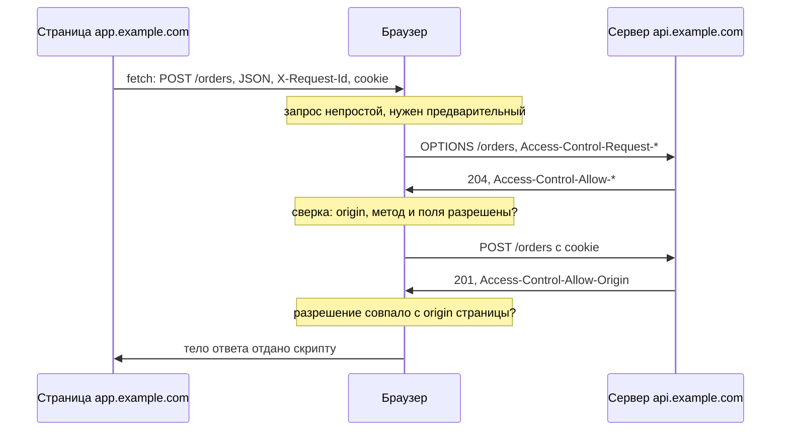

# CORS: предполётный запрос и заголовки Access-Control-*

Вы пишете фронтенд магазина. Страница живёт на `app.example.com`, API — на
`api.example.com`, и первый же запрос из браузера падает: данных нет, а в
консоли красная строка про CORS policy. Дальше обычно происходит привычное.
Вы добавляете на сервере строчку из первого ответа поисковика, фронтенд
оживает, и задачу закрывают, так и не спросив, что именно эта строчка
разрешила и кому.

А спросить приходится, когда ту же пару заголовков читает проверяющий. Вот
запрос, который браузер отправил со страницы `promo-shop.example`, открытой
у вошедшего пользователя магазина, и ответ на него:

**Запрос**

```http
GET /api/orders HTTP/1.1
Host: api.example.com
Origin: https://promo-shop.example
Cookie: session=a3fWa
```

**Ответ**

```http
HTTP/1.1 200 OK
Access-Control-Allow-Origin: https://promo-shop.example
Access-Control-Allow-Credentials: true
Content-Type: application/json

[{"id": 1042, "total": "12400.00"}]
```

Поле `Origin` в запросе поставил сам браузер: так он сообщает серверу, какая
страница инициировала обращение. Cookie приложил тоже он. Первая причина:
скрипт вызвал fetch в режиме учётных данных `include`, то есть явно попросил
приложить cookie; сами режимы разберём в разделе «Как это работает». Вторая:
cookie выпущена с атрибутами `SameSite=None; Secure`, а без них запросу
с чужого сайта cookie не досталась бы (почему — разбирает тема `cookies`).

Дефект сидит в двух строках ответа. Первая разрешает читать ответ ровно тому
origin, который пришёл в запросе, вторая подтверждает, что разрешение
действует вместе с cookie. Разрешение выдано просителю по его же заявке, и
скрипт чужой страницы прочитал заказы пользователя — ни пароль, ни сессию
подбирать не понадобилось.

Дальше разберём, как устроено такое разрешение, когда браузер спрашивает его
заранее и какие сочетания значений он отвергает. Как такую мисконфигурацию
ищут и эксплуатируют целенаправленно, рассказывает тема
`cors-misconfig-access`, а подделка запроса без чтения ответа — тема
`csrf-mechanics`; здесь они не дублируются.

## Что такое origin и зачем нужен CORS

Origin — это тройка «схема, хост, порт» адреса страницы. У
`https://app.example.com/orders` origin записывается как
`https://app.example.com`, потому что порт 443 для HTTPS подразумевается и
опускается. Поменялся хотя бы один элемент тройки — origin уже другой. У
`http://app.example.com` другая схема, у `https://api.example.com` другой
хост, у `https://app.example.com:8443` другой порт, и все три для браузера
чужие.

Бытовой пример — пропуск в бизнес-центр: он действует на конкретное
здание, конкретный этаж и конкретный вход, а соседний этаж того же здания
не открывает. Соответствие такое:

| В пропуске | В адресе страницы |
|---|---|
| здание | хост |
| этаж | порт |
| вход, главный или служебный | схема |
| соседний этаж закрыт, хотя здание то же | другой порт того же хоста — уже чужой origin |

Аналогия ломается на одном месте: у пропуска есть охранник, который может
сделать исключение по звонку. У браузера исключений «по договорённости»
нет — только явное разрешение сервера, и о нём вся эта тема.

Напомним то, что подробно разобрано в теме `same-origin-policy`. Браузер
делит всё, что страница делает с чужим origin, на три категории. Запись —
ссылки, редиректы, отправку форм — он как правило разрешает. Встраивание —
картинки, стили, скрипты через `<script src>` — тоже разрешает. А чтение
ответа чужого сервера запрещает, даже когда запрос ушёл и ответ пришёл:
скрипт страницы тело не получит.

CORS (Cross-Origin Resource Sharing, «совместное использование ресурсов
между origin») — способ сервера снять именно этот запрет. Сервер добавляет
в ответ несколько полей заголовка и объявляет ими, что конкретному origin
читать всё-таки можно. Разрешение выдаёт тот, чьи данные читают, и точность
разрешения — его забота. А решение принимает браузер, и принимает он его по
ответу сервера, а не по запросу.

**Откуда это взялось.** Политика одного источника запрещает чтение чужого
ответа целиком, а страницам законно нужны данные соседних сервисов: виджет
курсов на странице магазина тому пример. Почему не разрешить чтение всем,
Fetch Standard объясняет прямо. Тогда утекут ответы из сетей за файрволом,
куда атакующему иначе не попасть: запрос пойдёт из браузера пользователя,
который сидит внутри периметра.

Отдельно назван случай запросов с учётными данными: там согласие сервера
тоже обязано быть явным. Решение, которое приняли, отдаёт выбор той стороне,
чьи данные читают. Согласие в этой схеме и есть вся защита, поэтому один
подставленный в разрешение origin снимает её целиком — как в примере в
начале темы.

**Зачем это в работе AppSec-инженера.** Красную строку про CORS в консоли
браузера вы видели, и почти наверняка гасили её правкой настройки на
сервере. Правка выбиралась по одному признаку: заработал фронтенд или нет.
На ревью спрашивают другое — что именно эта настройка кому разрешила, и
ответ «у нас работает» вопрос не закрывает.

## Как это работает

### Что браузер отправляет сразу: простой запрос

Браузер делит обращения к чужому origin на два класса. Первый класс —
простой запрос, то есть то, что страница могла отправить и до изобретения
CORS, обычной HTML-формой. Форма умеет методы `GET` и `POST`, поля
заголовка из короткого безопасного списка и три значения `Content-Type`.
Всё укладывающееся в эти рамки браузер отправляет сразу, без всякого
предупреждения. Сервер обязан ожидать таких запросов от любых страниц,
потому что формы появились задолго до CORS.

Границу между классами задаёт понятие CORS-safelisted request-header —
поле из безопасного списка. Это одно из полей `accept`, `accept-language`,
`content-language`, `content-type`, `range` со значением не длиннее
128 байт. У `content-type` дополнительное условие: тип обязан быть
`application/x-www-form-urlencoded`, `multipart/form-data` или `text/plain`.
Запрос с методом `PUT`, со своим полем вроде `X-Request-Id` или с
`Content-Type: application/json` — уже не простой запрос. Дальше он идёт
по процедуре из следующего раздела.

Отдельно стоит определение из спецификации: Fetch Standard называет
CORS-запросом любой HTTP-запрос, содержащий поле `Origin`. Опознать участие
в протоколе по этому признаку надёжно нельзя, и стандарт говорит об этом
сам. Поле `Origin` добавляется ко всем запросам, метод которых не `GET` и
не `HEAD`, включая обычную отправку формы.

### Предварительный запрос: зачем браузер спрашивает заранее

Если запрос формой не выразить, браузер сначала посылает предварительный
запрос — в красных строках консоли он называется preflight, «предполётная
проверка». Это отдельный HTTP-запрос с методом `OPTIONS` и полем
`Access-Control-Request-Method`, где написано, каким методом страница
собирается обратиться. Если у основного запроса есть свои поля заголовка,
добавляется `Access-Control-Request-Headers` с их списком. Задача у
предварительного запроса одна: проверить, понимает ли ресурс протокол CORS
и согласен ли он на такое обращение. Спрашивать нужно заранее, потому что
непростой запрос для сервера может оказаться неожиданным. Методы вроде
`PUT` и `DELETE` от браузерных страниц до появления CORS не приходили, и
сервер мог ничего про такое согласование не знать.

### Что отвечает сервер: семейство Access-Control-*

Разрешения сервер объявляет полями заголовка в ответе, и у каждого поля
ровно одна работа.

| Поле ответа | Что объявляет |
|---|---|
| `Access-Control-Allow-Origin` | можно ли поделиться ответом: буквальное значение `Origin` (в том числе `null`) либо `*` |
| `Access-Control-Allow-Credentials` | можно ли поделиться при режиме учётных данных `include` |
| `Access-Control-Allow-Methods` | какие методы поддержаны для целей протокола |
| `Access-Control-Allow-Headers` | какие поля запроса поддержаны |
| `Access-Control-Max-Age` | на сколько секунд кешируются два предыдущих ответа; по умолчанию 5 |
| `Access-Control-Expose-Headers` | какие поля ответа открыть скрипту |

Режим учётных данных из второй строки таблицы — это настройка fetch. По
умолчанию действует `same-origin`: cookie к чужому origin не прикладываются.
Режим `include` прикладывает их, и тогда сервер обязан подтвердить согласие
отдельным полем.

Особый случай — значение `null` в первой строке: так браузер записывает
origin документа в песочнице `iframe` или страницы со схемой `data:`.

Первые два поля участвуют в каждом ответе с разрешением. Средние три живут
в ответе на предварительный запрос: там сервер заранее объявляет методы и
поля, а `Access-Control-Max-Age` говорит браузеру, сколько секунд можно не
спрашивать повторно. Последнее поле открывает скрипту поля ответа за
пределами безопасного списка: без него скрипт увидит тело, но не увидит,
например, присланный сервером токен в своём поле.

Статус ответа протокол ограничивает только для предварительного запроса:
успешным считается статус класса «ok», то есть любой от `200` до `299`, —
например `200` или `204`. Успешный
ответ на обычный запрос CORS может иметь любой статус. А поле `Allow`,
которое обязательно в ответе `405`, к протоколу CORS отношения не имеет,
и спецификация говорит это прямо.

### Обмен в два круга

Теперь оба класса видны вживую. Страница `https://app.example.com` просит у
`https://api.example.com/orders` метод `POST` с телом JSON и своим полем
`X-Request-Id`. Форма такое не отправит сразу по двум причинам: типа
`application/json` в её списке нет, а своих полей она ставить не умеет.
Поэтому обмен идёт в два круга: сначала предварительный запрос, потом
основной. Cookie браузер прикладывает потому, что скрипт вызвал fetch в
режиме `include`.



**Описание схемы.** Схема читается сверху вниз. Скрипт просит у браузера
непростой запрос, и браузер сначала спрашивает сервер предварительным
`OPTIONS`, без cookie. Разрешения приходят в ответе на него. Браузер сверяет
их с тем, что просил скрипт, и только потом отправляет основной запрос.
Последний рубеж — разрешение в ответе на основной запрос. Если его нет или
оно выдано не тому origin, браузер тело скрипту не отдаёт, хотя сервер
запрос уже исполнил.

Вот тот же обмен транскриптами, с вырезанными нерелевантными заголовками.

**Первый круг, запрос браузера**

```http
OPTIONS /orders HTTP/1.1
Host: api.example.com
Origin: https://app.example.com
Access-Control-Request-Method: POST
Access-Control-Request-Headers: content-type,x-request-id
```

**Первый круг, ответ сервера**

```http
HTTP/1.1 204 No Content
Access-Control-Allow-Origin: https://app.example.com
Access-Control-Allow-Credentials: true
Access-Control-Allow-Methods: POST, GET, OPTIONS
Access-Control-Allow-Headers: X-Request-Id, Content-Type
Access-Control-Max-Age: 86400
Vary: Origin
```

Тела у ответа `204` нет, и это не обрезка: предварительный запрос не
возвращает ничего, кроме разрешений. Разрешено здесь ровно четыре вещи.
Показывать ответ одному origin `https://app.example.com`; показывать его при
отправленных cookie; исполнить метод `POST` с полями `X-Request-Id` и
`Content-Type`. Четвёртое — не спрашивать повторно сутки: на это срок
`Access-Control-Max-Age: 86400`. Строка `Vary: Origin` в обоих ответах —
предупреждение кешу; разбор — в примечании, закрывающем этот раздел. Не
разрешено одно: читать поля ответа за
пределами безопасного списка — для этого нужен
`Access-Control-Expose-Headers`, которого в ответе нет.

**Второй круг, запрос браузера**

```http
POST /orders HTTP/1.1
Host: api.example.com
Origin: https://app.example.com
Content-Type: application/json
Content-Length: 21
Cookie: __Host-SID=a3fWa

{"item": 7, "qty": 1}
```

**Второй круг, ответ сервера**

```http
HTTP/1.1 201 Created
Content-Type: application/json
Access-Control-Allow-Origin: https://app.example.com
Access-Control-Allow-Credentials: true
Vary: Origin

{"id": 1042}
```

Полей `Access-Control-Request-*` во втором круге нет: они нужны только
предварительному запросу. Разрешение, наоборот, повторяется — и здесь видно,
почему CORS не защищает сервер. Уберите из последнего ответа две строки
разрешения: браузер не покажет тело скрипту, но заказ к этому моменту уже
создан, потому что запрос сервер исполнил.

### Сочетания, которые браузер отвергает

У режима с учётными данными есть тонкость, которую транскрипты не показывают.
Предварительный запрос **никогда** не несёт учётных данных: его режим всегда
`same-origin`. Поэтому поддержку учётных данных сервер объявляет заранее, в
ответе на предварительный запрос, а браузер сверяет сочетания значений по
таблице из Fetch Standard. Для ревью существенны три строки:

- режим `include` и `Access-Control-Allow-Origin: *` — не разделяется:
  разрешить чтение по cookie «кому угодно» нельзя;
- значение `Access-Control-Allow-Credentials` сравнивается побайтово,
  поэтому `True` с прописной буквы не работает;
- значение `Origin` записывается без завершающей косой черты, и
  `https://rabbit.invalid/` не совпадёт с `https://rabbit.invalid`.

При режиме `include` символ `*` недопустим и в `Access-Control-Expose-Headers`,
`Access-Control-Allow-Methods`, `Access-Control-Allow-Headers`.

> **Примечание.** Когда разрешение зависит от присланного `Origin`, ответы
> под одним адресом у разных страниц разные. Кеш — свой у браузера, общий
> у сети доставки (content delivery network, CDN) — обязан об этом знать.
> Предупреждает его поле `Vary`. Правило
> кеширования нормативно задано в Fetch Standard: если разрешение сложнее,
> чем `*` или один постоянный origin, — **применяется** `Vary`. Пример оттуда
> же: ответ на запрос без `Origin` попал в кеш без разрешения, и кеш отдаёт
> его же на запрос CORS. MDN говорит мягче — серверу «следует» — и называет
> причину: ответы различаются по значению `Origin`.

## Как это выглядит в коде

Настройка CORS почти всегда лежит в одном месте — промежуточном слое
приложения или конфигурации обратного прокси. Ревьюер читает четыре строки.
Сначала отметьте сами, какая из них выдаёт разрешение чужому origin.

```text
# Псевдокод, не исполняется. УЯЗВИМО — демонстрация, не для продакшена
on_response(req, resp):
    resp["Access-Control-Allow-Origin"] = req["Origin"]      # (1)
    resp["Access-Control-Allow-Credentials"] = "true"        # (2)
    resp["Access-Control-Allow-Headers"] = "*"               # (3)
    # Vary не выставляется                                   # (4)
```

1. Значение из запроса возвращается в разрешение без сверки со списком — эта
   строка и выдала разрешение странице `promo-shop.example` в начале темы.
   Разрешение получает любой origin, включая `null`: так отражение выдаёт
   доступ и документу в песочнице `iframe`, и странице со схемой `data:`.
   Поэтому конкретное значение в ответе может означать «кто угодно».
2. Вместе с первой строкой это открывает чтение ответа, полученного по cookie
   пользователя. По отдельности каждая строка выглядит безобидно.
3. Подстановка `*` при режиме `include` незаконна, поэтому браузер отвергнет
   ответ — и разработчик заменит `*` списком, оставив первые две строки.
4. Ответ различается по значению `Origin`, но кеш об этом не предупреждён.

**Что искать глазами.** Признак — не имя заголовка, а источник его значения.
Строка вида `Allow-Origin = <что-то из запроса>` есть отражение; строка
`Allow-Origin = "https://app.example.com"` отражением не служит. Между ними
попадается третий вариант — сверка по вхождению подстроки, и он опаснее
первых двух, потому что выглядит как проверка. Что пропустит ревьюер, ищущий
одно отражение?

> **Примечание.** `Access-Control-Allow-Origin: *` сам по себе находкой не
> считается. У ответа без учётных данных и без чувствительного содержимого
> это штатная настройка публичного API. ASVS v5.0-3.4.2 требует в этом случае
> убедиться, что ответ не несёт чувствительных сведений.

## Как защититься

Задача защиты — разрешать чтение известным origin и только им, не ломая при
этом фронтенд. Для этого список доверенных origin ведут явно, пришедшее
значение сверяют со списком целиком, а кеш предупреждают всегда, и в ветке
отказа тоже. Почему именно так — видно из исправленного варианта.

```text
# Псевдокод, не исполняется. Исправленный вариант.
ALLOWED = {"https://app.example.com", "https://admin.example.com"}

on_response(req, resp):
    origin = req["Origin"]
    if origin in ALLOWED:                                    # (1)
        resp["Access-Control-Allow-Origin"] = origin
        resp["Access-Control-Allow-Credentials"] = "true"
    resp["Vary"] = "Origin"                                  # (2)
```

Страница `promo-shop.example` из начала темы в множество не входит и
разрешения больше не получает. Закройте разбор и назовите, почему `Vary`
выставляется за пределами условия.

<details markdown="1">
<summary>Разбор выносок</summary>

1. Сравнение идёт с множеством целиком, а не по вхождению подстроки. Значение
   `null` в множество не входит, поэтому документы в песочнице разрешения не
   получают.
2. Ответ зависит от `Origin` в обоих случаях — и когда разрешение выдано, и
   когда нет. Выставленный только внутри условия `Vary` оставляет кеш без
   предупреждения ровно в той ветке, где ответ ничего не разрешает. Отравленный
   кеш отдаст такой ответ тому, кому разрешение полагалось.

</details>

**Что остаётся незакрытым.** Список разрешённых origin не ограничивает то,
что сервер уже сделал с запросом: изменение состояния произойдёт независимо
от того, прочитает ли скрипт ответ. Чтение и исполнение — разные вещи, и CORS
управляет только первым. ASVS v5.0-3.5.2 требует отдельно удостовериться, что
чувствительную функциональность нельзя вызвать запросом, который
предварительного не порождает.

**Во что обходится.** Каждый новый поддомен фронтенда требует правки списка,
а ошибка в нём проявляется у пользователя как молчаливый отказ. Тело ответа
скрипту недоступно, и подробностей JavaScript не получит. MDN отмечает, что
по соображениям безопасности причина видна только в консоли браузера.

## Частая ошибка

Формулировка, которая звучит на каждом втором ревью: CORS закрывает API от
обращений с чужих сайтов. Верна она или нет — решите до разбора.

**Она неточна.** CORS управляет тем, кто прочитает ответ, а не тем, кто
отправит запрос.

Браузер отправляет простой запрос сразу и предъявляет ответ скрипту только
после проверки заголовков. Сервер к этому моменту запрос уже исполнил. В
примере из начала темы это видно по порядку: заказы сервер отдал, и решение,
показывать ли их скрипту, принималось уже над готовым ответом.
Предварительный запрос действительно уходит раньше основного — но только для
тех запросов, которые не выражаются формой HTML.

Контрпример. Запрос `POST` с телом и заголовком `Content-Type: text/plain`
предварительного не порождает: этот тип входит в безопасный список. Сервер,
разбирающий тело как JSON независимо от объявленного типа, исполнит его
целиком. Fetch Standard приводит родственный случай прямо в тексте: два поля
`Content-Type` в одном запросе — `application/json` и `text/plain`. Такой
запрос прошёл бы проверку, если бы браузер разбирал тип снисходительным
алгоритмом. Наивный разбор на сервере принял бы тело за JSON.

## Чеклист для ревью

1. Проверьте, что значение `Access-Control-Allow-Origin` либо задано
   приложением неизменным, либо сверяется со списком доверенных origin
   (ASVS v5.0-3.4.2).
2. Проверьте, что сверка origin выполняется по полному значению, а не по
   вхождению подстроки, и что значение `null` в список не входит.
3. Проверьте, что ответ с `Access-Control-Allow-Origin: *` не несёт
   чувствительных сведений.
4. Проверьте, что ответ, зависящий от поля `Origin`, содержит `Vary: Origin`.
5. Проверьте, что чувствительная функциональность недостижима запросом, который
   не порождает предварительного (ASVS v5.0-3.5.2).
6. Проверьте, что `Access-Control-Max-Age` не превышает срока, на который вы
   готовы оставить разрешение действующим без повторной проверки.

## Попробуй сам

Возьмите любой эндпоинт своего стенда и добейтесь от браузера
предварительного запроса, а затем такого же обращения без него. Оба обмена
видны во вкладке Network инструментов разработчика: предварительный запрос
стоит там отдельной строкой с методом `OPTIONS`.

Подсказка ровно одна: границу задаёт список безопасных полей запроса, и
перейти её легче всего собственным полем заголовка, например `X-Request-Id`.

**Критерий выполнения.** Сохранены четыре транскрипта: предварительный запрос
и ответ на него, затем основной запрос и ответ. В каждом ответе подчёркнуты
поля семейства `Access-Control-*`. Отдельной строкой записано, какое из полей
запроса вызвало предварительный запрос и что произошло, когда вы его убрали.

## Проверь себя

1. Предварительный запрос и ответ.

   ```http
   OPTIONS /orders HTTP/1.1
   Origin: https://app.example.com
   Access-Control-Request-Method: PUT
   ```

   ```http
   HTTP/1.1 204 No Content
   Access-Control-Allow-Origin: https://app.example.com
   Access-Control-Allow-Methods: POST, GET, OPTIONS
   ```

   Отправит ли браузер основной запрос `PUT` и почему?

2. Что пропустит такая проверка?

   ```text
   on_response(req, resp):
       if "example.com" in req["Origin"]:
           resp["Access-Control-Allow-Origin"] = req["Origin"]
   ```

3. Сервер вписывает в разрешение тот origin, что пришёл в запросе. Какую
   починку выбрать?

   A. Заменить отражение звёздочкой `*`.

   B. Сверять origin со списком разрешённых целиком и ставить `Vary: Origin`.

   C. Оставить отражение, но убрать `Access-Control-Allow-Credentials`.

4. Что произойдёт с запросом, если его с `Origin: https://pirate.example`
   отправить из `curl`, а не из браузера?

5. Возврат к теме `same-origin-policy`: какую из трёх категорий межоригинного
   доступа изменяет CORS и какие две оставляет как были?

6. Возврат к теме `http-basics`: чем `Allow` в ответе `405` отличается от
   `Access-Control-Allow-Methods`?

<details markdown="1">
<summary>Ответ 1</summary>

1. Не отправит. В ответе на предварительный запрос метода `PUT` нет —
   разрешены `POST`, `GET`, `OPTIONS`, — поэтому браузер остановит обмен на
   первом круге, и основной запрос не уйдёт вовсе. Сервер своего разрешения
   не навязывает: решает браузер по ответу сервера.

</details>

<details markdown="1">
<summary>Ответ 2</summary>

2. Всё, где `Origin` содержит подстроку `example.com`:
   `https://example.com.attacker.test` пройдёт так же, как
   `https://app.example.com`. Это то же отражение, что в блоке «Как это
   выглядит в коде», только с видимостью проверки. Сравнение обязано идти со
   списком целых значений, а не по вхождению подстроки.

</details>

<details markdown="1">
<summary>Ответ 3: разбор вариантов</summary>

3. Верный вариант — B.

   A. Неверно: вместе с `Access-Control-Allow-Credentials: true` звёздочка
      незаконна, и браузер ответ отвергнет; а если учётных данных нет,
      чтение открывается любому сайту.

   B. Верно: сравнение целым значением со списком закрывает подстановку, а
      `Vary: Origin` предупреждает кеш, что ответ зависит от поля `Origin`.

   C. Неверно: без cookie ответ читается с позиции пользователя — из его сети
      в том числе; разрешение как не ограничивало чтение, так и не
      ограничивает.

</details>

<details markdown="1">
<summary>Ответ 4</summary>

4. Сервер исполнит запрос и ответит: CORS — соглашение браузера и сервера о
   чтении ответа, а `curl` браузером не считается и правила не применяет.
   Прогон — сервер из десяти строк:

   ```python
   from http.server import BaseHTTPRequestHandler, HTTPServer

   class H(BaseHTTPRequestHandler):
       def do_POST(self):
           self.send_response(201)
           self.send_header("Content-Type", "application/json")
           self.end_headers()
           self.wfile.write(b'{"created": true}')

   HTTPServer(("127.0.0.1", 8903), H).serve_forever()
   ```

   ```bash
   python3 srv.py &
   curl -si -X POST http://127.0.0.1:8903/orders \
     -H "Origin: https://pirate.example" -d '{"item":7}' | head -1
   ```

   ```text
   HTTP/1.0 201 Created
   ```

   Поэтому CORS не защищает сервер: исполнение запроса он не ограничивает.

</details>

<details markdown="1">
<summary>Ответ 5</summary>

5. CORS меняет чтение: сервер разрешает конкретному origin прочитать ответ.
   Запись и встраивание остаются как были — политика их и так, как правило,
   разрешает.

</details>

<details markdown="1">
<summary>Ответ 6</summary>

6. `Allow` перечисляет методы, поддержанные ресурсом, и обязателен в ответе
   `405`. `Access-Control-Allow-Methods` перечисляет методы для целей
   протокола CORS; Fetch Standard прямо отмечает, что `Allow` к этому
   протоколу не относится.

</details>

## Источники

1. Fetch Standard, WHATWG, Living Standard (правка 20 августа 2026); реестр
   `whatwg-fetch`. Разделы: § 3.3 CORS protocol, § 3.3.2 HTTP requests,
   § 3.3.3 HTTP responses, § 3.3.5 CORS protocol and credentials,
   ненумерованный раздел «CORS protocol and HTTP caches», определение
   CORS-safelisted request-header.
   <https://fetch.spec.whatwg.org/>
2. «Cross-Origin Resource Sharing (CORS)», MDN Web Docs, правка 30 ноября
   2025; реестр `mdn-cors`. Разделы: Preflighted requests, Credentialed
   requests and wildcards, The HTTP response headers.
   <https://developer.mozilla.org/en-US/docs/Web/HTTP/Guides/CORS>
3. «CORS errors», MDN Web Docs, правка 23 марта 2026; реестр
   `mdn-cors-errors`. Пятнадцать причин отказа поимённо.
   <https://developer.mozilla.org/en-US/docs/Web/HTTP/Guides/CORS/Errors>

Каркас этапа: `owasp-asvs-5-document` (ASVS v5.0.0) — наследуется всеми темами
этапа 0.

**Скоропортящийся слой.** Fetch Standard — живой стандарт, набор безопасных
полей и таблица сочетаний в нём менялись и будут меняться. Список из
пятнадцати причин отказа принадлежит одному браузеру (Firefox) и в других
формулируется иначе.

**Маркеры уверенности.** Определения запроса CORS и предварительного запроса,
состав полей, значение по умолчанию для `Access-Control-Max-Age`, таблица
законных сочетаний, правило `Vary` и причина, по которой механизм сделан с
явным согласием, — по спецификации (Fetch Standard, открыт лично 2026-08-22;
раздел про кеши перечитан 2026-08-23). Модальность «следует» у того же правила
и поведение консоли — по документации (MDN, обе страницы открыты лично
2026-08-22, страница про CORS перечитана 2026-08-23). Требования 3.4.2 и 3.5.2
сверены с текстом ASVS v5.0.0 (открыт лично 2026-08-22). Транскрипты обменов
на живом стенде не прогонялись: они составлены по спецификации. Прогон из
ответа 4 (сервер на Python и `curl` с чужим `Origin`) повторён 2026-10-03
локально, Python 3.14.7, curl 8.22.0: вывод совпал.
