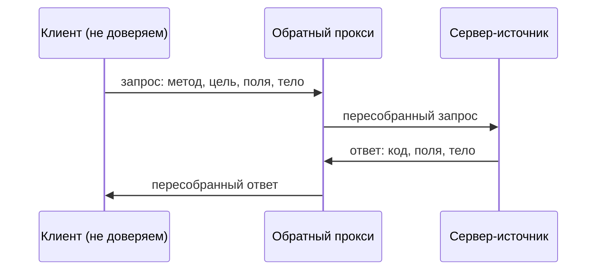

# HTTP: методы, коды ответов, заголовки

**AG-PROTO-01** · уровень **L2** · время 25 мин (теория 12 / задача 8 /
самопроверка 5, оценка) · reviewed: 2026-08-22 · проверено на: RFC 9110
(STD 97, июнь 2022), WSTG v4.2, ASVS v5.0.0
пререквизитов нет · маппинг: CWE-650 · ASVS v5.0-4.1.4 · WSTG-v42-CONF-06

Состав блоков — по уровню L2 (`PLAYBOOK.md` 3.1). Блоки 2, 4, 7 и 8 удалены,
блок 11 сведён к задаче без лабы, порядок остальных сохранён. Эксплуатация
обхода контроля доступа сменой метода разбирается в теме 1.1.07 и здесь не
дублируется.

## 0. Коротко

HTTP переносит запрос и ответ одинаково устроенными сообщениями: start-line,
поля-заголовки, пустая строка, тело. Метод в start-line объявляет намерение
клиента, трёхзначный код в ответе объявляет результат, поля несут всё
остальное. Опасность живёт не в самом протоколе, а в разрыве между объявленным
намерением и фактическим действием: сервер отвечает на метод, которого
приложение не ждало, либо обработчик меняет состояние по методу, объявленному
безопасным. Чинится явным списком разрешённых методов на каждом маршруте и
сверкой «метод — действие — код ответа».

**Зачем это в работе AppSec-инженера.** HTTP-транскрипт — основной артефакт
ревью и триажа. Пока вы не читаете его как текст, вы читаете чужие выводы о
нём: в отчёте сканера, в описании тикета, в скриншоте от разработчика.

## 1. Цели

После этого раздела вы сможете:

1. Прочитать HTTP-транскрипт и назвать в нём start-line, поля и тело.
2. Отличить безопасный метод от небезопасного, а идемпотентный от
   неидемпотентного, опираясь на RFC 9110, а не на память.
3. Найти в коде обработчик, который меняет состояние по безопасному методу.
4. Выбрать код ответа, который не раскрывает существование ресурса.
5. Заметить маршрут, у которого нет явного списка разрешённых методов.

## 3. Механика

Начнём с примера, а определения дадим после него.

**Запрос**

```http
GET /orders/1024 HTTP/1.1
Host: example.com
Accept: application/json
Cookie: session=<PLACEHOLDER>
```

**Ответ**

```http
HTTP/1.1 200 OK
Content-Type: application/json
Content-Length: 27

{"id":1024,"status":"paid"}
```

Замените: `<PLACEHOLDER>` — значение сессионной cookie вашего стенда.

Start-line запроса состоит из метода, цели запроса и версии протокола;
start-line ответа — из версии, кода и поясняющей фразы. Дальше в обоих
сообщениях идут поля, пустая строка и тело, если оно есть.

> **Примечание.** **Метод** — токен в start-line, который объявляет цель
> запроса. RFC 9110 § 9.1 называет его первичным источником семантики запроса.
> Токен **регистрозависим**, а стандартные методы по соглашению пишутся
> прописными латинскими буквами.

RFC 9110 определяет восемь методов: `GET`, `HEAD`, `POST`, `PUT`, `DELETE`,
`CONNECT`, `OPTIONS`, `TRACE`. Из них обязательны только `GET` и `HEAD` —
остальные спецификация помечает как OPTIONAL, то есть сервер общего назначения
вправе их не поддерживать. Если сервер метод не знает, он, как правило,
отвечает `501 (Not Implemented)`; если знает, но для этого ресурса не
разрешает — `405 (Method Not Allowed)`. Обе рекомендации спецификация даёт
модальностью SHOULD (§ 9.1), а не требованием. Требование стоит рядом: в
ответе `405` сервер **обязан** прислать поле `Allow` со списком
поддерживаемых методов (§ 15.5.6).

Два свойства методов делают ревью возможным.

**Безопасный (safe)** метод — тот, чья семантика по определению только читает:
`GET`, `HEAD`, `OPTIONS`, `TRACE`. Это утверждение о том, чего клиент **не
просил**, а не о том, чего сервер не делает.

**Идемпотентный** метод — тот, у которого несколько одинаковых запросов дают
тот же эффект, что и один: `PUT`, `DELETE` и все безопасные. Отсюда следствие
из § 9.2.2: прокси **не должен** автоматически повторять неидемпотентные
запросы.

Коды ответов делятся на пять классов по первой цифре: `1xx` информационные,
`2xx` успех, `3xx` перенаправление, `4xx` ошибка клиента, `5xx` ошибка сервера.
Последние две цифры категоризирующей роли не несут. Клиент обязан понимать
класс и обращаться с незнакомым кодом как с `x00` своего класса: `471`
обрабатывается как `400`.

### Где здесь граница доверия

Сообщение приходит из-за границы доверия целиком: атакующий выбирает метод,
цель запроса, каждое имя и значение поля, тело. Между клиентом и
сервером-источником стоит цепочка посредников, и каждый разбирает сообщение
заново.



**Описание схемы.** Клиент отправляет запрос обратному прокси; прокси
разбирает сообщение и пересобирает его для сервера-источника; ответ идёт тем же
путём обратно. Каждая стрелка — отдельный разбор одного и того же сообщения, и
на каждом разборе трактовка может разойтись.

Спецификация формулирует это прямо: посредники по своей позиции находятся на
пути атаки, и HTTP эту проблему не решает (§ 17.2).

## 5. Как выглядит в коде

Ревьюер смотрит не на протокол, а на четыре вещи.

**Первое: маршрут без списка методов.** Если объявление не называет разрешённые
методы явно, список задаётся умолчанием фреймворка, а умолчания не совпадают.
Читать надо объявление, а не помнить умолчание.

**Второе: действие, выбранное параметром запроса.** RFC 9110 § 9.2.1 разбирает
этот случай отдельно и ставит на него требование уровня MUST: если ресурс
существует ради небезопасного действия, владелец **обязан** запретить это
действие при обращении безопасным методом.

```text
# Псевдокод, не исполняется. УЯЗВИМО — демонстрация, не для продакшена.
route "/page":                          # (1)
    action = query_param("do")          # (2)
    if action == "delete":
        delete_page()                   # (3)
```

1. Маршрут не называет разрешённые методы, поэтому отвечает и на `GET`.
2. Действие выбирается значением параметра запроса, а не методом.
3. Состояние меняется под безопасным методом.

Дальше работает не атакующий, а обычная автоматика: поисковый робот, префетч
браузера или проверка ссылок обходит все URL-ссылки подряд.

**Третье: поля подмены метода.** Часть фреймворков позволяет объявить метод
полем, а не start-line, чтобы обойти ограничения промежуточного оборудования.
WSTG-v42-CONF-06 называет три таких поля: `X-HTTP-Method`, `X-HTTP-Method-Override`,
`X-Method-Override`. Это и есть обёртка, которая **не спасает**: правило на
прокси, запрещающее `DELETE`, бесполезно, если приложение исполняет `DELETE`,
объявленный полем.

**Четвёртое: отображение имён полей в имена переменных.** Шлюзовые интерфейсы
исторически заменяют в имени поля дефис подчёркиванием (наследие CGI). RFC 9110
§ 17.10 показывает результат: поле `Transfer_Encoding` может отобразиться в ту
же переменную, что и `Transfer-Encoding`, и дать возможность для request
smuggling.

> **Примечание.** Ответ `405` с полем `Allow` — не находка, а требуемое
> поведение (§ 15.5.6). Ответ на `OPTIONS` со списком возможностей — тоже:
> этот метод для того и существует. Находкой их делает не факт ответа, а
> содержимое списка.

## 6. Как чинится

```text
# Псевдокод, не исполняется. Исправленный вариант.
route "/page", methods = ["POST"]:      # (1)
    require_csrf_token()
    delete_page()
```

1. Список методов задан явно и содержит ровно то, что нужно обработчику.

Пара различается одним: добавлен явный список методов, а действие перенесено
из параметра запроса в сам метод. Раздел Remediation в WSTG-v42-CONF-06
требует другого, и это требование дополняет первое: не оставлять обходных
путей вокруг ограничений, введённых браузером, фреймворком или сервером, — то
есть снимать поля подмены метода на границе. (Первый пункт того же раздела
относится к полям заголовка, а не к списку методов.) ASVS v5.0-4.1.4 требует, чтобы использовались только методы,
явно поддерживаемые приложением или его API (включая `OPTIONS` для
preflight-запросов), а неиспользуемые были заблокированы.

**Границы применимости.** Список помогает ровно настолько, насколько он
короткий, и не защищает от смены метода **внутри** списка: если маршрут законно
принимает и `GET`, и `POST`, а проверка доступа стоит только на одном, список
не сработает. Этот случай разбирается в теме 1.1.07.

**Цена.** REST API законно использует `PUT`, `DELETE` и `PATCH`, поэтому запрет
«всё, кроме GET и POST» на уровне сервера ломает работающую функциональность.
Список ведётся на маршрут, а не на сервер, то есть требует работы при каждом
новом эндпоинте — как правило, её переносят в описание API и проверяют
автоматически.

## 9. Ловушка

Распространённое представление: раз `GET` объявлен безопасным методом,
обработчик `GET` можно смотреть менее внимательно.

**Это неверно.** «Безопасный» — обещание о намерении клиента, а не свойство
вашего кода.

Механизм. RFC 9110 § 9.2.1 говорит прямо: определение безопасных методов не
мешает реализации вести себя потенциально вредно, быть не полностью read-only
и давать побочные эффекты. Важно другое — клиент этого поведения не просил и не
отвечает за него. Поэтому обязанность лежит на владельце ресурса, а не на
протоколе.

Контрпример — тот же `page?do=delete` из блока 5. Метод безопасен по
определению, обработчик удаляет страницу, а сканер, который смотрит только на
методы, ничего не сообщит.

## 10. Чеклист ревью

1. Verify that каждый маршрут объявляет разрешённые методы явно, а
   неиспользуемые заблокированы — включая `PUT` и `DELETE` там, где приложение
   их не реализует (ASVS v5.0-4.1.4).
2. Verify that ни один обработчик безопасного метода не меняет состояние, в том
   числе когда действие выбирается параметром запроса (RFC 9110 § 9.2.1).
3. Verify that ответ `405` сопровождается полем `Allow` (RFC 9110 § 15.5.6).
4. Verify that поля `X-HTTP-Method`, `X-HTTP-Method-Override` и
   `X-Method-Override` снимаются на границе либо не обрабатываются приложением.
5. Verify that `TRACE` отключён на всех узлах цепочки.
6. Verify that имена полей с подчёркиванием не отображаются в те же переменные
   приложения, что имена с дефисом (RFC 9110 § 17.10).
7. Verify that код ответа не раскрывает существование ресурса там, где это
   нежелательно: `404` вместо `403` (RFC 9110 § 15.5.4).

## 11. Задача

Возьмите приложение на своём стенде и перечислите методы, которые оно
принимает на трёх маршрутах: публичном, требующем аутентификации и
административном.

Одна подсказка: `OPTIONS` показывает объявленный список, а не фактический, —
проверяйте каждый метод отдельным запросом. WSTG-v42-CONF-06 предлагает для
этого скрипт `http-methods` из состава Nmap.

**Критерий выполнения** наблюдаемый: у вас есть таблица из трёх строк, в каждой
перечислены методы, на которые сервер ответил кодом класса `2xx` или `3xx`, и
для каждого записано, ожидало ли его приложение.

## 12. Проверь себя

1. Какие четыре метода RFC 9110 объявляет безопасными и что именно означает это
   свойство?
2. Чем `405` отличается от `501` и какое поле обязательно в ответе `405`?
3. Почему прокси не должен автоматически повторять `POST`, но может повторить
   `PUT`?
4. Клиент получил код `471`. Как он обязан его обработать?
5. Правило на обратном прокси запрещает `DELETE`. Приложение всё равно удаляет
   объект. Назовите два механизма, которыми это объясняется.

<details>
<summary>Ответы</summary>

1. `GET`, `HEAD`, `OPTIONS`, `TRACE`. Свойство означает, что клиент не просил
   изменения состояния и не отвечает за него; оно не запрещает реализации иметь
   побочные эффекты (§ 9.2.1).
2. `501` — метод серверу неизвестен или не реализован. `405` — метод известен,
   но не разрешён для этого ресурса; ответ обязан содержать поле `Allow`
   (§ 9.1, § 15.5.6).
3. `PUT` идемпотентен: повтор даёт тот же эффект, что и один запрос. `POST` —
   нет, и спецификация прямо запрещает прокси автоматически повторять
   неидемпотентные запросы (§ 9.2.2).
4. Как `400`: клиент обязан понимать класс кода и обращаться с незнакомым кодом
   как с `x00` своего класса (§ 15).
5. Первый: приложение исполняет метод, объявленный полем `X-HTTP-Method` или
   его аналогом (WSTG-v42-CONF-06). Второй: удаление вызывается не методом, а
   параметром запроса под разрешённым методом (§ 9.2.1).

</details>

> **Примечание.** Вопросов на возврат к прошлым темам здесь нет: это первая
> тема гайда. Блок «Проверь себя» следующих тем возвращается в том числе сюда.

## 13. Дальше

- `url-and-encoding` — из чего состоит цель запроса и почему её разбирают
  по-разному.
- `cookies` — поле, которое переносит состояние между запросами.
- `app-architecture` — кто ещё стоит в цепочке между клиентом и приложением.
- Тема 1.1.07 — обход контроля доступа сменой метода, параметра и поля.

## 14. Источники

1. RFC 9110 «HTTP Semantics», IETF, STD 97, июнь 2022; реестр
   `rfc9110-http-semantics`. Разделы: § 3.7 посредники, § 5 поля, § 9 методы,
   § 15 коды ответов, § 17 вопросы безопасности.
   <https://www.rfc-editor.org/rfc/rfc9110.html>
2. OWASP WSTG-v42-CONF-06 «Test HTTP Methods», WSTG v4.2; реестр
   `wstg-v42-conf-06-http-methods`.
   <https://owasp.org/www-project-web-security-testing-guide/v42/4-Web_Application_Security_Testing/02-Configuration_and_Deployment_Management_Testing/06-Test_HTTP_Methods>

Каркас этапа: `owasp-asvs-5-document` (ASVS v5.0.0) — наследуется всеми темами
этапа 0. Идентификаторы CWE вынесены в маппинг шапки и во frontmatter.

**Маркеры уверенности.** Всё, что относится к семантике методов, кодов и
полей, — по спецификации (RFC 9110, открыт лично 2026-08-22). Поля подмены
метода и процедура перечисления — по документации (WSTG-v42-CONF-06, открыт
лично 2026-08-22). Требование 4.1.4 сверено с текстом ASVS v5.0.0 (открыт
лично 2026-08-22). Ни один пример не запускался: стенда у миссии нет.
