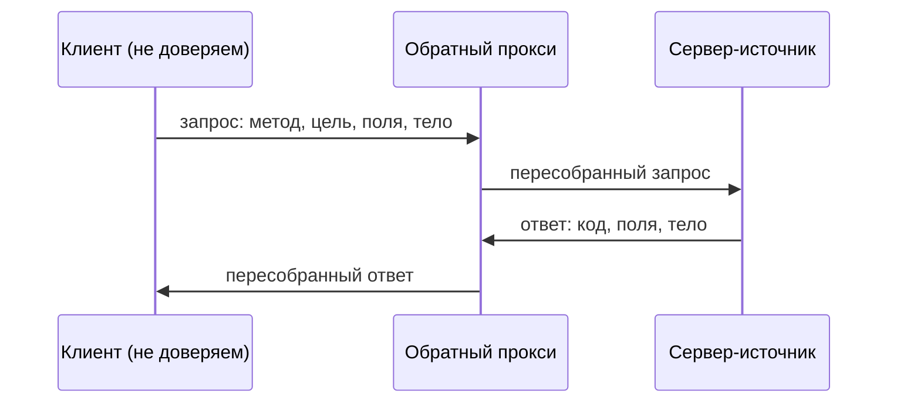

# HTTP: методы, коды ответов, заголовки

В админке одного сайта лежит недописанная статья, черновик. Удаляется она
обычной ссылкой «удалить черновик», и по нажатию на неё уходит запрос:

**Запрос**

```http
GET /page?do=delete&id=1024 HTTP/1.1
Host: admin.example.com
Cookie: session=a3fWa
```

**Ответ**

```http
HTTP/1.1 200 OK
Content-Type: text/html; charset=utf-8
```

Метод `GET` по стандарту безопасен: клиент таким запросом обещает «я только
читаю», а здесь страница удаляется, и действие выбрано не методом, а
параметром `do=delete`. По таким ссылкам ходят и автоматы без всякого
злоумышленника: роботы поисковиков, обходящие каждый найденный адрес, и
предзагрузка браузера, дёргающая ссылку заранее, чтобы страница открылась
быстрее. Они доверяют именно обещанию метода и ничего не спрашивают.

Метод — не команда и не проверка, а ярлык, который пишет клиент.
Совпадает ли он с действием обработчика, не сверяет никто: ни браузер, ни
фреймворк, ни прокси — посредник между клиентом и сервером. Весь разбор ниже стоит в этом зазоре.

## Как это работает

HTTP — текстовый протокол обмена сообщениями: клиент шлёт запрос, сервер
отвечает. Запись такого обмена, что ушло и что пришло, называют
транскриптом. Это основной артефакт проверки: отчёт сканера, тикет,
разбор инцидента — всё сводится к транскрипту запроса и ответа.

**Зачем это в работе AppSec-инженера.** Обработчик HTTP-запроса вы писали
сами. Метод в нём, скорее всего, ни разу не сверяли с тем, что код делает
на самом деле: фреймворк разбирает запрос, автор пишет логику. Именно это
расхождение и есть предмет проверки. Пока вы не читаете транскрипт сами, вы
читаете чужие выводы о нём: отчёт сканера, текст тикета, скриншот от
разработчика.

### Из чего состоит сообщение

Запрос и ответ устроены одинаково. Аналогия здесь — почтовое
отправление. Первая строка сообщения называется стартовой (start-line).
Это как главная надпись на конверте: у запроса в ней сказано, что сделать
и с чем, у ответа — что вышло. Дальше идут поля-заголовки, пары «имя:
значение». Это служебные пометки на конверте, вроде «хрупкое» или «с
уведомлением о вручении»: не содержимое, а инструкции о том, как с этим
содержимым обращаться. Затем пустая строка и, наконец, тело — само
вложение, ради которого всё затевалось. У запроса на чтение тела обычно
нет, у запроса, отправляющего форму, есть.

Где аналогия ломается: пометки на почтовом конверте проверяет почта, а
поля HTTP-сообщения не проверяет никто. Каждое имя и каждое значение
выбирает тот, кто сформировал запрос, включая атакующего.

Смотрите на настоящую пару «запрос — ответ». Возьмём чтение заказа, где
подвоха нет:

**Запрос**

```http
GET /orders/1024 HTTP/1.1
Host: example.com
Accept: application/json
Cookie: session=<PLACEHOLDER>
```

**Ответ**

```http
HTTP/1.1 200 OK
Content-Type: application/json
Content-Length: 27

{"id":1024,"status":"paid"}
```

Замените: `<PLACEHOLDER>` — значение сессионной cookie вашего стенда.

Стартовая строка запроса состоит из метода, цели запроса и версии
протокола. Стартовая строка ответа — из версии, трёхзначного кода и
поясняющей фразы. Дальше в обоих сообщениях идут поля, пустая строка и
тело, если оно есть.

Так это выглядит на проводе. Я поднял локальный сервер и попросил `curl`
показать служебный обмен флагом `-v`. Строки с `>` — то, что отправил
клиент, строки с `<` — то, что прислал сервер, остальной вывод сокращён:

```text
$ python3 -m http.server 8899 --bind 127.0.0.1 &
$ curl -v http://127.0.0.1:8899/
> GET / HTTP/1.1
> Host: 127.0.0.1:8899
> User-Agent: curl/8.22.0
> Accept: */*
>
< HTTP/1.0 200 OK
< Server: SimpleHTTP/0.6 Python/3.14.7
< Date: Fri, 02 Oct 2026 23:10:58 GMT
< Content-type: text/html; charset=utf-8
< Content-Length: 256
<
```

Здесь видно всё устройство разом. Клиент отправил стартовую строку с
методом `GET`, целью `/` и версией `HTTP/1.1`, за ней три поля и пустую
строку, а тела нет. Сервер ответил стартовой строкой с версией и кодом
`200`, четырьмя полями и пустой строкой. Тело из 256 байтов `curl`
получил, но здесь оно не приведено: смотрим на конверт, а не на вложение.
Заодно видно, что версии у сторон различаются: встроенный сервер Python
говорит на `HTTP/1.0`, и в его стартовой строке стоит именно она.

> **Примечание.** **Метод** — токен в стартовой строке, слово-маркер,
> который объявляет цель запроса. RFC 9110 § 9.1 называет его первичным
> источником семантики запроса, то есть того, что запрос значит. Токен
> **регистрозависим**, а стандартные методы по соглашению пишутся
> прописными латинскими буквами.

### Методы и что они обещают

**Откуда это взялось.** Метод в стартовой строке — объявление намерения
клиента, и поначалу это выглядело формальностью: сервер отвечает, что
попросили, а остальное его дело. Формальность перестала быть безобидной,
когда по ссылкам пошли автоматы: обходчики и предзагрузка из вступления
дёргают каждый найденный адрес, ничего не спрашивая. RFC 9110 называет
причину различения прямо: безопасные и небезопасные методы разделили
затем, чтобы обходчики и кеши работали без страха навредить. Обещание про
намерение потому и обязывает сервер: на нём построено поведение чужих
программ, которые вашего кода не видели.

RFC 9110 определяет восемь методов: `GET`, `HEAD`, `POST`, `PUT`,
`DELETE`, `CONNECT`, `OPTIONS`, `TRACE`. Из них обязательны только `GET` и
`HEAD` — остальные спецификация помечает как OPTIONAL, то есть сервер
общего назначения вправе их не поддерживать. Если сервер метод не знает,
он, как правило, отвечает `501 (Not Implemented)`; если знает, но для
этого ресурса не разрешает — `405 (Method Not Allowed)`. Обе рекомендации
спецификация даёт модальностью SHOULD (§ 9.1), а не требованием.
Требование стоит рядом: в ответе `405` сервер **обязан** прислать поле
`Allow` со списком поддерживаемых методов (§ 15.5.6).

Два свойства методов делают ревью возможным, и оба читаются через бытовые
примеры.

**Безопасный (safe)** метод — тот, чья семантика по определению только
читает: `GET`, `HEAD`, `OPTIONS`, `TRACE`. Пример — витрина магазина. Вы
говорите продавцу «я только смотрю», и это обещание про то, чего вы не
попросите: не положить товар в корзину, не списать его со склада. Что
магазин делает у себя в подсобке, вашего обещания не касается. Если на
ваше «только смотрю» магазин списал товар, виноват магазин, а не форма
слова.

Где пример ломается: витрина сама не пускает руки к товару, а
запрос с безопасным методом протокол ничем не ограничивает — обещание
выполняет только владелец ресурса. Так и здесь: «безопасный» — утверждение
о том, чего клиент **не просил**, а не о том, чего сервер не делает.

**Идемпотентный** метод — тот, у которого несколько одинаковых запросов
дают тот же эффект, что и один: `PUT`, `DELETE` и все безопасные. Пример —
кнопка вызова лифта. Нажмёте её один раз или пять, приедет один и тот же
лифт, потому что повторные нажатия ничего не добавляют. А вот кнопка
«вызвать такси» в приложении неидемпотентна: пять нажатий пришлют пять
машин.

Граница примера: лифт физически не может приехать дважды, а сервер
выполняет каждый запрос заново, и совпадает только эффект. Удаление
страницы дважды оставляет её удалённой, а создание заказа дважды создаёт
два заказа, поэтому `POST` неидемпотентен. Отсюда следствие из § 9.2.2:
прокси **не должен** автоматически повторять неидемпотентные запросы,
потому что повтор `POST` — это второй заказ, а не доставка первого.

### Коды ответов

Трёхзначный код в стартовой строке ответа объявляет результат. Читать его
начинают с первой цифры, потому что она говорит, что делать дальше и кто
виноват. Пример — ответ службы доставки: «вручили», «получатель
переехал, передайте по новому адресу», «вы ошиблись в адресе», «у нас
сломался склад». Классов пять: `1xx` информационные, обмен ещё идёт;
`2xx` успех; `3xx` перенаправление, запрос надо продолжить по другому
адресу; `4xx` ошибка клиента; `5xx` ошибка сервера. Последние две цифры
категоризирующей роли не несут. Клиент обязан понимать класс и обращаться
с незнакомым кодом как с `x00` своего класса: пришёл `471` — обрабатывай
как `400`.

У кода есть и защитная сторона. Ответ `403 (Forbidden)` на чужую страницу
подтверждает, что она существует, а `404 (Not Found)` этого не говорит.
Поэтому там, где сам факт существования ресурса не для чужих глаз,
спецификация разрешает отвечать `404` вместо `403` (§ 15.5.4). Выбор кода
— тоже раскрытие информации.

### У протокола нет памяти

У HTTP нет состояния: сервер обрабатывает каждый запрос сам по себе и не
помнит, что этот клиент присылал минуту назад. Бытовой пример — колл-центр,
где трубку каждый раз берёт новый оператор. Разговаривали вы с ним вчера
или нет, значения не имеет: придётся снова назвать номер договора, потому
что оператор вас не помнит. В HTTP роль номера договора играет
идентификатор сессии, который браузер прикладывает к каждому запросу в
поле `Cookie` — в обоих примерах выше он на месте. Как это поле устроено
и как его крадут, разбирает тема `cookies`.

Где аналогия ломается: оператор колл-центра может передать трубку коллеге
и ввести его в курс, а протокол не связывает запросы вовсе. Связь «это
тот же человек» создаёт приложение поверх протокола, и каждый запрос оно
обязано проверять заново, как первый.

Из отсутствия памяти растут две угрозы. Первая: доказательство «это я»
ходит по сети при каждом запросе, поэтому укравший идентификатор сессии
неотличим от вас. Вторая: нельзя проверить доступ один раз «на входе» и
дальше доверять. Запрос на удаление приходит отдельно от запроса на вход,
и ничто не мешает прислать только второй. Каждый запрос проверяется
заново, включая неудобные методы и пути, о которых забыли.

### Где здесь граница доверия

Границей доверия называют черту, за которой данные уже не ваши: им не
верят, пока не проверили. HTTP-сообщение приходит из-за этой черты
целиком: атакующий выбирает метод, цель запроса, каждое имя и значение
поля, тело. Между клиентом и сервером-источником стоит цепочка
посредников, и каждый разбирает сообщение заново.


```mermaid
sequenceDiagram
    participant C as Клиент (не доверяем)
    participant P as Обратный прокси
    participant O as Сервер-источник
    C->>P: запрос: метод, цель, поля, тело
    P->>O: пересобранный запрос
    O->>P: ответ: код, поля, тело
    P->>C: пересобранный ответ
```

**Описание схемы.** Клиент отправляет запрос обратному прокси, то есть
серверу, который стоит перед приложением и принимает соединения за него.
Прокси разбирает сообщение и пересобирает его для сервера-источника, а
ответ идёт тем же путём обратно. Каждая стрелка — отдельный разбор одного
и того же сообщения, и на каждом разборе трактовка может разойтись.

Спецификация формулирует это прямо: посредники по своей позиции
находятся на пути атаки, и HTTP эту проблему не решает (§ 17.2).

## Как это выглядит в коде

Ревьюер смотрит не на протокол, а на четыре вещи.

**Первое: маршрут без списка методов.** Если объявление не называет
разрешённые методы явно, список задаётся умолчанием фреймворка, а
умолчания не совпадают. Читать надо объявление, а не помнить умолчание.

**Второе: действие, выбранное параметром запроса.** RFC 9110 § 9.2.1
разбирает этот случай отдельно и ставит на него требование уровня MUST.
Если ресурс существует ради небезопасного действия, владелец **обязан**
запретить это действие при обращении безопасным методом. Иначе обещание
метода пустое. Выноски ниже, но сначала сами: какая строка меняет
состояние и что её допускает?

```text
# Псевдокод, не исполняется. УЯЗВИМО — демонстрация, не для продакшена
route "/page":                          # (1)
    action = query_param("do")          # (2)
    if action == "delete":
        delete_page()                   # (3)
```

1. Маршрут не называет разрешённые методы, поэтому отвечает и на `GET`.
2. Действие выбирается значением параметра запроса, а не методом.
3. Состояние меняется под безопасным методом.

Дальше работает не атакующий, а автоматика — та самая, что удалила
черновик в запросе, с которого тема началась. Листинг показывает тот же
разрыв без всякого трафика: намерение объявляет метод, действие выбирает
параметр, и никто их не сверяет. Что ответит этот обработчик на запрос
`DELETE /page` без параметров — и видно ли по ответу, что метод здесь
вообще ни при чём?

**Третье: поля подмены метода.** Часть фреймворков позволяет объявить
метод полем, а не стартовой строкой, чтобы обойти ограничения
промежуточного оборудования. WSTG-v42-CONF-06 называет три таких поля:
`X-HTTP-Method`, `X-HTTP-Method-Override`, `X-Method-Override`. Это и
есть обёртка, которая **не спасает**: правило на прокси, запрещающее
`DELETE`, бесполезно, если приложение исполняет `DELETE`, объявленный
полем.

**Четвёртое: отображение имён полей в имена переменных.** Шлюзовые
интерфейсы исторически заменяют в имени поля дефис подчёркиванием
(наследие CGI). RFC 9110 § 17.10 показывает результат: поле
`Transfer_Encoding` может отобразиться в ту же переменную, что и
`Transfer-Encoding`. Это даёт возможность для request smuggling, то есть
протокольной контрабанды, когда посредник и сервер понимают границы
запроса по-разному.

> **Примечание.** Ответ `405` с полем `Allow` — не находка, а требуемое
> поведение (§ 15.5.6). Ответ на `OPTIONS` со списком возможностей —
> тоже: этот метод для того и существует. Находкой их делает не факт
> ответа, а содержимое списка.

## Как защититься

Разрыв чинится двумя правками, и обе на стороне сервера, потому что ярлык
пишет клиент, а проверять обязан получатель. Первая: каждый маршрут
объявляет разрешённые методы явно. Вторая: действие определяется методом,
а не параметром запроса.

```text
# Псевдокод, не исполняется. Исправленный вариант.
route "/page", methods = ["POST"]:      # (1)
    require_csrf_token()                # (2)
    delete_page()
```

1. Список методов задан явно и содержит ровно то, что нужно обработчику.
2. Токен CSRF (Cross-Site Request Forgery, подделка межсайтового запроса)
   — метка, по которой сервер отличает вашу форму от запроса, подсунутого
   чужой страницей. Как такие метки устроены, разбирает тема `csrf-tokens`.

Пара различается одним: добавлен явный список методов, а действие
перенесено из параметра запроса в сам метод. Уязвимый листинг отвечал на
всё подряд, потому что список задавало умолчание фреймворка, и выполнял
удаление по безопасному методу, потому что действие приходило в
параметре. Теперь запрос `GET /page?do=delete` не доходит до обработчика
вовсе: метод не из списка, и маршрут отвечает `405` с полем `Allow`, как
требует спецификация.

Раздел Remediation в WSTG-v42-CONF-06 требует другого, и это требование
дополняет первое: не оставлять обходных путей вокруг ограничений,
введённых браузером, фреймворком или сервером. То есть снимать поля
подмены метода на границе, до того, как запрос дошёл до приложения.
(Первый пункт того же раздела относится к полям заголовка, а не к списку
методов.) ASVS v5.0-4.1.4 требует, чтобы использовались только методы,
явно поддерживаемые приложением или его API (включая `OPTIONS` для
проверочных preflight-запросов браузера), а неиспользуемые были
заблокированы.

**Границы применимости.** Список помогает ровно настолько, насколько он
короткий, и не защищает от смены метода **внутри** списка. Если маршрут
законно принимает и `GET`, и `POST`, а проверка доступа стоит только на
одном, список не сработает. Этот случай разбирается в теме
`access-control-bypass-headers`.

**Цена.** REST (Representational State Transfer) API законно использует
`PUT`, `DELETE` и `PATCH`, поэтому запрет «всё, кроме GET и POST» на
уровне сервера ломает работающую функциональность. Список ведётся на
маршрут, а не на сервер, то есть требует работы при каждом новом
эндпоинте. Как правило, эту работу переносят в описание API и проверяют
автоматически.

## Как убедиться, что защита работает

Список методов проверяют запросами, а не чтением конфига: конфиг
показывает, что объявлено, а запрос — что принято. На каждый метод из
объявленного списка и на пару методов вне его отправьте по запросу.
Разрешённый метод даёт код класса `2xx` или `3xx`. Если маршрут требует
входа, без сессии придут `401` или `403` — это тоже значит, что метод
принят. Неразрешённый метод даёт `405` с полем `Allow`; как выглядит
правильный `405`, показывает первый вопрос самопроверки ниже. Главный
сигнал поломки — `2xx` или `3xx` на методе вне списка: если на `DELETE`
пришёл `200`, список не работает, как бы он ни был написан.

На ревью пройдите по списку.

1. Проверьте, что каждый маршрут объявляет разрешённые методы явно, а
   неиспользуемые заблокированы — включая `PUT` и `DELETE` там, где
   приложение их не реализует (ASVS v5.0-4.1.4).
2. Проверьте, что ни один обработчик безопасного метода не меняет
   состояние, в том числе когда действие выбирается параметром запроса
   (RFC 9110 § 9.2.1).
3. Проверьте, что ответ `405` сопровождается полем `Allow`
   (RFC 9110 § 15.5.6).
4. Проверьте, что поля `X-HTTP-Method`, `X-HTTP-Method-Override` и
   `X-Method-Override` снимаются на границе либо не обрабатываются
   приложением.
5. Проверьте, что `TRACE` отключён на всех узлах цепочки.
6. Проверьте, что имена полей с подчёркиванием не отображаются в те же
   переменные приложения, что имена с дефисом (RFC 9110 § 17.10).
7. Проверьте, что код ответа не раскрывает существование ресурса там,
   где это нежелательно: `404` вместо `403` (RFC 9110 § 15.5.4).

## Частая ошибка

Расхожее мнение: раз `GET` объявлен безопасным методом, обработчик `GET`
можно смотреть менее внимательно. Решите сами, прежде чем читать дальше:
«безопасный» в описании метода — это обещание о намерении клиента или о
поведении сервера?

**Это неверно.** «Безопасный» — обещание о намерении клиента, а не
свойство вашего кода. Цепочка ошибки такова: свойство запроса молча
переносится на обработчик, а из «клиент не просил менять» выводится
«сервер не меняет».

Механизм. RFC 9110 § 9.2.1 говорит прямо: определение безопасных методов
не мешает реализации вести себя потенциально вредно, быть не полностью
read-only и давать побочные эффекты. Важно другое — клиент этого
поведения не просил и не отвечает за него. Поэтому обязанность лежит на
владельце ресурса, а не на протоколе.

Контрпример — тот же `page?do=delete`, с которого тема началась. Метод
безопасен по определению, обработчик удаляет страницу, а сканер, который
смотрит только на методы, ничего не сообщит.

## Попробуй сам

Возьмите приложение на своём стенде и перечислите методы, которые оно
принимает на трёх маршрутах: публичном, требующем аутентификации и
административном.

Одна подсказка: `OPTIONS` показывает объявленный список, а не
фактический, поэтому проверяйте каждый метод отдельным запросом.
WSTG-v42-CONF-06 предлагает для этого скрипт `http-methods` из состава
сканера Nmap.

**Критерий выполнения** наблюдаемый: у вас есть таблица из трёх строк, в
каждой перечислены методы, на которые сервер ответил кодом класса `2xx`
или `3xx`. Для каждого метода записано, ожидало ли его приложение.

## Проверь себя

1. Сервер ответил так.

```http
HTTP/1.1 405 Method Not Allowed
Allow: GET, POST
Content-Length: 0
```

   Что сообщает такой ответ и всё ли в нём по стандарту?

2. Форма заказа не даёт ввести количество больше 10.

```html
<input type="number" name="qty" max="10">
```

   Скрипт страницы проверяет то же перед отправкой. Где должна стоять
   проверка, чтобы склад не принял заказ на 10 000 штук?

   A. В скрипте страницы: его не обойти, не меняя код сайта.

   B. На сервере: запрос можно отправить и без страницы.

   C. В атрибуте и в скрипте сразу: двух проверок достаточно.

3. Почему «безопасный» метод — обещание о намерении клиента, а не о
   поведении сервера?

4. Сервер на `http.server` реализует только `GET` и `HEAD`. Что ответит
   он на `DELETE /` — `405` или `501`?

5. Прокси запрещает `DELETE`, но приложение удалило объект, получив
   такой запрос.

```http
POST /orders/17 HTTP/1.1
Host: api.example.com
X-HTTP-Method-Override: DELETE
```

   Что увидел прокси и что исполнило приложение?

<details markdown="1">
<summary>Ответ 1</summary>

1. Метод серверу известен, но для этого маршрута не разрешён — в этом
   отличие от `501`, где метод серверу незнаком. По стандарту здесь всё:
   к ответу `405` поле `Allow` обязательно (RFC 9110 § 15.5.6), и оно
   стоит. Находкой такой ответ не считается — но клиент узнал из него,
   какие методы маршрут примет.

</details>

<details markdown="1">
<summary>Ответ 2: разбор вариантов</summary>

2. Верный вариант — B.

   A. Неверно: скрипт исполняется на машине пользователя, и запрос уйдёт
      и без него — тем же `curl`.

   B. Верно: сервер получает запрос и тогда, когда страницы не было,
      поэтому единственное место, которое заказ видит всегда, — сам
      сервер.

   C. Неверно: обе проверки стоят у пользователя, и их число ничего не
      меняет: кто обошёл одну, обошёл обе.

</details>

<details markdown="1">
<summary>Ответ 3</summary>

3. Из того, кто за что отвечает. «Безопасный» значит, что клиент не
   просил изменения состояния и не отвечает за него (RFC 9110 § 9.2.1).
   Реализация при этом вправе быть вредной, и отвечает за неё владелец
   ресурса: на обещание метода опираются обходчики и кеши, которые кода
   сервера не видели. Запретить небезопасное действие при обращении
   безопасным методом обязан владелец, и обработчик, удаляющий по `GET`,
   — его нарушение, даже когда метод сам честный.

</details>

<details markdown="1">
<summary>Ответ 4</summary>

4. `501`: про `DELETE` этот сервер не знает ничего, а `405` — ответ про
   известный, но не разрешённый здесь метод. Проверяется прогоном:

   ```bash
   python3 -m http.server 8899 &
   curl -si -X DELETE http://127.0.0.1:8899/ | head -1
   ```

   ```text
   HTTP/1.0 501 Unsupported method ('DELETE')
   ```

</details>

<details markdown="1">
<summary>Ответ 5</summary>

5. Прокси видит `POST` и пропускает запрос; приложение читает поле
   `X-HTTP-Method-Override` и исполняет удаление. Правило на прокси про
   такой запрос ничего сказать не может, поэтому поля подмены метода
   снимают на границе — до того, как запрос дошёл до приложения
   (WSTG-v42-CONF-06).

</details>

> **Примечание.** Вопросов на возврат к прошлым темам здесь нет: это
> первая тема гайда. Блок «Проверь себя» следующих тем возвращается в
> том числе сюда.

## Источники

1. RFC 9110 «HTTP Semantics», IETF, STD 97, июнь 2022; реестр
   `rfc9110-http-semantics`. Разделы: § 3.7 посредники, § 5 поля, § 9
   методы, § 15 коды ответов, § 17 вопросы безопасности.
   <https://www.rfc-editor.org/rfc/rfc9110.html>
2. OWASP WSTG-v42-CONF-06 «Test HTTP Methods», WSTG v4.2; реестр
   `wstg-v42-conf-06-http-methods`.
   <https://owasp.org/www-project-web-security-testing-guide/v42/4-Web_Application_Security_Testing/02-Configuration_and_Deployment_Management_Testing/06-Test_HTTP_Methods>

Каркас этапа: `owasp-asvs-5-document` (ASVS v5.0.0) — наследуется всеми
темами этапа 0.

**Маркеры уверенности.** Всё, что относится к семантике методов, кодов и
полей, — по спецификации (RFC 9110, открыт лично 2026-08-22). Поля
подмены метода и процедура перечисления — по документации
(WSTG-v42-CONF-06, открыт лично 2026-08-22). Требование 4.1.4 сверено с
текстом ASVS v5.0.0 (открыт лично 2026-08-22). Отсутствие состояния у
протокола — общеизвестное свойство HTTP, отдельным источником в этой
теме не подкреплено. Аналогии с конвертом, витриной, лифтом и
колл-центром авторские, механизм под ними тот, что в § 9. Сценарий с
удалённым черновиком — иллюстрация: механизм в нём тот, что описан в
§ 9.2.1, а разобранного случая за ним нет. Транскрипт `curl -v` и ответ
`501` на `DELETE` прогнаны локально 2026-10-03, Python 3.14.7, curl
8.22.0; вывод `curl` сокращён до строк запроса и ответа.
