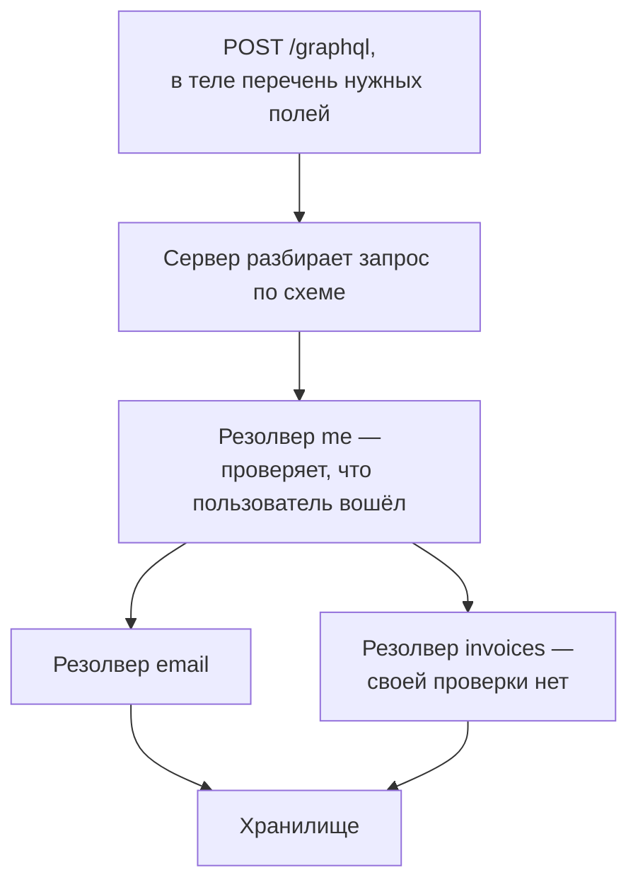

# Устройство REST и GraphQL API: где точки входа

Ревью API начинается с перечня точек входа, то есть списка всего, что можно
вызвать снаружи. У магазина из этого примера перечень уже собран. В нём
двенадцать адресов вроде `GET /orders/1024` и `POST /checkout/pay`, а
тринадцатой строкой — `POST /graphql`. Это единственный адрес второго,
отдельного API магазина, и им пользуется мобильное приложение. Перечень
выглядит законченным. А потом на этот тринадцатый адрес приходит такой запрос:

**Запрос**

```http
POST /graphql HTTP/1.1
Host: api.shop.example
Content-Type: application/json
Cookie: session=a3fWa

{"query":"{ me { email invoices { id total pdfUrl } } }"}
```

**Ответ**

```http
HTTP/1.1 200 OK
Content-Type: application/json

(тело опущено: полтора мегабайта счетов)
```

В ответе — все счета пользователя за четыре года, полутора мегабайтами. При
этом здесь нет ни инъекции, ни украденной сессии: сессия своя, адрес
законный и входит в перечень. Дефект сидит в самом перечне. Запрос попросил
поле `me`, и функция за этим полем честно проверила, что запрос прислал
вошедший пользователь. А вот поле `invoices` обслуживает отдельная функция,
и она в перечень не попала: ни своей проверки, ни предела размера у неё
нет.

Проверка оказалась на входе в объект «пользователь», а не на самих данных,
поэтому счета получит всякий, кто доберётся до объекта любым другим путём.
Другой путь — любое соседнее поле, которое возвращает тот же объект
пользователя, например поиск `userByName`.
Точкой входа называют место, куда снаружи посылают запрос и получают ответ.
Пример показывает главное свойство такого перечня: что в него не попало, то
никем не проверено. А вызвать это можно наравне с остальным. Что изменится,
если проверку перенести с `me` на `invoices`, — дефект исчезнет или
переедет?

## Как это работает

Перечень точек входа у двух стилей собирается по-разному, потому что
по-разному устроено само обращение к API.

**Зачем это в работе AppSec-инженера.** Маршрут в API вы объявляли сами, а
описание для мобильного приложения писали или видели рядом. Перечня того,
что снаружи можно вызвать, при этом обычно никто не составляет: он
складывается сам, из объявлений. На ревью этот перечень и есть работа.
Пропущенная точка входа не находится никогда: ни сканером, который её не
увидел, ни ревьюером, который до неё не дошёл. Перечень — единственный
способ отличить «проверено» от «посмотрели, что дали».

### REST: ресурс и операции над ним

REST — стиль устройства API, в котором главное понятие — ресурс. Ресурс — это
сущность предметной области, с которой работает приложение: заказ, счёт,
пользователь. У каждого ресурса есть адрес, например `/orders/1024` — это
заказ с номером 1024. Адрес, по которому приложение принимает запрос,
называют эндпоинтом (англ. endpoint, «конечная точка»).

Метод HTTP в этом стиле играет роль операции над ресурсом. Строка
`GET /orders/1024` читается как «дай заказ 1024», `DELETE /orders/1024` —
«удали заказ 1024», а `POST /checkout/pay` — «проведи оплату». Один и тот
же адрес с разными методами — это разные операции: `GET /orders` отдаёт
список заказов, а `POST /orders` создаёт новый.

Всё вместе похоже на окно выдачи в библиотеке. Чтобы получить книгу, вы
называете три вещи: место (окно), действие («выдать») и предмет (карточку
книги). В REST та же тройка: эндпоинт — окно, метод — действие, ресурс —
предмет. Аналогия ломается в одном месте: окно в библиотеке одно на все
книги, а в приложении адресов столько, сколько объявлено ресурсов и операций.
Поэтому перечень точек входа REST — это список пар «метод и путь»: сколько
таких пар объявлено, столько мест и надо проверить. Объявление в коде, какая
функция отвечает за конкретную пару, называют маршрутом — маршруты вы и
писали, когда объявляли обработчики.

### OpenAPI: перечень, который читает машина

Вычитывать маршруты из кода вручную долго и ненадёжно, поэтому для
REST API пишут отдельное описание. OpenAPI — формат такого описания:
машиночитаемый документ, где перечислены пути, операции на каждом пути,
параметры, тела запросов и схемы безопасности. Из документа версии v3.2.0
перечень точек входа собирается автоматически, и для ревьюера это готовый
перечень — при одном условии: описание соответствует коду. На этой оговорке
держится всё, и к ней мы вернёмся в разделе «Как защититься».

Параметр операции приходит не только из адреса. Спецификация называет пять
мест, и поле `in` у параметра говорит, из какого именно:

- `path` — часть самого адреса, например `itemId` в `/items/{itemId}`;
- `query` — отдельные пары «имя=значение» после знака вопроса в адресе;
- `querystring` — вся строка после знака вопроса целиком, одним значением;
- `header` — поля заголовка запроса;
- `cookie` — значения, которые клиент прислал в заголовке `Cookie`.

Все пять мест надо знать потому, что недоверенные данные приходят из
каждого. Проверка, которая смотрит только в `path` и `query`, молча
пропускает параметр из заголовка.

> **Примечание.** Место `querystring` появилось в версии 3.2.0 и не может
> встречаться в одной операции вместе с `query`. Предыдущая версия его не
> знает: 3.1.1 говорит «There are four possible parameter locations» и
> перечисляет `path`, `query`, `header`, `cookie`. Описание, написанное под
> 3.1, этого места не знает, и при сверке с кодом расходится первым.

### GraphQL: схема, чтение и изменение

**Откуда это взялось.** В REST форму ответа задаёт сервис: на каждом адресе
лежит заранее решённый набор полей. Экрану в клиенте нужен свой набор, и он
редко совпадает с серверным: часть данных приезжает лишней, а за недостающей
приложение идёт вторым и третьим запросом. GraphQL придумали как ответ ровно
на это неудобство: клиент сам называет в запросе, какие поля ему нужны, и
ответ содержит ровно их. Спецификация GraphQL называет это отправной точкой
своего устройства. Из неё же следуют два изменения, важных для ревью:
перечень доступного клиент читает из схемы сам, а цену запроса теперь
называет клиент, а не сервис.

GraphQL — другой стиль устройства API, и главное понятие в нём не ресурс, а
граф сущностей. Граф — это сущности плюс ссылки между ними: у пользователя
есть счета, у счёта — заказ, и запрос идёт по этим ссылкам. Учебные
материалы graphql.org формулируют различие прямо: HTTP принято связывать с
REST, где основное понятие — ресурс, а понятийная модель GraphQL — граф,
поэтому сущности не адресуются URL. Практическое следствие: адрес у сервера
один, обычно `/graphql`, и все запросы идут туда.

Откуда сервер знает, что вообще можно спросить? Из схемы — формального
описания всех типов и полей API. Схема работает как меню в ресторане: в ней
перечислено, что можно заказать и из чего состоит каждая позиция. Например:
«пользователь, у него есть email и список счетов». Аналогия ломается на
кухне: меню не говорит, кто и как готовит блюдо. За каждым полем схемы
стоит своя функция, её называют резолвером, и именно она идёт в хранилище
за данными. Схема резолверов не показывает: снаружи видны поля, а не их
начинка.

Операции в схеме бывают трёх родов, и два из них понадобятся в этой теме.
Query — чтение, аналог `GET`: данные достаются, но ничего не меняется.
Mutation — изменение, аналог `POST`: создать заказ, оплатить счёт. Третий
род — подписка — встретится в разделе про интроспекцию.

Сервер обязан обрабатывать `POST` для запросов и мутаций, а `GET` может
принимать, и то только для операций чтения. Тело запроса `POST` несёт объект
JSON, и обязательно в нём одно поле `query` — его вы видели в запросе из
начала темы. Остальные поля необязательны: `operationName` выбирает одну
операцию из нескольких в теле, `variables` несёт значения параметров
запроса, `extensions` — служебные добавки. Ответ возвращается объектом с
полями `data` (запрошенные данные), `errors` (ошибки по полям) и
`extensions`.



**Описание схемы.** Схема читается сверху вниз. Запрос приходит на один
адрес, а дальше сервер вызывает резолвер каждого запрошенного поля, и у
каждого резолвера свой поход в хранилище. Адрес на схеме один, а точек
входа три — по числу резолверов, которые исполнит этот запрос.

Осталось понять, где в этой картине проверки доступа. Здесь два разных
вопроса, и их часто путают. Аутентификация отвечает на вопрос «кто пришёл» —
вошедший это пользователь или нет. Авторизация отвечает на другой вопрос —
«что этому пользователю можно». Учебные материалы называют место GraphQL в
конвейере прямо: он ставится после всего промежуточного слоя
аутентификации. А после аутентификации сервер не должен принимать решений об
авторизации до начала исполнения.

Причина конструктивная: решение зависит от конкретного поля и конкретного
объекта, а они становятся известны только в резолвере. Поэтому авторизацию на
уровне поля выполняет бизнес-логика, которую вызывают резолверы. У такого
устройства есть и плюс: получается частичный ответ, где поля без доступа
приходят с ошибками, а остальные — с данными.

### Интроспекция: схема рассказывает о себе

Схему можно спросить о ней самой. Такая возможность называется
интроспекцией, и её границы задаёт спецификация. Зачем это ревьюеру:
интроспекцией атакующий читает перечень полей тем же запросом, бесплатно и
без доступа к коду.

Спросить список типов и полей позволяют служебные поля `__schema` и
`__type`, и спецификация разрешает их только в корне операции чтения. Ещё
одно служебное поле, `__typename`, разрешено почти в любом месте запроса, в
любом списке полей в фигурных скобках. Единственное исключение — корень
операции подписки, где сервер сам присылает клиенту обновления. Вернёт
`__typename` имя типа того объекта, который оказался в этой точке ответа.
Отсюда правило имён: собственное имя в системе типов не начинается с двух
подчёркиваний, этот префикс зарезервирован за интроспекцией. Двойное
подчёркивание — метка служебных полей.

## Чем отличается поверхность атаки

Поверхность атаки — это всё, что можно вызвать снаружи: каждая точка входа,
которую увидит тот, кто смотрит на приложение со стороны клиента. Теперь,
когда устройство обоих стилей разобрано, различие складывается в одну
таблицу:

| | REST | GraphQL |
|---|---|---|
| Точка входа | пара «метод и путь» | поле схемы со своим резолвером |
| Сколько адресов | по одному на ресурс | один, обычно `/graphql` |
| Где виден перечень | в маршрутах и в описании OpenAPI | в схеме |
| Кто назначает цену запроса | сервис, набором полей ответа | клиент, составом запроса |
| Что перечисляет ревьюер | маршруты | поля схемы |

Предпоследняя строка таблицы — причина отдельной заботы GraphQL. В REST
стоимость запроса примерно задана эндпоинтом: `GET /orders/1024` всегда
отдаёт один заказ. В GraphQL цену называет клиент, и один запрос может
попросить хоть всю базу. Поэтому учебные материалы перечисляют меры контроля
спроса — ограничений на то, сколько работы разрешено заказать одним
запросом. У REST этих мер нет за ненадобностью:

- доверенные документы — сервер заранее регистрирует разрешённые операции и
  принимает только их, а запрос, сочинённый на месте, отвергает;
- пагинация списочных полей — список отдаётся порциями по несколько записей,
  а не целиком;
- ограничение глубины вложенности — запрос «друзья друзей друзей…»
  обрывается на заданном уровне;
- ограничение ширины и числа операций в пакете — сколько полей и операций
  разрешено в одном запросе;
- ограничение частоты в слое бизнес-логики — предел «не больше стольких-то
  вызовов в минуту» считается там, где известна цена каждого вызова;
- анализ сложности запроса — у каждого типа и поля есть вес, и запрос с
  суммой весов выше предела отвергается ещё до исполнения.

Конкретные уязвимости GraphQL-серверов разбирает тема `graphql-vulns`. Здесь
дальше — то, что видит ревьюер до всяких уязвимостей: перечень и проверки на
нём.

## Как это выглядит в коде

Один и тот же класс дефекта — точка входа без своей проверки — выглядит в
двух стилях по-разному. В обоих фрагментах найдите три вещи, до чтения
выносок: где в код входят недоверенные данные, какие ограничения приёма
заявлены и где должна стоять проверка доступа.

**REST: маршрут без ограничений приёма.**

```text
# Псевдокод, не исполняется. УЯЗВИМО — демонстрация, не для продакшена
route "/api/v1/checkout/confirm":            # (1)
    order = parse_body(request.body)         # (2)
    finalize(order)                          # (3)
```

1. Маршрут объявлен без списка методов, без ограничения типа содержимого и
   без предела размера тела: сервер примет этот адрес любым методом и с
   любым телом.
2. Тело разбирается без сверки с объявленным типом: что бы клиент ни
   прислал, оно попадёт в `order`.
3. Оформление исполняется без проверки того, что предыдущие шаги пройдены.
   Cheat Sheet называет это исполнением вне очереди: атакующий обращается к
   `POST /checkout/confirm`, не выполнив `POST /checkout/pay`.

**GraphQL: проверка на верхнем поле вместо поля с данными.**

```graphql
# УЯЗВИМО — демонстрация, не для продакшена. Фрагмент схемы
type Query {
  me: User                    # (4) проверка стоит здесь
}
type User {
  email: String
  invoices: [Invoice!]!       # (5) а данные отдаются здесь
}
```

4. Резолвер `me` проверяет, что запрос аутентифицирован, и возвращает объект
   пользователя. Проверка стоит на входе в объект.
5. Поле `invoices` — самостоятельная точка входа со своим резолвером. Оно
   отдаёт список без ограничения размера и без собственной проверки, поэтому
   список получает всякий, кто дошёл до объекта. Отсюда и уехали счета в
   запросе, с которого тема началась.

Этот пример показывает: у такого дефекта нет строки «здесь ошибка» — есть
строка, которой нет. Поэтому ревьюер перечисляет точки входа, а не ищет
подозрительное. В REST признак — объявление маршрута: есть ли список
методов, есть ли ограничение типа содержимого вроде `@consumes`, есть ли
предел размера. В GraphQL признак — уровень, на котором стоит проверка:
если она стоит в резолвере корневого поля, все вложенные поля не защищены
ничем. Оба признака видны без запуска кода.

> **Примечание.** Включённая интроспекция сама по себе находкой не служит.
> Учебные материалы называют её выключение «security through obscurity» и
> говорят, что одного этого недостаточно. Даже при выключенной интроспекции
> форма схемы выводится перебором имён полей по подсказкам в сообщениях об
> ошибках.

## Как защититься

Защита складывается из двух слоёв. Первый — ограничения приёма на каждой
точке входа: метод, тип содержимого, размер. Второй — проверка состояния и
доступа на самих данных. Исправленный маршрут из фрагмента выше выглядит
так:

```text
# Псевдокод, не исполняется. Исправленный вариант, сторона REST.
route "/api/v1/checkout/confirm",
      methods = ["POST"],                    # (1)
      consumes = "application/json",         # (2)
      max_body = 64 * 1024:                  # (3)
    require_state(order_id, "paid")          # (4)
    finalize(order)
```

Ответ стоит сформулировать до раскрытия: какая из четырёх строк осталась бы
нужной, даже если бы все остальные три были на месте?

<details markdown="1">
<summary>Разбор выносок</summary>

1. Список методов задан явно, и всё, что вне списка, получает ответ `405`.
2. Тип содержимого проверяется: Cheat Sheet предписывает отвергать запросы с
   неожиданным или отсутствующим типом ответом `406` либо `415`.
3. Предел размера тела задан, превышение отвергается ответом `413`.
4. Четвёртая — та самая. Ограничения приёма ничего не знают о порядке
   шагов: состояние рабочего процесса проверяется на сервере при каждом
   запросе, и это единственное, что закрывает исполнение вне очереди.

</details>

Со стороны GraphQL то же требование выглядит как перенос проверки. Она
уходит из резолвера корневого поля в бизнес-логику, которую вызывает
резолвер `invoices`, а само поле получает пагинацию. Запрос из начала темы
после такой правки отдаёт первую страницу списка, и проверку он проходит на
самом поле. Это и есть ответ на вопрос из введения. Дефект не переехал, а
закрылся: проверка встала на то поле, которое отдаёт данные, а не на
поле-вход в объект.

**Оставшийся зазор.** Перечень точек входа верен ровно настолько, насколько
описание соответствует коду. Описание OpenAPI пишут руками, схему GraphQL
часто порождают из моделей. Во втором случае новое поле модели становится
новой точкой входа само собой, без единой строки кода и без ревью.

**Накладные расходы.** Проверка на уровне поля повторяется в каждом резолвере
и стоит обращений к хранилищу. Отсюда требование учебных материалов выносить
её в бизнес-логику, а не писать в каждом резолвере заново: без выноса
проверки расходятся.

## Как убедиться, что защита работает

Проверка починки здесь — это пересобранный перечень. Соберите перечень точек
входа заново, уже по исправленному коду, и сравните с прежним: каждая новая
строка обязана получить объяснение. Запрос из начала темы послужит и
ретестом: исправленный сервер отвечает на него первой страницей списка, а не
полутора мегабайтами. На ревью пройдите по списку.

1. Проверьте, что перечень точек входа получен из описания API или схемы и
   сверен с маршрутами в коде.
2. Проверьте, что каждый маршрут REST объявляет список допустимых методов и
   отвергает остальные ответом `405`.
3. Проверьте, что тип содержимого запроса проверяется, а неожиданный или
   отсутствующий отвергается ответом `406` либо `415`. Тем же пунктом
   закрывается размер: предел задан, а превышение отвергается ответом `413`.
4. Проверьте, что шаги многошагового процесса проверяют состояние на сервере, а
   не полагаются на порядок вызовов с клиента.
5. Проверьте, что в GraphQL проверка доступа стоит на том поле, которое отдаёт
   данные, а не только на корневом.
6. Проверьте, что для GraphQL заданы пределы глубины, ширины и размера пакета
   операций, а списочные поля пагинированы.
7. Проверьте, что чувствительные операции вызываются небезопасными методами,
   то есть меняющими состояние (`POST`, `PUT`, `DELETE`), а не `GET`
   (ASVS v5.0-3.5.3).

## Частая ошибка

Общее место звучит так: у GraphQL один эндпоинт, значит, и защищать надо
один эндпоинт. Прежде чем читать дальше, найдите сами, в каком шаге этого
рассуждения сбой.

Сбой сидит в слове «значит». Из одного адреса выводится один периметр, а
периметр в GraphQL проходит по полям схемы, а не по адресам. Один адрес —
свойство транспорта, а не модели доступа.

Почему так, видно из устройства. За `/graphql` стоит схема, и каждое её поле
исполняется своим резолвером. Правило на прокси, разрешающее
`POST /graphql`, разрешает всё, что можно выразить схемой: запрос из начала
темы прошёл таким правилом наравне с законными запросами приложения.
Ограничение частоты по числу запросов тоже не работает. Учебные материалы
отмечают, что сервер заранее не знает, насколько дорого обойдётся конкретный
набор полей, и советуют применять ограничения в слое бизнес-логики.

Контрпример строится на псевдонимах. Псевдоним — это способ попросить одно и
то же поле несколько раз внутри одного запроса, дав каждому вызову своё имя:
`friends1: friends(limit: 1)` … `friends100: friends(limit: 100)`. Такой
запрос остаётся одним запросом `POST` и проходит любой ограничитель,
который считает запросы. Учебные материалы приводят ровно этот случай и
называют меру: ограничивать число полей верхнего уровня и псевдонимов в
одной операции.

## Попробуй сам

Возьмите один API и соберите перечень его точек входа двумя независимыми
способами: из описания или схемы и из кода.

Подсказка одна: расхождение почти всегда одностороннее — в коде находится то,
чего нет в описании, а не наоборот.

**Критерий выполнения.** Готов список операций. Для REST в каждой строке:
метод, путь, места параметров, требуется ли аутентификация. Для GraphQL: имя
поля, тип, возвращает ли список, где стоит проверка доступа. Отдельным
абзацем — перечень расхождений между двумя способами сбора и вывод, какой из
двух источников оказался неполным.

## Проверь себя

1. Соберите точку входа из этого описания — метод, путь, места параметров.

   ```yaml
   paths:
     /items/{itemId}:
       get:
         parameters:
           - name: itemId
             in: path
             required: true
           - name: debug
             in: query
   ```

2. Проверка аутентификации стоит в резолвере `order`. Где здесь дефект?

   ```graphql
   type Query {
     order(id: ID!): Order
   }

   type Order {
     id: ID!
     paymentDetails: String
   }
   ```

3. Запрос из начала темы увёз все счета. Какую починку выбрать?

   A. Поставить проверку аутентификации на `/graphql` целиком: адрес один.

   B. Перенести проверку в резолвер поля `invoices` и дать полю пагинацию.

   C. Выключить интроспекцию: тогда схему никто не увидит.

4. Ограничитель частоты пропускает 10 запросов в минуту. Что произойдёт с таким
   телом — сколько запросов посчитает ограничитель и сколько раз исполнится
   поле?

   ```json
   {"query":"{ f1: friends { id } f2: friends { id } }"}
   ```

5. Почему авторизация на уровне поля выполняется во время исполнения, а не
   раньше?

6. Возврат к теме `app-architecture`: почему перечень точек входа, собранный
   на обратном прокси, будет неполным?

<details markdown="1">
<summary>Ответ 1</summary>

1. `GET /items/{itemId}`; параметры приходят из двух мест: `itemId` из пути,
   `debug` из строки запроса. И перечень верен ровно настолько, насколько
   описание соответствует коду, — поэтому его сверяют с маршрутами в коде.

</details>

<details markdown="1">
<summary>Ответ 2</summary>

2. Поле `paymentDetails` отдаётся своим резолвером без проверки: всякий, кто
   добрался до объекта `Order` любым другим путём, получит данные. Проверка
   стоит на входе в объект, а не на данных.

</details>

<details markdown="1">
<summary>Ответ 3: разбор вариантов</summary>

3. Верный вариант — B.

   A. Неверно: один адрес — свойство транспорта; за ним схема, где каждое поле
      исполняется своим резолвером. Проверка на адресе про поля не знает
      ничего.

   B. Верно: проверка переносится на то поле, которое отдаёт данные, а
      пагинация закрывает размер списка.

   C. Неверно: это «security through obscurity» — форма схемы выводится
      перебором имён полей по подсказкам в сообщениях об ошибках.

</details>

<details markdown="1">
<summary>Ответ 4</summary>

4. Ограничитель посчитает один запрос, а поле исполнится дважды. Прогон —
   сервер, который печатает оба числа:

   ```python
   import re
   from http.server import BaseHTTPRequestHandler, HTTPServer

   class H(BaseHTTPRequestHandler):
       def do_POST(self):
           body = self.rfile.read(int(self.headers["Content-Length"]))
           n = len(re.findall(rb"\w+\s*:\s*friends", body))
           print("HTTP: 1, вызовов friends:", n, flush=True)
           self.send_response(200)
           self.end_headers()
           self.wfile.write(b'{"data": {}}')

   HTTPServer(("127.0.0.1", 8906), H).serve_forever()
   ```

   ```bash
   python3 srv.py &
   curl -s -X POST http://127.0.0.1:8906/graphql \
     -H "Content-Type: application/json" \
     -d '{"query":"{ f1: friends { id } f2: friends { id } }"}'
   ```

   ```text
   HTTP: 1, вызовов friends: 2
   ```

   Поэтому курс требует ограничивать число полей и псевдонимов в одной
   операции, а не только частоту запросов.

</details>

<details markdown="1">
<summary>Ответ 5</summary>

5. Потому что решение зависит от конкретного поля и конкретного объекта, а они
   становятся известны только в резолвере. Вторая причина из курса: так
   получается частичный ответ с ошибками там, где доступа нет.

</details>

<details markdown="1">
<summary>Ответ 6</summary>

6. Прокси видит адреса, а не схему: за одним адресом `/graphql` скрыты все
   поля, и в перечне они не появятся. Для REST перечень с прокси тоже неполон,
   если часть маршрутов доступна только изнутри.

</details>

## Источники

1. OpenAPI Specification v3.2.0, OpenAPI Initiative, 19 сентября 2025; реестр
   `openapi-spec`. Разделы: § 4.12.1 места параметров, § 4.27 схемы
   безопасности.
   <https://spec.openapis.org/oas/latest.html>
2. OpenAPI Specification v3.1.1, OpenAPI Initiative, 24 октября 2024; реестр
   `openapi-311`. Раздел: § 4.8.12.1 места параметров — вторая сторона
   сравнения версий.
   <https://spec.openapis.org/oas/v3.1.1.html>
3. GraphQL specification, September 2025 Edition, GraphQL Specification
   Project; реестр `graphql-spec`. Разделы: § 4.1 интроспекция имени типа,
   § 4.2 интроспекция схемы, врезка Reserved Names в разделе 4.
   <https://spec.graphql.org/September2025/>
4. «Serving over HTTP», graphql.org/learn; реестр
   `graphql-learn-serving-over-http`. Разделы: API endpoint, Where auth
   happens, Request format, Response format.
   <https://graphql.org/learn/serving-over-http/>
5. «Security», graphql.org/learn; реестр `graphql-learn-security`. Разделы:
   Demand control, Introspection, Error messages.
   <https://graphql.org/learn/security/>
6. OWASP REST Security Cheat Sheet; реестр `owasp-cs-rest-security`. Разделы:
   Restrict HTTP methods, Preventing Out-of-Order API Execution, Input
   validation, Validate content types, JWT.
   <https://cheatsheetseries.owasp.org/cheatsheets/REST_Security_Cheat_Sheet.html>

Каркас этапа: `owasp-asvs-5-document` (ASVS v5.0.0) — наследуется всеми темами
этапа 0.

**Скоропортящийся слой.** Три источника из шести — живые документы без даты
правки. Спецификация GraphQL-over-HTTP, на которую опирается страница про
транспорт, остаётся черновиком и сама названа там незавершённой. Адрес
`spec.openapis.org/oas/latest.html` намеренно не зафиксирован на версии:
сверять номер при каждом использовании; адреса `v3.1.1.html` и `September2025`
зафиксированы и не поедут. Издания спецификации GraphQL сменяются — на
2026-08-23 текущее сентябрьское 2025 года, рабочий черновик от 4 июня 2026.

**Число источников.** Шесть собственных, и это цена сравнения: тема покрывает
два стиля API, у каждого нормативный документ и учебная сторона, а сравнение
версий OpenAPI требует обеих версий сразу.

**Маркеры уверенности.** Пять мест параметра и статус версии — по
спецификации (OpenAPI v3.2.0, открыта лично 2026-08-22). Четыре места в
предыдущей версии — по спецификации (OpenAPI v3.1.1, открыта лично
2026-08-23). Доступность `__schema`, `__type`, `__typename`, правило имён и принцип
«ответ содержит ровно то, что клиент попросил» — по спецификации (GraphQL,
September 2025 Edition, открыта лично 2026-08-23;
до этой правки утверждение об интроспекции стояло со словом «обязывает» и без
названного источника). Единственный адрес, методы, формат тела и ответа, место
в конвейере, меры контроля спроса, оговорка про интроспекцию — по документации
(две страницы graphql.org/learn, открыты лично 2026-08-22). Коды отказа, проверка типа содержимого, исполнение
вне очереди и проверяемые утверждения токена — по документации (OWASP REST
Security Cheat Sheet, открыт лично 2026-08-22). Требование 3.5.3 сверено с
текстом ASVS v5.0.0 (открыт лично 2026-08-22). Ни один запрос не отправлялся:
стенда под рукой не было. Прогон ответа 4 повторён 2026-10-03 локально
(Python 3.14.7, сервер на `http.server` и `curl` на 127.0.0.1): вывод совпал,
«HTTP: 1, вызовов friends: 2».
