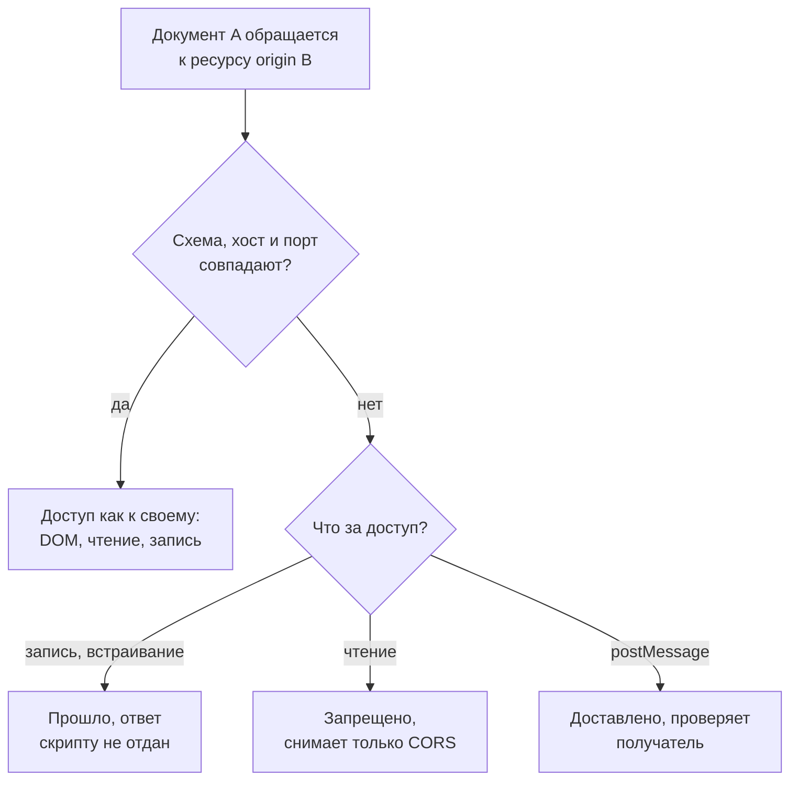

# Same-Origin Policy: что именно ограничивает и что нет

Уровень **L1** · время 93 мин (теория 43 / лаба 35 / самопроверка 15,
оценка)

Что прочитать сначала: `http-basics`, `url-and-encoding`.

Кабинет пользователя встраивает виджет курсов, тот живёт на отдельном имени.
Настройки виджет присылает в главное окно сообщением, а кабинет их применяет.
То же самое делает страница на чужом сайте: она встраивает кадром сам кабинет и
посылает ему сообщение той же формы.

```javascript
// Страница на чужом сайте. Демонстрация, не для продакшена.
const frame = document.createElement('iframe');
frame.src = 'https://app.example/cabinet';
frame.onload = () => frame.contentWindow.postMessage(
  '{"theme":"взломано"}', '*');
document.body.append(frame);
```

**Было — стало.** До сообщения тема кабинета «светлая», после — «взломано».

Ни пароля, ни сессии здесь не касались, а прочитать в кабинете чужая страница
не может ничего. Документ кадра ей закрыт, ответ сервера приложения — тоже; это
ровно то, что политика запрещает. Послать сообщение она может: `postMessage` —
один из немногих способов обратиться к чужому окну, и он открыт по замыслу.
Дефект на принимающей стороне: обработчик применил присланное, не спросив, кто
прислал.

Браузер держит страницы разных сайтов врозь: скрипт одного сайта не читает
данные другого. Правило разделения называют политикой одного источника,
same-origin policy. Источник — тройка из адреса страницы: схема, хост и порт.
Две страницы с одинаковой тройкой браузер считает своими друг для друга, с
разными — чужими.

Запрет касается чтения. А отправить запрос, встроить чужую страницу кадром и
послать в её окно сообщение скрипт может — политика этого не закрывает.

К этому сообщению тема возвращается четырежды. «Эксплуатация» проводит его на
стенде рядом с тем, что политика останавливает. «Как выглядит в коде»
показывает обработчик, в трёх строках которого весь дефект. «Как чинится»
задаёт порядок проверок, «Ловушка» объясняет, почему проверки одного адреса
виджета не хватает.

Обходы политики разбираются в подразделе 1.4, подделка межсайтовых запросов —
в теме `csrf-mechanics`.

## 0. Коротко

То же в терминах, которыми это обсуждают. Origin — кортеж из схемы, хоста и
порта. Браузер считает два документа с одинаковым кортежем доверяющими друг
другу и разрешает им всё, а документам с разными кортежами — почти ничего.
«Почти» и есть предмет темы: политика перекрывает **чтение** чужого ответа, но
не мешает ни отправить запрос, ни встроить чужой ресурс. Эти границы в обе
стороны правят три механизма: CORS (Cross-Origin Resource Sharing), CSP
(Content Security Policy) и cookie-атрибуты. Все три стоят поверх этой модели
и без неё не читаются.

**Зачем это в работе AppSec-инженера.** Кадр с чужого домена вы встраивали,
сообщения между окнами через `postMessage` писали. На то, что браузер лишнего
не пропустит, при этом полагались молча: работает и так. Половина споров о том,
уязвимость это или нет, сводится к вопросу «а что атакующий смог прочитать».
Ответ даёт не интуиция, а правило сравнения origin и список того, что политика
пропускает.

## 1. Цели

После этого раздела вы сможете:

1. Разложить URL на кортеж origin и сравнить два origin по правилу HTML
   Standard.
2. Назвать, что политика запрещает, что разрешает и где разрешённое протекает.
3. Найти обработчик `postMessage` без проверки происхождения сообщения и
   написать правило, которое его ловит.
4. Объяснить, почему присваивание `document.domain` отключает сравнение
   портов.
5. Отличить границу origin от границы cookie.

## 2. Предвопросы

Ответьте до чтения, даже если не уверены.

1. Страница с `http://a.example:8080` и страница с `http://a.example:9090` —
   это один origin или два? Изменится ли ответ, если обе присвоят
   `document.domain`?
2. Чужая страница отправляет `POST` в ваш сервис. Что ей помешает отправить
   запрос и что помешает прочитать ответ?
3. Обработчик получил сообщение через `postMessage`. Что в этом сообщении
   отправитель подделать не может?

## 3. Механика

**Откуда это взялось.** Браузер держит документы из множества источников в
одной программе. И у него есть то, чего нет ни у одного из этих документов:
ваши cookie, ваши открытые сессии, ваш доступ во внутреннюю сеть. Без границы
между документами страница из соседней вкладки распоряжалась бы этими правами
свободно. Статья web.dev описывает эту угрозу так: взломанный скрипт
раскрывает всё, что открыто в браузере пользователя. Конкретный случай — сайт
из интернета, читающий чужую веб-почту или страницу корпоративной сети, куда
атакующему снаружи не попасть. Границу провели по признаку, который машина
проверяет сама, без участия человека, — по кортежу из схемы, хоста и порта.

Отсюда и требование ASVS v5.0-3.5.4: отдельные приложения размещают на
отдельных хостах, чтобы граница между ними держалась на этой политике, включая
ограничения cookie по хосту.

### Кортеж и сравнение

HTML Standard называет origin «фундаментальной валютой модели безопасности
веба». Два актора с общим origin считаются доверяющими друг другу и имеющими
одинаковые полномочия. Акторы с разными origin — потенциально враждебными.

Спецификация различает два вида. **Opaque origin** — внутреннее значение без
восстановимой записи, сериализуется строкой `null`, и единственная осмысленная
операция над ним — сравнение на равенство. **Tuple origin** — кортеж из
четырёх полей: схема, хост, порт и **домен** (по умолчанию `null`).

> **Примечание.** Четвёртое поле, `domain`, в сравнении `same origin` не
> участвует. Оно существует ради одного устаревающего механизма — сеттера
> `document.domain`.

Два origin называются **same origin**, если это один и тот же opaque origin
либо оба они кортежные и у них совпадают схема, хост и порт. Домен здесь не
сравнивается. Именно это правило описывает MDN таблицей: относительно
`http://store.company.com/dir/page.html` адрес с другим путём даёт совпадение,
а другая схема, другой порт или другой хост — нет.

Отдельное правило **same origin-domain** сравнивает схемы и домены. Разница
между двумя правилами видна на строке из таблицы спецификации. Пара
`("https", "example.org", 314, "example.org")` и
`("https", "example.org", 420, "example.org")` не same origin, но
same origin-domain. Порты различаются, а после присваивания
`document.domain` они перестают учитываться.

### Три категории доступа

MDN раскладывает межоригинные взаимодействия на три категории, и распределение
запретов в них неравномерное:

- **запись** через ссылки, редиректы и отправку форм — как правило, разрешена;
- **встраивание** — как правило, разрешено: `<script src>`, `<link
  rel=stylesheet>`, ``, `<video>`, `<object>`, `@font-face`, `<iframe>`;
- **чтение** — как правило, запрещено, но часто утекает через встраивание:
  видны размеры встроенной картинки, действия встроенного скрипта, сам факт
  доступности ресурса.

Из межоригинного окна доступен короткий список свойств: методы `blur`,
`close`, `focus`, `postMessage` и атрибуты `closed`, `frames`, `length`,
`location`, `opener`, `parent`, `self`, `top`, `window`. У `location`
межоригинно доступны метод `replace` и запись в `href`.



**Описание схемы.** Вход — обращение документа A к ресурсу чужого origin.
Первая развилка сравнивает схему, хост и порт: при совпадении доступ ничем не
ограничен. При несовпадении решает вторая развилка — категория доступа. Запись
и встраивание проходят, но ответ скрипту не достаётся. Чтение останавливает
браузер, и снять запрет может только сервер через CORS. Сообщение через
`postMessage` доставляется, и проверять отправителя обязан получатель.

### Канал, который политика не закрывает

`postMessage` — законный способ передать данные между документами разных
origin, и спецификация описывает его в отдельном разделе § 9.3. Поле `origin`
у события заполняет браузер, отправитель на него не влияет. Отсюда два
требования к автору принимающей страницы (§ 9.3.2.1). Первое: сверять
`origin`, чтобы сообщения принимались только от ожидаемых источников. Второе:
**после** этого проверять форму данных. Второе нужно потому, что доверенный
отправитель мог быть взломан через XSS, и тогда непроверенное тело разносит
атаку в получателя.

Отправляющей стороне спецификация запрещает подстановку `*` в аргументе
`targetOrigin` для сообщений с чувствительными данными: гарантии доставки
задуманному получателю в этом случае нет. Если явный `targetOrigin` не
совпадает с origin документа-получателя, сообщение отбрасывается — ровно чтобы
не утекли сведения.

### Где граница origin не проходит

Cookie пользуются собственным определением. MDN формулирует так: страница
ставит cookie своему домену или любому родительскому, если тот не входит в
список публичных суффиксов. При чтении cookie нельзя узнать, кто её поставил.
Даже на сайте с одним лишь HTTPS любая видимая cookie могла быть поставлена по
незащищённому соединению.

Скрипты из `about:blank` и `javascript:` наследуют origin документа, который
их содержит. URL со схемой `data:` получает новый пустой контекст
безопасности. Файлы по схеме `file:///` браузеры обычно считают opaque origin.

## 4. Эксплуатация

Стенд — лаба `pilot/lab/same-origin-policy`. Три статических сервера на петле
играют три источника: приложение (8081), чужая площадка (8082) и доверенный
виджет (8083). Разрешение имён в браузере обрублено на всё, кроме петли, так
что наружу стенд не обращается. Все приёмы дальше показаны на этом стенде и
вне его не обобщаются.

Разбор идёт по единому набору подцелей. **Источник** — сообщение или запрос от
чужого документа. **Путь** — окно, кадр или сетевой запрос. **Sink** — то, что
меняет состояние страницы приложения. **Отсутствующий контроль** — проверка
происхождения на принимающей стороне. **Условие эксплуатации** — атакующему
хватает ссылки на окно жертвы, которую даёт встраивание в кадр.

### Шаг 1. Что политика останавливает

Страница атакующего встраивает кабинет в кадр и пробует прочитать его
документ, затем прочитать ответ сервера приложения.

```text
Вывод команды: node hack.mjs, опыты 1 и 2
опыт 1 — чтение чужого документа: SecurityError: Failed to read
  a named property 'document' from 'Window': Blocked a frame with
  origin "http://127.0.0.1:8082" from accessing a cross-origin frame.
опыт 2 — чтение ответа сервера:   TypeError: Failed to fetch
```

Длинные строки перенесены по ширине страницы, текст сообщений не изменён.
Асимметрия в этих двух строках важнее самих запретов. При чтении документа
скрипт получает подробное сообщение и может его разобрать. При чтении ответа
сервера скрипт получает `TypeError` без причины, а причину браузер печатает
только в консоль.

```text
Вывод того же прогона, раздел «браузер сказал»
Access to fetch at 'http://127.0.0.1:8081/balance.json' from origin
  'http://127.0.0.1:8082' has been blocked by CORS policy: No
  'Access-Control-Allow-Origin' header is present on the requested
  resource.
Failed to load resource: net::ERR_FAILED
```

Отсюда навык триажа: по тексту в консоли запрет политики отличается от
запрета CORS, а по тексту в обработчике ошибки — нет.

### Шаг 2. Что политика пропускает

Та же страница встраивает картинку приложения и отправляет форму на его
эндпоинт перевода.

```text
Вывод команды: node hack.mjs, опыты 3 и 4
опыт 3 — встраивание картинки:    загрузилась
опыт 4 — отправка формы:          форма отправлена, принято на
  стороне приложения: 1, поле Origin запроса: http://127.0.0.1:8082
```

Сервер приложения записал перевод и видел в запросе `Origin` чужой площадки.
Политика не вмешалась: запись разрешена, а прочитать ответ атакующий не
пытался — эффект уже наступил.

### Шаг 3. Сообщение обработчику

Кадр с кабинетом доступен атакующему как окно, а `postMessage` — один из
немногих методов, доступных межоригинно. Обработчик в `code.js` применяет
пришедшее без проверки. Опыт 5 — то самое сообщение из начала темы.

```text
Вывод команды: node hack.mjs, опыты 5 и 6
опыт 5 — сообщение обработчику:   сообщение отправлено, тема после
  сообщения: взломано
опыт 6 — взломанный виджет:       сообщение с настоящим origin и
  телом не той формы, тема: взломано

ЭКСПЛОЙТ СРАБОТАЛ
```

Опыт 6 — второй случай из § 9.3.2.1: сообщение приходит от доверенного
виджета, `origin` у него настоящий, а тело не той формы, которую ждёт
приложение. Проверка одного `origin` такое сообщение пропустит.

> **Предупреждение.** Опыты проводятся на своём стенде. Тот же набор,
> направленный на чужое приложение, — неавторизованное воздействие.

### Шаг 4. Что делает `document.domain`

Отдельный замер: два имени, `a.example.com` и `b.example.com`, разведены по
портам 8081 и 8083 и отображены на петлю. Родитель встраивает кадр с чужого
имени и пробует прочитать его документ.

```text
Вывод команды: node .smgr/appsec-stage0-close/exp/domain.mjs
--- ни один документ не присваивает ---
  чтение чужого кадра: SecurityError: Blocked a frame with origin
    "http://a.example.com:8081" from accessing a cross-origin frame.
--- присваивает только родитель ---
  присваивание в родителе: ok, стало example.com
  чтение чужого кадра: SecurityError: Blocked a frame ...
--- присваивают оба ---
  присваивание в родителе: ok, стало example.com
  чтение чужого кадра: прочитано: child
```

Три вывода из замера. Сеттер в этой сборке браузера ещё работает.
Ослабление требует присваивания в **обоих** документах — одностороннее не
даёт ничего. После него не сравниваются ни хост, ни порт: доступ открылся
между разными именами, стоящими вдобавок на разных портах.

## 5. Как выглядит в коде

Ревьюер ищет три вещи, и все три видны по точке подписки, без чтения
прикладной логики. Читается ли `event.origin`? Сверяется ли он со **списком**?
Проверена ли форма данных до того, как что-то изменилось?

**Первое: подписка без чтения origin.** Так выглядит `code.js` лабы — весь
дефект в трёх строках, и через них прошло сообщение из начала темы.

```javascript
// app/code.js
// УЯЗВИМО — демонстрация, не для продакшена
window.addEventListener('message', (event) => {
  const data = JSON.parse(event.data);   // (1)
  applySettings(data);                   // (2)
});
```

1. Разбор чужой строки без единой проверки: ни кто прислал, ни что внутри.
2. Смена состояния страницы. Вызвать её может любой документ, у которого есть
   ссылка на это окно, — а её даёт обычное встраивание в кадр.

**Второе: тот же дефект на другом стеке.** Инвариант — обработчик меняет
состояние, не сверив ни личность отправителя, ни форму сообщения. Декорация —
где живёт подписка, как объявлен обработчик и есть ли аннотации типов.

```typescript
// widget-host.tsx, фрагмент
// УЯЗВИМО — демонстрация, не для продакшена
export function WidgetHost(): void {
  useEffect(() => {
    const onMessage = (event: MessageEvent): void => {
      applySettings(JSON.parse(event.data as string) as Settings);  // (1)
    };
    window.addEventListener('message', onMessage);
    return () => window.removeEventListener('message', onMessage);  // (2)
  }, []);
}
```

1. `as Settings` — обещание компилятору, а не проверка. В скомпилированном
   коде от него не остаётся ничего.
2. Отписка при размонтировании — правильная гигиена React, к происхождению
   сообщения отношения не имеющая. Аккуратность здесь маскирует дыру.

**Третье: проверки, которые читаются как проверка, но не защищают.** Каждая из
трёх встречается в живом коде.

```javascript
// ФРАГМЕНТ — срез, упрощён для примера, самостоятельно не компилируется
if (event.source !== frames[0]) return;              // (1)
if (!event.origin.startsWith(TRUSTED)) return;       // (2)
if (typeof event.data !== 'string') return;          // (3)
```

1. Ссылка на окно не говорит о его origin: атакующий добивается, чтобы его
   документ оказался первым кадром, и условие выполняется.
2. Сравнение по префиксу пропускает `TRUSTED` с приклеенным чужим суффиксом:
   имя `widgets.example.com.attacker.test` начинается ровно так же. Годится
   только сравнение целой строки.
3. Проверена форма, но не личность. Обратный порядок — проверить личность и не
   проверить форму — тоже неполон, и это второй случай из § 9.3.2.1.

**Четвёртое: что за дефект не считается.** Обработчик может законно принимать
сообщения от собственного документа: приложение обменивается ими между своими
кадрами. Отсутствие проверки на стороне отправителя — отдельный дефект с
другим следствием. Значение `*` в `targetOrigin` не пускает чужого в ваш
обработчик: оно отдаёт ваши данные чужому получателю.

> **На собеседовании.** «Что в событии `message` подделать нельзя» — вопрос на
> понимание, а не на память. `data` и `source` под контролем отправителя,
> `origin` заполняет браузер.

## 6. Как чинится

Порядок операций и есть фикс: сначала личность, потом форма, потом изменение
состояния. Ни один из трёх шагов не заменяет другие. Сообщение из начала темы
не проходит первый же шаг: адреса чужого сайта в списке нет.

```javascript
// app/solution.js
const TRUSTED = ['http://127.0.0.1:8081', 'http://127.0.0.1:8083'];  // (1)

window.addEventListener('message', (event) => {
  if (!TRUSTED.includes(event.origin)) return;   // (2)
  const data = parseSettings(event.data);        // (3)
  if (data) applySettings(data);
});

function parseSettings(raw) {
  if (typeof raw !== 'string') return null;
  let value;
  try { value = JSON.parse(raw); } catch { return null; }
  if (!value || typeof value.theme !== 'string') return null;
  return { theme: value.theme };                 // (4)
}
```

1. Список, а не одно значение: свой origin в нём нужен, иначе перестанут
   работать сообщения приложения самому себе.
2. Сравнение целой строки методом `includes`, не `startsWith` и не регулярным
   выражением.
3. Разбор отделён от применения: `parseSettings` либо возвращает значение
   ожидаемой формы, либо `null`, и второй случай ничего не меняет.
4. Возвращается не пришедший объект, а собранный заново — лишние поля в
   состояние не попадают.

Тот же фикс на втором стеке отличается одним: TypeScript позволяет записать
проверку так, что компилятор начинает считать значение проверенным.

```typescript
// widget-host.tsx, фрагмент
const TRUSTED = ['https://app.example.com',
                 'https://widgets.example.com'];

function isSettings(v: unknown): v is Settings {          // (1)
  return typeof v === 'object' && v !== null
    && typeof (v as Settings).theme === 'string';
}

const onMessage = (event: MessageEvent): void => {
  if (!TRUSTED.includes(event.origin)) return;
  let value: unknown;
  try { value = JSON.parse(event.data as string); } catch { return; }
  if (!isSettings(value)) return;                         // (2)
  applySettings({ theme: value.theme });
};
```

1. Предикат `v is Settings` — та же проверка во время выполнения, что и в
   JavaScript. Типизация её не заменяет: без тела функции компилятор поверил
   бы на слово.
2. Здесь инвариант, а не декорация: если убрать эту строку и оставить `as
   Settings`, сборка пройдёт, а дефект вернётся.

**Чего фикс не даёт.** Он не мешает чужой странице встроить приложение в
кадр, отправить форму или загрузить картинку — это блоки 3 и 4. Лечится это не
здесь, а заголовками `X-Frame-Options`, CSP и атрибутами cookie. Он не
защищает от
взломанного доверенного origin в части содержания: если виджет захвачен, он
пришлёт корректную по форме, но чужую настройку.

**Цена.** Список доверенных адресов надо вести: новый origin виджета — правка
кода или конфигурации. За это платят один раз, зато проверка остаётся
сравнением строк, а не разбором шаблонов, в котором и живут обходы.

> **Глубже.** Отправляющая сторона обязана указывать конкретный
> `targetOrigin`. Спецификация прямо пишет, что при `*` гарантии доставки
> задуманному получателю нет. При несовпадении явного значения с origin
> получателя сообщение отбрасывается — именно чтобы данные не утекли.

## 7. Как проверить фикс

Проверка идёт двумя прогонами: эксплойт должен перестать работать, а
функциональность — остаться. Одного первого недостаточно: обработчик, который
не принимает ничего, тоже «не эксплуатируется».

```text
Вывод команды: LAB_TARGET=solution.js node hack.mjs
опыт 5 — сообщение обработчику:   сообщение отправлено, тема после
  сообщения: по умолчанию
опыт 6 — взломанный виджет:       сообщение с настоящим origin и
  телом не той формы, тема: по умолчанию
ЭКСПЛОЙТ НЕ СРАБОТАЛ
```

```text
Вывод команды: LAB_TARGET=solution.js node tests.mjs
  ок    настройка из своего документа применяется
  ок    настройка доверенного виджета применяется
  ок    мусор в теле не меняет настройку
  ок    после мусора обработчик продолжает работать
Упало проверок: 0
```

Опыты 1–4 в обоих прогонах одинаковые, и это тоже результат: политика их
останавливала и до правки, к обработчику они отношения не имеют.

**Негативные случаи.** Два неполных фикса измерены на том же стенде, и оба
выглядят как работающие, пока не запустишь оба прогона:

| Что в обработчике | `hack.mjs` | `tests.mjs` |
| --- | --- | --- |
| ничего не проверяется (`code.js`) | 1 | 0 |
| сверяется один адрес — виджет | 1 | 1 |
| список верный, форма не проверена | 1 | 0 |
| список и форма (`solution.js`) | 0 | 0 |

Строка вторая — проверка есть, а свой origin в ней забыт: эксплойт живёт, и
вдобавок отвалилась работавшая функция. Строка третья — ровно тот неполный
фикс, который проходит опыт 5 и падает на опыте 6.

**Что считать зелёным.** `hack.mjs` вышел с кодом 0 и `tests.mjs` вышел с
кодом 0 в одном и том же варианте файла. Любая другая комбинация — не фикс.

## 8. Как ловится автоматикой

Правило `pilot/semgrep/postmessage-no-origin-check.yaml` ищет подписку на
`message`, у которой в теле обработчика нет обращения к `origin`.

```yaml
# postmessage-no-origin-check.yaml, правило первое
rules:
  - id: postmessage-no-origin-check
    languages: [javascript, typescript]
    severity: ERROR
    message: >-
      Обработчик события message не читает origin сообщения.
    metadata:
      cwe: 'CWE-346: Origin Validation Error'
      asvs: v5.0-3.5.5
      topic: same-origin-policy
    patterns:
      - pattern-either:
          - pattern: window.addEventListener("message", $H)
          - pattern: addEventListener("message", $H)
      - metavariable-pattern:
          metavariable: $H
          patterns:
            - pattern-either:
                - pattern: function ($E) { ... }
                - pattern: ($E) => { ... }
            - pattern-not-regex: \.origin\b
```

Второе правило в том же файле, `postmessage-handler-by-name`, срабатывает с
уровнем WARNING на подписку, в которую обработчик передан по имени. Тела в этой
точке нет, и подтвердить проверку автоматика не может. Это не находка, а адрес
для чтения глазами.

Сверка правила с разметкой тест-кейсов — на двух стеках:

```text
Вывод команды: .venv-tools/bin/python pilot/semgrep/check.py postmessage
  postmessage-no-origin-check.js: ожидалось 6, найдено 6
    пропущено (ложноотрицательные): нет
    на строках ok (ложноположительные): нет
  postmessage-no-origin-check.ts: ожидалось 2, найдено 2
  лаба, code.js — находки: [(3, 'postmessage-no-origin-check')]
  лаба, solution.js — находки: []
  ПРАВИЛО СВЕРЕНО
```

Правило ловит блок 5 — все пять уязвимых вариантов, включая тот, где проверена
только форма данных, — и молчит на блоке 6.

**Что оно пропускает.** Три вещи, и все три придётся смотреть руками.
Обработчик, переданный по имени, — отсюда второе правило и уровень WARNING.
Сравнение по префиксу: `event.origin` прочитан, значит регулярное выражение
удовлетворено, а обход остался. Отсутствие проверки формы после верной сверки
origin — правило об этом ничего не знает и на неполном фиксе молчит.

**Какой шум даёт.** Любое обращение к `.origin` в теле обработчика гасит
находку, даже если это запись в лог. Обратная сторона того же приёма:
проверка, вынесенная в вызов вроде `isTrusted(event.origin)`, распознаётся
верно, потому что `event.origin` в теле всё-таки упомянут.

Осознанное исключение помечается в коде, а не выключается в конфигурации:

```javascript
// Фрагмент, упрощено для примера
// nosemgrep: postmessage-no-origin-check — сверка вынесена в guard(),
// origin в теле не читается; разобрано в ревью от 2026-08-23
window.addEventListener('message', (event) => guard(event, apply));
```

## 9. Ловушка

Ловушка не в том, что проверку забывают, а в том, что её пишут наполовину и
получают подтверждение своей правоты. Самый частый вариант — сверить один
адрес: тот, откуда приходят сообщения виджета. Так и закрывают находку вроде
той, с которой тема началась.

Измеренный результат — вторая строка таблицы блока 7: эксплойт продолжает
работать, а работавшая функция ломается. Работает эксплойт потому, что путь
через взломанный доверенный origin никуда не делся. А ломается функция потому,
что приложение отправляет настройки самому себе, и своего адреса в списке нет.

Дальше срабатывает вторая половина ловушки: правило Semgrep на таком коде
молчит — `event.origin` в теле прочитан. Тест «настройка доверенного виджета
применяется» зелёный. Автоматика и половина тестов согласны, что всё хорошо, и
единственный, кто возражает, — прогон эксплойта.

## 10. Чеклист ревью

1. Verify that каждый обработчик события `message` читает `event.origin` до
   любого изменения состояния страницы.
2. Verify that значение `event.origin` сравнивается со списком допустимых
   адресов целиком, а не по префиксу, подстроке или регулярному выражению.
3. Verify that в список допустимых адресов входит собственный origin
   приложения, если оно отправляет сообщения самому себе.
4. Verify that форма сообщения проверяется после сверки origin и до изменения
   состояния страницы, а не подтверждается приведением типа.
5. Verify that вызовы `postMessage` указывают конкретный `targetOrigin`, а не
   подстановку `*` (HTML Standard § 9.3.3).
6. Verify that обработчик, переданный в подписку по имени, прочитан глазами:
   автоматика проверку в нём не подтверждает.

## 11. Лаба

`lab-same-origin-policy` — каталог `pilot/lab/same-origin-policy`. Три
статических сервера на петле, настоящий браузер без сети, шесть опытов.

**Цель одной фразой:** добиться, чтобы `hack.mjs` вышел с кодом 0, а
`tests.mjs` продолжил выходить с кодом 0.

Формат — Secure Code Game: `code.js` — файл, который вы чините, `hack.mjs` —
эксплойт, `tests.mjs` — функциональность, `hint.md` — подсказка,
`solution.js` — решение. Зависимости: Node и локальный
chrome-headless-shell из `tools/node`; в сеть лаба не выходит — разрешение
имён в браузере обрублено на всё, кроме петли. Секции «Запуск», «Сброс» и
«Удаление» — в `README.md` каталога.

Подсказка одна, в `hint.md`: поле `origin` подделать нельзя, сверять его надо
со списком, и § 9.3.2.1 требует после этого проверить форму данных.

**Отдельная задача «почини».** Своими руками пройдите вторую строку таблицы
блока 7: сверьте один адрес виджета и запустите оба прогона. Критерий
выполнения — `hack.mjs` вышел с кодом 1, а проверка «настройка из своего
документа применяется» упала. Так ловушка блока 9 видна на своём стенде, а не
на слово.

Решение — `solution.js` в том же каталоге, открыто без условий.

## 12. Проверь себя

1. Из каких полей состоит tuple origin и какое из них не участвует в
   сравнении `same origin`?
2. Почему пара с портами 314 и 420 может быть same origin-domain, не будучи
   same origin?
3. Какие три категории межоригинного доступа различает MDN и в какой из них
   стоит запрет?
4. Что в событии `message` отправитель подделать не может и что из этого
   следует для принимающей страницы?
5. Почему сверки одного `origin` недостаточно и какое второе требование
   § 9.3.2.1 закрывает этот разрыв?
6. Обработчик сверяет `origin` со списком, а форму данных не проверяет. Что
   покажет правило Semgrep и что покажет прогон эксплойта?
7. Возврат к теме `url-and-encoding`: почему сравнение origin по префиксу
   строки — не то же самое, что сравнение адресов?
8. Возврат к теме `http-basics`: чем поле `Origin` в запросе отличается от
   `event.origin` в обработчике сообщения?

<details markdown="1">
<summary>Ответы</summary>

1. Схема, хост, порт и домен. Домен в сравнении `same origin` не участвует —
   он нужен только сеттеру `document.domain`.
2. Правило `same origin-domain` сравнивает схемы и домены, а не порты. Если у
   обоих документов домен выставлен и совпадает, различие портов перестаёт
   иметь значение.
3. Запись, встраивание, чтение. Запрет стоит на чтении; запись и встраивание,
   как правило, разрешены.
4. Поле `origin` заполняет браузер, и отправитель на него не влияет. Значит,
   принимающая страница обязана сверять его сама: другого признака личности у
   неё нет, а `data` и `source` под контролем отправителя.
5. Доверенный отправитель мог быть взломан через XSS. Второе требование —
   проверять форму данных после сверки origin, до изменения состояния.
6. Правило промолчит: `event.origin` в теле обработчика прочитан. Эксплойт
   сработает на опыте 6 — сообщение с настоящим origin и телом не той формы.
7. Origin — кортеж, а не строка: сравниваются схема, хост и порт как поля.
   Сравнение строк по префиксу разрешает приклеить к имени чужой суффикс, и
   `widgets.example.com.attacker.test` пройдёт проверку.
8. Поле `Origin` браузер добавляет к сетевому запросу, и решение по нему
   принимает сервер. Поле `event.origin` браузер добавляет к доставленному
   сообщению, и решение по нему принимает страница-получатель. Общее — оба
   заполняет браузер и подделать их отправитель не может.

</details>

## 13. Источники

1. HTML Standard, WHATWG, Living Standard (правка 21 августа 2026); реестр
   `whatwg-html-origin`. Разделы: § 7.1.1 Origins, § 7.1.1.1 Sites,
   § 7.1.1.2 Relaxing the same-origin restriction.
   <https://html.spec.whatwg.org/multipage/browsers.html>
2. HTML Standard, § 9.3 Cross-document messaging, WHATWG, Living Standard
   (правка 21 августа 2026); реестр `whatwg-html-web-messaging`. Разделы:
   § 9.3.1 Introduction, § 9.3.2 Security и вложенный
   § 9.3.2.1 Authors, § 9.3.3 Posting messages.
   <https://html.spec.whatwg.org/multipage/web-messaging.html>
3. «Same-origin policy», MDN Web Docs, правка 29 ноября 2025; реестр
   `mdn-same-origin-policy`. Разделы: Definition of an origin, Inherited
   origins, Cross-origin network access, Cross-origin script API access,
   Cross-origin data storage access.
   <https://developer.mozilla.org/en-US/docs/Web/Security/Defenses/Same-origin_policy>
4. «Same-origin policy», web.dev (Google), обновлено 5 ноября 2018; реестр
   `webdev-same-origin-policy`. Использована формулировка угрозы из
   вступления: взломанный скрипт раскрывает всё, что открыто в браузере.
   <https://web.dev/articles/same-origin-policy>

Каркас этапа: `owasp-asvs-5-document` (ASVS v5.0.0) — наследуется всеми темами
этапа 0.

**Скоропортящийся слой.** Все четыре источника живые. HTML Standard правится
непрерывно; сеттер `document.domain` спецификация прямо помечает как
удаляемый, и раздел § 7.1.1.2 переживёт изменения. Адрес страницы MDN за время
работы над темой переехал в раздел `Web/Security/Defenses/`. Номера подразделов
§ 9.3 у живого стандарта тоже могут сдвинуться — при сверке ищите заголовки, а
не номера.

**Маркеры уверенности.** Определения origin, правила сравнения, поведение
сеттера и оба требования к принимающей странице — по спецификации (HTML
Standard, открыт лично 2026-08-23). Три категории доступа, списки свойств окна,
модель cookie — по документации (MDN, открыта лично 2026-08-22). Формулировка
угрозы в блоке «Откуда это взялось» — по статье web.dev «Same-origin policy»
(открыта лично 2026-09-03). Случаи с веб-почтой и корпоративной сетью —
иллюстрация темы: дословно их в статье нет. Требования
3.5.4 и 3.5.5 сверены с текстом ASVS v5.0.0 (открыт лично 2026-08-22).
Все шесть опытов, замер `document.domain` и сверка правила Semgrep выполнены на
своём стенде 2026-08-23 в chrome-headless-shell 152.0.7977.42; выводы в тексте
— из этих прогонов. Фрагмент чужой страницы во введении — переложение опыта 5 в
вид обычной страницы, и в этом виде он не запускался. Внешнего технического
ревью у темы нет: автору оно недоступно.
