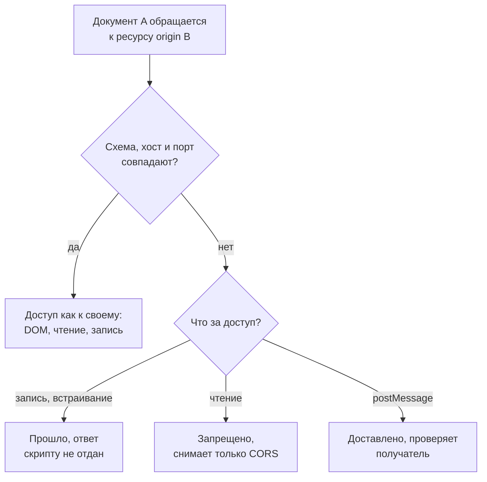

# Same-Origin Policy: что именно ограничивает и что нет

Если вы пишете фронтенд, героя этой темы вы уже встречали — в консоли
браузера. Вы вызываете `fetch` к API на другом адресе, а консоль отвечает:
`Access to fetch at ... has been blocked by CORS policy`. Дальше обычно так:
бэкенд добавляет заголовок `Access-Control-Allow-Origin: *`, ошибка исчезает,
и вопрос закрыт — так и не получив ответа, что именно только что изменилось.

А изменилось вот что: чтение ответов этого API теперь открыто всем источникам
сразу. Защита, которая этому мешала и стоит между любыми двумя сайтами в
браузере, — политика одного источника, same-origin policy. Именно она не даёт странице со
смешными картинками прочитать вашу почту в соседней вкладке. При этом
политика не запрещает всё подряд: ниже чужая страница поменяет тему
оформления вашего кабинета, и политика ей не помешает. Разберём, из чего
состоит источник, что политика запрещает, что разрешает и где проходит её
граница.

## Как чужая страница поменяла тему кабинета

Кабинет пользователя встраивает виджет курсов. Виджет живёт в кадре —
`iframe`, то есть странице внутри страницы, — и загружен с отдельного
доменного имени. Настройки виджет присылает в главное окно сообщением: для
этого есть метод `postMessage`. Он передаёт данные из одного окна в другое,
даже если окна загружены с разных сайтов. Кабинет принимает сообщение
и применяет присланное. То же самое проделывает страница на чужом сайте: она
встраивает кадром сам кабинет и посылает ему сообщение той же формы.

```javascript
// Страница на чужом сайте. Демонстрация, не для продакшена.
const frame = document.createElement('iframe');
frame.src = 'https://app.example/cabinet';
frame.onload = () => frame.contentWindow.postMessage(
  '{"theme":"взломано"}', '*');
document.body.append(frame);
```

**Было — стало.** До сообщения тема кабинета «светлая», после — «взломано».

Смотрите, что здесь произошло, а что нет. Прочитать чужая страница не смогла
ничего: документ кадра ей закрыт, ответ сервера приложения — тоже, и это
ровно то, что политика запрещает. А послать сообщение она смогла:
`postMessage` — один из немногих способов обратиться к чужому окну, и он
открыт по замыслу. Ни пароль, ни сессия здесь не пострадали; пострадала
настройка, потому что обработчик в кабинете применил присланное, не спросив,
кто прислал. Дефект на принимающей стороне, и чинить будем её.

**Зачем это в работе AppSec-инженера.** Кадр с чужого домена вы встраивали,
сообщения между окнами через `postMessage` писали. На то, что браузер лишнего
не пропустит, при этом полагались молча: работает и так. Половина споров о
том, уязвимость это или нет, сводится к вопросу «а что атакующий смог
прочитать». Ответ даёт не интуиция, а правило сравнения origin и список того,
что политика пропускает.

## Что такое origin

Браузер держит страницы разных сайтов врозь: скрипт одного сайта не читает
данные другого. Правило разделения и называют политикой одного источника.
Источник, origin, — это тройка из адреса страницы: **схема**, **хост** и
**порт**. Две страницы с одинаковой тройкой браузер считает своими друг для
друга, с разными — чужими.

Тройка читается прямо в адресе. У `https://app.example:8443/cabinet` схема
`https`, хост `app.example`, порт `8443`. Схема — способ обращения к серверу,
`http` или `https`. Хост — имя сервера. Порт — номер двери на сервере: одна
машина слушает много служб, и порт говорит, к какой из них идти. Если порт в
адресе не написан, браузер подставляет стандартный: `443` для `https` и `80`
для `http`, поэтому у `https://app.example/cabinet` тройка — `https,
app.example, 443`. А вот путь и всё, что после него, в тройку не входят:
`/cabinet` и `/login` на одном сайте — один источник.

Бытовой пример — адрес доставки. Соответствие такое: хост — это дом, порт —
квартира. Совпал дом, но не квартира — получатель другой. Схема в аналогию не
ложится, и это стоит сказать прямо. В жизни жилец один, кто бы ни принёс
письмо — почта или курьер. Для браузера смена схемы меняет получателя:
`https://app.example` и `http://app.example` чужие друг другу так же, как два
разных сайта. Где аналогия ломается ещё: в адресе элементы образуют лестницу,
и разница в квартире читается как мелкая. У origin лестницы нет: различие в
любом из трёх полей равносильно.

Проверим правило на четырёх адресах. За образец берётся
`http://store.company.com/dir/page.html` — тот же пример, что в таблице MDN:

| Адрес | Тройка | Тот же origin? |
|---|---|---|
| `http://store.company.com/dir2/other.html` | `http, store.company.com, 80` | да, отличается только путь |
| `https://store.company.com/dir/page.html` | `https, store.company.com, 443` | нет: другая схема |
| `http://store.company.com:81/dir/page.html` | `http, store.company.com, 81` | нет: другой порт |
| `http://news.company.com/dir/page.html` | `http, news.company.com, 80` | нет: другой хост |

Это не теория: сравнение выполняет любой браузер, и живой прогон такой
проверки стоит в первом ответе самопроверки.

## Подумай, прежде чем читать

1. Страница с `http://a.example:8080` и страница с `http://a.example:9090` —
   это один origin или два? Изменится ли ответ, если обе присвоят
   `document.domain`?
2. Чужая страница отправляет `POST` в ваш сервис. Что ей помешает отправить
   запрос и что помешает прочитать ответ?
3. Обработчик получил сообщение через `postMessage`. Что в этом сообщении
   отправитель подделать не может?

## Как это работает

**Откуда это взялось.** Браузер — единственная программа, которая держит
документы из множества источников в одном месте. И у него есть то, чего нет
ни у одного из этих документов: ваши cookie, ваши открытые сессии, ваш доступ
во внутреннюю сеть. Cookie — короткие записи, которые сайт сохраняет в
браузере. Браузер прикладывает их к каждому запросу на этот сайт, и так сайт
узнаёт вас без нового ввода пароля.

Теперь представьте: вы вошли в почту `mail.example` в одной вкладке, а в
другой открыли чужую страницу. Её скрипт вызывает
`fetch('https://mail.example/inbox')`. Браузер послушно прикладывает ваши
cookie, сервер почты видит вашу сессию и отдаёт список писем. Остаётся
последний шаг — прочитать ответ, и именно здесь встаёт политика: ответ чужого
origin скрипту не отдаётся.

Без этой границы любой сайт читал бы вашу почту или страницу корпоративной
сети, куда атакующему снаружи не попасть. Статья web.dev описывает эту угрозу
так: взломанный скрипт раскрывает всё, что открыто в браузере пользователя.
Границу провели по признаку, который машина проверяет сама, без участия
человека, — по тройке из схемы, хоста и порта.

Отсюда и требование ASVS v5.0-3.5.4: отдельные приложения размещают на
отдельных хостах, чтобы граница между ними держалась на этой политике,
включая ограничения cookie по хосту.

### Кортеж и сравнение

HTML Standard называет origin «фундаментальной валютой модели безопасности
веба». Два актора, то есть две страницы или два скрипта, с общим origin
считаются доверяющими друг другу и имеющими одинаковые полномочия. Акторы с
разными origin — потенциально враждебные.

Спецификация различает два вида источников. **Кортежный**, tuple origin, —
та самая тройка плюс четвёртое поле «домен», по умолчанию пустое. **Пустой**,
opaque origin, — внутреннее значение без восстановимой записи: сериализуется
оно строкой `null`, и единственная осмысленная операция над ним — сравнение
на равенство. Пустой источник получают документы, которым нечего предъявить;
случаи разберём в конце этого раздела.

> **Примечание.** Четвёртое поле, `domain`, в сравнении `same origin` не
> участвует. Оно существует ради одного устаревающего механизма — сеттера
> `document.domain`.

Два origin называются **same origin**, «один источник», в двух случаях.
Первый — это один и тот же пустой источник. Второй — оба источника кортежные,
и у них совпадают схема, хост и порт. Домен здесь не сравнивается. Именно это
правило описывает MDN таблицей, пересказ которой стоит выше, в разделе «Что
такое origin».

Отдельное правило **same origin-domain** сравнивает схемы и домены. Разница
между двумя правилами видна на строке из таблицы спецификации. Пара
`("https", "example.org", 314, "example.org")` и
`("https", "example.org", 420, "example.org")` не same origin, но
same origin-domain. Порты различаются, а после присваивания
`document.domain` они перестают учитываться. Что это за присваивание и почему
оно отключает сравнение портов, видно на живом замере в шаге 4 раздела «Как
это атакуют».

### Что политика запрещает, а что разрешает

Самое неожиданное в политике — не то, что она запрещает, а то, что она
разрешает. MDN раскладывает межоригинные взаимодействия на три категории, и
распределение запретов в них неравномерное:

- **запись** через ссылки, редиректы и отправку форм — как правило,
  разрешена. Страница вправе отправить запрос чужому серверу, и политика
  запросу уйти не мешает.
- **встраивание** — как правило, разрешено: `<script src>`, `<link
  rel=stylesheet>`, ``, `<video>`, `<object>`, `@font-face`, `<iframe>`.
- **чтение** — как правило, запрещено: скрипт не может ни прочитать тело
  ответа чужого сервера, ни заглянуть в документ чужого кадра. Запрет
  снимает только сам сервер, механизмом CORS (Cross-Origin Resource Sharing,
  «совместное использование ресурсов между источниками»). Сервер добавляет в
  ответ заголовок со списком источников, которым читать можно. Браузер отдаёт
  ответ скрипту, только если источник страницы есть в этом списке. Механизму
  посвящена тема `cors`. Но и без CORS чтение часто утекает через
  встраивание: видны размеры встроенной картинки, действия встроенного
  скрипта, сам факт доступности ресурса.

Асимметрия не случайна. Веб строился на свободной ссылочности: страница
вправе сослаться на любую страницу и встроить чужую картинку, и на этом
стоят реклама, капча, шрифты и платёжные виджеты. Запретить отправку и
встраивание значило бы сломать половину интернета. А чтение чужого ответа
для работы ссылок не нужно никогда — его и закрыли.

Из межоригинного окна доступен короткий список свойств — вот и весь арсенал,
который остаётся у чужого окна. В него входят методы `blur`, `close`,
`focus`, `postMessage` и атрибуты `closed`, `frames`, `length`, `location`,
`opener`, `parent`, `self`, `top`, `window`. Канал данных в этом арсенале
один — `postMessage`. У `location` межоригинно доступны метод `replace` и
запись в `href`.


```mermaid
flowchart TB
    A[Документ A обращается<br/>к ресурсу origin B] --> S
    S{Схема, хост и порт<br/>совпадают?} -- да --> ALL
    ALL[Доступ как к своему:<br/>DOM, чтение, запись]
    S -- нет --> K{Что за доступ?}
    K -- запись, встраивание --> W[Прошло, ответ<br/>скрипту не отдан]
    K -- чтение --> R[Запрещено,<br/>снимает только CORS]
    K -- postMessage --> P[Доставлено, проверяет<br/>получатель]
```

**Описание схемы.** Вход — обращение документа A к ресурсу чужого origin.
Первая развилка сравнивает схему, хост и порт: при совпадении доступ ничем не
ограничен. При несовпадении решает вторая развилка — категория доступа.
Запись и встраивание проходят, но ответ скрипту не достаётся. Чтение
останавливает браузер, и снять запрет может только сервер через CORS.
Сообщение через `postMessage` доставляется, и проверять отправителя обязан
получатель.

Куда это ведёт дальше. Разрешённая запись, превращённая в атаку, — это
подделка межсайтовых запросов, тема `csrf-mechanics`. Приёмы против самого
канала сообщений, то есть чем ломаются способы проверить origin, разбирает
тема `postmessage-vulns`. А разрешённое встраивание кадра становится оружием
в теме `clickjacking`.

### postMessage: канал, который политика не закрывает

Запрет на чтение чужого окна оставляет проблему: платёжный виджет внутри
магазина обязан как-то сообщить кассе «оплата прошла», а они живут на разных
origin. Для этого и существует `postMessage` — законный способ передать
данные между документами разных источников; спецификация описывает его в
отдельном разделе § 9.3.

Поля `origin` и `source` у доставленного события заполняет браузер, а не
отправитель: источник отправителя и ссылку на его окно. Полностью под
контролем отправителя только `data`. Проверку личности строят на `origin`.
Поле `source` говорит, какое окно прислало сообщение, но не говорит, какой у
этого окна источник. Атакующему достаточно устроить, чтобы его окно оказалось
нужным кадром, — разбор в разделе «Как это выглядит в коде».

Отсюда два требования к автору принимающей страницы
(§ 9.3.2.1). Первое: сверять `origin`, чтобы сообщения принимались только от
ожидаемых источников. Второе: **после** этого проверять форму данных.
Второе нужно потому, что доверенный отправитель мог быть взломан через XSS —
через внедрение в его страницу чужого скрипта (разбор класса — в теме
`xss-dom`). Тогда непроверенное тело разносит атаку в получателя.

Отправляющей стороне спецификация запрещает подстановку `*` в аргументе
`targetOrigin` для сообщений с чувствительными данными: гарантии доставки
задуманному получателю в этом случае нет. Если явный `targetOrigin` не
совпадает с origin документа-получателя, сообщение отбрасывается — ровно
чтобы не утекли сведения.

### Где граница origin не проходит

Граница origin — не единственная граница в браузере, и смешение двух —
источник настоящих уязвимостей. Cookie пользуются собственным определением
«своего». MDN формулирует так: страница ставит cookie своему домену или
любому родительскому, если тот не входит в список публичных суффиксов.
Публичный суффикс — хвост вроде `.com` или `github.io`, под которым разные
владельцы регистрируют свои имена. Список таких хвостов встроен в браузер,
чтобы один арендатор `github.io` не ставил cookie на всех остальных.

Тонкости — отдельная тема `cookies`, а здесь важны два следствия. При чтении
cookie нельзя узнать, кто её поставил. И даже на сайте с одним лишь HTTPS
любая видимая cookie могла быть поставлена по незащищённому соединению.

Ещё три особых случая. Скрипты из `about:blank` и `javascript:` наследуют
origin документа, который их содержит. URL со схемой `data:` получает новый
пустой контекст безопасности — тот самый opaque origin. Файлы по схеме
`file:///` браузеры обычно считают пустым источником. Документ без origin не
бывает.

## Как это атакуют

Стенд — лаба `pilot/lab/same-origin-policy`. Три статических сервера на петле
играют три источника: приложение (порт 8081), чужая площадка (8082) и
доверенный виджет (8083). Разрешение имён в браузере обрублено на всё, кроме
петли, так что наружу стенд не обращается. Все приёмы дальше показаны на этом
стенде и вне его не обобщаются.

Разбор идёт по единому набору подцелей. **Источник** — сообщение или запрос
от чужого документа. **Путь** — окно, кадр или сетевой запрос. **Сток** — то,
что меняет состояние страницы приложения. **Отсутствующий контроль** —
проверка происхождения на принимающей стороне. **Условие эксплуатации** —
атакующему хватает ссылки на окно жертвы, которую даёт встраивание в кадр.

### Шаг 1. Что политика останавливает

Страница атакующего встраивает кабинет в кадр и пробует прочитать его
документ, затем прочитать ответ сервера приложения.

```text
Вывод команды: node hack.mjs, опыты 1 и 2
опыт 1 — чтение чужого документа: SecurityError: Failed to read
  a named property 'document' from 'Window': Blocked a frame with
  origin "http://127.0.0.1:8082" from accessing a cross-origin frame.
опыт 2 — чтение ответа сервера:   TypeError: Failed to fetch
```

Длинные строки перенесены по ширине страницы, текст сообщений не изменён.
Асимметрия в этих двух строках важнее самих запретов. При чтении документа
скрипт получает подробное сообщение и может его разобрать. При чтении ответа
сервера скрипт получает `TypeError` без причины, а причину браузер печатает
только в консоль.

```text
Вывод того же прогона, раздел «браузер сказал»
Access to fetch at 'http://127.0.0.1:8081/balance.json' from origin
  'http://127.0.0.1:8082' has been blocked by CORS policy: No
  'Access-Control-Allow-Origin' header is present on the requested
  resource.
Failed to load resource: net::ERR_FAILED
```

Вот она, строка из начала темы, — теперь видно, кто её печатает и когда. Это
делает браузер после того, как ответ пришёл, но до того, как его отдали
скрипту. Запрос при этом ушёл и дошёл до сервера: запрет касается чтения, а
не отправки. Отсюда навык триажа — разбора находок по виду: по тексту в консоли запрет
политики отличается от запрета CORS, а по тексту в обработчике ошибки — нет.

### Шаг 2. Что политика пропускает

Та же страница встраивает картинку приложения и отправляет форму на его
эндпоинт перевода.

```text
Вывод команды: node hack.mjs, опыты 3 и 4
опыт 3 — встраивание картинки:    загрузилась
опыт 4 — отправка формы:          форма отправлена, принято на
  стороне приложения: 1, поле Origin запроса: http://127.0.0.1:8082
```

Сервер приложения записал перевод и видел в запросе `Origin` чужой площадки.
Политика не вмешалась: запись разрешена, а прочитать ответ атакующий не
пытался — эффект уже наступил. Это и есть та граница, из-за которой существует
отдельный класс атак: запрос уходит, cookie прикладываются, действие
выполняется, а читать ответ и не нужно.

### Шаг 3. Сообщение обработчику

Кадр с кабинетом доступен атакующему как окно, а `postMessage` — один из
немногих методов, доступных межоригинно. Обработчик в `code.js` применяет
пришедшее без проверки. Опыт 5 — то самое сообщение из начала темы.

```text
Вывод команды: node hack.mjs, опыты 5 и 6
опыт 5 — сообщение обработчику:   сообщение отправлено, тема после
  сообщения: взломано
опыт 6 — взломанный виджет:       сообщение с настоящим origin и
  телом не той формы, тема: взломано

ЭКСПЛОЙТ СРАБОТАЛ
```

Опыт 6 — второй случай из § 9.3.2.1: сообщение приходит от доверенного
виджета, `origin` у него настоящий, а тело не той формы, которую ждёт
приложение. Проверка одного `origin` такое сообщение пропустит.

> **Предупреждение.** Опыты проводятся на своём стенде. Тот же набор,
> направленный на чужое приложение, — неавторизованное воздействие.

### Шаг 4. Что делает `document.domain`

Отдельный замер: два имени, `a.example.com` и `b.example.com`, разведены по
портам 8081 и 8083 и отображены на петлю. Родитель встраивает кадр с чужого
имени и пробует прочитать его документ. `document.domain` — это свойство,
которое страница может присвоить себе сама, укоротив свой хост до
родительского домена. Спецификация помечает такой сеттер как удаляемый, и
работает он только при согласии обеих сторон.

```text
Вывод команды: node .smgr/appsec-stage0-close/exp/domain.mjs
--- ни один документ не присваивает ---
  чтение чужого кадра: SecurityError: Blocked a frame with origin
    "http://a.example.com:8081" from accessing a cross-origin frame.
--- присваивает только родитель ---
  присваивание в родителе: ok, стало example.com
  чтение чужого кадра: SecurityError: Blocked a frame ...
--- присваивают оба ---
  присваивание в родителе: ok, стало example.com
  чтение чужого кадра: прочитано: child
```

Три вывода из замера. Сеттер в этой сборке браузера ещё работает. Ослабление
требует присваивания в **обоих** документах — одностороннее не даёт ничего.
После него не сравниваются ни хост, ни порт: доступ открылся между разными
именами, стоящими вдобавок на разных портах. Именно поэтому присваивание
`document.domain` отключает сравнение портов: документы переезжают из правила
same origin в правило same origin-domain, где порта нет вовсе.

## Как это выглядит в коде

Ревьюер ищет три вещи, и все три видны по точке подписки, без чтения
прикладной логики. Читается ли `event.origin`? Сверяется ли он со **списком**?
Проверена ли форма данных до того, как что-то изменилось?

**Первое: подписка без чтения origin.** Так выглядит `code.js` лабы — весь
дефект в трёх строках, и через них прошло сообщение из начала темы.

```javascript
// app/code.js
// УЯЗВИМО — демонстрация, не для продакшена
window.addEventListener('message', (event) => {
  const data = JSON.parse(event.data);   // (1)
  applySettings(data);                   // (2)
});
```

1. Разбор чужой строки без единой проверки: ни кто прислал, ни что внутри.
2. Смена состояния страницы. Вызвать её может любой документ, у которого есть
   ссылка на это окно, — а её даёт обычное встраивание в кадр.

**Второе: тот же дефект на другом стеке.** Инвариант — обработчик меняет
состояние, не сверив ни личность отправителя, ни форму сообщения. Декорация —
где живёт подписка, как объявлен обработчик и есть ли аннотации типов.

```typescript
// widget-host.tsx, фрагмент
// УЯЗВИМО — демонстрация, не для продакшена
export function WidgetHost(): void {
  useEffect(() => {
    const onMessage = (event: MessageEvent): void => {
      applySettings(JSON.parse(event.data as string) as Settings);  // (1)
    };
    window.addEventListener('message', onMessage);
    return () => window.removeEventListener('message', onMessage);  // (2)
  }, []);
}
```

1. `as Settings` — обещание компилятору, а не проверка. В скомпилированном
   коде от него не остаётся ничего.
2. Отписка при размонтировании — правильная гигиена React, к происхождению
   сообщения отношения не имеющая. Аккуратность здесь маскирует дыру.

**Третье: проверки, которые читаются как проверка, но не защищают.** Каждая
из трёх встречается в живом коде. По каждой решите сами, прежде чем читать
разбор: защищает она или нет?

```javascript
// ФРАГМЕНТ — срез, упрощён для примера, самостоятельно не компилируется
if (event.source !== frames[0]) return;              // (1)
if (!event.origin.startsWith(TRUSTED)) return;       // (2)
if (typeof event.data !== 'string') return;          // (3)
```

1. Ссылка на окно не говорит о его origin: атакующий добивается, чтобы его
   документ оказался первым кадром, и условие выполняется.
2. Сравнение по префиксу пропускает `TRUSTED` с приклеенным чужим суффиксом:
   имя `widgets.example.com.attacker.test` начинается ровно так же. Годится
   только сравнение целой строки.
3. Проверена форма, но не личность. Обратный порядок — проверить личность и
   не проверить форму — тоже неполон, и это второй случай из § 9.3.2.1.

У всех трёх строк один исход: форма контроля соблюдена, а содержание нарушено,
решение принимается до того, как надёжно известны и отправитель, и форма
данных. Пройдите по ним с сообщением от чужого origin: какая строка его
остановит?

**Четвёртое: что за дефект не считается.** Обработчик может законно принимать
сообщения от собственного документа: приложение обменивается ими между своими
кадрами. Отсутствие проверки на стороне отправителя — отдельный дефект с
другим следствием. Значение `*` в `targetOrigin` не пускает чужого в ваш
обработчик: оно отдаёт ваши данные чужому получателю.

> **На собеседовании.** «Что в событии `message` подделать нельзя» — вопрос
> на понимание, а не на память. Под контролем отправителя только `data`;
> `origin` и `source` заполняет браузер.

## Как защититься

Порядок операций и есть фикс: сначала личность, потом форма, потом изменение
состояния. Ни один из трёх шагов не заменяет другие. Сообщение из начала темы
не проходит первый же шаг: адреса чужого сайта в списке нет.

```javascript
// app/solution.js
const TRUSTED = ['http://127.0.0.1:8081', 'http://127.0.0.1:8083'];  // (1)

window.addEventListener('message', (event) => {
  if (!TRUSTED.includes(event.origin)) return;   // (2)
  const data = parseSettings(event.data);        // (3)
  if (data) applySettings(data);
});

function parseSettings(raw) {
  if (typeof raw !== 'string') return null;
  let value;
  try { value = JSON.parse(raw); } catch { return null; }
  if (!value || typeof value.theme !== 'string') return null;
  return { theme: value.theme };                 // (4)
}
```

1. Список, а не одно значение: свой origin в нём нужен, иначе перестанут
   работать сообщения приложения самому себе.
2. Сравнение целой строки методом `includes`, не `startsWith` и не
   регулярным выражением.
3. Разбор отделён от применения: `parseSettings` либо возвращает значение
   ожидаемой формы, либо `null`, и второй случай ничего не меняет.
4. Возвращается не пришедший объект, а собранный заново — лишние поля в
   состояние не попадают.

Тот же фикс на втором стеке отличается одним: TypeScript позволяет записать
проверку так, что компилятор начинает считать значение проверенным. Три шага
прежние — личность, форма, изменение состояния; смотрите, где каждый лёг на
типизированный синтаксис.

```typescript
// widget-host.tsx, фрагмент
const TRUSTED = ['https://app.example.com',
                 'https://widgets.example.com'];

function isSettings(v: unknown): v is Settings {          // (1)
  return typeof v === 'object' && v !== null
    && typeof (v as Settings).theme === 'string';
}

const onMessage = (event: MessageEvent): void => {
  if (!TRUSTED.includes(event.origin)) return;
  let value: unknown;
  try { value = JSON.parse(event.data as string); } catch { return; }
  if (!isSettings(value)) return;                         // (2)
  applySettings({ theme: value.theme });
};
```

1. Предикат `v is Settings` — та же проверка во время выполнения, что и в
   JavaScript. Типизация её не заменяет: без тела функции компилятор поверил
   бы на слово.
2. Здесь инвариант, а не декорация: если убрать эту строку и оставить `as
   Settings`, сборка пройдёт, а дефект вернётся.

**Чего фикс не даёт.** Он не мешает чужой странице встроить приложение в
кадр, отправить форму или загрузить картинку — это категории записи и
встраивания, которые политика разрешает. Лечится это не здесь, а заголовками
`X-Frame-Options`, CSP (Content Security Policy) и атрибутами cookie. CSP —
это список правил, откуда странице разрешено грузить ресурсы и кому разрешено
встраивать её в кадр; разбор — в теме `csp`. Он не защищает от взломанного
доверенного origin в части содержания: если виджет захвачен, он пришлёт
корректную по форме, но чужую настройку.

**Цена.** Список доверенных адресов надо вести: новый origin виджета —
правка кода или конфигурации. За это платят один раз, зато проверка остаётся
сравнением строк, а не разбором шаблонов, в котором и живут обходы.

> **Глубже.** Отправляющая сторона обязана указывать конкретный
> `targetOrigin`. Спецификация прямо пишет, что при `*` гарантии доставки
> задуманному получателю нет. При несовпадении явного значения с origin
> получателя сообщение отбрасывается — именно чтобы данные не утекли.

## Как убедиться, что защита работает

Проверка идёт двумя прогонами: эксплойт должен перестать работать, а
функциональность — остаться. Одного первого недостаточно: обработчик,
который не принимает ничего, тоже «не эксплуатируется».

```text
Вывод команды: LAB_TARGET=solution.js node hack.mjs
(опыты 1–4 и раздел «браузер сказал» совпадают с прогоном выше и опущены)
опыт 5 — сообщение обработчику:   сообщение отправлено, тема после
  сообщения: по умолчанию
опыт 6 — взломанный виджет:       сообщение с настоящим origin и
  телом не той формы, тема: по умолчанию
ЭКСПЛОЙТ НЕ СРАБОТАЛ
```

```text
Вывод команды: LAB_TARGET=solution.js node tests.mjs
проверяется solution.js
  ок    настройка из своего документа применяется
  ок    настройка доверенного виджета применяется
  ок    мусор в теле не меняет настройку
  ок    после мусора обработчик продолжает работать
Упало проверок: 0
```

Опыты 1–4 в обоих прогонах одинаковые, и это тоже результат: политика их
останавливала и до правки, к обработчику они отношения не имеют.

**Негативные случаи.** Два неполных фикса измерены на том же стенде, и оба
выглядят как работающие, пока не запустишь оба прогона:

| Что в обработчике | `hack.mjs` | `tests.mjs` |
| --- | --- | --- |
| ничего не проверяется (`code.js`) | 1 | 0 |
| сверяется один адрес — виджет | 1 | 1 |
| список верный, форма не проверена | 1 | 0 |
| список и форма (`solution.js`) | 0 | 0 |

Строка вторая — проверка есть, а свой origin в ней забыт: эксплойт живёт, и
вдобавок отвалилась работавшая функция. Строка третья — ровно тот неполный
фикс, который проходит опыт 5 и падает на опыте 6.

**Что считать зелёным.** `hack.mjs` вышел с кодом 0 и `tests.mjs` вышел с
кодом 0 в одном и том же варианте файла. Любая другая комбинация — не фикс.

На ревью пройдите по списку.

1. Проверьте, что каждый обработчик события `message` читает `event.origin`
   до любого изменения состояния страницы.
2. Проверьте, что значение `event.origin` сравнивается со списком допустимых
   адресов целиком, а не по префиксу, подстроке или регулярному выражению.
3. Проверьте, что в список допустимых адресов входит собственный origin
   приложения, если оно отправляет сообщения самому себе.
4. Проверьте, что форма сообщения проверяется после сверки origin и до
   изменения состояния страницы, а не подтверждается приведением типа.
5. Проверьте, что вызовы `postMessage` указывают конкретный `targetOrigin`, а
   не подстановку `*` (HTML Standard § 9.3.3).
6. Проверьте, что обработчик, переданный в подписку по имени, прочитан
   глазами: автоматика проверку в нём не подтверждает.

## Как это находят инструменты

Semgrep — статический анализатор: программу он не запускает, а ищет в тексте
кода совпадения с шаблонами из файла правил. Правило
`pilot/semgrep/postmessage-no-origin-check.yaml` ищет подписку на `message`,
у которой в теле обработчика нет обращения к `origin`.

Второе правило в том же файле, `postmessage-handler-by-name`, срабатывает с
уровнем WARNING на подписку, в которую обработчик передан по имени. Тела в
этой точке нет, и подтвердить проверку автоматика не может. Это не находка, а
адрес для чтения глазами.

Сверка правила с разметкой тест-кейсов — на двух стеках:

```text
Вывод команды: .venv-tools/bin/python pilot/semgrep/check.py postmessage
=== postmessage: pilot/semgrep/postmessage-no-origin-check.yaml
  postmessage-no-origin-check.js: ожидалось 6, найдено 6
    пропущено (ложноотрицательные): нет
    на строках ok (ложноположительные): нет
    вне разметки: нет
  postmessage-no-origin-check.ts: ожидалось 2, найдено 2
    пропущено (ложноотрицательные): нет
    на строках ok (ложноположительные): нет
    вне разметки: нет
  лаба, code.js — находки: [(3, 'postmessage-no-origin-check')]
  лаба, solution.js — находки: []  (второй стек — TypeScript, идиома React)
  ПРАВИЛО СВЕРЕНО
```

Правило ловит все уязвимые варианты из раздела «Как это выглядит в коде»,
включая тот, где проверена только форма данных. На исправленном обработчике
из раздела «Как защититься» оно молчит.

**Что оно пропускает.** Три вещи, и все три придётся смотреть руками.
Обработчик, переданный по имени, — отсюда второе правило и уровень WARNING.
Сравнение по префиксу: `event.origin` прочитан — для правила этого
достаточно, чтобы промолчать, а обход остался. Отсутствие проверки формы
после верной сверки origin — правило об этом ничего не знает и на неполном
фиксе молчит.

**Какой шум даёт.** Любое обращение к `.origin` в теле обработчика гасит
находку, даже если это запись в лог. Обратная сторона того же приёма:
проверка, вынесенная в вызов вроде `isTrusted(event.origin)`, распознаётся
верно, потому что `event.origin` в теле всё-таки упомянут.

Осознанное исключение помечается в коде, а не выключается в конфигурации:

```javascript
// Фрагмент, упрощено для примера
// nosemgrep: postmessage-no-origin-check — сверка вынесена в guard(),
// origin в теле не читается; разобрано в ревью от 2026-08-23
window.addEventListener('message', (event) => guard(event, apply));
```

## Частая ошибка

Ловушка не в том, что проверку забывают, а в том, что её пишут наполовину и
получают подтверждение своей правоты. Самый частый вариант — сверить один
адрес: тот, откуда приходят сообщения виджета. Так и закрывают находку вроде
той, с которой тема началась. Ответьте до разбора: что покажут `hack.mjs` и
`tests.mjs` на обработчике, сверяющем один адрес виджета?

Измеренный результат — вторая строка таблицы из раздела «Как убедиться, что
защита работает»: эксплойт продолжает работать, а работавшая функция
ломается. Работает эксплойт потому, что путь через взломанный доверенный
origin никуда не делся. А ломается функция потому, что приложение отправляет
настройки самому себе, и своего адреса в списке нет.

Дальше срабатывает вторая половина ловушки: правило Semgrep на таком коде
молчит — `event.origin` в теле прочитан. Тест «настройка доверенного виджета
применяется» зелёный. Автоматика и половина тестов согласны, что всё хорошо,
и единственный, кто возражает, — прогон эксплойта.

## Попробуй сам

`lab-same-origin-policy` — каталог `pilot/lab/same-origin-policy`. Три
статических сервера на петле, настоящий браузер без сети, шесть опытов.

**Цель одной фразой:** добиться, чтобы `hack.mjs` вышел с кодом 0, а
`tests.mjs` продолжил выходить с кодом 0.

Формат — Secure Code Game: `code.js` — файл, который вы чините, `hack.mjs` —
эксплойт, `tests.mjs` — функциональность, `hint.md` — подсказка,
`solution.js` — решение. Зависимости: Node и локальный chrome-headless-shell
из `tools/node`; в сеть лаба не выходит — разрешение имён в браузере обрублено
на всё, кроме петли. Секции «Запуск», «Сброс» и «Удаление» — в `README.md`
каталога.

Подсказка одна, в `hint.md`: поле `origin` подделать нельзя, сверять его надо
со списком, и § 9.3.2.1 требует после этого проверить форму данных.

**Отдельная задача «почини».** Своими руками пройдите вторую строку таблицы
из раздела «Как убедиться, что защита работает»: сверьте один адрес виджета
и запустите оба прогона. Критерий выполнения — `hack.mjs` вышел с кодом 1, а
проверка «настройка из своего документа применяется» упала. Так «Частая
ошибка» видна на своём стенде, а не на слово.

Решение — `solution.js` в том же каталоге, открыто без условий.

## Проверь себя

1. Один origin у этих двух страниц или два? Что вернёт сравнение их
   `origin`? Изменится ли ответ, если обе страницы присвоят `document.domain`
   значение `a.example`?

```text
http://a.example:8080/pay
http://a.example:9090/pay
```

2. Найдите два дефекта в этом обработчике.

```javascript
// handler.js
// УЯЗВИМО — демонстрация, не для продакшена
window.addEventListener('message', (event) => {
  if (event.origin !== 'https://widgets.example.com') return;
  applySettings(JSON.parse(event.data));
});
```

3. Дефект из начала темы чинится одной из трёх правок. Какой?

   A. Проверять `event.source` и принимать сообщения только от первого кадра.

   B. Сверять `event.origin` со списком целиком, затем проверять форму
      данных.

   C. Отправлять сообщения только с конкретным `targetOrigin`, без `*`.

4. Чужая страница шлёт `postMessage` вашему окну и `POST` вашему сервису.
   Что из двух дойдёт, что из двух она прочитает? И что в доставленном
   сообщении отправитель подделать не может — почему поэтому сверять его
   обязан получатель?

5. Возврат к теме `url-and-encoding`: почему проверка
   `event.origin.startsWith("https://widgets.example.com")` — не сравнение
   origin?

6. Возврат к теме `http-basics`: чем поле `Origin` в запросе отличается от
   `event.origin` в обработчике сообщения?

<details markdown="1">
<summary>Ответ 1</summary>

1. Два: порт — поле кортежа, и порты здесь разные. Прогон:

   ```bash
   node -e "const a = new URL('http://a.example:8080/pay'),
     b = new URL('http://a.example:9090/pay');
     console.log(a.origin === b.origin)"
   ```

   ```text
   false
   ```

   После присваивания в **обоих** документах (одностороннее не даёт ничего)
   сработает другое правило — same origin-domain: оно сравнивает схему и
   домен, а порты сравниваться перестанут. Именно это показывает замер из
   раздела «Как это атакуют»: чтение открылось между разными именами на
   разных портах.

</details>

<details markdown="1">
<summary>Ответ 2</summary>

2. Первый дефект: форма данных не проверяется — сообщение от взломанного
   доверенного виджета пройдёт (опыт 6). Второй: своего origin в сравнении
   нет, и сообщения приложения самому себе перестанут работать. Это вторая
   строка таблицы из раздела «Как убедиться, что защита работает»: прогон
   эксплойта красный, «настройка из своего документа применяется» падает.

</details>

<details markdown="1">
<summary>Ответ 3: разбор вариантов</summary>

3. Верный вариант — B.

   A. Неверно: `source` — ссылка на окно, а не его origin; атакующий
      добивается, чтобы его документ оказался этим кадром, и условие
      выполняется.

   B. Верно: сначала личность — сравнение со списком целой строкой, потом
      форма данных; ни один шаг не заменяет другой (HTML Standard § 9.3.2.1).

   C. Неверно: `targetOrigin` — обязанность отправителя; принимающую сторону
      она не защищает. `*` отдаёт ваши данные чужому получателю, а не пускает
      чужого в ваш обработчик.

</details>

<details markdown="1">
<summary>Ответ 4</summary>

4. Дойдут оба: отправка — это запись, а запись политика, как правило,
   разрешает. Прочитать чужая страница не сможет ни ответ сервера — чтение
   закрыто, и снимает запрет только CORS, — ни содержимое вашего окна. В
   доставленном сообщении отправитель подделать не может поле `origin`: его,
   как и `source`, заполняет браузер, а под контролем отправителя остаётся
   только `data`. Поэтому
   решение о запросе принимает сервер, а решение о сообщении — получатель, и
   начинает он со сверки `origin`.

</details>

<details markdown="1">
<summary>Ответ 5</summary>

5. Потому что origin — кортеж из схемы, хоста и порта, а не строка:
   сравнение по префиксу пропускает приклеенный чужой суффикс, и
   `https://widgets.example.com.attacker.test` такую проверку проходит.
   Сравнивается строка целиком (списком), как в разделе «Как защититься».

</details>

<details markdown="1">
<summary>Ответ 6</summary>

6. Поле `Origin` браузер добавляет к сетевому запросу, и решение по нему
   принимает сервер. Поле `event.origin` браузер добавляет к доставленному
   сообщению, и решение по нему принимает страница-получатель. Общее — оба
   заполняет браузер, и подделать их отправитель не может.

</details>

## Источники

1. HTML Standard, WHATWG, Living Standard (правка 21 августа 2026); реестр
   `whatwg-html-origin`. Разделы: § 7.1.1 Origins, § 7.1.1.1 Sites,
   § 7.1.1.2 Relaxing the same-origin restriction.
   <https://html.spec.whatwg.org/multipage/browsers.html>
2. HTML Standard, § 9.3 Cross-document messaging, WHATWG, Living Standard
   (правка 21 августа 2026); реестр `whatwg-html-web-messaging`. Разделы:
   § 9.3.1 Introduction, § 9.3.2 Security и вложенный
   § 9.3.2.1 Authors, § 9.3.3 Posting messages.
   <https://html.spec.whatwg.org/multipage/web-messaging.html>
3. «Same-origin policy», MDN Web Docs, правка 29 ноября 2025; реестр
   `mdn-same-origin-policy`. Разделы: Definition of an origin, Inherited
   origins, Cross-origin network access, Cross-origin script API access,
   Cross-origin data storage access.
   <https://developer.mozilla.org/en-US/docs/Web/Security/Defenses/Same-origin_policy>
4. «Same-origin policy», web.dev (Google), обновлено 5 ноября 2018; реестр
   `webdev-same-origin-policy`. Использована формулировка угрозы из
   вступления: взломанный скрипт раскрывает всё, что открыто в браузере.
   <https://web.dev/articles/same-origin-policy>

Каркас этапа: `owasp-asvs-5-document` (ASVS v5.0.0) — наследуется всеми
темами этапа 0.

**Скоропортящийся слой.** Все четыре источника живые. HTML Standard правится
непрерывно; сеттер `document.domain` спецификация прямо помечает как
удаляемый, и раздел § 7.1.1.2 переживёт изменения. Адрес страницы MDN за
время работы над темой переехал в раздел `Web/Security/Defenses/`. Номера
подразделов § 9.3 у живого стандарта тоже могут сдвинуться — при сверке
ищите заголовки, а не номера.

**Маркеры уверенности.** Определения origin, правила сравнения, поведение
сеттера и оба требования к принимающей странице — по спецификации (HTML
Standard, открыт лично 2026-08-23). Три категории доступа, списки свойств
окна, модель cookie — по документации (MDN, открыта лично 2026-08-22).
Формулировка угрозы в абзаце «Откуда это взялось» — по статье web.dev
«Same-origin policy» (открыта лично 2026-09-03). Случаи с веб-почтой и
корпоративной сетью — иллюстрация темы: дословно их в статье нет. Требования
3.5.4 и 3.5.5 сверены с текстом ASVS v5.0.0 (открыт лично 2026-08-22). Все
шесть опытов, замер `document.domain` и сверка правила Semgrep выполнены на
своём стенде 2026-08-23 в chrome-headless-shell 152.0.7977.42; выводы в
тексте — из этих прогонов. Прогоны лабы (`hack.mjs` против `code.js` и
`solution.js`, `tests.mjs` против `solution.js`), сверка правила Semgrep и
прогон сравнения `new URL(...).origin` из ответа 1 повторены 2026-10-03 на
Node v26.10.0 и совпали. Выводы `tests.mjs` и сверки Semgrep приведены по
прогонам 2026-10-03 полностью: у сверки с 2026-08-23 добавились строки «вне
разметки» и пометка про второй стек. Замер `document.domain` не повторялся: среда
эксперимента (`.smgr/appsec-stage0-close/exp/`) в репозитории не хранится.
Таблица четырёх адресов в разделе «Что такое origin» — пересказ таблицы MDN,
дополнительно сверен тем же прогоном `new URL` 2026-10-03. Фрагмент чужой
страницы в разделе «Как чужая страница поменяла тему кабинета» — переложение
опыта 5 в вид обычной страницы, и в этом виде он не запускался. Внешнего
технического ревью у темы нет: автору оно недоступно.
