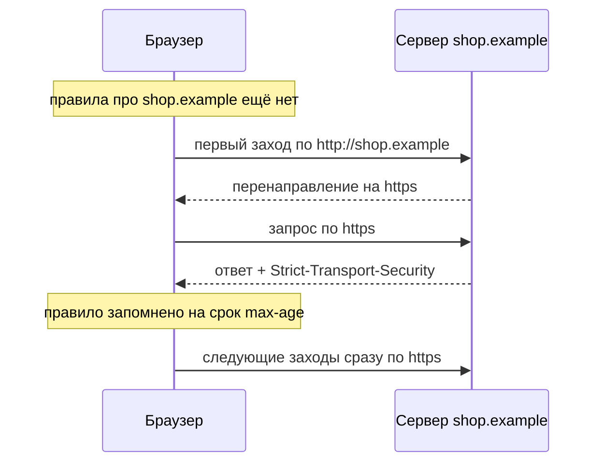
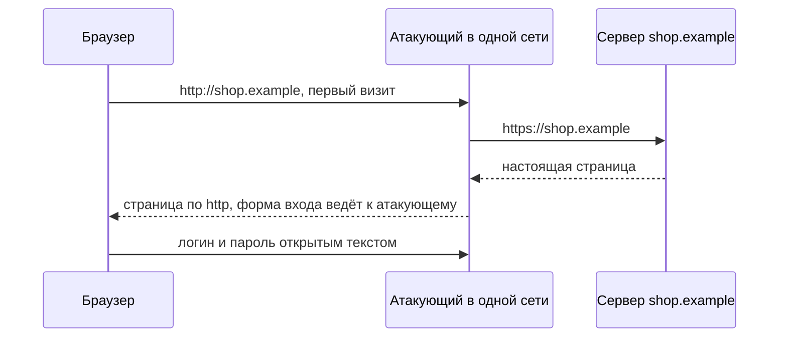

# Security-заголовки: HSTS, nosniff, Referrer-Policy

У сервиса, над которым вы работаете, появился отчёт сканера, и в нём раздел
про security-заголовки: шесть пунктов, все красные. Вы открываете статью со
списком «обязательных заголовков», добавляете четыре строки в обработчик, и
замечание закрыто. Вот ответ, каким он стал:

```http
HTTP/1.1 200 OK
Content-Type: text/html; charset=UTF-8
Strict-Transport-Security: max-age=86400
X-Frame-Options: SAMEORIGIN
X-XSS-Protection: 1; mode=block
Expect-CT: max-age=86400, enforce
```

Имена написаны верно, сканер доволен. По смыслу из четырёх новых строк
работает одна, и та на сутки: срок `max-age=86400` браузер забудет к
следующему визиту. Поле `X-Frame-Options` вытеснено директивой политики CSP:
где она поддержана, на поле браузер не смотрит. Две оставшиеся строки не
включают ничего: одну рекомендуют не задавать, вторую признали устаревшей.
Отличить живое поле от мёртвого можно, только зная, что каждое включает и от
какой атаки защищает, — этим и занимается тема.

## Что такое security-заголовок и кто его выставляет

Браузер по умолчанию ведёт себя доверчиво. Он исполняет то, что похоже на
страницу, при ошибке сертификата предлагает «всё равно продолжить», а
следующему сайту сообщает, откуда вы пришли. Часть этого поведения сервер
может ужесточить. Приложение добавляет в ответ поле заголовка, пару «имя:
значение» рядом с привычным `Content-Type`, и браузер, прочитав его, дальше
держится указания. Такие поля и называют security-заголовками.

Важно понимать границу: ни одно из этих полей не исправляет ничего внутри
приложения. Поле похоже на табличку «осторожно, мокрый пол»: сама она пол не
вытирает, но меняет поведение каждого, кто её увидел. Так и поле действует
только в браузере, который его прочитал и понял.

Выставляет поля серверная сторона, и мест для этого три. Чаще всего это код приложения: один общий обработчик (middleware),
через который проходит каждый ответ. Второе место — конфиг сервера или
прокси перед приложением, например директива `add_header` в nginx. Третье —
панель сети доставки (CDN, content delivery network), если ответы идут через
неё. Правило одно: поле обязано ехать в каждом ответе, поэтому ставят его в
одной общей точке, а не в каждом обработчике по отдельности.

Список этих полей читают с обратным ожиданием: он не растёт, а укорачивается.
Одни поля заменены директивами политики CSP, другие признаны вредными,
третьи мертвы — и держатся в отчётах сканеров ещё годами. Сканер этого
различия не видит: он проверяет наличие имён, а не то, что имена включают.

**Зачем это в работе AppSec-инженера.** Поля ответа вы выставляли сами —
обработчиком во фреймворке или строкой в конфиге, обычно по чужому списку из
статьи или из отчёта сканера. Что именно включает каждое поле и включает ли
до сих пор, при этом проверять было незачем. Отчёт сканера про «отсутствующие
security-заголовки» приходит почти на каждый сервис, и половина его пунктов
устарела. Разбирать такой отчёт значит знать, какие поля ещё работают, и
уметь показать это по первоисточнику, а не по дате статьи.

## Как это работает

У каждого живого поля из группы есть одно небольшое ограничение и одна
атака, которую оно останавливает. Разберём поля по одному, а потом посмотрим
на них в настоящем обмене.

### HSTS: с этим узлом — только по `https`

Проблема начинается с привычки. Человек печатает в адресной строке
«shop.example» без схемы, и браузер по традиции пробует сначала открытый
вариант, `http`. Сервер отвечает перенаправлением на `https`, дальше всё
зашифровано. Но само перенаправление доехало по открытому каналу, где его
может подменить любой посредник. Второе слабое место — ошибка сертификата:
браузер предупреждает, но даёт пройти дальше, и человек проходит, потому что
он пришёл в магазин, а не читать предупреждения.

**Откуда это взялось.** Схема `https` в адресной записи означала одно: этот
запрос попробуют отправить защищённо. Если с сертификатом что-то не так,
браузер предупреждает человека и позволяет ему пройти дальше. Спецификация
RFC 6797 называет такое поведение click-through insecurity, «небезопасность
прокликивания»: решение о безопасности отдано тому, кто пришёл за покупкой.
Утекает при этом ровно то, чем держится вход в систему: сессионные cookie,
после чего атакующий работает от вашего имени. Придумали снять решение с
человека. Хост объявляет, что с ним разговаривают только защищённо; любую
ошибку установления такого соединения браузер обязан считать фатальной и
обхода не предлагать.

Объявление делает поле `Strict-Transport-Security`, а сам механизм называется
HSTS. Поле работает как записка в адресной книге браузера: «с этим узлом —
только через защищённый вход». Дальше браузер проверяет записку сам и молча,
не спрашивая человека. Аналогия обрывается в одном месте: записка появляется
только после первой встречи, и у этого есть своё имя.

У поля две директивы. Директива `max-age` задаёт срок в секундах, сколько
браузер помнит правило; она обязательна. Директива `includeSubDomains`
распространяет правило на все поддомены; значения у неё нет, она либо стоит
в поле, либо нет. Поле с `max-age=0` работает как отмена: браузер забывает
политику вместе с поддоменами.

Окно у механизма одно, и его надо знать по имени. Правило браузер узнаёт из
ответа, значит, в самый первый визит правила у него ещё нет: заход по `http`
идёт открыто. Спецификация называет это bootstrap MITM, где MITM — man in
the middle, «человек посередине», а bootstrap — первое знакомство браузера
с узлом (§ 14.6). Полем это окно не закрыть, поэтому есть третья
директива, `preload`. Она относится не к протоколу, а к спискам узлов,
зашитым внутрь браузера. Узел из такого списка браузер открывает только по
`https`, даже если видит его впервые.

Границы механизма заданы требованиями уровня MUST, и их четыре. Узел **не
должен** присылать поле по незащищённому транспорту; браузер **обязан**
игнорировать и такое поле, и `http-equiv` с этим именем в разметке. У
известного узла, то есть того, чья политика уже запомнена, браузер **обязан**
разорвать соединение при любой ошибке транспорта, включая ошибку сертификата
(§ 8.4). И отдельно, частый вопрос ревью: пришедшее дважды поле браузер
**обязан** обработать по первому вхождению, не объединяя значения и не беря
последнее (§ 8.1).

Перенаправление с `http` на `https` спецификация требованием не делает: § 7.2
ставит здесь SHOULD, и примечание к нему называет две причины. Первая —
риски самого серверного перенаправления: ответ с перенаправлением едет по
открытому каналу, и посредник может его выкинуть, оставив человека на
подменённой странице. Вторая — площадки со сторонними компонентами. Сайт
подгружает чужой виджет по абсолютному адресу `http`; после принудительного
переезда на `https` такой сайт может перестать работать, хотя при равномерно
защищённом доступе он исправен. Его отсутствие — предмет разговора, а не
нарушение RFC.

### X-Content-Type-Options: запрет угадывать тип

Поле с единственным значением `nosniff` запрещает браузеру угадывать тип
содержимого вместо объявленного в `Content-Type`. Угадывание — старое
поведение браузеров, и у него есть имя: MIME-sniffing. Если сервер объявил
`text/plain`, а первые байты похожи на разметку, браузер без `nosniff`
открывает содержимое как страницу. Бытовой аналог здесь почти буквальный:
конверт с надписью «документы», внутри которого записка «выполни меня».
Cheat Sheet называет последствие прямо: неисполняемый тип превращается в
исполняемый. Как этим пользуется атакующий — в разделе «Как это атакуют».

У поля есть и второе следствие, которое фиксирует ASVS v5.0-3.4.4:
блокировка межоригинного чтения, CORB. Если чужая страница пытается
подсмотреть ответ вашего сервера и тип содержимого не соответствует
заявленному, браузер с `nosniff` не отдаст его содержимое её скрипту.

### Referrer-Policy: сколько адреса уйдёт дальше

Когда страница запрашивает картинку, скрипт или шрифт, браузер прикладывает
к запросу поле `Referer` с адресом страницы, как обратный адрес на конверте.
Исторически туда попадал адрес целиком, с путём и строкой запроса. Адрес
бывает секретным: ссылка сброса пароля выглядит как
`https://shop.example/reset?token=s3cr3t`, и токен в ней — полноценный ключ
от формы сброса.

Поле `Referrer-Policy` управляет тем, сколько сведений об адресе страницы
уйдёт в `Referer` следующего запроса. С 2020 года браузеры один за другим
сменили умолчание: Chrome 85, Firefox 87, затем WebKit в Safari. Теперь
наружу по умолчанию уходит только источник, то есть схема и имя узла без
пути.

Поле всё равно ставят явно. Умолчание не распространяется на старые браузеры
и не страхует от его следующей смены. Рекомендация Cheat Sheet —
`strict-origin-when-cross-origin`. Внутри своего сайта уходит адрес целиком,
на чужой узел — только источник, а при переходе с `https` на открытый `http`
не уходит ничего. ASVS v5.0-3.4.5 требует политики, предотвращающей утечку
пути и строки запроса третьим сторонам. Полный разбор такой утечки — в
разделе «Как это атакуют».

### Cross-Origin-Opener-Policy: разорвать связь окон

Страница, открытая по вашей ссылке в новой вкладке, по умолчанию получает в
скрипте ссылку на ваше окно — `window.opener`. Через неё чужая страница
может, например, подменить адрес вашей вкладки: вы вернётесь, а там уже
другая страница с тем же видом. Поле
`Cross-Origin-Opener-Policy: same-origin` разрывает эту связь: браузер
разводит окна по разным группам контекстов просмотра, и чужая страница ссылки
на ваше окно не получает.

Мишень у поля шире подмены адреса. Cheat Sheet называет атаки вроде Spectre,
то есть чтение чужих данных через побочные эффекты процессора, пересекающие
границу политики одного источника. Требование ASVS v5.0-3.4.8 ставит это поле
на ответы, с которых начинается отрисовка документа.

### Вытесненное и мёртвое

Поле `X-Frame-Options` запрещает встраивание страницы в кадр — элемент
iframe, окно внутри окна. Атака, которую оно останавливает, — подмена
нажатия: чужая страница встраивает приложение в невидимый кадр и принимает
нажатия, адресованные приложению (тема `clickjacking`). Cheat Sheet пишет,
что директива `frame-ancestors` политики CSP вытесняет поле там, где
поддержана, а ASVS v5.0-3.4.6 называет само поле устаревшим. У перенаправления
или у API, отдающего JSON, оно бесполезно: встраивать нечего.

Рядом два поля, которые надо не настраивать, а убирать. `X-XSS-Protection`
некогда включал в браузере фильтр межсайтового скриптинга. Фильтр вырезал из
страницы куски, похожие на атаку, и атакующие научились подкладывать строки
так, чтобы вырезание превращало безобидный скрипт в нужный им. Поэтому Cheat
Sheet советует поле не задавать либо явно выключать нулём.

Поле `Expect-CT` когда-то включало добровольную проверку Certificate
Transparency, публичных журналов выпущенных сертификатов. Узел просил браузер
требовать запись сертификата в таком журнале и слать отчёты о нарушениях.
Позже браузеры сделали проверку журналов обязательной сами, и отдельное поле
стало не нужно. Поэтому Cheat Sheet советует не использовать его вовсе, а MDN
помечает устаревшим. В отчёте сканера оба поля значатся как полезные.

### Как это выглядит в обмене

**Запрос** к незнакомому узлу:

```http
GET / HTTP/1.1
Host: shop.example
Accept: text/html
```

**Ответ** с четырьмя живыми полями группы:

```http
HTTP/1.1 200 OK
Content-Type: text/html; charset=UTF-8
Strict-Transport-Security: max-age=63072000; includeSubDomains
X-Content-Type-Options: nosniff
Referrer-Policy: strict-origin-when-cross-origin
Cross-Origin-Opener-Policy: same-origin

<!doctype html><title>shop</title>
```

Транскрипт упрощён для примера: нерелевантные поля вырезаны. Срок здесь два
года, и это выше минимума: год, 31536000 секунд, требует ASVS v5.0-3.4.1. Два
года, 63072000 секунд, — пример заголовка, который hstspreload.org приводит
для подачи в список preload. Поля `X-Frame-Options` здесь нет: встраивание
закрывает директива `frame-ancestors 'none'` из политики CSP. Поля
`X-XSS-Protection` нет, потому что его рекомендуют не задавать.

Весь путь браузера при работе с HSTS видно на одной схеме:



**Описание схемы.** Первый заход идёт по открытому `http`, потому что правила у
браузера ещё нет. Сервер перенаправляет на защищённую схему и в защищённом
ответе присылает поле HSTS. С этого момента браузер помнит правило весь срок
`max-age` и следующие заходы делает сразу по `https`, без открытого шага.
Открытая первая стрелка — то самое окно первого визита.

## Как это атакуют

Три атаки из этого раздела останавливают три живых поля. Во всех трёх случаях
защита срабатывает в браузере, но включить её может только сервер — полем в
ответе.

### Перехват первого визита

Человек в кафе подключается к Wi-Fi и печатает «shop.example». Браузер идёт
по `http`. Атакующий, контролирующий точку доступа, видит запрос и отвечает
сам. К настоящему серверу он обращается по `https`, а человеку отдаёт страницу
по открытому `http`, поменяв в ней адрес формы входа. Замка в адресной строке
нет, но на него мало кто смотрит. Логин и пароль уходят атакующему открытым
текстом. Это и есть «человек посередине» из аббревиатуры MITM. Подробно его
устройство разобрано в теме `tls-and-proxy`, только там ему нужен свой
сертификат, а здесь канал и так открытый.



**Описание схемы.** Атакующий стоит посередине только на открытой части: к
серверу он ходит сам и по `https`, человеку отдаёт страницу по `http` со своей
правкой. Соединения «браузер — сервер» здесь нет: каждая сторона говорит
только с посредником.

Второй вариант той же атаки — подмена сертификата. Без HSTS браузер
показывает предупреждение и даёт пройти дальше, и люди проходят: это ровно
та небезопасность прокликивания, ради которой поле придумано. С запомненной
политикой кнопки обхода нет, соединение рвётся. Значит, HSTS закрывает и
подмену первого ответа, но со второго визита, и прокликивание предупреждения.
Первый визит остаётся окном: поле здесь бессильно, его закрывает список
preload.

### Чужой файл исполняется как страница

Приложение разрешает пользователям загружать файлы, например аватарки; эта
площадь целиком разобрана в теме `file-upload`. Атакующий загружает файл
`avatar.jpg`, внутри которого разметка со скриптом. Сервер хранит файл и
отдаёт его с типом `text/plain` или `image/jpeg`. Браузер без `nosniff`
смотрит на первые байты, видит разметку и открывает файл как страницу.
Скрипт исполняется в источнике самого приложения, с доступом к его cookie и
его страницам. Так строка, загруженная пользователем, становится чужим
скриптом: это сохранённый XSS, механика которого разобрана в теме
`xss-stored`. С `nosniff` браузер держится объявленного типа: неисполняемый
остаётся неисполняемым, и файл не превратить в страницу.

### Адрес страницы уходит третьей стороне

Письмо со ссылкой сброса пароля ведёт на
`https://shop.example/reset?token=s3cr3t`. На странице сброса лежит картинка
с чужого CDN и счётчик аналитики. Запрашивая их, браузер прикладывает
`Referer`, и что в нём окажется, зависит от политики. Свежий браузер по
умолчанию пошлёт только источник, а вот старый — адрес целиком, вместе с
токеном. Полный адрес уйдёт и там, где сайт сам выставил слабую политику
вроде `unsafe-url` или `no-referrer-when-downgrade`, например по такому же
устаревшему чеклисту, как в начале темы.

В обоих случаях токен оказывается в журнале чужого сервера, а журнал читают
все, у кого есть к нему доступ. Явная политика `strict-origin-when-cross-origin`
закрывает оба случая: наружу уходит только `https://shop.example`, без пути и
строки запроса, независимо от версии браузера.

## Как это выглядит в коде

Ревьюер смотрит не на список полей, а на то, где они выставляются. Обработчик
из начала темы выглядит так. Прочитайте его с тремя вопросами до выносок:
какой срок запомнит браузер, какие строки ничего не включают, по какому
транспорту этот набор уходит.

```javascript
// УЯЗВИМО — демонстрация, не для продакшена. Фрагмент, не исполняется
app.use((req, res, next) => {
  res.setHeader("Strict-Transport-Security", "max-age=86400"); // (1)
  res.setHeader("X-Frame-Options", "SAMEORIGIN");              // (2)
  res.setHeader("X-XSS-Protection", "1; mode=block");          // (3)
  res.setHeader("Expect-CT", "max-age=86400, enforce");        // (4)
  next();
});
http.createServer(app).listen(80); // тот же набор уходит по http (5)
```

1. Срок — сутки. ASVS v5.0-3.4.1 требует не меньше года и, начиная с его
   уровня L2, распространения на поддомены; `includeSubDomains` здесь нет. К
   следующему визиту браузер правило забудет.
2. Встраивание закрыто вытесненным полем, а директивы `frame-ancestors` в
   политике CSP нет: в браузере, который на поле не смотрит, страница
   встраивается.
3. Поле включено, хотя Cheat Sheet советует обратное: не задавать или
   выключать нулём.
4. Поле устарело (MDN) и не рекомендовано (Cheat Sheet): строка ничего не
   включает и вводит в заблуждение читателя конфигурации.
5. Тот же обработчик обслуживает незащищённый транспорт: RFC 6797 § 7.2 это
   узлу запрещает, а браузер поле всё равно обязан игнорировать. Строка не
   работает ни в каком случае.

**Что искать глазами.** Срок HSTS короче года и без `includeSubDomains`. Поле
вместо директивы: `X-Frame-Options` без `frame-ancestors`. Мёртвое поле,
оставленное ради отчёта сканера. И чего в наборе нет: `nosniff`,
`Cross-Origin-Opener-Policy`.

## Как защититься

Тот же обработчик, приведённый в порядок. Читая его, смотрите на три вещи:
каким стал срок и его охват, какие поля вошли в набор заново и куда переехал
незащищённый слушатель.

```javascript
// Исправленный вариант. Фрагмент, не исполняется.
app.use((req, res, next) => {
  res.setHeader("Strict-Transport-Security",
    "max-age=31536000; includeSubDomains");                    // (1)
  res.setHeader("X-Content-Type-Options", "nosniff");          // (2)
  res.setHeader("Referrer-Policy", "strict-origin-when-cross-origin");
  res.setHeader("Cross-Origin-Opener-Policy", "same-origin");  // (3)
  next();
});
// незащищённый слушатель отвечает только перенаправлением      // (4)
```

Сначала ответьте себе: какие два поля исчезли и почему их отсутствие —
исправление, а не пропуск.

<details markdown="1">
<summary>Разбор выносок</summary>

1. Год в секундах и распространение на поддомены — минимум ASVS v5.0-3.4.1
   для его уровня L2. Обработчик обслуживает только защищённый транспорт,
   поэтому запрет § 7.2 не нарушается.
2. Поле, которого не было. Оно закрывает угадывание типа и включает CORB
   (ASVS v5.0-3.4.4).
3. Изоляция группы контекстов просмотра (ASVS v5.0-3.4.8). Ставится на
   ответы, с которых начинается отрисовка документа.
4. Перенаправление — SHOULD, а не MUST (RFC 6797 § 7.2), и делает его
   отдельный слушатель, а не тот, который выставляет поле HSTS.

Исчезли `X-Frame-Options` и `X-XSS-Protection`: первое вытеснено директивой
`frame-ancestors`, которую задаёт тема `csp`, второе рекомендовано к
выключению.

</details>

**Пределы приёма.** Ни одно поле не исправляет ничего внутри приложения: они
включают ограничения в браузере и действуют только там. К API и небраузерным
клиентам, пишет Cheat Sheet, часть группы применять смысла нет: там нет
браузера, который угадывал бы тип или прикладывал `Referer`.

**Расход.** `includeSubDomains` распространяет запрет на все поддомены сразу,
включая те, о которых вы не знали. Внутренний стенд `stand.shop.example`
живёт по `http`. Браузер сотрудника один раз зашёл на основной сайт, запомнил
политику — и теперь адрес стенда переписывает на `https` сам, а там стенда
нет. На весь срок `max-age` стенд для него перестал существовать. Отменить
это можно только полем с нулевым сроком, доставленным по `https` тем браузерам,
которые за ним придут.

## Как убедиться, что защита работает

Первый шаг — посмотреть на ответ сервиса глазами. Команда
`curl -si https://shop.example/` печатает поля ответа как есть: по ним видно
и срок HSTS, и наличие `includeSubDomains`, и лишние поля. Дальше пройдите по
списку.

1. Проверьте, что ответ по защищённому транспорту содержит
   `Strict-Transport-Security` со сроком не меньше года и с
   `includeSubDomains` (ASVS v5.0-3.4.1).
2. Проверьте, что поле HSTS не выставляется по незащищённому транспорту
   (RFC 6797 § 7.2).
3. Проверьте, что каждый ответ содержит `X-Content-Type-Options: nosniff`, а
   `Content-Type` отвечает назначению ресурса (ASVS v5.0-3.4.4).
4. Проверьте, что политика передачи адреса не выпускает путь и строку запроса
   третьим сторонам (ASVS v5.0-3.4.5).
5. Проверьте, что встраивание закрыто директивой `frame-ancestors`, а не
   полем `X-Frame-Options` (ASVS v5.0-3.4.6).
6. Проверьте, что ответы, с которых начинается отрисовка, содержат
   `Cross-Origin-Opener-Policy` (ASVS v5.0-3.4.8).
7. Проверьте, что поля `X-XSS-Protection` и `Expect-CT` из ответов убраны.

## Частая ошибка

Убеждение, которое приходит вместе с отчётом сканера: поля этой группы —
независимые галочки, и чем их больше, тем безопаснее сервис. На этом
убеждении и построен отчёт из начала темы — найдите в нём сбой до чтения
дальше.

**Проверка его не подтверждает.** Группа — перечень с историей, где каждое
включённое поле что-то меняет в работе сервиса.

Как устроено на деле. Из шести полей в отчёте сканера три настраивают, одно
заменяют директивой политики, два убирают. Рассуждение «больше полей —
больше безопасности» опирается на две скрытые посылки: что каждое названное
поле что-то включает и что список сканера актуален, — и обе неверны. Отчёт из
начала темы просил все шесть, а выставленные по нему поля включили одно
ограничение. Поле, выставленное без понимания механизма, либо не включает
ничего, как `Expect-CT`, либо ломает работающий ответ. Так `nosniff`
запрещает браузеру исправлять неверный `Content-Type`, поэтому стиль,
отданный как `text/plain`, перестаёт применяться.

Случай из практики ревью. Сервис получает замечание «нет HSTS» и выставляет
поле с годовым сроком и `includeSubDomains` — на всех ответах, включая ответы
незащищённого слушателя. Отчёт зелёный. Через неделю перестаёт открываться
поддомен, который жил по `http` и в переписке не участвовал. Копии поля из
незащищённых ответов браузеры проигнорировали, как велит § 8.1, и не помогли
никому. Сломала копия из защищённых ответов: `includeSubDomains` распространил
запрет на поддомен, о котором никто не спрашивал.

## Попробуй сам

Возьмите ответ своего сервиса и разнесите группу по трём столбцам: настроено,
заменено директивой политики, надо убрать.

Из подсказок — только эта: начинайте не со списка рекомендаций, а со списка
полей, которые в ответе есть.

**Критерий выполнения.** Готова таблица из трёх столбцов: поля из вашего
ответа и отсутствующие поля из чеклиста. Для HSTS записаны срок, наличие
`includeSubDomains` и список поддоменов, попавших под запрет.

## Проверь себя

1. Ответ выглядит так.

```http
HTTP/1.1 200 OK
Strict-Transport-Security: max-age=300; includeSubDomains
X-Content-Type-Options: nosniff
X-Frame-Options: DENY
X-XSS-Protection: 0
```

   Какие ограничения он действительно включает, а какие строки не включают
   ничего?

2. Ответ пришёл с двумя полями.

```http
Strict-Transport-Security: max-age=0
Strict-Transport-Security: max-age=63072000; includeSubDomains
```

   Что произойдёт: что запомнит браузер?

3. Сканер выдал шесть пунктов про security-заголовки. Как их закрывать?

   A. Выставить все шесть полей из отчёта.

   B. Живые настроить по значению, мёртвые убрать, вытесненное заменить
      директивой.

   C. Заменить всё одной строгой политикой CSP.

4. Почему браузер обязан игнорировать поле HSTS, присланное по открытому
   `http`?

5. Возврат к теме `csp`: какая директива закрывает встраивание и чем она
   богаче вытесненного поля?

6. Возврат к теме `http-basics`: почему политику HSTS нельзя доставить
   разметкой через `http-equiv`?

<details markdown="1">
<summary>Ответ 1</summary>

1. По-настоящему включено одно — `nosniff`, запрет угадывать тип содержимого.
   HSTS работает, но ничтожно мало: срок в пять минут браузер забудет к
   следующему визиту, а минимум — год (ASVS v5.0-3.4.1). `X-Frame-Options` —
   вытесненное поле: там, где смотрят только на политику CSP, встраивание оно
   не закрывает. `X-XSS-Protection: 0` — не находка, а правильное выключение
   поля, которое рекомендуют не задавать.

</details>

<details markdown="1">
<summary>Ответ 2</summary>

2. Ничего. Пришедшее дважды поле браузер обязан обработать по первому
   вхождению, не объединяя и не беря последнее (RFC 6797 § 8.1). А
   `max-age=0` удаляет запомненную политику вместе с поддоменами. Что оба поля
   доезжают как есть, видно прогоном:

   ```python
   from http.server import BaseHTTPRequestHandler, HTTPServer

   class H(BaseHTTPRequestHandler):
       def do_GET(self):
           self.send_response(200)
           self.send_header("Strict-Transport-Security", "max-age=0")
           self.send_header("Strict-Transport-Security",
                            "max-age=63072000; includeSubDomains")
           self.end_headers()
           self.wfile.write(b"ok")

   HTTPServer(("127.0.0.1", 8907), H).serve_forever()
   ```

   ```bash
   python3 srv.py &
   curl -si http://127.0.0.1:8907/ | grep -i strict
   ```

   ```text
   Strict-Transport-Security: max-age=0
   Strict-Transport-Security: max-age=63072000; includeSubDomains
   ```

</details>

<details markdown="1">
<summary>Разбор</summary>

3. Верный вариант — B.

   A. Неверно: группа — не набор галочек. Часть полей мертва, а
      `X-XSS-Protection` советуют не задавать вовсе; выставленный по отчёту
      набор включает одно ограничение из четырёх.

   B. Верно: решение принимается по тому, что включает каждое поле, а не по
      числу строк.

   C. Неверно: у политики CSP другой предмет — ни HSTS, ни `nosniff` она не
      покрывает.

</details>

<details markdown="1">
<summary>Ответ 4</summary>

4. Потому что поле по незащищённому каналу мог подменить любой посредник, и
   доверия оно не заслуживает. Поэтому узел не должен присылать его по
   открытому транспорту, а браузер обязан проигнорировать (RFC 6797 § 7.2,
   § 8.1).

</details>

<details markdown="1">
<summary>Ответ 5</summary>

5. Директива `frame-ancestors`: она принимает список выражений источника,
   тогда как поле знает только `DENY` и `SAMEORIGIN`; третьего значения,
   `ALLOW-FROM`, браузеры давно игнорируют как устаревшее.

</details>

<details markdown="1">
<summary>Ответ 6</summary>

6. RFC 6797 обязывает браузер игнорировать `http-equiv` с этим именем
   (§ 8.5). Политика доставляется только полем ответа.

</details>

## Источники

1. RFC 6797 «HTTP Strict Transport Security (HSTS)», IETF, Standards Track,
   ноябрь 2012; реестр `rfc6797-hsts`. Разделы: § 6.1.1 директива `max-age`,
   § 6.1.2 директива `includeSubDomains`, § 7.2 запрос по незащищённому
   транспорту, § 8.1 обработка поля, § 8.4 ошибки транспорта, § 8.5 запрет
   `http-equiv`, § 14.6 bootstrap MITM.
   <https://www.rfc-editor.org/rfc/rfc6797.html>
2. OWASP HTTP Security Response Headers Cheat Sheet; реестр
   `owasp-cs-http-headers`. Разделы: X-Frame-Options, X-XSS-Protection,
   X-Content-Type-Options, Referrer-Policy, Strict-Transport-Security,
   Expect-CT, Cross-Origin-Opener-Policy.
   <https://cheatsheetseries.owasp.org/cheatsheets/HTTP_Headers_Cheat_Sheet.html>

Каркас этапа: `owasp-asvs-5-document` (ASVS v5.0.0) — наследуется всеми темами
этапа 0.

**Скоропортящийся слой.** Вся тема из него и состоит: состав группы меняется
быстрее, чем что-либо ещё в этапе. Cheat Sheet — живой документ без даты
публикации; на правке, открытой 2026-08-22, мёртвыми помечены `Expect-CT` и
HPKP, `X-Frame-Options` — вытесненным, а `Cross-Origin-Opener-Policy` стоит
рядом с `Cross-Origin-Embedder-Policy` и `Cross-Origin-Resource-Policy`,
которых эта тема не разбирает.

**Маркеры уверенности.** Директивы HSTS, их обязательность, требования уровня
MUST, уровень SHOULD у перенаправления и разбор click-through insecurity как
задачи, ради которой поле придумано (§ 1), — по спецификации (RFC 6797,
открыт лично 2026-08-22, перечитан 2026-08-23). Рекомендуемые значения, статус
`X-XSS-Protection` и `Expect-CT`, вытеснение `X-Frame-Options`, назначение
`Cross-Origin-Opener-Policy` — по документации (Cheat Sheet, открыт лично
2026-08-22). Требования 3.4.1, 3.4.4, 3.4.5, 3.4.6 и 3.4.8 сверены с текстом
ASVS v5.0.0 (открыт лично 2026-08-22). Две причины SHOULD у перенаправления —
по примечанию к § 7.2, перечитано 2026-10-03. Умолчание Referrer-Policy и
совет ставить поле явно — по Cheat Sheet, подтверждено ревьюерской сверкой
2026-10-03; номера версий браузеров (Chrome 85, Firefox 87) — по общеизвестной
истории их выхода, отдельным источником не подкреплены. Назначение Expect-CT
(добровольная проверка Certificate Transparency, пока браузеры не сделали её
обязательной) — по Cheat Sheet и MDN, ревьюерская сверка 2026-10-03. Ответы
сервера не снимались: стенда под
рукой не было, транскрипт в разделе про обмен собран по спецификации, а не
снят с узла. Прогон из ответа 2 самопроверки повторён 2026-10-03 локально:
Python 3, оба поля доезжают, вывод совпал.
