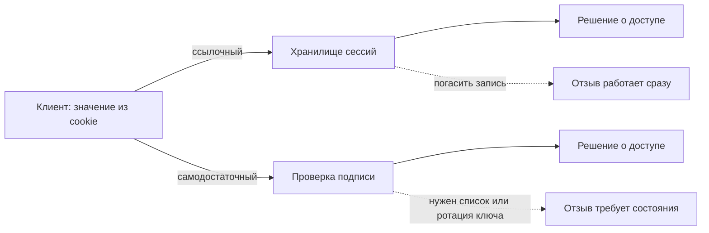

# Сессии: серверные сессии vs stateless-токены

**AG-PROTO-04** · уровень **L2** · время 25 мин (теория 13 / задача 7 /
самопроверка 5, оценка) · reviewed: 2026-08-22 · проверено на: OWASP Session
Management Cheat Sheet (живой документ), RFC 7519 (май 2015),
draft-ietf-httpbis-rfc6265bis-22, ASVS v5.0.0
пререквизиты: `http-basics`, `cookies` · маппинг: CWE-384 · CWE-613 ·
CWE-347 · ASVS v5.0-7.2.2 · ASVS v5.0-9.1.2

Состав блоков — по уровню L2 (`PLAYBOOK.md` 3.1). Блоки 2, 4, 7 и 8 удалены,
блок 11 сведён к задаче без лабы, порядок остальных сохранён. Атаки на JWT
разбираются в теме 1.7.02, session fixation и некорректная инвалидация — в
теме 1.6.04; здесь только модель.

## 0. Коротко

HTTP не помнит предыдущий запрос, поэтому состояние переносится самим
сообщением. Два способа различаются тем, где лежит смысл. **Ссылочный
токен** несёт бессмысленный идентификатор, а кто вы, что вам можно и когда
сессия истекает — лежит в хранилище сервера. **Самодостаточный токен** несёт
сами утверждения вместе с подписью, и сервер о сессии не хранит ничего.
Различие определяет не скорость, а то, что происходит при выходе и отзыве
прав.

**Зачем это в работе AppSec-инженера.** Вопрос «как у вас устроены сессии»
звучит на каждом дизайн-ревью нового сервиса, и ответ «JWT» на него не
отвечает. Отвечает то, что вы спросите следом: где проверяется подпись, что
происходит при выходе, какие алгоритмы приняты.

## 1. Цели

После этого раздела вы сможете:

1. Отличить ссылочный токен от самодостаточного по одному взгляду на значение.
2. Назвать, где в каждой модели лежит смысл сессии и кто может его изменить.
3. Найти в коде место, где приложение принимает идентификатор сессии, которого
   само не выдавало.
4. Перечислить три способа отозвать самодостаточный токен до истечения срока.
5. Проверить, какие алгоритмы подписи принимает разбор токена.

## 3. Механика

### Ссылочный токен

Сервер выдаёт значение, которое не значит ничего, и заводит запись, к
которой это значение ведёт. OWASP Session Management Cheat Sheet ставит
такому значению три требования: имя не раскрывает стек (`PHPSESSID`,
`JSESSIONID`, `ASP.NET_SessionId` опознаются по имени), значение порождается
CSPRNG, смысла в самом значении нет — иначе он раскрывается декодированием.

> **Примечание.** Источники расходятся в требуемой энтропии: Cheat Sheet
> задаёт «не менее 64 бит», ASVS v5.0-7.2.3 — «не менее 128 бит». Верхняя из
> двух планок не противоречит ни одному документу.

Смысл сессии — роль, права, время создания — живёт в серверном хранилище.
Клиент его не видит и изменить не может.

### Самодостаточный токен

Утверждения переносятся самим токеном. RFC 7519 определяет JWT как набор
утверждений в виде объекта JSON, закодированного в структуру JWS или JWE, и
записанного частями через точку, каждая в base64url. Регистрированные имена
— `iss`, `sub`, `aud`, `exp`, `nbf`, `iat`, `jti` — перечислены в § 4.1, и
все помечены OPTIONAL: спецификация не обязывает применять ни одного.

§ 6 определяет **Unsecured JWT**: заголовок `{"alg":"none"}` и пустая строка
вместо подписи. Это законная часть стандарта — для случая, когда содержимое
защищено снаружи токена.

§ 11.1 задаёт условие доверия: на содержимое JWT нельзя опираться в решении,
пока оно не защищено криптографически и не связано с контекстом решения.

### Что меняется при отзыве

Различие моделей видно не в обычном запросе, а в двух местах: выход из
системы и снятие прав. ASVS v5.0-7.4.1 требует, чтобы после завершения сессии
токен больше не работал, и разводит два случая: ссылочный токен гасится
записью на бэкенде, а самодостаточному нужно «решение вроде списка
завершённых токенов, отказа от токенов, выпущенных раньше определённой для
пользователя даты, или ротации ключа подписи для этого пользователя».

Следствие: приложение со списком отозванных токенов держит серверное
состояние — то самое, ради отказа от которого модель и выбиралась.



**Описание схемы.** Слева значение от клиента. Верхний путь — ссылочный
токен: хранилище, затем решение о доступе; отзыв — погашение записи. Нижний —
самодостаточный: проверка подписи, затем решение; отзыв требует отдельного
состояния. Сплошные стрелки — обработка запроса, пунктирные — отзыв.

## 5. Как выглядит в коде

Ревьюер ищет четыре места, и все четыре видны по объявлениям, а не по логике.

**Первое: откуда принимается идентификатор.** Cheat Sheet различает
**строгий** механизм, принимающий только выданные приложением значения, и
**разрешительный**, заводящий сессию под любым присланным; PHP по умолчанию
разрешительный. Получив невыданное значение, приложение должно выдать новое и
отметить событие как подозрительное.

```text
# Псевдокод, не исполняется. УЯЗВИМО — демонстрация, не для продакшена.
sid = cookie("id") or query_param("sid")   # (1)
session = store.get_or_create(sid)         # (2)
if login_ok(user, password):
    session["user"] = user                 # (3)
```

1. Идентификатор принимается ещё и из параметра запроса — значит, попадает в
   журналы, в историю браузера и в поле `Referer`.
2. Хранилище заводит запись под любым присланным значением: механизм
   разрешительный.
3. Вход выполнен, а идентификатор остался прежним — тот, который атакующий
   мог зафиксировать заранее.

**Второе: смена токена при входе.** ASVS v5.0-7.2.4 требует нового токена
при аутентификации, включая повторную, и завершения текущего. Cheat Sheet
распространяет то же на любую смену привилегий: пароль, права, роль
администратора.

**Третье: список принимаемых алгоритмов.** ASVS v5.0-9.1.2 требует создавать
и проверять самодостаточные токены по списку разрешённых алгоритмов, в
котором нет `none`. Смотреть надо на вызов проверки: передан ли туда явный
список.

**Четвёртое: откуда берётся ключ.** ASVS v5.0-9.1.3 требует брать ключевой
материал из заранее настроенных доверенных источников, а заголовки `jku`,
`x5u` и `jwk` сверять со списком разрешённых: заголовок приходит из-за
границы доверия вместе с токеном.

> **Примечание.** Хранение токена в `localStorage` Cheat Sheet помечает
> предупреждением: эти интерфейсы доступны любому JavaScript в источнике,
> поэтому одна уязвимость XSS раскрывает все токены сразу.

## 6. Как чинится

```text
# Псевдокод, не исполняется. Исправленный вариант.
sid = cookie("id")                          # (1)
session = store.get(sid)                    # (2)
if login_ok(user, password):
    store.destroy(sid)                      # (3)
    session = store.create()                # (3)
    set_cookie("__Host-id", session.id,
               secure, http_only,
               same_site="Strict", path="/")
```

Прежде чем открывать разбор: назовите два изменения, которые делают вход
безопасным, и скажите, какое из них закрывает фиксацию сессии.

<details>
<summary>Разбор выносок</summary>

1. Единственный источник идентификатора — cookie. Параметр запроса больше не
   читается, поэтому значение не утекает в журналы и в `Referer`.
2. Хранилище только читает: неизвестное значение не создаёт записи, и механизм
   становится строгим.
3. Старая запись гасится, новая создаётся — это и есть смена идентификатора
   при повышении привилегий, закрывающая фиксацию сессии. Атрибуты cookie
   разобраны в теме `cookies`; префикс `__Host-` Cheat Sheet рекомендует
   именно для идентификаторов сессии.

</details>

**Чего это не закрывает.** Угон сессии после входа: против него работают
срок жизни и признаки аномалий, а не ротация. Самодостаточному токену приём
недоступен в том же виде — старый токен проверяем до `exp`, пока не заведён
отзыв.

**Что это стоит.** Строгий механизм ломает сценарии, где идентификатор
передавался ссылкой. Отзыв самодостаточных токенов возвращает серверное
состояние и стоимость его согласования между узлами.

## 9. Ловушка

Часто слышно: раз токен подписан и срок в нём указан, отдельного выхода из
системы не нужно — достаточно удалить токен у клиента.

**Так не работает.** Удаление на клиенте не отменяет проверяемость токена.

Почему. Проверка самодостаточного токена никуда не обращается: она считает
подпись и сравнивает `exp` и `nbf` с текущим временем. Копия, снятая до
выхода, пройдёт её так же успешно. Поэтому ASVS v5.0-7.4.1 и перечисляет три
отдельных механизма отзыва.

Случай, который это ломает. Учётная запись отключена, а токен со сроком в
восемь часов выдан за час до этого: семь часов доступ действителен. ASVS
v5.0-7.4.2 требует завершать все активные сессии как раз при отключении
записи.

## 10. Чеклист ревью

1. Verify that идентификатор сессии принимается только из cookie, а значения
   из параметров URL и произвольных полей запроса отвергаются.
2. Verify that приложение не заводит сессию под идентификатором, который оно
   не выдавало.
3. Verify that при аутентификации и при любой смене уровня привилегий
   выдаётся новый токен, а прежний завершается (ASVS v5.0-7.2.4).
4. Verify that ссылочные токены порождаются CSPRNG и несут не менее 128 бит
   энтропии (ASVS v5.0-7.2.3).
5. Verify that проверка самодостаточных токенов принимает алгоритмы по
   явному списку, в котором нет `none` (ASVS v5.0-9.1.2).
6. Verify that у самодостаточных токенов заведён работающий механизм отзыва —
   список завершённых, отсечение по дате выпуска или ротация ключа
   (ASVS v5.0-7.4.1).

## 11. Задача

Возьмите приложение, к которому у вас есть доступ, и составьте паспорт его
сессии: шесть фактов, каждый подтверждён наблюдением, а не документацией.

Подсказка даётся одна: перехваченный запрос показывает, что клиент шлёт, но
не показывает, что сервер примет; вторая половина проверяется подстановкой
чужого значения.

**Критерий выполнения.** Паспорт содержит: имя и способ переноса токена;
ссылочный он или самодостаточный, с обоснованием; принимает ли приложение
идентификатор из URL; меняется ли значение после входа; что происходит с ним
после выхода; чем ограничен срок жизни. Против каждого пункта записано
наблюдение.

## 12. Проверь себя

1. По какому признаку токен опознаётся как самодостаточный без доступа к коду
   сервера?
2. Что RFC 7519 называет Unsecured JWT и чем такой токен отличается от
   подделанного?
3. Почему список отозванных токенов противоречит замыслу самодостаточной
   модели?
4. Какие три механизма отзыва называет ASVS v5.0-7.4.1?
5. Возврат к теме `cookies`: какой префикс имени Cheat Sheet рекомендует для
   идентификатора сессии и какие три условия он навязывает?

<details>
<summary>Ответы</summary>

1. По структуре значения: несколько частей, разделённых точкой, каждая — своё
   значение в base64url, а число частей зависит от того, подписан токен или
   зашифрован (RFC 7519 § 3). Осмысленный JSON декодируется не из каждой
   части: заголовок и утверждения — да, подпись — нет, а у Unsecured JWT она
   и вовсе пустая строка. Ссылочный токен декодированию не поддаётся, потому
   что смысла в нём нет.
2. Unsecured JWT — токен с заголовком `{"alg":"none"}` и пустой подписью
   (§ 6). Он не подделан: спецификация его допускает для случая, когда
   содержимое защищено снаружи. Дефектом становится приложение, которое
   принимает такой токен там, где ждёт подписанный.
3. Он возвращает серверное состояние, которое надо согласовывать между всеми
   узлами проверки, — то самое, отказ от которого был причиной выбора модели.
4. Список завершённых токенов; отказ от токенов, выпущенных раньше
   определённой для пользователя даты; ротация ключа подписи пользователя.
5. Префикс `__Host-`. Он требует атрибута `Secure`, запрещает атрибут
   `Domain` и требует `Path=/`.

</details>

## 13. Дальше

- `same-origin-policy` — что мешает чужой странице прочитать ответ, пришедший
  по вашей cookie.
- `tls-and-proxy` — почему `Secure` без TLS не значит ничего.
- `app-architecture` — где в цепочке узлов проверяется токен.
- Тема 1.7.02 — атаки на JWT: подмена алгоритма, подстановка ключа, путаница
  типов.

## 14. Источники

1. OWASP Session Management Cheat Sheet, реестр `owasp-cs-session-management`.
   Разделы: Session ID Properties, Session Management Implementation, Session
   ID Life Cycle, Session Expiration.
   <https://cheatsheetseries.owasp.org/cheatsheets/Session_Management_Cheat_Sheet.html>
2. RFC 7519 «JSON Web Token (JWT)», IETF, Standards Track, май 2015; реестр
   `rfc7519-jwt`. Разделы: § 3 обзор, § 4.1 регистрированные утверждения,
   § 6 Unsecured JWT, § 11.1 доверие.
   <https://www.rfc-editor.org/rfc/rfc7519.html>
3. draft-ietf-httpbis-rfc6265bis-22 «Cookies: HTTP State Management
   Mechanism», 1 декабря 2025; реестр `rfc6265bis-cookies`. Раздел § 4.1.3
   префиксы имени.
   <https://datatracker.ietf.org/doc/draft-ietf-httpbis-rfc6265bis/>

Каркас этапа: `owasp-asvs-5-document` (ASVS v5.0.0) — наследуется всеми темами
этапа 0, отдельной строкой в каждой теме не повторяется.

**Скоропортящийся слой.** Cheat Sheet — живой документ без даты публикации:
формулировки требований в нём меняются без уведомления, и расхождение по
энтропии с ASVS относится к этому слою. rfc6265bis остаётся черновиком.

**Маркеры уверенности.** Модель JWT и Unsecured JWT — по спецификации
(RFC 7519, открыт лично 2026-08-22). Свойства идентификатора сессии и два
механизма его приёма — по документации (Cheat Sheet, открыт лично
2026-08-22). Требования 7.2.3, 7.2.4, 7.4.1, 7.4.2, 9.1.2, 9.1.3 сверены с
текстом ASVS v5.0.0 (открыт лично 2026-08-22). Примеры не запускались:
стенда нет.
