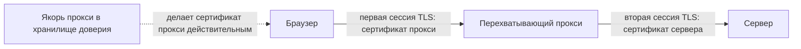

# TLS: рукопожатие, цепочка сертификатов, перехват прокси

Уровень **L2** · время 33 мин (теория 18 / задача 10 / самопроверка 5,
оценка)

Что прочитать сначала: `http-basics`, `security-headers`.

Стенд собран: браузер направлен через перехватывающий прокси, сертификат прокси
лежит в доверенных. Браузер открывает `https://shop.example`, замок в адресной
строке закрыт, предупреждений нет. В окне прокси при этом виден весь запрос.

```http
POST /login HTTP/1.1
Host: shop.example
Content-Type: application/x-www-form-urlencoded

login=anna&password=hunter2
```

**Было — стало.** До установки браузер проверял сертификат `shop.example`,
выпущенный публичным удостоверяющим центром. Теперь он проверяет сертификат на
то же имя, выпущенный вашей установкой прокси минуту назад. Замок закрыт и там,
и там.

Криптография здесь не сломана и не обойдена. Соединений два: браузер согласовал
TLS с прокси, прокси — с сервером, и каждое зашифровано как положено. Проверка
сертификата тоже прошла: браузер сверил цепочку с хранилищем доверия, а в
хранилище лежит якорь, который вы сами туда положили. В браузере дефекта нет
вовсе. Он появляется, когда тот же якорь остаётся в хранилище приложения на
продакшене или когда проверку в клиенте выключают строкой конфигурации.

TLS (Transport Layer Security) — то, что превращает `http` в `https`. Он делает
две разные вещи: договаривается с другой стороной о ключах шифрования и
подтверждает, что на другом конце тот, чьё имя написано в адресе. Первое —
обмен сообщениями, его называют рукопожатием. Второе — проверка сертификата, и
ведёт её клиент по своим правилам, а не протокол.

Шифрование и удостоверение личности независимы: соединение бывает зашифровано
безупречно и установлено при этом не с тем, с кем вы думали. Вопрос на этом
месте: что должно случиться с хранилищем доверия, чтобы тот же перехват
сработал без вашего участия?

К этому случаю тема возвращается трижды. «Как выглядит в коде» показывает три
строки, которыми ту же дверь открывают в приложении. «Как чинится» — чем
добавленный якорь отличается от выключенной проверки. «Ловушка» объясняет,
почему закрытый замок сам по себе ничего не доказывает.

Слабые и устаревшие алгоритмы разбираются в теме `weak-algorithms`, передача
данных в открытом виде — в `plaintext-data`; здесь модель и рабочий инструмент.

## 0. Коротко

То же в терминах, которыми это обсуждают. TLS решает две задачи
разом: договориться о ключах и убедиться, что на другом
конце тот, чьё имя написано в адресе. Первую закрывает рукопожатие, вторую —
цепочка сертификатов, и проверяет её клиент, а не протокол. RFC 9846 выносит
подробную проверку за свои границы и отсылает к RFC 5280. Отсюда следует
устройство перехватывающего прокси: он не ломает криптографию, он предъявляет
сертификат, которому вы сами велели доверять.

**Зачем это в работе AppSec-инженера.** Сертификат перехватывающего прокси вы,
скорее всего, уже добавляли в доверенные: иначе инструмент не показал бы ни
одного запроса по HTTPS. Что при этом изменилось в проверке, разбирать было
незачем — трафик стало видно, работа пошла. Перехватывающий прокси — ежедневный
инструмент, и понимать его надо не по кнопкам, а по механизму. Тот же механизм
в чужих руках означает чтение вашего трафика, а в коде приложения выглядит
одной строкой отключённой проверки.

## 1. Цели

После этого раздела вы сможете:

1. Назвать три фазы рукопожатия и сказать, с какого момента трафик зашифрован.
2. Перечислить, что проверяет клиент в каждом звене цепочки.
3. Объяснить, почему перехват прокси не требует взлома криптографии.
4. Найти в коде отключённую проверку сертификата.
5. Отличить доверие, встроенное в систему, от доверия, добавленного вами.

## 3. Механика

**Откуда это взялось.** Договориться о ключах с незнакомцем криптография
умеет и без чужой помощи. Не умеет она другого: сказать, кто на другом конце.
Ключ из рукопожатия принадлежит тому, кто это рукопожатие провёл. Отличить
нужный сервер от того, кто встал на его место, ключ не помогает. Придумали
вынести вопрос доверия наружу: клиент заранее держит список корней, а сервер
предъявляет цепочку до одного из них. RFC 5280 говорит об этом без обиняков:
корень — вход алгоритма проверки, а его выбор — вопрос политики. Список
корней после этого — единственное, на чём стоит вся проверка имени.

### Три фазы рукопожатия

RFC 9846 (июль 2026) описывает TLS 1.3 и обсолетит RFC 8446 вместе с
RFC 5246, 5077, 6961, 7627 и 8422. Рукопожатие в нём разложено на три фазы:

1. **Key Exchange** — установить общий ключевой материал и выбрать
   криптографические параметры. Всё, что идёт после этой фазы, зашифровано.
2. **Server Parameters** — договориться об остальных параметрах: нужна ли
   аутентификация клиента, какой протокол уровня приложения поддержан.
3. **Authentication** — аутентифицировать сервер и, если требуется, клиента,
   подтвердить ключи и целостность рукопожатия.

Сообщение `Certificate` несёт список звеньев; при согласованном типе X.509
каждое звено — сертификат X.509 в кодировке DER, и сертификат отправителя
идёт первым. Спецификация требует, чтобы тип был X.509v3, если явно не
согласовано иное.

### Что проверяет клиент

§ 4.5.1.3 говорит прямо: подробные процедуры проверки сертификата **вне
области** TLS, за ними — RFC 5280. Своих требований у TLS немного, и они
касаются алгоритмов. Получатель сертификата, который пришлось бы проверять
подписью на MD5, **обязан** прервать рукопожатие оповещением
`bad_certificate`. Для SHA-1 то же действие **рекомендовано**.

Проверку пути описывает RFC 5280 § 6.1. Входом алгоритма служит **trust
anchor** — якорь доверия; цель — подтвердить связь между именем субъекта и
его открытым ключом, опираясь на открытый ключ якоря. Для каждого звена
проверяется четыре вещи (§ 6.1.3, шаг a). Подпись сходится на рабочем
открытом ключе, текущее время попадает в срок действия, сертификат не отозван,
имя издателя совпадает с ожидаемым.

> **Примечание.** Поддержка части расширений в этом алгоритме объявлена
> необязательной, и клиент вправе пропустить соответствующие шаги. Обязательно
> другое: сертификат с **неподдерживаемым критическим** расширением клиент
> отвергает.

### Почему прокси читает HTTPS

Перехватывающий прокси встаёт между браузером и сервером и предъявляет
браузеру собственный сертификат на имя сервера. Документация Burp Suite
описывает механизм без иносказаний. Каждая установка порождает свой
собственный сертификат удостоверяющего центра. Слушатели Proxy используют его
для согласования соединений TLS, выпуская сертификаты на каждый хост.

Криптография при этом не ломается — ломается предпосылка проверки. Якорем
доверия становится тот, кого вы добавили в хранилище сами. Та же документация
формулирует и обратную сторону, и стоит сохранить её осторожность дословно.
Закрытый ключ не следует раскрывать **недоверенной стороне**, потому что
**злоумышленник**, завладевший вашим сертификатом и ключом, **может оказаться
способен** перехватывать ваш трафик HTTPS. Причём и в то время, когда вы не
пользуетесь Burp.

Вопрос, на который отвечает схема: кто с кем устанавливает TLS и чей сертификат
при этом проверяется.



**Описание схемы.** Слева якорь доверия, дальше три стороны в один ряд. Две
сплошные стрелки — две независимые сессии TLS: браузер согласовывает первую с
прокси, прокси согласовывает вторую с сервером. Пунктирная стрелка — не
соединение, а условие: она показывает, откуда браузер берёт основание считать
сертификат прокси действительным.

Сервер о первой сессии ничего не знает и знать не может: с его стороны прокси —
обычный клиент. Браузер о второй сессии тоже ничего не знает. Соединения «от
браузера до сервера» на схеме нет вообще, и это не упрощение — его нет и на
проводе.

## 5. Как выглядит в коде

Ревьюер ищет три вещи, и все три — про проверку, а не про шифрование. Назовите
все три сами, не заглядывая в разбор.

```text
# Псевдокод, не исполняется. УЯЗВИМО — демонстрация, не для продакшена
client = http_client(verify_certificates = False)      # (1)
client = http_client(trust_store = ["corp-proxy-ca"])  # (2)
client = http_client(hostname_check = False)           # (3)
```

1. Проверка выключена целиком. Соединение зашифровано, но собеседник не
   проверен — ASVS v5.0-12.3.2 требует ровно обратного.
2. В хранилище доверия оставлен якорь перехватывающего прокси — тот самый, что
   открыл трафик в примере начала темы. В отладочной сборке это норма, в
   продакшене — постоянно открытая дверь.
3. Цепочка проверяется, а имя — нет. Любой действительный сертификат на любое
   имя пройдёт.

**Что искать глазами.** Признак — параметр вызова клиента HTTP, а не работа с
сокетами. Отключение почти всегда появляется во время отладки против стенда с
самоподписанным сертификатом и остаётся в коде. ASVS v5.0-12.3.4 требует,
чтобы внутренние соединения использовали доверенные сертификаты, а
самоподписанные — сопровождались отдельным управлением доверием, а не
отключением проверки.

> **Примечание.** Самоподписанный сертификат сам по себе находкой не служит.
> Он становится ею, когда клиент принимает его без явно настроенного якоря
> доверия, — то есть когда доверие подменено отсутствием проверки.

## 6. Как чинится

```text
# Псевдокод, не исполняется. Исправленный вариант.
TRUST = system_store() + read_pem("/etc/pki/internal-ca.pem")  # (1)

client = http_client(
    verify_certificates = True,                                 # (2)
    hostname_check = True,
    trust_store = TRUST,
    min_tls_version = "1.2",                                    # (3)
)
```

Попробуйте назвать сами: чем добавление внутреннего якоря отличается от
отключения проверки, если в обоих случаях самоподписанный сертификат
принимается.

<details markdown="1">
<summary>Разбор выносок</summary>

1. Якорь добавлен явно, один, из известного файла. Область доверия расширена
   на один известный удостоверяющий центр, а не на всех, кто предъявит
   сертификат.
2. Проверка цепочки и проверка имени включены и разделены: это два разных
   контроля, и выключают их по отдельности.
3. Нижняя граница версии протокола задана явно. ASVS v5.0-12.1.1 требует
   держать включёнными только последние рекомендованные версии, а старшую —
   предпочитаемой.

</details>

**Чего не даёт.** Проверенная цепочка подтверждает связь имени с ключом и
ничего не говорит о том, что делает владелец этого имени. Она также не
защищает от того, кто законно попал в хранилище доверия — включая
перехватывающий прокси вашей же организации. Стенд из начала темы после этой
правки читает трафик по-прежнему: якорь прокси из хранилища никуда не делся.
Проверка подтверждает имя, а не намерения.

**Стоимость.** Внутренний удостоверяющий центр требует раздачи якоря на все
узлы и продления сертификатов по расписанию. Просроченный внутренний
сертификат кладёт связность так же надёжно, как ошибка в коде.

## 9. Ловушка

Расхожее объяснение: если браузер не показал предупреждения, цепочка проверена
полностью. Оно звучит как здравый смысл — примите сторону до разбора: верно
оно или нет.

**Оно описывает не то.** Проверено ровно то, что клиент решил проверять.
Скачок в рассуждении один: из «все обязательные проверки прошли» выводится
«проверено всё», хотя обязательный минимум — лишь часть того, что клиент мог
проверить.

Что происходит. RFC 5280 объявляет поддержку части расширений необязательной и
разрешает клиенту пропускать соответствующие шаги. Отзыв может проверяться
списком отзыва, статусной информацией или внеполосным механизмом — а может не
проверяться вовсе. TLS, со своей стороны, выносит подробную проверку за свои
границы. Значит, «браузер не ругается» описывает поведение конкретного
клиента, а не свойство соединения.

Где это ломается, показано в начале темы. Сертификат выпущен минуту назад на
любое имя, цепочка сходится, замок в адресной строке закрыт, а трафик читается
целиком. Ничего не сломано, все проверки прошли — якорь доверия добавили вы
сами.

## 10. Чеклист ревью

1. Verify that ни один клиент HTTP в кодовой базе не создаётся с отключённой
   проверкой сертификата (ASVS v5.0-12.3.2).
2. Verify that проверка имени хоста включена отдельно от проверки цепочки.
3. Verify that хранилище доверия продакшена не содержит якорей отладочных
   прокси.
4. Verify that внутренние соединения используют доверенные сертификаты, а
   самоподписанные сопровождаются явно настроенным якорем (ASVS v5.0-12.3.4).
5. Verify that внешние службы предъявляют публично доверенные сертификаты
   (ASVS v5.0-12.2.2).
6. Verify that включены только последние рекомендованные версии протокола, а
   старшая из них предпочитается (ASVS v5.0-12.1.1).

## 11. Задача

Снимите цепочку сертификатов своего стенда двумя способами: как её видит
обычный клиент и как её видит клиент через перехватывающий прокси.

Одно указание: сравнивать надо не имена, а издателей — имя субъекта в обоих
случаях совпадёт, и в этом весь смысл механизма.

**Критерий выполнения.** Готов список звеньев для каждого случая. Против
каждого звена записаны три поля: субъект, издатель, срок действия. Отдельной
строкой сказано, какое звено во втором случае отсутствует в системном
хранилище доверия и откуда оно там появилось.

## 12. Проверь себя

1. Какие три фазы выделяет RFC 9846 в рукопожатии и после какой из них трафик
   зашифрован?
2. Четыре проверки, которые RFC 5280 предписывает для каждого звена, — назовите
   их.
3. Что обязан сделать получатель сертификата, который пришлось бы проверять
   подписью на MD5?
4. Почему перехватывающий прокси не требует знания закрытого ключа сервера?
5. Возврат к теме `security-headers`: какое окно HSTS не закрывает даже
   при верно выставленном поле?
6. Возврат к теме `security-headers`: как HSTS меняет поведение браузера при
   ошибке проверки сертификата?

<details markdown="1">
<summary>Ответы</summary>

1. Key Exchange, Server Parameters, Authentication. Всё, что после первой,
   зашифровано.
2. Подпись проверяется рабочим открытым ключом; текущее время попадает в срок
   действия; сертификат не отозван; имя издателя совпадает с ожидаемым.
3. Прервать рукопожатие оповещением `bad_certificate`. Для SHA-1 то же
   действие рекомендовано, но не обязательно.
4. Потому что он не расшифровывает чужое соединение, а устанавливает два
   своих: одно с браузером, другое с сервером. Браузеру он предъявляет
   собственный сертификат, и тот проходит проверку, поскольку якорь прокси
   лежит в хранилище доверия.
5. Первое обращение к незнакомому узлу идёт по открытому каналу: политики
   у браузера ещё нет. Окно закрывается не полем, а списками preload.
6. Для уже известного узла браузер обязан разорвать соединение при любой
   ошибке транспорта, включая ошибки проверки сертификата, и не даёт
   пользователю её пропустить.

</details>

## 13. Источники

1. RFC 9846 «The Transport Layer Security (TLS) Protocol Version 1.3», IETF,
   Standards Track, июль 2026; реестр `rfc9846-tls13`. Разделы: § 2 обзор
   протокола, § 4.5.1 Certificate, § 4.5.1.2 выбор сертификата,
   § 4.5.1.3 приём сообщения Certificate.
   <https://www.rfc-editor.org/rfc/rfc9846.html>
2. RFC 5280 «Internet X.509 PKI Certificate and CRL Profile», IETF,
   Standards Track, май 2008; реестр `rfc5280-x509`. Разделы: § 6.1 базовая
   проверка пути, § 6.1.3 обработка сертификата.
   <https://www.rfc-editor.org/rfc/rfc5280.html>
3. «Managing CA certificates», документация Burp Suite, правка 20 августа
   2026; реестр `burp-proxy-manage-certificates`. Разделы: экспорт и импорт
   сертификата, создание собственного центра командами `openssl`.
   <https://portswigger.net/burp/documentation/desktop/tools/proxy/manage-certificates>
4. «Proxy intercept», документация Burp Suite, правка 20 августа 2026; реестр
   `burp-proxy-intercept-messages`. Разделы: Controls, Message display.
   <https://portswigger.net/burp/documentation/desktop/tools/proxy/intercept-messages>
5. «Burp Proxy», документация Burp Suite, правка 20 августа 2026; реестр
   `burp-docs-proxy`. Обзорная страница раздела.
   <https://portswigger.net/burp/documentation/desktop/tools/proxy>

Каркас этапа: `owasp-asvs-5-document` (ASVS v5.0.0) — наследуется всеми темами
этапа 0.

**Скоропортящийся слой.** Документация Burp Suite — документация живого
продукта: заголовок страницы про перехват на правке от 20 августа 2026 звучит
как «Proxy intercept», хотя в оглавлении раздела она названа «Intercepting
messages». Список обсолеченных документов у RFC 9846 будет расти, а RFC 5280
уже обновлён девятью RFC — при ревизии сверять список Updated by.

**Маркеры уверенности.** Фазы рукопожатия, состав сообщения `Certificate`,
требования по MD5 и SHA-1, вынесение подробной проверки за границы протокола
— по спецификации (RFC 9846, открыт лично 2026-08-22). Алгоритм проверки пути,
четыре проверки звена и положение корня как входа алгоритма, выбираемого
политикой (§ 6.1), — по спецификации (RFC 5280, открыт лично 2026-08-22). Устройство удостоверяющего центра Burp и предупреждение о
закрытом ключе — по документации инструмента (три страницы открыты лично
2026-08-22). Требования 12.1.1, 12.2.2, 12.3.2, 12.3.4 сверены с текстом ASVS
v5.0.0 (открыт лично 2026-08-22). Перехват не выполнялся: стенда под рукой не
было. Сценарий во введении — иллюстрация: механизм в нём тот, что описан
документацией инструмента, а прогона за ним нет.

**Число источников.** У темы пять собственных источников, и ни один не лишний:
TLS 1.3 выносит проверку сертификата к RFC 5280, а обзорная страница прокси не
содержит ни процедуры перехвата, ни работы с удостоверяющим центром — обе
вынесены на подстраницы.
