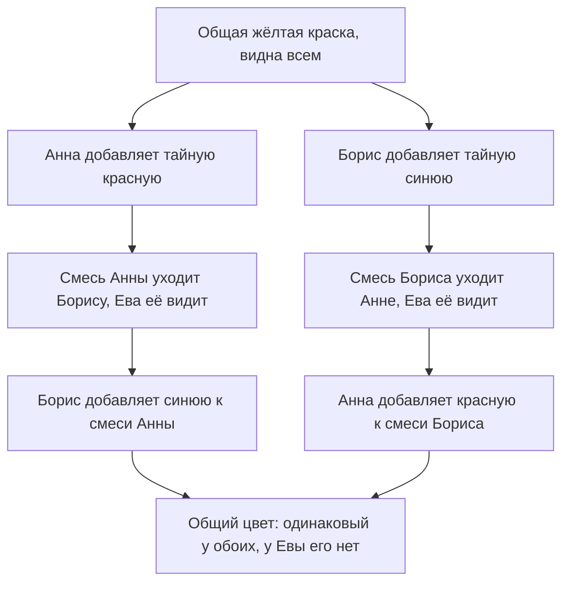
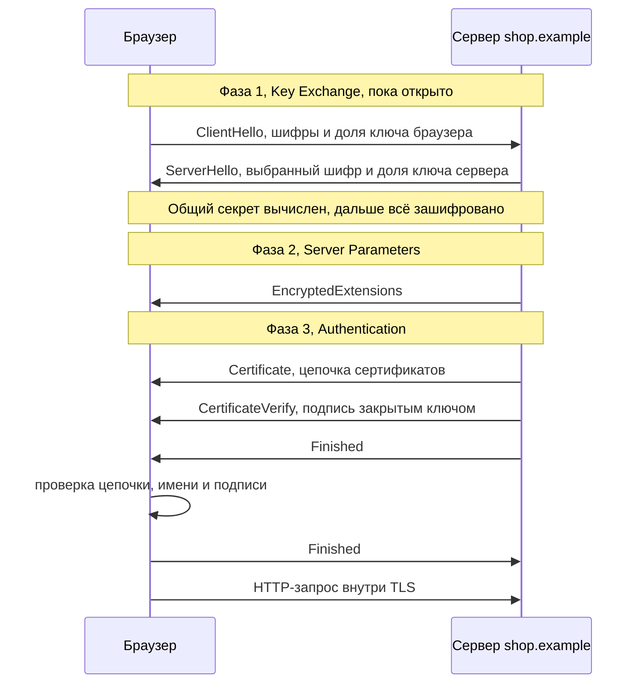
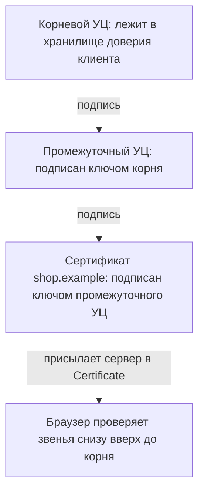
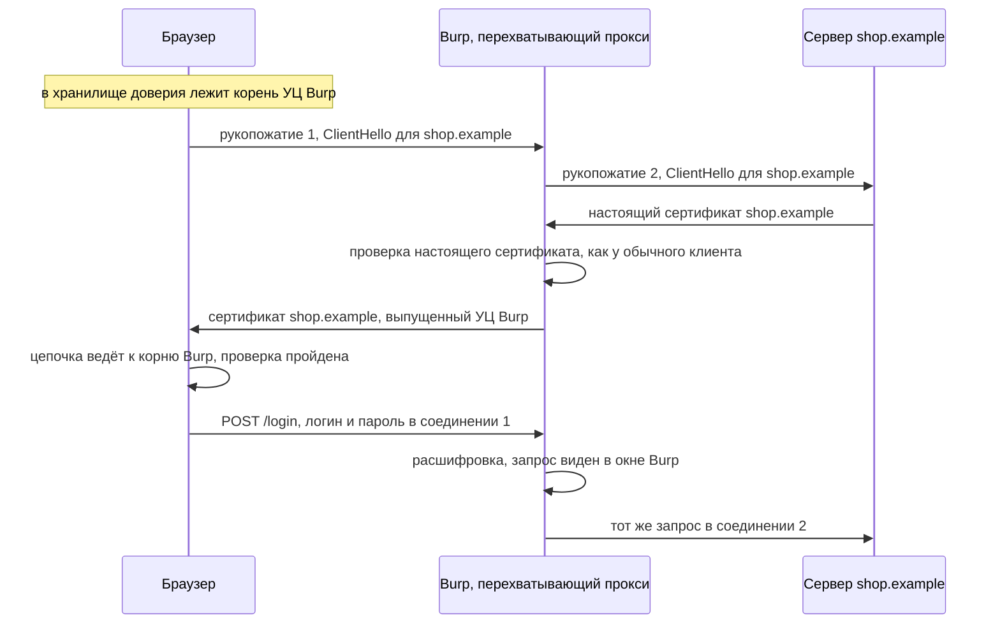

# TLS: рукопожатие, цепочка сертификатов, перехват прокси

Представьте первый день на проекте. Вы ставите Burp Suite, программу,
которая встаёт между браузером и сайтом и показывает каждый запрос. Через
неё вы открываете `https://shop.example` и входите в аккаунт. Слева от
адреса браузер рисует закрытый замок: так он сообщает, что соединение
зашифровано и сайт подтвердил своё имя. Предупреждений нет, а в окне Burp
виден весь запрос с логином и паролем. Это странно, ведь HTTPS обещает,
что посторонний запрос не прочитает. Шифр при этом никто не взламывал.
Точно так же ваш трафик читает корпоративный прокси или хозяин точки
доступа в кафе, если сумел добавить свой сертификат в ваше устройство.

## Что такое TLS

TLS (Transport Layer Security) — протокол, который превращает `http` в
`https`. Сам HTTP-запрос ничего не прячет, это обычный текст. TLS сначала
устанавливает между браузером и сервером защищённый канал, а потом внутри
него идут те же самые HTTP-запросы. Чтобы понять, как устроен этот канал,
нужно несколько понятий из криптографии. Разберём их по порядку, каждое на
бытовом примере.

### Зачем вообще шифровать

Запрос от вашего ноутбука до сервера проходит через несколько чужих
устройств. Например, через роутер в кафе, оборудование провайдера и узлы
магистральных сетей. Каждое из них видит байты, которые через него идут. Без
защиты у такого посредника три возможности. Он может прочитать запрос, может
незаметно изменить ответ, например вставить в страницу свой скрипт. И он
может притвориться сервером, к которому вы шли. TLS закрывает все три,
и ниже видно, какая его часть за что отвечает.

### Шифр и ключ

Шифр — это алгоритм, который превращает читаемый текст в набор байтов,
похожий на шум, и умеет превратить его обратно. Ключ — секретное число,
без которого обратное превращение не получится. Алгоритмы при этом
публичны. Например, шифр AES описан в открытом стандарте, и его код есть в
каждом браузере. Секрет держится только на ключе.

Бытовой пример — кодовый замок на велосипеде. Как он устроен, знает любой,
таких замков в магазине сотни. Открыть его можно только комбинацией, а она
есть у вас. Здесь замок соответствует алгоритму, а комбинация — ключу. Но
аналогия перестаёт работать на размере. Комбинацию из четырёх цифр
перебирают за вечер. У ключа AES-256 вариантов два в степени 256, и
перебрать их не хватит никаких компьютеров.

Если один и тот же ключ и шифрует, и расшифровывает, шифрование называют
симметричным. Оно быстрое, и в TLS им шифруются все данные после начала
соединения. В прогонах этой темы шифр называется `TLS_AES_256_GCM_SHA384`,
то есть AES с ключом длиной 256 бит.

Тут и появляется главная проблема. Браузер и сервер никогда раньше не
встречались, общего ключа у них нет. Если браузер придумает ключ и отправит
его по сети, посредник на линии его прочитает и дальше расшифрует всё.
Значит, нужен способ договориться о секрете так, чтобы подслушивающий его
не узнал, хотя слышит каждое слово.

### Как договориться о секрете при свидетеле

Способ придумали Уитфилд Диффи и Мартин Хеллман в 1976 году, и его обычно
объясняют красками. Есть Анна, Борис и Ева, которая видит всё, что
передают Анна и Борис. Алгоритм в красках работает в четыре шага.

1. Анна и Борис открыто договариваются об общей краске, например жёлтой.
   Ева это видит.
2. Каждый тайно выбирает свою краску. Анна берёт красную, Борис синюю, и
   никому их не показывает.
3. Каждый смешивает общую жёлтую со своей тайной и отправляет смесь другому.
   Ева видит обе смеси.
4. Анна добавляет свою красную в смесь Бориса, Борис добавляет синюю в смесь
   Анны. У обоих получается одинаковый цвет: жёлтый, красный и синий вместе.

Ева видела жёлтую краску и обе смеси. Но чтобы получить итоговый цвет, ей
нужна одна из тайных красок, а разделить смесь обратно на составляющие
нельзя.


```mermaid
flowchart TB
    Y[Общая жёлтая краска, видна всем]
    A[Анна добавляет тайную красную]
    B[Борис добавляет тайную синюю]
    AY[Смесь Анны уходит Борису, Ева её видит]
    BY[Смесь Бориса уходит Анне, Ева её видит]
    AF[Анна добавляет красную к смеси Бориса]
    BF[Борис добавляет синюю к смеси Анны]
    S[Общий цвет: одинаковый у обоих, у Евы его нет]
    Y --> A --> AY --> BF --> S
    Y --> B --> BY --> AF --> S
```

**Описание схемы.** Схема читается сверху вниз. Общая краска расходится
двум участникам, каждый подмешивает свою тайную и отправляет смесь другому.
Каждый подмешивает свою тайную ещё раз, уже в чужую смесь, и обе ветки
приходят к одному цвету. Ева видит только общую краску и две смеси.

Соответствие такое. Краски — это числа, смешивание — математическая
операция, которая считается за миллисекунды, а обращается только перебором,
на который не хватит никакого времени. Итоговый
цвет — общий секрет, из которого обе стороны выводят ключ для AES. По сети
этот ключ не передавался ни разу, поэтому Ева не может его перехватить. В
TLS 1.3 используют вариант на эллиптических кривых, ECDHE. Последняя буква
означает ephemeral, «одноразовый»: тайные краски выбираются заново для
каждого соединения. Поэтому запись сегодняшнего трафика не расшифруют и
потом, даже если украдут постоянный ключ сервера.

Где аналогия ломается. Она предполагает, что смесь Анны дошла именно до
Бориса. Но представьте, что Ева не только смотрит, а перехватывает банки.
Тогда она проводит обмен с Анной от имени Бориса и отдельный обмен с
Борисом от имени Анны. У Анны общий секрет с Евой, у Бориса тоже с Евой, а
Ева читает и пересылает всё между ними. Такого посредника называют MITM (man
in the middle, «человек посередине»). Против того, кто только слушает,
Диффи–Хеллман защищает. Против того, кто встал посередине, нет. Значит, нужна
вторая часть: убедиться, что на другом конце именно тот, к кому вы шли.

### Открытый и закрытый ключ, цифровая подпись

Для этой второй части нужна асимметричная криптография. В ней ключи
создаются парой. Открытый ключ можно раздавать кому угодно. Закрытый ключ
хранится только у владельца и никуда не отправляется. Ключи связаны
математически: то, что сделано одним, проверяется или открывается другим.

Цифровая подпись использует пару так. Владелец берёт сообщение и с помощью
закрытого ключа вычисляет подпись, то есть ещё одно число. Любой, у кого есть
открытый ключ, проверяет, что подпись сходится с сообщением. Сойдётся она
только при двух условиях. Сообщение не меняли ни на байт, и подпись ставил
тот, у кого есть закрытый ключ.

Бытовой пример — личная печать. Оттиск знают все, сверить его может
любой, а поставить может только хозяин печати. Здесь печать соответствует
закрытому ключу, образец оттиска — открытому. Аналогия неточна в двух
местах. Хорошую печать можно подделать у мастера, а цифровую подпись без
закрытого ключа подделать нельзя. И подпись привязана к конкретному тексту:
поменяйте в письме одну букву, и старая подпись к нему уже не подойдёт.

В TLS 1.3 закрытый ключ сервера нужен именно для подписи. Сервер
подписывает ход рукопожатия (handshake), то есть обмена сообщениями в
начале соединения, и браузер проверяет подпись открытым ключом сервера.
Шифровать открытым ключом сервера сам секрет TLS 1.3 не умеет.

> **Примечание.** Во многих статьях TLS объясняют иначе: браузер придумывает
> ключ сессии, шифрует его открытым ключом сервера и отправляет. Так
> действительно работал режим обмена RSA в старых версиях. Из TLS 1.3 его
> убрали, и общий секрет там всегда получается через (EC)DHE, как в красках.
> Если в статье про TLS 1.3 «ключ сессии шифруют открытым ключом», она
> описывает не тот протокол.

Остаётся вопрос. Открытый ключ — это одно число, и больше ничего. Ева тоже может создать
пару ключей, прислать свой открытый ключ и подписать рукопожатие своим
закрытым. Как браузеру понять, что ключ принадлежит `shop.example`, а не
Еве?

### Сертификат и удостоверяющий центр

Ответ даёт сертификат. Это небольшой документ, в котором записаны имя сайта,
его открытый ключ, срок действия и тот, кто документ выдал. Внизу стоит
подпись выдавшего. Выдаёт сертификаты удостоверяющий центр (УЦ). Он
проверяет, что заявитель действительно управляет доменом, и подписывает
сертификат своим закрытым ключом. Пример такой организации — Let's Encrypt.

Сертификат похож на паспорт. Пограничник не верит вам на слово, но верит
паспорту, потому что его выдало государство, которое пограничник признаёт.
Соответствие такое.

| Паспорт | Сертификат |
|---|---|
| ФИО владельца | имя сайта, например `shop.example` |
| фотография, по которой узнают владельца | открытый ключ |
| паспортный стол | удостоверяющий центр |
| защитные знаки бланка | подпись УЦ |
| список государств, чьи паспорта признаёт пограничник | хранилище доверия |

Хранилище доверия (trust store) — это список сертификатов УЦ, которым
устройство верит заранее, без доказательств. Его поставляют вместе с
операционной системой или браузером, а администратор или вы сами можете его
дополнить. Сертификат из этого списка называют корнем, или якорем доверия
(trust anchor).

Аналогия ломается в важном месте. Паспорт не отдают чужим людям, а
сертификат публичен, сервер присылает его каждому. Скопировать сертификат
`shop.example` может и Ева. Поэтому одного сертификата мало. Сервер должен
ещё доказать, что у него есть закрытый ключ, парный открытому ключу из
сертификата. Это и есть подпись рукопожатия. Пограничник не только смотрит
паспорт, но и сверяет лицо с фотографией.

### Что значит замок в адресной строке

Теперь понятно, что показывает замок. Браузер поставил соединение TLS,
получил сертификат, проверил цепочку подписей до корня из своего хранилища
доверия и убедился, что имя в сертификате совпадает с адресом. Кроме того,
сервер доказал подписью, что владеет закрытым ключом.

Чего замок не означает, важно не меньше. Он не говорит, что сайт честный:
у фишинговой страницы тоже бывает действительный сертификат на её
собственное имя. Он не говорит, как сервер хранит ваши данные. И он не
говорит, что между вами и сайтом никого нет, если в хранилище доверия
лежит корень, который туда добавили. С Burp из вступления случилось именно
это.

Итого у TLS две задачи. Первая — договориться о секретном ключе так, чтобы
посредник на линии видел только шум. Её решает рукопожатие, и следующий
раздел раскладывает его на три фазы. Вторая — убедиться, что на другом
конце тот, чьё имя в адресе. Её решает проверка сертификата, и проводит её
клиент по своим правилам. Задачи независимы. Соединение бывает
зашифровано безупречно, но не с тем, с кем вы думали. Слабые алгоритмы
разобраны в теме `weak-algorithms`, открытая передача данных — в теме
`plaintext-data`.

## Как это работает

### Рукопожатие в три фазы

TLS 1.3 описан в RFC 9846 (июль 2026), который заменил RFC 8446. Рукопожатие
в нём разложено на три фазы. Каждую разберём через понятия, которые уже
знакомы.

1. **Key Exchange.** Браузер отправляет `ClientHello`, где перечислены
   поддерживаемые шифры и лежит его «смесь красок», доля ключа. Сервер
   отвечает `ServerHello` со своей долей и выбранным шифром. После этого обе
   стороны вычисляют общий секрет, и всё дальнейшее зашифровано.
2. **Server Parameters.** Сервер присылает `EncryptedExtensions`, остальные
   параметры. Например, нужна ли аутентификация клиента и какой протокол
   уровня приложения выбран.
3. **Authentication.** Сервер доказывает, кто он, тремя сообщениями.
   `Certificate` несёт сертификаты. `CertificateVerify` — подпись закрытым
   ключом сервера под всем ходом рукопожатия. `Finished` подтверждает, что
   ключи у сторон совпали и сообщения по дороге никто не менял.
   Клиент в ответ шлёт свой `Finished`.


```mermaid
sequenceDiagram
    participant B as Браузер
    participant S as Сервер shop.example
    Note over B,S: Фаза 1, Key Exchange, пока открыто
    B->>S: ClientHello, шифры и доля ключа браузера
    S->>B: ServerHello, выбранный шифр и доля ключа сервера
    Note over B,S: Общий секрет вычислен, дальше всё зашифровано
    Note over B,S: Фаза 2, Server Parameters
    S->>B: EncryptedExtensions
    Note over B,S: Фаза 3, Authentication
    S->>B: Certificate, цепочка сертификатов
    S->>B: CertificateVerify, подпись закрытым ключом
    S->>B: Finished
    B->>B: проверка цепочки, имени и подписи
    B->>S: Finished
    B->>S: HTTP-запрос внутри TLS
```

**Описание схемы.** Сначала браузер и сервер открыто обмениваются долями
ключа, как смесями красок. С этого места оба знают общий секрет, и всё
остальное идёт зашифрованным. Сервер присылает параметры, сертификат и
подпись. Браузер сам решает, верить ли им, и только после этого отправляет
HTTP-запрос.

Как это выглядит на проводе, я проверил локально без сети. Сделал учебный УЦ
`Demo Proxy CA`, выпустил им сертификат на `shop.example`, поднял
`openssl s_server` (OpenSSL 3.6.4) и подключился клиентом с флагом `-msg`.
Он печатает каждое сообщение. Здесь оставлены только строки рукопожатия:

```text
$ openssl s_client -connect localhost:48443 -servername shop.example \
    -verify_hostname shop.example -verify_return_error \
    -CAfile ca.pem -msg </dev/null
>>> TLS 1.3, Handshake [length 060d], ClientHello
<<< TLS 1.3, Handshake [length 04ba], ServerHello
<<< TLS 1.3, ChangeCipherSpec [length 0001]
<<< TLS 1.3, Handshake [length 0006], EncryptedExtensions
<<< TLS 1.3, Handshake [length 0329], Certificate
<<< TLS 1.3, Handshake [length 0108], CertificateVerify
<<< TLS 1.3, Handshake [length 0034], Finished
>>> TLS 1.3, ChangeCipherSpec [length 0001]
>>> TLS 1.3, Handshake [length 0034], Finished
```

Стрелка `>>>` означает «отправил клиент», `<<<` — «пришло от сервера».
Порядок совпадает со схемой. `ChangeCipherSpec` в TLS 1.3 ничего не
делает. Его шлют ради совместимости со старым сетевым оборудованием,
которое без него рвёт соединение. Всё, начиная с `EncryptedExtensions`,
в полном выводе приходит записями `InnerContent`, то есть уже
зашифрованным. Длина `ClientHello` 0x060d, это 1549 байт, и почти всё
занимает доля ключа.

Там же клиент печатает, о чём договорились стороны:

```text
Peer signing digest: SHA256
Peer signature type: rsa_pss_rsae_sha256
Negotiated TLS1.3 group: X25519MLKEM768
New, TLSv1.3, Cipher is TLS_AES_256_GCM_SHA384
Verify return code: 0 (ok)
```

Строка `group` называет математику «красок». X25519MLKEM768 — гибрид.
К привычному обмену на кривой X25519 добавлен постквантовый механизм
ML-KEM-768, стойкий и против квантового компьютера. Общий секрет
собирается из обоих обменов. Если ограничить клиента флагом
`-groups X25519`, он печатает `Peer Temp Key: X25519, 253 bits`, то есть
чистый ECDHE. Строка `signature type` говорит, чем подписан
`CertificateVerify`. Ключ сервера здесь RSA, но служит он только для
подписи, а не для передачи секрета.

Сообщение `Certificate` — это список звеньев, и первым идёт сертификат
самого сервера. Если стороны не договорились об ином, каждое звено —
сертификат X.509v3 в кодировке DER, то есть в двоичной форме.

### Сертификат и цепочка до корня

**Откуда это взялось.** Договориться о ключе с незнакомцем криптография умеет
сама, это и показали краски. Но если на месте сервера встал кто-то другой,
ключ будет общим с ним. Поэтому вопрос «кто на том конце» решили отдельно.
Клиент заранее хранит список корней, а сервер предъявляет цепочку
сертификатов до одного из них.

Корни подписывают сертификаты сайтов обычно не напрямую. Закрытый ключ
корня берегут особенно тщательно и редко пускают в работу, поэтому между
корнем и сайтом стоит промежуточный УЦ. Получается цепочка. Сертификат
сайта подписан промежуточным УЦ, сертификат промежуточного УЦ подписан
корнем, а корень лежит в хранилище доверия.


```mermaid
flowchart TB
    R[Корневой УЦ: лежит в хранилище доверия клиента]
    I[Промежуточный УЦ: подписан ключом корня]
    L[Сертификат shop.example: подписан ключом промежуточного УЦ]
    R -->|подпись| I
    I -->|подпись| L
    C[Браузер проверяет звенья снизу вверх до корня]
    L -.->|присылает сервер в Certificate| C
```

**Описание схемы.** Сверху корень, которому клиент верит заранее. Он
подписывает промежуточный УЦ, а тот подписывает сертификат сайта. Сервер
присылает нижние звенья, и браузер проверяет подписи снизу вверх, пока не
дойдёт до корня из своего хранилища.

Вот как выглядит учебный сертификат сайта из прогона. Здесь цепочка короче,
промежуточного звена нет, и сайт подписан сразу корнем `Demo Proxy CA`:

```text
$ openssl x509 -in srv.pem -noout -subject -issuer -dates \
    -ext subjectAltName
subject=CN=shop.example
issuer=CN=Demo Proxy CA
notBefore=Oct  2 16:44:52 2026 GMT
notAfter=Oct  3 16:44:52 2026 GMT
X509v3 Subject Alternative Name:
    DNS:shop.example
```

`subject` — кому выдан сертификат, `issuer` — кто его подписал,
`notBefore` и `notAfter` — срок действия. Поле Subject Alternative Name
перечисляет имена, для которых сертификат действует. Именно с ним браузер
сверяет адрес из строки.

RFC 5280 называет якорь доверия входом алгоритма проверки, а его выбор —
вопросом политики. То есть сам алгоритм не решает, кому верить. Он берёт
готовый список корней и проверяет, что цепочка до одного из них сходится.
Отсюда главный вывод темы: вся проверка имени стоит на содержимом хранилища.

### Что проверяет клиент

В RFC 9846 (§ 4.5.1.3) подробная проверка сертификата вынесена за
пределы TLS и отдана RFC 5280. Свои требования у TLS касаются алгоритмов.
Если сертификат пришлось бы проверять подписью на MD5, клиент **обязан**
прервать рукопожатие оповещением `bad_certificate`. Для SHA-1 то же самое
**рекомендовано**. Обе хеш-функции, то есть алгоритмы, сводящие вход любой
длины к значению фиксированной, считаются сломанными, и подпись на них
можно подделать.

Проверку пути описывает RFC 5280 § 6.1. Цель алгоритма — подтвердить
связь имени субъекта с его открытым ключом, опираясь на ключ якоря. Для
каждого звена клиент проверяет четыре вещи (§ 6.1.3, шаг a).

1. Подпись звена сходится на открытом ключе предыдущего звена, то есть
   выдавший действительно его подписал.
2. Текущее время попадает в срок действия, между `notBefore` и `notAfter`.
3. Сертификат не отозван. Отзывают, например, когда закрытый ключ утёк.
4. Имя издателя совпадает с именем субъекта предыдущего звена.

Сверку имени сайта с адресом клиент делает отдельно, по полю Subject
Alternative Name. В коде это тоже отдельный переключатель, и ниже видно,
почему это важно.

> **Примечание.** Часть расширений в этом алгоритме необязательна, и клиент
> вправе пропустить соответствующие шаги. Но сертификат с критическим
> расширением, которое клиент не поддерживает, он обязан отвергнуть.

## Что будет без TLS

По `http` вход в магазин уходит в сеть как есть. Любой, кто видит трафик,
например сосед по Wi‑Fi, владелец роутера или провайдер, читает его
целиком:

```http
POST /login HTTP/1.1
Host: shop.example

login=anna&password=hunter2
```

По `https` тот же наблюдатель видит меньше. Ему доступны адрес сервера,
объём переданных данных и имя сайта. Имя он берёт из `ClientHello`: браузер
пишет его туда открыто, чтобы сервер с несколькими сайтами выбрал нужный
сертификат. Метод, путь, поля и тело для наблюдателя закрыты, потому что
идут после фазы Key Exchange. Подменить ответ он тоже не может, если клиент
проверил сертификат. Если не проверил, наблюдатель встаёт посередине, как
Ева с банками краски, и шифрование защищает канал только до него.

## Как работает перехват прокси

Прокси — это программа, через которую браузер ходит в сеть. Браузер
отдаёт запрос прокси, тот пересылает его серверу и возвращает ответ.
Перехватывающий прокси вроде Burp Suite делает больше. Он показывает
каждый запрос и ответ, а во вкладке Proxy > Intercept может остановить
запрос, дать вам его изменить и только потом отправить дальше.

**Зачем это в работе AppSec-инженера.** Перехватывающий прокси — основной
инструмент ручного тестирования веб-приложений. Через него видно, что
клиент отправляет на самом деле, и можно менять параметры в обход
интерфейса. Если вы уже настраивали Burp, то сертификат прокси вы добавляли
в доверенные сами: без этого шага он не показал бы ни одного запроса по
HTTPS. В чужих руках тот же механизм читает ваш трафик, а в коде приложения
выглядит одной строкой с отключённой проверкой.

### Проблема: посредник видит только шум

Если бы Burp только пересылал байты, он видел бы то же, что Ева: шум.
Ключ договорён между браузером и сервером, у Burp его нет. Чтобы увидеть
запрос, Burp должен сам стать концом соединения для браузера. То есть
провести рукопожатие с браузером от имени `shop.example`. Но тогда он
обязан предъявить сертификат на `shop.example` и подписать рукопожатие
парным закрытым ключом. Настоящего закрытого ключа сайта у Burp нет. А
сертификат, который Burp выпустит себе сам, браузер должен отвергнуть,
потому что он не ведёт ни к одному корню из хранилища.

### Решение: свой УЦ, которому вы сами доверились

Burp решает это так, как описано в его документации. Каждая установка Burp
создаёт собственный сертификат УЦ с собственным закрытым ключом. Вы
добавляете этот сертификат в хранилище доверия браузера, и с этого момента
корень Burp для браузера такой же законный, как встроенные. Когда браузер
идёт на `shop.example`, в дело вступает слушатель Proxy — часть Burp,
которая принимает соединения браузера. Он на лету выпускает сертификат
на это имя и подписывает его ключом своего УЦ.

Браузер получает сертификат на правильное имя. Цепочка ведёт к корню из
хранилища, потому что вы его туда положили. Подпись рукопожатия сходится,
потому что ключ к этому сертификату у Burp есть: он его только что создал.
Все проверки проходят, и замок закрыт.

Аналогия — секретарь, через которого идёт ваша почта. Он вскрывает каждое
письмо, читает, кладёт в новый конверт и заверяет своей печатью. Вы
заранее сказали своему почтальону, что эту печать надо принимать. Письмо
доходит, печать признана, и никто не жалуется. Соответствие: секретарь —
прокси, вскрытие — расшифровка на прокси, новый конверт — второе
соединение TLS, печать — сертификат, выпущенный УЦ прокси, ваше указание
почтальону — добавление корня в хранилище. Аналогия неточна в одном.
Подмену конверта вы бы заметили, а браузер о подмене ничего не скажет.
Увидеть её можно, только открыв сертификат и посмотрев на издателя.


```mermaid
sequenceDiagram
    participant B as Браузер
    participant P as Burp, перехватывающий прокси
    participant S as Сервер shop.example
    Note over B: в хранилище доверия лежит корень УЦ Burp
    B->>P: рукопожатие 1, ClientHello для shop.example
    P->>S: рукопожатие 2, ClientHello для shop.example
    S->>P: настоящий сертификат shop.example
    P->>P: проверка настоящего сертификата, как у обычного клиента
    P->>B: сертификат shop.example, выпущенный УЦ Burp
    B->>B: цепочка ведёт к корню Burp, проверка пройдена
    B->>P: POST /login, логин и пароль в соединении 1
    P->>P: расшифровка, запрос виден в окне Burp
    P->>S: тот же запрос в соединении 2
```

**Описание схемы.** Прокси не расшифровывает чужое соединение, он
устанавливает два своих. Первое между браузером и прокси, второе между
прокси и сервером, и каждое зашифровано как положено. Для сервера прокси —
обычный клиент. Браузер верит сертификату прокси только потому, что корень
Burp лежит в его хранилище. Соединения «от браузера до сервера» нет ни на
схеме, ни на проводе.

Замок закрыт и до установки Burp, и после, хотя сертификат `shop.example`
теперь выпустил прокси минуту назад. Сломана не криптография, а
предпосылка проверки: якорем стал тот, кого вы сами положили в хранилище.

### Проверка без Burp: меняется только хранилище

Я воспроизвёл это без Burp и без сети на том же стенде. Сервер отдаёт
сертификат `shop.example`, выпущенный учебным УЦ `Demo Proxy CA`. Это ровно
то, что делает прокси. Клиент с системным хранилищем соединение отверг:

```text
$ openssl s_client -connect localhost:48443 -servername shop.example \
    -verify_hostname shop.example -verify_return_error </dev/null
depth=0 CN=shop.example
verify error:num=20:unable to get local issuer certificate
 0 s:CN=shop.example
   i:CN=Demo Proxy CA
Verify return code: 20 (unable to get local issuer certificate)
```

Ошибка 20 значит, что клиент не нашёл в хранилище издателя
`Demo Proxy CA` и цепочку до корня не построил. Строки `s:` и `i:` — это
субъект и издатель присланного сертификата. Тот же клиент с добавленным
якорем `-CAfile ca.pem` принял то же соединение:

```text
depth=1 CN=Demo Proxy CA
verify return:1
depth=0 CN=shop.example
verify return:1
New, TLSv1.3, Cipher is TLS_AES_256_GCM_SHA384
Verify return code: 0 (ok)
```

Сертификат, сервер и шифр прежние, изменилось только хранилище. Именно это
происходит, когда вы добавляете в браузер сертификат Burp.

Документация Burp предупреждает и об обратной стороне: закрытый ключ этого УЦ
нельзя никому отдавать. Тот, кто получит сертификат вместе с ключом, сможет
перехватывать ваш HTTPS, даже когда сам Burp выключен. Причина та же:
ваш браузер доверяет этому корню, а значит, любому сертификату, подписанному
его ключом. Корпоративный прокси с проверкой трафика работает так же, только
корень в устройства сотрудников добавляет администратор.

## Как это выглядит в коде

В приложении та же история случается без всякого Burp. Дефект появляется,
когда якорь прокси остаётся в хранилище приложения на продакшене или когда
проверку выключают параметром. Ревьюер ищет три вещи, и все три про
проверку. Назовите их сами, прежде чем читать разбор.

```text
# Псевдокод, не исполняется. УЯЗВИМО — демонстрация, не для продакшена
client = http_client(verify_certificates = False)      # (1)
client = http_client(trust_store = ["corp-proxy-ca"])  # (2)
client = http_client(hostname_check = False)           # (3)
```

1. Проверка выключена целиком. Соединение зашифровано, но собеседник не
   проверен, хотя ASVS v5.0-12.3.2 требует обратного. Атакующему в той же
   сети достаточно встать посередине с любым сертификатом. Клиент проведёт
   с ним обмен ключами, зашифрует запрос ключом, общим с атакующим, и
   отдаст ему токен или пароль.
2. В хранилище оставлен якорь перехватывающего прокси, тот самый, что открыл
   трафик в начале темы. В отладочной сборке это допустимо, в продакшене это
   постоянно открытая дверь для любого, у кого есть ключ этого УЦ.
3. Цепочка проверяется, имя нет. Пройдёт любой действительный сертификат на
   любое имя. Атакующему хватит честно полученного сертификата на свой
   домен, например `evil.example`.

Обычно проверку выключают при отладке против стенда с самоподписанным
сертификатом, то есть подписанным своим же ключом, и забывают в коде. В
настоящих библиотеках это выглядит так, и ищут на ревью именно эти строки:

```text
# Python, requests
requests.get(url, verify=False)
# Python, ssl
ctx.verify_mode = ssl.CERT_NONE
ctx.check_hostname = False
# Node.js
https.request({ host, rejectUnauthorized: false })
NODE_TLS_REJECT_UNAUTHORIZED=0
# curl
curl -k https://shop.example/
```

Чтобы увидеть, что это значит на деле, я запустил четыре клиента на Python
против того же стенда. Сервер отдаёт сертификат от `Demo Proxy CA`, то есть
для системного хранилища незнакомый, как сертификат атакующего:

```python
import socket, ssl

ADDR = ("localhost", 48443)

def try_connect(title, ctx, name="shop.example"):
    print(title + ":")
    try:
        with socket.create_connection(ADDR, timeout=5) as raw:
            with ctx.wrap_socket(raw, server_hostname=name) as tls:
                print("ok:", tls.version(), tls.cipher()[0])
    except ssl.SSLCertVerificationError as e:
        print("ошибка:", e.verify_message)

try_connect("default", ssl.create_default_context())

# УЯЗВИМО — демонстрация, не для продакшена
bad = ssl.create_default_context()
bad.check_hostname = False
bad.verify_mode = ssl.CERT_NONE
try_connect("CERT_NONE", bad)

good = ssl.create_default_context(cafile="ca.pem")
try_connect("cafile", good)
try_connect("cafile, чужое имя", good, name="bank.example")
```

```text
$ python3 t.py
default:
ошибка: unable to get local issuer certificate
CERT_NONE:
ok: TLSv1.3 TLS_AES_256_GCM_SHA384
cafile:
ok: TLSv1.3 TLS_AES_256_GCM_SHA384
cafile, чужое имя:
ошибка: Hostname mismatch, certificate is not valid for 'bank.example'.
```

Первый клиент с настройками по умолчанию отказался, как и положено. Клиент
с `CERT_NONE` соединился с незнакомым сервером тем же шифром, что и
правильный клиент. Значит, по шифру и по версии отключённую проверку не
заметить, она видна только в коде. Третий клиент принял сервер, потому что
корень учебного УЦ ему передали явно. Четвёртый с тем же корнем отказался,
потому что в сертификате нет имени `bank.example`.

> **Примечание.** Самоподписанный сертификат становится находкой, только когда
> клиент принимает его без явно настроенного якоря, то есть доверие заменено
> отсутствием проверки.

## Как защититься

Задача защиты — оставить обе проверки включёнными и при этом дать
приложению работать со стендом, где сертификат выпустил внутренний УЦ.
Решение — не выключать проверку, а явно добавить один нужный корень.
Почему именно так: проверка с лишним корнем пропускает только сертификаты
этого УЦ, а выключенная проверка пропускает вообще всех.

```text
# Псевдокод, не исполняется. Исправленный вариант.
TRUST = system_store() + read_pem("/etc/pki/internal-ca.pem")  # (1)

client = http_client(
    verify_certificates = True,                                 # (2)
    hostname_check = True,
    trust_store = TRUST,
    min_tls_version = "1.2",                                    # (3)
)
```

Здесь принимается и самоподписанный сертификат стенда: если внутренний УЦ —
это сам сертификат стенда, в якорь кладут его самого, и цепочка из одного
звена сходится. Скажите сами, чем добавление внутреннего якоря отличается
от отключения проверки.

<details markdown="1">
<summary>Разбор выносок</summary>

1. Якорь добавлен явно, один, из известного файла. Доверие расширено на один
   известный УЦ, а не на всех, кто предъявит сертификат.
2. Проверка цепочки и проверка имени включены по отдельности, потому что это
   два разных контроля и выключают их тоже по отдельности.
3. Нижняя граница версии задана явно. ASVS v5.0-12.1.1 требует держать
   включёнными только последние рекомендованные версии и старшую из них
   предпочитать.

</details>

То же на Python. Функция `ssl.create_default_context()` уже делает
правильное: требует проверку цепочки (`CERT_REQUIRED`), включает сверку
имени и загружает системное хранилище. Остаётся не испортить её
настройки и при необходимости добавить свой корень:

```python
import ssl

# Системное хранилище плюс один явно указанный корень внутреннего УЦ
ctx = ssl.create_default_context()
ctx.load_verify_locations(cafile="/etc/pki/internal-ca.pem")
ctx.minimum_version = ssl.TLSVersion.TLSv1_2
# verify_mode и check_hostname не трогаем: по умолчанию проверка включена
```

Что здесь происходит по шагам. Контекст создаётся с включёнными проверками,
и системное хранилище загружено в него уже на этом шаге. Следующая строка
добавляет к доверенным один файл с корнем внутреннего УЦ, системные корни
остаются на месте. Строка с `minimum_version` запрещает версии старше TLS
1.2. Дальше этот контекст передают в каждое соединение. С самоподписанным
сертификатом стенда так же: в файл якоря кладут его самого.

Тонкое место — параметр `cafile` у самой `create_default_context`. С ним
системное хранилище не загружается вовсе: доверенными остаются только корни
из переданного файла, и все публичные сайты такой клиент перестаёт
принимать. Я проверил это на Python 3.14.7: в свежем контексте оказался 121
корень, с `cafile` в конструкторе — один, с добавленным вызовом
`load_verify_locations` — 122. Числа зависят от системы, а соотношение то
же. Поэтому свой корень добавляют отдельным вызовом, а не параметром.

Для `requests` то же делает параметр `verify` с путём к файлу вместо
`False`, например `verify="/etc/pki/internal-ca.pem"`. Якорь прокси для
отладки держат только в отладочной конфигурации и не пускают в сборку
для продакшена.

**Чего это не даёт.** Проверенная цепочка подтверждает связь имени с ключом,
но не говорит, что делает владелец имени. Не защищает она и от того, кто
законно попал в хранилище, включая прокси вашей же организации: стенд из
начала темы после правки по-прежнему читает трафик.

**Стоимость.** Якорь внутреннего УЦ надо раздать на все узлы, а сертификаты
продлевать по расписанию: просроченный обрывает связность не хуже ошибки в
коде.

## Как убедиться, что защита работает

Клиента испытывают плохим сертификатом, потому что проверка, которой нечего
отвергнуть, ничего не доказывает. Если клиент принял хороший сертификат, вы
узнали только то, что соединение работает. Включена ли проверка, покажет
лишь отказ на плохом.

Нужны четыре случая. Сертификат от неизвестного УЦ, сертификат на чужое
имя и просроченный сертификат должны давать ошибку. Сертификат вашего
внутреннего УЦ должен давать успех. Первые два случая уже есть в прогонах
выше: ошибка 20 на неизвестный УЦ и отказ на имя `bank.example`. На том же
случае с чужим именем `openssl s_client` пишет
`verify error:num=62:hostname mismatch`.

Третий случай я прогнал отдельно. Тем же учебным УЦ выпустил сертификат со
сроком действия с 1 по 2 сентября 2026 года и поднял с ним сервер на
соседнем порту:

```text
$ openssl s_client -connect localhost:48444 -servername shop.example \
    -verify_hostname shop.example -verify_return_error \
    -CAfile ca.pem </dev/null
depth=1 CN=Demo Proxy CA
depth=0 CN=shop.example
verify error:num=10:certificate has expired
Verify return code: 10 (certificate has expired)
```

Клиент на Python с правильным контекстом и тем же корнем на этом сервере
печатает `ошибка: certificate has expired`. Корень доверенный, имя
верное, но срок истёк, и проверка срабатывает. Если ваш клиент такой
сервер принял, проверка отключена целиком или частично.

Без флага `-verify_return_error` утилита `openssl s_client` об ошибке
сообщает, но соединение всё равно устанавливает. Смотрите на строку
`Verify return code`. Это та же ловушка, что и в коде: шифр есть, а
проверки нет.

На ревью пройдите по списку.

1. Проверьте, что ни один клиент HTTP не создаётся с отключённой проверкой
   сертификата и что проверка имени хоста включена отдельно от проверки
   цепочки (ASVS v5.0-12.3.2).
2. Проверьте, что в хранилище доверия продакшена нет якорей отладочных
   прокси, а самоподписанные внутренние сертификаты опираются на явно
   настроенный якорь (ASVS v5.0-12.3.4).
3. Проверьте, что внешние службы предъявляют публично доверенные сертификаты
   (ASVS v5.0-12.2.2).
4. Проверьте, что включены только последние рекомендованные версии протокола
   и старшая из них предпочитается (ASVS v5.0-12.1.1).

## Частая ошибка

Расхожее мнение: если браузер не показал предупреждения, цепочка проверена
полностью. Решите, верно ли это, прежде чем читать дальше.

Проверено ровно то, что клиент решил проверять. RFC 5280 разрешает пропускать
шаги для части расширений. Отзыв проверяют списком отзыва, статусным запросом
или внешним механизмом, а может не проверять вовсе. TLS выносит подробную
проверку за свои границы. Поэтому «браузер не ругается» говорит о конкретном
клиенте, но не о соединении. Пример был в начале темы: цепочка сходится,
замок закрыт, а трафик читается, потому что якорь вы добавили сами.

## Напрямую или через перехватывающий прокси

| | Напрямую | Через перехватывающий прокси |
|---|---|---|
| Соединений TLS | одна: браузер и сервер | две: браузер и прокси, прокси и сервер |
| Издатель сертификата для браузера | публичный УЦ | УЦ установки прокси |
| Откуда якорь | встроенное хранилище | добавлен вами |
| Замок в адресной строке | закрыт | закрыт |
| Кто читает запрос | только сервер | прокси и сервер |
| Что меняется в шифровании | ничего | ничего |

## Попробуй сам

Снимите цепочку сертификатов своего стенда так, как её видит обычный клиент
и клиент через перехватывающий прокси. Сравнивайте издателей: имя субъекта в
обоих случаях совпадёт, и в этом весь смысл механизма.

Для первого случая подойдёт `openssl s_client -showcerts -connect
стенд:443 -servername стенд`. Для второго добавьте флаг
`-proxy 127.0.0.1:8080`, где адрес и порт — слушатель вашего прокси. В
браузере то же видно в свойствах сертификата, если нажать на замок.

**Критерий выполнения.** У каждого звена в обоих случаях записаны субъект,
издатель и срок действия. Отдельной строкой сказано, какого звена из второй
цепочки нет в системном хранилище доверия и как оно попало в хранилище,
которым пользуется браузер.

## Проверь себя

1. Что здесь отключено и что при этом останется зашифровано?

   ```python
   import ssl

   # УЯЗВИМО — демонстрация, не для продакшена
   ctx = ssl.create_default_context()
   ctx.check_hostname = False
   ctx.verify_mode = ssl.CERT_NONE
   ```

2. Сервер предъявляет самоподписанный сертификат, где субъект и издатель
   совпадают.

   ```text
   subject=CN=shop.example
   issuer=CN=shop.example
   ```

   Что ответит `openssl verify` и что изменится, если тот же файл передать ему
   как якорь?

3. Что подтверждает закрытый замок в адресной строке?

   A. Что сайт безопасен и заслуживает доверия.

   B. Что связь имени из адреса с ключом подтверждена цепочкой до якоря из
      хранилища.

   C. Что содержимое страницы не сможет навредить.

4. Почему перехватывающий прокси читает HTTPS, не ломая криптографии?

5. Возврат к теме `security-headers`: какое окно HSTS не закрывает и как HSTS
   меняет поведение браузера при ошибке сертификата?

<details markdown="1">
<summary>Ответ 1</summary>

1. Отключены обе проверки, цепочки (`CERT_NONE`) и имени хоста
   (`check_hostname`). Зашифровано остаётся всё, потому что шифрование от
   проверки не зависит. Не проверен собеседник. ASVS v5.0-12.3.2 требует
   обратного, а для самоподписанных сертификатов — отдельного управления
   доверием (v5.0-12.3.4), но не отключения проверки.

</details>

<details markdown="1">
<summary>Ответ 2</summary>

2. Проверке не на что опереться: якорем цепочки служит сам лист, а в
   хранилище его нет. С `-CAfile` тот же файл проходит, потому что доверие
   добавлено вами явно. В этом вся разница между «самоподписанным» и
   «внутренним центром». Прогон:

   ```bash
   openssl req -x509 -newkey rsa:2048 -nodes -keyout k.pem -out c.pem \
     -days 1 -subj "/CN=shop.example"
   openssl verify c.pem
   openssl verify -CAfile c.pem c.pem
   ```

   ```text
   CN=shop.example
   error 18 at 0 depth lookup: self-signed certificate
   error c.pem: verification failed
   c.pem: OK
   ```

</details>

<details markdown="1">
<summary>Ответ 3: разбор вариантов</summary>

3. Верный вариант — B.

   A. Неверно: замок говорит о соединении, но не о сайте. Канал к фишинговой
      странице тоже закрыт замком.

   B. Верно, с оговоркой: цепочка ведёт к якорю из хранилища доверия, а
      якорь могли добавить туда и вы сами, как в случае с прокси.

   C. Неверно: проверка подтверждает имя и ключ, но не намерения. Что делает
      владелец имени, она не говорит.

</details>

<details markdown="1">
<summary>Ответ 4</summary>

4. Потому что прокси не расшифровывает чужое соединение, а устанавливает два
   своих: одно с браузером, другое с сервером. Браузеру он предъявляет
   сертификат на имя сервера, выпущенный установкой прокси, и проверка
   проходит, потому что якорь прокси лежит в хранилище доверия. Криптография
   не сломана, подменена предпосылка проверки.

</details>

<details markdown="1">
<summary>Ответ 5</summary>

5. Окно — первое обращение к незнакомому узлу. Политики у браузера ещё нет,
   и заход по `http` идёт открыто (bootstrap, RFC 6797 § 14.6). Это окно
   закрывают списки preload, а не поле. У известного узла браузер обязан
   разорвать соединение при любой ошибке транспорта, включая ошибку
   сертификата, и не давать её пропустить.

</details>

## Источники

1. RFC 9846 «The Transport Layer Security (TLS) Protocol Version 1.3», IETF,
   Standards Track, июль 2026; реестр `rfc9846-tls13`. Разделы: § 2 обзор
   протокола, § 4.5.1 Certificate, § 4.5.1.2 выбор сертификата,
   § 4.5.1.3 приём сообщения Certificate.
   <https://www.rfc-editor.org/rfc/rfc9846.html>
2. RFC 5280 «Internet X.509 PKI Certificate and CRL Profile», IETF,
   Standards Track, май 2008; реестр `rfc5280-x509`. Разделы: § 6.1 базовая
   проверка пути, § 6.1.3 обработка сертификата.
   <https://www.rfc-editor.org/rfc/rfc5280.html>
3. «Managing CA certificates», документация Burp Suite, правка 20 августа
   2026; реестр `burp-proxy-manage-certificates`. Разделы: экспорт и импорт
   сертификата, создание собственного центра командами `openssl`.
   <https://portswigger.net/burp/documentation/desktop/tools/proxy/manage-certificates>
4. «Proxy intercept», документация Burp Suite, правка 20 августа 2026; реестр
   `burp-proxy-intercept-messages`. Разделы: Controls, Message display.
   <https://portswigger.net/burp/documentation/desktop/tools/proxy/intercept-messages>
5. «Burp Proxy», документация Burp Suite, правка 20 августа 2026; реестр
   `burp-docs-proxy`. Обзорная страница раздела.
   <https://portswigger.net/burp/documentation/desktop/tools/proxy>

Каркас этапа: `owasp-asvs-5-document` (ASVS v5.0.0) — наследуется всеми темами
этапа 0.

**Скоропортящийся слой.** Документация Burp Suite — документация живого
продукта: заголовок страницы про перехват на правке от 20 августа 2026 звучит
как «Proxy intercept», хотя в оглавлении раздела она названа «Intercepting
messages». Список заменённых им документов у RFC 9846 будет расти, а RFC 5280
уже обновлён девятью RFC — при ревизии сверять список Updated by. Группа
обмена ключами по умолчанию зависит от версии OpenSSL: 3.6.4 выбрала
гибрид X25519MLKEM768, другие версии могут выбрать иначе.

**Маркеры уверенности.** Фазы рукопожатия, состав сообщения `Certificate`,
требования по MD5 и SHA-1, вынесение подробной проверки за границы протокола
— по спецификации (RFC 9846, открыт лично 2026-08-22). Алгоритм проверки пути,
четыре проверки звена и положение корня как входа алгоритма, выбираемого
политикой (§ 6.1), — по спецификации (RFC 5280, открыт лично 2026-08-22).
Устройство удостоверяющего центра Burp и предупреждение о закрытом ключе — по
документации инструмента (три страницы открыты лично 2026-08-22). Требования
12.1.1, 12.2.2, 12.3.2, 12.3.4 сверены с текстом ASVS v5.0.0 (открыт лично
2026-08-22). Аналогия с красками, асимметричные ключи, подпись и устройство
цепочки с промежуточным УЦ изложены по общеизвестной части криптографии и
отдельным источником не подкреплены. Перехват через Burp не выполнялся.
Подмена якоря прогнана 2026-10-02 локально: OpenSSL 3.6.4, `s_server` и
`s_client`, Python 3.14.7; выводы сокращены `grep`. На нём же проверено, что
`cafile` в конструкторе заменяет системное хранилище, а вызов
`load_verify_locations` его дополняет. Там же 2026-10-02
прогнаны трасса `-msg`, вывод `openssl x509`, флаг `-groups X25519` и
просроченный сертификат. Прогон ответа 2 повторён, вывод совпал.

**Число источников.** У темы пять собственных источников, и ни один не лишний:
TLS 1.3 выносит проверку сертификата к RFC 5280, а обзорная страница прокси не
содержит ни процедуры перехвата, ни работы с удостоверяющим центром — обе
вынесены на подстраницы.
