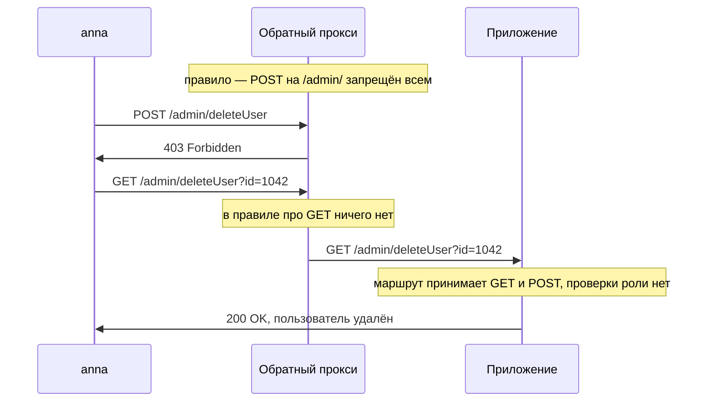

# Обход контроля метода, параметра, заголовка

У одного приложения на обратном прокси стоит правило: метод `POST` на адреса
внутри `/admin/` запрещён всем. Пользователь `anna`, у которой нет прав
администратора, отправляет запрос на удаление чужой учётной записи и получает
отказ, как и положено. Дальше она повторяет запрос методом `GET`, перенеся
параметр из тела в строку адреса, и учётная запись удаляется.

Правило при этом не сломано: оно закрыло ровно то, про что написано. Но
функция удаления в приложении отвечает и на `GET`, а правило про это не
знает. Запрос, который попал в функцию, в правило не попал. Дальше разберём,
откуда между правилом и функцией берётся такой зазор, как его находит
атакующий и как его закрыть.

**Запрос `anna` методом `POST`**

```http
POST /admin/deleteUser HTTP/1.1
Host: app.example.com
Cookie: session=c4Tn9
Content-Type: application/x-www-form-urlencoded

id=1042
```

**Ответ**

```http
HTTP/1.1 403 Forbidden
```

**Тот же адрес методом `GET`**

```http
GET /admin/deleteUser?id=1042 HTTP/1.1
Host: app.example.com
Cookie: session=c4Tn9
```

**Ответ**

```http
HTTP/1.1 200 OK
Content-Type: text/html; charset=utf-8

<p>Пользователь 1042 удалён</p>
```

## Два разбора одного запроса

Что здесь произошло. Правило не обойдено хитрым трюком: `POST` на `/admin/`
оно по-прежнему закрывает. Функция удаления вызывается и по `GET`, потому
что маршрут приложения принимает оба метода, а проверки роли внутри нет.

О границах темы. Она разбирает приёмы против правила, которое на сервере
есть. Случай, когда правила нет вовсе и функция открыта любому, разбирает
тема `privilege-escalation-vertical`.

Чтобы понять, что случилось с запросом `anna`, проследим его путь. Первым
запрос встречает обратный прокси, посредник, который принимает запросы
снаружи и передаёт приложению; устройство такого посредника разбирает тема
`app-architecture`. Видит прокси из запроса немного: строку пути, метод,
заголовки. На этом немногом он и принимает решения, например «`POST` на
`/admin/` запретить».

Приложение смотрит на тот же запрос иначе. Внутри него работает
маршрутизатор, часть фреймворка, которая по адресу выбирает
функцию-обработчик. Маршрутизатор сопоставляет путь с шаблоном и прощает
вариации: другой регистр букв, лишний слеш в конце, расширение вроде
`.json`. А функция, до которой маршрут дошёл, может принимать сразу
несколько методов.

Получается два разбора одного адреса. Первый, на прокси, поверхностный:
строка и метод. Второй, в приложении, идёт дальше: шаблон маршрута и
выбранная по нему функция.
Правило доступа здесь написано на языке первого разбора, а функция живёт во
втором. Обходом в этой теме называют запрос, который для первого разбора —
один ресурс, а для второго — другой, закрытый.



**Описание схемы.** Схема читается сверху вниз и показывает оба запроса
`anna`. Первый, методом `POST`, прокси отклоняет сам: правило стоит на нём,
и до приложения запрос не доходит. Второй, методом `GET`, правило
пропускает, потому что написано оно только про `POST`. Приложение видит
знакомый маршрут и вызывает функцию удаления, а спросить роль внутри функции
некому.

**Зачем это в работе AppSec-инженера.** Строку `location /admin/` с
запретом вы писали сами или видели в чужом конфиге. Приложение за прокси
разбирает тот же адрес своим маршрутизатором, и два разбора совпадают не
всегда. Приёмы из этой темы конечны и проверяются чеклистом за один проход,
а на ретесте, повторной проверке после починки, дают находки чаще, чем
поиск отсутствующих проверок.
Пропускают их потому, что правило на месте: и разработчик, и ревьюер видят
строку конфигурации и на этом останавливаются.

**Откуда это взялось.** Ограничения доступа исторически ставили там, где
запрос впервые виден целиком, — на веб-сервере и обратном прокси. Правило
получалось дешёвым и общим: разбирать нечего, есть строка запроса и метод.
Затем приложения стали разбирать путь по-своему: сопоставлять маршрут по
шаблону, терпеть необязательное расширение, не различать регистр. Два
разбора одного адреса разошлись, и в зазор между ними пролез запрос, который
для прокси один ресурс, а для приложения другой.

## Как это работает

Все приёмы темы сводятся к одному ходу: сделать так, чтобы два разбора
разошлись. Способов четыре, и дальше каждый разобран отдельно: сначала идея
и пример, потом откуда приём взялся. Пятым подразделом идёт особый случай:
решение о доступе по адресу клиента. Оно стоит не на расхождении разборов,
а на доверии к заголовку, и потому разбирается отдельно.

### Смена метода

Первый приём уже показан в начале темы: правило закрывает один метод, а
функция отвечает и на другие. Правило говорит «`POST` на `/admin/`
запрещён», маршрут объявлен с методами `GET` и `POST`, проверки роли внутри
нет. Запрос методом `GET` для правила — другой запрос, а для приложения —
та же функция.

Почему так вообще возможно. Метод в запросе пишет клиент, и никто не сверяет
его с тем, что обработчик делает на самом деле: это разобрано в теме
`http-basics`. Поэтому зазор между «что написано в правиле» и «на что
отвечает функция» никто не закрывает автоматически.

### Переопределение метода заголовком

Второй приём не меняет метод, а объявляет другой поверх него. Некоторые
фреймворки умеют подменять метод запроса заголовками `X-HTTP-Method`,
`X-HTTP-Method-Override` и `X-Method-Override`. Клиент отправляет обычный
`POST` и добавляет заголовок `X-HTTP-Method-Override: DELETE`. Фреймворк
читает заголовок и вызывает обработчик так, будто пришёл `DELETE`.

**Запрос с переопределением метода**

```http
POST /admin/deleteUser?id=1042 HTTP/1.1
Host: app.example.com
Cookie: session=c4Tn9
X-HTTP-Method-Override: DELETE
```

Зачем приём завели. Бывают промежуточные узлы, которые пропускают только
`GET` и `POST`, а `PUT` и `DELETE` отбрасывают. Чтобы приложение за таким
узлом могло работать, фреймворк научился принимать настоящий метод в
заголовке. Это как приписка на конверте: снаружи написано «открытка», чтобы
письмо пропустила почта, а внутри строка «вообще-то это заявление», и в
канцелярии его регистрируют как заявление. Соответствие такое: надпись на
конверте — метод в строке запроса, приписка — заголовок переопределения,
почта — промежуточный узел, канцелярия — фреймворк. Где аналогия ломается:
канцелярия могла бы позвонить и уточнить, а прокси и приложение не
договариваются, каждый читает своё поле и молчит.

Побочный эффект прямой. Заголовок, придуманный против промежуточного узла,
обходит заодно и правило доступа. Правило на прокси видит `POST` и
пропускает, приложение видит `DELETE` и вызывает закрытый обработчик.

### Другая запись того же пути

Третий приём играет на строгости сопоставления пути. Правило на прокси
сравнивает строку как есть. Маршрутизатор сопоставляет путь с шаблоном, и
фреймворки различаются тем, сколько вольностей они при этом прощают.
PortSwigger Web Security Academy, учебный полигон авторов Burp Suite,
называет три расхождения.

Первое — регистр букв. Если маршрутизатор не различает регистр, адрес
`/ADMIN/DELETEUSER` попадает в тот же обработчик, что и `/admin/deleteUser`.
Для правила, написанного про `/admin/` в нижнем регистре, это другая строка.

Второе — произвольное расширение. Во фреймворке Spring до версии 5.3 опция
`useSuffixPatternMatch` была включена по умолчанию. С ней маршрутизатор
отбрасывает «хвост» адреса после точки, считая его указанием формата ответа,
и сопоставляет только начало. Поэтому `/admin/deleteUser.anything` совпадает
с шаблоном `/admin/deleteUser`. Придумано это было, чтобы один обработчик
отдавал и страницу, и данные, а клиент выбирал формат расширением в адресе,
как в `report.pdf`. Для правила про точный путь это снова другая строка.

Третье — завершающий слеш. Для маршрутизатора адреса `/admin/deleteUser/` и
`/admin/deleteUser` могут быть одним маршрутом, а для правила-строки — двумя
разными.

### Заголовок с чужим адресом

Четвёртый приём подменяет сам адрес. Некоторые фреймворки принимают
заголовки `X-Original-URL` и `X-Rewrite-URL` и считают адресом запроса то,
что в них написано. Заголовки заведены для служебной перезаписи адресов:
промежуточный узел меняет адрес под свою схему, а исходный сообщает
приложению таким заголовком.

Бытовой пример — конверт с надписью «в бухгалтерию», а внутри записка
«вообще-то несите директору». Соответствие такое: надпись на конверте —
адрес в строке запроса, записка — заголовок `X-Original-URL`, охрана на
входе — правило на прокси, канцелярия — приложение. Если канцелярия читает
записку, письмо уйдёт не туда, куда смотрит охрана. Где аналогия ломается:
письмо до директора дойдёт физически, а запроса с адресом `/admin/` в строке
не было вовсе, подменено само представление об адресе.

Тогда запрос `POST /` с заголовком `X-Original-URL: /admin/deleteUser` для
правила на прокси — запрос к корню сайта, а для приложения — вызов закрытой
функции. Правило про путь написано, а адрес, который оно проверяло, к делу
уже не относится.

Сводная картина по четырём приёмам.

| Приём | Что видит правило на прокси | Что видит приложение |
|---|---|---|
| Другой метод | `GET`, про который правило молчит | знакомый маршрут, функция вызвана |
| Переопределение метода | разрешённый `POST` | обработчик `DELETE` |
| Другая запись пути | строку `/admin/deleteUser.json` | шаблон `/admin/deleteUser` |
| Заголовок с адресом | путь `/` | функцию `/admin/deleteUser` |

### Решение по адресу клиента

Особый случай темы — решение о доступе по адресу клиента. Поля пересылки
`Forwarded`, `X-Forwarded-For` и им подобные разбирает тема
`app-architecture`, вместе с тем, что в них записывает ваш внешний узел.
Здесь важно другое. MDN перечисляет заголовки, которые ставит прокси:
`Forwarded`, `X-Forwarded-For`, `X-Forwarded-Host`, `X-Forwarded-Proto`,
`Via`. Назначение у них информационное: сообщить приложению адрес, имя и
схему исходного запроса. О подделке страница не говорит ничего, и это как
раз то, что нужно знать: поля эти никто не заверяет.

Формально это закрепляет RFC 7239 § 8.1: на правильность поля `Forwarded`
полагаться нельзя, его может изменить любой узел на пути к серверу, включая
сам клиент. Документ называет и границу допустимого приёма — сверять со
списком доверенных прокси. У этого приёма две слабости. Цепочке адресов до
входа в ваш первый узел доверять нельзя, потому что левее его вы не
контролируете ничего. А если связь между прокси и приложением не защищена,
поле подменит атакующий в сети.

## Как это атакуют

Атакующий идёт по тому же списку, и готовый порядок проверки для него уже
написан: это WSTG-v42-CONF-06, раздел руководства OWASP по тестированию.
Начинают с закрытого адреса, который при обычном `GET` уводит на страницу
входа. Отказ честный, значит, правило на месте и
есть что обходить. Дальше тот же запрос повторяют другими методами: `HEAD`,
`POST`, `PUT`. HTTP разрешает написать в первом слове запроса почти любое
слово. Поэтому пробуют и выдуманный метод вроде `FOOBAR`: вдруг правило
перечисляет методы списком, а приложение незнакомое слово обработает как
`GET`.

**Запрос с выдуманным методом**

```http
FOOBAR /admin/deleteUser?id=1042 HTTP/1.1
Host: app.example.com
Cookie: session=c4Tn9
```

Читают ответ так. Код `200 OK`, за которым стоит не страница входа, —
находка. Смотреть стоит не только на код, но и на длину тела: страница входа
и закрытая страница обычно разного размера, и обход выдаёт себя длиной.
Запрос, на который сервер ответил кодом `405`, то есть «метод не разрешён»,
повторяют с заголовком переопределения метода. Вдруг запрет стоит на прокси,
а фреймворк заголовок послушается. Затем перебирают записи пути из третьего
приёма и в конце добавляют `X-Original-URL` с закрытым адресом.

## Как это выглядит в коде

Ревьюер ищет место, где стоит правило, и сравнивает его язык с языком
маршрутизации. Разбор ниже идёт тремя планами: найти само правило, назвать,
про что оно написано, назвать, о чём оно молчит. Та строка конфигурации
прокси nginx, что ответила `anna` отказом на `POST`, выглядит так. До
выносок ответьте сами: про что это правило и о чём в нём не сказано?

```nginx
# УЯЗВИМО — демонстрация, не для продакшена
location /admin/ {                    # (1)
    if ($request_method = POST) {     # (2)
        deny all;
    }
    proxy_pass http://app;
}
```

1. Правило написано про путь. Приложение за прокси разбирает путь иначе, и
   `/Admin/`, `/admin/x.json` или заголовок с переопределением адреса дают
   другой результат сопоставления.
2. Правило написано про метод. Функция удаления вызывается и по `GET`, если
   маршрут приложения принимает оба метода.

В коде приложения тот же дефект выглядит как решение по заголовку:

```python
# УЯЗВИМО — демонстрация, не для продакшена
if request.headers.get("X-Forwarded-For", "").startswith("10."):
    allow_admin()
```

Здесь приложение пускает в административную функцию всех, чей адрес лежит
во внутренней сети `10.0.0.0/8`. Но адрес приложение берёт из заголовка,
который ставит любой узел на пути, включая сам клиент. Внешний клиент
объявляет себя внутренним одной строкой в запросе.

Есть и полумеры, которые выглядят защитой, а ею не стали. Список разрешённых
методов на прокси не спасает от смены метода внутри списка. Если маршрут
законно принимает и `GET`, и `POST`, запрет одного из них на прокси ничего
не решает. Приведение пути к нижнему регистру только в правиле закрывает
одно расхождение из трёх. Бывает и ложное срабатывание: чтение
`X-Forwarded-For` для журнала или для ограничения частоты запросов — не
дефект этой темы. Там подделка меняет запись в журнале, а не решение о
доступе.

Оба листинга повторяют один ход: решение принято в первом разборе запроса, а
функция живёт во втором. Скажите, не возвращаясь к листингам: закроет ли
зазор правило `deny all` без условия про метод, если разбор пути у прокси и
приложения остался разным?

## Как защититься

Защита переносит решение туда, где запрос уже разобран до конца, — в
приложение. На этом уровне метод известен, маршрут сопоставлен с функцией, и
правило говорит про функцию, а не про строку. Зазору между двумя разборами
взяться негде, потому что разбор остался один. Исправленный вариант написан
на Flask. Он читается тремя планами: объявить все методы маршрута явно,
проверить роль внутри функции до всякой работы, держать одну проверку на все
методы сразу.

```python
# Исправленный вариант
@app.route("/admin/users/<uid>", methods=["GET", "POST", "DELETE"])
def admin_user(uid):
    require_role("admin")          # одно правило на все методы функции
    ...
```

Проверка стоит внутри функции, а не перед маршрутом, поэтому `GET` из начала
темы получает тот же отказ, что и `POST`. Объявление `methods=[...]` заодно
сужает список методов до нужных: на остальные фреймворк отвечает отказом
сам. Как устроены роли и что делает `require_role`, разбирает тема
`access-control-models`.

С заголовками от прокси порядок такой. Их принимают только от известного
узла и только по явной настройке доверенной цепочки. Внешний узел стирает из
входящего запроса всё, что клиент написал в полях пересылки, и записывает
своё: так устроена граница доверия из темы `app-architecture`. По той же
причине внешний узел стирает присланные снаружи `X-Original-URL` и
`X-Rewrite-URL`: заголовки эти служебные, и клиенту в них места нет. А при
разборе `Forwarded` берут не первый элемент списка: его мог написать сам
клиент. Берут ближайший к границе доверия элемент: это адрес, который
зафиксировал ваш внешний узел при приёме запроса.

**Границы применимости.** Перенос правила в приложение не отменяет правила
на периметре. Прокси остаётся дешёвым способом закрыть целый раздел и
полезен как второй слой, но перестаёт быть единственным. Цена решения —
дублирование: два слоя знают об одном ограничении и расходятся при правках.
Поэтому список закрытых разделов стоит держать в одном месте, а конфиги
прокси и приложения генерировать из него при сборке.

## Частая ошибка

Решите до чтения дальше: если в правило на прокси дописать все методы,
включая выдуманные, закрыт ли административный раздел?

Запрос из начала темы обошёл правило сменой метода, и первое, что приходит
на такую находку, — дописать `GET` в ту же строку конфигурации. Отсюда
расхожее представление: правило на прокси закрывает административный раздел,
надо лишь перечислить в нём все методы.

Оно неверно, потому что смена метода — одна из четырёх точек расхождения, а
не единственная. Правило сопоставляет строку, маршрутизатор — шаблон, и
совпадают они не всегда. Контрпример — тот же путь `/admin/deleteUser`,
закрытый правилом уже для всех методов. Приложение на Spring до версии 5.3
сопоставляет с тем же обработчиком путь `/admin/deleteUser.json`, потому что
опция `useSuffixPatternMatch` там включена по умолчанию. Запрос
`/admin/deleteUser.json` проходит мимо правила и попадает в функцию. Никакой
перечень методов этого не меняет: расхождение здесь в пути, а не в методе.

## Чеклист для ревью

1. Проверьте, что правила авторизации исполняются на доверенном серверном
   слое и не полагаются на механизмы, которыми управляет клиент
   (ASVS v5.0-8.3.1).
2. Проверьте, что правило покрывает все методы, которыми вызывается функция,
   а не один из них (WSTG-v42-CONF-06).
3. Проверьте, что заголовки переопределения метода отвергаются или
   учитываются правилом доступа.
4. Проверьте, что заголовки `X-Original-URL` и `X-Rewrite-URL` не меняют
   адрес запроса после того, как правило применено.
5. Проверьте, что расхождения в сопоставлении пути — регистр, расширение,
   завершающий слеш — не дают доступа к закрытой функции.
6. Проверьте, что решения о доступе не принимаются по `X-Forwarded-For`,
   `Forwarded` и другим полям, которые ставит любой узел на пути
   (RFC 7239 § 8.1).
7. Проверьте, что доступ к функции открыт только субъектам с явным
   разрешением (ASVS v5.0-8.2.1).

## Попробуй сам

Возьмите закрытую страницу знакомого приложения и прогоните по ней ретест из
шести шагов. Шаги такие: смена метода, выдуманный метод, заголовок
переопределения метода, изменённый регистр пути, завершающий слеш, заголовок
`X-Original-URL`. Для каждого шага запишите, что отправили, какой код пришёл
и какой длины было тело ответа.

Одна подсказка: сравнивайте не только коды ответа, но и длину тела. Обход
часто выдаёт себя ответом `200` с длиной, отличной от страницы входа.

**Критерий выполнения** наблюдаемый: таблица из шести строк, в каждой —
запрос, код ответа и длина тела. Отдельной строкой записано, какой из шести
шагов дал ответ, отличный от отказа.

## Проверь себя

1. Правило на прокси запрещает метод `DELETE` на всех маршрутах. Приходит
   запрос:

   ```http
   POST /api/profile HTTP/1.1
   Host: app.example
   X-HTTP-Method-Override: DELETE
   Content-Length: 0
   ```

   Пройдёт ли он через правило и что выполнит приложение?

2. Находка ретеста: `/admin/deleteUser` отвечает `200 OK` на `GET`, хотя
   правило прокси запрещает `POST`. Какую починку вы выберете?

   A. Дописать в правило все методы, включая выдуманные, чтобы заранее
      закрыть любую смену метода.

   B. Перенести решение о доступе в приложение, где путь уже разобран
      маршрутизатором, а правило на прокси оставить как первый рубеж.

   C. Привести путь к нижнему регистру в самом правиле, чтобы `/ADMIN/` не
      проходил мимо сопоставления.

3. Почему нельзя принимать решение о доступе по `X-Forwarded-For`?

4. Правило сопоставляет путь точным регулярным выражением, маршрутизатор
   терпимее. Не запуская, предскажите, у каких строк вывода колонки
   разойдутся.

   ```python
   import re

   rule = re.compile(r"^/admin/deleteUser$")

   def router(path):
       return path.lower().split(".")[0].rstrip("/") == "/admin/deleteuser"

   for p in ["/admin/deleteUser", "/admin/deleteUser.json",
             "/ADMIN/DELETEUSER/"]:
       print(f"{p:24} правило: {bool(rule.match(p))!s:5} "
             f"маршрутизатор: {router(p)}")
   ```

5. Возврат к теме `http-basics`: чем список разрешённых методов на прокси
   помогает и от чего он не спасает?
6. Возврат к теме `app-architecture`: на каком узле цепочки правило видит
   запрос впервые целиком и почему этот разбор не единственный?

<details markdown="1">
<summary>Ответ 1</summary>

1. Правило пропустит: оно видит метод `POST`, а про заголовок ему ничего не
   известно. Приложение выполнит удаление: фреймворк подменяет метод
   заголовком `X-HTTP-Method-Override` и вызовет обработчик `DELETE`. Запрос
   для прокси — один ресурс, для приложения — другой.

</details>

<details markdown="1">
<summary>Ответ 2: разбор вариантов</summary>

2. Верный ответ — B.

   A. Список методов закрывает один разбор из четырёх: путь с произвольным
      расширением, `deleteUser.json` в Spring до 5.3, пройдёт мимо правила
      при любом перечне методов. Это контрпример из раздела «Частая ошибка».

   B. В приложении путь уже разобран маршрутизатором, и правило пишется про
      функцию, а не про строку: зазору между двумя разборами взяться негде.
      Прокси остаётся первым рубежом, но не единственным.

   C. Приведение регистра закрывает одно из трёх расхождений пути: расширение
      и завершающий слеш по-прежнему дают другое сопоставление, а смена
      метода к пути не относится вовсе.

</details>

<details markdown="1">
<summary>Ответ 3</summary>

3. Поле ставит любой узел на пути, включая сам клиент (RFC 7239 § 8.1).
   Доверять можно лишь части цепочки после доверенного прокси, и только при
   защищённой связи с ним. Решение по подменяемому полю подменяется вместе с
   ним.

</details>

<details markdown="1">
<summary>Ответ 4</summary>

4. Колонки разойдутся на второй и третьей строках: расширение и регистр со
   слешем маршрутизатор терпит, а точное правило — нет. Проверка прогоном
   файла `match.py` с этим кодом:

   ```bash
   python3 match.py
   ```

   ```text
   /admin/deleteUser        правило: True  маршрутизатор: True
   /admin/deleteUser.json   правило: False маршрутизатор: True
   /ADMIN/DELETEUSER/       правило: False маршрутизатор: True
   ```

   Запрос, на котором колонки расходятся, и есть обход: для правила это не
   тот ресурс, для приложения — тот самый.

</details>

<details markdown="1">
<summary>Ответ 5</summary>

5. Список закрывает методы, которых приложению не нужно, и не спасает от
   смены метода внутри списка. Маршрут законно принимает `GET` и `POST`,
   проверка стоит на одном — список тут ничего не решает.

</details>

<details markdown="1">
<summary>Ответ 6</summary>

6. На веб-сервере или обратном прокси: там запрос впервые виден целиком, со
   строкой пути и методом. Разбор не единственный, потому что дальше
   приложение разбирает тот же адрес своим маршрутизатором — по шаблону, с
   терпимостью к регистру, расширению и слешу.

</details>

## Источники

1. PortSwigger Web Security Academy, «Access control vulnerabilities and
   privilege escalation»; реестр `ps-access-control`. Разделы: Broken access
   control resulting from platform misconfiguration, Broken access control
   resulting from URL-matching discrepancies.
   <https://portswigger.net/web-security/access-control>
2. RFC 7239 «Forwarded HTTP Extension», IETF, Standards Track, июнь 2014;
   реестр `rfc7239-forwarded`. Разделы: § 8.1 Header Validity and Integrity.
   <https://www.rfc-editor.org/rfc/rfc7239.html>
3. OWASP WSTG-CONF-06 «Test HTTP Methods», WSTG v4.2; реестр
   `wstg-v42-conf-06-http-methods`. Разделы: Testing for Access Control
   Bypass, Testing for HTTP Method Overriding.
   <https://owasp.org/www-project-web-security-testing-guide/v42/4-Web_Application_Security_Testing/02-Configuration_and_Deployment_Management_Testing/06-Test_HTTP_Methods>
4. MDN Web Docs, «Proxy servers and tunneling», обновлено 9 ноября 2025;
   реестр `mdn-proxy-tunneling`. Разделы: Forwarding client information
   through proxies.
   <https://developer.mozilla.org/en-US/docs/Web/HTTP/Guides/Proxy_servers_and_tunneling>

Каркас этапа: `owasp-asvs-5-document` (ASVS v5.0.0), `owasp-wstg-42`,
`owasp-top10-2025`; якорь подраздела: `owasp-cs-authorization`. Наследуются
всеми темами и отдельной строкой не повторяются.

**Скоропортящийся слой.** Умолчание `useSuffixPatternMatch` названо для
версий Spring до 5.3; с версии 5.3 опция выключена. Набор заголовков
переопределения метода зависит от фреймворка и пополняется.

**Маркеры уверенности.** Расхождения сопоставления пути, заголовки
`X-Original-URL` и `X-Rewrite-URL`, умолчание Spring — **по документации**
(Web Security Academy, открыта лично 2026-08-23). Ретест смены метода и три
заголовка переопределения — **по документации** (WSTG-CONF-06, открыт лично
2026-08-23). Недоверие к полю `Forwarded` и границы списка доверенных
прокси — **по первоисточнику** (RFC 7239 § 8.1). Перечень заголовков прокси —
**по документации** (MDN, открыт лично 2026-08-23). Листинги nginx и Flask
**не запускались**: стенда с прокси под эту тему не собиралось. Листинг из
вопроса 4 прогнан локально 2026-10-03, Python 3.14.7; вывод совпал дословно.
