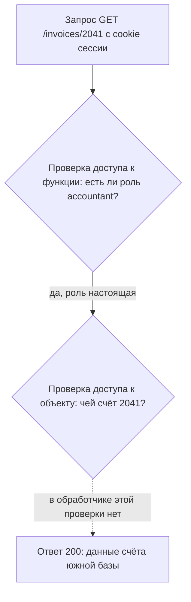

# Модели контроля доступа: RBAC, ABAC, ACL

Во внутренней бухгалтерии страница счёта закрыта декоратором
`@require_role("accountant")`: без роли бухгалтера запрос отворачивается
на входе в обработчик. Вот запрос к счёту с чужим номером,
подставленным в адрес, и ответ на него.

**Запрос**

```http
GET /invoices/2041 HTTP/1.1
Host: books.example.com
Cookie: session=a3fWa
```

**Ответ**

```http
HTTP/1.1 200 OK
Content-Type: application/json

{"id":2041,"org":"Южная база","total":418900.00}
```

Обхода входа и подмены роли здесь нет: сессия настоящая (её устройство
разбирает тема `sessions-vs-tokens`), роль `accountant` настоящая,
декоратор сработал и пустил запрос внутрь. Поломка в другом: объект
взят по номеру из адреса, а вопрос о его владельце не задан ни разу.
Откуда такому вопросу взяться, если правило про владельца нигде не
записано? Модель контроля доступа — это ответ на вопрос, о чём написано
правило: про объект, про должность или про признаки. Три ответа — это
три модели: ACL, RBAC и ABAC. Сами дефекты разбираются в соседних темах
(`idor`, `privilege-escalation-vertical`, `deny-by-default`), здесь —
язык, на котором о них говорят.

## Что такое модель контроля доступа

Перед каждым действием приложение отвечает себе на один вопрос: можно
ли **этому** пользователю сделать **это** с **этим** объектом. Ответ на
этот вопрос — предмет темы: он называется контролем доступа. У вопроса
три выделенных места, и у каждого есть своё имя; имена даёт § 2.1
документа NISTIR 7316. Тот, кто действует, называется **субъектом** —
активной сущностью, которая инициирует поток информации: пользователь,
процесс, служба. То, над чем действуют, называется **объектом** —
сущностью, которая информацию содержит: файл, счёт, обращение в
поддержку. Действие называется **операцией**: чтение, изменение,
удаление.

Ещё одно слово из того же раздела — **разрешение** (permission). Это
сочетание объекта и операции, а не одно из двух. «Читать счёт» и
«менять счёт» — два разных разрешения, хотя объект один. В истории из
начала темы субъект — бухгалтер северного филиала, объект — счёт 2041,
операция — чтение. Роль `accountant` сказала про операцию и промолчала
про объект: в правиле о должности слова «чей» нет.

Правила, из которых собирается ответ, бывают написаны о разном. Об
объекте: «к этому счёту допущены такие-то». О должности: «бухгалтер
смотрит счета». О признаках: «из офисной сети и до закрытия периода».
Три модели из заголовка — это три разных ответа. ACL (access control
list, список контроля доступа) пишет правило про объект. RBAC
(role-based access control, контроль доступа на основе ролей) — про
роль. ABAC (attribute-based access control, контроль доступа на основе
атрибутов) — про атрибуты.

Бытовой аналог — пропускная система офисного здания. Соответствие
такое.

| В здании | В приложении |
|---|---|
| Список фамилий на двери кабинета: «сюда можно Ивану и Марии» | ACL: список субъектов с их правами приложен к объекту |
| Должность на пропуске, по которой решают, куда вас пускать | RBAC: права привязаны к роли, роль выдана пользователю |
| Правило на проходной «финансовый отдел, рабочие часы, свой пропуск» | ABAC: решение считается по нескольким признакам сразу |

Где аналогия ломается. В здании охранник один, он видит и пропуск, и
лицо, и часы, и может сделать исключение по здравому смыслу. В
приложении каждую проверку пишет программист отдельным куском кода, и
исключений код не делает: выполняется ровно записанное правило.
Забытая проверка при этом не случается, и никто не замечает, что её
нет. Счёт 2041 уехал ровно так: проверка владельца не была написана и
потому не случилась.

Модель решает, какие требования в ней записываются вообще, а не порядок
администрирования. «Бухгалтер смотрит счета» записывается должностью.
«Свой счёт» — не записывается: слова про владельца в таком правиле нет.

**Зачем это в работе AppSec-инженера.** Роли в приложении вы заводили
сами: таблица `roles`, декоратор над обработчиком, список в
конфигурации маршрута. Вопрос «чей объект пришёл в параметре» при этом
не возникал — на него отвечает другая проверка, и написать её никто не
просил. На дизайн-ревью ответ «у нас RBAC» закрывает разговор, который
с этого места должен начинаться.

## Как это работает

**Откуда это взялось.** Первым механизмом были списки доступа при
объекте: операционная система хранит при файле пары «субъект — набор
прав». У такого устройства есть цена, и § 3.1 документа NISTIR 7316
называет её прямо. В среде ACL нетрудно ответить, кто имеет доступ к
этому объекту: список лежит при нём самом. Обратный вопрос — какие
права есть у этого пользователя — требует просмотра всех списков сразу,
и при текучке кадров это неуправляемо.

Ответом стал переворот правила. Его начали писать про род занятий, то
есть про роль, а не про объект: права выдаются роли, роль —
пользователю. Увольнение теперь оборачивается одним действием, отзывом
роли, вместо обхода всех объектов компании. Дальше выяснилось, что
ролью выражается не всякое требование. «Из внутренней сети в рабочие
часы» ролью не записывается. Так появился третий способ — правило про
атрибуты.

### ACL: правило лежит при объекте

Все права приложения можно представить одной таблицей — **матрицей
доступа**: строки в ней — субъекты, столбцы — объекты, в клетке стоит
набор прав. Матрица разрежена: большинству пользователей большинство
объектов не нужны, и почти все клетки пустые. Хранить её целиком
расточительно, поэтому её режут на части. По столбцам — получается
**ACL**: при каждом объекте хранится его столбец, список пар «субъект —
права». По строкам — получается **список возможностей**: при каждом
субъекте хранится всё, что ему можно.

Отсюда видна цена, названная в начале раздела. Столбец лежит при
объекте, поэтому вопрос «кто сюда допущен» читается с одного списка.
Строки целиком ни у кого нет, поэтому ответ «что доступно этому
пользователю» собирается обходом всех объектов. Уволенного приходится
вычёркивать из каждого списка по отдельности.

### RBAC: правило привязано к роли

**RBAC** привязывает права к роли, а роль — к пользователю. Роль — это
род занятий внутри системы: «бухгалтер», «сотрудник поддержки»,
«администратор». Проверка сводится к одному вопросу: есть ли у ролей
обратившегося это право. Ответ на «что можно этому пользователю»
читается по списку его ролей — то, чего не умел ACL, здесь стоит одним
запросом.

NISTIR 7316 § 3.4 разбирает четыре разновидности модели. Базовая —
роли и права без добавок. Иерархическая разрешает роли включать другие
роли: «старший бухгалтер» получает всё, что есть у «бухгалтера», и
сверху своё. Ещё две разновидности добавляют **разделение обязанностей**
— запрет совмещать конфликтующие полномочия. Бытовой пример — расходный
ордер: выставить счёт и оплатить его обязаны два разных человека, иначе
один сотрудник выписывает деньги сам себе. Статическое разделение
действует всегда: конфликтные роли нельзя выдать одному пользователю в
принципе. Динамическое — в пределах сессии: роли у пользователя есть
обе, но включить их одновременно нельзя.

### ABAC: решение считается по атрибутам

**ABAC** NIST SP 800-162 определяет как метод, где запрос на операцию
над объектом решается по четырём вещам сразу. Это назначенные атрибуты
субъекта, назначенные атрибуты объекта, условия среды и набор политик,
записанных в терминах этих атрибутов. **Атрибут** здесь — пара
«имя-значение»: «отдел=финансы», «филиал=северный». **Условия среды** —
то, что не относится ни к человеку, ни к объекту: время суток, сеть,
откуда пришёл запрос. **Политика** — условие над атрибутами: «отдел
субъекта равен отделу объекта, сеть офисная, время до 18:00».

Там же сказано, чем модели родственны. ACL работает по атрибуту
«личность», RBAC — по атрибуту «роль». ABAC добавляет к ним булево
условие над многими атрибутами сразу. Требование, которое ролью не
записывалось, — «из внутренней сети в рабочие часы» — здесь ложится в
политику без натяжек.

### Что чем проверяется

Модель определяет, какой класс дефекта в приложении вообще выразим.
Стандарт ASVS разводит три уровня проверки и требует каждый отдельно.
Первый уровень — доступ к функции, например к странице счетов
(v5.0-8.2.1). Второй — доступ к конкретному объекту: к счёту 2041, а
не к счетам вообще (v5.0-8.2.2). Третий — доступ к отдельному полю
объекта: счёт бухгалтер видит, а колонку с банковскими реквизитами —
нет (v5.0-8.2.3).

Ко второму уровню отнесены два дефекта с именами. IDOR
(Insecure Direct Object Reference) — доступ к объекту по присланному
идентификатору без проверки права на него; разбирает его тема `idor`.
BOLA (Broken Object Level Authorization) — то же свойство в API. Роль
отвечает только за первый уровень. Второй требует правила, в котором
есть владелец объекта; третий — правила, в котором есть поле.

У двух первых уровней есть устоявшиеся имена. Проверку между уровнями
полномочий — «бухгалтер против администратора» — называют
**вертикальной**: она отделяет маленькую роль от большой. Проверку
между равными — «свой счёт против чужого» — называют **горизонтальной**.
В здании из начала темы первое решает пропуск на этаж, второе — ключ
от вашего кабинета среди соседских по этажу. Атаку, которая
перепрыгивает такую границу, называют **эскалацией привилегий** —
повышением прав сверх выданных. Дефекты этих уровней разбирают темы
`privilege-escalation-vertical` и `idor`.

До кода стоит документация. ASVS v5.0-8.1.1 требует записывать правила
доступа к функциям и к данным. Требование v5.0-8.1.2 добавляет к ним
правила доступа к полям — вместе с зависимостью от состояния объекта.
Вот как три уровня выглядят на запросе из начала темы.



**Описание схемы.** Схема читается сверху вниз. Запрос сначала проходит
проверку доступа к функции: роль настоящая, и запрос идёт дальше.
Следующей должна стоять проверка доступа к объекту, но в обработчике её
нет — пунктирная стрелка показывает шаг, который не выполняется. Поэтому
запрос доезжает до ответа с чужими данными.

## Как это выглядит в коде

Ревьюер смотрит на **предмет условия**, а не на его наличие. Проверка
есть почти всегда; вопрос в том, о чём она. Вот тот самый обработчик,
который отдал счёт 2041 (как запрос доезжает до обработчика, разбирает
тема `app-architecture`). Прочитайте его и сами укажите место, где
должен был прозвучать вопрос о владельце.

```python
# УЯЗВИМО — демонстрация, не для продакшена
@app.get("/invoices/<int:invoice_id>")
@require_role("accountant")            # (1)
def invoice(invoice_id):
    inv = Invoice.query.get(invoice_id)   # (2)
    return render(inv)
```

1. Условие написано про роль: закрыт доступ к функции. Это вертикальная
   проверка, и она здесь уместна: страницу счетов не должны открывать
   посторонние.
2. Объект берётся по идентификатору из запроса, без владельца.
   Горизонтальной проверки нет вовсе, и роль её не заменяет: любой
   бухгалтер видит любой счёт.

Счёт 2041 — частный случай правила всей темы: в условии про роль слова
«чей» нет, и никакая строгость вертикальной проверки этот пробел не
закроет. Ответьте сами: остался бы дефект, если бы декоратор требовал
не роль, а совпадение филиала пользователя с филиалом счёта? Остался
бы. Филиал — это атрибут, и условие стало бы правилом про атрибуты:
бухгалтера южной базы оно отсекло бы, а коллегу по северному филиалу —
нет. Слово «чей» внутри одного филиала по-прежнему не спрошено.

Три обёртки выглядят защитой и защитой не работают: декоратор с именем
вроде `@login_required`, проверка `if user.is_authenticated` и белый
список ролей в конфигурации маршрута. Все три отвечают на вопрос «кто
пришёл», ни одна — на вопрос «его ли это объект». Ложное срабатывание
выглядит наоборот: запрос вида `Invoice.query.filter_by(owner=current_user)`
условия про роль не содержит, и дефекта здесь нет, если функция открыта
всем аутентифицированным.

## Как защититься

Правило про объект пишется там же, где объект достают. Выборка
ограничивается тем, что пользователю доступно, вместо поиска по всей
таблице.

```python
@app.get("/invoices/<int:invoice_id>")
@require_role("accountant")
def invoice(invoice_id):
    inv = current_user.invoices.filter_by(id=invoice_id).one_or_none()
    if inv is None:
        abort(404)
    return render(inv)
```

Изменилось одно место — выборка. Теперь она начинается не от всей
таблицы счетов, а от счетов текущего пользователя, поэтому чужого
номера в ней нет в принципе. Проверке здесь негде забыть случиться: её
нет как отдельного действия, которое можно пропустить. На запросе из
начала темы выборка не находит счёт 2041 — среди счетов северного
филиала его нет — и бухгалтер получает 404. Отвечают именно «не
найдено», а не «запрещено»: ответ 403 подтверждал бы, что счёт с таким
номером существует, а это уже сведения о чужом объекте.

Декоратор при этом остаётся: он закрывает свой уровень, доступ к
функции. Починка не заменяет проверку роли, а добавляет недостающий
вопрос об объекте.

**Границы применимости.** Приём закрывает случай, где владение
выражается связью «пользователь — объект». Он не работает там, где
право зависит от состояния объекта или от обстановки. Счёт, доступный
аудитору только после закрытия периода, связью не описывается: это
правило про атрибуты, и его пишут политикой, а не выборкой.

У каждой модели своя цена. Цену RBAC называет NISTIR 7316 § 3.4.5:
чем строже разграничение, тем больше ролей; чем меньше ролей, тем
дешевле администрирование. Отсюда рост числа ролей. На каждое новое
сочетание полномочий заводится новая, и список раздувается до сотен
позиций, в которых уже не видно, кто что может. Цена ABAC другая:
решение зависит от значений атрибутов, и каждый источник атрибута
становится частью границы доверия — того, чему приложение вынуждено
верить. Если атрибут «отдел» пользователь правит сам в своём профиле,
политика считается по его словам.

## Как убедиться, что защита работает

Починку испытывают тем же запросом, который её вызвал. Повторите запрос
из начала темы после правки: та же сессия бухгалтера, тот же номер
2041. Теперь ответ — 404: чужого счёта в выборке нет. Затем проверьте
обратный случай: свой счёт той же ручкой открывается с кодом 200. Если
прошёл только второй запрос, вы узнали, что страница жива, но о защите
не узнали ничего: проверка, которой нечего отвергнуть, ничего не
доказывает.

На ревью пройдите по списку.

1. Проверьте, что для каждой функции записано, какие права её
   открывают, и что запись сделана до кода (ASVS v5.0-8.1.1).
2. Проверьте, что правила доступа к отдельным полям объекта записаны
   вместе с зависимостью от состояния объекта (ASVS v5.0-8.1.2).
3. Проверьте, что доступ к функции ограничен субъектами с явным
   разрешением (ASVS v5.0-8.2.1).
4. Проверьте, что доступ к конкретному объекту данных проверяется
   отдельно от доступа к функции (ASVS v5.0-8.2.2).
5. Проверьте, что доступ к отдельным полям объекта ограничен явными
   разрешениями там, где часть полей чувствительна (ASVS v5.0-8.2.3).
6. Проверьте, что роли приложения перечислены целиком, включая
   заведённые для внутренних нужд и не показанные в интерфейсе.

## Частая ошибка

Начните с вопроса: роли заведены, проверки роли расставлены по
обработчикам — реализован ли контроль доступа? Распространённое
представление отвечает «да». Ответьте сами, прежде чем читать дальше.

Нет. **Роль отвечает на вопрос о функции, а не об объекте.** Проверка
роли решает, пускать ли субъекта в обработчик. Какой именно объект
обработчик достанет, решает параметр запроса, и роль об этом параметре
ничего не знает.

Контрпример из другого домена — сервис поддержки. Роль `support`
открывает страницу обращения, и проверка роли на месте: посторонний не
пройдёт, вертикальная эскалация закрыта. Идентификатор обращения
приходит в адресе, а владелец не сверяется. Сотрудник поддержки читает
любое обращение, включая обращения руководства. Права роли соблюдены,
требование v5.0-8.2.2 нарушено.

Итог в обоих сюжетах один и тот же: вертикальная эскалация закрыта
начисто, а горизонтальная не проверялась вовсе — правилу о владельце
некуда было записаться.

## Попробуй сам

Возьмите приложение, к которому у вас есть доступ, и составьте матрицу
его ролей по процедуре WSTG-v42-IDNT-01. Матрица ролей — таблица, где
строки — роли, столбцы — чувствительные функции, а в клетке стоит
наблюдение, а не предположение. «Роль support вызвала закрытие
обращения и получила 403» — наблюдение. «Должно быть запрещено» —
предположение.

Одна подсказка: список ролей редко лежит в одном месте. Кроме
документации его собирают из значений вида `role=admin` и
`isAdmin=True`, из каталогов вроде `/admin` и `/backups` и из
комментариев в коде. Ещё роли ищут фаззингом — перебором типичных имён
по словарю.

**Критерий выполнения** наблюдаемый: в матрице нет пустых клеток,
против каждой записан способ проверки — запрос, ответ или строка кода.
Отдельной строкой выписаны роли, которые нашлись фаззингом и не
нашлись в документации.

## Проверь себя

1. Обработчик обращения в сервисе поддержки:

   ```python
   @app.get("/tickets/<int:ticket_id>")
   @require_role("support")
   def ticket(ticket_id):
       t = Ticket.query.get(ticket_id)
       if t is None or t.org != current_user.org:
           abort(404)
       return render(t)
   ```

   О чём написано условие у `abort` — про роль, про объект или про
   атрибут? Что оно закрывает и о чём по-прежнему не спрашивает?

2. В сервисе поддержки сотрудник читает любое обращение по номеру из
   адреса. Какую починку вы выберете?

   А. Завести роли по филиалам — `support-north`, `support-south` — и
      проверять совпадение филиала сотрудника с филиалом обращения.

   Б. Ограничить выборку назначенными обращениями:
      `current_user.tickets.filter_by(id=ticket_id).one_or_none()`.

   В. Поверх декоратора роли поставить второй, с разрешением
      `tickets.read`, чтобы проверка стала строже.

3. Почему в среде ACL для ответа на вопрос «что доступно этому
   пользователю» придётся просмотреть все списки сразу, а в среде RBAC —
   нет?

4. Политика записана условием над атрибутами. Не запуская, предскажите,
   что напечатает эта проверка.

   ```python
   def allow(subj, obj, env):
       return (subj["dept"] == obj["dept"]
               and env["net"] == "office"
               and env["time"] < "18:00")

   print(allow({"dept": "fin"}, {"dept": "fin"},
               {"net": "vpn", "time": "12:00"}))
   ```

5. Возврат к теме `sessions-vs-tokens`: откуда обработчик берёт
   личность субъекта в момент, когда решает вопрос о доступе?
6. Возврат к теме `http-basics`: бухгалтер вошёл, роль проверена
   декоратором. Почему номер 2041 в адресе всё равно считается входом
   от противника?

<details markdown="1">
<summary>Ответ 1</summary>

1. Условие написано про атрибут: сравниваются значения `org` у субъекта
   и у объекта. Оно закрывает доступ за границу организации, а о
   владельце не спрашивает: сотрудник той же организации читает любое
   её обращение. Роль `support` над обработчиком к этому условию ничего
   не добавляет — она про функцию.

</details>

<details markdown="1">
<summary>Ответ 2: разбор вариантов</summary>

2. Верный ответ — Б.

   А. Филиал сотрудника и филиал обращения — атрибуты, и правило про них
      записать можно. Цена другая: по NISTIR 7316 § 3.4.5 чем строже
      разграничение, тем больше ролей, а вопрос «чьё обращение» внутри
      филиала ролью всё равно не выражается.

   Б. Выборка ограничена тем, что назначено сотруднику, и проверке
      негде забыть случиться: её нет как отдельного действия. Это
      правило про объект, записанное там же, где объект достают.

   В. Второй декоратор добавляет вторую проверку о функции, а дефект — в
      отсутствии проверки об объекте. Две вертикальные проверки не
      складываются в одну горизонтальную: обе пропустят сотрудника к
      чужому обращению.

</details>

<details markdown="1">
<summary>Ответ 3</summary>

3. Права в ACL разложены по объектам: список при объекте знает, кто к
   нему допущен, и не знает, к каким ещё объектам допущен тот же
   субъект. В RBAC права собраны в роли, а роль выдана пользователю,
   поэтому ответ читается по её списку прав. Пределы такого устройства
   разбирает NISTIR 7316 § 3.1.

</details>

<details markdown="1">
<summary>Ответ 4</summary>

4. `False`: атрибуты субъекта и объекта совпали, а условие среды нет —
   запрос пришёл не из офисной сети. Проверяется прогоном:

   ```text
   $ python3 policy.py
   False
   ```

   Сохраните функцию из вопроса в `policy.py` и запустите. Политика
   решает по всем трём группам атрибутов сразу, и одного совпадения
   подразделений мало.

</details>

<details markdown="1">
<summary>Ответ 5</summary>

5. Из состояния сессии. Ссылочный токен ведёт в серверное хранилище;
   самодостаточный несёт утверждения сам, и они годятся после проверки
   подписи.

</details>

<details markdown="1">
<summary>Ответ 6</summary>

6. Адрес и его параметры пишет клиент, а клиент — чужая машина:
   вошедший пользователь подставит в адрес любой номер. Сессия говорит,
   кто пришёл, и ничего не говорит о том, какие значения он прислал,
   поэтому каждое значение из запроса проверяется заново.

</details>

## Источники

1. NISTIR 7316 «Assessment of Access Control Systems», NIST, сентябрь
   2006; реестр `nist-ir-7316`. Разделы: § 2.1 понятия, § 3.1 ACL и его
   пределы, § 3.4 RBAC и четыре его разновидности, § 3.4.5 пределы RBAC.
   <https://nvlpubs.nist.gov/nistpubs/Legacy/IR/nistir7316.pdf>
2. NIST SP 800-162 «Guide to Attribute Based Access Control (ABAC)
   Definition and Considerations», январь 2014, с обновлениями от 2
   августа 2019; реестр `nist-sp-800-162-abac`. Разделы: § 2 рабочее
   определение ABAC, § 2.2 атрибуты, объекты, операции, условия среды.
   <https://nvlpubs.nist.gov/nistpubs/specialpublications/NIST.SP.800-162.pdf>
3. OWASP WSTG-IDNT-01 «Test Role Definitions», WSTG v4.2; реестр
   `wstg-v42-idnt-01-role-definitions`. Разделы: Roles Identification,
   Switching to Available Roles, Review Roles Permissions.
   <https://owasp.org/www-project-web-security-testing-guide/v42/4-Web_Application_Security_Testing/03-Identity_Management_Testing/01-Test_Role_Definitions>

Каркас этапа: `owasp-asvs-5-document` (ASVS v5.0.0), `owasp-wstg-42`,
`owasp-top10-2025`; якоря подраздела: `ps-access-control`,
`owasp-cs-authorization`. Наследуются всеми темами и отдельной строкой
не повторяются.

**Скоропортящийся слой.** Обе публикации NIST датированы и меняются
редко. Меняются предпочтения отрасли: Authorization Cheat Sheet
рекомендует ABAC и ReBAC вместо RBAC, и эта рекомендация стоит в живом
документе без даты.

**Маркеры уверенности.** Определения субъекта, объекта, операции и
разрешения, устройство ACL, четыре разновидности RBAC и пределы каждой
модели — **по первоисточнику** (NISTIR 7316, PDF открыт лично
2026-08-23). Определение ABAC и соотношение трёх моделей через
атрибуты — **по первоисточнику** (NIST SP 800-162, PDF открыт лично
2026-08-23). Требования 8.1.1, 8.1.2, 8.2.1, 8.2.2 и 8.2.3 сверены с
текстом ASVS v5.0.0 (открыт лично 2026-08-23). Листинги обработчиков
**не запускались**: это фрагменты для чтения глазами, стенда под них не
собиралось. Проверка политики из ответа 4 прогнана повторно 2026-10-03
локально, Python 3.14.7: вывод `False` совпал.
