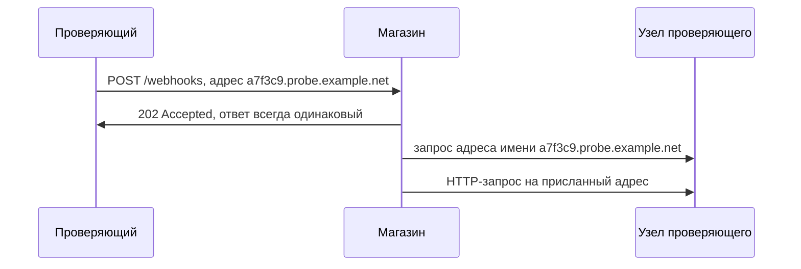

# Blind SSRF и обнаружение out-of-band

Интернет-магазин умеет оповещать о событиях заказа: вы регистрируете свой
адрес, и при каждой оплате магазин сам отправляет на него уведомление.
Проверяющий регистрирует адрес узла, который держит сам, и смотрит на ответ
магазина. Ответ пуст: ровно такой же вернулся бы на любой адрес, включая
заведомо мёртвый. Проверка как будто не удалась, и находки нет. Но через
минуту в журнале узла проверяющего появляются две строки: магазин спросил
адрес присланного имени, а затем пришёл по нему с настоящим HTTP-запросом.
Ответ магазина ни разу об этом не сообщил.

Эта тема — про дефект, который есть, но не виден в ответе приложения: как
его доказать, оценить и закрыть.

## Что такое слепой SSRF

Функция из вступления называется вебхуком (webhook): вы оставляете сервису
свой адрес, а он сам присылает на него событие, когда оно случится. Бытовой
аналог — телефон, который вы оставляете магазину, чтобы не звонить самим:
магазин позвонит, когда заказ будет собран. Телефон здесь соответствует
адресу, звонок — исходящему запросу сервиса. Ломается аналогия на проверке:
магазин из вступления не спрашивает, чей адрес ему оставили, и готов
позвонить куда угодно.

Вот обмен, который стоит за вступлением.

**Запрос**

```http
POST /webhooks HTTP/1.1
Host: shop.example.com
Content-Type: application/json

{"event":"order.paid","callback":"http://a7f3c9.probe.example.net/"}
```

**Ответ**

```http
HTTP/1.1 202 Accepted
Content-Type: application/json

{"status":"accepted"}
```

Код `202` означает «принято в обработку»: работа ещё не сделана, и её
результат в ответ не входит. Поэтому ответ не сообщает ничего: такой же
вернулся бы на любой адрес, включая заведомо мёртвый. Говорит другое место —
узел `probe.example.net`, за которым проверяющий наблюдает сам.

**Журнал узла проверяющего**

```text
09:14:01  запрос к резолверу: a7f3c9.probe.example.net (A)
09:14:02  входящий HTTP: 203.0.113.17 "POST / HTTP/1.1"
```

Первая строка — это разрешение имени. Прежде чем соединиться, клиент HTTP
превращает имя узла в его адрес, и этим занимается отдельная служба,
резолвер. Работает она как телефонная книга: вы звоните по имени контакта, а
книга подставляет номер. Маркер `(A)` в конце строки — тип записи: у
резолвера спросили именно адрес этого имени. Вторая строка — сам запрос:
соединение состоялось,
и по нему прошёл настоящий HTTP. Обе строки написал узел проверяющего, а не
магазин: в ответе магазина о них нет ни слова, и повторить опыт по ответу
нельзя — он всегда `202`.

Дефект здесь тот же, что в базовой теме `ssrf-basics`: цель исходящего
запроса выбирает тот, кто прислал входящий. Разница одна — ответ внутренней
службы наружу не попадает. Такой случай называют слепым, blind SSRF. Слеп он
не потому, что запроса нет: запрос есть, и его видно атакующему. Слепота в
том, что его не видно с того места, откуда смотрит проверяющий.

Бытовой образ — домофон без динамика: вы жмёте кнопку и не слышите, подошли
ли в квартире. Для вас тишина, а звонок внутри прозвучал. Граница образа:
звонок можно услышать и через стену, а чужой запрос из сети так не
подслушать — поэтому дальше и понадобится собственный узел.

Канал, по которому пришло подтверждение, называют внеполосным, out-of-band:
он не проходит через ответ приложения. Приём работает так. Проверяющий
порождает уникальное имя, здесь `a7f3c9.probe.example.net`, и отправляет его
в полезной нагрузке. Имя уникально, чтобы обращение однозначно связать
именно с этим опытом. Дальше проверяющий наблюдает за обращениями к имени на
своём узле. Пришёл запрос от приложения — значит, адрес из поля дошёл до
клиента HTTP, и тот по нему пошёл.

Бытовой аналог — уведомление о вручении письма. Вы не видите, что творится в
чужом почтовом ящике, но почта присылает открытку вам напрямую, мимо ящика.
Ломается аналогия на содержимом: открытка подтверждает факт вручения и
ничего не говорит о письме, а внеполосное обращение подтверждает факт
запроса и не приносит ответа службы.

Прежде чем читать дальше, прикиньте ответ: пришла бы одна первая строка
журнала, без второй, — что тогда было бы доказано?



**Описание схемы.** Проверяющий регистрирует вебхук, и магазин отвечает
пустым `202`. Видимое проверяющему продолжение происходит без участия
ответа: магазин спрашивает адрес имени, а затем идёт по нему. Обе нижние
стрелки видны только в журнале узла проверяющего, потому что имя принадлежит
его зоне.

**Зачем это в работе AppSec-инженера.** Обработчик, который принимает адрес
и отвечает `202`, вы писали сами: адрес в очередь задач, откуда его заберёт
отдельный процесс позже, а клиенту сразу «принято». Куда потом ушёл запрос,
не видно ни клиенту, ни вам — в ответе об этом ничего нет. В приложениях
такой случай встречается чаще зрячего: фоновая обработка, генератор отчёта,
аналитика по полю заголовка. Ревьюер, который умеет отличить «сток есть,
ответа не видно» от «стока нет», не закрывает находку словами «воспроизвести
не удалось». Такая строка в отчёте весит больше закрытой.

## Как это работает

**Откуда это взялось.** Проверка на уязвимость всегда опиралась на разницу в
ответе: послали одно, получили другое. Приложения научились обрабатывать
задачи отложенно, и разница из ответа ушла: пользователь получает «принято»,
а запрос уходит через минуту в другом процессе. Проверять стало нечего, и
единственным каналом обратной связи остался тот, что не проходит через
приложение вовсе, — обращение к узлу, который держит сам проверяющий.

Определение Web Security Academy короткое. Слепой SSRF возникает, когда
приложение можно заставить сделать серверный запрос по присланному адресу,
но ответ на этот запрос не возвращается пользователю во внешнем ответе.
Механизм тот же, что в теме `ssrf-basics`, и здесь не повторяется: отличает
случаи только наличие обратного хода.

### Чем доказывается слепой случай

Надёжный способ один — внеполосное обращение. Важна деталь, ради которой
приём разбирают отдельно. Часто видно обращение к резолверу за именем и не
видно последующего запроса по HTTP. Причина не в приложении: инфраструктура
выпускает наружу DNS, потому что он нужен многим, и не выпускает соединения
по HTTP к неожиданным адресам.

Для оценки это две разные вещи. Обращение к резолверу доказывает, что адрес
дошёл до кода, который его разбирает. Запрос по HTTP доказывает другое:
исходящее соединение из этой сети уходит. В журнале из вступления есть обе
строки, и это самый полный из возможных ответов. Пришла бы одна первая —
вывод был бы вдвое скромнее: сток существует, а про выход соединений наружу
неизвестно ничего.

## Как это атакуют

Само по себе внеполосное обращение путь к эксплуатации не открывает: ответа
нет, и изучать внутреннее содержимое нечем. Web Security Academy называет
два направления, куда слепой случай ведёт дальше.

Первое — слепой обход внутреннего адресного пространства с полезными
нагрузками под известные уязвимости. Такая нагрузка пользуется внеполосным
каналом сама: сработав на внутреннем узле, она стучится на узел атакующего
уже изнутри сети. Тогда уязвимость внутреннего узла станет видна, хотя
ответа от него так и не будет.

Второе — заставить приложение соединиться с узлом проверяющего и ответить
ему вредоносным содержимым. Уязвимость тогда ищется не в приложении, а в
самом клиенте HTTP на стороне сервера. В удачном для атакующего случае она
доводит до выполнения кода в инфраструктуре приложения.

Отсюда калибровка находки. Опасность слепого случая ниже зрячего: ответы
внутренних служб напрямую не читаются. Но она не исчезает: односторонний
канал сохраняет обход внутренней сети и в отдельных случаях доводит до
выполнения кода.

### Где искать слепой сток

WSTG-v42-INPV-19 отдельно отмечает запросы методом POST: результат может
всплыть не в ответе, а в отчёте, счёте или обработке заказа. Там его увидит
сотрудник, но не проверяющий. Отсюда типичные места. Генератор
документов, собирающий PDF из присланной размётки. Обработчик вебхука,
которому адрес назначения задают в настройках. Аналитика, открывающая адреса
из поля заголовка `Referer`: Web Security Academy называет это поле
поверхностью атаки именно потому, что ответ пользователю не показывается
никогда.

## Как это выглядит в коде

Признак слепого случая виден в самой строке со стоком: результат вызова
никуда не идёт. Ревьюер ищет вызов клиента, значение которого не
присваивается, не возвращается и не попадает в ответ. Обработчик регистрации
из вступления изнутри выглядит так. Читайте его с тремя планами: найти
источник адреса; найти место, где между источником и стоком появляется
граница процесса; проверить, куда девается результат стока. Отметьте сами,
какая из отмеченных строк делает случай слепым.

```python
# УЯЗВИМО — демонстрация, не для продакшена
def register_webhook(request):
    url = request["json"]["callback"]
    queue.enqueue(ping, url)          # (1)
    return {"status": 202}            # (2)

def ping(url):
    requests.post(url, json={"event": "registered"}, timeout=5)  # (3)
```

1. Адрес уезжает в очередь задач, и его заберёт другой процесс. Между
   источником и стоком появляется граница процесса, и глазами их уже не
   связать.
2. Ответ пользователю не зависит от того, что случится дальше. Это и есть
   слепота.
3. Сток в другой функции и, возможно, в другом файле. Результат не
   используется.

**Обёртки, которые не спасают.** Перехват исключения вокруг вызова клиента
делает случай слепым и не делает его безопасным: запрос всё равно уходит, а
молчание лишь прячет это глубже. Ограничение размера ответа — то же самое:
ответ обрезан, но запрос состоялся.

**Ложное срабатывание.** Вызов клиента с постоянным адресом из настроек
развёртывания. Из запроса приходят только данные тела, и целью управлять
нечем.

## Как защититься

Починка та же, что у зрячего случая из темы `ssrf-basics`: адрес собирает
приложение по списку разрешённого, а не клиент. Требование ASVS v5.0-1.3.6
не различает эти два случая, и это правильно: различие лежит в способе
обнаружения, а не в механизме.

К списку добавляется одно, чего у зрячего случая нет: журнал. И разрешённый
запрос, и отказ записываются в него с адресом назначения, и журнал этот
доступен для просмотра.

```python
# Исправленный фрагмент: сверка и журнал до постановки в очередь
def allowed_url(url):
    if url not in ALLOWED:
        log.warning("отказ", extra={"target": url})    # (1)
        raise ValueError("адрес вне списка")
    return url

target = allowed_url(request["json"]["callback"])
log.info("исходящий запрос", extra={"target": target})  # (2)
queue.enqueue(ping, target)
```

1. Отказ записывается с адресом до исключения: иначе попытка растворилась
   бы в трассировке без имени.
2. Разрешённый запрос записывается до очереди: дальше адрес уедет в другой
   процесс.

Адрес из вступления до очереди теперь не доходит: имени
`a7f3c9.probe.example.net` в списке разрешённого нет. Сама попытка остаётся
записью об отказе в журнале — с этим именем.

Причина, по которой журнал входит в починку, — в природе слепоты. Дефект, не
видимый в ответе, не видим и в отчёте об инциденте: узнать, куда приложение
ходило в прошлый вторник, можно только по записи. Заодно журнал закрывает
разрыв между источником и стоком, который в этом случае проходит через
очередь.

**Границы применимости.** Журнал ничего не запрещает — он делает случившееся
восстановимым. Полагаться на него как на защиту нельзя. И он же становится
местом утечки, если в адрес попадает секрет: адреса с токеном в строке
запроса перед записью урезаются до имени хоста и пути.

## Как убедиться, что защита работает

Ретест слепого случая устроен иначе зрячего: по ответу приложения проверить
ничего нельзя, и проверка снова идёт в обход него. Повторите регистрацию из
вступления с новым уникальным именем. Дальше смотрятся два места. На узле
проверяющего обращения быть не должно: ни запроса к резолверу, ни HTTP. А в
журнале приложения должна появиться запись об отказе с этим именем. Она
подтверждает, что сверка со списком стоит до очереди, а не в теле задачи,
которую очередь выполнит позже.
Если обращение пришло, а записи об отказе нет, починки нет вовсе — ни
запрета, ни наблюдения.

Отдельно проверяется сам журнал. Он должен быть доступен тем, кто разбирает
инцидент, и не должен содержать секретов из строки запроса. Оба свойства
проверяются глазами по живым записям.

На ревью пройдите по списку.

1. Проверьте, что для каждого поля с адресом проверено наличие исходящего
   запроса внеполосным обращением, а не только по ответу приложения.
2. Проверьте, что проверены поля заголовков и cookie, а не только параметры
   и тело запроса (WSTG-v42-INPV-19).
3. Проверьте, что отложенная обработка — очередь, генератор документов,
   аналитика — проверена отдельно от синхронного ответа.
4. Проверьте, что адрес назначения сверяется со списком разрешённого до
   постановки задачи в очередь, а не в теле самой задачи (ASVS v5.0-1.3.6).
5. Проверьте, что исходящие запросы записываются в журнал вместе с адресом
   назначения.
6. Проверьте, что в записи журнала не попадают секреты из строки запроса.
7. Проверьте, что отчёт различает обращение к резолверу и запрос по HTTP:
   это разные факты о сети.

## Частая ошибка

Регистрация из вступления отвечает `202` и на живой адрес, и на мёртвый.
Отсюда рассуждение: ответ не вернулся, повторить нечем, значит, находки нет
— либо она настолько мала, что в отчёт её ставить не стоит. Прав ли
проверяющий, закрывший находку как невоспроизводимую? Решите для себя,
прежде чем читать дальше.

**Слепота — свойство канала обратной связи, а не дефекта.** Приложение
по-прежнему ходит по адресу, который назвал атакующий, а внутренние службы
по-прежнему обслуживают его без вопросов. Не видно только результата, и не
видно его проверяющему, а не атакующему: тот наблюдает за своим узлом.

Контрпример — та же регистрация из вступления, доведённая до конца.
Внеполосное обращение пришло, значит, запрос уходит. Дальше атакующий шлёт
запросы по внутренним адресам с нагрузками под известную уязвимость, и одна
из них срабатывает. Ответ так и не был показан ни разу.

## Попробуй сам

Поднимите на петле слушателя, который печатает каждое обращение: подойдёт
`python3 -m http.server 8000`. Петля здесь играет роль узла проверяющего:
всё, что приложение отправит на `127.0.0.1:8000`, вы увидите своими
глазами. Пройдитесь по своему стенду или по своему приложению и подставьте
`http://127.0.0.1:8000/<метка>` во все поля, где приложение может пойти по
адресу. Метка своя в каждом поле — иначе по журналу непонятно, какое из них
сработало.

Одна подсказка: не ограничивайтесь полями формы — поле заголовка `Referer` и
адрес вебхука в настройках дают обращение чаще прочих.

**Критерий выполнения** наблюдаемый: таблица «поле — метка — пришло
обращение или нет» и отдельной строкой список полей, где обращение пришло
позже ответа приложения. Второй список и есть слепые случаи.

## Проверь себя

1. Обработчик настройки отчётов:

   ```python
   @app.post("/settings/report-url")
   def set_report_url():
       url = request.form["url"]
       scheduler.add(report_job, args=[url])   # отчёт уйдёт почтой
       return {"ok": True}

   def report_job(url):
       requests.get(url, timeout=10)
   ```

   Найдите здесь источник и сток. Что делает случай слепым и кто в этой паре
   наблюдает за результатом?

2. Проверяющий закрыл находку: регистрация вебхука отвечает `202` на любой
   адрес, ответ не виден, «повторить нечего». Какую починку или оценку вы
   выберете?

   А. Согласиться с закрытием: ответ не возвращается, извлечь данные нечем,
      находка низкая.

   Б. Считать находку настоящей: адрес собирает приложение по списку
      разрешённого, а каждый исходящий запрос пишется в журнал с адресом
      назначения.

   В. Обернуть вызов клиента в перехват исключения и ограничить размер
      ответа, чтобы пользователю точно ничего не вернулось.

3. Почему обращение к резолверу за уникальным именем доказывает меньше, чем
   запрос по HTTP до того же имени?

4. Починка введена. Не запуская, предскажите вывод цикла.

   ```python
   ALLOWED = {"https://hooks.partner.example"}

   def allowed_url(url):
       if url not in ALLOWED:
           raise ValueError("адрес вне списка")
       return url

   for u in ["https://hooks.partner.example",
             "http://a7f3c9.probe.example.net"]:
       try:
           print(u, "->", allowed_url(u))
       except ValueError as e:
           print(u, "-> отказ:", e)
   ```

5. Возврат к теме `ssrf-basics`: почему починка для слепого и зрячего случая
   одна и та же?
6. Возврат к теме `app-architecture`: приложение ходит вовне само, без
   браузера. Какие узлы стоят за ним и почему внутренние службы обслуживают
   его запросы без вопросов?

<details markdown="1">
<summary>Ответ 1</summary>

1. Источник — поле `url` формы, сток — `requests.get` в `report_job`. Случай
   слепой, потому что результат вызова не присваивается, не возвращается и не
   попадает в ответ: пользователь получает `{"ok": true}` до того, как запрос
   ушёл. Результат наблюдает тот, кто читает журнал планировщика, — и
   атакующий со своего узла, если адрес назначения его.

</details>

<details markdown="1">
<summary>Ответ 2: разбор вариантов</summary>

2. Верный ответ — Б.

   А. Слепота — свойство канала обратной связи, а не дефекта: приложение
      ходит по названному адресу. Остаются оба направления: слепой обход
      внутреннего пространства нагрузками под известные уязвимости и
      вредоносный ответ клиенту HTTP. «Не видно проверяющему» — не «не видно
      атакующему».

   Б. Адрес из запроса до стока не доходит, если его нет в списке
      разрешённого. А журнал делает видимым то, что слепой случай прячет:
      куда приложение ходило на самом деле.

   В. Перехват исключения и ограничение размера делают случай слепее и не
      делают безопаснее: запрос уходит в любом случае. Это обёртки из
      раздела «Как это выглядит в коде».

</details>

<details markdown="1">
<summary>Ответ 3</summary>

3. Резолвер доказывает, что адрес дошёл до кода, который его разбирает, и
   имя разрешено. Запрос по HTTP доказывает другое: исходящее соединение из
   этой сети уходит. Инфраструктура часто выпускает наружу DNS и при этом не
   выпускает соединения к неожиданным адресам — строки в журнале означают
   разное.

</details>

<details markdown="1">
<summary>Ответ 4</summary>

4. Первый адрес пройдёт, второй получит отказ до вызова клиента:

   ```text
   $ python3 allowurl.py
   https://hooks.partner.example -> https://hooks.partner.example
   http://a7f3c9.probe.example.net -> отказ: адрес вне списка
   ```

   Проверка стоит до очереди, поэтому уникальное имя до стока не доходит, а
   отказ виден сразу — слепому случаю журнал и отказ заменяют наблюдение.

</details>

<details markdown="1">
<summary>Ответ 5</summary>

5. Различие лежит в канале обратной связи, а не в механизме: адрес исходящего
   запроса в обоих случаях задаёт клиент, и список разрешённого закрывает
   оба. Требование ASVS v5.0-1.3.6 эти случаи не различает.

</details>

<details markdown="1">
<summary>Ответ 6</summary>

6. За приложением стоят внутренние API и службы, и запросы внутри периметра
   идут без той проверки, которую проходит внешний вызов. Внутренний узел
   получает запрос от своего же приложения. Поэтому адрес, который атакующий
   не достал бы сам, достаётся приложением за него.

</details>

## Источники

1. PortSwigger Web Security Academy, «Blind SSRF vulnerabilities»; реестр
   `ps-blind-ssrf`. Разделы: What is blind SSRF, What is the impact of blind
   SSRF vulnerabilities, How to find and exploit blind SSRF vulnerabilities.
   <https://portswigger.net/web-security/ssrf/blind>
2. PortSwigger Web Security Academy, «Server-side request forgery (SSRF)»;
   реестр `ps-ssrf`. Разделы: Finding hidden attack surface for SSRF
   vulnerabilities, SSRF via the Referer header.
   <https://portswigger.net/web-security/ssrf>
3. OWASP WSTG-INPV-19 «Testing for Server-Side Request Forgery», WSTG v4.2;
   реестр `wstg-v42-inpv-19-ssrf`. Разделы: HTTP Methods Used, PDF Generators.
   <https://owasp.org/www-project-web-security-testing-guide/v42/4-Web_Application_Security_Testing/07-Input_Validation_Testing/19-Testing_for_Server-Side_Request_Forgery>

Каркас этапа: `owasp-asvs-5-document` (ASVS v5.0.0), `owasp-wstg-42`,
`owasp-top10-2025`; SSRF отнесён к A01:2025. Наследуются всеми темами и
отдельной строкой не повторяются.

**Скоропортящийся слой.** Инструменты внеполосного наблюдения и их
доступность меняются вместе с рынком. Обе страницы Web Security Academy —
живая площадка без даты публикации.

**Маркеры уверенности.** Определение слепого случая, приём out-of-band,
разбор случая «есть DNS, нет HTTP» и два направления эксплуатации — **по
документации** (Web Security Academy, открыта лично 2026-08-24). Отложенная
обработка как источник слепоты и полезные нагрузки в полях заголовков — **по
документации** (WSTG-INPV-19, открыт лично 2026-08-24). Требование 1.3.6
сверено с текстом ASVS v5.0.0 (открыт лично 2026-08-24). Листинг уязвимого
обработчика **не запускался**: стенда с очередью задач под эту тему не
собиралось. Исправленный фрагмент из раздела «Как защититься» прогнан
2026-10-03 локально на заглушках журнала и очереди (Python 3.14.7): отказ
оставляет запись с адресом и до очереди не доходит, разрешённый адрес
записывается и ставится в очередь. Прогон ответа 4 повторён 2026-10-03
локально, Python 3.14.7: вывод совпал. Задача
из блока «Попробуй сам» **проверена лично** на стенде темы `ssrf-basics` в
объёме «слушатель на петле печатает обращение».
