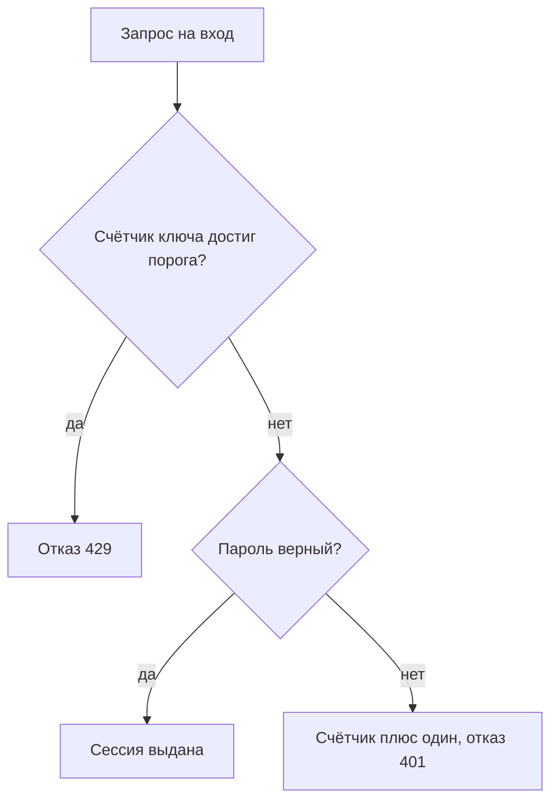
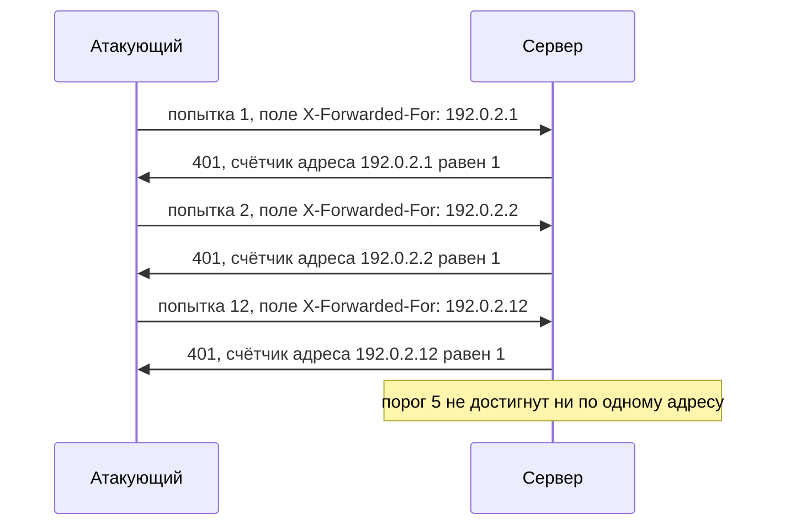

# Брутфорс, rate limiting и обходы защиты

Учебный стенд принимает вход по паролю и считает неудачные попытки. Порог —
пять неудач, шестая попытка подряд получает отказ с кодом 429, «слишком
много запросов». Прогоняем перебор из двенадцати паролей, и защита
срабатывает: пять отказов, семь блокировок. Теперь повторяем тот же перебор
с одной добавкой — каждая попытка несёт новое значение служебного заголовка
`X-Forwarded-For`. Через это поле прокси передают приложению адрес клиента,
а записать в него может и сам клиент.

```text
а) перебор с одного адреса:          5 отказов, 7 блокировок из 12
б) свой X-Forwarded-For на попытку: 12 отказов, 0 блокировок
```

Двенадцать догадок прошли, счётчик не сработал ни разу. Приложение считало
неудачи по адресу, а адрес в каждой попытке был новый — защита исправно
сторожила дверь, которой никто не пользовался. Почему счётчик обходится
одним заголовком и как собрать тот, который не обходится, — предмет этой
темы.

## Что такое брутфорс

**Брутфорс** (brute force, «грубая сила») — перебор паролей к чужой учётной
записи, который ведёт программа, а не человек. Человек за вечер наберёт
десяток догадок, программа за минуту пробует тысячу. Догадки берутся не с
потолка, а из словаря — списка частых паролей вроде «123456» и «qwerty»,
собранного из старых утечек. Бытовой аналог — замок чемодана с тремя
колёсиками: комбинаций тысяча, и упорный перебор открывает его без всякой
хитрости.

**Откуда это взялось.** Пароль — общий секрет, и проверка входа обязана
отвечать «да» или «нет» быстро, иначе ей никто не пользуется. Та же
скорость достаётся и автомату: тысяча запросов в минуту угадывает слабый
пароль за разумное время. Замедлить саму проверку до минуты нельзя —
пострадают обычные пользователи. Единственный рычаг у защиты — сделать так,
чтобы попытки кончались раньше догадок. Этот рычаг называют счётчиком
неудачных попыток.

Счётчик — память о промахах у входа: каждый неверный пароль добавляет
единицу, а при достижении порога вход закрывается. Следующие попытки
получают отказ, даже не дойдя до проверки пароля. Когда отказ ограничивает
частоту запросов, а не запирает вход насовсем, его называют ограничением
частоты (rate limiting). Бытовой аналог — домофон, который после пяти
неверных наборов кода молчит пять минут.

| У домофона | У формы входа |
|---|---|
| Кодовая панель у двери | Поля логина и пароля |
| Пять неверных наборов подряд | Счётчик достиг порога |
| Панель молчит пять минут | Временная блокировка |

Где аналогия ломается. Панель не различает, кто нажимает кнопки: жилец или
хулиган. У сервера такой выбор есть, и это главный вопрос темы. Счётчик
привязывают к ключу — признаку, по которому попытки складываются в одну
копилку, — и от ключа зависит, какую атаку он закрывает, а какую открывает.

## Как это работает

Счётчик ставят по одному из трёх ключей, и каждый закрывает свою атаку,
оставляя открытой другую.

- **По адресу источника.** Считаются попытки с одного IP. Закрывает перебор
  одной учётки из одной точки. Не закрывает распределённую атаку, где запросы
  идут с тысяч адресов разом: свой адрес атакующий меняет.
- **По учётной записи.** Считаются неудачи по одному логину независимо от
  адреса. Cheat Sheet OWASP советует привязывать счётчик именно к учётной
  записи, а не к адресу. Закрывает распределённый перебор одной учётки.
  Открывает отказ в обслуживании: чужую учётку так запирают снаружи, и
  владелец войти не может.
- **Глобально по входу.** Считается частота на всём входе разом —
  анти-автоматизация уровня приложения. ASVS v5.0-6.1.1 требует, чтобы
  документация описывала настройки rate limiting и адаптивного ответа —
  реакции, которая усиливается с ростом неудач. Отдельно должно быть сказано,
  как эти меры не приводят к наведённой блокировке — запиранию чужой учётки
  снаружи.

В каком месте обработки запроса стоит счётчик, видно на схеме.



**Описание схемы.** Схема читается сверху вниз. Проверка счётчика стоит
раньше проверки пароля: при достигнутом пороге запрос отклоняется с кодом
429 и до сверки пароля не доходит. Верный пароль выдаёт сессию — как она
устроена, разбирает тема `sessions-vs-tokens`. Неверный пароль добавляет
единицу счётчику ключа и возвращает отказ 401, «нет доступа».

Ни один ключ не полон. NIST SP 800-63B-4 § 3.2.2 требует ограничивать подряд
идущие неудачные попытки по одному аутентификатору — по тому, чем
подтверждают вход, здесь по паролю, — на учётной записи. Лимит — не более
ста, а при превышении аутентификатор отключается. Верхнюю границу в
сто NIST называет компромиссом между вероятностью угадать и потребностью в
восстановлении доступа. Cheat Sheet и NIST сходятся в главном: меры ставят
слоями, и лучший отдельный слой — второй фактор, дополнительное
подтверждение входа помимо пароля, а не счётчик.

**Зачем это в работе AppSec-инженера.** «У нас есть rate limiting» — типичный
ответ на вопрос о переборе, и он ничего не говорит. Ревьюер спрашивает три
вещи: где стоит счётчик, по какому ключу считает и что его сбрасывает. Разница
между защитой и её видимостью лежит ровно в этих трёх ответах.

## Как это атакуют

Прогон на локальном стенде (`.smgr/appsec-stage1-auth/exp/e04-ratelimit.py`,
Python 3.14.7) показывает четыре обхода одного и того же приложения с
порогом в пять неудач.

```text
а) перебор с одного адреса:                5 отказов, 7 блокировок из 12
б) свой X-Forwarded-For на попытку:       12 отказов,  0 блокировок
в) счётчик по адресу обнуляется успехом:  12 отказов,  0 блокировок
г) распыление: один пароль на пять учёток: 2 входа,    0 блокировок
д) законный вход после 5 неудач по чужой учётке: код 429
```

Строка «а» — счётчик работает как задумано: на шестой попытке с одного
адреса приложение отвечает кодом 429.

Строка «б» — тот же перебор, но каждая попытка приходит с новым значением
поля `X-Forwarded-For`. Здесь работает факт из темы
`access-control-bypass-headers`: это поле на пути к приложению может поставить
любой узел, включая самого клиента. Счётчик по адресу раскладывает попытки по
разным копилкам и не набирается ни разу.



**Описание схемы.** Каждая попытка несёт новое значение поля
`X-Forwarded-For`, и сервер раскладывает их по разным счётчикам. Ни один
счётчик не доходит до порога в пять, хотя догадок было двенадцать. Это
строка «б» прогона, разложенная по шагам.

Строка «в» — счётчик стоит по адресу и обнуляется любым успешным входом с
этого адреса. Атакующий между догадками входит в собственную учётку с того
же адреса, счётчик сбрасывается и до порога не доходит.

Строка «г» — распыление (password spraying): один самый частый пароль
пробуют на пяти разных учётках, по одной попытке на каждую. Аналогия с
домофоном здесь переворачивается: вместо тысячи кодов к одной двери — один
ходовой код к тысяче дверей. Счётчик по учётной записи не срабатывает,
потому что ни одна учётка порога не набрала, а два входа уже взяты. Два
входа взяты не по везению: самый частый пароль из словаря стоит у заметной
доли учёток — на то он и самый частый.

Строка «д» — обратная сторона блокировки по учётке. Пять неудач по чужому
логину, и законный владелец получает 429: хулиган у домофона набрал пять раз
чужой код, и жилец не попадает в собственный подъезд. Такую атаку называют
наведённой блокировкой.

> **Предупреждение.** Заголовок `X-Forwarded-For` ставит клиент. Доверять ему
> можно только после доверенного прокси, который перезаписывает его своим
> значением. Счётчик по «адресу из заголовка» без такого прокси считает по
> значению, которым управляет атакующий, — то есть не считает.

## Как это выглядит в коде

Ревьюер ищет ключ счётчика и то, что его сбрасывает. В листинге два дефекта;
найдите оба до чтения выносок.

```python
# УЯЗВИМО — демонстрация, не для продакшена
def login(request):
    ip = request.headers.get("X-Forwarded-For", request.remote_addr)  # (1)
    if fails[ip] >= LIMIT:
        return deny(429)
    if check_password(request.form["user"], request.form["pw"]):
        fails[ip] = 0                                                  # (2)
        return grant_session(request.form["user"])
    fails[ip] += 1
    return deny(401)
```

1. Ключ — адрес из заголовка, которым управляет клиент. Каждая попытка со
   своим значением попадает в пустую копилку.
2. Успешный вход обнуляет счётчик своего адреса. Свой вход с того же адреса
   между догадками сбрасывает его атакующему.

Признаки такие. Ключ счётчика — адрес, тем более из заголовка
`X-Forwarded-For` или `X-Real-IP` без доверенного прокси. Сброс счётчика при
успешном входе. Порог, применённый к учётной записи без защиты от наведённой
блокировки. Проверка CAPTCHA, теста «человек или машина», по HTTP-коду
ответа сервиса CAPTCHA, а не по тому, решена ли задача. Лимит, стоящий в
контроллере входа, но отсутствующий на альтернативном API той же проверки.

## Как защититься

Правило: считать по устойчивому ключу, не сбрасывать счётчик успехом одного
входа и не давать блокировкой запирать чужую учётку. Проверьте по листингу
три вещи: чем заменён ключ, куда делся сброс успехом, как снимается
блокировка.

```python
# Исправлено.
def login(request):
    user = request.form["user"]
    key = ("user", user)                                    # (1)
    if locked(key):                                         # (2)
        return deny(429, "temporarily locked")
    ok = check_password(user, request.form["pw"])
    record_attempt(key, ok)                                 # (3)
    if not ok:
        return deny(401)
    return grant_session(user)
```

1. Ключ — учётная запись, а не адрес. Смена адреса перебор не ускоряет.
2. Блокировка временная, с растущей выдержкой (Cheat Sheet: экспоненциальный
   рост от секунды). Разблокировать умеет и восстановление пароля — тогда
   наведённая блокировка не запирает владельца насовсем.
3. Попытки пишутся всегда, и успех не стирает историю неудач: он лишь пускает
   этот вход.

Этот вариант — правило из начала раздела, разложенное на строки: ключ,
который атакующий не меняет, история, которую успех не стирает, блокировка,
которую владелец снимает восстановлением пароля.

Вопрос без подглядывания в выноски: оставьте ключ по учётной записи, но
верните сброс счётчика успешным входом — что это меняет? Обходы «б» и «в» не
вернутся: смена `X-Forwarded-For` бессильна против ключа по учётке, а свой
вход атакующего обнуляет счётчик его собственной учётки, не жертвы. Слабость
останется в другом месте: счётчик жертвы сбрасывает каждый её собственный
успешный вход, и медленный перебор, перемежающийся обычными входами
владельца, до порога не дойдёт.

**Что ставится рядом, а не вместо.** Второй фактор — дополнительное
подтверждение входа помимо пароля, например код из приложения на телефоне.
По данным, которые приводит Cheat Sheet, он снимает подавляющее большинство
атак на пароль, а его собственные обходы разбирает тема `mfa-bypass`.
Проверка нового пароля по топ-3000 частых (ASVS v5.0-6.2.4) и по списку
скомпрометированных (ASVS v5.0-6.2.12) убирает те догадки, которые перебор
пробует первыми.

CAPTCHA — тест, отличающий человека от программы: разобрать искажённые буквы
или найти светофоры на снимках. Cheat Sheet называет её мерой в глубину, а
не заменой блокировки. Её показывают после нескольких неудач, а результат
сверяют на сервере, иначе программа подделает ответ.

**Чем платит каждый ключ.** Счётчик по адресу дёшев и не запирает людей, но
слеп к распределённой атаке. Блокировка по учётке ловит распределённый
перебор, но открывает отказ в обслуживании. Глобальная анти-автоматизация
видит атаку целиком, но настраивается тонко и требует документированного
порога, иначе сама становится отказом в обслуживании.

## Как убедиться, что защита работает

Защита, которой нечего отвергнуть, ничего не доказывает, поэтому счётчик
проверяют отказом, а не приёмом. Прогоните на стенде четыре проверки — это
те же приёмы, что обходили счётчик в разделе про атаки, но теперь они
работают на вас.

Первая — шесть неверных паролей к одной учётке с одного адреса: шестая
попытка обязана получить отказ 429. Нет отказа — счётчика нет вовсе.
Вторая — тот же перебор со сменой значения `X-Forwarded-For` на каждую
попытку: отказ обязан наступить так же, потому что ключ теперь учётная
запись. Не наступил — счётчик читает значение, которым управляет клиент.

Третья — свой успешный вход между неудачами с того же адреса: история неудач
не обязана стираться. Стерлась — обход строки «в» жив. Четвёртая — пять
неудач по тестовой учётке с другого адреса: её владелец получит 429, но
восстановление пароля обязано снимать блокировку. Не снимает — наведённая
блокировка запирает человека насовсем.

На ревью пройдите по списку.

1. Проверьте, что счётчик неудачных попыток привязан к устойчивому ключу, а
   не к адресу из заголовка, которым управляет клиент (ASVS v5.0-6.3.1).
2. Проверьте, что успешный вход не обнуляет накопленный счётчик неудач.
3. Проверьте, что блокировка по учётной записи не позволяет запереть чужого
   пользователя снаружи и снимается восстановлением пароля.
4. Проверьте, что проверка пароля идёт против топ-3000 частых
   (ASVS v5.0-6.2.4) и списка скомпрометированных (ASVS v5.0-6.2.12).
5. Проверьте, что CAPTCHA сверяется на сервере по факту решения, а не по
   HTTP-коду ответа сервиса CAPTCHA, и не заменяет блокировку.
6. Проверьте, что тот же лимит стоит на всех путях входа, включая мобильный
   API и альтернативные каналы (WSTG-v42-ATHN-03).
7. Проверьте, что настройки rate limiting и порог блокировки описаны в
   документации приложения (ASVS v5.0-6.1.1).

## Частая ошибка

Rate limiting на входе стоит — перебор закрыт? Собственный ответ
сформулируйте до опровержения.

Основание — прогон до отказа 429: раз стоит rate limiting, перебор закрыт.

**Счётчик закрывает ровно ту атаку, под чей ключ он поставлен.** Ограничение
по адресу не мешает распределённому перебору. Блокировка по учётке не мешает
распылению одного пароля по многим учёткам. Ни то ни другое не мешает
подстановке украденных пар, где каждую пару «логин и пароль» из утечки
пробуют ровно один раз. Эту атаку разбирает тема `credential-stuffing`.
Сбой в цепочке один: защиту проверяют перебором с одного адреса, видят отказ
429 и обобщают вывод на все атаки, хотя проверен был один ключ.

Контрпример из прогона. Приложение с порогом в пять неудач по адресу
выдержало перебор с одной точки (строка «а»). Тот же перебор со сменой
`X-Forwarded-For` на каждую попытку оно пропустило: ноль блокировок на
двенадцати неудачах (строка «б»). Счётчик исправно работал — не по тому
ключу.

## Попробуй сам

Возьмите вход приложения, с которым работаете, и ответьте письменно на
четыре вопроса. По какому ключу считаются неудачные попытки. Что обнуляет
этот счётчик. Что произойдёт, если каждую попытку слать с новым значением
`X-Forwarded-For`. Что произойдёт с законным владельцем, если пять раз
ошибиться в его логине.

**Наблюдаемый критерий:** четыре ответа со ссылкой на строку кода или
настройку шлюза, где ключ и сброс видны. Плюс вывод, какую из трёх атак —
перебор одной учётки, распыление, наведённую блокировку — эта защита не
закрывает.

## Проверь себя

1. Обработчик входа соседнего проекта:

   ```python
   def login(request):
       user = request.form["user"]
       if fails[user] >= LIMIT:
           return deny(429)
       if check_password(user, request.form["pw"]):
           return grant_session(user)
       fails[user] += 1
       return deny(401)
   ```

   По какому ключу стоит счётчик, и какая атака остаётся открытой? Запишите её
   одной строкой.

2. Перебор двенадцати паролей одной учётки не встретил ни одной блокировки.
   Какую починку вы выберете?

   А. Понизить порог с пяти неудач до трёх по тому же ключу.

   Б. Считать по учётной записи, не стирать историю успехом и сделать
      блокировку временной, со снятием через восстановление пароля.

   В. Убрать счётчик вовсе: второй фактор сильнее любого счётчика.

3. Почему счётчик по адресу, обнуляемый успешным входом, обходится собственным
   входом атакующего с того же адреса?

4. Счётчик стоит по значению `X-Forwarded-For`. Не запуская, предскажите,
   сколько блокировок наберут двенадцать неудач со сменой поля на каждую
   попытку.

   ```python
   fails = {}
   LIMIT = 5

   def login(xff, ok):
       if fails.get(xff, 0) >= LIMIT:
           return 429
       if ok:
           fails[xff] = 0
           return 200
       fails[xff] = fails.get(xff, 0) + 1
       return 401

   codes = [login(f"10.0.0.{i}", False) for i in range(12)]
   print(codes.count(429), "блокировок из", len(codes))
   ```

5. Возврат к теме `sessions-vs-tokens`: после успешного входа выдаётся новая
   сессия — почему счётчик неудач нельзя держать в этой сессии?
6. Возврат к теме `access-control-bypass-headers`: кто ставит поле
   `X-Forwarded-For` и при каком условии ему можно доверять?

<details markdown="1">
<summary>Ответ 1</summary>

1. Ключ — учётная запись. Открытыми остаются две: распыление («один пароль,
   пять учёток, по одной попытке на каждую») и наведённая блокировка. Пять
   неудач по чужому логину запирают его владельца — строка «д» прогона.

</details>

<details markdown="1">
<summary>Ответ 2 и разбор вариантов</summary>

2. Верный ответ — Б.

   А. Порог не лечит ключ. Перебор со сменой `X-Forwarded-For` и свой вход
      между догадками обнуляют счётчик при любом пороге — строки «б» и «в»
      того же прогона.

   Б. Ключ, который атакующий не меняет, история, которую успех не стирает, и
      блокировка, которую владелец снимает восстановлением, — правило из
      раздела «Как защититься», разложенное на три свойства.

   В. Второй фактор — лучший отдельный слой, но меры ставятся слоями, а не
      вместо друг друга: NIST требует и ограничение подряд идущих неудач.

</details>

<details markdown="1">
<summary>Ответ 3</summary>

3. Успех и догадки атакующего идут с одного адреса и делят его счётчик. Свой
   успешный вход между догадками обнуляет счётчик, и порог никогда не
   достигается. Прогон: строка «в», ноль блокировок на двенадцати неудачах.

</details>

<details markdown="1">
<summary>Ответ 4</summary>

4. Ноль: каждая попытка несёт новое значение поля, и счётчик по нему не
   набирается ни разу.

   ```text
   $ python3 rl.py
   0 блокировок из 12
   ```

   Это строка «б» из прогона темы: счётчик исправно работал — не по тому
   ключу. Без доверенного прокси, который перезаписывает поле своим значением,
   «адрес из заголовка» считает значение, которым управляет атакующий.

</details>

<details markdown="1">
<summary>Ответ 5</summary>

5. До входа сессии этого пользователя ещё нет, а неудачные попытки идут именно
   до входа. Счётчик в сессии считал бы только уже вошедших — то есть никого из
   тех, кого надо остановить.

</details>

<details markdown="1">
<summary>Ответ 6</summary>

6. Поле ставит любой узел на пути, включая клиента. Доверять ему можно только
   после доверенного прокси, который перезаписывает его своим значением, и
   только при защищённой связи с ним.

</details>

## Источники

1. OWASP Authentication Cheat Sheet; реестр `owasp-cs-authentication`. Разделы:
   Protect Against Automated Attacks (Login Throttling, Account Lockout,
   CAPTCHA), Authentication and Error Messages.
   <https://cheatsheetseries.owasp.org/cheatsheets/Authentication_Cheat_Sheet.html>
2. PortSwigger Web Security Academy, «Vulnerabilities in password-based login»;
   реестр `ps-authentication`. Разделы: Flawed brute-force protection, Account
   locking, User rate limiting.
   <https://portswigger.net/web-security/authentication>
3. NIST SP 800-63B-4 «Digital Identity Guidelines», Final, июль 2025; реестр
   `nist-sp-800-63b`. Раздел § 3.2.2 Rate Limiting (Throttling): предел в
   сто подряд идущих неудач, растущая выдержка, bot-detection challenge.
   <https://csrc.nist.gov/pubs/sp/800/63/b/4/final>
4. OWASP WSTG-ATHN-03 «Testing for Weak Lock Out Mechanism», WSTG v4.2; реестр
   `wstg-v42-athn-03-weak-lockout`. Разделы: How to Test, Unlock Mechanism,
   Remediation.
   <https://owasp.org/www-project-web-security-testing-guide/v42/4-Web_Application_Security_Testing/04-Authentication_Testing/03-Testing_for_Weak_Lock_Out_Mechanism>

Каркас этапа: `owasp-asvs-5-document` (ASVS v5.0.0), `owasp-wstg-42`,
`owasp-top10-2025`; якоря подраздела: `ps-authentication`,
`owasp-cs-authentication`. Наследуются всеми темами и отдельной строкой не
повторяются.

**Скоропортящийся слой.** Пороги блокировки и выдержки (5–10 попыток, 5–30
минут) — рекомендация Cheat Sheet и WSTG, живых документов без даты; числа
годятся как ориентир, а не норматив. Заголовки `X-Forwarded-For`, `X-Real-IP`
как канал подмены адреса привязаны к настройке конкретного шлюза.

**Маркеры уверенности.** Четыре обхода счётчика и наведённая блокировка —
**проверено лично** 2026-08-24 на Python 3.14.7 локальным стендом
`e04-ratelimit.py` (порог 5, счётчик по адресу и по учётке). Требования к ключу
счётчика, порогам и слоям защиты — **по документации**: Authentication Cheat
Sheet, ASVS v5.0.0, NIST SP 800-63B-4, WSTG v4.2, открыты лично 2026-08-24.
Поведение живого шлюза с доверенным прокси **не воспроизводилось**: стенд
моделирует разбор `X-Forwarded-For` приложением, а не цепочку прокси.
