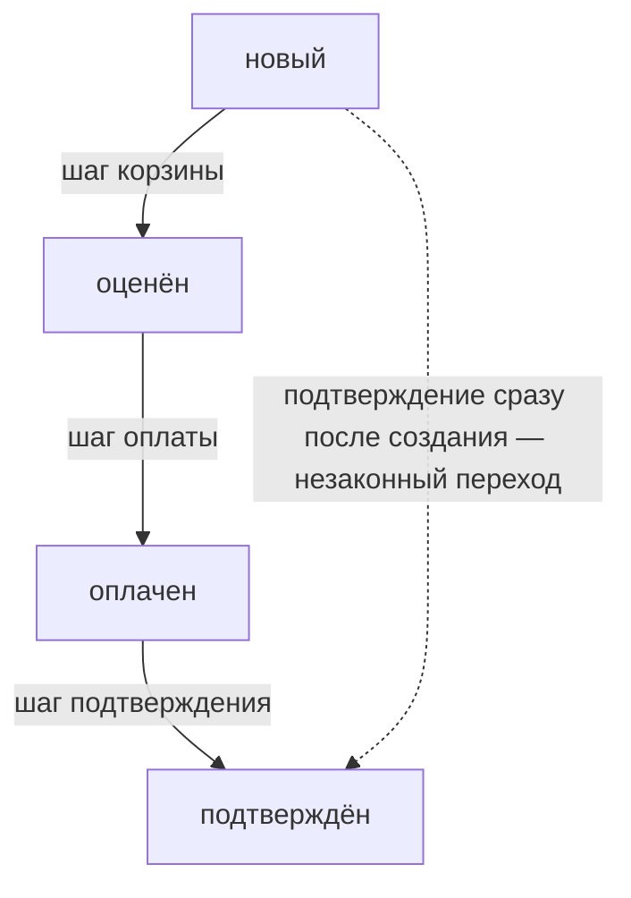

# Дефекты бизнес-логики

Учебный магазин из этой темы проводит заказ через четыре шага: корзина,
скидка, оплата, подтверждение. Вот прогон, в котором покупатель вызывает
только первый и последний.

```text
опыт 1 — подтверждение без оплаты
    корзина: 900.00
    заказ подтверждён
    итог: статус confirmed, к оплате 900.00, внесено 0.00
```

Заказ подтверждён, а денег магазин не получил. При этом никто ничего не
взламывал: товар есть в каталоге, количество целое, сессия жива, права
проверены. Сломалось не что-то из этого списка, а правило «сначала оплата,
потом подтверждение». Оно существовало только в порядке экранов, и покупатель
обошёлся без третьего. Расхождение между тем, что правило требует, и тем,
что код допускает, называют дефектом бизнес-логики — ему посвящена эта тема.

## Что такое бизнес-логика

**Бизнес-логика — это правила, по которым приложение ведёт дело:** сначала
оплата, потом отгрузка; скидка одна на заказ; количество не бывает
отрицательным. Слово «бизнес» здесь означает предметную область, то есть
кусок жизни, для которого написано приложение: торговлю, переводы между
счетами, выдачу билетов. Правила области программист узнаёт не из
документации по языку, а от тех, кто в этой области работает.

Бытовой аналог — кофейня. В ней те же правила звучат так. Сначала гость
платит на кассе, потом бариста готовит напиток; скидочная карта действует
одна на чек; минус три стакана в чек не запишешь. Соответствие с приложением
прямое.

| В кофейне | В приложении-магазине |
|---|---|
| «сначала чек, потом напиток» | «сначала оплата, потом подтверждение заказа» |
| «одна скидочная карта на чек» | «одна скидка на заказ» |
| «минус три стакана не бывает» | «количество не бывает отрицательным» |

Где аналогия ломается. В кофейне за порядком следит кассир, и он остановит
гостя, который просит напиток без чека. Между клиентом и сервером человека
нет: каждый запрос обрабатывает код, и если вопрос «а был ли чек» в коде не
записан, его не задаёт никто. Второе различие — масштаб. Кассир устаёт и
ошибается, а код повторяет своё решение тысячи раз подряд, в том числе
ошибочное.

Разницу между дефектом логики и дефектом механизма видно по тому, кто может
назвать дефект дефектом. «Пароль хранится без соли» — утверждение, верное во
всех приложениях сразу, и тема `password-storage` разбирает, почему. «Скидка
начислена дважды» — утверждение, верное только там, где правило говорит
«скидка одна». Первое проверяется по стандарту, второе — по требованиям.
Эта тема про второе.

Отсюда практическое следствие. Дефект механизма находят сравнением с
образцом, а дефект логики — сравнением с обещанием. Пока обещание не
записано, сравнивать не с чем. Поэтому ASVS, каталог требований к приложению
от открытого проекта OWASP, первым требованием этой области просит их
записывать (v5.0-2.1.3). Записать просят и пределы для одного пользователя,
и лимиты по приложению целиком. Требование выглядит бумажным ровно до
первого ревью, на котором нечем ответить на вопрос «а сколько раз это можно
делать».

**Откуда это взялось.** Ранние веб-приложения были тонкой оболочкой над
формой: браузер собирал поля, сервер их сохранял. Правила предметной области
жили в голове у того, кто писал форму, и в разметке самой формы. В списке
допустимых значений. В поле, помеченном обязательным. В кнопке, ведущей на
следующий экран. Пока клиент ходил по экранам, правила работали. Как только
у клиента появился способ отправить запрос напрямую, оказалось, что часть
правил нигде, кроме разметки, не записана. Дефект не в том, что кто-то забыл
проверку: проверка была, но её носителем был интерфейс.

**Зачем это в работе AppSec-инженера.** Проверку порядка действий не сделает
сканер — программа, которая ищет дефекты по готовым образцам: в её словаре
нет утверждения «сначала оплата, потом отгрузка». Дефекты бизнес-логики
приходится искать вручную. На ревью тема даёт вопрос, применимый к любой
функции: какое правило здесь держится и чем оно держится, кроме порядка
экранов.

## Подумай, прежде чем читать

1. Форма магазина не даёт ввести отрицательное количество. Что мешает
   отправить его в обход формы?
2. Заказ проходит четыре экрана подряд. Откуда сервер узнаёт, что клиент
   прошёл третий экран, если запрос четвёртого пришёл сам по себе?
3. Скидка 10 % даётся на заказ дороже 1000. Клиент набрал корзину на 1200,
   получил скидку и убрал половину товаров. Что должно произойти со скидкой?

## Как это работает

Обработчик подтверждения из начала темы не спрашивает, в каком состоянии
заказ: такого вопроса в коде нет. Почему разработчик его не написал?
Он писал код для сценария, который представлял себе, а сценарий с пропущенной
оплатой не представил. Класс держится на таких допущениях. Академия
PortSwigger, учебник от создателей перехватывающего прокси Burp Suite из темы
`tls-and-proxy`, раскладывает класс на типовые допущения. Четыре из них
покрывают почти всё, что встречается на ревью.

**Клиент проверит.** Приложение полагается на то, что значение придёт из его
собственной формы, а форма плохого не пришлёт. Но запрос можно отправить
мимо формы: перехватывающий прокси встаёт между браузером и сервером и даёт
переписать любое поле. Выпадающий список с двумя вариантами превращается в
произвольную строку. Ответ стандарта короток: проверку ввода делают на
доверенном слое службы, то есть на сервере, чьим поведением клиент не
управляет (v5.0-2.2.2). Клиентская проверка — удобство интерфейса, а не
защита.

**Ввод будет обычным.** Числовое поле принимает и отрицательные значения, и
очень большие, и нечисло вместо числа. Правило «нельзя заказать больше, чем
есть на складе» записано проверкой сверху, а снизу границы нет. Минус три
стула проходят проверку, и строка заказа уходит в минус по деньгам. Этот
случай разбирает отдельная тема `negative-values-overflow`.

**Пользователь пойдёт по порядку.** Шаги процесса открываются друг за
другом, и следующий доверяет предыдущему, потому что иначе до него вроде бы
не дойти. Дойти можно: клиент вызывает обработчики в любом порядке. Механику
этого доверия разбирает тема `multistep-flow-checks`. Здесь работает
следствие: пропущенный шаг оставляет заказ в состоянии, которого в
требованиях нет, а приложение продолжает считать по нему.

**Проверенному можно верить дальше.** Строгая проверка стоит на входе в
процесс, а внутри процесса те же правила применяются слабее. Скидка,
начисленная по условию «заказ дороже порога», не пересматривается после
того, как условие перестало выполняться. Это и есть точка, где вред
считается деньгами.

Состояния заказа из нашего магазина и законные переходы между ними:



**Описание схемы.** Заказ живёт в четырёх состояниях: новый, оценён, оплачен,
подтверждён. Сплошные стрелки — законные переходы, каждый выполняет свой шаг
процесса. Пунктирная стрелка — переход из опыта 1: запрос подтверждения
приходит сразу после создания заказа. В уязвимом магазине он проходит,
потому что обработчик подтверждения не смотрит текущее состояние.

### Как читать требования

Дефект логики находят не поиском по коду, а вопросом к обещанию. Порядок,
который себя оправдывает, состоит из четырёх шагов и требует только описания
функции.

1. Выпишите правила. Не весь документ, а утверждения, которые можно
   нарушить: «скидка одна на заказ», «отгрузка после оплаты», «на счёте не
   бывает минуса». Каждое такое утверждение — кандидат в находки, и каждое
   должно где-то держаться в коде.
2. Назовите носителя каждого правила. Правило держится на строке кода, на
   ограничении в схеме хранилища или на порядке экранов. Третий носитель
   защитой не работает, и это самый частый ответ на ревью: правило живёт в
   интерфейсе, а на сервере его нет.
3. Нарушите каждое правило одним способом из короткого списка. Пропустите
   шаг, повторите шаг, вернитесь назад, отправьте значение вне диапазона,
   уберите поле вместе с именем, отправьте два запроса сразу. Академия
   называет тот же приём с другой стороны: попробуйте значения, которых
   законный пользователь не введёт никогда.
4. Посчитайте вред в единицах предметной области. Не «функция отработала
   неверно», а «товар отгружен без оплаты на такую-то сумму». Разбор,
   который считает вред деньгами, доходит до исправления. Разбор, который
   описывает поведение, остаётся в списке замечаний.

### Когда правило знает область, а не разработчик

Отдельная разновидность живёт там, где правило известно не разработчику, а
области, для которой пишут. Академия разбирает скидки в магазине как
классический пример. Условие «скидка на заказ дороже порога» проверяется в
момент начисления, а корзину после этого разрешено менять. Правило нарушено,
хотя ни одна проверка не пропущена.

Отсюда требование к самому ревьюеру. Без знания области опасное поведение
читается как странное: непонятно, почему сумма ниже порога после скидки —
дефект, а не свойство. Средство прямое: читать документацию области и
спрашивать тех, кто в ней работает. Чем область незнакомее, тем больше в ней
найдётся.

### Пять опытов на стенде

Стенд этой темы ставит магазин из четырёх шагов: корзина, скидка, оплата,
подтверждение. Сервер не хранит, на каком шаге заказ, и берёт числа из
запроса. Два допущения из четырёх здесь уже видны. Прогон стенда, снятый при
написании темы:

```text
$ python e07-workflow.py
опыт 1 — подтверждение без оплаты
    корзина: 900.00
    заказ подтверждён
    итог: статус confirmed, к оплате 900.00, внесено 0.00
опыт 2 — цена приходит от клиента
    корзина: 0.01
    итог: статус confirmed, к оплате 0.01, внесено 0.01
опыт 3 — скидка взята, корзина уменьшена
    корзина: 1350.00 -> скидка начислена -> корзина: 1346.00
    итог: статус confirmed, к оплате 1211.0000, внесено 1211.0000
опыт 4 — оплачено меньше, чем к оплате
    итог: статус confirmed, к оплате 900.00, внесено 1.00
опыт 5 — контроль, законный заказ
    итог: статус confirmed, к оплате 450.00, внесено 450.00
```

Все четыре допущения сломаны в первых четырёх строках, пятая строка —
контроль. Ни в одной строке не сломан механизм. Разбор идёт следом. Прежде
чем читать его, отметьте сами, какая строка какое допущение ломает.

Опыт 1 подтверждает заказ, за который не заплачено: обработчик подтверждения
не спрашивает состояние заказа. Это допущение «пользователь пойдёт по
порядку». Опыт 2 присылает цену вместе с товаром, и сервер её принимает —
каталог на сервере есть, но в расчёте не участвует. Это допущение «клиент
проверит».

Опыт 3 берёт скидку на полной корзине, а затем уменьшает её строкой с
отрицательным количеством. Корзина выше порога и после уменьшения, но скидка
осталась посчитанной от прежней суммы: пересчёта в коде нет. Здесь сломаны
два допущения: «проверенному можно верить дальше» и, на входе, «ввод будет
обычным». Опыт 4 вносит рубль вместо девятисот, и заказ всё равно переходит
в подтверждённые — снова «клиент проверит», только уже на деньгах платежа.

Опыт 5 — контроль. Законный заказ обязан проходить и после починки, иначе
починкой это назвать нельзя.

Отдельного внимания стоит число `1211.0000` в третьем опыте. Скидка
посчитана умножением на `0.10`, и у результата четыре знака после запятой
вместо двух. Разряды, взявшиеся из ниоткуда, — предмет темы `money-rounding`.
Здесь они показывают, что дефект логики редко ходит один.

## Как это атакуют

Лаба этой темы, каталог `pilot/lab/business-logic-flaws`, собирает тот же
магазин в один модуль. Эксплойт — скрипт `hack.py`: он вызывает обработчики
магазина в порядке по своему выбору и подставляет свои числа. Опытов здесь
четыре, а не пять: контрольный заказ стал четвёртым, а недоплата накрыта
опытом 2 — там товар из прайса за 450.00 уходит за копейку. Атакующий с
перехватывающим проксием сделал бы то же самое запросами к серверу. Вот
прогон против уязвимого кода:

```text
$ python hack.py
Цель: code.py
каталог: {'desk': '450.00', 'pen': '2.00'}, порог скидки 1000.00

  опыт 1 — confirm без pay: ЗАКАЗ ПОДТВЕРЖДЁН, внесено 0.00
  опыт 2 — цена 0.01 вместо 450.00: ЗАКАЗ ПОДТВЕРЖДЁН, итог 0.01
  опыт 3 — скидка пережила уменьшение корзины: итог 900.00, скидка 135.0000
  опыт 4 — контроль, законный заказ на 450.00: проведён

ЭКСПЛОЙТ СРАБОТАЛ: правило предметной области нарушено (3 из 3 опытов)
```

Ценность каждого опыта считается в деньгах, и потому обнаруживаются они
по-разному. Опыт 1 даёт товар бесплатно, и его рано или поздно замечает
склад. Опыт 2 даёт товар за копейку и выглядит в отчётности законной
продажей: сумма сходится с записью о платеже и расходится только с
прайс-листом. Опыт 3 самый тихий. Заказ оплачен, скидка начислена, документы
согласованы между собой, а условие скидки нарушено: итог 900.00 ниже порога
1000.00. Такое находят сверкой с требованиями, а не по журналам.

Опыт 4 остаётся зелёным в обоих прогонах и стоит в лабе ровно затем, чтобы
починка не свелась к запрету всего.

Тяжесть класса не выводится из механизма. Тот же дефект в оформлении заказа
даёт убыток на цену товара, а в переводе средств — на остаток счёта.
Академия отдельно предупреждает: странность логики стоит чинить даже тогда,
когда рабочего сценария злоупотребления придумать не удалось.

## Как это выглядит в коде

Ревьюер ищет здесь не вызов, а отсутствие: величину, взятую из запроса
вместо справочника, и переход состояния без проверки прошлого состояния.
Читайте листинг с двумя планами: найдите, откуда пришла цена; найдите
переход состояния и спросите, что его охраняет. Листинг — упрощённый вариант
обработчиков лабы. Две ошибки в нём — какие? Найдите их раньше разбора.

```python
# УЯЗВИМО — демонстрация, не для продакшена
def add_line(order, req):
    price = Decimal(req["price"])              # (1)
    order["lines"].append((req["sku"], int(req["qty"]), price))
    order["total"] = sum(q * p for _, q, p in order["lines"])
    return order["total"]

def confirm(order, req):
    order["status"] = "confirmed"              # (2)
    return "заказ подтверждён"
```

1. Цена приходит из запроса. Каталог на сервере есть, но в расчёте не занят.
2. Переход в конечное состояние не спрашивает ни текущего состояния, ни
   суммы внесённого платежа.

Этот пример показывает: дефект логики — не подозрительная строка, а
отсутствие нужной. Поэтому поиском по словарю опасных вызовов его не найти.

**Тот же дефект на другом стеке.** В Node.js картина повторяется, отличаются
лишь названия вызовов:

```javascript
// УЯЗВИМО — демонстрация, не для продакшена
app.post("/cart", (req, res) => {
  order.lines.push({ sku: req.body.sku, price: Number(req.body.price) });
  res.json({ total: sum(order.lines) });
});
app.post("/confirm", (req, res) => { order.status = "confirmed"; });
```

Общее в обоих листингах — инвариант дефекта, свойство, которое не зависит от
языка: величина, влияющая на деньги, пришла снаружи, и переход состояния не
сверен с состоянием. Декорация, то есть то, что меняется от стека к стеку, —
язык и способ разобрать тело запроса.

**Где ревьюер промахивается.** Первый промах — считать дефектом любое чтение
числа из запроса: количество товара клиент назвать вправе, вопрос лишь в
границах. Второй — принимать наличие проверки за её достаточность: условие
`if order["paid"]` истинно и при внесённом рубле. Третий — читать функции по
одной. Опыт 3 не виден ни в одной функции отдельно: `apply_discount` верна,
`add_line` верна, неверна их последовательность.

## Как защититься

Порядок мер обратный порядку допущений: сильнее всех та, что переносит
решение на сервер.

- **Состояние процесса живёт на сервере.** Заказ хранит своё состояние, и
  каждый шаг объявляет, из каких состояний он допустим. ASVS требует
  обрабатывать шаги в предусмотренном порядке и без пропусков (v5.0-2.3.1).
- **Величины пересчитываются из справочника.** Цена берётся по артикулу из
  каталога, скидка вычисляется заново на каждом изменении корзины, а сумма к
  оплате сравнивается с внесённой.
- **Пределы записаны и проверены.** Количество, сумма и число применений
  скидки заданы в требованиях (v5.0-2.1.3) и реализованы в коде
  (v5.0-2.3.2), а не подразумеваются.
- **Проверка стоит на доверенном слое** и повторяется на каждой передаче
  между службами (v5.0-2.2.2).

Руководство WSTG (Web Security Testing Guide, сборник сценариев проверки
OWASP) называет передачу между системами местом, где логическая проверка
теряется чаще всего (тест WSTG-BUSL-01).

В починке каждый слой занимает своё место: допустимость шага — вызов `step`,
границы — проверка количества, цена — каталог, пересчёт — `discount_for`,
деньги — условие в `confirm`.

```python
# Исправлено: состояние на сервере, цена из каталога, скидка пересчитана.
ALLOWED = {"new": {"cart", "pay"}, "priced": {"cart", "pay"},
           "paid": {"confirm"}, "confirmed": set()}

def add_line(order, req):
    step(order, "cart")                        # (1)
    qty = int(req["qty"])
    if not 1 <= qty <= MAX_QTY:                # (2)
        raise ValueError("количество вне границ")
    order["lines"].append((req["sku"], qty, CATALOG[req["sku"]]))  # (3)
    order["total"] = total_of(order)
    order["discount"] = discount_for(order)    # (4)
    order["status"] = "priced"

def confirm(order, req):
    step(order, "confirm")
    if order["paid"] != order["total"] - order["discount"]:        # (5)
        raise PermissionError("оплата не сходится")
    order["status"] = "confirmed"
```

1. Шаг допустим не всегда, а из перечисленных состояний.
2. Границы с обеих сторон, а не только сверху.
3. Цена берётся по артикулу из каталога, присланная не участвует.
4. Скидка пересчитывается при каждом изменении корзины.
5. Переход в конечное состояние сверяет деньги, а не факт вызова.

**Где это не работает.** Перечень допустимых переходов закрывает порядок, но
не закрывает содержание. Заказ, прошедший все шаги правильно, но собранный
из несочетаемых полей, пройдёт. Для этого ASVS держит отдельное требование о
логической согласованности связанных значений. Есть и цена поддержки: новый
шаг, добавленный мимо перечня, снова открывает пропуск.

**Что добавляется поверх.** Инварианты в схеме хранилища — утверждения,
которые обязаны оставаться верными при любой записи: сумма заказа
неотрицательна, скидка не больше суммы. Они ловят то, что пропустил код.
Журнал переходов состояний даёт возможность заметить заказ, попавший в
конечное состояние не тем путём. Для операций с высокой ценой ошибки ASVS
держит меру подтверждения вторым человеком, чтобы одиночный дефект логики не
доводил до перевода крупной суммы (v5.0-2.3.5).

Ни одна из этих мер не заменяет записанного правила. Инвариант в схеме — то
же утверждение о предметной области, выраженное на языке хранилища, и взять
его неоткуда, если пределы нигде не выписаны. Отсюда порядок работы: сначала
требование, затем проверка в коде, затем ограничение в схеме как последний
рубеж.

## Как убедиться, что защита работает

Ретест — это повтор тех же атак после починки. Эксплойт лабы умеет работать
против любого файла через переменную `LAB_TARGET`, поэтому ретест — тот же
прогон, но против решения:

```text
$ LAB_TARGET=solution.py python hack.py
Цель: solution.py
каталог: {'desk': '450.00', 'pen': '2.00'}, порог скидки 1000.00

  опыт 1 — confirm без pay: отказ (шаг confirm закрыт из состояния priced)
  опыт 2 — цена 0.01 вместо 450.00: отказ (к оплате 450.00, прислано 0.01)
  опыт 3 — скидка пережила уменьшение корзины: отказ (количество вне границ)
  опыт 4 — контроль, законный заказ на 450.00: проведён

эксплойт не сработал: три правила удержаны, законный заказ проходит
```

Три обхода закрыты, законный заказ проходит. Сама функциональность закрыта
тестами, и в лабе их шесть. Корзина из одной строки, корзина из двух строк,
скидка на пороге, оплата ровно к оплате, отказ на неизвестном артикуле,
полный законный заказ. Все шесть зелёные и на уязвимом коде, и на решении:
тема правит порядок и источник величин, а не поведение магазина.

Со стороны чёрного ящика, то есть без чтения кода, WSTG предлагает вести
ретест от требований. Сначала по документации выписываются шаги процесса и
пределы. Затем каждое выписанное правило нарушается по одному: шаг
пропускается, повторяется, выполняется дважды, параметр удаляется целиком
вместе с именем. Тест WSTG-BUSL-06 описывает встречную процедуру. Доведите
процесс до точки, где начислен побочный эффект, отмените процесс и
проверьте, откатился ли эффект.

На ревью пройдите по списку.

1. Проверьте, что величина, влияющая на деньги или квоту, берётся из
   справочника на сервере, а не из тела запроса.
2. Проверьте, что шаги процесса выполняются в предусмотренном порядке и без
   пропусков (ASVS v5.0-2.3.1).
3. Проверьте, что состояние процесса хранится на сервере, а не передаётся
   клиентом вместе с запросом.
4. Проверьте, что условие, давшее льготу, пересматривается при каждом
   изменении заказа.
5. Проверьте, что пределы и проверки бизнес-логики записаны в требованиях
   (ASVS v5.0-2.1.3) и реализованы в коде (ASVS v5.0-2.3.2).
6. Проверьте, что проверка выполняется на доверенном слое службы, а не
   только в интерфейсе (ASVS v5.0-2.2.2).
7. Проверьте, что логическая согласованность сохраняется при передаче данных
   между службами, а не проверяется однажды на входе.

## Как это находят инструменты

Статический анализ кода, сокращённо
SAST (Static Application Security Testing),
проверяет программу, не запуская её: инструмент ищет в исходном тексте
образцы дефектов. Для одной формы дефекта этой темы такое правило написано —
для анализатора Semgrep. Правило ловит денежную величину, взятую из тела
запроса.

Правило лежит в файле `pilot/semgrep/money-value-from-request.yaml` и
сверено прогоном: на уязвимом файле лабы одна находка, на решении ноль, на
пяти размеченных тест-кейсах расхождений нет.

**Чего это правило не ищет.** Оно судит по имени ключа. Поле, названное `p`
или `stoimost`, пройдёт мимо. Поле `total`, которое приложение само же и
посчитало, попадёт находкой.

**Что правило пропустит целиком.** Опыт 1 — подтверждение без оплаты. Опыт 3
— скидку, пережившую изменение корзины. В обоих случаях нет ни
подозрительного вызова, ни подозрительного имени. Есть две правильные
функции, вызванные в неправильном порядке. Ни одно правило поиска по образцу
этого не увидит: образец пришлось бы записать словами «сначала оплата, потом
отгрузка», а такого словаря у сканера нет.

**Что здесь сильнее автоматики.** Требования и вопрос к ним. Инструмент
полезен как сеть на одну форму дефекта, а вывод о дефекте делает тот, кто
знает правило.

## Частая ошибка

В командной вики встречается такое рассуждение: строгая проверка ввода
закрывает логику, потому что при проверенных типе, длине и диапазоне каждого
поля ломать нечего. Прежде чем читать дальше, решите для себя: закрывает ли
проверка полей дефекты логики?

Не закрывает. **Проверка ввода отвечает на вопрос «допустимо ли значение», а
логика — на вопрос «допустимо ли действие».** Контрпример — опыт 1 из
прогона. Все поля законны: артикул есть в каталоге, количество целое и
положительное, сумма неотрицательна. Ни одна проверка поля не срабатывает,
потому что нарушено отношение между запросами, а не значение внутри запроса.

Мнение держится на том, что оба класса зовут одним словом «валидация».
Валидация поля смотрит на значение и не знает, что было до него. Проверка
логики смотрит на состояние и знает, чего в нём не хватает. WSTG разводит их
прямо: логическая проверка данных отличается от проверки формата тем, что
значение бывает синтаксически правильным и невозможным по правилам области
одновременно.

Обратная сторона того же мнения — «сканер бы нашёл». Академия пишет об этом
классе прямо: автоматическим инструментам он даётся плохо. Для вывода нужны
знание предметной области и представление о том, чего хочет атакующий.
Раздел «Как это находят инструменты» показал это на собственном правиле
темы.

## Попробуй сам

Лаба темы — `lab-business-logic-flaws`, тот самый магазин в каталоге
`pilot/lab/business-logic-flaws`. Формат «почини»: правится файл `code.py`,
пока `hack.py` и `tests.py` не станут зелёными одновременно. Всё локально:
сети нет, магазин собран в памяти процесса.

**Цель одной фразой:** добиться, чтобы `hack.py` вышел с кодом 0, а
`tests.py` продолжил выходить с кодом 0.

Запуск из корня репозитория:

```bash
cd pilot/lab/business-logic-flaws
python hack.py
python tests.py
```

Первый прогон покажет три сработавших опыта из разбора атак, второй — шесть
зелёных проверок функциональности.

Подсказка одна. Обработчики в уязвимом коде не лишние и по отдельности
верны. Не хватает двух вещей: заказ не помнит, на каком он шаге, и цена
приходит оттуда же, откуда артикул.

**Отдельная задача «почини».** Закройте три обхода — подтверждение без
оплаты, цену из запроса и скидку, пережившую уменьшение корзины, — не сломав
законный заказ на 450.00. Образец решения лежит в файле `solution.py`;
открывайте его после своей попытки. Проверка решения — тот же прогон с
переменной `LAB_TARGET` из раздела «Как убедиться, что защита работает».
Состояние между запусками не остаётся, сброс не нужен; удаляется лаба
удалением каталога.

## Проверь себя

1. Обработчик последнего шага заказа:

   ```python
   @app.post("/order/confirm")
   def confirm():
       order = session["order"]
       order.status = "confirmed"
       return render(order)
   ```

   Заказ проходит четыре экрана: корзина, скидка, оплата, подтверждение.
   Откуда сервер узнаёт, что клиент прошёл третий экран, если запрос
   четвёртого пришёл сам по себе?

2. Скидка 10 % начислена на заказ дороже 1000, после чего клиент убрал
   половину товаров, и скидка осталась. Какую починку вы выберете?

   А. Запретить изменение корзины после начисления скидки.

   Б. Пересчитывать скидку при каждом изменении корзины и перед
      подтверждением заказа.

   В. Проверять поля заказа строже: тип, длину и диапазон каждого значения.

3. Почему дефект правила предметной области нельзя найти сравнением с
   эталоном, а дефект механизма — можно?

4. На уязвимом стенде отправили запрос:

   ```http
   POST /order/pay HTTP/1.1
   Content-Type: application/x-www-form-urlencoded

   order_id=7&amount=0.01
   ```

   Корзина стоит 450.00. Не запуская, предскажите, каким будет итог заказа.

5. Возврат к теме `multistep-flow-checks`: где хранится состояние процесса в
   уязвимом варианте и где — в починенном?
6. Возврат к теме `access-control-models`: почему право на действие и
   правило предметной области — разные вопросы к одной и той же функции?

<details markdown="1">
<summary>Ответ 1</summary>

1. Ниоткуда: состояние процесса в обработчике не хранится и не проверяется —
   `confirm` читает заказ из сессии и подтверждает его в любом состоянии.
   Порядок экранов — носитель правила, который защитой не работает: запрос
   четвёртого шага приходит напрямую, минуя третий. Это опыт 1 стенда.

</details>

<details markdown="1">
<summary>Ответ 2 и разбор вариантов</summary>

2. Верный ответ — Б.

   А. Запрет ломает законный сценарий: собрать корзину, получить скидку и
      передумать — обычное поведение покупателя. Правило нарушено не
      изменением, а тем, что начисленное не пересмотрели.

   Б. Правило «скидка на заказ дороже порога» снова согласуется с
      состоянием: условие перестало выполняться — льгота пересчитана. Именно
      это закрывает опыт 3, и законный заказ при этом проходит.

   В. Проверка полей отвечает на вопрос «допустимо ли значение», а здесь
      каждое значение законно: нарушено отношение между запросами. Ни одна
      проверка поля на это не сработает — это контрпример из раздела «Частая
      ошибка».

</details>

<details markdown="1">
<summary>Ответ 3</summary>

3. Дефект механизма верен во всех приложениях сразу и потому сравнивается с
   образцом. Дефект логики верен только там, где правило обещано, и
   сравнивать его можно лишь с требованиями. Пока обещание не записано,
   эталона нет — поэтому ASVS v5.0-2.1.3 просит документировать пределы и
   проверки логики.

</details>

<details markdown="1">
<summary>Ответ 4</summary>

4. Заказ подтвердится за копейку: сумма пришла из запроса и нигде не сверена
   с корзиной. Проверяется прогоном, вывод сокращён до нужной строки:

   ```text
   $ cd pilot/lab/business-logic-flaws && python3 hack.py
   опыт 2 — цена 0.01 вместо 450.00: ЗАКАЗ ПОДТВЕРЖДЁН, итог 0.01
   ```

   Это допущение «ввод будет обычным»: форма такое значение не пришлёт, а
   запрос — пришлют. На исправленном файле тот же опыт получает отказ: к
   оплате 450.00, прислано 0.01.

</details>

<details markdown="1">
<summary>Ответ 5</summary>

5. В уязвимом варианте состояние приходит вместе с запросом и потому
   выбирается клиентом. В починенном оно хранится на сервере, а каждый шаг
   объявляет, из каких состояний допустим.

</details>

<details markdown="1">
<summary>Ответ 6</summary>

6. Право на действие спрашивает, кому позволено вызвать функцию, и решается
   ролями и владением. Правило предметной области спрашивает, позволено ли
   это действие в этот момент, и решается состоянием заказа. Пользователь со
   всеми правами всё равно не должен подтверждать неоплаченный заказ.

</details>

## Источники

1. PortSwigger Web Security Academy, «Business logic vulnerabilities»; реестр
   `ps-business-logic`. Разделы: определение класса, как дефекты возникают,
   влияние, примеры (доверие клиентским проверкам, необычный ввод, допущения
   о поведении пользователя, дефекты предметной области), Preventing.
   <https://portswigger.net/web-security/logic-flaws>
2. OWASP WSTG v4.2, «WSTG-BUSL-01 — Test Business Logic Data Validation»;
   реестр `wstg-v42-busl-01-data-validation`. Разделы: отличие логической
   проверки от проверки формата, передача между системами, Test Objectives,
   How to Test, Remediation.
   <https://owasp.org/www-project-web-security-testing-guide/v42/4-Web_Application_Security_Testing/10-Business_Logic_Testing/01-Test_Business_Logic_Data_Validation>
3. OWASP WSTG v4.2, «WSTG-BUSL-06 — Testing for the Circumvention of Work
   Flows»; реестр `wstg-v42-busl-06-workflow-circumvention`. Разделы:
   требование отката прерванного процесса, пошаговая процедура ретеста.
   <https://owasp.org/www-project-web-security-testing-guide/v42/4-Web_Application_Security_Testing/10-Business_Logic_Testing/06-Testing_for_the_Circumvention_of_Work_Flows>

Каркас этапа: `owasp-asvs-5-document` (ASVS v5.0.0), `owasp-wstg-42`,
`owasp-top10-2025`. Наследуются всеми темами и отдельной строкой не
повторяются.

**Скоропортящийся слой.** Состав примеров в разделе академии меняется вместе
с её лабораториями: разбор расхождений в разборе адреса электронной почты
добавлен позже остальных. Номера требований ASVS привязаны к версии 5.0.0;
в 4.0.3 та же область носила другие номера.

**Маркеры уверенности.** Пять опытов над магазином и поведение починенного
магазина — **проверено лично** 2026-08-24 на Python 3.14.7 (стенд
`e07-workflow.py` и `hack.py` лабы): подтверждение проходит без оплаты; цена
из запроса попадает в итог; скидка, взятая на пороге, переживает уменьшение
корзины и даёт итог 1211.0000 при пороге 1000.00; внесённый рубль не мешает
подтверждению; законный заказ проходит в обоих вариантах; правило SAST даёт
одну находку на уязвимом файле и ноль на решении; шесть тестов
функциональности зелёные в обоих случаях. Прогоны `hack.py` и `tests.py`
против `code.py` и `solution.py` повторены 2026-10-03 на Python 3.14.7, и
правило SAST пересверено: вывод совпал с записанным. Разбор допущений и
утверждение о слабости автоматики на этом классе — **по документации**
(раздел академии о дефектах логики, открыт лично 2026-08-24). Требования к
порядку шагов, доверенному слою и записанным пределам — **по документации**
(ASVS v5.0.0, открыт лично 2026-08-24). Процедуры ретеста — **по
документации** (WSTG-BUSL-01 и WSTG-BUSL-06, открыты лично 2026-08-24).
Поведение Node-стека **не воспроизводилось**: листинг показывает форму
дефекта, а не прогон.
