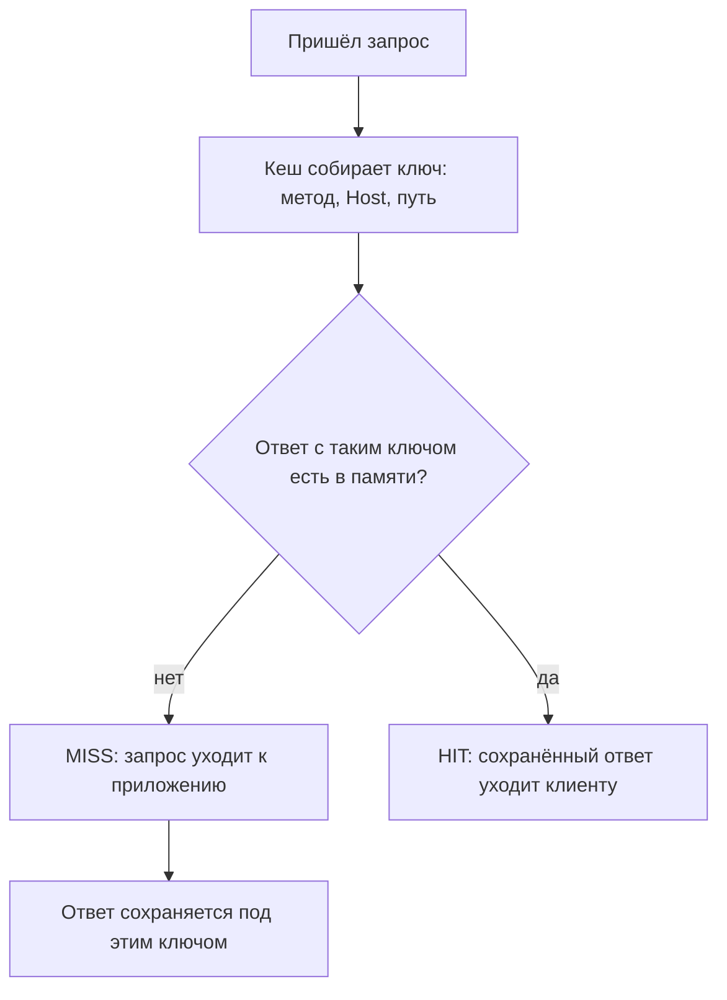
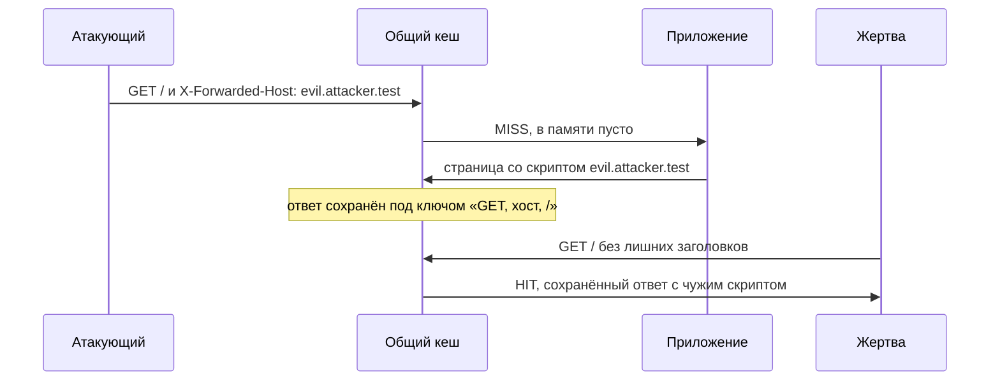

# Отравление и обман кеша

Утром атакующий отправил на сайт один запрос с лишним заголовком, а днём
каждый посетитель главной страницы загрузил скрипт с чужого сервера. Учебный
стенд темы показывает эту историю двумя строками:

```text
атакующий (MISS): src="https://evil.attacker.test/app.js"
жертва    (HIT):  src="https://evil.attacker.test/app.js"
```

Стенд помечает их словами `MISS` («в памяти не нашлось, ответ собран
приложением») и `HIT` («отдано из памяти кеша»).

Жертва не присылала ничего лишнего. Её запрос совпал с запросом атакующего
по тем полям, по которым кеш выбирает сохранённый ответ. Вредное значение
приехало в заголовке `X-Forwarded-Host`, а его в этот набор не внесли. Так
работает отравление кеша. У дефекта есть зеркальный близнец — обман кеша,
и работает он наоборот: не раздаёт вредное многим, а крадёт приватное у
одного. Как устроены оба дефекта и как их закрыть, разбирает эта тема.

## Как это работает

Что такое кеш, чем общий кеш отличается от приватного и где он стоит между
браузером и приложением, разбирает тема `app-architecture`. Здесь из её карты
нужен один механизм: как кеш решает, что два запроса одинаковы. На этом
решении и держится вся тема.

### Ключ кеша

Запросов к популярной странице много, и ответ у них один. Искать сохранённый
ответ сравнением запросов целиком нельзя: два обращения к одной странице
почти всегда различаются мелочами вроде порядка заголовков. Поэтому кеш
сравнивает не запросы, а их **ключ кеша** — короткий набор полей запроса,
собранный по заранее заданному правилу. Два запроса с одинаковым ключом кеш
считает одним запросом и отдаёт на оба один сохранённый ответ.

По умолчанию ключ складывается из метода и целевого URI — так задаёт стандарт
кеширования HTTP, RFC 9111 (§ 2). Заголовок `Host` входит в ключ как часть
URI, поэтому ответы разных сайтов в одном кеше не смешиваются.

Бытовой пример — пункт выдачи заказов, где покупку отдают по номеру
телефона: кто назвал номер, того и заказ. Номер здесь соответствует ключу,
заказ — сохранённому ответу. А имя покупателя и его внешность — поля,
которые в ключ не входят: выдающий их не сверяет. Аналогия ломается в одном
месте, и место это важное. В пункте выдачи содержимое заказа собрано заранее
и от покупателя не зависит. Ответ же собирает приложение, и собрать его оно
может с учётом любого поля запроса — в том числе такого, которого в ключе
нет.

### Неключевой ввод

Поля запроса, которых в ключ не внесли, называют **неключевым вводом**. При
выборе сохранённого ответа кеш их не видит вовсе: он не знает, что два
запроса различались. Единственный штатный способ добавить поле в ключ, не
перенастраивая кеш, — поле `Vary` в ответе. Оно перечисляет заголовки
запроса, от которых зависит ответ, и кеш расширяет ключ ровно на них. Его
механику разбирает тема `app-architecture`, а здесь важно следствие:
заголовок, не названный в `Vary` и не входящий в ключ, остаётся неключевым.

Метки `MISS` и `HIT` из вступления встретятся в прогонах ниже: по ним видно,
чей ответ получил клиент. Такие метки ставят и живые CDN, только своими
заголовками ответа.

**Откуда это взялось.** Чтобы попадать в кеш чаще, из ключа намеренно убирают
поля, которые на ответ вроде бы не влияют: чем короче ключ, тем больше
запросов он объединяет. Пока такое поле и вправду не влияет на тело, экономия
честная. Как только влияет — поле осталось неключевым, а ответ от него
зависит, — появляется щель между тем, что кеш различает, и тем, что меняет
ответ. На этой щели построены оба дефекта темы.



**Описание схемы.** Кеш работает с ключом, а не с запросом целиком, поэтому
неключевые поля на развилку не влияют: два запроса, различающиеся только ими,
пойдут одной дорогой. Промах отправляет запрос к приложению, и ответ оседает
в памяти. Попадание отдаёт клиенту сохранённый ответ, и приложение о запросе
не узнаёт.

**Зачем это в работе AppSec-инженера.** Оба дефекта всплывают на стыке кеша
и приложения, и ревью здесь требует знать, из чего собран ключ и как каждый
узел разбирает запрос. Тема даёт вопрос к каждому кешируемому маршруту. Что
входит в ключ, влияет ли на тело что-то за его пределами, одинаково ли кеш
и приложение понимают путь.

## Как это атакуют

У темы два дефекта, и работают они в противоположные стороны. Разберём оба
на учебном стенде: сначала тот, что раздаёт вредное многим, потом тот, что
крадёт приватное у одного.

### Отравление: один запрос — и чужой скрипт у всех

**Отравление кеша** — атака, при которой общий кеш сохраняет вредный ответ
под обычным ключом страницы и раздаёт его другим посетителям. Бытовой смысл
как у отравленного колодца: вред подмешали один раз, а разошёлся он всем,
кто пришёл за водой. Колодец здесь — общий кеш, вода — сохранённый ответ.

Стенд темы держит учебный общий кеш с ключом из метода, `Host` и пути.
Приложение вставляет в тело ответа значение заголовка `X-Forwarded-Host`,
которого в ключе нет. Почему приложение вообще читает этот заголовок,
разбирает тема `host-header-attacks`: фреймворки подставляют его в
абсолютные ссылки, когда сайт стоит за прокси.

```text
$ python e04-cache.py
=== А. отравление кеша неключевым заголовком ===
  атакующий (MISS): src="https://evil.attacker.test/app.js"
  жертва    (HIT):  src="https://evil.attacker.test/app.js"
  жертва получила отравленный ответ: True
  с заголовком в ключе, жертва (MISS): src="https://example.com…"
```

Разбор по шагам. Атакующий шлёт один запрос с подставленным
`X-Forwarded-Host`. Заголовок в ключ не входит, поэтому для кеша это обычный
запрос главной страницы: память пуста, запрос уходит к приложению. Приложение
честно собирает страницу, но адрес скрипта в ней берёт из заголовка. Кеш
сохраняет результат под обычным ключом страницы. Следующий посетитель просит
ту же страницу без всяких заголовков — его ключ совпадает, и он получает
`HIT` с чужим адресом скрипта в теле.

Последняя строка прогона показывает меру. Как только заголовок внесён в ключ,
запрос жертвы перестаёт совпадать с запросом атакующего, и она получает `MISS`
со своим честным ответом. Прогон сводит тему к одной строке: ответ зависел
от того, что кеш не различал.



**Описание схемы.** Атакующий говорит с кешем один раз, и его запрос доходит
до приложения. Ключ запроса не видит вредного заголовка, поэтому ответ
ложится в память под обычным ключом страницы. Жертва приходит после и до
приложения уже не добирается: кеш отдаёт ей сохранённый ответ атакующего.

Остаётся вопрос на подумать: достаточно ли для защиты переименовать заголовок
в свой, нестандартный? Ответ разбирается во втором вопросе самопроверки.

### Обман: приватная страница под видом статики

**Обман кеша** — зеркальная атака: тело ответа честное, но приватное, а в кеш
оно попадает потому, что кеш и приложение по-разному разбирают путь.
Кеширование чаще всего включают для статики, то есть файлов, одинаковых для
всех: стилей, скриптов, иконок. Правило при этом смотрит на расширение в
адресе (`.css`, `.js`, `.ico`) или на каталог. Приложение путь разбирает по
своим маршрутам, и два этих разбора можно рассорить.

Бытовой пример — письмо, на конверте которого написано «рекламная листовка»,
а внутри личная переписка. Архивариус кладёт его в общую папку с листовками,
и читать его может кто угодно. Конверт с надписью — это путь с окончанием
`.css`, содержимое — приватный ответ, архивариус — кеш, общая папка — общий
кеш. Аналогия подсказывает и меру: архивариус мог бы вскрыть конверт и
сверить содержимое с надписью. Защита ниже ровно это и делает.

```text
=== Б. обман кэша: приватная страница под видом .css ===
  жертва открыла (MISS):  ПРИВАТНО: carlos, баланс 4200
  атакующий забрал (HIT): ПРИВАТНО: carlos, баланс 4200
  приватные данные утекли из кэша: True
```

Ссылка `/account/123/wcd.css` для приложения с маршрутизацией в стиле REST
(Representational State Transfer, знакомом по теме `rest-and-graphql`) — это
профиль `/account/123`. Отвечает приложение на такой путь не потому, что так
устроен REST. Одни фреймворки сопоставляют путь по префиксу маршрута и
отбрасывают хвост, другие честно ответили бы, что страницы нет. Здесь первый
случай: лишний сегмент отброшен, и приложение отдаёт приватные данные
владельца. Кеш видит окончание `.css`, считает ответ статикой и сохраняет
его.

Атакующему остаётся заманить жертву по этой ссылке: её ответ
оседает в кеше, и атакующий читает его тем же запросом, уже из памяти. Тот же
приём работает на разделителях пути, которые один узел считает границей, а
другой нет: `;`, `.`, закодированный `%00` фреймворки разбирают по-разному.

### Чем отравление отличается от обмана

Это не одно и то же, и путать их на ревью нельзя. Отравление подсовывает
вредный ответ в кеш, чтобы его получили другие: оно раздаёт многим то, чего
они не просили. Обман заставляет кеш сохранить чужой приватный ответ, чтобы
его прочитал атакующий: он крадёт у одного то, что ему не предназначалось.
Первое похоже на подмену афиши на столбе, второе — на письмо в чужом
конверте. Защита у них общая по духу, но проверки разные, и ниже они собраны
отдельными пунктами.

## Как это выглядит в коде

Ревьюер ищет два признака: неключевой ввод, попавший в тело, и кеш-правило
по расширению поверх маршрутизации, которая расширение игнорирует. Оба
признака есть в этом фрагменте — найдите их до чтения выносок.

```python
# УЯЗВИМО — демонстрация, не для продакшена
def render_home(request):
    host = request.headers.get("X-Forwarded-Host", request.host)  # (1)
    return f'<script src="https://{host}/app.js"></script>'        # (2)

# Правило кеша: всё, что кончается на .css/.js/.ico, — статика.      # (3)
def cacheable(path):
    return path.endswith((".css", ".js", ".ico"))
```

1. Значение берётся из заголовка, которого нет в ключе кеша.
2. Неключевое значение попадает в тело — ответ теперь зависит от того, что
   кеш при выборе не различает.
3. Правило смотрит только на расширение; если маршрут отдаёт по такому пути
   приватную страницу, кеш сохранит её как статику.

## Как защититься

Защита собирается из пяти мер, и каждая закрывает свою щель из разбора выше.

- **Всё, что влияет на тело, входит в ключ — или не входит в тело.**
  Неключевой заголовок либо вносят в ключ, либо не пускают в ответ; оставлять
  его неключевым и влияющим на тело нельзя. Внести заголовок в ключ штатно
  умеет поле `Vary`: запрос жертвы перестаёт совпадать с запросом
  атакующего, что и показывает последняя строка прогона стенда.
- **Кеш хранит только ожидаемый тип содержимого.** Правило «всё на `.css` —
  статика» сверяют с типом ответа. Кешируется ответ с тем `Content-Type`,
  который правило и ждёт (ASVS v5.0-14.2.5). Приватный HTML под видом статики
  в кеш не попадает. Это архивариус, который вскрыл конверт.
- **Приватное не кешируется в общем кеше.** Ответы с данными пользователя не
  сохраняются в общих узлах — прокси, кешах приложения (ASVS v5.0-14.2.2). Им
  место в приватном кеше браузера или вовсе вне кеша.
- **Кеш и приложение разбирают путь одинаково.** Расхождение в разборе пути
  и разделителей закрывают согласованными правилами, а не оставляют на
  усмотрение двух узлов. Что приложение считает лишним сегментом, то и кеш
  обязан считать лишним.
- **Лишние неключевые заголовки отключают.** Заголовок, не нужный сайту, не
  поддерживают: нет входа — нет и отравления через него. Так
  `X-Forwarded-Host` выключают там, где сайт не стоит за прокси, который его
  ставит.

Та же пара в исправленном виде:

```text
# Псевдокод, не исполняется. Исправленный вариант.
def render_home(request):
    host = settings.PUBLIC_HOST                          # (1)
    return f'<script src="https://{host}/app.js"></script>'

def cacheable(path, response):
    return path.endswith((".css", ".js", ".ico")) \
        and response.content_type in EXPECTED            # (2)
```

1. Адрес скрипта берётся из конфигурации, а не из запроса: неключевой ввод
   из тела убран, и отравлять стало нечем. Это первая мера в варианте «не
   входит в тело».
2. Правило кеша проверяет и расширение, и тип ответа: приватная страница с
   типом HTML под видом `.css` в кеш не попадёт. Это вторая мера.

Пара различается с уязвимой минимально: изменены источник адреса и условие
кеширования, остальное на месте.

Какую из двух форм первой меры выбрать, решает экономика кеша. Каждое поле
в ключе дробит память: «страница с таким-то заголовком» и «страница без
него» хранятся отдельно, и попаданий становится меньше. Поэтому в ключ
вносят только то, что приложению действительно нужно в ответе. Всё остальное
из тела убирают: зависимости от ввода нет — нет и вопроса, внесён ли вход в
ключ.

Есть и нулевой вариант. Если общего кеша перед приложением нет вовсе, теме
браться неоткуда: отравлять и обманывать некого. Поэтому первая проверка на
ревью — само наличие общего узла: CDN или кеширующего прокси.

## Как убедиться, что защита работает

Проверка повторяет атаку, но смотрит теперь на то, что атака не проходит.
Повторите запрос с неключевым заголовком и посмотрите, меняется ли тело
ответа: не меняется — влияния нет, и отравлять нечего. Если тело меняется,
проверьте вторым обычным запросом, что изменённый ответ не достаётся из
кеша: в прогоне стенда этому исходу соответствует метка `MISS` в последней
строке. Для обмана составьте ссылку на приватный маршрут с добавленным `.css`
и посмотрите, попал ли ответ в кеш.

Отдельный вопрос — как найти неключевые входы, о которых вы не знаете.
Методика сводится к перебору: к обычному запросу по одному добавляют
заголовки, которые читают фреймворки и прокси, и сравнивают тело ответа с
эталоном. Изменилось тело — вход найден, и дальше решается, законно ли он
влияет на ответ. Этот перебор подробно описывают источники темы.

На ревью пройдите по списку.

1. Проверьте, что каждый заголовок, влияющий на тело ответа, входит в ключ
   кеша или не попадает в тело.
2. Проверьте, что кеш хранит ответы только с ожидаемым для маршрута типом
   содержимого.
3. Проверьте, что ответы с приватными данными пользователя не сохраняются
   в общем кеше.
4. Проверьте, что кеш и приложение разбирают путь и разделители по
   согласованным правилам.
5. Проверьте, что неключевые заголовки, не нужные сайту, отключены на кеше
   и на приложении.
6. Проверьте, что поле `Vary` покрывает все заголовки, от которых
   зависит тело ответа.

## Частая ошибка

Сначала ваш ответ. Если тело ответа зависит от заголовка, учтёт ли кеш это
сам и не смешает ли разные ответы?

Ответ «учтёт» звучит само собой, ведь кеш и правда не смешивает ответы
разных страниц. Но различает он их по ключу, а не по полям, влияющим на тело.
Всё за пределами ключа он при выборе ответа не видит. Два запроса,
различающиеся лишь неключевым заголовком, для кеша одинаковы, и второй
получит ответ, собранный для первого.

Заголовок, который влияет на тело, но в ключ не внесён, — это и есть щель
отравления. Поле `Vary` расширяет ключ на перечисленные в нём заголовки,
но ровно на них: заголовок, не названный в `Vary` и не входящий в ключ,
остаётся неключевым.

## Попробуй сам

Возьмите кешируемую страницу в своём или учебном приложении. Добавьте к
запросу неключевой заголовок, например `X-Forwarded-Host`, и посмотрите,
меняется ли тело ответа и попадает ли изменённый ответ в кеш. Отдельно
составьте ссылку на приватный маршрут с добавленным `.css` и посмотрите,
кешируется ли ответ.

Одна подсказка: сначала добейтесь, чтобы обычный запрос дважды подряд давал
ответ из кеша, и только потом добавляйте заголовок. Так будет виден сам
момент подмены.

**Критерий:** записано, влияет ли неключевой заголовок на тело и достаётся ли
изменённый ответ второму запросу с обычным ключом. Для ссылки с `.css`
записано, попал ли приватный ответ в кеш. Названо, чем закрыт каждый из двух
путей.

## Проверь себя

1. Приложение и кеш устроены так:

   ```python
   def key(req):
       return (req.method, req.host, req.path)

   def render(req):
       theme = req.headers.get("X-Theme", "light")
       return f'<html class="{theme}">'
   ```

   Атакующий первым прислал `X-Theme` со встроенным скриптом. Чей запрос
   получит этот ответ из кеша и почему?

2. Ответ главной страницы зависит от неключевого `X-Forwarded-Host`, кеш
   общий. Какую починку вы выберете?

   A. Ничего не менять: кеш сам учтёт, что тело зависит от заголовка, и не
      смешает разные ответы.

   B. Внести заголовок в ключ кеша полем `Vary` или не пускать его в
      тело вовсе.

   C. Переименовать заголовок в свой, нестандартный, о котором атакующий не
      догадается.

3. Почему обман кеша крадёт у одного, а отравление раздаёт многим?

4. Не запуская, предскажите, что получит второй запрос.

   ```python
   cache = {}

   def key(req):
       return (req["method"], req["host"], req["path"])

   def app(req):
       return f'src="https://{req.get("xfh", "example.com")}/app.js"'

   def send(req):
       k = key(req)
       if k not in cache:
           cache[k] = app(req)
           mark = "MISS"
       else:
           mark = "HIT"
       print(mark, cache[k])

   send({"method": "GET", "host": "example.com", "path": "/",
         "xfh": "evil.test"})
   send({"method": "GET", "host": "example.com", "path": "/"})
   ```

5. Возврат к теме `host-header-attacks`: почему `X-Forwarded-Host` — частый
   неключевой ввод для отравления?
6. Возврат к теме `app-architecture`: почему кеш и приложение вообще могут
   разойтись в разборе одного пути?

<details markdown="1">
<summary>Ответ 1</summary>

1. Каждый следующий посетитель той же страницы: ключ собран из метода, хоста
   и пути, а `X-Theme` в него не входит. Запрос жертвы совпадёт с ключом
   отравленной записи и получит `HIT` с чужим содержимым. Кеш различает
   ответы по ключу, а не по полям, влияющим на тело.

</details>

<details markdown="1">
<summary>Ответ 2: разбор вариантов</summary>

2. Верный ответ — B.

   A. Неверно: кеш учитывает только то, что входит в ключ, и два запроса,
      различающихся неключевым заголовком, для него одинаковы. Это ровно то
      представление, которое разбирает блок «Частая ошибка».

   B. Верно: `Vary` расширяет ключ на перечисленные заголовки, и запрос
      жертвы перестаёт совпадать с запросом атакующего. Вариант «не пускать
      в тело» снимает зависимость ответа от ввода вовсе.

   C. Неверно: переименование оставляет заголовок неключевым и влияющим на
      тело: щель та же, имя другое. Нестандартное имя перебирается словарём
      заголовков.

</details>

<details markdown="1">
<summary>Ответ 3</summary>

3. Отравление кладёт в кеш вредный ответ под обычным ключом страницы, и его
   получают все, чей запрос совпал с этим ключом. Обман заставляет кеш
   сохранить чужой приватный ответ под видом статики — и прочитать его
   приходит сам атакующий.

</details>

<details markdown="1">
<summary>Ответ 4</summary>

4. Отравленный ответ по `HIT`: второй запрос не несёт `xfh`, но ключ у него
   тот же.

   ```text
   $ python3 cache.py
   MISS src="https://evil.test/app.js"
   HIT src="https://evil.test/app.js"
   ```

   Это строки «А» стенда темы в миниатюре: ответ зависел от того, что кеш не
   различал. Стоит внести `xfh` в ключ — и второй запрос получает `MISS` со
   своим честным ответом.

</details>

<details markdown="1">
<summary>Ответ 5</summary>

5. Потому что фреймворки читают его по умолчанию и вставляют в тело —
   например, в абсолютную ссылку. В ключ кеша он обычно не входит, поэтому
   влияет на ответ, оставаясь невидимым для кеша.

</details>

<details markdown="1">
<summary>Ответ 6</summary>

6. Потому что путь разбирают два разных узла с разными правилами: приложение
   по своей маршрутизации, кеш по расширению или каталогу. Разделители и
   лишние сегменты они трактуют не одинаково.

</details>

## Источники

1. PortSwigger Web Security Academy, «Web cache poisoning»; реестр
   `ps-cache-poisoning`. Разделы: ключ кеша и неключевой ввод, поиск
   неключевых заголовков, отравление через них, условия попадания ответа в
   кеш.
   <https://portswigger.net/web-security/web-cache-poisoning>
2. PortSwigger Web Security Academy, «Web cache deception»; реестр
   `ps-cache-deception`. Разделы: отличие обмана от отравления, расхождение
   кеша и приложения в разборе пути, правила по расширению и каталогу,
   разделители пути.
   <https://portswigger.net/web-security/web-cache-deception>
3. IETF, RFC 9111 «HTTP Caching», STD 98; реестр `rfc9111-http-caching`.
   Разделы: § 1 «Introduction» — общий и приватный кеш; § 2 «Overview of
   Cache Operation» — состав ключа кеша; § 4.1 «Calculating Cache Keys with
   the Vary Header Field»; § 7.1 «Cache Poisoning» — расхождение разбора как
   вектор.
   <https://www.rfc-editor.org/rfc/rfc9111.html>

Каркас этапа: `owasp-asvs-5-document` (ASVS v5.0.0), `owasp-wstg-42`,
`owasp-top10-2025`. Наследуются всеми темами и отдельной строкой не
повторяются.

**Скоропортящийся слой.** Набор кешируемых расширений и то, какие заголовки
узлы кеша читают по умолчанию, — свойство конкретных CDN и прокси и меняется
с их настройками; модель ключа и неключевого ввода (RFC 9111 § 2, § 4.1)
стабильна.

**Маркеры уверенности.** Отравление общего кеша через неключевой
`X-Forwarded-Host`, его закрытие внесением заголовка в ключ и обман кеша с
приватной страницей под видом `.css` — **проверено лично** 2026-08-24 на
Python 3.14.7 (стенд `e04-cache.py`): жертва получает `HIT` с чужим адресом
скрипта; с заголовком в ключе — `MISS` и чистый ответ; приватный ответ
оседает в кеше и читается вторым запросом. Состав ключа кеша, роль `Vary` и
отравление как вектор — **по документации** (RFC 9111 § 2, § 4.1, § 7.1,
открыт лично 2026-08-24). Поиск неключевых входов, расхождение разбора пути
и разделители — **по документации** (страницы PortSwigger, открыты лично
2026-08-24). Поведение живых CDN на конкретных расширениях и разделителях
**не воспроизводилось**: сетевого узла кеша в стенде нет, показана его
модель.
