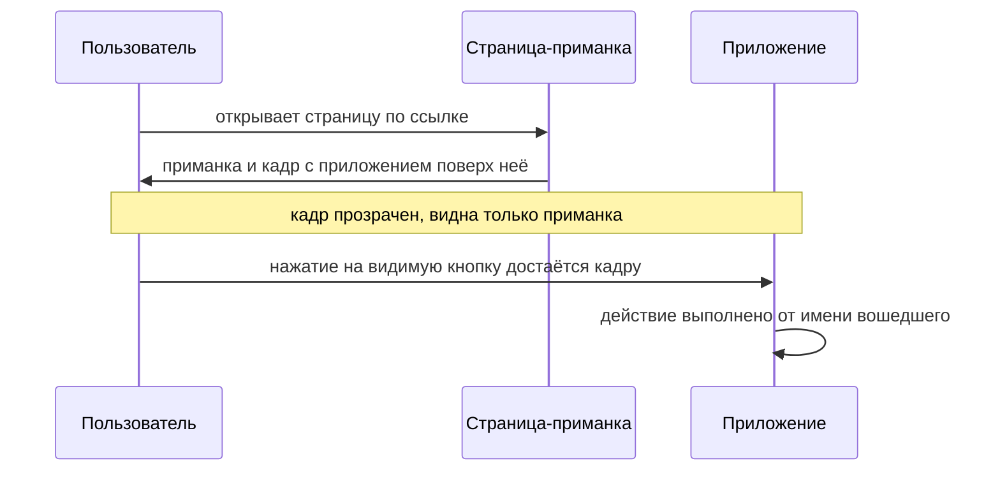

# Clickjacking

Речь о прогоне на стенде этой темы: чужая страница встроила приложение
невидимым кадром и положила поверх свою кнопку «Забрать приз». Пользователь
нажал на кнопку, которую видел, а нажатие досталось кнопке приложения, куда
он вошёл утром: счётчик в нём вырос на единицу. Тем же прогоном страница
попыталась прочитать документ кадра и получила отказ `SecurityError`, то
есть политика одного источника из темы `same-origin-policy` на месте.
Чтение запрещено, нажатие прошло. Этот зазор между двумя ответами браузера —
свойство самой платформы: так устроено встраивание. Атака, которая живёт в
этом зазоре, называется подменой нажатия, и защита от неё ставится
заголовком ответа.

## Что такое clickjacking

Clickjacking (подмена нажатия) — атака, при которой приложение встраивается
в чужую страницу, делается почти невидимым и накрывается приманкой.
Пользователь нажимает на то, что видит, а нажатие достаётся приложению, где
он уже вошёл. Второе имя атаки, UI redressing (переодевание интерфейса),
описывает то же самое с другой стороны: интерфейсу поменяли одежду, а
начинка осталась настоящей.

Кадр (элемент `iframe`) показывает одну страницу внутри другой, и сам по
себе он легален. Платёжная форма банка на сайте магазина и карта на странице
кафе живут именно так. Атака начинается, когда встраивание совмещается с
двумя приёмами оформления: кадр делают невидимым и кладут поверх
картинки-приманки.

Бытовой пример — витрина из двух стеклянных панелей. На задней панели
нарисована кнопка «получить приз», и её видно. Передняя панель прозрачна, и
на ней висит настоящая кнопка звонка охраны, которую не видно. Вы целитесь в
рисунок, а палец сначала касается передней панели, и нажатие фиксирует она.

| На витрине | На странице |
|---|---|
| Задняя панель с рисунком кнопки | Страница-приманка с видимой разметкой |
| Прозрачная передняя панель с настоящей кнопкой | Невидимый кадр с приложением |
| Палец касается передней панели раньше задней | Браузер отдаёт нажатие верхнему слою |

Где аналогия ломается. На витрине обе панели принадлежат одному хозяину, а в
браузере верхний слой — документ с чужого origin, и приманка не управляет
его содержимым. Прозрачность панели к тому же задаёт стекольщик, а
прозрачность кадра — одно свойство стиля.

**Зачем это в работе AppSec-инженера.** Проверка занимает один запрос:
смотрят заголовки ответа страницы, которая выполняет действия. Если
директивы о встраивании там нет, дефект есть, а починка — одна строка в
настройке сервера. Поэтому находка частая: искать её дёшево, и чинится она
одной строкой.

## Как это работает

**Откуда это взялось.** Кадр придумали, чтобы показывать чужой документ
внутри своего, и это рабочая задача до сих пор: платёжная форма, карта,
проигрыватель видео. Ограничивать встраивание было незачем, пока страницы
были документами. Когда страницы стали кабинетами с кнопками, выяснилось,
что показывать чужой интерфейс — значит распоряжаться тем, куда попадёт
нажатие пользователя. Разрешение осталось умолчанием платформы, поэтому
защита — это то, что нужно включать вручную.

### Как собирается наложение

Сборка атаки — это три свойства стиля, и каждое отвечает за своё. Свойство
`position: absolute` снимает кадр с его места в потоке документа и разрешает
положить его поверх другого элемента, как наклейку на стекло. Свойство
`z-index` решает, кто в стопке слоёв лежит выше: больше число — ближе к
зрителю. Свойство `opacity` задаёт прозрачность от 0 (невидимо) до 1
(полностью видно). Кадр с приложением ставят поверх приманки, поднимают его
слой и делают почти прозрачным. В прогоне темы стояло значение 0,05.
Пользователь видит приманку, а нажимает в кадр.



**Описание схемы.** Пользователь открывает страницу-приманку и получает от
неё разметку: видимую приманку и невидимый кадр с приложением поверх неё.
Нажатие на видимую кнопку браузер отдаёт верхнему слою, то есть кадру.
Приложение выполняет действие от имени вошедшего пользователя, потому что
запрос уходит с его сессией.

### Почему политика одного источника молчит

В теме `same-origin-policy` вы видели: политика одного источника запрещает
чужой странице читать содержимое кадра. Здесь важна вторая половина её
устройства: показывать кадр она разрешает. В прогоне темы оба факта стоят
рядом. Попытка страницы-приманки прочитать документ кадра дала отказ
`SecurityError` — политика работает. А нажатие по приманке дошло до кнопки
приложения, потому что атаке чтение не нужно. Приманке нужно, чтобы
пользователь нажал в известное место, а место она знает: адрес приложения
открыт, разметка его страницы тоже.

### Чем это не подделка запроса

Эту атаку путают с подделкой запроса (cross-site request forgery, CSRF), и
разница видна по одному вопросу: кто собирает запрос. При подделке запрос
целиком собирает атакующий: его страница сама отправляет в приложение
готовый запрос, а от пользователя нужно только быть вошедшим. Против неё
приложение ставит синхронизирующий токен — непредсказуемую метку, которую сервер
прячет в форму и ждёт обратно. Чужая страница метки не знает, и её запрос не
сойдётся. Подделке посвящён отдельный подраздел дальше по маршруту, здесь
важен только контраст.

При подмене нажатия запрос собирает само приложение. Нажатие приходит в
настоящую кнопку настоящей страницы, форма уходит со всеми своими значениями
и из своего origin. Всё, что проверяет сервер, сходится, потому что подделки
нет. Отсюда следствие, которое стоит запомнить: синхронизирующий токен от
подмены нажатия не защищает. Меняется только то, чего сервер не видит: кто и
на что на самом деле нажал.

### Надстройки над базовой схемой

Академия PortSwigger называет три надстройки над базовой схемой. Первая —
предзаполненная форма: значения подставляются в поля через строку запроса в
адресе кадра, и пользователю остаётся одно нажатие. Вторая — многошаговое
действие: несколько кадров подряд проводят пользователя по цепочке нажатий.
Третья — связка с XSS в DOM из темы `xss-dom`: адрес кадра несёт нагрузку, а
нажатие её запускает.

### Что уже мешает атаке

Одно ограничение появилось само, вместе с браузерными умолчаниями. В теме
`cookies` вы видели атрибут `SameSite`: в значениях `Lax` и `Strict` браузер
не прикладывает cookie к запросу, сделанному из кадра на чужом сайте. Атаке
нужен вошедший пользователь, а без cookie сессии приложение видит в кадре
гостя. Проверено прогоном: запрос за страницей приложения, встроенной кадром
с другого сайта, пришёл без cookie сессии. Атрибут `SameSite` на cookie при
этом не ставился вовсе — действовало умолчание браузера.

Границы у этого ограничения свои, и защитой оно не становится. Оно не
работает там, где действие не требует входа. Оно не работает, если cookie
помечена `SameSite=None`, а так помечают всё, что должно работать во
встраивании. И оно не работает, когда приманка лежит на том же сайте:
разные порты и разные поддомены одного домена — это один сайт. Требование
ASVS v5.0-3.3.2 смотрит на то же с другой стороны: значение `SameSite`
выбирается по назначению cookie, и в перечне угроз там названа именно
подмена интерфейса.

## Как это выглядит в коде

Ревьюер здесь смотрит на заголовки ответа, а не на разметку. Дефект в этой
теме — в замысле, а не в строке: приложение само разрешает себя встраивать,
поэтому искать надо отсутствие. Вот сервер с формой перевода. Найдите
в нём три вещи: где ставится политика содержимого, какие директивы в ней
есть и что отвечает страница с изменяющим действием.

```javascript
// УЯЗВИМО — демонстрация, не для продакшена
app.use((req, res, next) => {
  res.setHeader('Content-Security-Policy', "script-src 'self'");   // (1)
  next();
});

app.get('/transfer', (req, res) => {
  res.send(renderTransferForm());                                  // (2)
});
```

1. Политика содержимого есть, а директивы `frame-ancestors` в ней нет. Про
   встраивание политика молчит, а молчание здесь — разрешение.
2. Страница с изменяющим действием отдаётся без ограничения на встраивание.

Признаки дефекта такие:

- директивы `frame-ancestors` в политике нет;
- поле `X-Frame-Options` стоит как единственная мера;
- любая из двух записей сделана элементом `meta` в разметке, а не заголовком;
- в скриптах страницы живёт разрушитель кадра — скрипт, который выдёргивает
  страницу из чужого кадра;
- заголовок поставлен на части путей, а не на всех ответах.

Этот пример показывает: дефект здесь не строка кода, а отсутствие одной
директивы, и находится он не чтением листинга, а сверкой заголовков. Держите
вопрос напоследок. Страница входа того же приложения директивы тоже не
несёт. Дефект это или нет — и по какому признаку вы решили?

## Как защититься

Правило одно: встраивание запрещено по умолчанию, а разрешение выдаётся
поимённо и только там, где оно нужно. Тот же сервер после починки.

```javascript
// Исправлено.
app.use((req, res, next) => {
  res.setHeader('Content-Security-Policy',
    "script-src 'self'; frame-ancestors 'none'");                  // (1)
  next();
});

app.get('/widget', (req, res) => {
  res.setHeader('Content-Security-Policy',
    "script-src 'self'; frame-ancestors " +
    "https://partner.example.com");                                // (2)
  res.send(renderWidget());
});
```

1. Умолчание для всего приложения — «никому». Заголовок ставится на каждом
   ответе, а не на избранных путях.
2. Исключение выдано одному адресу и только той странице, которую встраивают
   по замыслу, — виджету для партнёра. Заголовок на ответе один, поэтому
   политика в нём перечислена целиком: иначе строка ниже затёрла бы
   `script-src` из первой выноски.

Директива `frame-ancestors` перечисляет, кому разрешено встраивать страницу:
значение `'none'` запрещает всем, `'self'` разрешает своему origin, список
адресов разрешает перечисленным. Это директива политики содержимого из темы
`security-headers`, поэтому пишется она в том же заголовке, рядом с
остальными директивами.

Поле `X-Frame-Options` — предшественник той же меры в виде отдельного
заголовка, и у него свои пределы. Рабочих значений два: `DENY` запрещает
встраивание вовсе, `SAMEORIGIN` разрешает своему origin. Значение
`ALLOW-FROM`, которое разрешало назвать адрес, устарело и не работает.
Списка адресов у поля нет, двух значений в нём не бывает, а вложенные кадры
со значением `SAMEORIGIN` ведут себя не так, как от них ждут. Требование
ASVS v5.0-3.4.6 просит `frame-ancestors` на каждом ответе и прямо называет
поле устаревшим.

Две ложные защиты нужно узнавать в лицо. Первая — запись элементом `meta` в
разметке: `<meta http-equiv="X-Frame-Options" content="deny">` не действует.
Решение о встраивании браузер принимает по заголовку ответа, до разбора
разметки, и элемент к этому моменту ещё не прочитан. Проверено прогоном:
страница с таким элементом встроилась в кадр без единого возражения
браузера.

Вторая — скрипт-разрушитель кадра (frame busting). Он проверяет, открыта ли
страница верхним окном, и уводит браузер на себя, если это не так. Академия
называет приём ненадёжным и показывает обход через атрибут `sandbox`. Этот
атрибут задаёт список разрешений для документа внутри кадра, и значение
`allow-scripts` из этого списка разрешает скрипты, но запрещает переход
верхнего окна — разрушитель обезврежен.

Прогон показал более сильную картину: в браузере
`HeadlessChrome/152.0.7977.42` разрушитель не сработал и без атрибута
`sandbox`. Присваивание адреса верхнему окну дало отказ `SecurityError`:
переход инициирован кадром, который не разделяет origin с целью и не получал
действия пользователя. Приём мёртв не только под `sandbox`, а вообще, и
полагаться на него нельзя тем более.

**Границы применимости.** Политику приходится задавать на каждой странице:
единого выключателя на весь сайт у директивы нет, её несёт каждый ответ.
Второе — заголовки правят промежуточные узлы, и прокси, вырезающий
заголовок, снимает защиту молча. Поэтому проверка делается по ответу,
дошедшему до браузера, а не по настройке сервера; этому посвящён раздел
«Как убедиться, что защита работает».

**Что не заменяет заголовок.** Атрибут `SameSite` ограничивает атаку, но не
закрывает её. Он бессилен там, где вход не нужен, где cookie помечена
`SameSite=None` и где приманка лежит на том же сайте. Скрипт-разрушитель
кадра защитой не считается вовсе.

Теперь вопрос из раздела про код: должна ли страница входа, которая сама
ничего не меняет, нести директиву? Должна, и стандарт отвечает без разбора:
директива нужна на каждом ответе. Заранее неизвестно, какая страница
окажется звеном чужой цепочки нажатий — вспомните многошаговую надстройку.
Дешевле закрыть встраивание везде, чем рассуждать, какая страница достаточно
важна.

## Как убедиться, что защита работает

Проверка делается по ответу, дошедшему до браузера, а не по записи в
настройке сервера. Промежуточный прокси мог вырезать заголовок по дороге, и
тогда защиты нет при правильной конфигурации. Сам запрос однострочный:
`curl -s -D- -o /dev/null https://app.example/account`. В ответе ищите
заголовок политики содержимого с директивой `frame-ancestors`.

Второй шаг — отрицательная проверка: защита, которой нечего остановить,
ничего не доказывает. Встройте страницу кадром в страницу на другом origin.
Для стенда сойдёт второй сервер на другом порту, потому что другой порт —
это другой origin. В прогонах темы и `frame-ancestors 'none'`, и
`X-Frame-Options: DENY` останавливали встраивание: браузер отказывался
показывать кадр и писал причину в консоль. Если кадр показался, защита не
дошла.

На ревью пройдите по списку.

1. Проверьте, что каждый ответ, отдающий документ, несёт директиву
   `frame-ancestors` политики содержимого (ASVS v5.0-3.4.6).
2. Проверьте, что умолчание директивы — `'none'` или `'self'`, а разрешения
   выданы поимённо и только страницам, которые встраивают по замыслу.
3. Проверьте, что директива задана заголовком ответа, а не элементом `meta`
   в разметке.
4. Проверьте, что защита не сведена к полю `X-Frame-Options`: оно устарело и
   не поддерживает списка адресов (WSTG-v42-CLNT-09).
5. Проверьте, что сессионные cookie имеют атрибут `SameSite` в значении,
   отвечающем назначению (ASVS v5.0-3.3.2).
6. Проверьте, что в страницах нет скрипта-разрушителя кадра, поставленного
   вместо заголовка.
7. Проверьте, что заголовок дошёл до браузера, а не только задан на сервере:
   промежуточные узлы его вырезают.

## Частая ошибка

Вопрос для начала: чем грозит приложению встраивание в чужую страницу, если
читать документ кадра та не может? Решите для себя до чтения дальше. Обычно
рассуждают так: политика одного источника не даёт чужой странице ничего
сделать с приложением в кадре, значит встраивание безопасно.

**Политика запрещает читать, а не показывать.** Цепочка ломается на первом
же звене: «не даёт ничего сделать» — это про чтение, а атаке нужно другое.
Чужая страница не увидит содержимого кадра, и ей это не нужно. Ей нужно,
чтобы пользователь нажал в известное место, а место она знает: адрес
приложения открыт, разметка его страницы тоже.

Контрпример был в самом начале темы. Чужая страница встроила приложение,
получила отказ `SecurityError` на чтении, и тем же прогоном нажатие по её
кнопке-приманке дошло до кнопки приложения. Оба результата в одном опыте:
чтение запрещено, нажатие прошло.

## Попробуй сам

Возьмите приложение, с которым работаете, и снимите заголовки ответа для
трёх его страниц: входа, кабинета и страницы, выполняющей изменяющее
действие. Подойдёт команда `curl -s -D-` из раздела «Как убедиться, что
защита работает» или вкладка Network в инструментах браузера. Выпишите для
каждой страницы, есть ли директива `frame-ancestors`, какое у неё значение и
стоит ли рядом поле `X-Frame-Options`.

Одна подсказка: смотрите ответы самих документов, а не скриптов и стилей, —
директива нужна там, где есть что встраивать.

**Критерий выполнения** наблюдаемый: три строки с заголовками и вывод, какая
из трёх страниц встраивается. Плюс одно предложение о том, что помешает
атаке на эту страницу, если директиву не добавлять, — и при каких условиях
перестанет мешать.

## Проверь себя

1. Страница-приманка:

   ```html
   <iframe src="https://bank.example/transfer"
           style="position:absolute; opacity:0.05; z-index:2"></iframe>
   <button style="position:absolute">Выиграть приз</button>
   ```

   Куда уйдёт нажатие по видимой кнопке и что при этом запретит политика
   одного источника?

2. Страница перевода встраивается в чужой кадр. Какую починку вы выберете?

   А. Скрипт-разрушитель: если страница не верхнее окно, увести верхнее окно
      на себя.

   Б. Директива `frame-ancestors 'none'` в политике содержимого на каждом
      ответе страницы.

   В. Запись `<meta http-equiv="X-Frame-Options" content="deny">` в разметке
      самой страницы.

3. Почему синхронизирующий токен этой атаке не мешает?

4. На сервере стоит такой обработчик:

   ```python
   class H(BaseHTTPRequestHandler):
       def do_GET(self):
           self.send_response(200)
           self.send_header("Content-Security-Policy",
                            "frame-ancestors 'none'")
           self.end_headers()
           self.wfile.write(b"<form>transfer</form>")
   ```

   Не запуская, предскажите, что вернёт `curl -i http://127.0.0.1:8902/transfer`
   и что это доказывает.

5. Возврат к теме `security-headers`: чем `frame-ancestors` лучше поля
   `X-Frame-Options`?

<details markdown="1">
<summary>Ответ 1</summary>

1. Нажатие уйдёт в кадр: он накрывает приманку сверху (`z-index`) и невидим
   (`opacity` близка к нулю). Политика одного источника запретит странице
   читать документ кадра — и только: показывать кадр она разрешает, а атаке
   чтение не нужно, нужно нажатие в известное место.

</details>

<details markdown="1">
<summary>Ответ 2 и разбор вариантов</summary>

2. Верный ответ — Б.

   А. Разрушитель мёртв и без обходов: прогон показал отказ `SecurityError`
      на присваивании адреса верхнему окну. А атрибут `sandbox` со значением
      `allow-scripts` обезвреживает его и там, где он ещё работал.

   Б. Директива действует до разметки: браузер отказывается показывать кадр
      и пишет причину в консоль. Требование ASVS v5.0-3.4.6 — на каждом
      ответе.

   В. Запись элементом `meta` не действует: решение о встраивании браузер
      принимает по заголовку ответа, до разбора разметки. Прогоном такая
      страница встроилась без возражений.

</details>

<details markdown="1">
<summary>Ответ 3</summary>

3. Подделки нет: запрос собирает настоящая страница приложения, со своим
   токеном и из своего origin. Всё, что проверяет сервер, сходится. Меняется
   только то, чего сервер не видит, — кто и на что на самом деле нажал.

</details>

<details markdown="1">
<summary>Ответ 4</summary>

4. `200 OK` и тело страницы: curl не встраивает ничего, и директива ему не
   мешает.

   ```text
   $ curl -s -D- http://127.0.0.1:8902/transfer
   HTTP/1.0 200 OK
   Content-Security-Policy: frame-ancestors 'none'

   <form>transfer</form>
   ```

   Защита решает вопрос встраивания в браузере, а не выдачу страницы:
   страница доступна всегда, встроить её в чужой документ браузер откажется.

</details>

<details markdown="1">
<summary>Ответ 5</summary>

5. Оно поддерживает список разрешённых адресов, задаётся одной политикой
   рядом с остальными директивами и не несёт устаревших значений вроде
   `ALLOW-FROM`.

</details>

## Источники

1. PortSwigger Web Security Academy, «Clickjacking (UI redressing)»; реестр
   `ps-clickjacking`. Разделы: What is clickjacking, How to construct a basic
   clickjacking attack, Clickjacking with prefilled form input, Frame busting
   scripts, Combining clickjacking with a DOM XSS attack, Multistep
   clickjacking, How to prevent clickjacking attacks, X-Frame-Options.
   <https://portswigger.net/web-security/clickjacking>
2. OWASP Top 10:2025, «A06:2025 Insecure Design»; реестр
   `owasp-top10-2025-a06`. Раздел: Mapped CWEs — CWE-1021.
   <https://owasp.org/Top10/2025/A06_2025-Insecure_Design/>
3. OWASP Clickjacking Defense Cheat Sheet; реестр
   `owasp-cs-clickjacking-defense`. Разделы: Defending with CSP
   frame-ancestors directive, Defending with X-Frame-Options Response
   Headers, Common Defense Mistakes, Limitations, Defending with SameSite
   Cookies.
   <https://cheatsheetseries.owasp.org/cheatsheets/Clickjacking_Defense_Cheat_Sheet.html>

Каркас этапа: `owasp-asvs-5-document` (ASVS v5.0.0), `owasp-wstg-42`,
`owasp-top10-2025`. Наследуются всеми темами и отдельной строкой не
повторяются.

**Скоропортящийся слой.** Умолчания браузеров по атрибуту `SameSite`
менялись и могут меняться дальше. Ограничения на переход верхнего окна из
кадра тоже задаются браузером и от версии к версии ужесточаются. Поле
`X-Frame-Options` объявлено устаревшим и постепенно уходит.

**Маркеры уверенности.** Поведение браузера — **проверено лично** 2026-08-24
в `HeadlessChrome/152.0.7977.42`: чужой origin встроил приложение в кадр;
попытка прочитать документ кадра дала `SecurityError`; нажатие по приманке
поверх кадра с прозрачностью 0,05 дошло до кнопки приложения; запрос за
страницей, встроенной кадром с другого сайта, пришёл без cookie сессии;
`frame-ancestors 'none'` и `X-Frame-Options: DENY` встраивание
останавливают; запись `X-Frame-Options` элементом `meta` не останавливает;
скрипт-разрушитель кадра дал `SecurityError` и с атрибутом `sandbox`, и без
него. Сборка атаки свойствами стиля, надстройки с заполнением формы и
многошаговым действием, обход разрушителя через `sandbox` — **по
документации** (Web Security Academy, открыта лично 2026-08-24). Пределы
поля `X-Frame-Options`, ошибка с элементом `meta`, границы защиты атрибутом
`SameSite` и вырезание заголовков прокси — **по документации** (Clickjacking
Defense Cheat Sheet, открыт лично 2026-08-24). Требования 3.4.6 и 3.3.2
сверены с текстом ASVS v5.0.0 (открыт лично 2026-08-24). Категория
`A06:2025` сверена со списком сопоставленных CWE страницы категории (открыта
лично 2026-08-24). Прогон ответа 4 повторён 2026-10-03 локально, Python
3.14.7 и curl 8.22.0: вывод совпал. Атака с заранее заполненной формой и
многошаговая лично **не воспроизводились**.
