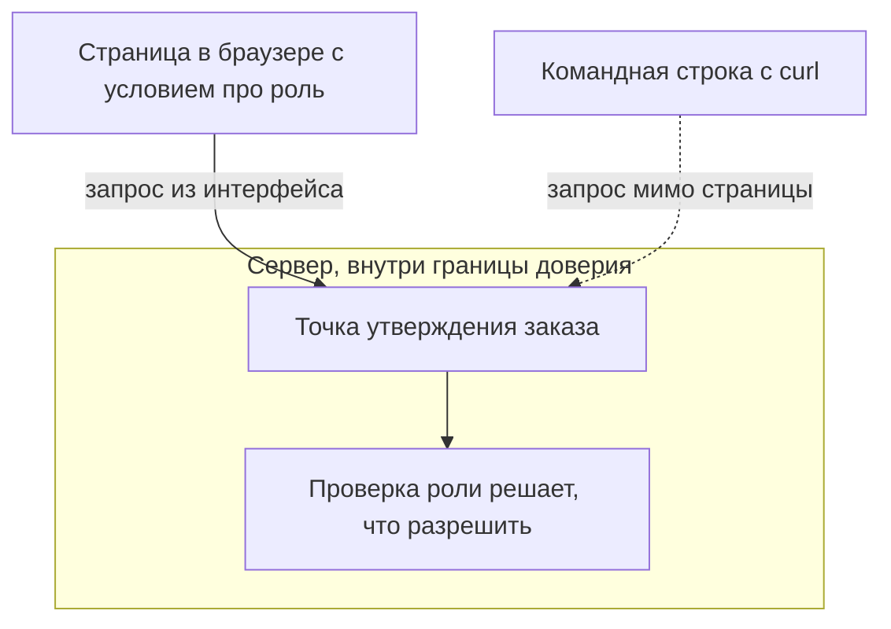
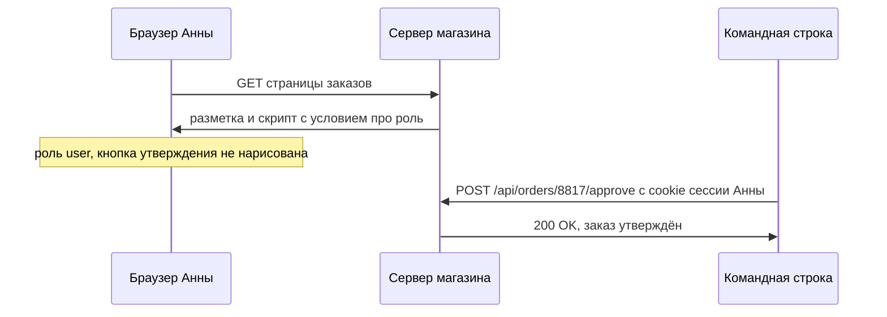

# Проверки доступа на клиенте

В магазине заказов есть кнопка «Утвердить», и рисует её скрипт страницы. Он
спрашивает у сервера профиль и проверяет условие `me.role === "manager"`. У
Анны роль `user`, поэтому кнопки она не видит. Адрес, куда кнопка отправляет
запрос, записан в том же скрипте, а скрипт браузер отдаёт каждому, кто открыл
страницу. Однажды Анна собирает запрос руками, без браузера, и отправляет его
на этот адрес со своей обычной сессией.

**Запрос**

```http
POST /api/orders/8817/approve HTTP/1.1
Host: shop.example.com
Cookie: session=b7Kd2
Content-Length: 0
```

**Ответ**

```http
HTTP/1.1 200 OK
Content-Type: application/json

{"id":8817,"status":"approved","approved_by":"anna"}
```

Сессия настоящая, роль в ней никто не менял, подписи и токены не подделаны.
Ничего не взломано. Запрос ушёл мимо страницы, а вместе со страницей — мимо
единственного условия про роль: оно жило в скрипте, который до сервера не
доезжает. Разница между «кнопки нет» и «действие запрещено» — предмет этой
темы.

## Что такое клиентская проверка доступа

Страница приложения рисуется в браузере, и код, который её рисует, уезжает
пользователю целиком: разметка, скрипты, ответы сети. Условие про роль или
право, поставленное в этом коде, называют клиентской проверкой доступа. Работа
у неё мирная: не показывать человеку кнопки, которые ему не нужны. Дефект
начинается там, где такое условие остаётся единственным, что стоит между
пользователем и функцией.

Бытовой пример — дверь склада в обычном магазине. На двери табличка «Только
для сотрудников», а замка нет. Соответствие такое.

| В магазине | В приложении |
|---|---|
| Табличка на двери склада | Условие про роль в скрипте страницы |
| Посетитель сам решает, подчиняться ли табличке | Браузер пользователя сам решает, выполнять ли условие |
| Замок, ключ от которого есть у персонала | Проверка роли на сервере |

Где аналогия ломается. К двери склада посетителю ещё нужно подойти, и охранник
его увидит. В вебе запрос собирается руками и уходит в обход самой страницы.
«Не подходить к двери» не выйдет: для запроса из командной строки никакой
двери нет вовсе.

Табличку при этом видит каждый. Атакующий читает всё, что попало в браузер:
разметку, скрипты, ответы сети, значения в хранилищах. Спрятать что-то в
клиентском коде нельзя в принципе: скрипт читается как инструкция, где
написаны и адрес закрытой точки, и признак, по которому её прячут.

Разница между двумя условиями не в коде, а в том, есть ли у клиентского
условия серверная пара. Кнопка, скрытая в интерфейсе, — работа над
интерфейсом, если сервер отказывает и без неё. Она же — весь контроль доступа,
если сервер не отказывает.

**Зачем это в работе AppSec-инженера.** Условие `if (me.role === "manager")` вы
писали сами, чтобы не рисовать кнопку тем, кому она не нужна. Условие про
интерфейс и условие про доступ выглядят одинаково, и второго на сервере может
не оказаться. Дефект живёт в разговоре, а не в коде: на ревью говорят «этого
пункта у обычного пользователя нет». Про интерфейс это правда, про сервер —
нет. Ревьюеру нужна не догадка, а один запрос, показывающий разницу.

## Как это работает

**Откуда это взялось.** Пока страницы собирались на сервере, вопрос не стоял.
Разметку и решение о доступе делал один код, и скрыть ссылку значило не отдать
её. Перенос отрисовки в браузер разделил эти два действия; четыре способа
рендеринга разбирает тема `app-architecture`. Клиент получил данные и правила
отрисовки, сервер остался с функциями, и решение «что показать» естественно
осталось на стороне, которая рисует. Ошибка в том, что вместе с ним туда
переехало решение «что разрешить», а эту сторону контролирует пользователь.

Тема `app-architecture` называет API границей доверия: всё, что приходит
снаружи, приложение обязано проверять. Код в браузере лежит по другую сторону
этой границы, потому что выполняется на машине, которой управляет
пользователь. Условие, не нарисовавшее Анне кнопку, стоит вне границы — и
потому ничего не решает.



**Описание схемы.** Сверху машина пользователя: страница и условие про роль,
которое решает только вопрос отрисовки. Снизу сервер с точкой утверждения и
проверкой роли. Запрос из интерфейса и запрос из командной строки приходят на
одну и ту же точку. Условия из верхней половины на пути второго запроса нет.

То же требование записано и в стандартах. ASVS, каталог требований OWASP к
приложениям, вы встречали в теме `cookies`. Пункт v5.0-8.3.1 требует применять
правила авторизации в доверенном слое службы и не опираться на средства,
которыми управляет недоверенный потребитель. JavaScript в браузере — как раз
такое средство.

OWASP Top 10 — каталог самых распространённых рисков веб-приложений, и его
первая категория A01:2025, «Broken Access Control», — про нарушения контроля
доступа. Она формулирует условие короче. Контроль доступа работает в
доверенном серверном коде — там, где атакующий не может изменить ни саму
проверку, ни данные для неё. Где условие не выполнено, проверка ничего не
решает.

## Как это атакуют

Атака начинается с чтения того, что и так отдали. Академия PortSwigger —
учебник от создателей перехватывающего прокси Burp Suite из темы
`tls-and-proxy` — показывает это на скрипте, который дорисовывает ссылку на
административную панель, если пользователь администратор. Ссылку обычный
пользователь не видит, но сам скрипт отдан всем — вместе с адресом панели
внутри. Прочитать скрипт значит узнать адрес.

Само описание A01:2025 приводит сценарий из двух строк. Приложение держит весь
контроль доступа во внешнем интерфейсе, и атакующий не может дойти до
`https://example.com/app/admin_getappInfo` из-за скрипта в браузере. Тогда он
выполняет `curl https://example.com/app/admin_getappInfo` из командной строки.
Скрипт остался в браузере, запрос ушёл без него. Заказ из начала темы утверждён
ровно этим ходом.



**Описание схемы.** Сервер отдаёт страницу и скрипт с условием про роль, и
браузер честно не рисует кнопку. Но проверка на этом кончается. Тот же запрос,
собранный в командной строке с той же cookie сессии, доходит до сервера и
выполняется: на сервере про роль никто не спрашивает.

Инструментов для атаки не нужно: достаточно любой программы, которая умеет
отправить HTTP-запрос. Протокол не различает, кто собрал байты запроса, —
браузер или curl; почему это так, разбирает тема `http-basics`.

## Как это выглядит в коде

Ревьюер ищет условие про роль или про право в коде, который уезжает клиенту.
Признак — само наличие сведений о правах в ответе, предназначенном для
отрисовки: если сервер присылает `isAdmin`, решение о том, что показать,
принимает клиент. Тот скрипт, который не нарисовал Анне кнопку, выглядит так.
Прежде чем читать выноски, найдите в нём оба условия про права и решите,
какому из них не хватает серверной пары.

```javascript
// УЯЗВИМО — демонстрация, не для продакшена
const me = await (await fetch("/api/me")).json();
if (me.isAdmin) {                              // (1)
  menu.append(link("/admin/users", "Пользователи"));
}
if (me.role === "manager") {
  showButton("approve", "/api/orders/approve"); // (2)
}
```

1. Условие про право стоит в браузере. Значение `isAdmin` приехало в ответе, и
   ответ виден пользователю целиком.
2. Адрес закрытой точки записан в скрипте, отданном всем. Скрывать его смысла
   нет, но и оставлять без серверной проверки нельзя.

Три обёртки выглядят защитой, но ею не работают:

- сборка, в которой обычным пользователям отдают бандл без административных
  модулей. Бандл — это собранный для браузера JavaScript, а точке на сервере
  всё равно, чей бандл про неё знает;
- проверка роли в маршрутизаторе одностраничного приложения: такой сторож
  решает, показывать ли экран, но точка API к экранам не относится;
- поле формы, отключённое атрибутом `disabled`: запрос можно собрать и без
  формы.

Все три меняют интерфейс, и ни одна не меняет того, что примет сервер.

Ложное срабатывание — то же условие `me.isAdmin`, когда серверная проверка
существует и найдена. Тогда клиентское условие — работа над интерфейсом, а не
контроль доступа, и трогать его незачем. Вывод о находке делается не по виду
условия, а по ответу сервера на прямой запрос.

Эти семь строк — граница доверия в действии: условие про право живёт по ту её
сторону, и сервер о его существовании не знает. А теперь вопрос, на который
пример не отвечает: исчезнет ли дефект, если вместо `me.isAdmin` скрипт станет
проверять подписанное сервером разрешение из того же ответа? Держите его в уме
до блока «Проверь себя».

## Как защититься

Правило умещается в одну строку, а работы требует на весь корпус кода: каждое
действие, скрытое в интерфейсе, проверяется на сервере отдельно.

```text
# Псевдокод, не исполняется. Исправленный вариант.
@app.post("/api/orders/<order_id>/approve")
def approve(order_id):
    require_role("manager")                  # (1)
    order = current_user.visible_orders.get_or_404(order_id)  # (2)
    return order.approve()
```

1. Решение о доступе принято на сервере, в доверенном слое: ни проверку, ни
   роль атакующий изменить не может.
2. Проверяется и право на объект: заказ обязан быть виден пользователю.
   Различие права на действие и права на объект разбирает тема
   `access-control-models`.

Клиентское условие при этом остаётся — оно и было уместно как работа над
интерфейсом. Меняется то, что оно перестаёт быть единственным: запрос из
начала темы теперь получает `403`, а кнопки у Анны по-прежнему нет.

**Границы применимости.** Приём закрывает решение о доступе и не закрывает
утечку сведений через сам интерфейс: список ролей, имена точек и структура
меню всё равно уезжают клиенту. Прятать их бессмысленно. Надежда на то, что
атакующий не догадается, называется безопасностью через неясность, и
PortSwigger относит сокрытие адресов именно к ней. Отдельная цена —
согласование: два условия про одно право стоят в двух слоях и расходятся при
правках. Дешевле отдавать клиенту готовый список разрешённых действий,
вычисленный сервером: тогда условие остаётся одно, серверное, и расходиться
нечему.

## Как убедиться, что защита работает

Проверка выполняется запросом, а не рассуждением. Возьмите сессию обычного
пользователя и отправьте запрос к закрытой точке мимо браузера. Ответ `403`
означает, что решение принимает сервер. Ответ `200` с данными означает, что
единственной проверкой был скрипт, и это находка.

Ниже исполняемый пример: сервер на стандартной библиотеке Python, который
утверждает заказ только для сессии менеджера. Прогнан 2026-10-03 локально,
Python 3.14.7 и curl 8.22.0.

```python
# Исполняемый пример: Python 3.14. Строка 8 — решение на сервере.
from http.server import BaseHTTPRequestHandler, HTTPServer

class H(BaseHTTPRequestHandler):
    def do_POST(self):
        if self.path != "/api/orders/8817/approve":
            self.send_response(404); self.end_headers(); return
        if "session=mgr-01" not in (self.headers.get("Cookie") or ""):
            self.send_response(403); self.end_headers()
            self.wfile.write(b'{"error":"manager role required"}')
            return
        self.send_response(200); self.end_headers()
        self.wfile.write(b'{"id":8817,"status":"approved"}')

    def log_message(self, *args):
        pass

HTTPServer(("127.0.0.1", 8931), H).serve_forever()
```

**Команды**

```bash
python3 srv.py &
curl -s -w '\nHTTP %{http_code}\n' -X POST -H 'Cookie: session=b7Kd2' \
  http://127.0.0.1:8931/api/orders/8817/approve
curl -s -w '\nHTTP %{http_code}\n' -X POST -H 'Cookie: session=mgr-01' \
  http://127.0.0.1:8931/api/orders/8817/approve
```

**Вывод**

```text
{"error":"manager role required"}
HTTP 403
{"id":8817,"status":"approved"}
HTTP 200
```

Первый ответ — починка из прошлого раздела, видимая на проводе: условие про
роль выполнил сервер, а не скрипт. Второй ответ — контроль: менеджеру функция
по-прежнему доступна, и защита не сломала рабочий сценарий.

На ревью пройдите по списку.

1. Проверьте, что каждое действие, скрытое в интерфейсе по роли, проверяется
   на сервере отдельным условием (ASVS v5.0-8.3.1).
2. Проверьте, что решение о доступе не опирается на значения, пришедшие от
   клиента, — роль, признак администратора, набор разрешений.
3. Проверьте, что адреса административных точек не считаются секретом и
   закрыты проверкой прав.
4. Проверьте, что запрос к закрытой точке в обход интерфейса отвергается:
   проверка выполняется командой, а не рассуждением.
5. Проверьте, что отключённые поля форм и скрытые пункты меню имеют серверную
   пару для каждого действия, которое они запускают.

## Частая ошибка

Поставьте себя на место получателя такой находки: каким будет ваш первый шаг?
Адрес `/api/orders/8817/approve` Анна не угадывала — она прочитала его в
скрипте. Первое, что приходит на такую находку, — сделать адрес
неугадываемым. Отсюда представление: административная функция закрыта, если
путь к ней нигде не показан, а имя маршрута угадать нельзя.

Сокрытие не закрывает доступ, потому что адрес утекает разными путями. Первый
— `robots.txt`, файл в корне сайта, где владелец перечисляет адреса, которые
просит не показывать в поисковой выдаче. Просьба адресована поисковым роботам,
а читает файл любой посетитель. Второй — скрипт, который строит интерфейс по
роли; в начале темы сработал именно он. Третий — подбор по словарю.

Контрпример PortSwigger: панель по адресу `/administrator-panel-yb556`
перебором не угадаешь. Но скрипт интерфейса содержит этот адрес и отдаётся
всем пользователям независимо от роли. Атакующему остаётся прочитать скрипт,
и неугадываемость имени перестаёт что-либо значить.

## Попробуй сам

Возьмите знакомое одностраничное приложение и найдите в его скриптах три
условия про роль или право. Для каждого повторите действие напрямую: соберите
запрос без браузера и посмотрите на ответ сервера.

Одна подсказка: ищите условия не по слову `role`, а по ответу точки профиля —
все признаки прав, которые приложение отдаёт клиенту, лежат там.

**Критерий выполнения** наблюдаемый: для каждого из трёх условий записан
запрос, ответ сервера и вывод — проверка на сервере есть или её нет. Ответ с
кодом `403` засчитывается, ответ `200` с данными — находка.

## Проверь себя

1. Сторож маршрутов одностраничного приложения:

   ```javascript
   router.beforeEach((to, from, next) => {
     if (to.path === "/billing" && !store.user.canBill) {
       return next("/");
     }
     next();
   });
   ```

   Что этот сторож решает и что произойдёт при запросе
   `curl http://app.example/api/billing`, отправленном мимо браузера?

2. Заказ Анны утверждён прямым запросом к `/api/orders/8817/approve`, и вся
   проверка жила в скрипте интерфейса. Какую починку вы выберете?

   А. Убрать адрес точки из скрипта и сделать его неугадываемым: что не
      показано, то не вызовут.
   Б. Проверять роль на сервере в самом обработчике `approve`, а клиентское
      условие оставить как работу над интерфейсом.
   В. Собирать обычным пользователям отдельный бандл без административных
      модулей, чтобы кода проверки у них не было вовсе.

3. Почему дефект не исчезает, если вместо `me.isAdmin` скрипт проверяет
   подписанное сервером разрешение из того же ответа?

4. Приложение держит контроль доступа в интерфейсе; сервер устроен так:

   ```python
   from http.server import BaseHTTPRequestHandler, HTTPServer

   class H(BaseHTTPRequestHandler):
       def do_GET(self):
           if self.path == "/api/me":
               body = b'{"id":7,"name":"anna","isAdmin":false}'
           elif self.path == "/admin/users":
               body = b'[{"name":"root"}]'  # проверки нет: её рисовал скрипт
           else:
               self.send_response(404); self.end_headers(); return
           self.send_response(200); self.end_headers()
           self.wfile.write(body)

   HTTPServer(("127.0.0.1", 8901), H).serve_forever()
   ```

   Не запуская, предскажите, что вернёт `curl http://127.0.0.1:8901/admin/users`.

5. Возврат к теме `app-architecture`: на каких узлах цепочки решение о доступе
   принимать законно, а на каких нет?
6. Возврат к теме `http-basics`: почему запрос, собранный без браузера, для
   сервера ничем не помечен?

<details markdown="1">
<summary>Ответ 1</summary>

1. Сторож решает, что нарисовать: он закрывает экран `/billing`, а не функцию.
   Точка `/api/billing` к маршрутизатору интерфейса не относится, и запрос curl
   идёт к серверу напрямую. Что ответит сервер, решает серверная проверка; если
   её нет, сторож не помеха.

</details>

<details markdown="1">
<summary>Ответ 2 и разбор вариантов</summary>

2. Верный ответ — Б.

   А. Сокрытие не закрывает доступ: адрес утекает из `robots.txt`, из скрипта,
      строящего меню по роли, из подбора по словарю. Контрпример раздела
      «Частая ошибка» — панель `/administrator-panel-yb556`, чей адрес отдан
      всем внутри скрипта интерфейса.
   Б. Решение о доступе переезжает в доверенный слой: ASVS v5.0-8.3.1 требует
      применять правила авторизации там, где атакующий не может изменить ни
      проверку, ни данные для неё. Условие в браузере остаётся, но перестаёт
      быть единственным.
   В. Сборка без модулей меняет интерфейс и не меняет того, что примет сервер:
      точка принимает запросы независимо от того, чей бандл про неё знает.

</details>

<details markdown="1">
<summary>Ответ 3</summary>

3. Подпись делает доверенными данные, а решение по-прежнему принимает
   недоверенная сторона: скрипт выполняется в браузере, и его вместе с
   условием можно пропустить целиком. Подписанное разрешение годится как вход
   для серверной проверки, а не как её замена.

</details>

<details markdown="1">
<summary>Ответ 4</summary>

4. Сервер вернёт список пользователей: проверки роли в обработчике нет, её
   рисовал скрипт, а скрипт в этом запросе не участвует.

   ```text
   python3 srv.py &
   curl -s http://127.0.0.1:8901/admin/users
   [{"name":"root"}]
   ```

   Это третий сценарий описания A01:2025: контроль остался во внешнем
   интерфейсе, и двух строк — скрипта и curl — хватило, чтобы его обойти.

</details>

<details markdown="1">
<summary>Ответ 5</summary>

5. Законно на сервере приложения и на шлюзе, который атакующий не обходит.
   Незаконно в браузере и в любом узле, к которому запрос может не прийти:
   решение, принятое на обходимом узле, обходится вместе с ним.

</details>

<details markdown="1">
<summary>Ответ 6</summary>

6. Сервер видит байты запроса, а не программу, которая их собрала: протокол
   не различает браузер и curl. Клиент — чужая машина, и всё присланное с неё,
   включая выполненный на ней скрипт, стоит по ту сторону границы доверия.

</details>

## Источники

1. OWASP Top 10:2025, «A01:2025 Broken Access Control»; реестр
   `owasp-top10-2025-a01`. Разделы: Description, How to prevent, Example attack
   scenarios (сценарий 3).
   <https://owasp.org/Top10/2025/A01_2025-Broken_Access_Control/>
2. PortSwigger Web Security Academy, «Access control vulnerabilities and
   privilege escalation»; реестр `ps-access-control`. Разделы: Unprotected
   functionality, Parameter-based access control methods, How to prevent access
   control vulnerabilities.
   <https://portswigger.net/web-security/access-control>
3. OWASP ASVS 5.0.0, раздел V8 Authorization; реестр `owasp-asvs-5-document`.
   Разделы: V8.3 Operation Level Authorization.
   <https://github.com/OWASP/ASVS/raw/v5.0.0/5.0/OWASP_Application_Security_Verification_Standard_5.0.0_en.pdf>

Каркас этапа: `owasp-asvs-5-document` (ASVS v5.0.0), `owasp-wstg-42`,
`owasp-top10-2025`; якорь подраздела: `owasp-cs-authorization`. Наследуются
всеми темами и отдельной строкой не повторяются. Две сноски выше — из
наследуемых: тема стоит целиком на них, и умолчать об этом значило бы оставить
утверждения без адреса. Первая сноска — отдельная запись реестра на главу
A01:2025, а не на оглавление издания.

**Скоропортящийся слой.** Издание Top 10 датировано 2025 годом, номера
категорий меняются от издания к изданию. Страница Web Security Academy — живая
платформа без даты.

**Маркеры уверенности.** Условие «контроль доступа работает только в
доверенном серверном коде» и сценарий обхода через `curl` — **по документации**
(страница A01:2025, открыта лично 2026-08-23). Утечка адреса через скрипт
интерфейса и оценка сокрытия как безопасности через неясность — **по
документации** (Web Security Academy, открыта лично 2026-08-23). Требование
8.3.1 сверено с текстом ASVS v5.0.0 (открыт лично 2026-08-23). Прогон раздела
«Как убедиться, что защита работает» выполнен 2026-10-03 локально, Python
3.14.7 и curl 8.22.0: вывод приведён дословно. Аналогия с дверью склада
отдельным источником не подкреплена. Листинги интерфейса и исправленного
обработчика не запускались; сервер из ответа 4 блока «Проверь себя» не
запускался.
