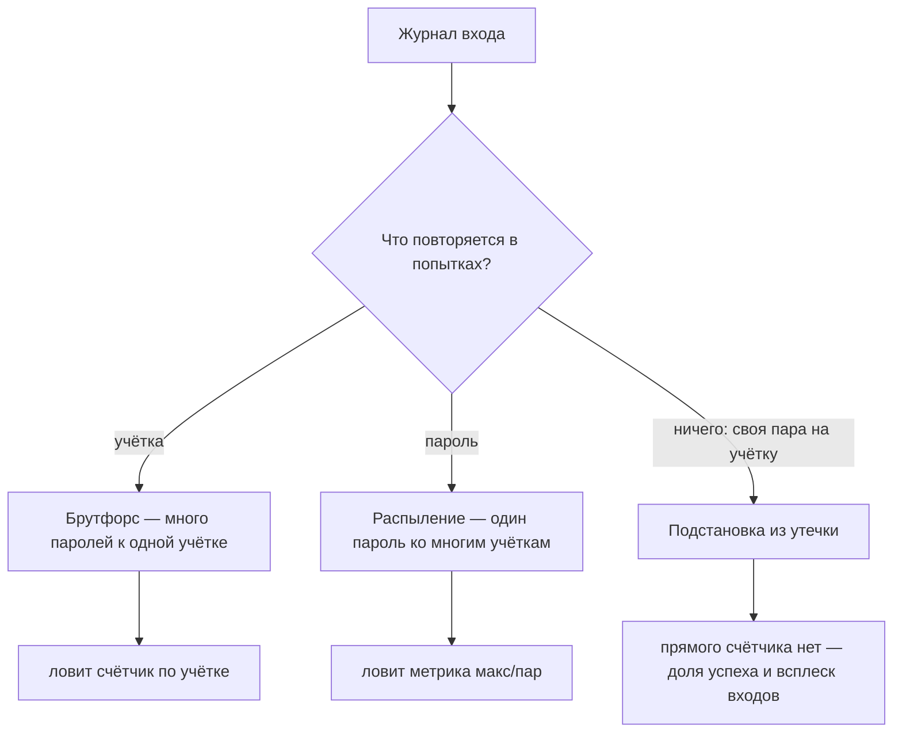

# Password spraying и credential stuffing

Ночь. В журнале входа учебного приложения четыреста попыток за двадцать
минут, и пять из них закончились чужим входом. Счётчик блокировки за ночь
не сработал ни разу: он поставлен на пять неудач по одной учётке, а здесь
каждая учётка получила ровно одну попытку. Атакующий пароли не подбирал:
он пробовал готовые пары «логин и пароль», украденные с другого сайта, и
рассчитывал, что кто-то использует пароль повторно. Такая подстановка —
одна из трёх атак на живой вход, и вот все три, смоделированные на стенде
этой темы:

```text
атака                      | макс/уч | паролей | макс/пар | успех
брутфорс одной учётки      |     500 |     500 |        1 |  0.0%
распыление пароля          |       1 |       1 |     1000 |  0.2%
подстановка учётных данных |       1 |     400 |        1 |  1.2%
```

Колонки читаются так: «макс/уч» — максимум попыток по одной учётке,
«паролей» — сколько разных паролей прошло, «макс/пар» — максимум одним
паролем, «успех» — доля вошедших. Строку распыления читайте так:
один пароль против тысячи учёток, по попытке на каждую, и счётчик по
учётке не дошёл до порога ни разу. Это не сбой защиты, а другая цель
атаки: не подобрать пароль к конкретной учётке, а войти в любую
поддавшуюся.

## Как это работает

**Откуда это взялось.** Люди используют пароли повторно: один и тот же
пароль стоит на почте, в магазине и на форуме. Бытовой образ — один ключ от
квартиры, офиса и дачи: потерял связку, и открыты все три двери. Граница
образа: ключ хранится у вас одном, а пароль — на каждом сайте, поэтому
утечка одного сайта выдаёт все остальные.

Когда очередной сайт взламывают, его база паролей уходит в продажу, и
таких баз накоплены миллионы пар. Атакующему незачем перебирать пароль к
одной учётке, если можно пробовать готовые пары против многих сайтов и
брать те учётки, где пароль повторён. Счётчик, придуманный против перебора
одной учётки, эту атаку не видит, потому что по каждой учётке приходит
одна попытка.

Cheat Sheet OWASP разводит три атаки на живой вход. Первая — **брутфорс**,
перебор многих паролей к одной учётке. Он разобран в теме
`brute-force-defense`, и там же живёт его бытовой образ: перебор кодов
домофона одного подъезда. Вторая — **распыление пароля** (password
spraying): один частый пароль вроде «spring2024» пробуют против многих
учёток, по одной попытке на каждую. Образ с домофоном переворачивается:
вместо тысячи кодов к одной двери один ходовой код к тысяче дверей.
Граница образа: код домофона один на подъезд, а пароль у каждой учётки
свой, поэтому поддаётся не каждая дверь, а доля.

Третья — **подстановка учётных данных** (credential stuffing): пары из
чужой утечки, и каждая пробуется один раз. Бытовой образ — чужая связка
ключей с адресами на бирках: подбирать ничего не нужно, достаточно дойти
до двери и повернуть ключ. Граница образа: в жизни один ключ не открывает
чужие замки, и образ работает ровно потому, что человек сам ставит один
«ключ» на разные «двери». Расчёт атаки на повторное использование: если
пара от почты подошла к магазину, взламывать сам магазин не пришлось вовсе.

Снаружи три атаки выглядят одинаково, потому что виден один поток отказов
на странице входа. Различить их помогает форма следа в журнале, и Cheat
Sheet предлагает считать четыре величины:

- **макс/уч** — наибольшее число попыток по одной учётке.
- **паролей** — сколько разных паролей прошло через вход.
- **макс/пар** — наибольшее число попыток, сделанных одним паролем.
- **макс/IP** — наибольшее число попыток с одного адреса.

Отдельная колонка таблицы — доля успеха: она показывает, сколько попыток
закончились входом. У каждой атаки выстреливает своя величина, и по ней
атака узнаётся, даже когда отказов много у всех трёх.

**Зачем это в работе AppSec-инженера.** «Есть защита от брутфорса» не
значит «закрыты распыление и подстановка»: у них другой профиль. Ревьюер
смотрит, по какому ключу считает защита, и сверяет с тем, как выглядит
каждая из трёх атак. Сильнейший общий слой — второй фактор, а не счётчик,
и это тоже приходится обосновывать числом, потому что без числа довод не
работает.

## Как это атакуют

Прогон (`.smgr/appsec-stage1-auth/exp/e08-logsignature.py`, Python 3.14.7)
моделирует три атаки против одного приложения и считает по журналу те
величины, по которым Cheat Sheet предлагает их различать:

```text
атака                      | макс/IP | макс/уч | паролей | макс/пар | успех
брутфорс одной учётки      |       2 |     500 |     500 |       1 |  0.0%
распыление пароля          |       4 |       1 |       1 |    1000 |  0.2%
подстановка учётных данных |       2 |       1 |     400 |       1 |  1.2%
```

Брутфорс бьёт по одной учётке многими паролями, поэтому у него
выстреливают «макс/уч» и «паролей», обе по пятьсот. Распыление идёт одним
паролем, и колонка «паролей» равна единице. Учёток при этом тысяча, по
одной попытке на каждую, поэтому «макс/уч» тоже единица, зато один пароль
пробуют на всех, и «макс/пар» взлетает до тысячи. Подстановка несёт на
каждую учётку свою пару из утечки: разных паролей четыреста, а «макс/пар»
снова единица, потому что пары не повторяются.

Колонка «макс/IP» низкая у всех трёх, и это не случайность, а свойство
атаки: адрес источника атакующий выбирает сам. У подстановки
распределённость — норма, потому что инструменты гоняют запросы через
прокси-сети. Прокси-сеть — это тысячи арендованных посредников, чьи адреса
принадлежат жилым провайдерам, и каждая попытка выходит в сеть с нового
адреса. Защита, считающая по адресу, против такой подачи слепа: каждый её
счётчик получает по одной попытке.

Отсюда видно, почему счётчик не спасает. Счётчик по учётке из темы
`brute-force-defense` молчит на распылении и подстановке, потому что там на
учётку одна попытка. Счётчик по адресу молчит на любой из трёх атак, если
она распределена. Cheat Sheet прямо называет блокировку по адресу не
основной защитой: её обходят сменой адреса.

Хуже всего с подстановкой: её не выдаёт ни одна прямая величина. Брутфорса
выдаёт «макс/уч», распыление выдаёт «макс/пар», а у подстановки и по
учётке, и по паролю стоит единица. Её признак косвенный: доля успеха выше
фоновой, то есть выше обычной доли успешных входов живых пользователей,
плюс всплеск входов на многих учётках сразу. В прогоне подстановка дала
1,2 % успеха при нуле у брутфорса, потому что часть пар из утечки совпала
с живыми учётками.



**Описание схемы.** Схема читается сверху вниз. Журнал входа разбирается
одним вопросом: что повторяется в попытках. Если повторяется учётка, это
брутфорс, и его видит счётчик по учётке. Если повторяется пароль, это
распыление, и его видит метрика «макс/пар». Если не повторяется ничего, это
подстановка: у каждой учётки своя пара из утечки. Прямого счётчика против
неё нет, и остаются доля успеха и всплеск входов.

## Как это выглядит в коде

Здесь дефект не в строке, а в выборе защиты. Признак — счётчик под перебор
одной учётки как единственная мера. До чтения выносок решите, какие из трёх
атак темы этот код не увидит.

```python
# УЯЗВИМО — демонстрация, не для продакшена
def login(user, password):
    if fails[user] >= 5:                 # (1)
        return deny("too many attempts")
    if verify(user, password):
        fails[user] = 0
        return grant_session(user)
    fails[user] += 1                     # (2)
    return deny("invalid")
```

1. Единственная защита — счётчик по учётке. Против распыления и подстановки
   он молчит: по каждой учётке одна попытка.
2. Ни проверки пароля по списку утёкших, ни второго фактора, ни метрик по
   объёму. Атака, размазанная по учёткам, проходит целиком.

Признаки такие. Счётчик по учётке или адресу как единственная мера. Пароли
не сверяются со списком скомпрометированных. Многофакторной аутентификации
(multi-factor authentication, MFA) нет даже для администраторов. Нет метрик
объёма по входу, по которым видно распределённую атаку. Блокировка по
адресу без учёта прокси-сетей.

## Как защититься

Cheat Sheet ставит меры слоями, и первый слой — второй фактор.

- **Второй фактор.** MFA добавляет ко входу то, что у пользователя есть,
  например код из приложения на телефоне. Украденный пароль от этого
  теряет цену: одной пары из утечки уже мало. По анализу Microsoft,
  который приводит Cheat Sheet, MFA остановил бы около 99,9 % захватов
  учётных записей. Это порядок величины, а не измерение на вашем
  приложении. Где сплошной MFA невозможен, его требуют хотя бы для
  администраторов (ASVS v5.0-6.3.3), а потоки фактора и их обходы разбирает
  тема `mfa-bypass`.
- **Список утёкших паролей.** При регистрации и смене пароль сверяется с
  базой скомпрометированных, собранной из публичных утечек, и совпадение
  отправляет пароль на замену (ASVS v5.0-6.2.12). Мера убирает те самые
  пары, на которых держится подстановка. Тема `password-storage` отвечает
  за другую сторону вопроса: как хранить свой пароль, а здесь речь о том,
  как не принять чужой утёкший.
- **Метрики объёма.** Каждый слой даёт счётчик обнаруженного и отражённого.
  По ним видно распределённую атаку, невидимую одному счётчику: всплеск
  отказов на тысяче учёток читается как атака, а не как массовая
  забывчивость пользователей.
- **Ограничение и CAPTCHA по риску.** Не один предсказуемый порог, а
  градуированный ответ: замедление, затем CAPTCHA — тест «человек или
  машина» из темы `brute-force-defense`, — затем блокировка. Оценка риска
  учитывает всплески частоты, происхождение адреса (хостинг против жилого)
  и географию.

Отдельный приём — повышение требования, или step-up (ASVS v5.0-8.2.4).
Обычный вход идёт по паролю, а вход с нового устройства, адреса или страны
поднимает планку до второго фактора. Бытовой образ — банк, который
показывает баланс по паролю, а на перевод с нового телефона спрашивает код.
Граница образа: подозрительность там решает банк, а в приложении правила
step-up пишет команда, и их видно в коде.

Порядок вызова слоёв виден на исправленном наброске:

```python
# Направление фикса — слои, а не одна строка.
def login(user, password, ctx):
    require_rate_and_captcha_by_risk(ctx)       # (1)
    if not verify(user, password):
        record_metric("auth.fail", ctx); return deny("invalid")
    if breached(password):                      # (2)
        return force_reset(user)
    if risky(ctx):                              # (3)
        return step_up_mfa(user)
    return grant_session(user)
```

1. Ограничение и CAPTCHA включаются по оценке риска запроса, а не жёстким
   порогом по адресу.
2. Пароль из утечки уходит на принудительный сброс, даже если он верный.
3. Подозрительный контекст отправляет вход на второй фактор.

Этот набросок — не новая мера, а порядок вызова уже названных слоёв:
оценка риска до проверки пароля, список утёкших после неё, повышение по
контексту. Подстановку, мимо которой прошёл счётчик из уязвимого варианта,
здесь ловят строки с выносками (2) и (3). Украденный пароль уходит на
сброс, а вход без второго фактора останавливает контекст.

## Как убедиться, что защита работает

Защита от трёх атак проверяется тремя же атаками на стенде. Прогоните
против защищённого входа брутфорс одной учётки, распыление одного пароля
на десяток учёток и подстановку пар из тестового списка и запишите, что
отразил каждый слой. Брутфорс обязан упереться в счётчик, распыление —
поднять метрику объёма, а учётку с паролем из списка ждёт принудительный
сброс. Вход с нового устройства обязан потребовать второй фактор.

Отдельно смотрите на молчание. Если распыление прошло без единой записи в
метриках, мониторинга атаки нет, даже когда блокировки срабатывали: защита
отразила перебор и не заметила распыление.

На ревью пройдите по списку.

1. Проверьте, что защита рассчитана не только на перебор одной учётки, но и
   на распыление и подстановку (ASVS v5.0-6.3.1).
2. Проверьте, что пароли проверяются по списку скомпрометированных при
   регистрации и смене (ASVS v5.0-6.2.12).
3. Проверьте, что второй фактор доступен и обязателен хотя бы для
   административных учётных записей (ASVS v5.0-6.3.3).
4. Проверьте, что блокировка по адресу не единственная мера и учитывает
   прокси-сети и распределённый трафик.
5. Проверьте, что каждый защитный слой даёт метрику объёма для обнаружения
   распределённой атаки.
6. Проверьте, что подозрительный вход (новое устройство, адрес, страна)
   поднимает требование до второго фактора (ASVS v5.0-8.2.4).

## Частая ошибка

Ответьте для себя до разбора: блокировка после нескольких неудач закрывает
весь перебор или его часть?

Порог выглядит полным ответом: заблокировал после пяти неудач, и перебор
закрыт.

**Она закрывает перебор одной учётки, а не подстановку и распыление.** У
этих двух по каждой учётке одна попытка, и счётчик по учётке до порога не
доходит. Распределённые по адресам, они проходят и мимо счётчика по адресу.
Сбой — в чтении молчания: порог срабатывает на переборе в лоб, а его
молчание на распылении читается как отсутствие атаки, а не как слепота
ключа.

Контрпример из прогона. Приложение с блокировкой по учётке после пяти
неудач пропустило распыление: один пароль против тысячи учёток дал два
входа и ноль блокировок. По каждой учётке была ровно одна попытка, и порог
не сработал ни разу.

## Попробуй сам

Возьмите журнал входов приложения, с которым работаете, или учебный
журнал. Посчитайте на атаку четыре величины из темы: попыток с одного
адреса, попыток по одной учётке, число разных паролей, попыток одним
паролем. Подойдут и три смоделированные атаки из прогона. Сопоставьте
числа с тремя сигнатурами и решите, какая атака стоит за каждой строкой.

**Наблюдаемый критерий:** таблица трёх атак по четырём величинам и вывод,
какую из трёх поставленная в приложении защита не заметит. Для подстановки
назовите косвенный признак, раз прямого счётчик не даёт.

## Проверь себя

1. Фрагмент журнала входа:

   ```text
   22:01:10 login anna  pw=spring2024 401
   22:01:11 login boris pw=spring2024 401
   22:01:12 login carol pw=spring2024 401
   22:01:13 login darya pw=spring2024 200
   ```

   Какая это атака — брутфорс, распыление или подстановка — и по какой
   величине это видно?

2. Подстановка утёкших пар дала два входа, счётчик по учётке молчал. Какую
   починку вы выберете?

   A. Блокировать учётную запись после пяти неудачных входов подряд.

   B. Ставить меры слоями: список утёкших паролей, второй фактор, метрики
      объёма по входу, ограничение и CAPTCHA по риску.

   C. Блокировать адрес источника после пяти неудачных входов с него.

3. Почему величина «макс/пар» выдаёт распыление и молчит на подстановке?

4. Не запуская, предскажите обе величины, которые напечатает разбор, и
   назовите атаку по ним.

   ```python
   from collections import Counter

   log = [("anna", "x9"), ("boris", "x9"), ("carol", "x9"), ("darya", "k2")]
   per_user = Counter(u for u, _ in log)
   per_pass = Counter(p for _, p in log)
   print("макс/уч:", max(per_user.values()),
         "| макс/пар:", max(per_pass.values()))
   ```

5. Возврат к теме `brute-force-defense`: чем ключ счётчика, годный против
   брутфорса, бесполезен против распыления?
6. Возврат к теме `password-storage`: почему проверка по списку утёкших
   паролей — защита от подстановки, а не от кражи собственного дампа?

<details markdown="1">
<summary>Ответ 1</summary>

1. Распыление: один пароль `spring2024` пробуют на четырёх учётках подряд,
   по одной попытке на каждую. Видно по величине «макс/пар» — она равна
   четырём при «макс/уч», равной единице. У брутфорса было бы наоборот, у
   подстановки — по единице обе.

</details>

<details markdown="1">
<summary>Ответ 2: разбор вариантов</summary>

2. Верный ответ — B.

   A. При подстановке по каждой учётке ровно одна попытка из утечки, и
      порог не срабатывает ни разу. Та же слепота счётчика показана в
      разделе «Частая ошибка» на распылении: два входа, ноль блокировок.

   B. Список убирает сам материал атаки, второй фактор не зависит от того,
      верен ли украденный пароль, а метрики объёма показывают
      распределённую атаку, невидимую одному счётчику.

   C. Подстановка идёт через прокси-сети, и адрес атакующий меняет сам:
      Cheat Sheet называет блокировку по адресу не основной мерой, а
      слоем.

</details>

<details markdown="1">
<summary>Ответ 3</summary>

3. Распыление пробует один пароль на многих учётках, и «макс/пар»
   взлетает. Подстановка несёт на каждую учётку свою пару из утечки,
   поэтому и по учётке, и по паролю стоит единица. В обе величины она не
   попадает, и её признак косвенный — доля успеха выше фоновой, то есть
   выше обычной доли успешных входов живых пользователей.

</details>

<details markdown="1">
<summary>Ответ 4</summary>

4. «макс/уч: 1 | макс/пар: 3» — распыление: один пароль на трёх учётках.

   ```text
   $ python3 sig.py
   макс/уч: 1 | макс/пар: 3
   ```

   Четвёртая запись с паролем `k2` величины не портит: считается максимум,
   а не сумма. Та же пара чисел при тысяче учёток в журнале — строка
   «распыление» из таблицы сигнатур.

</details>

<details markdown="1">
<summary>Ответ 5</summary>

5. Против брутфорса годится счётчик по учётке: там много попыток на одну
   учётку. При распылении на учётку одна попытка, счётчик по учётке молчит
   — нужен признак по паролю или метрика объёма.

</details>

<details markdown="1">
<summary>Ответ 6</summary>

6. Подстановка держится на повторно используемых утёкших паролях, и
   проверка по списку убирает именно их. Свой дамп атакующий крадёт
   независимо от списка, и там работает стойкое хранение: медленная функция
   и соль.

</details>

## Источники

1. OWASP Credential Stuffing Prevention Cheat Sheet; реестр
   `owasp-cs-credential-stuffing`. Разделы: типы атак, Multi-Factor
   Authentication, Alternative Defenses, Defense in Depth & Metrics, IP
   Blocking and Rate-limiting, Device Fingerprinting.
   <https://cheatsheetseries.owasp.org/cheatsheets/Credential_Stuffing_Prevention_Cheat_Sheet.html>
2. OWASP Authentication Cheat Sheet; реестр `owasp-cs-authentication`. Раздел
   Protect Against Automated Attacks (таблица трёх типов атак).
   <https://cheatsheetseries.owasp.org/cheatsheets/Authentication_Cheat_Sheet.html>
3. NIST SP 800-63B-4 «Digital Identity Guidelines», Final, июль 2025; реестр
   `nist-sp-800-63b`. Разделы: сверка паролей со списками скомпрометированных,
   rate limiting.
   <https://csrc.nist.gov/pubs/sp/800/63/b/4/final>

Каркас этапа: `owasp-asvs-5-document` (ASVS v5.0.0), `owasp-wstg-42`,
`owasp-top10-2025`; якоря подраздела: `ps-authentication`,
`owasp-cs-authentication`. Наследуются всеми темами и отдельной строкой не
повторяются.

**Скоропортящийся слой.** Оценка «99,9 %» захватов, снятых MFA, — из анализа
Microsoft, который цитирует Cheat Sheet; годится как порядок, а не измеренная
на этом приложении величина. Способы фингерпринтинга и признаки прокси-сетей
привязаны к текущему инструментарию атаки.

**Маркеры уверенности.** Сигнатуры трёх атак по четырём величинам лога —
**проверено лично** 2026-08-24 на Python 3.14.7 стендом `e08-logsignature.py`
(смоделированные атаки, фиксированное зерно ГСЧ). Определения атак, слои защиты,
роль MFA и списков утёкших, ограничения блокировки по адресу — **по
документации**: Credential Stuffing и Authentication Cheat Sheets, NIST SP
800-63B-4, ASVS v5.0.0, открыты лично 2026-08-24. Оценка «99,9 %» — **не
воспроизводилась** лично: приведена по Cheat Sheet со ссылкой на анализ
Microsoft. Прокси-сети и фингерпринтинг **не воспроизводились**. Листинг из
вопроса 4 прогнан локально 2026-10-03, Python 3.14.7; вывод совпал дословно.
