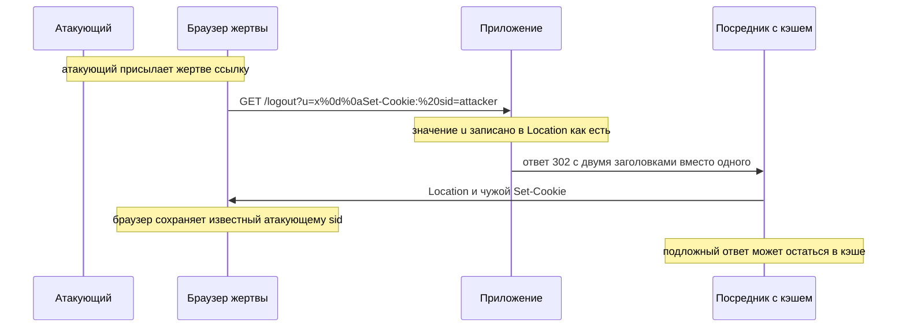

# CRLF-инъекции и расщепление ответа

Магазин после выхода из аккаунта возвращает посетителя туда, откуда тот
пришёл, и адрес возврата приходит параметром `u`. Код писался за минуту:
взять параметр и подставить его в заголовок `Location` — так устроен
редирект, команда сервера браузеру «иди по этому адресу». Однажды
посетителю приходит письмо со ссылкой на такой выход, и в параметре `u` у
ссылки зашиты два невидимых байта, записанные как `%0d%0a`.

Посетитель нажимает, страница открывается как обычно, но в ответе сервера
появляется лишний заголовок `Set-Cookie` с идентификатором сессии, который
известен автору письма. Браузер послушно сохраняет cookie, а стоит жертве
снова войти в аккаунт, как автор ссылки заходит в него вместе с ней:
идентификатор сессии-то ему известен. Пароль никто не подбирал, в журнале
ничего не горит: сервер сам записал в структуру своего ответа то, что ему
прислали. Как два невидимых байта меняют эту структуру и чем это кончается —
разберём по порядку. Заодно увидим, почему стеки последних версий отвечают
на такое ошибкой, а дефект всё равно живёт.

## Что такое CRLF-инъекция

Чтобы увидеть поломку, вспомним устройство ответа HTTP; подробно его
разбирает тема `http-basics`. Ответ — обычный текст. Первая строка —
статус, например `302 Found`. Дальше идут заголовки, каждый на своей строке:
имя, двоеточие, значение. Затем одна пустая строка, и после неё — тело,
например разметка страницы. Вот честный ответ магазина, а запись `\r\n` в
нём обозначает невидимые байты конца строки — их разберёт следующий абзац:

```text
HTTP/1.1 302 Found\r\n
Location: /next?u=main\r\n
Content-Length: 0\r\n
\r\n
```

Каждая строка ответа заканчивается парой байтов: возврат каретки (carriage
return, CR, шестнадцатеричный код 0x0D) и перевод строки (line feed, LF, код
0x0A). Вместе их сокращают в CRLF, и эта пара — единственный разделитель
строк в протоколе. Бытовой пример — бумажный бланк: одна строка — одно поле,
и тот, кто может начать новую строку, дописывает в бланк своё поле.
Соответствие прямое: строка бланка — это заголовок, перевод строки — это
CRLF, а читатель бланка — программа, разбирающая ответ. Аналогия ломается в
одном месте: лишнюю строку в бланке заметит человек, а программа чужую
строку от своей не отличит.

Откуда эти байты берутся в значении. В адресе их записывают в URL-кодировке:
`%0d` — это CR, `%0a` — LF, а `%20` — пробел; сама запись разобрана в теме
`url-and-encoding`. Сервер декодирует параметр до подстановки, поэтому к
моменту записи в заголовок присланное `%0d%0a` уже стало настоящей парой
байтов. Кодировка ничего не обезвреживает: она лишь откладывает вид значения
до разбора.

Ход «данные присланы, а сработали как служебная запись» называется
инъекцией, и класс вам уже знаком: в теме `sqli-basics` данные дотянулись до
синтаксиса запроса к базе. Здесь данные дотянулись до синтаксиса самого
протокола HTTP. Отсюда и имя дефекта: CRLF-инъекция — присланный перевод
строки, попавший в заголовок ответа и изменивший его структуру. Если
переводов два, ответ разрезается надвое, и это называют расщеплением ответа
(response splitting). Разница исходов — в числе переводов строк, и оба
варианта мы увидим дальше.

**Зачем это в работе AppSec-инженера.** Дефект встречается регулярно и
опознаётся на ревью как класс «непроверенные данные в заголовок ответа».
Ревьюеру важно найти место, где присланное значение уходит в заголовок: чаще
всего это `Location` при редиректе или `Set-Cookie`. А дальше — проверить,
что перевод строки туда попасть не может.

## Как это работает

**Откуда это взялось.** HTTP задуман текстовым протоколом: ответ можно
написать руками, и структуру его держат переводы строк. Когда приложения
только появились, серверы писали заголовки как есть, и перевод строки в
значении разрезал ответ. Ущерб — подмена ответа для посредников и
пользователей — заставил стеки и серверы отвергать `\r\n` в заголовках. На
Python 3.14.7 значение с такими байтами поднимает ошибку «Invalid header
value», и прогон есть в разделе «Как убедиться, что защита работает». А там,
где заголовок
пишется в обход стека или стек устаревший, дефект остаётся.

### Что видит посредник

Проследим путь значения из вступления. Ссылка из письма принесла параметр
`u=x%0d%0aSet-Cookie:%20sid=attacker`. Сервер декодирует URL-запись, и
параметр превращается в строку `x`, за которой идут байты CR и LF и текст
`Set-Cookie: sid=attacker`. Приложение подставляет эту строку в `Location`
как есть. Если никто по дороге не отверг перевод строки, по сети уходит
такой ответ, где невидимые байты снова показаны записью `\r\n`:

```text
HTTP/1.1 302 Found\r\n
Location: /next?u=x\r\n
Set-Cookie: sid=attacker\r\n
Content-Length: 0\r\n
\r\n
```

Любой посредник на пути — прокси, кэш, браузер — разбирает этот текст по
строкам. Он видит два заголовка вместо одного: свой `Location` и чужой
`Set-Cookie` с известным атакующему идентификатором сессии. Двойной перевод
`%0d%0a%0d%0a` идёт дальше: первая пара закрывает заголовок, вторая —
секцию заголовков целиком, и всё, что после, — уже тело ответа, написанное
атакующим.



**Описание схемы.** Схема читается сверху вниз и показывает путь инъекции.
Ссылка с переводом строки в параметре переходит от атакующего к жертве вне
протокола, например письмом. Запрос жертвы доходит до приложения, и
приложение записывает значение параметра в заголовок `Location` как есть.
Посредник разбирает ответ по переводам строк и получает два заголовка.
Браузер жертвы сохраняет навязанную cookie, а посредник может запомнить
подложный ответ.

Перевод строки в HTTP — не данные, а граница структуры: попади такой перевод
в присланное значение, и структурой ответа управляет уже клиент. До чтения
трёх исходов подумайте: сработала бы та же цепочка, попади это значение не
в заголовок, а в тело ответа, — и почему? Ответ ждёт в разделе «Частая
ошибка».

### Чужой заголовок

Один CRLF дописывает заголовок, и самый доходный из навязанных —
`Set-Cookie`. Приём называется фиксацией сессии: атакующий навязывает жертве
идентификатор сессии, который знает сам. Жертва входит в аккаунт, и сессия с
известным атакующему номером становится вошедшей; дальше атакующий
предъявляет тот же идентификатор как свой. Разбор приёма целиком ждёт дальше
по маршруту, в теме `session-fixation`. Здесь важен канал доставки: cookie
посажена ответом самого сервера, а не подломом браузера.

### Расщепление ответа

Двойной CRLF открывает подложное тело, и в нём атакующий подаёт любую
разметку от имени сайта, в том числе скрипт. В записи URL-кодировки такая
нагрузка умещается в одну строку параметра:

```text
u=x%0d%0a%0d%0a<script>...</script>
```

Выполнение чужого скрипта на странице сайта — это межсайтовый скриптинг,
XSS: скрипт работает с правами страницы, читает её данные и отправляет
запросы от её имени. Ему посвящена серия тем дальше по маршруту, начиная с
`xss-reflected`. Здесь важно, откуда разметка взялась: её не было ни в
странице, ни в базе — она родилась из значения заголовка.

### Отравление кэша

Между сервером и посетителями часто стоит посредник с кэшем, например сеть
доставки контента: она запоминает ответы, чтобы отдавать их быстрее.
Разобрав расщеплённый ответ как два, посредник может запомнить подложный
второй и дальше отдавать его другим посетителям. Это отравление кэша: один
запрос атакующего превращается в подменённый ответ для многих. Класс целиком
разбирает тема `cache-poisoning`, а родственный дефект на границе запроса —
`request-smuggling`.

## Как это атакуют

Порядок проверки написан в разделе WSTG-v42-INPV-15 руководства OWASP по
тестированию. Атакующий ищет место, где значение из запроса возвращается в
заголовке ответа: редирект по параметру, установка cookie из формы,
служебный заголовок с именем файла при скачивании. В найденное значение
подставляется `%0d%0a`, и ответ читается сырым, по строкам.

**Запрос с переводом строки в параметре**

```http
GET /logout?u=x%0d%0aSet-Cookie:%20sid=attacker HTTP/1.1
Host: shop.example
```

**Ответ, если место уязвимо**

```http
HTTP/1.1 302 Found
Location: /next?u=x
Set-Cookie: sid=attacker
Content-Length: 0
```

Читают ответ так. Два заголовка там, где ждали один, — находка: структурой
ответа управляет присланное значение. Ошибка сервера — тоже ответ: стек
отверг значение, и место закрыто. Если везде ошибка, ищут, где заголовок
пишут в обход стека: сырой вывод в сокет, старый самописный сервер, своя
сборка ответа строками. Готового инструмента под это нет и не нужно: вся
атака — пара байтов в значении, которое сервер сам записал в структуру
ответа.

## Как это выглядит в коде

Ревьюер ищет присланные данные в значении заголовка ответа. Разбор идёт
тремя планами: найти точку входа недоверенных данных, проследить путь
значения до заголовка и назвать, кто мог отвергнуть перевод строки и не
отверг. Найдите сами, до выносок: в какой строке присланное попадает в
заголовок и чем это кончается?

```python
# УЯЗВИМО — демонстрация, не для продакшена
def redirect_next(request, response):
    target = request.args["u"]                 # (1)
    response.headers["Location"] = "/next?u=" + target   # (2)
```

1. Точка входа: значение берётся из запроса как есть, уже декодированным из
   URL-записи: `%0d%0a` к этому моменту стало парой байтов.
2. Сток: значение уходит в заголовок ответа. Если перевод строки в нём не
   отвергается, заголовок дописывается или ответ расщепляется.

Сам по себе этот код на стеке последних версий не доведёт ответ до сети.
Стандартная библиотека Python 3.14.7 отвергает `\r\n` в значении заголовка
ошибкой «Invalid header value», и прогон ждёт вас в самопроверке. Поэтому
признак дефекта на ревью — не отсутствие фильтра, а запись заголовка в обход
стека: сырой вывод в сокет, устаревший сервер, своя сборка ответа. Пример
такого обхода — в первом вопросе самопроверки.

## Как защититься

Порядок тот же, что у прочих инъекций: разделить данные и структуру. В SQL
этому учит параметризованный запрос из темы `parameterized-queries`, а для
заголовка роль такого разделения играют две меры.

**Первая мера — не класть присланные данные в заголовок.** Для редиректа
средству фреймворка отдают готовый путь из известного набора, а не собранную
из ввода строку. Фреймворк ставит заголовок сам и отвергает в нём перевод
строки.

```python
# Исправленный вариант
def redirect_next(request, response):
    target = pick_allowed(request.args["u"])   # (1)
    return framework.redirect(target)          # (2)
```

1. Значение сведено к элементу известного набора путей, а не взято из ввода
   напрямую: незнакомый ввод заменяется путём по умолчанию.
2. Редирект строит фреймворк. Он же отвергает байты CR и LF в значении
   заголовка, и эта проверка уже не ваша забота.

**Вторая мера — убрать байты CR и LF, если значение обязано идти в
заголовок.** Так бывает со служебными заголовками вроде имени файла при
скачивании. Значение очищается от `\r` и `\n` до записи, а лучше сверяется
со списком разрешённого: символ, которого в списке нет, не пройдёт вовсе.

```python
# Фрагмент. Исправленный вариант: список разрешённого для значения
ALLOWED_TAG = re.compile(r"[a-z0-9-]{1,64}\Z")

def track(request, response):
    tag = request.args["tag"]
    if not ALLOWED_TAG.fullmatch(tag):   # (1)
        tag = "unknown"                  # (2)
    response.headers["X-Track"] = tag    # (3)
```

1. Значение сверяется со списком разрешённого: буквы в нижнем регистре,
   цифры и дефис. Перевод строки в список не входит и не пройдёт.
2. Незнакомое значение заменяется безопасным, а не чистится посимвольно:
   чистка угадывает плохое, а список пропускает только известное.
3. В заголовок уходит уже проверенное значение.

Руководство по тестированию и описание CWE-113 сходятся: перевод строки в
заголовок попадать не должен, а надёжнее всего не класть туда непроверенные
данные вовсе.

**Границы применимости.** Отказ стека закрывает заголовки ответа, но
CRLF-инъекция живёт и в соседних местах, где разделителем служит перевод
строки: заголовки письма, записи журнала, другие текстовые протоколы.
Попадание перевода строки в журнал — отдельный дефект, внедрение записей в
журнал (log injection): одна присланная строка становится двумя записями, и
расследование читает подложную. В каждом таком месте свой сток проверяется
отдельно. Стандарт ASVS v5.0-1.2.1 требует кодировать данные под контекст,
включая поля заголовков.

## Как убедиться, что защита работает

Защиту здесь проверяют двумя прогонами: отказом стека и ретестом.

Проверка, которой нечего отвергнуть, ничего не доказывает, поэтому стек
испытывают плохим значением. В стандартной библиотеке Python есть
контрольный модуль `wsgiref.validate`: он проверяет ответ приложения по
договору WSGI, общему для фреймворков языка. Модуль годится контролёром,
потому что договор один на всех: проверка проходит над ответом любого
фреймворка, а не только над нашим кодом. Прогон заголовка с переводом
строки через него (2026-10-03, Python 3.14.7):

```python
# hdr_wsgi.py — исполняемый фрагмент
from wsgiref.util import setup_testing_defaults
from wsgiref.validate import validator

def app(environ, start_response):
    start_response("302 Found",
                   [("Location", "x\r\nSet-Cookie: sid=1")])
    return [b""]

env = {}
setup_testing_defaults(env)
env["QUERY_STRING"] = ""
try:
    list(validator(app)(env, lambda s, h, e=None: None))
    print("заголовок принят")
except AssertionError as e:
    print("AssertionError:", e)
```

```bash
python3 hdr_wsgi.py
```

**Вывод команды**

```text
AssertionError: Bad header value: 'x\r\nSet-Cookie: sid=1' (bad char: '\r')
```

Значение с байтом CR не уехало в ответ: проверка упала ещё до записи в
сокет. Клиентская половина стандартной библиотеки ведёт себя так же — её
прогон с точным текстом ошибки ждёт в четвёртом вопросе самопроверки.
Держите в голове, что отказ стека — второй слой: ошибка в проде — это
упавший запрос, и первая мера остаётся «не класть присланное в заголовок».

Второй прогон — ретест. Повторите на исправленном месте запрос из раздела
«Как это атакуют». Ожиданий два: либо честный редирект на путь из известного
набора, один заголовок `Location` со значением не из ввода; либо отказ с
кодом 400 или 500. Ответ с двумя заголовками после починки означает, что
место закрыто не до конца или не там.

На ревью пройдите по списку.

1. Проверьте, что присланные данные не попадают в значение заголовка ответа
   без проверки (ASVS v5.0-1.2.1).
2. Проверьте, что путь редиректа берётся из известного набора, а не
   собирается из ввода напрямую.
3. Проверьте, что заголовки ставятся средствами фреймворка, а не сырым
   выводом в обход его проверок.
4. Проверьте, что значение, идущее в заголовок, очищено от байтов CR и LF
   или сверено со списком разрешённого (WSTG-v42-INPV-15).
5. Проверьте, что учтены соседние стоки с разделителем из перевода строки:
   заголовки письма и записи журнала.

## Частая ошибка

Решите до чтения дальше: приложение экранирует все значения в разметке
страницы — защищена ли этим подстановка того же значения в заголовок
`Location`?

Расхожий ответ «да» переносит уверенность с тела страницы: фреймворк
экранирует вывод, значит, и подстановка в заголовок безопасна. Он неверен,
потому что это разные контексты и разные защиты. Экранирование HTML
обезвредит `<script>` в теле страницы, но перевод строки в значении
`Location` оно не трогает: заголовок пишется раньше тела и по другим
правилам.

Контрпример. Приложение экранирует все значения в разметке и уверено в
защите. Путь редиректа собирается из параметра и пишется в `Location` в
обход проверок фреймворка, сырым выводом. Значение
`x%0d%0aSet-Cookie:%20sid=attacker` дописывает cookie: экранирование к
заголовку не применялось, а стек в этом месте обошли.

Здесь же и ответ на вопрос из раздела «Как это работает». В теле ответа та
же цепочка не сработала бы: перевод строки там не граница структуры, а
обычный пробельный символ. Вторую половину ответа из значения в теле не
собрать. Свою угрозу в теле представляет разметка, и против неё работает
экранирование. Против границ структуры экранирование не работает — защиты
разных контекстов не заменяют друг друга.

## Попробуй сам

Возьмите место своего кода, где значение из запроса идёт в заголовок ответа,
— редирект или cookie. Не атакуя чужую систему, ответьте письменно на три
вопроса. Отвергает ли ваш стек перевод строки в значении заголовка, и на
каком уровне? Что сделает с ответом значение `x%0d%0aSet-Cookie: sid=1`:
ошибку, один заголовок или два? Каким одним изменением вы убираете сам
вопрос?

**Критерий выполнения** наблюдаемый: три письменных ответа, и в последнем
названо изменение, убирающее данные из структуры заголовка, — готовый
редирект фреймворка или очистка байтов CR и LF.

## Проверь себя

1. Счётчик переходов пишет ответ через сырой сокет, в обход стека:

   ```python
   def track(request, sock):
       tag = request.args["tag"]
       sock.write(b"HTTP/1.1 302 Found\r\n"
                  b"Location: /t?tag=" + tag.encode() + b"\r\n\r\n")
   ```

   Что получит посредник при `tag=x%0d%0aSet-Cookie:%20sid=attacker` и чем
   это кончится для следующих пользователей?

2. Находка: значение из запроса попадает в `Location` через сырой вывод.
   Какую починку вы выберете?

   А. Прогонять значение через экранирование шаблонизатора перед записью в
      заголовок.

   Б. Свести значение к элементу известного набора путей и отдавать редирект
      средством фреймворка.

   В. Вырезать из значения угловые скобки и кавычки — символы, из которых
      строится разметка.

3. Почему отравление кэша задевает не только атакующего?

4. Стандартная библиотека встречает перевод строки в значении заголовка. Не
   запуская, предскажите исход.

   ```python
   import http.client

   c = http.client.HTTPConnection("127.0.0.1", 80)
   c.putrequest("GET", "/", skip_host=True, skip_accept_encoding=True)
   try:
       c.putheader("Location", "/next?u=x\r\nSet-Cookie: sid=attacker")
       print("заголовок принят")
   except ValueError as e:
       print("ValueError:", e)
   ```

5. Возврат к теме `http-basics`: какие части ответа разделяет CRLF и почему
   это даёт атакующему структуру ответа?
6. Возврат к теме `url-and-encoding`: чем запись `%0d%0a` отличается от
   `\r\n` и в какой момент эти две записи сходятся?

<details markdown="1">
<summary>Ответ 1</summary>

1. Посредник получит ответ с дописанным заголовком: после декодирования
   `Location` закроется значением `x`, а следующим заголовком встанет
   `Set-Cookie: sid=attacker`. Стек обойден, и перевод строки никто не
   отверг. Следующим пользователям напрямую это не грозит: перевод строки
   один, второго ответа не родилось, и кэшу нечего запоминать. Пострадает
   сама жертва — ей навязали известный атакующему идентификатор сессии. А
   стоит добавить вторую пару `%0d%0a`, и ответ расщепится: подложное тело
   сможет остаться в кэше и достаться следующим.

</details>

<details markdown="1">
<summary>Ответ 2 и разбор вариантов</summary>

2. Верный ответ — Б.

   А. Экранирование шаблонизатора действует на тело и против разметки:
      перевод строки оно не трогает, а заголовок пишется раньше тела и по
      другим правилам. Это цепочка из раздела «Частая ошибка».

   Б. Данные перестают быть строкой заголовка: выбранный путь — элемент
      известного набора, а сам заголовок ставит фреймворк и отвергает в нём
      байты CR и LF.

   В. Угловые скобки и кавычки — символы разметки тела. Перевод строки в их
      число не входит и останется в значении: чистка не тех символов
      оставляет тот же дефект.

</details>

<details markdown="1">
<summary>Ответ 3</summary>

3. Посредник или кэш запоминает подложный ответ и отдаёт его следующим
   пользователям. Один запрос атакующего влияет на многих.

</details>

<details markdown="1">
<summary>Ответ 4</summary>

4. Исключение: стандартная библиотека отвергает `\r\n` в значении заголовка.
   Прогон файла `hdr.py` с этим кодом (2026-10-03, Python 3.14.7):

   ```bash
   python3 hdr.py
   ```

   ```text
   ValueError: Invalid header value b'/next?u=x\r\nSet-Cookie: sid=attacker'
   ```

   Поэтому признак дефекта — не отсутствие фильтра, а запись заголовка в
   обход стека или стек, который перевод строки пропускает.

</details>

<details markdown="1">
<summary>Ответ 5</summary>

5. CRLF разделяет стартовую строку, заголовки и тело. Управляя переводом
   строки в значении, атакующий управляет границами этих частей и вставляет
   свои.

</details>

<details markdown="1">
<summary>Ответ 6</summary>

6. Это одна и та же пара байтов в двух записях: `%0d%0a` — URL-кодировка,
   `\r\n` — сами байты. Сходятся они после декодирования: URL-кодировка
   ничего не обезвреживает, а откладывает вид значения до разбора.

</details>

## Источники

1. OWASP WSTG-INPV-15 «Testing for HTTP Splitting/Smuggling», WSTG v4.2;
   реестр `wstg-v42-inpv-15-splitting`. Разделы: HTTP Splitting, пример
   инъекции в `Location`, последствия — cache poisoning, XSS, session
   fixation.
   <https://owasp.org/www-project-web-security-testing-guide/v42/4-Web_Application_Security_Testing/07-Input_Validation_Testing/15-Testing_for_HTTP_Splitting_Smuggling>
2. MITRE, «CWE-113: Improper Neutralization of CRLF Sequences in HTTP
   Headers»; реестр `cwe-113-crlf`. Разделы: Description, Common
   Consequences, Potential Mitigations.
   <https://cwe.mitre.org/data/definitions/113.html>

Каркас этапа: `owasp-asvs-5-document` (ASVS v5.0.0), `owasp-wstg-42`,
`owasp-top10-2025`. Наследуются всеми темами и отдельной строкой не
повторяются.

**Скоропортящийся слой.** Поведение стеков по умолчанию меняется от версии:
отказ от `\r\n` в заголовке проверен здесь на Python 3.14.7 в августе 2026 и
перепроверен 2026-10-03, а на сборках прошлых лет его может не быть.
Страница WSTG — живой документ.

**Маркеры уверенности.** Отказ стека — **проверено лично**: 2026-08-24 на
Python 3.14.7 `http.client` на значении заголовка с `\r\n` бросает
ValueError «Invalid header value»; прогон повторён 2026-10-03 на той же
версии, вывод совпал дословно, и тем же днём добавлен прогон
`wsgiref.validate` из раздела «Как убедиться, что защита работает». Механизм расщепления,
кодировка `%0d%0a`, три исхода и меры защиты — **по документации**
(WSTG-INPV-15 и CWE-113, открыты лично 2026-08-24). Расщепление ответа и
отравление кэша лично **не воспроизводились**: нужен стек, пишущий заголовок
в обход проверок, и посредник с кэшем, стенда не собиралось. Требование
1.2.1 сверено с текстом ASVS v5.0.0 (открыт лично 2026-08-24).
