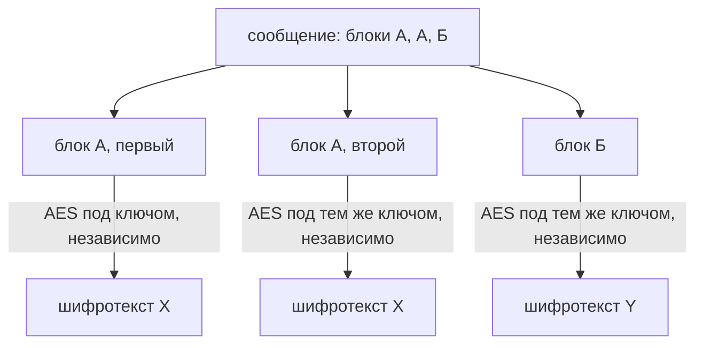

# Ошибки применения: ECB, повтор IV, самоделки

Приложение хранит роль пользователя в зашифрованной cookie, и ключ знает
только сервер. Атакующий берёт свою cookie, правит четыре байта в самом
начале шифротекста и отправляет обратно. Сервер расшифровывает без единой
ошибки — и видит уже другую роль:

```text
расшифровано как есть: 'role=user&id=7  '
правлено байт IV: 4
расшифровано после правки: 'role=root&id=7  '
```

Правленые четыре байта принадлежат IV — открытому одноразовому значению,
которое идёт вместе с шифротекстом. Как атакующий вычисляет, какие
значения записать вместо старых, разберём в разделе про CBC. Заметьте,
чего здесь не было: шифр не взломан, AES остался тем же, ни один байт
ключа не понадобился. Сломано применение.

В соседнем опыте сообщение из 32 блоков зашифровано режимом, который гонит
каждый блок через шифр отдельно. Пять различных блоков шифротекста из
32 — ровно столько, сколько различных блоков в открытом тексте, и карта
повторов совпала полностью. Тема — про три такие ошибки применения: режим,
где одинаковые куски данных видны снаружи; одноразовое значение,
использованное дважды; схема, собранная своими руками вместо готовой.
Дальше разберём, что именно ломается в каждом случае и чем это
закрывается.

Как выбрать сам алгоритм, разобрано в теме `weak-algorithms`; чем скрытность
отличается от целостности — в `hmac-vs-signature`. Здесь считается, что
алгоритм выбран верно, и разбирается всё, что ломается уже после этого
выбора.

## Как это работает

### Шифр умеет один блок, режим — всё сообщение

AES — блочный шифр, то есть машинка с окошком ровно на один блок из
16 байт. Блок вложили — машинка перемешала его по ключу в другой блок той
же длины, и только с тем же ключом перемешивание обратимо. Письмо в тысячу
байт в окошко не помещается.

Поэтому сообщение произвольной длины шифрует не сам AES, а режим — рецепт,
как порезать сообщение на блоки и прогнать их через шифр. Аналогия ломается
на разнообразии: окошко всегда одно, а рецептов нарезки несколько, и выбор
между ними — предмет всей темы. У каждого режима свои требования к входным
значениям, и их нарушение обесценивает шифр, не трогая его самого.

Из нарезки следуют два технических момента. Если последний кусок короче
блока, его добивают байтами до полных шестнадцати — это дополнение
(padding). А чтобы два одинаковых сообщения не давали одинаковый
шифротекст, режиму подают третий вход — одноразовое значение, о нём через
два раздела.

**Откуда это взялось.** Режимы придумывали по мере надобности. ECB появился
первым как самое прямое решение: разрежь сообщение на блоки и зашифруй
каждый. Свойство, которое его хоронит, названо в самом стандарте режимов:
под данным ключом любой блок открытого текста всегда даёт один и тот же
блок шифротекста. Дальше добавили сцепление с предыдущим блоком (CBC) и
счётчик (CTR). Наконец появились режимы, которые вместе с шифрованием
считают метку целостности — короткую приставку, по которой приёмник
отличает целое сообщение от правленого.

### ECB: одинаковые куски видны снаружи

ECB (Electronic Codebook, «электронная кодовая книга») шифрует каждый блок
независимо от соседей. Бытовой пример — словарь замен: письмо шифруется по
кодовой книге «слово → группа знаков». Если слово «завтра» встречается пять
раз, в шифровке пять раз встанет одна и та же группа. Читатель без книги не
узнает слово, но увидит, где оно стоит и как часто повторяется. Режим
делает с блоками по 16 байт то же, что кодовая книга со словами. Аналогия
ломается на стойкости: содержимое блока без ключа не восстановить. Видны
только повторы — но и их хватает.



**Описание схемы.** Схема показывает, как ECB обрабатывает сообщение из
трёх блоков. Каждый блок проходит через AES под одним ключом и никак не
связан с соседями. Первый и второй блоки совпадают в открытом тексте,
поэтому совпадают и в шифротексте: оба дали X. Третий блок другой, и его
шифротекст Y отличается. Повтор в данных превратился в повтор в
шифротексте, и это видно без ключа.

Стенд — учебный скрипт, воспроизводящий опыт локально. Здесь он шифрует
«картинку» 32 на 16 точек, где строка занимает два блока AES, и печатает
карту блоков: одинаковым блокам шифротекста достаётся одна буква.

```text
$ python e01-ecb.py
  открытый текст                     ECB       CBC
  ................................   aa   ab
  ....########################....   bc   ef
  ....####................####....   de   kl
  ....####................####....   de   mn
  ....########################....   bc   yz
  ................................   aa   ??
различных блоков: открытый текст 5, ECB 5, CBC 32
совпадение карты блоков ECB и открытого текста: True
```

Вывод сокращён: строк в картинке шестнадцать, показаны первые шесть. Из
32 блоков ECB дал 5 различных — ровно столько, сколько их в открытом
тексте, и карта совпала полностью. CBC на той же картинке дал 32 различных
блока из 32: сцепление разъезжает повторы (устройство CBC — в своём
разделе ниже). Знаки `??` в последней строке колонки CBC — не ошибка:
различных блоков больше, чем пар букв у стенда, и на исходе алфавита
печатается `??`.

Ключ при этом не раскрыт и содержимое ни одного блока не прочитано.
Раскрыто другое: где в данных повторы. Для картинки это контур, для базы —
какие записи совпадают в зашифрованном поле, для протокола — где границы
сообщений. Какие поля в ваших данных повторяются от записи к записи — и что
расскажет их карта тому, кто читает шифротекст?

### Одноразовое значение: IV и nonce

Чтобы одинаковые сообщения уходили разными шифротекстами, режим принимает
третий вход — одноразовое значение. У него два имени. IV (initialization
vector, вектор инициализации) — в режимах со сцеплением вроде CBC. Nonce
(number used once, «число, использованное один раз») — в режимах-счётчиках.
Роль одна: значение свежее на каждое сообщение.

Бытовой пример — накладной лист на ксероксе. Перед копией на страницу
кладут лист со случайным узором, и копия выходит каждый раз иной. По копиям
не видно, что страница одна. Узор здесь — одноразовое значение, страница —
сообщение, копия — шифротекст. Аналогия ломается на секретности: узор не
прячут, его прикладывают к копии открыто, и это законно — об этом раздел
«Частая ошибка».

Требования к значению у режимов разные, и путать их дорого. Уникальность —
значение не повторяется. Непредсказуемость — значение нельзя угадать
заранее. Порядковый номер уникален, но предсказуем; бросок кубика
непредсказуем, но не гарантированно уникален. Стандарт режимов требует от
CBC и CFB непредсказуемого IV, а от OFB — уникального. CFB и OFB — ещё два
режима из того же стандарта; важно здесь только то, что требования у них
отличаются от требований CBC. GCM — тоже счётчик, но со встроенной меткой
целостности.

| Режим | Требование к одноразовому значению |
|---|---|
| CBC, CFB | непредсказуемость |
| OFB | уникальность |
| CTR | уникальность каждого блока счётчика под ключом по всем сообщениям |
| GCM | вероятность повтора пары «ключ и IV» не выше 2⁻³² |

Для счётчика уникальным обязан быть каждый блок счётчика под данным ключом,
причём сразу по всем сообщениям. Про GCM стандарт добавляет ещё два факта:
единственный повтор открывает подделку меток, и по важности это требование
приравнено к секретности ключа.

### Режим счётчика: повтор значения складывает сообщения

Счётчик (CTR, counter) устроен иначе, чем сцепление. Шифр превращает
«одноразовое значение плюс номер блока» в ленту ключевых байтов — поток
ключа, — а сообщение складывается с этой лентой по модулю два. Сложение по
модулю два, оно же XOR («исключающее или»), сравнивает биты попарно:
совпали — ноль, различны — единица. Свойство, на котором всё держится:
значение, сложенное с одним и тем же дважды, возвращается как было, как
выключатель, который два нажатия возвращают в исходное положение.

Если два сообщения зашифрованы с одним одноразовым значением, поток ключа у
них общий. Сумма двух шифротекстов убирает поток и оставляет сумму открытых
текстов, потому что поток, сложенный сам с собой, даёт нули. Стенд шифрует
два похожих платежа режимом CTR с одним nonce.

```text
$ python e02-nonce.py
Один nonce на оба сообщения (УЯЗВИМО):
  c1 xor c2 == m1 xor m2 : True
  крибом «перевод» (14 байт) восстановлено из m2: 'перевод'
  байтов, совпадающих в m1 и m2: 53 из 60
  в этих позициях c1 xor c2 == 0 и совпадение видно без ключа: 53
Свежий nonce на каждое сообщение (ПРАВИЛЬНО):
  c1 xor c2 == m1 xor m2 : False
```

Пятьдесят три байта из шестидесяти совпали в двух платежах, и это видно по
нулям в сумме — без ключа и без единой догадки. Догадка нужна только для
дочитывания остального: зная кусок одного сообщения, читаешь тот же кусок
второго. Такой известный кусок называют крибом (crib): в шифровках времён
радиоперехвата им было слово «секретно» в начале депеши, здесь — слово
«перевод» в начале платежа. По крибу в 14 байт стенд восстановил кусок
второго сообщения. Когда nonce свежий на каждое сообщение, потоки разные, и
вторая половина вывода показывает `False`: сумма больше ничего не
раскрывает.

### CBC: постоянный IV и правка первого блока

CBC (Cipher Block Chaining, «сцепление блоков шифротекста») связывает
блоки: перед шифрованием каждый блок складывается с предыдущим блоком
шифротекста. У первого блока предыдущего нет, и его роль играет IV. Стенд
шифрует одно и то же сообщение дважды — с постоянным IV и со случайным, —
а потом правит байты IV.

```text
$ python e03-cbc-iv.py
Фиксированный IV: одинаковое начало даёт одинаковый первый блок
  первые блоки совпали: True
  случайный IV, тот же текст, блоки совпали: False
Правка байта IV меняет открытый текст первого блока (УЯЗВИМО):
  расшифровано как есть: 'role=user&id=7  '
  правлено байт IV: 4
  расшифровано после правки: 'role=root&id=7  '
```

При постоянном IV режим CBC ведёт себя на первом блоке как ECB: одинаковое
начало даёт одинаковый шифротекст. Вторая часть стенда — тот самый опыт из
вступления.

Как атакующий вычисляет, какие значения записать? При расшифровке первый
блок складывается с IV по модулю два, поэтому байт результата меняется
ровно на величину правки байта IV. Правка — разница по модулю два между
тем, что там стоит, и тем, что хотят получить: `u` XOR `r` и так далее.
Текущее значение известно, потому что cookie своя: `role=user` — его
собственная роль. Так четыре байта и превратили `user` в `root` без единой
ошибки. Тот же приём делает опыт 3 эксплойта лабы: там известно своё поле
`role=user0`.

Приложение не заметило подмены, потому что шифрование не проверяет
целостность: оно молча переводит правку шифротекста в правку открытого
текста. Такое свойство схемы — правка шифротекста даёт предсказуемую правку
результата без ключа — называют податливостью (malleability). Закрывается
она меткой целостности, и этому посвящена тема `hmac-vs-signature`.

### Самописная схема

Третья ошибка — собственная сборка из примитивов вместо готовой
конструкции. Черт у неё три. Первая — сложение с ключом по модулю два
вместо шифра. Если ключ короче сообщения, он повторяется по кругу.
Получается тот же повтор потока, что в стенде с платежами, только на
каждом периоде ключа. Вторая — ключ из пароля обычным хешем. Хеш быстрый,
поэтому такой ключ перебирается со скоростью хеша. А нужна функция
выведения ключа — намеренно медленная, с настраиваемой ценой перебора.
Третья — собственное дополнение до длины блока, место, на котором строится
оракул дополнения из следующей темы маршрута, `padding-oracle`.

Готовая конструкция от проверенной библиотеки знает про режимы, дополнение,
порядок операций и сравнение за постоянное время. Так проверяют метку,
чтобы по времени ответа её нельзя было угадывать побайтно. Своя сборка не
знает ничего из этого и ломается на деталях, которых в готовой конструкции
нет.

## Как это атакуют

Шифротексты атакующий берёт там, где приложение их отдаёт: cookie, токены,
зашифрованные поля в ответах, сообщения протокола. Дальше три приёма, по
одному на ошибку применения.

1. Сравнение блоков. Шифротекст режется на куски по 16 байт, одинаковые
   ищутся прямым сравнением. Совпадение выдаёт повтор в данных без ключа —
   карту из стенда с картинкой.
2. Сложение пар. Два шифротекста под одним одноразовым значением
   складываются в сумму открытых текстов; дальше криб вычитается, и чужое
   сообщение читается.
3. Правка байтов. Податливый шифротекст правится целенаправленно: в CBC
   правятся байты IV, в CTR — байты самого шифротекста. В CTR правка один к
   одному переносится в открытый текст на тех же позициях, и приложение
   читает другую роль.

Все три приёма — не теория: их делает эксплойт лабораторной этой темы.
Прогон `hack.py` против уязвимого приложения (локально, всё в памяти):

```text
$ ../../../.venv-tools/bin/python hack.py
цель: code.py
  [1] ECB: блоков 5, различных 4, повтор виден: True
  [2] повтор nonce: восстановлено из чужого сеанса 'user=victim01;…'
  [3] податливость CTR: роль после правки шифротекста -> 'admin'
  [K] контроль: свой сеанс прочитан обратно: True

обходов открыто: 3 — ECB, повтор nonce, податливость CTR
```

Строка опыта 2 сокращена: за `user=victim01` следуют `role=admin` и
`credit=9`. Читается вывод так. Опыт 1 подал профиль с длинным
однобуквенным полем: два одинаковых блока открытого текста дали два
одинаковых блока шифротекста — структура видна снаружи. Опыт 2 сложил
чужой сеанс со своим, вычел свой и прочитал чужую роль `admin`. Опыт 3
поправил байты своего сеанса и стал `admin` без ключа. Контрольная строка
показывает, что законный сеанс читается обратно, — приложение работает, а
код выхода 1 сообщает: обходы открыты.

**Зачем это в работе AppSec-инженера.** Эти три ошибки покрывают почти все
находки ревью и опознаются по коду за секунды, поэтому окупаются лучше
остальных. Строка
`AES/ECB/PKCS5Padding`. Константа рядом с вызовом шифрования. Самодельная
функция с именем `encrypt` в файле утилит. Дальше — признаки и объяснение,
что именно теряется; без него разговор с разработчиком упирается в «ну и
что, оно же зашифровано».

## Как это выглядит в коде

При чтении каждого листинга три подцели: найти точку создания шифра и
названный режим; проверить, откуда берётся одноразовое значение; проверить,
есть ли метка целостности. Закройте выноски и найдите в каждом листинге
строку с дефектом.

**Уязвимо, Java:**

```java
// УЯЗВИМО — демонстрация, не для продакшена
Cipher c = Cipher.getInstance("AES/ECB/PKCS5Padding");   // (1)
Cipher d = Cipher.getInstance("AES");                    // (2)
```

1. Режим назван прямо: ECB, и каждый блок пройдёт через шифр независимо.
2. Режим не назван вовсе — и подставляется по умолчанию тот же ECB.

Второй признак — константа там, где ожидается свежее значение.

**Уязвимо, Python:**

```python
# УЯЗВИМО — демонстрация, не для продакшена
IV = b"0123456789abcdef"                       # (3)
def encrypt(data, key):
    c = Cipher(algorithms.AES(key), modes.CBC(IV))
    return c.encryptor().update(pad(data))     # (4)
```

3. Одно значение на всё приложение: ни непредсказуемости, ни уникальности.
4. Метки целостности нет — тот же вызов пропустит правленый шифротекст.

Третий признак — самодельная схема. Черты её разобраны выше: сложение с
ключом по модулю два вместо шифра, ключ из пароля обычным хешем, своё
дополнение.

**Уязвимо, JavaScript:**

```javascript
// УЯЗВИМО — демонстрация, не для продакшена
function encrypt(s, key) {
  return [...s].map((ch, i) =>
    ch.charCodeAt(0) ^ key.charCodeAt(i % key.length))  // (5)
    .map(n => n.toString(16).padStart(2, '0')).join('');
}
```

5. Повторяющийся короткий ключ — тот же повтор потока, что показал стенд с
   платежами, но на каждом периоде ключа.

Ложное срабатывание: ECB законно встречается внутри других конструкций —
им шифруют ровно один блок. Так бывает при оборачивании ключа: так называют
шифрование одного ключа другим для хранения или передачи. Признак
законности — данные заведомо укладываются в один блок и повторов среди них
не бывает.

## Как защититься

Защита сводится к одному решению и дисциплине вокруг него.

- **Аутентифицированный режим из библиотеки.** AES-GCM или
  ChaCha20-Poly1305, вызов на уровне «зашифруй эти байты этим ключом»
  (`v5.0-11.3.3`). Библиотека сама выдаст одноразовое значение и сама
  проверит метку целостности до выдачи текста.
- **ECB и негодные схемы дополнения — вон.** ASVS выносит это в требование
  первого уровня (`v5.0-11.3.1`): режимы вроде ECB не применяются.
- **Одноразовое значение — свежее на каждое сообщение.** И на каждую пару
  «ключ и данные» (`v5.0-11.3.4`). Способ порождения выбирается под режим:
  для CBC нужна непредсказуемость, для счётчика — уникальность.
- **Ключ из пароля — только через функцию выведения.** Обычный хеш от
  пароля даёт ключ, подбираемый со скоростью хеша; функция выведения
  намеренно медленная, с настраиваемой ценой.
- **Своей криптографии нет.** Готовая конструкция от проверенной реализации
  (`v5.0-11.2.1`). Библиотека знает про режимы, дополнение, порядок операций
  и сравнение за постоянное время; своя сборка — нет.

Так выглядит первый пункт в коде — исправленная пара к уязвимому листингу
на Python (фрагмент, упрощён для примера; рабочий целиком — `solution.py`
лабы, библиотека `cryptography`):

**Исправлено, Python:**

```python
# Исправленный вариант: AES-GCM вместо CBC с константным IV
def seal(state: str) -> str:
    nonce = os.urandom(12)                     # (1)
    ct = AESGCM(APP_KEY).encrypt(nonce, state.encode(), None)
    return b64encode(nonce + ct)               # (2)

def open_state(cookie: str) -> str:
    raw = b64decode(cookie)
    nonce, ct = raw[:12], raw[12:]
    return AESGCM(APP_KEY).decrypt(nonce, ct, None)   # (3)
```

1. Свежее случайное одноразовое значение на каждое сообщение: требование
   уникальности выполняется само, руками его не задают.
2. Значение хранится первыми двенадцатью байтами рядом с шифротекстом:
   секретным оно быть не обязано, приёмник берёт его оттуда же.
3. Вызов `decrypt` проверяет метку до возврата текста: на подделке бросает
   `InvalidTag`, и разбирать такое сообщение нечего.

### Проверка: те же опыты против починки

Защита доказывается не видом кода, а отказом на тех же трёх приёмах. Прогон
эксплойта против исправленного файла лабы:

```text
$ LAB_TARGET=solution.py ../../../.venv-tools/bin/python hack.py
цель: solution.py
  [1] ECB: блоков 7, различных 7, повтор виден: False
  [2] повтор nonce: восстановлено из чужого сеанса '…' (мусор, сокращено)
  [3] податливость CTR: подделка отвергнута (InvalidTag)
  [K] контроль: свой сеанс прочитан обратно: True

все три обхода закрыты, контроль цел
```

Первый опыт не находит повторов: семь блоков, и все различные. Второй
получает нечитаемый мусор вместо чужого сеанса, потому что пары «ключ и
nonce» свежие. Третий заканчивается отказом с `InvalidTag` ещё до разбора
присланного. Контрольный опыт цел, и `tests.py` продолжает выходить с кодом
0: законная работа не сломана. Тот же приём переносится в ревью: правьте
байт шифротекста и смотрите, отвергло ли приложение значение ошибкой метки
или расшифровало.

## Частая ошибка

Где место IV — рядом с шифротекстом или в хранилище ключей? Ходовое
представление: раз IV участвует в шифровании наравне с ключом, хранить его
надо как ключ — в секрете, отдельно от данных. Решите, верно ли это, прежде
чем читать дальше.

**IV секретным быть не обязан, и стандарт режимов говорит это прямо.** Он
передаётся вместе с шифротекстом, обычно первым блоком, и это законно. От
него требуется другое, и требование зависит от режима. Для CBC и CFB —
непредсказуемость, для OFB — уникальность. Для счётчика — уникальность
каждого блока счётчика под данным ключом по всем сообщениям сразу. Попытка
«спрятать» IV, сделав его константой в коде, меняет законное свойство на
дефект: стенд с постоянным IV показал одинаковое начало сообщений в
шифротексте.

Соседнее заблуждение того же вида: «мы взяли AES-256, ключ длинный, всё
надёжно». Длина ключа отвечает за перебор, а разобранные здесь три ошибки
перебора не требуют. Ни одна из них не стала бы сложнее от удвоения ключа.

## Чеклист для ревью

1. Проверьте, что режим шифрования назван явно и это не ECB (`v5.0-11.3.1`).
2. Проверьте, что предпочтён аутентифицированный режим, а при связке шифрования
   с MAC целостность проверяется до расшифровки (`v5.0-11.3.3`).
3. Проверьте, что одноразовое значение порождается заново на каждое сообщение и
   не повторяется под одним ключом (`v5.0-11.3.4`).
4. Проверьте, что способ порождения IV отвечает режиму: непредсказуемость для
   сцепления блоков, уникальность для счётчика.
5. Проверьте, что ключ не выводится из пароля обычной хеш-функцией без функции
   выведения ключа.
6. Проверьте, что в проекте нет собственных реализаций шифрования, дополнения и
   выведения ключей вместо библиотечных (`v5.0-11.2.1`).
7. Проверьте, что найденное применение ECB ограничено ровно одним блоком данных,
   в которых повторов не бывает.

## Попробуй сам

`lab-crypto-misuse`, каталог `pilot/lab/crypto-misuse`. Формат «почини».
Приложение хранит состояние сессии на клиенте под AES: профиль в режиме
ECB, сеанс в режиме счётчика с постоянным одноразовым значением. Ключ
приложения атакующему неизвестен. Правится `code.py`, пока `hack.py` и
`tests.py` не станут зелёными одновременно.

Файлы лабы. `code.py` — уязвимое приложение. `hack.py` — эксплойт с тремя
опытами и контрольным. `tests.py` — проверка законной работы. `sandbox.py`
— ключ и разбор состояния, всё в памяти. `solution.py` — образец починки,
открывается после своей попытки.

Запуск (всё локально, сети нет):

```bash
cd pilot/lab/crypto-misuse
../../../.venv-tools/bin/python hack.py     # против code.py: 3 обхода
../../../.venv-tools/bin/python tests.py    # функциональность: 0 упало
```

После своей починки проверка идёт теми же командами, а сверка с образцом —
так:

```bash
LAB_TARGET=solution.py ../../../.venv-tools/bin/python hack.py
LAB_TARGET=solution.py ../../../.venv-tools/bin/python tests.py
```

**Цель одной фразой:** добиться, чтобы `hack.py` вышел с кодом 0 (все три
обхода закрыты, контрольный опыт цел), а `tests.py` продолжил выходить с
кодом 0.

Три опыта детерминированы: повтор блоков ECB, раскрытие чужого сеанса через
общий nonce, правка роли в шифротексте счётчика.

Подсказка: замена алгоритма делу не поможет — AES здесь уже стоит. Возьмите
один аутентифицированный режим на обе cookie и проверяйте метку до разбора
присланного.

**Отдельная задача «почини».** Закрыть все три обхода, не сломав законную
работу: выданные профиль и сеанс должны читаться обратно со всеми тремя
полями.

## Проверь себя

1. Сервис шифрует сеансы так:

   ```python
   NONCE = b"fixednonce123456"

   def seal(key, data):
       return aes_ctr(key, NONCE, data)
   ```

   Что общего у двух шифротекстов из этой функции и что из этого видно без
   ключа?

2. Ревью нашло ECB в коде платежей. Какую починку вы выберете?

   А. Остаться на ECB, но сменить AES-128 на AES-256: длинный ключ надёжнее.

   Б. Аутентифицированный режим (AES-GCM) со свежим одноразовым значением на
      каждое сообщение.

   В. Перейти на CBC с постоянным IV, записанным в секретном хранилище рядом с
      ключом.

3. Почему карта блоков шифротекста в режиме ECB совпадает с картой блоков
   открытого текста?

4. Два сообщения зашифрованы одним потоком. Не запуская, предскажите, что
   покажет сумма шифротекстов.

   ```python
   def ctr(key, nonce, msg):  # учебный XOR-поток вместо AES-CTR
       stream = (key + nonce) * 4
       return bytes(a ^ b for a, b in zip(msg, stream))

   k, n = b"K" * 16, b"N" * 8
   c1 = ctr(k, n, b"role=user ")
   c2 = ctr(k, n, b"role=admin")
   x = bytes(a ^ b for a, b in zip(c1, c2))
   print("нулевых байт:", x.count(0), "из", len(x))
   ```

5. Возврат к теме `weak-algorithms`: почему выбор годного алгоритма ещё не
   закрывает вопрос и что остаётся выбрать после него?
6. Возврат к теме `hmac-vs-signature`: правка байтов IV меняет первый блок
   открытого текста — каким свойством это закрывается и почему шифрование его
   не даёт?

<details markdown="1">
<summary>Ответ 1</summary>

1. Один и тот же поток ключа: при постоянном `NONCE` под одним ключом оба
   сообщения складываются с одним потоком. Сумма двух шифротекстов равна сумме
   двух открытых текстов, и совпадающие позиции сообщений читаются нулями.
   На стенде темы это дало 53 совпавших байта из 60 без догадки о ключе.

</details>

<details markdown="1">
<summary>Ответ 2 и разбор вариантов</summary>

2. Верный ответ — Б.

   А. Длина ключа отвечает за перебор, а ECB раскрывает повторы при любом
      ключе: одинаковые блоки открытого текста дают одинаковые блоки
      шифротекста. Это соседнее заблуждение из «Ловушки».

   Б. Свежий nonce закрывает повтор потока, а встроенная метка — правку
      шифротекста: решение лабы отвергает подделку с `InvalidTag`.

   В. IV секретным быть не обязан — он передаётся с шифротекстом. От CBC
      требуется его непредсказуемость, а постоянный IV ведёт себя на первом
      блоке как ECB и вдобавок даёт правку первого блока через байты IV.

</details>

<details markdown="1">
<summary>Ответ 3</summary>

3. Потому что каждый блок шифруется независимо от соседей, и одинаковым
   блокам открытого текста достаются одинаковые блоки шифротекста. Атакующий
   узнаёт, где в данных повторы: контур на картинке, совпадающие записи в
   зашифрованном поле, границы сообщений в протоколе.

</details>

<details markdown="1">
<summary>Ответ 4</summary>

4. Пять нулей из десяти: совпадающие позиции `role=` уничтожили поток ключа
   дважды и дали нули. Проверка прогоном: сниппет из вопроса сохранён как
   `nonce2.py`.

   ```text
   $ python3 nonce2.py
   нулевых байт: 5 из 10
   ```

   Сумма шифротекстов — это сумма открытых текстов: поток один и при сложении
   исчезает. На исправленном файле лабы тот же приём даёт мусор: пара «ключ,
   nonce» там свежая на каждое сообщение.

</details>

<details markdown="1">
<summary>Ответ 5</summary>

5. Потому что имя алгоритма описывает преобразование одного блока. После него
   выбирается режим, а к режиму прилагаются требования к одноразовому значению
   и вопрос о том, есть ли проверка целостности.

</details>

<details markdown="1">
<summary>Ответ 6</summary>

6. Целостностью — меткой, которую проверяют до расшифровки. Шифрование даёт
   скрытность и молча переводит правку шифротекста в правку открытого текста:
   проверять в нём нечего.

</details>

## Источники

1. NIST, SP 800-38A «Recommendation for Block Cipher Modes of Operation:
   Methods and Techniques», Final, декабрь 2001; реестр `nist-sp-800-38a`.
   Разделы: § 5.3 «Initialization Vectors» (IV не обязан быть секретным;
   непредсказуемость для CBC и CFB, уникальность для OFB), § 6.1 (свойство
   ECB и вывод «этот режим не применять»), § 6.4 (последствия повтора IV в
   OFB), Appendix B (уникальность блока счётчика по всем сообщениям и что
   раскрывает её нарушение).
   <https://csrc.nist.gov/pubs/sp/800/38/a/final>
2. NIST, SP 800-38D «Recommendation for Block Cipher Modes of Operation: GCM
   and GMAC», ноябрь 2007; реестр `nist-sp-800-38d-gcm`. Раздел: § 8
   «Uniqueness Requirement on IVs and Keys» — граница вероятности 2⁻³²,
   последствия единственного повтора, сопоставление с секретностью ключа.
   <https://csrc.nist.gov/pubs/sp/800/38/d/final>
3. OWASP Web Security Testing Guide v4.2, WSTG-CRYP-04 «Testing for Weak
   Encryption»; реестр `wstg-v42-cryp-04-weak-encryption`. Разделы: Basic
   Security Checklist (запрет ECB, требования к IV), Source Code Review
   (`IvParameterSpec`, разные IV на каждое шифрование, поиск строки `ECB`).
   <https://owasp.org/www-project-web-security-testing-guide/v42/4-Web_Application_Security_Testing/09-Testing_for_Weak_Cryptography/04-Testing_for_Weak_Encryption>

Каркас этапа: `owasp-asvs-5-document` (ASVS v5.0.0), `owasp-wstg-42`,
`owasp-top10-2025`. Наследуются всеми темами и отдельной строкой не
повторяются.

**Скоропортящийся слой.** Названия предпочитаемых аутентифицированных режимов
и умолчания конкретных библиотек меняются вместе с ними; требования режимов к
одноразовому значению записаны в стандартах 2001 и 2007 годов и не менялись.

**Маркеры уверенности.** Совпадение карты блоков ECB с картой открытого текста
и различие в 5 против 32 блоков, восстановление 53 совпадающих байт из 60 при
повторном nonce в CTR, одинаковый первый блок при постоянном IV в CBC и
подмена `user` на `root` правкой четырёх байт IV — **проверено лично**
2026-08-24 на Python 3.14.7, библиотека `cryptography` 50.0.0 (стенды
`e01-ecb.py`, `e02-nonce.py`, `e03-cbc-iv.py`). Требования режимов к IV,
свойство ECB и последствия повтора — **по документации** (SP 800-38A § 5.3,
§ 6.1, § 6.4 и Appendix B; SP 800-38D § 8; оба PDF открыты лично 2026-08-24).
Признаки в коде Java и порядок поиска — **по документации** (WSTG-CRYP-04,
открыт лично 2026-08-24). Подделка метки GCM после повтора IV
**не воспроизводилась**: стенда для неё не ставилось. Прогоны лабы
(`hack.py` и `tests.py` против `code.py` и `solution.py`) повторены
2026-10-03 на Python 3.14.7: выводы совпали с приведёнными в разделах «Как
это атакуют» и «Как защититься», коды выхода 1 и 0 соответственно.
