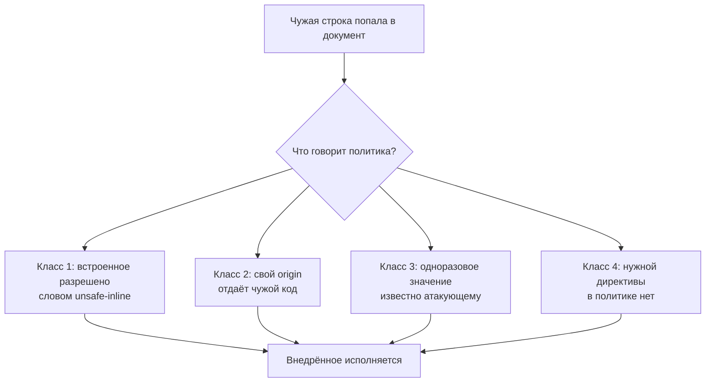

# Обходы CSP

Политика содержимого на странице стоит и работает: внедрённый в тело
документа скрипт браузер не исполнил и напечатал отчёт о нарушении. В том
же прогоне, при той же политике `script-src 'self'`, внедрённый элемент
`base` прошёл без возражений. Этот элемент меняет адрес, от которого
считаются все относительные ссылки страницы, включая пути к её собственным
скриптам, — и адрес этот стал чужим. Политика сработала и не сработала
одновременно, потому что про элемент `base` в ней ничего не написано.

Путь, при котором политика стоит, а цель атакующего достигается, называют
обходом CSP: механизм при этом не сломан, браузер применил правила честно.
В картинке из темы `csp` это гость, которого охранник впустил по списку:
строчка в списке написана шире, чем задумывали (границы самой картинки
разобраны там же). Таких широких строчек тема насчитывает четыре класса.
Дефект внедрения при любом из них остаётся на месте: политика решает, чем
им можно воспользоваться, поэтому она второй рубеж поверх экранирования,
а не замена.

## Как это работает

**Откуда это взялось.** Политика появилась, когда стало ясно, что одного
экранирования мало: мест вставки много, и в одном из них рано или поздно
ошибутся. Идея была в том, чтобы перенести решение «что исполнять» с
разметки на поле ответа, которым разметка распоряжаться не может. Дальше
выяснилось, что решение это не бинарное. Политика перечисляет разрешённое,
а разрешённое почти всегда шире, чем задумано, и обходы растут из этого
зазора, а не из ошибок браузеров.

Все прогоны этой темы сделаны в браузере `HeadlessChrome/152.0.7977.42` на
одной и той же странице. Страница отражает присланное значение в тело
документа: строка из параметра становится частью разметки. Как строка
попадает в документ и почему этого быть не должно, разбирает тема
`xss-contexts`. Здесь важен только итог: чужая строка в документе есть, и
между ней и исполнением стоит одна политика. Держите вопрос до класса
третьего: значение, вычисленное один раз при запуске приложения, — в какой
из четырёх классов попадает этот просчёт?

### Что политика действительно останавливает

Начать стоит с того, что политика работает. Без неё значение
`` в теле документа исполняется: картинки по адресу
`x` нет, браузер зовёт обработчик ошибки, и в нём ждёт код атакующего. С
политикой `script-src 'self'; object-src 'none'` то же значение не
исполняется, и браузер печатает отчёт о нарушении. Дефект на месте — строка
лежит в документе, — но воспользоваться им не удалось. Именно так и должен
работать второй рубеж.

Все четыре класса на одной карте:



**Описание схемы.** Схема читается сверху вниз. Чужая строка попадает в
документ через дефект внедрения, и дальше всё решает текст политики. Каждый
из четырёх классов — своя причина, по которой политика разрешает то, что
задумывалось как запрещённое. Причины такие: слово в директиве, путь на
своём origin, выданный пропуск, отсутствующая директива. Итог у всех
четырёх один — внедрённое исполняется.

### Класс первый: политика сама разрешает внедрённое

Ключевое слово `'unsafe-inline'` вы знаете из темы `csp`: оно снимает
запрет встроенного кода целиком — и фрагменты между тегами `<script>`, и
обработчики событий в атрибутах. Проверено прогоном: с политикой
`script-src 'self' 'unsafe-inline'` нагрузка ``
исполняется. Слово означает ровно то, что написано: встроенное разрешено,
а внедрённая строка — всегда встроенная.

Появляется это слово обычно не по неведению, а по нужде: политику
накладывают на готовое приложение, где обработчики уже вписаны в разметку.
Спецификация CSP Level 3 предлагает выход прямо в тексте: там, где
рассматривают `'unsafe-inline'`, авторам рекомендуют рассмотреть вместо
него одноразовое значение или отпечаток. Из той же темы `csp` вы помните
деталь: рядом с одноразовым значением или отпечатком браузер это слово
игнорирует. Класс открыт, только когда пропусков в директиве нет.

### Класс второй: свой origin отдаёт чужой код

Выражение `'self'` разрешает скрипты со своего origin. Важно, что именно
оно разрешает: адрес, а не содержимое по нему. Если на этом origin есть
путь, который собирает код из присланного, политика разрешает и его.
Классический такой путь — обработчик в стиле JSONP (JSON with padding,
«JSON с подложкой»). Приём придумали до появления механизма из темы
`cors`: странице нельзя читать ответ чужого origin, а загрузить его как
скрипт можно — это ограничение разбирает тема `same-origin-policy`. Поэтому
данные возили скриптом: обработчик обёртывает данные в вызов функции, а имя
функции берёт из параметра запроса.

Вот он на паре запросов:

```text
GET /api/price?callback=showPrice   →   showPrice({"price": 42});
GET /api/price?callback=alert(1)//  →   alert(1)//({"price": 42});
```

Посмотрите на вторую строку глазами атакующего. Имя функции попадает в
ответ без проверки, поэтому параметром присылают произвольный код, а знаки
`//` превращают хвост ответа в комментарий. Адрес остаётся на своём origin,
и для политики всё честно. Проверено прогоном: при политике
`script-src 'self'` внедрённый элемент `script`, ссылающийся на такой путь
того же origin, исполняется. Требование ASVS v5.0-3.5.6 запрещает такие
пути прямо и по этой же причине.

Академия PortSwigger добавляет к этому классу вторую половину:
осторожность с чужими доменами в списке разрешённых. Сеть доставки
содержимого из темы `csp` отдаёт файлы многих клиентов с одних адресов.
Поэтому разрешение такого домена равносильно разрешению всего, что на нём
лежит, включая чужой код.

### Класс третий: одноразовое значение попало не в те руки

Одноразовое значение сильнее списка адресов, и тема `csp` показывает
почему: оно действует точечно, на конкретный элемент конкретного ответа, и
заранее его не подсмотреть. У него своё условие, и спецификация формулирует
его требованием. Сервер обязан порождать новое значение при каждой передаче
политики, длиной от 128 бит, генератором, пригодным для секретов. И тут же
предупреждает: тот, кто получил доступ к значению, исполнит что захочет и
когда захочет.

Проверено прогоном: если внедрённая разметка несёт верное значение в
атрибуте, скрипт исполняется при политике с одноразовым значением.
Остаётся вопрос, откуда атакующий узнаёт значение, которое меняется в
каждом ответе. Один случай тема `csp` уже разобрала: значение, одинаковое
во всех ответах, читается одним запросом. Это и есть ответ на вопрос из
начала темы: такой просчёт попадает в класс третий. Спецификация называет
ещё два способа, и оба читают значение изнутри самой страницы.

Первый способ — оборванная разметка. Так называют внедрённую строку,
которая начинает тег и не закрывает его:
``, а своей директивы стилей в политике обычно нет, потому
что строгие стили ломают вёрстку, — значит, встроенные стили разрешены.
Стили умеют выбирать элементы по содержимому атрибутов: запись
`script[nonce^="a"]` читается «скрипт, чьё значение начинается с буквы a».
К такому правилу приклеивают фоновую картинку с адресом на сервере
атакующего, и браузер запрашивает её, только когда правило совпало. Перебор
идёт по одному знаку: запросили картинки на все буквы разом, совпала одна —
берите следующий знак.

Отсюда практический признак для ревью: значение, вычисленное один раз при
запуске приложения, — не одноразовое. Страницу с таким значением нельзя ни
кешировать, ни отдавать статикой, потому что пропуск в ней действует
бессрочно. Атакующему достаточно один раз прочитать любую страницу, и тема
`csp` показывает, чем это кончается.

### Класс четвёртый: директива не закрыта

Политика молчит про то, чего в ней нет. Директива скриптов ограничивает
скрипты и ничего больше, а элемент `base` из темы `csp` — не скрипт: он
меняет адрес, от которого считаются все относительные ссылки страницы.
Запасная `default-src` его тоже не покрывает: она действует на директивы
выборки ресурсов, а `base-uri` к ним не относится. Поэтому защита здесь
одна — явная директива.

Проверено прогоном: при политике `script-src 'self'` внедрённый элемент
`base` принят, и `document.baseURI` — свойство, где браузер держит текущий
базовый адрес страницы, — стал чужим адресом. Ссылки, формы и относительные
пути скриптов считаются уже от него. Отсюда требование ASVS v5.0-3.4.3: в
общей политике обязаны стоять `object-src 'none'` и `base-uri 'none'`.

Второй способ дописать в политику своё — отражение, но уже в саму строку
политики. Академия описывает случай, когда приложение подставляет
присланное значение в текст политики, чаще всего в директиву отчётов.
Точка с запятой разделяет директивы, поэтому значение с точкой с запятой
дописывает в политику свои директивы. Дописать так выйдет только
отсутствующую директиву: повторную браузер игнорирует, действует первая.
Вот как это выглядит:

```text
было:  report-uri /report?from=anna
стало: report-uri /report?from=x; script-src 'unsafe-inline'
```

### Причём здесь 'strict-dynamic'

Выражение `'strict-dynamic'` из темы `csp` часто читают как ослабление, и
это неверно. Оно переносит доверие с адресов на происхождение: скрипт,
созданный уже доверенным скриптом, разрешается, а список адресов перестаёт
действовать. На внедрённую в разметку нагрузку доверие не переносится,
потому что пропуска у неё нет. Проверено прогоном: при политике с
одноразовым значением и `'strict-dynamic'` внедрённый обработчик события не
исполняется.

**Зачем это в работе AppSec-инженера.** Политика на странице — самая
заметная мера, и потому по ней чаще всего судят о защищённости. Ревьюеру
нужно уметь прочитать строку политики и сказать, что именно она запрещает,
а что нет. Три класса из четырёх видны прямо в тексте политики, без единого
запроса. Четвёртый — путь на своём origin, отдающий код, — находится по
каталогу приложения.

## Как это выглядит в коде

Ревьюер читает строку политики раньше, чем код приложения. До чтения
выноски найдите в ней открытые классы из четырёх и назовите их.

```javascript
// УЯЗВИМО — демонстрация, не для продакшена
app.use((req, res, next) => {
  res.setHeader('Content-Security-Policy',
    `script-src 'self' 'unsafe-inline' https://cdn.example.net`);  // (1)
  next();
});
```

1. В одной строке сразу два класса: `'unsafe-inline'` разрешает внедрённое —
   класс первый. А `'self'` разрешает всё, что отдаёт свой origin, включая
   путь в стиле JSONP, — класс второй. Директив `object-src` и `base-uri`
   нет вовсе — класс четвёртый.

Признаки, которые видны в тексте политики без единого запроса: выражение
`'unsafe-inline'` или `'unsafe-eval'` и отсутствие `object-src` с
`base-uri`. Слово `'unsafe-eval'` разрешает исполнять строки как код —
`eval` и похожие приёмы. Ещё два признака: домен сети доставки без
отдельного пути и одноразовое значение, вычисленное вне обработчика
запроса.

## Как защититься

Правило одно: политика собирается так, чтобы разрешённое совпадало с
нужным, и ставится поверх экранирования, а не вместо него. Экранирование по
месту вставки из темы `xss-contexts` закрывает сам дефект, а политика
ограничивает цену промаха. Исправленный вариант читается по четырём
планам: значение на каждый ответ, доверие по происхождению, две закрытые
директивы, место для отчётов. Выноски идут в том же порядке.

```javascript
// Исправлено.
app.use((req, res, next) => {
  const nonce = crypto.randomBytes(16).toString('base64');   // (1)
  res.locals.nonce = nonce;
  res.setHeader('Reporting-Endpoints', 'csp-endpoint="/csp-report"');
  res.setHeader('Content-Security-Policy', [
    `script-src 'nonce-${nonce}' 'strict-dynamic'`,          // (2)
    "object-src 'none'", "base-uri 'none'",                  // (3)
    "report-to csp-endpoint",                                // (4)
  ].join('; '));
  next();
});
```

1. Значение порождается на каждый ответ генератором, пригодным для
   секретов, и длиной 16 байт — то есть 128 бит, ровно требование
   спецификации из класса третьего.
2. Список адресов заменён одноразовым значением, а доверие к скриптам,
   которые создаёт свой код, переносится выражением `'strict-dynamic'`.
3. Две директивы, которых чаще всего не хватает, — класс четвёртый закрыт.
4. Место для отчётов о нарушениях — требование ASVS v5.0-3.4.7. Отчёт — это
   сообщение, которое браузер отправляет приложению всякий раз, когда
   политика что-то блокирует: по отчётам видно и промахи политики, и
   попытки внедрения. Директива `report-to` лишь ссылается на группу по
   имени; саму группу определяет поле `Reporting-Endpoints`, и без него
   отчёты не уйдут.

**Границы применимости.** Политика с одноразовым значением несовместима с
отдачей страницы из кеша, потому что значение обязано меняться от ответа к
ответу. Она же требует правки разметки — все встроенные скрипты получают
атрибут `nonce`. Приложение, где эта правка невозможна, честнее оставить на
списке адресов и знать про его предел из класса второго. Это лучше, чем
поставить статичное значение и считать вопрос закрытым.

**Чего политика не закрывает вовсе.** Академия называет случай прямо:
политики часто запрещают скрипты и разрешают картинки, и тогда через адрес
картинки наружу выносят то, что видно на странице. Приём знакомый —
оборванная разметка из класса третьего, только цель здесь не пропуск, а
сами данные страницы. Дефект внедрения остаётся дефектом и без исполнения
скрипта, поэтому политика никогда не отменяет экранирование.

## Частая ошибка

От политики ждут замены экранированию: мол, политика содержимого закрывает
XSS, и при включённой политике экранирование по месту вставки становится
необязательным. Верно ли это — решите до чтения опровержения.

**Политика ограничивает последствия, а не убирает причину.** Бытовая
картинка здесь — ремень безопасности: столкновение он не делает
невозможным, а цену его снижает. Аналогия ломается в покрытии: ремень
срабатывает в любой аварии и сам, а политика действует только в браузере и
только про то, что в ней написано. Академия описывает назначение политики
тем же словом — смягчение: цена дефекта ниже, сам дефект на месте.

Cheat Sheet OWASP называет опору на одну лишь политику отдельным
антипаттерном и разбирает две его беды. Первая — молчаливое допущение, что
все браузеры поддерживают все её конструкции. Вторая — общая политика на
всю организацию: она ломает часть приложений и потому обрастает
исключениями, пока от неё не остаётся строчка для галочки.

Контрпример из прогонов. Политика `script-src 'self'` останавливает
нагрузку в теле документа — и та же политика пропускает внедрённый элемент
`base`, который меняет адрес для всех относительных ссылок страницы. Дефект
внедрения разметки никуда не делся; изменилось только то, чем именно им
можно воспользоваться.

## Чеклист для ревью

1. Проверьте, что политика не содержит `'unsafe-inline'` и `'unsafe-eval'`
   в директивах скриптов и стилей.
2. Проверьте, что одноразовое значение порождается на каждый ответ
   генератором, пригодным для секретов, а не один раз при запуске.
3. Проверьте, что в общей политике заданы `object-src 'none'` и
   `base-uri 'none'` (ASVS v5.0-3.4.3).
4. Проверьте, что на разрешённых origin нет путей, отдающих код,
   составленный из присланного значения (ASVS v5.0-3.5.6).
5. Проверьте, что присланное значение не подставляется в саму строку
   политики.
6. Проверьте, что в политике задано место для отчётов о нарушениях
   (ASVS v5.0-3.4.7).
7. Проверьте, что политика не заменила собой экранирование по месту
   вставки, а стоит поверх него.

## Попробуй сам

Возьмите политику из ответа приложения, с которым работаете, и разберите её
по четырём классам. Выпишите четыре ответа. Есть ли разрешение исполнять
внедрённое. Какие origin разрешены и что на них лежит. Как порождается
одноразовое значение, если оно есть. Какие из директив `object-src` и
`base-uri` отсутствуют. Подсказка на старт: три класса из четырёх видны
прямо в строке политики, без единого запроса.

**Критерий выполнения** наблюдаемый: четыре ответа и вывод, какой из
классов на этой политике открыт. И одно предложение о том, что изменится в
исходе дефекта внедрения разметки, если закрыть найденный класс.

## Проверь себя

1. Политика другого приложения:

   ```text
   Content-Security-Policy: script-src 'self' https://cdn.example.net
   ```

   Назовите два класса обхода, которые она оставляет открытыми.

2. Найдено отражение значения в тело документа; политика —
   `script-src 'self'`. Какую починку вы выберете?

   A. Ничего не чинить в разметке: политика стоит, XSS закрыт.

   B. Экранировать по месту вставки и дописать `object-src 'none'` с
      `base-uri 'none'`, а политику оставить вторым рубежом.

   C. Заменить `'self'` одноразовым значением, вычисленным один раз при
      запуске приложения.

3. Почему разрешение своего origin не означает запрета чужого кода?

4. Не запуская, предскажите вывод и скажите, почему такое значение не
   одноразовое.

   ```python
   import secrets

   NONCE = secrets.token_urlsafe(16)   # вычислен один раз при запуске

   def handle(request):
       return f"script-src 'nonce-{NONCE}'"

   print(handle("r1") == handle("r2"))
   ```

5. Возврат к теме `csp`: чем выражение источника с доменом отличается от
   одноразового значения по тому, что именно оно разрешает?

<details markdown="1">
<summary>Ответ 1</summary>

1. Класс «свой origin отдаёт чужой код»: домен сети доставки в списке
   разрешает всё, что на нём лежит. Класс «директива не закрыта»: `base-uri`
   в политике нет, и внедрённый `base` уведёт относительные пути скриптов
   на чужой адрес.

</details>

<details markdown="1">
<summary>Ответ 2: разбор вариантов</summary>

2. Верный ответ — B.

   A. Политика ограничивает последствия, а не убирает причину: место
      вставки остаётся, и прогон показал, что `base` обходит её без единого
      скрипта. Опора на одну политику — отдельный антипаттерн Cheat Sheet
      OWASP.

   B. Починка убирает место вставки, а закрытые директивы отрезают обход
      без скриптов; политика поверх экранирования мешает воспользоваться
      тем, что пропустили.

   C. Значение, вычисленное вне обработчика запроса, одинаково во всех
      ответах: одноразовым оно не считается, и страницу с ним нельзя
      кешировать.

</details>

<details markdown="1">
<summary>Ответ 3</summary>

3. Политика разрешает адрес, а не содержимое по нему. Если на своём origin
   есть путь, отдающий код из присланного значения, — обработчик в стиле
   JSONP, — политика разрешает и его.

</details>

<details markdown="1">
<summary>Ответ 4</summary>

4. Напечатает `True`: оба ответа несут одно значение.

   ```text
   $ python3 noncedemo.py
   True
   ```

   Одноразовое значение обязано быть новым на каждую передачу политики.
   Здесь оно посчитано при запуске, и атакующему достаточно прочитать его
   один раз.

</details>

<details markdown="1">
<summary>Ответ 5</summary>

5. Домен разрешает всё, что по этому адресу отдают, — включая чужое.
   Одноразовое значение разрешает ровно те элементы страницы, у которых
   оно проставлено.

</details>

## Источники

1. PortSwigger Web Security Academy, «Content security policy»; реестр
   `ps-csp`. Разделы: What is CSP, Mitigating XSS attacks using CSP,
   Mitigating dangling markup attacks using CSP, Bypassing CSP with policy
   injection, Protecting against clickjacking using CSP.
   <https://portswigger.net/web-security/cross-site-scripting/content-security-policy>
2. W3C, «Content Security Policy Level 3»; реестр `w3c-csp3`. Разделы: 7.1
   Nonce Reuse, 7.2 Nonce Hijacking (Dangling markup attacks, Nonce
   exfiltration via content attributes), 8.2 Usage of 'strict-dynamic'.
   <https://www.w3.org/TR/CSP3/>
3. OWASP Top 10:2025, «A06:2025 Insecure Design»; реестр
   `owasp-top10-2025-a06`. Раздел: Mapped CWEs — CWE-693.
   <https://owasp.org/Top10/2025/A06_2025-Insecure_Design/>
4. OWASP Cross Site Scripting Prevention Cheat Sheet; реестр
   `owasp-cs-xss-prevention`. Разделы: Other Controls — Content Security
   Policy, Common Anti-patterns — Sole Reliance on Content-Security-Policy
   Headers.
   <https://cheatsheetseries.owasp.org/cheatsheets/Cross_Site_Scripting_Prevention_Cheat_Sheet.html>

Каркас этапа: `owasp-asvs-5-document` (ASVS v5.0.0), `owasp-wstg-42`,
`owasp-top10-2025`. Наследуются всеми темами и отдельной строкой не
повторяются.

**Скоропортящийся слой.** Набор директив и выражений источника растёт
вместе с уровнями спецификации. Поддержка отдельных выражений различается
по браузерам и версиям. Страница академии — живая площадка без даты
публикации.

**Маркеры уверенности.** Поведение шести политик — **проверено лично**
2026-08-24 в браузере `HeadlessChrome/152.0.7977.42`: без политики нагрузка
исполняется; при `script-src 'self'` не исполняется и печатается отчёт о
нарушении; при добавлении `'unsafe-inline'` исполняется; при политике с
одноразовым значением скрипт без значения не исполняется, а с верным
значением исполняется; при `script-src 'self'` исполняется скрипт,
загруженный с пути своего origin, отдающего код по имени функции из
параметра; при политике с одноразовым значением и `'strict-dynamic'`
внедрённый обработчик не исполняется; при `script-src 'self'` внедрённый
элемент `base` принят и сменил `document.baseURI`. Требования к
одноразовому значению, два способа его получить, нераспространение
запасной директивы на `base-uri` и правило «действует первая директива» —
**по документации** (CSP Level 3, открыт лично 2026-08-24). Отражение значения в саму политику и вынос данных через
запрос картинки — **по документации** (Web Security Academy, открыта лично
2026-08-24). Антипаттерн опоры на одну политику — **по документации**
(Cross Site Scripting Prevention Cheat Sheet, открыт лично 2026-08-24).
Требования 3.4.3, 3.4.7 и 3.5.6 сверены с текстом ASVS v5.0.0 (открыт лично
2026-08-24). Категории `A05:2025` и `A06:2025` сверены со списками
сопоставленных CWE на страницах категорий (открыты лично 2026-08-24).
Отражение значения в политику и вынос значения через выражения выбора в
стилях лично **не воспроизводились**.
