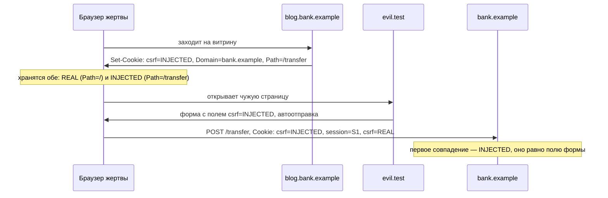

# Обход защиты от CSRF

Форма смены почты в банковском кабинете защищена от подделки запроса: в ней
лежит токен, он длинный и меняется при каждом входе. Вы прогоняете проверку
на стенде, и защита ломается, хотя сам токен вы не трогали. Ход такой: у
банка есть витрина на родственном узле `blog.bank.example`, и через неё вы
ставите браузеру жертвы cookie на весь сайт. После этого заголовок `Cookie`,
который приходит к кабинету, выглядит так:

```text
csrf=INJECTED; session=S1; csrf=REAL
```

Одноимённых cookie в заголовке две, и первой стоит подставленная. У неё
длиннее `Path`, браузер перечисляет cookie с более длинным путём раньше, а
приложение читает первое совпадение по имени. Получается,
что присланный токен приложение сверяет со значением, которое вы же и
подсунули, — и запрос проходит. Такой ход и называют обходом: мера стоит, а
дефект остался, потому что сломано одно звено проверки. Звеньев таких
конечное число, и эта тема разбирает их все: пять дефектов проверки токена,
обходы сверки заголовков и подстановку cookie.

## Три меры и один вопрос

Сама подделка межсайтового запроса разобрана в теме `csrf-mechanics`. Если
коротко: чужая страница отправляет запрос, браузер сам прикладывает к нему
сессионную cookie, и приложение выполняет действие от имени вошедшего
пользователя.
Найти такой дефект на приложении без защиты вовсе удаётся редко. Академия
PortSwigger, учебный полигон авторов Burp Suite, говорит об этом прямо:
работа сводится к обходу уже поставленных мер.

Мер этих три. Первая — синхронизирующий токен: значение, которое приложение
выдаёт своей странице и требует обратно с каждым изменяющим запросом, а у
чужой страницы этого значения нет. Вторая — атрибут `SameSite`, который
запрещает браузеру прикладывать cookie к кросс-сайтовым запросам; ему
посвящена тема `samesite-cookies`. Третья — сверка заголовков `Origin` и
`Referer`: оба поля ставит браузер, и оба говорят, с какой страницы запрос
затеян.

Общее у всех обходов одно. Защита от подделки отвечает на вопрос «затеяла ли
этот запрос страница приложения». Каждый обход находит путь, на котором этот
вопрос не задан вовсе или задан не так. Токен при этом ломать не нужно:
достаточно отправить запрос, в котором токен не спрашивают.

**Зачем это в работе AppSec-инженера.** Набор обходов конечный, и потому
ревью изменяющего действия укладывается в семь вопросов чеклиста. Дороже
всего обходятся два дефекта: проверка, которую пропускают при отсутствии
значения, и токен, не привязанный к сессии. Оба выглядят работающей защитой,
и оба снимаются одним запросом.

## Как это работает

**Откуда это взялось.** Синхронизирующий токен требует места, где приложение
держит выданное значение рядом с сессией. Это состояние на сервере, и оно
мешает: горизонтальное масштабирование, общий кеш сессий, лишняя запись при
каждом входе. Каждая следующая мера — попытка получить тот же результат
дешевле: без хранения, без правки форм, одной строкой в промежуточном слое.
Промежуточный слой — это код, который обрабатывает каждый запрос до
обработчика. Дешевле получается, а вопрос при этом подменяется. Отсюда и набор обходов:
все они бьют не в токен, а в подмену вопроса.

### Пять дефектов проверки токена

Академия перечисляет пять дефектов проверки токена, и различаются они
местом, где проверка теряется: в потоке управления или в источнике
ожидаемого значения.

| Дефект | Что делает атакующий |
|---|---|
| Проверка зависит от метода | шлёт то же действие методом GET |
| Проверка зависит от наличия значения | убирает параметр целиком |
| Ожидаемое значение берут из общего запаса | берёт свой токен из своего кабинета |
| Ожидаемое значение привязано к несессионной cookie | ставит жертве пару cookie и токена |
| Ожидаемым значением служит одноимённая cookie | придумывает значение и ставит его cookie |

Первые два дефекта — про поток управления: проверка стоит внутри ветки, и
мимо ветки есть путь. Здесь важен приём «убрать параметр целиком», а не
«подставить пустое значение». Пустая строка до сравнения доходит и не
совпадает. А отсутствующий параметр в сравнение не попадает вовсе: код часто
написан как «если токен прислан, сверить».

Третий дефект — про то, откуда берётся ожидаемое значение. Приложение держит
общий запас выданных токенов и принимает любой из него, не спрашивая, кому
он выдан. Так пишут, потому что искать значение по запасу проще, чем по
сессии. Атакующий входит своей учётной записью, получает настоящий токен и
вкладывает его в свою страницу. Заметьте: значение здесь подлинное, и
никакая стойкость токена от этого приёма не спасает.

Четвёртый и пятый дефекты требуют от атакующего лишнего: возможности
поставить жертве cookie на этот сайт. Академия оговаривает, что ставить её
может и другой узел того же домена — например, витрина на поддомене. Как
другой узел получает такую возможность, разбирает раздел про подстановку
cookie.

### Что видно в заголовках

Сверку заголовков ставят вместо токена или рядом с ним. Идея в том, что два
поля запроса сообщает браузер, а не страница: `Origin` содержит origin
страницы-инициатора, `Referer` — её адрес. Прогон на стенде из трёх сайтов
показывает, что приложение получает при разных способах отправки запроса.

```text
способ отправки          Origin                   Referer
свой POST-формой         bank.example:8131        bank.example:8131/
чужой POST-формой        evil.test:8132           evil.test:8132/
родственный POST-формой  blog.bank.example:8133   blog.bank.example:8133/
чужой GET-навигацией     —                        evil.test:8132/
чужой POST, referrer=no  null                     —
```

Схема `https://` у всех значений опущена, чтобы строки помещались по ширине.

Три условия обхода читаются прямо из этих строк. Первое: при переходе по
ссылке поля `Origin` нет вовсе. Проверка «если `Origin` есть — сверить»
пропускает изменяющее действие, отправленное методом GET.

Второе условие: поле `Referer` атакующий убирает со своей стороны. Для этого
хватает одной строки разметки — элемента `meta` с политикой `no-referrer`.
Этот элемент задаёт для страницы правило, сколько своего адреса она сообщает
чужим сайтам; с политикой `no-referrer` браузер не прикладывает поле к
исходящим запросам вовсе. По устройству это пометка «не сообщать, откуда вы
пришли» на каждом конверте, который отправляет страница. Академия называет и
причину, по которой приём работает: сверка, написанная как «если заголовок
есть», пропускает запрос без заголовка.

Третье условие — то, чего в академии нет. Убрав `Referer`, атакующий
получает `Origin` со значением `null`: браузер помечает так запрос, чей
источник решил не называть. Про это условие пишет памятка OWASP по защите от
подделки запроса (Cross-Site Request Forgery Prevention Cheat Sheet). Она
описывает распространённую настройку — принимать запрос, если `Origin`
совпал со списком **или** равен `null`, — и оговаривает, что атакующий этим
пользуется. Прогон показывает, как именно он это делает: одной строкой
разметки.

Ещё один факт из этих строк стоит запомнить отдельно: кросс-сайтовый
`Referer` приходит без пути и строки запроса, только origin. Сверка,
написанная на полный адрес, не сработает не у атакующего, а у законного
пользователя, и ревьюер получит не находку, а жалобу на ложный отказ.

### Наивные способы сверки

Академия называет два способа сверки адреса, которые обходятся без всякой
правки заголовков. Первый — проверка на начало строки: адрес
`https://bank.example.evil.test/` начинается с ожидаемого домена, и сверка
его принимает. Второй — проверка на вхождение подстроки: адрес
`https://evil.test/?bank.example` ожидаемый домен содержит, и эта сверка
принимает его тоже.

Оба приёма смотрят не туда. Имя хозяина в адресе стоит не в начале строки и
не где попало. Оно выделяется по правилам URL, после схемы и до первого
одиночного слеша; устройство адреса разбирает тема `url-and-encoding`.
Поэтому верная сверка сравнивает origin целиком, а не ищет его подстрокой —
к такой сверке вернёмся в разделе про защиту.

### Подстановка cookie против наивного double-submit

Четвёртый и пятый дефекты из таблицы живут там же, где этот приём, поэтому
сначала о самом способе сверки. Наивный вариант double-submit — способ
проверять токен, не храня на сервере ничего. Приложение выдаёт одно значение
в двух экземплярах: кладёт его в cookie и в скрытое поле формы. При запросе
сервер сравнивает значение из тела со значением из одноимённой cookie:
совпали — значит, обе копии от одной выдачи. Своей записи о выданных токенах
приложение не держит, и выбирают вариант именно за это: не нужно состояние.

Устройство здесь как у гардеробного номерка. Одна половина номерка лежит у
вас в кармане, вторая приколота к одежде. При возврате гардеробщик сверяет
половинки между собой: журнала выданных номеров у него нет. Cookie —
половинка в кармане, скрытое поле формы — половинка на одежде, сверка на
сервере — совпадение половинок. Аналогия ломается на главном: в гардеробе
чужой не подложит вам в карман свою половинку, а cookie жертве поставить
можно. Поэтому атакующий пишет номер сам, ставит его cookie жертве и кладёт
то же значение в форму: половинки сойдутся.

Как cookie ставит другой узел. Область действия cookie задают атрибуты
`Domain` и `Path`, их устройство разбирает тема `cookies`. Узел вправе
ставить cookie не только себе, но и на родительский домен. Поэтому витрине
`blog.bank.example` разрешено выставить cookie с `Domain=bank.example`, и
браузер прикладывает её к запросам на любой узел сайта. Это и есть
подстановка: cookie пришла не от кабинета, но для браузера она своя.

Прогон показывает, что происходит дальше:

```text
своя cookie на bank.example         session=S1; csrf=REAL
после подстановки с blog.bank       session=S1; csrf=REAL; csrf=INJECTED
заголовок Cookie на /transfer       csrf=INJECTED; session=S1; csrf=REAL
```

Первая строка — обычное состояние. Вторая показывает, что подстановка не
затирает cookie приложения: в браузере живут обе, с одним именем и разной
областью действия. Третья объясняет, почему приём работает. Браузер
сортирует cookie по убыванию длины пути, и атакующий поставил свою с более
длинным `Path`, поэтому в заголовке она оказалась первой. Разбор заголовка,
который берёт первое совпадение по имени, читает значение атакующего.



**Описание схемы.** Схема читается сверху вниз и показывает четыре шага
подстановки. Сначала витрина ставит браузеру жертвы cookie на весь сайт, и в
хранилище начинают жить две одноимённые cookie. Затем чужая страница
отправляет форму со значением, которое атакующий сам же поставил в cookie.
Браузер прикладывает обе cookie, подставленную — первой, и приложение
сравнивает поле формы со значением атакующего.

Cheat sheet называет наивный вариант нерекомендуемым именно из-за
подстановки cookie и перечисляет пути: захват поддомена, уязвимый
родственный узел, подстановка по незашифрованному HTTP. Разбор
рекомендуемого варианта double-submit — тема `csrf-tokens`.

Префикс `__Host-` в имени cookie эту подстановку отбивает. Это договор с
браузером, записанный прямо в имени. Cookie с таким префиксом принимается
только по защищённому соединению, только с `Path=/` и только без атрибута
`Domain` — то есть только с самого узла. Поставить её с родственного узла
нельзя вовсе. Проверено прогоном: попытка поставить `__Host-csrf` с витрины
не изменила ничего.

### Что этими приёмами не обходится

Три меры перечисленным набором не снимаются. Первая — токен, привязанный к
сессии и проверяемый до действия независимо от метода и наличия значения: он
закрывает все пять дефектов целиком. Вторая — свой заголовок запроса:
кросс-сайтово он не отправляется без предварительного разрешения. Прогон это
подтверждает: запрос со своим заголовком до приложения не доходит вовсе.
Третья — поле `Origin`: подделать его со страницы нельзя. Браузер относит
его к запрещённым для скрипта заголовкам — полям, которые страница не вправе
ни поставить, ни изменить.

Единственный общий обход у всего перечисленного — XSS, то есть чужой скрипт,
исполняющийся внутри страницы приложения или на родственном узле того же
сайта. Такой скрипт читает страницу изнутри: токен он берёт оттуда же,
откуда его берёт форма, а заголовки браузер ставит сам, как для своего
запроса. Против XSS перечисленные меры молчат, потому что это не их вопрос.

## Как это выглядит в коде

Ревьюер ищет проверку, у которой есть путь мимо. Разбор первого листинга
идёт двумя планами: найти условие, при котором сверка выполняется, и найти,
откуда берётся ожидаемое значение. До выносок ответьте сами: сколько путей
мимо проверки в этом одном условии?

```javascript
// УЯЗВИМО — демонстрация, не для продакшена
app.post('/email/change', (req, res) => {
  const sent = req.body.csrf;
  if (sent && sent !== issuedTokens.get(sent)) {        // (1)
    return res.status(403).end('токен не сошёлся');
  }
  changeEmail(req.session.user, req.body.email);        // (2)
  res.end('ок');
});
```

1. Два дефекта в одном условии. Проверка выполняется, только когда значение
   прислано: запрос без параметра ветку не заходит, и это второй дефект из
   таблицы. И ожидаемое значение берётся из общего запаса выданных, а не из
   сессии этого пользователя — это третий.
2. Действие выполняется после обеих дыр, поэтому любая из них ведёт к нему.

Тут вся тема сжалась в одно условие: сломана не стойкость токена, а
постановка проверки. Каким одним запросом вы бы увидели это на живом
приложении?

Признаки, по которым ревьюер узнаёт эти дефекты, такие. Условие вида «если
значение прислано». Поиск ожидаемого значения в общем словаре, а не в
сессии. Проверка внутри обработчика одного метода, когда действие достижимо
и другим. Сверка заголовка, написанная через `startsWith` или `includes`.
Сравнение с cookie того же имени без записи на стороне сервера.

**Тот же дефект на другом стеке.** В Django общая проверка токена стоит
промежуточным слоем, и дыра появляется там, где этот слой снимают. Декоратор
`csrf_exempt` снимает его с одной функции. Где здесь запрос уйдёт мимо
сверки — ответьте до разбора:

```python
# УЯЗВИМО — демонстрация, не для продакшена
@csrf_exempt
def change_email(request):
    ref = request.headers.get("Referer", "")
    if ref.startswith("https://bank.example"):
        request.user.email = request.POST["email"]
        request.user.save()
    return HttpResponse("ок")
```

Проверка на начало строки пропускает `https://bank.example.evil.test/`:
адрес начинается с ожидаемого домена, а принадлежит чужому сайту. Порядок
условия здесь важнее самой сверки. Записанное так, оно при отсутствии
заголовка действие не выполнит. Обратная запись — «отказать, если заголовок
есть и не совпал» — пропустит запрос без заголовка целиком.

## Как защититься

Правило одно: проверка ставится до действия, выполняется всегда и сравнивает
присланное значение со значением этой сессии. Исправленный обработчик
читается тремя планами: закрыть смену метода, привязать ожидаемое значение к
сессии, не оставить обхода через отсутствие значения.

```javascript
// Исправлено.
import { timingSafeEqual } from 'node:crypto';

app.all('/email/change', (req, res) => {
  if (req.method !== 'POST') return res.status(405).end();     // (1)
  const expected = req.session.csrfToken;                      // (2)
  const sent = String(req.body.csrf ?? '');
  if (!expected || sent.length !== expected.length ||          // (3)
      !timingSafeEqual(Buffer.from(sent), Buffer.from(expected))) {
    return res.status(403).end('токен не сошёлся');
  }
  changeEmail(req.session.user, req.body.email);
  res.end('ок');
});
```

1. Метод ограничен до действия, а не внутри ветки проверки: обработчик
   принимает любой метод, и всё, кроме POST, получает отказ 405. Первый
   дефект закрыт, потому что пути мимо этой ветки нет.
2. Ожидаемое значение берётся из сессии этого пользователя, а не из общего
   запаса. Чужой настоящий токен здесь бесполезен: сравнивается он не с ним.
3. Отсутствие значения — отказ: пустая строка не сойдётся ни длиной, ни
   содержимым. Функция `timingSafeEqual` требует буферы равной длины,
   поэтому длина сверяется до неё, а само сравнение идёт одинаковое время
   при любом входе. Обычное сравнение строк останавливается на первом
   различии, и по длительности ответа можно подбирать значение посимвольно;
   здесь это исключено.

Сверим исправление с таблицей дефектов. Смена метода закрыта ограничением до
действия. Отсутствие значения закрыто отказом по умолчанию. Значение из
сессии делает бесполезными и чужой токен из общего запаса, и пару «cookie
плюс поле формы». С сессионным значением совпадёт только токен, выданный
этой сессии. Пятый дефект закрыт тем же: одноимённая cookie здесь не
читается вовсе.

**Что остаётся за пределами правила.** Сверка заголовков токен не заменяет.
Cheat sheet допускает её как второй рубеж и как меру для запросов до входа,
когда сессии ещё нет. Пишут её тремя правилами. Первое: адрес из заголовка
разбирают по правилам URL и достают из него origin, а не сравнивают как
строку. Второе: origin сравнивают точным равенством со списком доверенных.
Третье: отсутствие обоих заголовков и значение `null` в `Origin` считают
отказом, а не разрешением.

Отдельный случай описывает требование ASVS v5.0-3.5.2.
Оно касается приложений, которые полагаются на предварительный запрос
совместного использования ресурсов (Cross-Origin Resource Sharing, CORS).
Это разрешение, которое браузер запрашивает у сервера перед кросс-сайтовым
запросом с нестандартными полями; устройство механизма разбирает тема
`cors`. Такое приложение обязано убедиться, что действие нельзя вызвать
запросом, который предварительного не вызывает.

**Что чинится не в коде.** Подстановка cookie с родственного узла закрывается
двумя мерами вне обработчика. Первая — префикс `__Host-` в имени cookie, его
требует ASVS v5.0-3.3.3: браузер сам отказывает чужому узлу, и коду
приложения делать ничего не нужно. Вторая — разнесение ненадёжного
содержимого на отдельный сайт: пользовательские файлы и витрины держат не
там, где стоит кабинет. Обе меры не попадают в обработчик по одной причине:
они про то, откуда cookie вообще может прийти, а обработчик видит запрос
уже после прихода.

Убедиться, что правило стоит, помогают те же четыре запроса, что ставит
задача в конце темы. Первые три — без токена, методом GET, с чужим токеном —
обязаны получить отказ. Четвёртый, запрос без `Referer` с настоящим токеном,
пройдёт, и это не дефект: сверка заголовков здесь второй рубеж, а не замена
токена.

## Частая ошибка

Часто слышно: токен в форме есть, значит, защита от подделки запроса стоит.
Дальше проверять нечего — остаётся убедиться, что поле не пустое. Что здесь
перепутано — ответьте себе прежде разбора.

**Наличие токена и проверка токена — разные утверждения.** Токен виден в
разметке страницы, а проверка живёт на сервере, и увидеть её можно только по
поведению. Три из пяти дефектов академии выглядят на странице одинаково
хорошо: токен есть, он длинный, он меняется от входа к входу.

Случай, который это ломает. Приложение выдаёт токен, кладёт его в скрытое
поле и сверяет — но с общим запасом выданных, а не с сессией. Атакующий
входит своей учётной записью, забирает свой токен и вкладывает его в форму
на своей странице. Токен настоящий, проверка проходит, действие выполняется
от имени жертвы. Проверяется это одним запросом: подставить в форму токен
другой сессии и посмотреть, откажет ли приложение.

## Чеклист для ревью

1. Проверьте, что проверка токена выполняется при любом методе запроса, а не
   только у того, которым форма отправляется штатно (ASVS v5.0-3.5.1).
2. Проверьте, что отсутствие токена в запросе даёт отказ, а не пропуск
   проверки.
3. Проверьте, что ожидаемое значение берётся из сессии этого пользователя,
   а не из общего запаса выданных.
4. Проверьте, что сверка заголовка `Origin` или `Referer` сравнивает origin
   целиком, а не начало строки и не вхождение подстроки.
5. Проверьте, что отсутствие обоих заголовков и значение `null` в `Origin`
   считаются отказом, а не разрешением.
6. Проверьте, что cookie с токеном несёт префикс `__Host-`, если защита
   сверяет присланное значение с cookie (ASVS v5.0-3.3.3).
7. Проверьте, что ненадёжное содержимое вынесено с того сайта, где стоят
   изменяющие действия (WSTG-v42-SESS-05).

## Попробуй сам

Возьмите приложение, с которым работаете, и выберите одно изменяющее
действие. Проведите над ним четыре запроса. Первый — без параметра с
токеном. Второй — методом GET. Третий — с токеном другой сессии. Четвёртый —
без заголовка `Referer`.

**Наблюдаемый критерий:** четыре строки с кодом ответа и с тем, изменилось
ли состояние. Плюс одно предложение о том, какой из четырёх результатов вы
бы завели дефектом и почему остальные три — нет.

## Проверь себя

1. Проверка токена в приложении:

   ```python
   def check(req):
       sent = req.form.get("csrf")
       if sent and sent != expected(req):
           abort(403)
   ```

   Пройдёт ли она форму без поля `csrf` и почему?

2. Токен выдаётся в форму и сверяется с cookie того же имени (double-submit).
   Какую починку вы выберете?

   А. Сверять токен с общим запасом выданных сервером.

   Б. Привязать токен к сессии, а cookie назвать с префиксом `__Host-`.

   В. Убрать cookie и оставить единственный рубеж — сверку `Referer`.

3. Почему префикс `__Host-` закрывает подстановку cookie с родственного узла?

4. Не запуская, предскажите оба кода, которые напечатает прогон.

   ```python
   def check(form):
       sent = form.get("csrf")
       if sent and sent != "S1-token":
           return 403
       return 200

   print(check({}), check({"csrf": "wrong"}))
   ```

5. Возврат к теме `csrf-mechanics`: почему XSS снимает все перечисленные меры
   сразу?

<details markdown="1">
<summary>Ответ 1</summary>

1. Пройдёт: `req.form.get("csrf")` вернёт `None`, условие `if sent` ложно, и
   до сравнения дело не доходит. Отсутствующий параметр не попадает в ветку
   сверки вовсе — этим «убрать параметр» и отличается от «прислать пустой»:
   пустой в сравнение попадает и не совпадает.

</details>

<details markdown="1">
<summary>Ответ 2 и разбор вариантов</summary>

2. Верный ответ — Б.

   А. Общий запас не привязан к сессии: атакующий входит своей учётной
      записью, забирает настоящий токен и вкладывает его в свою страницу.
      Проверка проходит, действие выполняется от имени жертвы — контрпример
      из «Частой ошибки».

   Б. Привязка к сессии делает чужой токен бесполезным. Префикс `__Host-`
      запрещает ставить такую cookie с другого узла и требует `Path=/`:
      подстановка с родственного узла закрыта.

   В. Сверка `Referer` как единственный рубеж обходится дважды: элемент
      `meta` с `no-referrer` убирает заголовок из запроса, а наивное
      сравнение по началу строки пропускает подобранный адрес.

</details>

<details markdown="1">
<summary>Ответ 3</summary>

3. Префикс — договор с браузером: такую cookie принимают только по
   защищённому соединению, только с самого узла и только с `Path=/`.
   Поставить её с родственного поддомена или по незашифрованному HTTP
   браузер откажется.

</details>

<details markdown="1">
<summary>Ответ 4</summary>

4. `200 403`: форма без поля проходит, неверное значение получает отказ.

   ```bash
   python3 tok.py
   ```

   ```text
   200 403
   ```

   Первый код — и есть дефект из первого вопроса: условие сверки написано
   так, что без параметра запрос в ветку не попадает.

</details>

<details markdown="1">
<summary>Ответ 5</summary>

5. Скрипт исполняется в origin приложения и читает страницу. Токен он берёт
   оттуда же, откуда его берёт форма, а заголовки браузер ставит сам как для
   своего запроса.

</details>

## Источники

1. PortSwigger Web Security Academy, «Cross-site request forgery (CSRF)» и
   её подстраницы «Bypassing CSRF token validation» и «Bypassing
   Referer-based CSRF defenses»; реестр `ps-csrf`. Разделы: What is a CSRF
   token, Common flaws in CSRF token validation, Validation of Referer depends
   on header being present, Validation of Referer can be circumvented.
   <https://portswigger.net/web-security/csrf>
2. OWASP Cross-Site Request Forgery Prevention Cheat Sheet; реестр
   `owasp-cs-csrf-prevention`. Разделы: Naive Double-Submit Cookie Pattern,
   Using Standard Headers to Verify Origin, Identifying the Target Origin,
   Using Cookies with Host Prefixes to Identify Origins.
   <https://cheatsheetseries.owasp.org/cheatsheets/Cross-Site_Request_Forgery_Prevention_Cheat_Sheet.html>

Каркас этапа: `owasp-asvs-5-document` (ASVS v5.0.0), `owasp-wstg-42`,
`owasp-top10-2025`. Наследуются всеми темами и отдельной строкой не
повторяются.

**Скоропортящийся слой.** Политика браузеров по заголовку `Referer` менялась
и продолжает меняться: объём того, что уходит кросс-сайтово, сокращают.
Страницы академии и cheat sheet — живые площадки без даты публикации.

**Маркеры уверенности.** Заголовки, которые приложение получает при разных
способах отправки, подстановка cookie с родственного узла и порядок значений
в заголовке `Cookie` — **проверено лично** 2026-08-24 в
`HeadlessChrome/152.0.7977.42` на Node.js v26.7.0 на стенде из трёх сайтов по
HTTPS на петле. Проверено: при кросс-сайтовом переходе по ссылке поле `Origin`
отсутствует; элемент `meta` с политикой `no-referrer` убирает `Referer` и
переводит `Origin` в значение `null`; кросс-сайтовый `Referer` приходит без
пути и строки запроса; cookie, поставленная родственным узлом на весь сайт, не
затирает одноимённую cookie приложения, а встаёт в заголовок первой при более
длинном значении `Path`; попытка поставить cookie с префиксом `__Host-` с
родственного узла не проходит; кросс-сайтовый запрос со своим заголовком до
приложения не доходит. Пять дефектов проверки токена и два наивных способа
сверки адреса — **по документации** (Web Security Academy, открыта лично
2026-08-24). Разбор наивного double-submit, приём с принятием значения `null`
и запрещённые для скрипта заголовки — **по документации** (Cross-Site Request
Forgery Prevention Cheat Sheet, открыт лично 2026-08-24). Требования 3.5.1,
3.5.2 и 3.3.3 сверены с текстом ASVS v5.0.0 (открыт лично 2026-08-24).
Захват поддомена и подстановка cookie по незашифрованному HTTP лично **не
воспроизводились**. Поведение Django **не воспроизводилось**: листинг
показывает форму дефекта, а не прогон.
