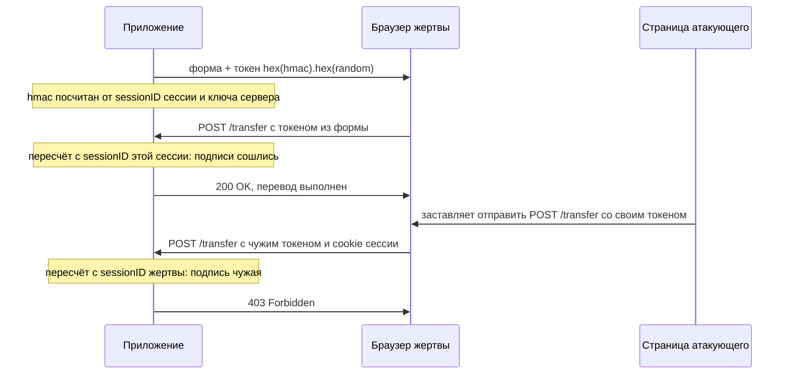

# Синхронизирующий токен и double-submit

Два приложения защищаются от подделки запроса, и снаружи они неотличимы: оба
выдают cookie с именем `csrf` и сверяют её со скрытым полем формы. А ломается
одно. На прогоне из темы `csrf-bypass` атакующий ставит браузеру жертвы свою
cookie и присылает её же значение в теле запроса — проверка первого
приложения такой запрос пропускает. Второе той же подстановкой не берётся,
потому что его токен подписан серверным ключом и привязан к сессии.

Разница не видна ни в разметке, ни в заголовках: она в том, что именно
подписано и где лежит значение, с которым сверяет сервер. Обе схемы
называются double-submit, и эта тема — про их устройство и цену каждой.

## Как это работает

**Откуда это взялось.** Приложению нужен признак, который есть у его
собственной страницы и которого нет у чужой. Cookie таким признаком быть не
может: браузер прикладывает её к обоим запросам, и к своему, и к
подделанному. На этом и строится атака из темы `csrf-mechanics`. Остаётся
содержимое ответа: чужая страница отправить запрос может, а прочитать ответ
ей не даёт политика одного источника (`same-origin-policy`). Отсюда и вся
конструкция защиты: приложение кладёт значение в свой ответ и требует его
назад. Всё остальное в теме — про то, где хранить ожидаемое значение и чем
приходится платить за отказ от хранения.

**Зачем это в работе AppSec-инженера.** Разница между двумя вариантами
double-submit — то, что чаще всего пропускают в ревью, потому что снаружи
они выглядят одинаково. Вопрос, который их различает, один: что мешает
атакующему поставить жертве свою cookie и прислать своё же значение.

### Синхронизирующий токен

Синхронизирующий токен — значение, которое приложение выдаёт своей странице
и требует обратно при изменяющем действии. Ожидаемое значение лежит на
сервере рядом с сессией, и проверка сводится к сравнению присланного с
сохранённым.

Бытовой пример — код подтверждения при получении заказа. Магазин присылает
код вам в SMS, а при вручении вы называете его курьеру, и тот сверяет код со
своей записью. Соответствие такое: SMS — это страница приложения, куда
кладётся токен, код — сам токен, курьер — сервер, который проверяет значение
перед действием. Ломается аналогия на канале доставки: SMS идёт отдельным
путём, а токен приходит в том же ответе, что и страница. Поэтому вся схема
держится на том, что чужая страница этот ответ прочитать не может.

Требования к токену перечисляет Cross-Site Request Forgery Prevention Cheat
Sheet — памятка OWASP по защите от подделки запроса, дальше в теме она
называется Cheat sheet. Требований три: токен уникален на сессию
пользователя, секретен и непредсказуем. Непредсказуем здесь значит, что
значение нельзя угадать или вычислить из известного атакующему. Номер
попытки или адрес электронной почты не годятся, нужен вывод
криптографического генератора случайных чисел. Web Security Academy —
учебный раздел PortSwigger, дальше в теме он называется академией, —
добавляет четвёртое требование, уже про проверку: строгая сверка перед
каждым действием.

Выдавать токен можно раз на сессию или раз на запрос. Cheat sheet называет
второй вариант надёжнее, потому что окно для украденного токена короче. И
тут же называет цену: кнопка «назад» в браузере возвращает страницу со
старым токеном, и приложение отказывает законному пользователю.

Токен уходит на страницу скрытым полем формы, значением своего заголовка
запроса или полем ответа JSON. В cookie токен для этой схемы не передаётся:
cookie браузер приложит и к чужому запросу, и признак перестанет быть
признаком. В адрес токен не попадает тоже: строка запроса оседает в
журналах, в истории браузера и в заголовке `Referer` при переходе на чужой
сайт.

Академия добавляет к этому одну деталь вёрстки: скрытое поле с токеном
ставится в разметке как можно раньше, до полей с данными пользователя.
Механика такая. Чужая разметка попадает в документ через данные
пользователя, вставленные в страницу. Незакрытый внедрённый тег уносит в
свой атрибут всё, что стоит после точки внедрения, — например, в адрес
картинки на сервере атакующего. Захват работает только вперёд по разметке,
поэтому токен в поле до точки внедрения в этот атрибут не попадает.

Проверка описана одним правилом: сверять присланное с тем, что сохранено в
сессии, вне зависимости от метода запроса и типа содержимого. Отсутствие
токена обрабатывается как неверный токен, иначе атакующему достаточно не
присылать поле вовсе.

### Double-submit: наивный и подписанный

Хранение ожидаемого значения на сервере — это состояние, а состояние стоит
места и усложняет раздачу нагрузки на несколько узлов. Значение лежит в
памяти одной копии приложения, а следующий запрос того же пользователя
балансировщик может отдать другой копии. Там ожидаемого значения нет, и
приходится заводить общее хранилище или привязывать сессию к узлу.
Double-submit убирает хранение: ожидаемое значение приложение кладёт в
cookie, а присланное в теле или заголовке сверяет с ней. Дальше варианты
расходятся.

Наивный вариант сверяет значение из тела запроса с одноимённой cookie, и
всё. Записи о выданных токенах приложение не держит, поэтому не может
отличить своё значение от чужого. Достаточно поставить жертве cookie с
известным значением и прислать его же в теле. Прогон из темы `csrf-bypass`
показывает, что такая подстановка с родственного узла даже не затирает
cookie приложения: обе живут рядом. В заголовке первой встаёт та, у которой
длиннее `Path`, и разбор по первому совпадению читает значение атакующего.
Cheat sheet называет наивный вариант нерекомендуемым именно из-за этой
подстановки.

Подписанный вариант закрывает её привязкой к сессии. Токен собирается из
двух частей, идентификатора сессии и случайного значения, и скрепляется
подписью на серверном ключе. Подпись здесь считается через HMAC
(Hash-based Message Authentication Code) — способ посчитать от сообщения и
секретного ключа короткую строку, которую без ключа не подделать. Это как
контрольная сумма файла, только с секретом: контрольную сумму пересчитает
любой, а HMAC — только тот, у кого есть ключ. Поэтому хранить выданные
токены не нужно: сервер пересчитывает подпись и верит токену, чья подпись
сошлась.

Сборка токена выглядит так:

```text
message   = длина(sessionID) "!" sessionID "!" длина(random) "!" random
hmac      = HMAC-SHA256(secret, message)
csrfToken = hex(hmac) "." hex(random)
```

Клиенту уходит подпись и случайная часть; идентификатор сессии на клиента
не попадает. Проверка повторяет сборку: берёт случайную часть из присланного
токена, идентификатор сессии — из текущей сессии, считает HMAC заново и
сравнивает подписи за постоянное время. Так называют сравнение, которое
всегда читает обе строки целиком. Обычное сравнение останавливается на
первом различии, и по времени ответа можно угадать, сколько начальных
символов совпало, — так значение подбирают по одному символу. Подставленная
cookie здесь не помогает: атакующий не знает ни серверного ключа, ни
идентификатора сессии жертвы, и подпись чужой пары не сойдётся.



**Описание схемы.** Схема читается сверху вниз. Приложение отдаёт страницу
вместе с токеном, подписанным от идентификатора сессии. Свой запрос браузер
присылает с этим токеном, и пересчитанная подпись сходится. Страница
атакующего вкладывает в подделанный запрос токен, выданный её собственной
сессии, — но пересчёт идёт с идентификатором жертвы, и подпись не сходится.

Cheat sheet отдельно предупреждает про две ошибки в этой схеме. Первая —
подпись без привязки к сессии. Если идентификатора сессии в подписываемом
сообщении нет, токен, выданный атакующему, подойдёт и жертве. Защиты при
этом почти не остаётся. Вторая — метка времени внутри токена: она не нужна,
потому что токен — не пропуск со сроком годности, а признак сессии, и новая
сессия получает новый токен.

### Свой заголовок вместо токена

Приложение без элементов `form`, например API, к которому ходит скрипт
страницы, закрывается иначе. Cheat sheet описывает схему без токена вовсе:
клиент добавляет к каждому изменяющему запросу свой заголовок, а сервер
проверяет его наличие. Свой здесь значит, что заголовок вне того набора,
который умеет ставить форма. Держится схема на предварительном запросе из
механики CORS (Cross-Origin Resource Sharing; тема `cors`). Кросс-сайтовый
запрос со своим заголовком браузер отправляет только после предварительного
запроса и разрешения сервера. Форма с чужой страницы такой заголовок
поставить не умеет, поэтому её запрос идёт без него сразу.

Проверено прогоном: кросс-сайтовый запрос со своим заголовком до приложения
не доходит вовсе, и действие не выполняется. Тот же запрос без своего
заголовка доходит, действие выполняется, а ответ атакующему браузер не
отдаёт. Второй результат важнее первого: он показывает, что закрытый от
чтения ответ подделку запроса не останавливает. Останавливает её именно
проверка заголовка.

Схема эта требует внимания к настройке CORS. Cheat sheet предупреждает: если
приложение разрешает запросы с учётными данными и подставляет в
`Access-Control-Allow-Origin` любой поддомен по шаблону, захваченный
поддомен получает право ставить свой заголовок.

Отдельным случаем Cheat sheet называет тип содержимого. Форма отправляет
запрос, который предварительного не требует, и одним из допустимых типов
у неё бывает `text/plain`. Поэтому интерфейс JSON, принимающий `text/plain`,
остаётся достижимым формой с чужой страницы: тело она запишет, а заголовка
не будет. Проверка типа содержимого становится здесь частью самой защиты.

### Вариант для готовых интерфейсов

Cheat sheet описывает схему «из cookie в заголовок», принятую в
одностраничных приложениях (single-page application, SPA). Одностраничное
значит, что страница загружается один раз, а дальше скрипт сам ходит в API.
Сервер кладёт токен в cookie, доступную скрипту; скрипт своего же origin
читает её и ставит значение своим заголовком; сервер сверяет заголовок с
cookie.

Чужая страница не может ни прочитать эту cookie, ни поставить свой
заголовок. Angular делает оба шага сам через `HttpClient`, React и Vue
требуют перехватчика — куска кода, который добавляет заголовок к каждому
исходящему запросу. Это тот же double-submit, и относится к нему всё
сказанное выше: без привязки к сессии он остаётся наивным.

### Вход, у которого сессии ещё нет

Отдельно Cheat sheet разбирает форму входа. Подделка запроса работает и на
ней, хотя вошедшего пользователя ещё нет: атакующий заставляет браузер
жертвы отправить форму входа с его, атакующего, логином и паролем. Жертва
оказывается в чужом кабинете, не подозревая об этом, и наполняет его своими
данными — например, привязывает карту. Атакующему остаётся зайти в свой
кабинет и забрать введённое.

Закрывается это предсессиями: приложение заводит сессию до входа и кладёт в
неё токен формы входа. После успешного входа предсессию уничтожают и
заводят новую. Если этого не сделать, появляется закрепление сессии.
Известный до входа идентификатор продолжает действовать после него, и тот,
кто его знал, оказывается в чужой сессии.

## Как это выглядит в коде

Ревьюер ищет, откуда берётся ожидаемое значение. Разбор идёт тремя планами:
найти место, где берётся ожидаемое значение; назвать, кто управляет каждой
из двух сравниваемых величин; назвать вопрос, которого в проверке нет.
Найдите это место в листинге сами, прежде чем читать выноски.

```javascript
// УЯЗВИМО — демонстрация, не для продакшена
app.post('/transfer', (req, res) => {
  const fromCookie = parseCookies(req).csrf;          // (1)
  if (req.body.csrf !== fromCookie) {                 // (2)
    return res.status(403).end();
  }
  transfer(req.session.user, req.body.to, req.body.amount);
  res.end('ок');
});
```

1. Ожидаемое значение целиком приходит от клиента. Сервер не знает, он ли
   его выдал.
2. Сравниваются два значения, которыми управляет один и тот же браузер.
   Поставивший cookie управляет обоими.

Этот обработчик показывает тему с отрицательной стороны: проверка на месте,
а вопроса «мы ли выдали это значение» в ней нет. Что изменится для
атакующего, если сравнение здесь заменить на сверку за постоянное время?

Признаки такие. Сравнение присланного значения с одноимённой cookie без
подписи. Имя cookie с токеном без префикса `__Host-` — чем этот префикс
отбивает подстановку, показано прогоном в теме `csrf-bypass`. Хранение
ожидаемого значения в общем словаре приложения, а не в сессии. Токен в
строке запроса. Сравнение токенов оператором равенства там, где рядом стоит
подпись.

**Тот же дефект на другом стеке.** В Django и Laravel защита включена по
умолчанию, и опасны не обработчики, а исключения из них. Обычный вид — своя
проверка, написанная вместо штатной; чем она здесь уязвима, скажите до
разбора:

```python
# УЯЗВИМО — демонстрация, не для продакшена
@csrf_exempt
def transfer(request):
    if request.POST.get("csrf") != request.COOKIES.get("csrf"):
        return HttpResponseForbidden()
    do_transfer(request.user, request.POST["to"])
    return HttpResponse("ок")
```

Инвариант тот же: ожидаемое значение пришло от клиента. Декорация — язык и
то, что штатную защиту пришлось снять декоратором.

## Как защититься

Правило одно: ожидаемое значение либо лежит на сервере, либо связано с
сессией подписью на серверном ключе. Исправленный обработчик читается теми
же планами, что и уязвимый. Ожидаемое значение теперь считается, а не
принимается, и обеими сравниваемыми величинами распоряжается сервер. Вопрос
«мы ли выдали это значение» стал телом проверки.

```javascript
// Исправлено.
import { createHmac, randomBytes, timingSafeEqual } from 'node:crypto';

const sign = (sid, rnd) => createHmac('sha256', SECRET)          // (1)
  .update(`${sid.length}!${sid}!${rnd.length}!${rnd}`).digest('hex');

app.post('/transfer', (req, res) => {
  const [mac, rnd] = String(req.body.csrf ?? '').split('.');     // (2)
  const expected = rnd ? sign(req.sessionID, rnd) : null;
  if (!expected || mac.length !== expected.length ||             // (3)
      !timingSafeEqual(Buffer.from(mac), Buffer.from(expected))) {
    return res.status(403).end();
  }
  transfer(req.session.user, req.body.to, req.body.amount);
  res.end('ок');
});
```

1. Подпись берётся на серверном ключе и включает идентификатор сессии. Длины
   частей входят в подписываемое сообщение, чтобы склейка не давала двух
   разных разборов.
2. Клиент присылает подпись и случайную часть. Идентификатор сессии сервер
   берёт у себя, а не из запроса.
3. Отсутствие токена — отказ. Время сверки не зависит от того, где строки
   разошлись.

Убедиться в починке можно тем же приёмом, которым ломали: поставить браузеру
свою cookie `csrf` и прислать её значение в теле. У наивного варианта такой
запрос проходил, у привязанной к сессии схемы он получает отказ, потому что
подпись чужой пары не сходится. Именно такой прогон делает лаба темы
`csrf-mechanics`: три опыта эксплойта на решении не проходят, семь тестов
функциональности зелёные.

**Чем платит каждый вариант.** Синхронизирующий токен требует места для
состояния и ломается на кнопке «назад», если выдаётся на каждый запрос.
Подписанный double-submit состояния не требует, но требует ключа: его надо
хранить, раздавать узлам и уметь менять. Свой заголовок не требует ни того,
ни другого, но применим только там, где запросы шлёт скрипт, а не форма.

**Что снимает любой из них.** Межсайтовое выполнение скриптов (Cross-Site
Scripting, XSS) — чужой скрипт, оказавшийся в origin приложения или на
родственном узле того же сайта. Такой скрипт читает токен со страницы, и
никакая сборка токена от этого не спасает. Cheat sheet выделяет это
полужирным и ставит первым пунктом.

**Что ставится рядом.** Явное значение `SameSite` у сессионной cookie
(тема `samesite-cookies`) и префикс `__Host-` у cookie с токеном
(ASVS v5.0-3.3.3). Третья мера — сверка полей `Sec-Fetch-*` там, где сессии
ещё нет; сами эти поля введены в теме `csrf-mechanics`.

## Частая ошибка

Часто слышно: значение в cookie и такое же значение в форме — это и есть
защита, потому что чужой сайт cookie не прочитает. Прочитать он и правда не
может, значит, и подделать запрос не может. Какой шаг в этом рассуждении
неверен?

**Атакующему не нужно читать cookie — ему нужно её поставить.** Проверка
сравнивает два значения, и оба приходят из одного браузера. Тот, кто может
записать cookie на этот сайт, назначает оба.

Случай, который это ломает, проверен на стенде. Родственный узел
`blog.bank.example` ставит cookie `csrf` на весь сайт. В браузере оказываются
две cookie с этим именем: своя и подставленная. В заголовке первой идёт
подставленная, потому что у неё длиннее `Path`, и разбор по первому
совпадению читает значение атакующего. Приложение сверяет присланное с ним
же и пропускает запрос. Полный разбор приёма — в теме `csrf-bypass`.

## Чеклист для ревью

1. Проверьте, что ожидаемое значение токена берётся из сессии на сервере либо
   связано с ней подписью на серверном ключе (ASVS v5.0-3.5.1).
2. Проверьте, что токен передаётся скрытым полем формы, своим заголовком или
   полем ответа, но не строкой запроса.
3. Проверьте, что отсутствие токена даёт отказ, а сверка выполняется при любом
   методе и любом типе содержимого.
4. Проверьте, что подписи сравниваются за постоянное время, а не оператором
   равенства строк.
5. Проверьте, что cookie с токеном несёт префикс `__Host-`, если схема сверяет
   присланное значение с cookie (ASVS v5.0-3.3.3).
6. Проверьте, что форма входа защищена предсессией с токеном, а после входа
   сессия заводится заново (WSTG-v42-SESS-05).
7. Проверьте, что интерфейс, закрытый своим заголовком, не принимает типов
   содержимого, при которых предварительный запрос не отправляется
   (ASVS v5.0-3.5.2).

## Попробуй сам

Возьмите приложение, с которым работаете, и найдите, чем закрыто одно
изменяющее действие. Ответьте письменно на три вопроса. Откуда сервер берёт
ожидаемое значение. Что произойдёт, если поставить браузеру жертвы cookie с
этим именем. Что произойдёт, если прислать запрос без токена вовсе.

**Наблюдаемый критерий:** три ответа со ссылкой на строку кода или на
настройку, где это видно. Плюс вывод, к какому из разобранных вариантов
относится схема приложения и чем она платит.

## Проверь себя

1. В запросе две cookie `csrf` — своя и подставленная:

   ```http
   POST /transfer
   Cookie: csrf=evil; csrf=app

   csrf=evil
   ```

   Сервер сверяет тело с первой cookie этого имени. Что он решит и почему?

2. Чем починить наивный double-submit?

   А. Сравнивать токены за постоянное время.

   Б. Подписывать пару из идентификатора сессии и случайного значения
      серверным ключом.

   В. Хранить выданные токены в общем словаре приложения.

3. Одинаковая случайная часть, разные сессии. Не запуская, предскажите вывод.

   ```python
   import hmac, hashlib

   def make(sid, rnd):
       return hmac.new(b"k", (sid + "!" + rnd).encode(),
                       hashlib.sha256).hexdigest()

   print(hmac.compare_digest(make("S1", "r9"), make("S2", "r9")))
   ```

4. Возврат к теме `csrf-bypass`: какой одиночный приём ломает наивный
   double-submit?

<details markdown="1">
<summary>Ответ 1</summary>

1. Пропустит: первой в заголовке идёт подставленная cookie — у неё длиннее
   `Path`, и разбор по первому совпадению читает значение атакующего. Тело с
   ним совпадает, потому что оба значения поставил он же: проверка сравнивает
   два значения из одного браузера, а не своё с чужим.

</details>

<details markdown="1">
<summary>Ответ 2 и разбор вариантов</summary>

2. Верный ответ — Б.

   А. Постоянное время закрывает подбор по замерам, а здесь подбирать нечего:
      оба значения атакующий назначает сам. Дефект не в сравнении, а в том,
      откуда взято ожидаемое.

   Б. Подстановка cookie больше не помогает: атакующий не знает ни серверного
      ключа, ни идентификатора сессии жертвы, и подпись чужой пары не
      сойдётся.

   В. Общий словарь не привязан к сессии: атакующий забирает настоящий токен в
      своём кабинете и вкладывает его в свою страницу — запас сходится.

</details>

<details markdown="1">
<summary>Ответ 3</summary>

3. `False`: подпись считается от пары «сессия + случайное», и при другой
   сессии та же случайная часть даёт другую подпись.

   ```text
   $ python3 hmacdemo.py
   False
   ```

   Поэтому подписанный вариант и закрывает подстановку: знание чужого токена
   к своей сессии не привяжешь.

</details>

<details markdown="1">
<summary>Ответ 4</summary>

4. Подстановка cookie с этим именем: с родственного узла, при захвате
   поддомена или по незашифрованному HTTP.

</details>

## Источники

1. OWASP Cross-Site Request Forgery Prevention Cheat Sheet; реестр
   `owasp-cs-csrf-prevention`. Разделы: Token-Based Mitigation, Synchronizer
   Token Pattern, Transmitting CSRF Tokens in Synchronized Patterns, Signed
   Double-Submit Cookie, Employing HMAC CSRF Tokens, Naive Double-Submit
   Cookie Pattern, Disallowing simple requests, Employing Custom Request
   Headers for AJAX/API, CSRF Prevention in modern Frameworks, Possible CSRF
   Vulnerabilities in Login Forms.
   <https://cheatsheetseries.owasp.org/cheatsheets/Cross-Site_Request_Forgery_Prevention_Cheat_Sheet.html>
2. PortSwigger Web Security Academy, «Cross-site request forgery (CSRF)», в
   том числе подстраница «How to prevent CSRF vulnerabilities»; реестр
   `ps-csrf`. Разделы: Use CSRF tokens, How should CSRF tokens be generated,
   How should CSRF tokens be transmitted, How should CSRF tokens be validated.
   <https://portswigger.net/web-security/csrf>

Каркас этапа: `owasp-asvs-5-document` (ASVS v5.0.0), `owasp-wstg-42`,
`owasp-top10-2025`. Наследуются всеми темами и отдельной строкой не
повторяются.

**Скоропортящийся слой.** Cheat sheet меняет рекомендации по вариантам
double-submit: наивный вариант в нём уже помечен нерекомендуемым, и пометка
может стать запретом. Имена заголовков и cookie у фреймворков привязаны к их
версиям. Страницы академии и Cheat sheet — живые площадки без даты публикации.

**Маркеры уверенности.** Поведение браузера — **проверено лично** 2026-08-24 в
`HeadlessChrome/152.0.7977.42` на Node.js v26.7.0 на стенде из трёх сайтов по
HTTPS на петле. Проверено: кросс-сайтовый запрос со своим заголовком до
приложения не доходит и действия не выполняет; тот же запрос без своего
заголовка доходит и действие выполняет, а ответ браузер атакующему не отдаёт;
cookie, поставленная родственным узлом на весь сайт, не затирает одноимённую
cookie приложения и встаёт в заголовок первой при более длинном значении
`Path`. Синхронизирующий токен с привязкой к сессии проверен прогоном лабы
темы `csrf-mechanics`: три опыта эксплойта на решении не проходят, семь тестов
функциональности зелёные. Требования к токену, способ передачи и правило
проверки — **по документации** (Web Security Academy, открыта лично
2026-08-24). Сборка токена HMAC, разбор наивного варианта, схема «из cookie в
заголовок», типы содержимого без предварительного запроса и защита формы
входа предсессией — **по документации** (Cross-Site Request Forgery Prevention
Cheat Sheet, открыт лично 2026-08-24). Требования 3.5.1, 3.5.2 и 3.3.3 сверены
с текстом ASVS v5.0.0 (открыт лично 2026-08-24). Схема с HMAC лично **не
воспроизводилась**: листинг показывает сборку по описанию Cheat sheet, а не
прогон. Поведение Angular, React, Django и Laravel **не воспроизводилось**.
