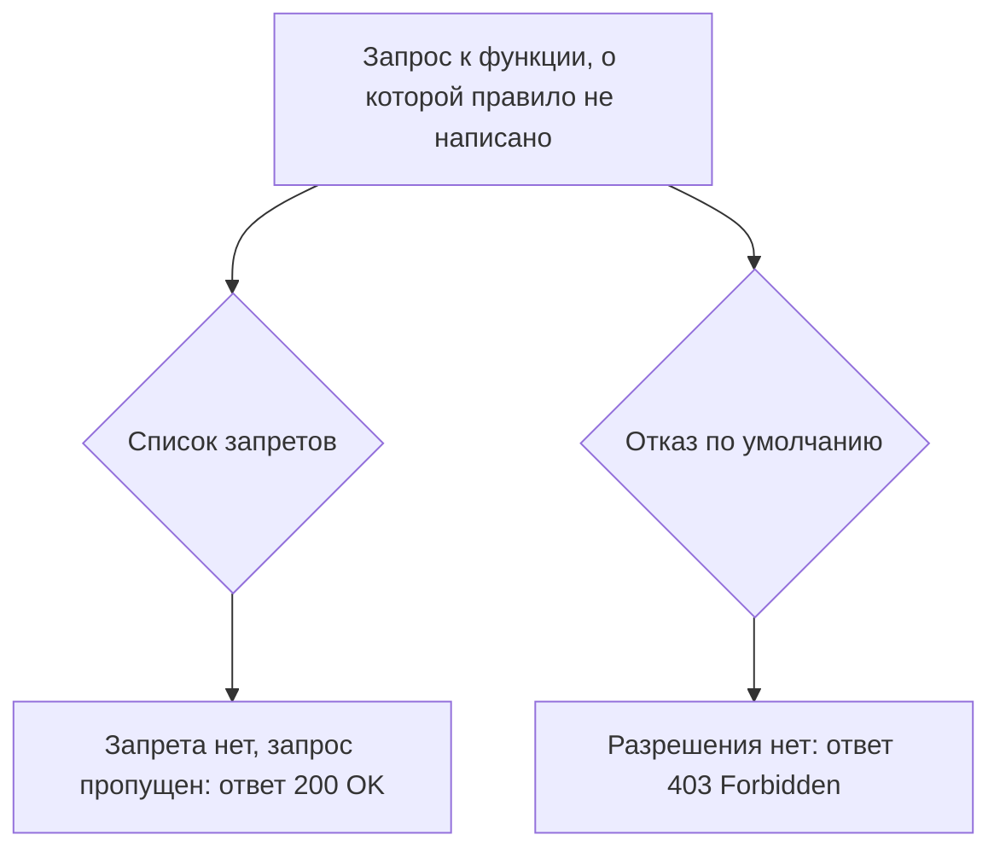

# Deny-by-default и проверка на сервере

В корпоративном портале есть общий обработчик, функция, которую фреймворк
вызывает перед каждым запросом, ещё до того, как запрос попадёт по адресу.
Обработчик закрывает три префикса: `/admin`, `/reports`, `/billing`. Выгрузка
счетов лежит по адресу `/export/invoices`, и в список она не попала, потому
что список правится в другом файле, а маршрут добавляли в код. Вот запрос к
выгрузке, и cookie в нём нет вовсе.

**Запрос**

```http
GET /export/invoices HTTP/1.1
Host: portal.example.com
```

**Ответ**

```http
HTTP/1.1 200 OK
Content-Type: text/csv

invoice,org,total
1001,acme,12000
1002,globex,90000
```

Обработчик при этом сработал исправно: он сравнил путь со списком, не нашёл
совпадения и пропустил запрос дальше. Правило доступа к выгрузке не нарушено,
потому что его не существует. Дальше разберём, что должно означать отсутствие
правила, где такое решение принимается и как проверить, что в приложении оно
устроено верно.

## Два устройства охраны

На каждый запрос механизм контроля доступа отвечает одним из двух слов: «да»
или «нет». Молчать он не умеет: если ни одно правило не совпало, решение всё
равно принято, и его кто-то выбрал заранее. Спор идёт о том, каким будет
решение для запроса, под который правило не написали.

Первое устройство — список запретов: приложение перечисляет закрытые места,
а всё неперечисленное открыто. Второе — отказ по умолчанию, по-английски
deny-by-default: приложение перечисляет разрешённое, а всё неперечисленное
закрыто. Разница видна ровно в одной точке: что происходит с функцией, о
которой никто ничего не написал. В первом устройстве она открыта, во втором
закрыта.

Бытовой пример — два режима работы охраны бизнес-центра. В первом у
охранника список людей, которых пускать нельзя: незнакомый посетитель
проходит, ведь в списке его нет. Во втором у охранника список арендаторов с
пропусками: незнакомый посетитель ждёт, пока его не внесут. Соответствие
такое.

| В бизнес-центре | В приложении |
|---|---|
| Посетитель на проходной | Запрос к функции |
| Пропуск арендатора | Явное разрешение в таблице правил |
| Режим «не в списке нежелательных — проходи» | Список запретов: запрета нет, доступ разрешён |
| Режим «нет пропуска — жди, пока внесут» | Отказ по умолчанию: разрешения нет, отказ |

Где аналогия ломается: живой охранник видит человека и может позвонить
арендатору, а обработчик знает о запросе только адрес и решает механически,
без звонков.

Почему первое устройство проигрывает. Список запретов ведёт человек, а
маршруты добавляет каждый разработчик. Маршрут появляется одной строкой в
коде, а правило к нему пишется отдельно, в другом файле и часто позже.
Поэтому список отстаёт от приложения всегда, а не иногда. Отказ по умолчанию
устроен наоборот: новая функция закрыта с рождения, и список разрешений
догоняет приложение сам.



**Описание схемы.** Схема читается сверху вниз и показывает одну ситуацию в
двух устройствах: запрос пришёл к функции, про которую никто не написал
правило. Левая ветка — список запретов: под этот адрес запрета нет, и запрос
проходит к функции. Правая ветка — отказ по умолчанию: разрешения нет, и
приложение отвечает отказом, не вызывая функцию вовсе.

**Зачем это в работе AppSec-инженера.** Список закрытых путей вы писали сами:
один общий обработчик, набор префиксов, и вопрос закрыт. Потом маршрут
добавляли одной строкой, а в список его дописывал кто-то другой или никто.
Это единственная рекомендация подраздела, которую нельзя выполнить точечно:
она либо есть в устройстве приложения, либо её нет. Ревьюер, который умеет
показать, что новая функция выходит открытой без единой строки кода, экономит
команде разбор десятков одинаковых находок.

Тема закрывает подраздел о контроле доступа: она отвечает на вопрос «как это
чинится в принципе» для всех разобранных в подразделе дефектов разом. Поэтому
частные приёмы починки здесь не повторяются: каждая тема чинит свой дефект
сама, а здесь разбирается устройство, при котором целый класс находок не
возникает.

## Как это работает

**Откуда это взялось.** Ранние приложения закрывали доступ там же, где
раздавали файлы: правило писали на каталог, а всё остальное отдавалось как
есть. Пока страниц было немного, список запретов совпадал с набором закрытых
мест. Дальше приложения стали расти быстрее списков: маршрут добавляется
одной строкой, а правило к нему пишется отдельно и часто позже. Отсюда и
перевёрнутая постановка: не перечислять закрытое, а требовать явного
разрешения на открытое.

Authorization Cheat Sheet, памятка OWASP по устройству авторизации,
формулирует это как позицию, а не как приём. Приложение не вправе остаться
нейтральным: даже когда ни одно правило не совпало, оно принимает решение,
разрешить или отказать. Решением по умолчанию должен быть отказ. Логика
доступа сложна, ошибки в ней неизбежны, и полагаться на то, что правила
покрыли все возможные запросы, нельзя.

Там же названа вторая половина правила: полагаться на умолчания фреймворка
или библиотеки не стоит, даже если они сами отказывают по умолчанию. Логика
стороннего кода меняется со временем, и разработчик узнаёт об этом не сразу.
Поэтому настройка пишется явно. К тому, что бывает, когда она не написана,
мы вернёмся в разделе «Частая ошибка».

### Второе условие: где принимается решение

Отказ по умолчанию бесполезен, если решение можно обойти, поэтому второе
условие ставится к месту проверки. Описание A01:2025, первой категории
рейтинга OWASP Top 10 издания 2025 года, говорит так: контроль доступа
работает только в доверенном серверном коде или в бессерверной функции.
Стандарт требований ASVS повторяет то же требованием v5.0-8.3.1.

Доверенный здесь значит «недоступный потребителю»: серверный код атакующий
не изменит. Бессерверная функция — это функция, которую облачный провайдер
запускает по событию, и рук до неё у клиента тоже нет. Всё, что приходит с
клиента, — параметры, заголовки, скрытые поля формы — подменяется свободно,
поэтому проверка в интерфейсе не считается; её обход разбирает тема
`client-side-access-checks`.

Из этих двух условий выводятся частные рекомендации A01:2025. Механизм
контроля доступа пишется один раз и переиспользуется во всём приложении:
один слой, одна точка решения, одно умолчание. Модель прав опирается на
владение записью, а не на возможность читать и менять любую: вопрос «чей это
объект» важнее вопроса «открыт ли раздел». Отказы журналируются, то есть
каждый отказ попадает в журнал, а на повторяющиеся отказы приходит
предупреждение. Серия одинаковых отказов — это перебор адресов, и о нём
стоит узнать раньше, чем он закончится.

## Как это проверяют

Умолчание проверяется не чтением конфигурации, а вопросами к работающему
приложению. Их формулирует WSTG-v42-ATHZ-02, раздел руководства OWASP по
тестированию, — три вопроса к каждой функции и каждому запросу после входа:

1. Доступен ли ресурс, если пользователь не аутентифицирован?
2. Доступен ли он после выхода из системы?
3. Доступны ли функции и ресурсы, положенные другой роли?

Выгрузка из начала темы отвечает `200` на первый же вопрос, потому что
запрос ушёл без cookie. Эти три вопроса вместе и есть ретест схемы
авторизации, то есть повторная проверка после починки: каждая функция
прогоняется по списку, и любое «да» — находка.

Для горизонтальной проверки, вопроса о чужих данных при одинаковых правах,
та же страница даёт процедуру. Заводят двух пользователей с одинаковыми
правами, держат две живые сессии и в каждом запросе подменяют параметры
вместе с идентификатором сессии. Если ответы совпали или содержат чужие
данные, приложение уязвимо. Чем горизонтальное повышение привилегий
отличается от вертикального, разбирает тема `privilege-escalation-vertical`,
а подмену идентификатора объекта — тема `idor`.

## Как это выглядит в коде

Ревьюер ищет умолчание, а не проверку: что происходит с маршрутом, о котором
никто ничего не сказал. Тот общий обработчик, который пропустил
`/export/invoices`, написан на Flask: декоратор `@app.before_request`
прикрепляет функцию к каждому входящему запросу. Пока выносок не видно,
скажите, какая строка решает судьбу маршрута без правила.

```python
# УЯЗВИМО — демонстрация, не для продакшена
PROTECTED = {"/admin", "/reports", "/billing"}   # (1)

@app.before_request
def guard():
    if request.path in PROTECTED:                # (2)
        require_role("admin")
```

1. Список закрытого. Судьбу маршрута без правила решает эта строка: новый
   маршрут в список не попадает и выходит открытым.
2. Сопоставление по строке пути. Оно расходится с маршрутизатором — этот
   случай разбирает `access-control-bypass-headers`.

Обёртки, которые выглядят защитой, а ею не стали: список закрытых префиксов
на прокси и проверка «пользователь вошёл» в общем обработчике. Первая
закрывает адреса, а не функции: маршрут вне префиксов снова открыт. Вторая
отвечает на вопрос об аутентификации, а не о правах: вошедший без роли
пройдёт туда, куда вошедшему нельзя.

Ложное срабатывание: маршрут без явного правила в приложении, где базовый
класс контроллера отказывает, пока правило не объявлено. Признак — правило
объявляется как разрешение (`@allow(role="admin")`), а не как запрет. Здесь
умолчание уже перевёрнуто, и находки нет.

## Как защититься

Умолчание переносится в общий слой, а разрешение становится тем, что пишут
явно. Исправленный обработчик ищет правило не по строке пути, а по функции:
`request.endpoint` — это имя обработчика, как его видит фреймворк. Правила
держатся в одной таблице: каждой функции сопоставлено своё правило.

```python
@app.before_request
def guard():
    rule = RULES.get(request.endpoint)   # правило ищется по функции,
    if rule is None:                     # а не по строке пути
        abort(403)                       # нет правила — нет доступа
    rule.enforce(current_user)
```

У новой выгрузки записи в таблице нет, поэтому запрос из начала темы получает
`403` до того, как обработчик выгрузки вызван. Забытое правило теперь видно
сразу: функция без записи закрыта для всех, и пропуск обнаруживают при
первом же запросе, а не на ревизии.

Отдельный ход нужен для публичных страниц: входа, регистрации, прайса. Они
обязаны остаться открытыми, а механизм без записи отказывает всем. Поэтому
для публичных страниц разрешение объявляется так же явно, записью «эта
функция открыта» в той же таблице. Иначе собственное правило однажды закроет
страницу входа.

**Границы применимости.** Приём вводится сразу целиком и потому дорог в
работающем приложении. Включённый отказ по умолчанию ломает всё, для чего
правило не написано, а список правил на этот момент неполон. Разумный
порядок — сначала включить механизм в режиме журналирования, когда он не
отказывает, а только записывает в журнал каждый запрос, который получил бы
отказ. Получившийся список функций разбирают по одной: для каждой пишут
разрешение или подтверждают закрытость, и отказ включают, когда список
опустел.

Вторая цена — правило владения: механизм, который умеет отказывать по
функции, всё ещё ничего не знает об объекте, к которому функция обращается.
Запрос к чужой записи пройдёт правило функции честно, и требование
v5.0-8.2.2 закрывается отдельной проверкой «свой или чужой» из темы `idor`.

## Частая ошибка

Решите до чтения дальше, не заглядывая ниже. В приложении есть общий
обработчик доступа, а фреймворк закрывает всё, пока маршрут не объявлен
явно, — считается ли, что отказ по умолчанию уже включён?

Выгрузка из начала темы вышла открытой, хотя обработчик в приложении был.
Отсюда расхожее представление: отказ по умолчанию уже включён, потому что
фреймворк закрывает всё необъявленное. Ошибка здесь в подмене владельца
решения: умолчание фреймворка — не решение приложения. Authorization Cheat
Sheet советует настраивать это явно, потому что логика и умолчания стороннего
кода меняются, а разработчик узнаёт о правках не сразу. Цепочка «обработчик
есть, значит, отказ есть» держится на том, что решение приложения отдано
чужому коду.

Контрпример. В приложении на фреймворке, где доступ по умолчанию закрыт,
подключают модуль административной панели со своим набором маршрутов и своей
конфигурацией. Умолчание модуля другое, а команда о нём не знала: панель
открывается всем, и ни одна строка приложения при этом не менялась.

## Чеклист для ревью

1. Проверьте, что функция без явного правила доступа закрыта, а не открыта
   (ASVS v5.0-8.2.1).
2. Проверьте, что разрешение объявляется явно и не берётся из умолчаний
   фреймворка или подключённого модуля.
3. Проверьте, что правило ищется по функции или обработчику, а не по строке
   пути.
4. Проверьте, что решение о доступе выносится в доверенный слой службы, куда
   потребитель не достаёт (ASVS v5.0-8.3.1).
5. Проверьте, что ресурс отвечает отказом и без аутентификации, и после
   выхода из системы (WSTG-v42-ATHZ-02).
6. Проверьте, что доступ к конкретному объекту проверяется отдельно от
   доступа к функции (ASVS v5.0-8.2.2).
7. Проверьте, что отказы контроля доступа журналируются, а повторяющиеся
   отказы поднимают предупреждение.

## Попробуй сам

Возьмите знакомое приложение и ответьте на вопрос: что произойдёт с новым
маршрутом, если разработчик добавит обработчик и забудет про права. Найдите
ответ в коде, а не в документации.

Одна подсказка: смотрите на общий обработчик перед запросом и на базовый
класс контроллера — умолчание живёт там, а не в самих маршрутах.

**Критерий выполнения** наблюдаемый: назван файл и строка, где решается
судьба маршрута без правила, и записан вывод — отказ или доступ. Если
умолчание приходит из фреймворка, названа его версия и место в документации.

## Проверь себя

1. Общий обработчик доступа из соседнего проекта:

   ```python
   RULES = {"admin.panel": "admin", "reports.view": "accountant"}

   def guard(endpoint):
       rule = RULES.get(endpoint)
       if rule is None:
           return allow()      # нет правила — пускаем
       require_role(rule)
   ```

   Выгрузка `export_all` добавлена на прошлой неделе, правила для неё нет.
   Что получит вызвавший её пользователь и какая строка об этом решила?

2. Находка ревизии: новый маршрут `/export/invoices` отвечает `200` без
   cookie. Какую починку вы выберете?

   А. Дописать `/export` в список закрытых префиксов и завести напоминание
      пополнять его при каждом новом маршруте.

   Б. Перевернуть умолчание: отказывать, когда правило для функции не
      найдено, и объявлять разрешения явно, включая публичные страницы.

   В. Положиться на умолчание фреймворка: он закрывает всё, что не объявлено
      маршрутом явно.

3. Почему список запретов отстаёт от приложения, а отказ по умолчанию — нет?

4. Умолчание перевернуто, правила ищутся по функции. Не запуская,
   предскажите обе строки вывода.

   ```python
   RULES = {"admin.panel": "admin", "reports.view": "accountant"}

   def guard(endpoint):
       rule = RULES.get(endpoint)
       if rule is None:
           return 403
       return rule

   print("admin.panel ->", guard("admin.panel"))
   print("export_all ->", guard("export_all"))
   ```

5. Возврат к теме `idor`: почему механизм с отказом по умолчанию всё ещё
   пропускает подмену идентификатора объекта?
6. Возврат к теме `privilege-escalation-vertical`: чем находка «правила нет
   вовсе» отличается от находки «правило обойдено» и какая из них чинится
   отказом по умолчанию?

<details markdown="1">
<summary>Ответ 1</summary>

1. Пользователь получит выгрузку: `RULES.get("export_all")` вернёт `None`, и
   сработает строка `return allow()`. Умолчание здесь — разрешение: закрыто
   перечисленное, а не всё остальное, и новый маршрут выходит открытым ровно
   потому, что о нём никто не сказал.

</details>

<details markdown="1">
<summary>Ответ 2 и разбор вариантов</summary>

2. Верный ответ — Б.

   А. Список запретов закрывает перечисленное, а маршруты добавляются одной
      строкой и быстрее, чем пополняется список. Напоминание держится на
      дисциплине, и следующий маршрут выйдет открытым так же.

   Б. Решением без правила становится отказ, и выгрузка получает `403` до
      вызова обработчика. Явные разрешения для публичных страниц не дают
      собственному правилу закрыть их по ошибке.

   В. Умолчание фреймворка — не решение приложения: логика стороннего кода
      меняется, а разработчик узнаёт не сразу. Контрпример из раздела
      «Частая ошибка» — модуль административной панели со своей
      конфигурацией, который открылся всем.

</details>

<details markdown="1">
<summary>Ответ 3</summary>

3. Список описывает запрещённое, а приложение растёт добавлением маршрутов:
   каждый новый маршрут по умолчанию вне списка, то есть разрешён. Отказ по
   умолчанию описывает разрешённое, и новый маршрут по умолчанию закрыт —
   список догоняет приложение сам.

</details>

<details markdown="1">
<summary>Ответ 4</summary>

4. Первая строка — правило из таблицы, вторая — отказ, потому что правила
   для `export_all` нет. Проверка прогоном файла `guard.py` с этим кодом:

   ```bash
   python3 guard.py
   ```

   ```text
   admin.panel -> admin
   export_all -> 403
   ```

   Отказ случился до того, как вызвана функция выгрузки, — в этом и состоит
   перевёрнутое умолчание: не перечислять закрытое, а требовать явного
   разрешения на открытое.

</details>

<details markdown="1">
<summary>Ответ 5</summary>

5. Отказ по умолчанию решает вопрос о функции. Доступ к точке штатный, а
   подменяется идентификатор объекта, и это отдельное требование —
   ASVS v5.0-8.2.2.

</details>

<details markdown="1">
<summary>Ответ 6</summary>

6. «Правила нет вовсе» чинится переворотом умолчания: функция без разрешения
   закрывается сама. «Правило обойдено» значит, что правило есть, а запрос
   прошёл мимо него сменой метода или подменой заголовка. Отказ по умолчанию
   тут ничего не меняет: чинится место, где правило стоит.

</details>

## Источники

1. OWASP Authorization Cheat Sheet; реестр `owasp-cs-authorization`. Разделы:
   Deny by Default, Enforce Least Privileges, Validate the Permissions on
   Every Request, Verify that Authorization Checks are Performed in the Right
   Location.
   <https://cheatsheetseries.owasp.org/cheatsheets/Authorization_Cheat_Sheet.html>
2. OWASP WSTG-ATHZ-02 «Testing for Bypassing Authorization Schema», WSTG
   v4.2; реестр `wstg-v42-athz-02-bypassing-authz-schema`. Разделы: Summary,
   Testing for Horizontal Bypassing Authorization Schema, Testing for
   Vertical Bypassing Authorization Schema.
   <https://owasp.org/www-project-web-security-testing-guide/v42/4-Web_Application_Security_Testing/05-Authorization_Testing/02-Testing_for_Bypassing_Authorization_Schema>
3. OWASP Top 10:2025, «A01:2025 Broken Access Control»; реестр
   `owasp-top10-2025-a01`. Разделы: Description, How to prevent.
   <https://owasp.org/Top10/2025/A01_2025-Broken_Access_Control/>

Каркас этапа: `owasp-asvs-5-document` (ASVS v5.0.0), `owasp-wstg-42`,
`owasp-top10-2025`; якорь подраздела: `ps-access-control`. Наследуются всеми
темами и отдельной строкой не повторяются. Authorization Cheat Sheet
наследуется тоже и назван сноской: тема стоит на нём целиком. Третья сноска —
отдельная запись реестра на главу A01:2025, а не на оглавление издания.

**Скоропортящийся слой.** Authorization Cheat Sheet — живой документ без даты
публикации, формулировки в нём меняются без уведомления. Издание Top 10
датировано 2025 годом, номера категорий меняются от издания к изданию.

**Маркеры уверенности.** Позиция «приложение не вправе остаться нейтральным»,
оговорка про умолчания фреймворков и требование проверять права на каждом
запросе — **по документации** (Authorization Cheat Sheet, открыт лично
2026-08-23). Три вопроса ретеста и процедура горизонтальной проверки — **по
документации** (WSTG-ATHZ-02, открыт лично 2026-08-23). Условие о доверенном
серверном коде и рекомендации по журналированию — **по документации**
(страница A01:2025, открыта лично 2026-08-23). Требования 8.2.1, 8.2.2 и
8.3.1 сверены с текстом ASVS v5.0.0 (открыт лично 2026-08-23). Листинги
обработчиков на Flask **не запускались**: это фрагменты, а не приложение.
Листинг из вопроса 4 прогнан локально 2026-10-03, Python 3.14.7; вывод
совпал дословно.
