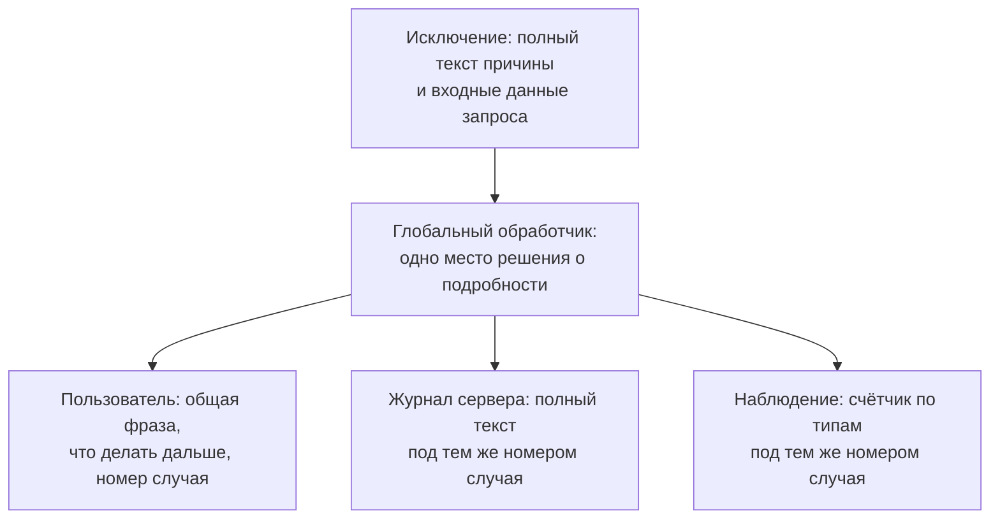

# Утечки через сообщения об ошибках

В магазине есть страница состояния заказа: введите номер — и видно, где
заказ. Однажды в параметр вместо номера приходит строка
`7 and pw_hash = 1`, и запрос к базе ломается. Страница отвечает: «Ошибка
обработки заказа: no such column: pw_hash». Сообщение короткое и вежливое,
в нём нет стектрейса, который разбирает тема `information-disclosure`. Но в
нём назван столбец базы `pw_hash`, и тот, кто прислал строку, про такой
столбец не знал. Он менял параметр и читал ответы, пока база сама не
рассказала про своё устройство.

Писал ответ при этом обычный код обработки сбоя, и тот же сбой мог
закончиться тремя разными ответами — каким именно, решает один короткий
участок программы. Дальше разберём, кто принимает это решение, почему
опрятный ответ опаснее многословного и как выдать каждому адресату ровно
его долю подробности.

## Три адресата одной ошибки

Когда запрос к базе падает, кто-то должен решить, что ответить
посетителю. Это делает обработчик исключения, участок кода, который
ловит сбой и решает, что сказать наружу. Обработчик нужен, чтобы одна поломка не роняла всё
приложение, а ответ о ней был осмысленным. Похожую работу делает
администратор отеля, к которому техник пришёл с докладом о сломанном
кондиционере. Администратор решает, что сказать гостю, что записать в
журнал инженеров и что доложить руководству. У такого решения три
адресата, и подробность каждому нужна своя.

Первый адресат — пользователь. От причины сбоя ему нет пользы, потому что
чинить приложение не ему. Ему нужно другое: понять, что случилось и что
делать дальше, — повторить попытку позже или обратиться в поддержку. Если
он обратится, ему назовут идентификатор случая, короткий номер, по
которому запись о сбое находится в журнале. Так работает номер обращения,
который выдаёт оператор колл-центра: по нему потом находят заявку.

Второй адресат — журнал сервера, файл, куда приложение записывает события
для разбора. Здесь нужен максимум: полный текст исключения, место в коде и
входные данные запроса, который его вызвал. По такой записи разработчик
поймёт, что сломалось и где чинить, а по урезанной записи разбирать будет
нечего.

Третий адресат — система наблюдения: она собирает счётчики приложения и
сигналит, когда какой-то из них растёт. Бытовой образ — лампочка на
приборной панели: она не рассказывает, что сломалось в моторе, а говорит,
что поломок стало больше и пора смотреть. Системе наблюдения нужны факт
ошибки и её частота, а не текст.

Соответствие аналогии — такое:

| В отеле | В приложении |
|---|---|
| Гость, которому отвечают у стойки | Пользователь, который читает ответ |
| Номер заявки, связывающий разговор с гостем и запись инженеров | Идентификатор случая, связывающий ответ и журнал |
| Журнал инженеров с полным докладом техника | Журнал сервера с полным текстом исключения |
| Сводка руководству «за неделю двенадцать поломок» | Счётчик ошибок в системе наблюдения |

Аналогия ломается в двух местах. Гость отеля может зайти за стойку и
прочитать журнал инженеров, а у пользователя приложения доступа к журналу
нет, потому подробность для него и ограничивают. И в отеле каждую поломку
можно рассказать гостю отдельно, а у приложения один сбой повторяется
тысячами: пересказывать причину каждому значит тысячу раз выдать
устройство системы.

Дефект возникает, когда адресат один на всех. Фраза, написанная для
журнала, уходит пользователю — это утечка. Фраза, написанная для
пользователя, остаётся единственной записью о сбое — и разбирать его не
по чему. Обе беды из одного решения, и принимается оно в одном месте.

## Как это работает

**Откуда это взялось.** Подробное сообщение об ошибке — не оплошность, а
средство разработки: оно и придумано, чтобы автор увидел причину.
Разделение адресатов появилось позже, когда выяснилось, что то же средство
отвечает и постороннему. Отсюда форма, к которой пришли: обобщённый текст
наружу и полный — в журнал, связанные общим идентификатором.

Стенд темы ломает один и тот же запрос к базе трижды; меняется только
обработчик. Строка в параметре выглядит как кусок SQL, потому что запрос
собран склейкой и значение попадает в него как есть. Так собирать запросы
нельзя, и этот дефект разбирает тема `sqli-basics`; здесь склейка нужна
стенду как надёжный способ сломать запрос. Прежде чем читать разбор,
решите: какая из трёх строк прогона уязвима?

```text
$ python e04-error-leak.py
запрос: order_id='7 and pw_hash = 1'

обработчик   код  байт  слов внутри  что видно снаружи
стектрейс    500   467            5  pw_hash, sqlite3, OperationalError
сообщение    500    69            2  pw_hash, no such column
обобщённое   500    80            0  ничего

тело ответа обработчика «сообщение»:
  Ошибка обработки заказа: no such column: pw_hash
строк в журнале сервера: 1 | последняя:
  order_id='7 and pw_hash = 1' OperationalError: no such column: pw_hash
```

Крайние строки предсказуемы. Стектрейс отдаёт наружу всё: пять
внутренних слов, включая имя библиотеки и тип исключения. Обобщённый ответ
не показывает ничего. Интересна средняя строка. Её ответ короче
обобщённого на одиннадцать байт, выглядит опрятно — и называет имя
столбца, которого атакующий не знал.

Подстановка текста исключения в собственную фразу читается как аккуратная
обработка, потому это самый частый вид утечки. Фраза написана для
пользователя, а подробность в ней — для разбора: адресат получился один на
всех. Имя столбца — не самоцель: оно удешевляет следующий шаг, подбор
работающей инъекции, и тема `information-disclosure` показывает, чем ещё
ценны такие подсказки.

Требование `v5.0-16.5.1` стандарта проверки ASVS формулирует границу не
через длину, а через содержимое: наружу не уходят стектрейсы, тексты
запросов, ключи и токены. Поэтому ответ на вопрос перед прогоном звучит
так: уязвимы две строки, стектрейс и сообщение, а безопасна только
обобщённая. Длина ответа ничего не решает: обобщённый ответ длиннее
уязвимого на одиннадцать байт. Что изменится, если фраза станет вдвое
длиннее, но по-прежнему назовёт столбец? Ничего: граница проходит по
содержимому, а не по длине.

## Что ещё выдают сообщения об ошибках

Руководство по тестированию WSTG отмечает второй признак того же рода:
разнородность. В системе из многих служб различие сообщений позволяет
понять, какая служба обслуживает какой запрос. Одна служба отвечает
текстом про столбец, другая — про соединение, третья — общей фразой, и по
этим различиям атакующий собирает карту системы, не видя её устройства.

Оно же предупреждает: ошибка приходит не только с кодом 500. Её
заворачивают в ответ с кодом 200 и телом об ошибке: статус говорит «всё в
порядке», а тело сообщает о сбое. Или прячут в переадресацию, где причина
видна в адресе страницы, на которую перенаправили. Поэтому тестировщик
смотрит не только на код ответа, но и на тело и на цепочку переадресаций.

## Где решается, что сказать о поломке

**Зачем это в работе AppSec-инженера.** Утечку такого рода находит любой
сканер, но чинят её обычно на месте — правкой того обработчика, где она
всплыла. Ревьюеру нужен другой вопрос: где в приложении принимается
решение о подробности ответа и одно ли это место. Если решение размазано
по сотне обработчиков, проверить все не выйдет.

Шпаргалка OWASP по обработке ошибок отвечает на него глобальным
обработчиком — обработчиком исключений, назначенным на всё приложение
разом: что бы ни упало, ответ собирает он. Разбор пяти строк его настройки
закрывает разом все пути исключений, а не тот, что попался на глаза.
Шпаргалка приводит настройку для трёх стеков и, отдельно, правило про
среду разработки.

Во фреймворке Spring это аннотация `@RestControllerAdvice`: класс с ней
становится обработчиком на всё приложение, а тело ответа собирается в
формате ProblemDetail. Это стандартная форма тела ошибки для HTTP API с
полями статуса и краткого описания. В Java-приложении без фреймворка
страницу ошибки назначают в дескрипторе развёртывания, конфигурационном
файле, который сервер приложений читает при публикации. Во фреймворке
ASP.NET Core ставят отдельный контроллер ошибок. А правило про среду
разработки гласит: подробная страница ошибки остаётся включённой только
там.

Обобщённый ответ полезен ровно настолько, насколько он остаётся связан с
подробным. Связывает их идентификатор случая: он печатается пользователю,
пишется в журнал рядом с полным текстом исключения, и по нему же поддержка
находит запись. Без идентификатора обобщение превращается в потерю:
наружу уходит «внутренняя ошибка», внутрь не уходит ничего, и разбирать
сбой не по чему. Отсюда правило ревью: подавление подробностей и обработка
ошибки — разные вещи, и первое без второго хуже исходного дефекта.

Скажите, не возвращаясь к тексту: чем обобщённый ответ с номером случая
лучше обобщённого ответа без номера?

Третий адресат получает факт, а не текст. Системе наблюдения положены
счётчик ошибок по типам и идентификатор случая для связи с журналом.
Полный текст исключения туда не копируют: у системы наблюдения свои
читатели, и она становится ещё одним хранилищем. Чем больше хранилищ с
полным текстом, тем шире круг тех, кто его прочитает.

Обработчик последней надежды требуется отдельно (`v5.0-16.5.4`): ни одно
исключение не должно уйти наружу путём, который никто не настраивал. Это
страховка на случай исключения, о котором не подумали: его ответ тоже
соберёт обработчик, а не среда исполнения. Ошибку в ответе с кодом 200 или
в переадресации он не ловит: там исключения нет, есть обычный ответ с
телом ошибки. Её контролируют на месте возврата — тем самым разделением
адресатов.



**Описание схемы.** Схема читается сверху вниз и показывает, как одно
исключение превращается в три сообщения. Глобальный обработчик получает
полный текст и раскладывает его по адресатам. Пользователю достаётся общая
фраза и номер случая, журналу — полный текст под тем же номером,
наблюдению — единица в счётчике. Номер случая — связка: по нему три
записи сходятся в одну историю сбоя.

Границы темы. Что бывает, когда исключение не поймано вовсе и роняет
процесс, разбирает тема `unhandled-exceptions-dos`. Как ведёт себя логика,
построенная вокруг счастливого пути, при отказе смежной службы — тема
`fail-open-vs-fail-closed`. А перечень каналов, по которым приложение
рассказывает о себе, дан в теме `information-disclosure`.

## Источники

1. OWASP Cheat Sheet Series, «Error Handling Cheat Sheet»; реестр
   `owasp-cs-error-handling`. Разделы: Context (примеры утечки — стектрейс с
   именем и версией сервера приложений, ошибка драйвера с путём установки),
   Objective (обобщённый ответ наружу, подробности в журнал на стороне
   сервера), Proposition (глобальный обработчик: дескриптор развёртывания
   Java, `@RestControllerAdvice` и `ProblemDetail` в Spring, отдельный
   контроллер ошибок в ASP.NET Core; подробная страница — только в среде
   разработки).
   <https://cheatsheetseries.owasp.org/cheatsheets/Error_Handling_Cheat_Sheet.html>
2. OWASP Web Security Testing Guide v4.2, WSTG-ERRH-01 «Testing for Improper
   Error Handling»; реестр `wstg-v42-errh-01-improper-error-handling`.
   Разделы: Summary (что даёт атакующему разбор ошибок — внутренние
   интерфейсы, состав служб, версии), How to Test → Applications
   (разнородность сообщений как способ картировать систему из многих служб;
   ошибка, пришедшая с кодом 200 или спрятанная в переадресацию).
   <https://owasp.org/www-project-web-security-testing-guide/v42/4-Web_Application_Security_Testing/08-Testing_for_Error_Handling/01-Testing_For_Improper_Error_Handling>

Каркас этапа: `owasp-asvs-5-document` (ASVS v5.0.0), `owasp-wstg-42`,
`owasp-top10-2025`. Наследуются всеми темами и отдельной строкой не
повторяются.

**Скоропортящийся слой.** Имена классов и аннотаций глобального обработчика
принадлежат конкретным фреймворкам и меняются вместе с ними; разделение
адресатов одного сообщения стабильно.

**Маркеры уверенности.** Три реакции на одну ошибку — 467 байт и пять
внутренних слов у стектрейса, 69 байт и два слова у короткого сообщения, 80
байт и ноль слов у обобщённого при одной строке в журнале — **проверено
лично** 2026-08-24 на Python 3.14.7 (стенд `e04-error-leak.py`, база SQLite
3.53.4). Текст исключения «no such column: pw_hash» и длина ответа среднего
обработчика, 69 байт, повторены прогоном 2026-10-03 на тех же версиях
(Python 3.14.7, SQLite 3.53.4; запрос собран склейкой, как на стенде).
Разделение адресатов, устройство глобального обработчика, настройки трёх
стеков и правило про среду разработки — **по документации** (Error Handling
Cheat Sheet, открыт лично 2026-08-24). Разнородность сообщений как способ картировать систему
из многих служб — **по документации** (WSTG-ERRH-01, открыт лично
2026-08-24) и **не воспроизводилась**: стенд состоит из одного процесса.
