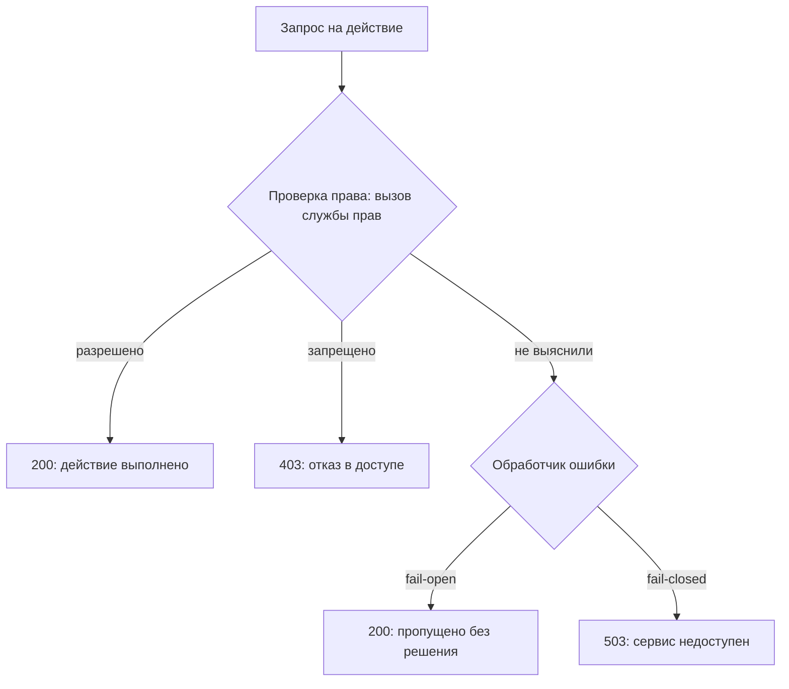

# Логика fail-open и fail-closed

Во внутреннем интерфейсе компании права проверяет отдельная служба:
обработчик запроса спрашивает у неё, можно ли этому пользователю
удалить запись. Учебный стенд, локальная программа с такой службой и
обработчиком, прогоняет через обработчик 200 запросов. Семьдесят пять
из них — привилегированные действия обычного пользователя: удаление,
выгрузка, выдача прав. Пока служба жива, две политики поведения при её
отказе неотличимы: 125 разрешений и 75 отказов у обеих.

Затем на стенде службу выключают. При первой политике все 75
привилегированных действий обычного пользователя проходят с кодом 200,
и в журнале это выглядит обычной работой. При второй все 200 запросов
получают ответ 503, «сервис временно недоступен», и лишних разрешений
нет. Первая политика называется fail-open, вторая — fail-closed, и
разница между ними записана в нескольких строках обработчика ошибки.

## Три исхода одной проверки

Проверка права — это вопрос другой службе, и у него три исхода, а не
два. Первый — «разрешено», второй — «запрещено». Третий — «выяснить
не вышло»: служба не ответила, соединение оборвалось, вышло время
ожидания, ответ пришёл, но не разобрался. Третий исход неизбежен,
потому что проверка идёт по сети, а сеть и чужой процесс подчиняться
не обязаны.

Кто-то обязан решить, чем считать третий исход. Решает не служба прав
— она как раз молчит, — а обработчик ошибки в самом приложении,
несколько строк рядом с вызовом. Выбор в пользу разрешения называется
fail-open, «при отказе открыто». Обратный выбор, «при отказе закрыто»,
— fail-closed: приложение отвечает «нельзя» или «сервис недоступен».
Обычно этот выбор никто не делал осознанно: его записал автор `try`
вокруг вызова.

Бытовой пример — электромагнитный замок на двери. При пожаре питание
снимают, и замок пожарного выхода открывается: это fail-open, выбранный
ради эвакуации. Замок хранилища при том же отключении остаётся
закрытым: это fail-closed. Соответствие такое: питание замка — служба
прав, дверь — действие, человек у двери — запрос. Где аналогия
ломается: у замка выбор делает проектировщик здания и фиксирует в
нормах, а в коде решение о третьем исходе чаще всего не принимал
никто.



**Описание схемы.** Схема читается сверху вниз. Запрос попадает в
проверку права, и у неё три исхода. Первые два, «разрешено» и
«запрещено», приводят к обычным ответам 200 и 403. Третий, «не
выяснили», уходит в обработчик ошибки приложения, и уже он выбирает:
пропустить запрос без решения службы (fail-open) или ответить 503
(fail-closed).

Соседнюю ситуацию разбирает тема `deny-by-default`: правила на объект
нет вовсе, и отвечает умолчание. Здесь другой случай: правило есть и,
возможно, разрешает, но узнать его ответ не удалось. Разница решает,
кто принимает решение. В первом случае — правило умолчания, записанное
заранее. Во втором — обработчик ошибки, и пишут его в другом месте
кода, чем основную проверку.

**Зачем это в работе AppSec-инженера.** Дефект не виден ни в схеме
архитектуры, ни в обычном прогоне тестов: пока зависимости живы,
приложение ведёт себя правильно. Проявляется он в день, когда служба
прав перегружена, то есть ровно тогда, когда вызвать этот отказ
снаружи проще всего. Найти его — значит разобрать несколько строк
обработчика ошибки, и почти всегда выясняется, что решение никто не
принимал. Дешевле всего этот дефект обходится, когда его находят на
ревью, а не в день отказа.

## Как это работает

**Откуда это взялось.** Есть общедоступный каталог типовых слабостей
программ, CWE: его ведёт организация MITRE, и у каждой слабости там
номер и место в общем дереве. Над этой темой каталог ставит общий
номер CWE-703, «неправильная проверка или обработка исключительных
условий», и делит его надвое. В левой половине, CWE-754, условие не
заметили вовсе. В правой, CWE-755, заметили, но обработали не так.
Fail-open живёт в правой половине под номером CWE-636: условие
замечено, исключение поймано, и обработчик выбрал пропустить. Второй
родитель у CWE-636 — «нарушение принципов безопасного проектирования»:
это говорит, что дефект родом из решения, а не из опечатки.

Каталог называет и мотив. Разработчик хочет «fail functional», чтобы
отказ одной части не мешал работать остальным. Получается не «fail
safe»: приложение продолжает работать, но уже без проверки. По
определению каталога, fail-open — проектное решение упасть «в
состояние менее безопасное, чем другие доступные».

Разница между решением и его отсутствием стирается там, где оба
приходят одним путём — возвратом из функции. В какую сторону стереть
разницу, в «можно» или в «нельзя», решает обработчик ошибки. Покажем
это на стенде. Он поднимает службу прав, ломает её и гоняет один и тот же
набор из 200 запросов через два обработчика.

```text
$ python e01-fail-open-authz.py
запросов 200, из них привилегированных от обычного пользователя 75

политика     служба   200  403  503  выдано лишнего
fail-open    жива     125   75    0          0
fail-open    мертва   200    0    0         75
fail-closed  жива     125   75    0          0
fail-closed  мертва     0    0  200          0
```

Читают таблицу так. Пока служба жива, обработчики неразличимы: 125
разрешений и 75 отказов у обоих, поэтому обычные тесты разницы не
видят. Отказ службы разводит политики полностью. Семьдесят пять
привилегированных действий обычного пользователя прошли с кодом 200,
и в журнале приложения это обычная работа: ни одной записи об отказе
службы. Ответьте, не перечитывая таблицу: если в обработчике fail-open
вернуть `False` вместо `True`, какая строка прогона изменится, а какая
останется прежней?

### Молчаливый fail-open: вызов без таймаута

Пропуск не всегда написан словом `True`. Вызов внешней службы без
ограничения по времени — тоже решение, только принятое умолчанием
библиотеки. Таймаут здесь работает как будильник на вызов: ответа нет
за отведённые секунды — вызов падает с ошибкой, и её можно обработать.
Без таймаута будильника нет, и вызов ждёт сколь угодно долго.

Стенд поднимает службу, которая принимает соединение и молчит, и зовёт
её с разными таймаутами.

```text
$ python e02-no-timeout.py
бюджет ожидания стенда 3.0 с, служба принимает и молчит

таймаут сокета   исход           время, с
0.5              socket.timeout      0.50
1.0              socket.timeout      1.00
не задан         не завершился       3.00
```

Заданный таймаут даёт исключение ровно в свой срок: это третий исход
в виде события, которое обработчик может поймать. Незаданный не даёт
ничего: запрос стоит, поток занят, и решение о доступе не принято
вовсе. Стенд снял висящий вызов по своему бюджету в 3 с, а сам вызов
ждал бы дальше.

Почему висящий вызов — это отказ всего приложения. Запросы
обслуживает пул потоков: ограниченный набор работников, где каждый
ведёт один запрос за раз. Служба молчит минуту — все потоки стоят на
своих соединениях, и обслуживать новые запросы некому. Чем это
кончается, показывает стенд темы `unhandled-exceptions-dos`.

### Fail-open вне контроля доступа

Проверка прав — самый заметный случай, но не единственный. Возьмите
ограничитель частоты: механизм, который считает повторные попытки
одного действия, например входа по паролю, и отклоняет всё сверх
лимита. Бытовой аналог — домофон, который после пяти неверных кодов
молчит минуту: без него код из четырёх цифр перебирают за вечер.
Счётчики ограничитель держит во внешнем хранилище, чтобы их видели все
процессы приложения, и при отказе хранилища встаёт тот же выбор.

```text
$ python e03-ratelimit-fail-open.py
лимит 5 попыток, всего попыток 60, хранилище падает на 5-й

политика          пропущено  отклонено  сверх лимита
fail-open               60          0            55
fail-closed              4         56             0
локальный запас          9         51             4
```

Пятьдесят пять попыток подбора пароля сверх лимита — цена одной строки
`except` с пропуском. Третья строка показывает, что выбор не двоичный.
Локальный счётчик в памяти самого процесса пережил отказ хранилища и
удержал перебор в тех же пяти попытках на процесс. Лишние четыре
прошли из-за того, что счёт начался заново. Как устроен такой запасной
путь, разберём в разделе про защиту.

## Как это атакуют

Атакующему не нужно обманывать проверку: достаточно вызвать третий
исход. Перегрузить службу прав запросами дешевле, чем обойти саму
проверку, а результат тот же. Каталог описывает это общим правилом:
атакующий вызывает необычные условия намеренно, нарушая допущения
программиста. Подходят и окно перезапуска службы, и ответ, который
разбор не понимает: поля решения в нём нет, а умолчание разбора —
разрешение. В стенде лабы это третье состояние службы: жива, отвечает,
но решения не приняла, потому что движок правил ещё прогревается.

Порядок поиска таких мест за тестировщика уже написан. Это раздел
`WSTG-v42-ERRH-01` руководства OWASP по тестированию (WSTG): перечислить
точки ввода, где приложение зависит от внешней службы, определить
ожидаемый вид ответа и прицельно ломать разбор. Ломать — значит
оборвать соединение, заставить службу молчать или вернуть ответ без
решения. Дальше смотрят на код, которым приложение ответило. Ошибка,
пришедшая с кодом 200 или спрятанная в перенаправление 302, — находка:
приложение отработало без решения проверки.

Замечают такой обход поздно, и причина в журнале. Каждый запрос
получил обычный код 200, записей об отказе службы нет, и мониторингу
не на что среагировать. Без записи о срабатывании запасного пути день
отказа выглядит в журнале обычным днём.

## Как это выглядит в коде

Ревьюер ищет три признака. Первый — перехват всего подряд там, где
ожидается ответ проверки. Найдите в этом коде строку, принимающую
решение о доступе, до чтения выносок.

```python
# УЯЗВИМО — демонстрация, не для продакшена
def is_allowed(user, action):
    try:
        return policy.check(user, action)
    except Exception:          # (1) отказ службы неотличим от разрешения
        return True            # (2) решение принято здесь
```

1. Ловится всё: и отказ сети, и опечатка в имени поля внутри `check`.
   Любая ошибка проверки превращается в разрешение.
2. Строка выглядит как «запасной вариант», а работает как правило
   доступа: именно здесь записана политика fail-open.

Второй признак — вызов зависимости без ограничения по времени. Здесь
решение о доступе принято дважды; найдите оба места до разбора.

```python
# ФРАГМЕНТ — срез, самостоятельно не компилируется
# УЯЗВИМО — демонстрация, не для продакшена
resp = requests.get(POLICY_URL, params={"u": user})   # (3)
return resp.json().get("allow", True)                 # (4)
```

3. Таймаут не задан: у обработчика нет исхода «не выяснили», и запрос
   ждёт ответа сколь угодно долго.
4. Умолчание словаря — снова разрешение, теперь спрятанное в аргументе:
   поля `allow` в ответе нет, а `get` подставляет `True`.

Третий признак — проверка, включаемая настройкой. Строка `if not
settings.AUTHZ_ENABLED: return True` читается как рубильник для
отладки и переживает выкладку в рабочую среду, потому что ничего не
ломает.

Ложное срабатывание здесь частое. Законный fail-open отличают по трём
чертам сразу: названный владелец риска в комментарии или требовании,
запись в журнал на каждом срабатывании и ограниченная область
действия. Пропуск проверки антивируса на
загрузке резюме, когда антивирус недоступен, бывает законным решением
бизнеса. Пропуск проверки прав — почти никогда.

## Как защититься

Починка начинается с признания: у проверки три исхода, и третьему
нужны своя ветка и свой ответ. Исправленный вариант первого листинга
читается тремя планами: поймать именно отказ службы, записать событие
в журнал, ответить кодом 503.

```python
# ФРАГМЕНТ — срез, самостоятельно не компилируется
# Исправленный вариант
def is_allowed(user, action):
    try:
        return policy.check(user, action)
    except PolicyUnavailable:            # (1)
        audit.log("policy unavailable")  # (2)
        raise ServiceUnavailable         # (3)
```

1. Ловится конкретное исключение отказа службы, а не всё подряд:
   класс `PolicyUnavailable` объявляет клиентская библиотека службы
   прав. Опечатка внутри `check` по-прежнему упадёт заметно и не
   превратится в решение о доступе. Каталог прямо советует ловить
   конкретные исключения и обрабатывать их как можно ближе к месту.
2. Отказ средства защиты — событие безопасности, а не строка отладки,
   и ASVS v5.0-16.3.4 требует записывать его в журнал. Без этой записи
   срабатывание запасного пути неотличимо от обычной работы, как в день
   отказа из начала темы.
3. Третий исход получает свой ответ: 503, «сервис временно
   недоступен». Клиенту сказана правда, и доступ не создан: отказ
   проверки — не «нельзя» и не «можно», а отсутствие решения.

Второй уязвимый листинг чинится тем же приёмом дважды: вызову задают
таймаут, а умолчанию разбора — отказ.

```python
# ФРАГМЕНТ — срез, самостоятельно не компилируется
# Исправленный вариант
resp = requests.get(POLICY_URL, params={"u": user}, timeout=2.0)  # (4)
data = resp.json()
if "allow" not in data:                     # (5)
    audit.log("no decision in answer")
    raise ServiceUnavailable                # (6)
return data["allow"]
```

4. Таймаут задан явно: через две секунды молчания вызов падает с
   исключением, и третий исход становится событием, которое обработчик
   может поймать. Значение подбирают под бюджет запроса: проверка права
   на критичном пути не должна ждать дольше пары секунд.
5. Умолчание убрано из разбора: ответ без поля `allow` больше не
   читается как разрешение. Ответ «не решением» — тоже отказ
   зависимости, в лабе это состояние «жива, но прогревается».
6. Он идёт в ту же ветку 503: повторять другую логику не нужно.

Меры выше закрывают один обработчик. Дальше — решения на уровне
приложения, и требования называют оба края. ASVS v5.0-16.5.2 просит
продолжать работать безопасно при отказе доступа к внешнему ресурсу.
Это не «работать любой ценой»: функции, которые зависят от проверки,
на время отказа закрываются, остальные продолжают. Такая плавная
деградация выглядит так: при отказе службы прав чтение профиля
работает, а удаление и выгрузка отвечают 503. Каталог формулирует то
же на уровне проектирования: разделить систему так, чтобы отказ одной
части не задевал остальные.

Где отклонять нельзя по требованиям доступности — приём платежей,
аварийный доступ дежурного, — fail-open заменяют ограниченным запасным
путём. Это не пропуск, а усечённая работа: локальный кэш последнего
известного решения, короткий срок его жизни, сокращённый набор
разрешённых действий и разбор каждого случая постфактум. Пример уже
встречался в механике: локальный счётчик ограничителя в памяти
процесса удержал лимит при мёртвом хранилище. Обратный край закрывает
ASVS v5.0-16.5.3: пропускать операцию из-за ошибок в самой проверке
приложение не вправе.

## Частая ошибка

Ответьте себе до разбора: чем решается спор между двумя политиками —
тем, что дороже: остановка работы или риск?

Звучит разумно, и именно так fail-open оправдывают после находки.
Опровержение строится на том, когда принято решение. Fail-open обычно
не выбран, а унаследован: умолчанием библиотеки, шириной `except`,
значением по умолчанию в разборе ответа. Проверка «умеет ли этот отказ
навредить» опаздывает — к моменту, когда её задают, ответ в коде уже
записан. Поэтому первый вопрос ревью — не «что дороже», а «где здесь
принято решение и кто его принял».

Второе заблуждение того же вида: «служба прав у нас в том же кластере,
отказ маловероятен». Каталог отвечает прямо: атакующий вызывает
необычные условия намеренно, нарушая допущения программиста.
Перегрузить службу прав дешевле, чем обойти саму проверку, а результат
тот же. Вероятность отказа здесь — не свойство среды, а действие
атакующего.

## Чеклист для ревью

1. Проверьте, что отказ проверки прав и её отрицательный ответ
   различаются в коде и приводят к разным ответам клиенту
   (ASVS v5.0-16.5.3).
2. Проверьте, что перехват вокруг вызова проверки называет конкретный
   класс исключения, а не общий базовый.
3. Проверьте, что каждый вызов внешней службы, участвующей в решении
   о доступе, ограничен таймаутом.
4. Проверьте, что разбор ответа службы не подставляет разрешение как
   значение по умолчанию отсутствующего поля.
5. Проверьте, что срабатывание запасного пути записывается в журнал
   как событие безопасности (ASVS v5.0-16.3.4).
6. Проверьте, что при отказе зависимости приложение закрывает
   зависящие от неё функции, а не обслуживает их без проверки
   (ASVS v5.0-16.5.2).
7. Проверьте, что осознанный fail-open назван в требованиях,
   ограничен по области и не распространяется на решения о правах.

## Попробуй сам

Лаба `lab-fail-open` живёт в каталоге `pilot/lab/fail-open`, формат —
«почини». Внутри знакомый по теме внутренний интерфейс: он спрашивает
право у службы прав и считает попытки входа во внешнем хранилище. Обе
зависимости умеют три состояния: жива, мертва и «отвечает, но не
решением». Всё работает локально в памяти: сети нет, случайности нет,
опыты детерминированы.

Запуск против уязвимого `code.py` (прогон повторён 2026-10-03):

```bash
cd pilot/lab/fail-open
../../../.venv-tools/bin/python hack.py
```

```text
цель: code.py
  [1] служба прав мертва: привилегированных обычному разрешено 4 из 4
  [2] хранилище мертво: пропущено 60 из 60 при лимите 5, сверх лимита 55
  [3] ответ без решения: обработчик ответил '200 grant_admin'
  [K] зависимости живы: права целы True, попыток пропущено 5 при лимите 5
обходов открыто: 3 из 3, контрольный опыт цел: True
```

Три опыта повторяют механику темы. Мёртвая служба прав даёт 200 на все
четыре привилегированных действия. Мёртвое хранилище пропускает 60
попыток входа из 60 при лимите в 5. Ответ без поля решения читается
как разрешение. Контрольный опыт стоит на страже починки: при живых
зависимостях права обязаны работать как прежде.

**Цель одной фразой:** добиться, чтобы `hack.py` вышел с кодом 0: все
три обхода закрыты, контрольный опыт цел. Файл `tests.py` с шестью
проверками функциональности при этом продолжает выходить с кодом 0.
Проверяемый файл выбирается переменной `LAB_TARGET`, и образец починки
прогоняется так:

```bash
LAB_TARGET=solution.py ../../../.venv-tools/bin/python hack.py
```

Подсказка одна: правьте не текст ответа, а число исходов. Пока у
проверки два исхода, третьему придётся приклеиться к одному из них.

Задача «почини» ставится так: развести три исхода, не сломав законную
работу. Шесть проверок функциональности должны остаться зелёными, а
ограничитель частоты при отказе хранилища обязан остаться
ограничителем. Решение лежит в `solution.py` того же каталога и
открывается после своей попытки.

## Проверь себя

1. Проверка права на возврат денег:

   ```python
   def can_refund(user, order):
       try:
           return billing.can(user, "refund", order)
       except Timeout:
           return True
   ```

   Кто и где здесь принял решение о доступе и что покажет журнал в
   день, когда служба прав лежит?

2. Служба прав упала, и обработчик пропустил все 75 привилегированных
   действий обычного пользователя. Какую починку вы выберете?

   A. Оставить пропуск: служба в том же кластере, и отказ
      маловероятен.

   B. Развести три исхода по веткам: «разрешено», «запрещено» — 403,
      «не выяснено» — 503, и задать вызову таймаут.

   C. Решить спор экономикой: прикинуть, что дороже — остановка работы
      или риск, и записать выбор в комментарии.

3. Почему вызов внешней службы без таймаута — это уже принятое решение
   о политике при отказе?

4. Починка стоит так:

   ```python
   def can_refund(user, order):
       try:
           return billing.can(user, "refund", order)
       except Timeout:
           raise ServiceUnavailable
   ```

   На исправленном файле лабы службу прав убивают. Не запуская,
   предскажите, сколько привилегированных действий обычного
   пользователя будет разрешено.

5. Возврат к теме `deny-by-default`: чем случай «правила на объект
   нет» и случай «правило есть, но ответ не получен» отличаются по
   механизму?

<details markdown="1">
<summary>Ответ 1</summary>

1. Решение приняла строка `except Timeout: return True` — запасной
   вариант, работающий как правило доступа. Журнал покажет обычную
   работу: запросы с кодом 200, без единой записи об отказе службы.
   Именно поэтому разница политик до дня отказа не видна.

</details>

<details markdown="1">
<summary>Ответ 2: разбор вариантов</summary>

2. Верный ответ — B.

   A. Атакующий вызывает необычные условия намеренно: перегрузить
      службу прав дешевле, чем обойти саму проверку, а результат тот
      же. Это второе заблуждение из раздела «Частая ошибка».

   B. Отказ службы — отсутствие решения, и клиенту полагается 503: он
      говорит правду и не создаёт доступа. Таймаут превращает молчание
      службы в событие, которое можно обработать.

   C. Проверка «что дороже» опаздывает: fail-open обычно не выбран, а
      унаследован умолчанием библиотеки и шириной `except`. Первый
      вопрос ревью — где решение принято и кто его принял.

</details>

<details markdown="1">
<summary>Ответ 3</summary>

3. Потому что без таймаута исхода «не выяснили» не существует как
   события: поток стоит в ожидании, обработчик ошибки не вызывается.
   Поведение системы определяет то, что произойдёт раньше — ответ
   службы или исчерпание пула потоков.

</details>

<details markdown="1">
<summary>Ответ 4</summary>

4. Ноль из четырёх: отказ службы стал отказом в доступе. Прогон против
   исправленного файла (повторён 2026-10-03):

   ```bash
   LAB_TARGET=solution.py .venv-tools/bin/python pilot/lab/fail-open/hack.py
   ```

   ```text
   цель: solution.py
     [1] служба прав мертва: привилегированных обычному разрешено 0 из 4
     [2] хранилище мертво: пропущено 5 из 60 при лимите 5, сверх лимита 0
     [3] ответ без решения: обработчик ответил '503'
     [K] зависимости живы: права целы True, попыток пропущено 5 при лимите 5
   обходов открыто: 0 из 3, контрольный опыт цел: True
   ```

   Контрольный опыт при этом цел: при живой службе права раздаются как
   прежде — починка не свелась к «отклонить всё».

</details>

<details markdown="1">
<summary>Ответ 5</summary>

5. В первом случае решение принимает правило умолчания, и оно известно
   заранее: нет разрешающей записи — доступа нет. Во втором правило
   существует и, возможно, разрешает, но его ответ недоступен. Решение
   принимает обработчик ошибки — и делает это в другом месте кода, чем
   основная проверка.

</details>

## Источники

1. MITRE, CWE-636 «Not Failing Securely ('Failing Open')», каталог CWE
   4.20; реестр `cwe-636`. Разделы: Description и Extended Description
   (падение в состояние менее безопасное, чем доступные другие; мотив
   «fail functional» вместо «fail safe»), Relationships (родители —
   CWE-755 и «Violation of Secure Design Principles»), Potential
   Mitigations (разделение системы так, чтобы отказ части не задевал
   целое), Demonstrative Example (коммутатор, вырождающийся в хаб при
   переполнении таблицы) и Observed Examples (CVE-2007-5277 — сброс
   ограничений при неудаче соединения как попытка «fail functional»).
   <https://cwe.mitre.org/data/definitions/636.html>
2. OWASP Web Security Testing Guide v4.2, WSTG-ERRH-01 «Testing for
   Improper Error Handling»; реестр
   `wstg-v42-errh-01-improper-error-handling`. Разделы: Summary (обход
   контроля, «когда исключение не ограничено логикой, выстроенной
   вокруг счастливого пути»), How to Test → Applications (порядок
   поиска: перечислить точки ввода, определить ожидаемый тип, прицельно
   ломать разбор), замечание про ответы, где ошибка приходит с кодом
   200 или прячется в 302.
   <https://owasp.org/www-project-web-security-testing-guide/v42/4-Web_Application_Security_Testing/08-Testing_for_Error_Handling/01-Testing_For_Improper_Error_Handling>

Каркас этапа: `owasp-asvs-5-document` (ASVS v5.0.0), `owasp-wstg-42`,
`owasp-top10-2025`. Наследуются всеми темами и отдельной строкой не
повторяются.

**Скоропортящийся слой.** Умолчания конкретных библиотек по таймаутам
и имена классов исключений принадлежат этим библиотекам и меняются
вместе с ними; разделение «не проверили — обработали не так» и
определение fail-open в каталоге стабильны.

**Маркеры уверенности.** Семьдесят пять привилегированных действий
обычного пользователя, прошедших с кодом 200 при отказе службы прав из
200 запросов набора; невозвращение управления при незаданном таймауте
за 3 с бюджета против исключения ровно по заданному таймауту; 55
попыток подбора сверх лимита в 5 при отказе хранилища счётчиков и 4
при локальном запасном счётчике — **проверено лично** 2026-08-24 на
Python 3.14.7 (стенды `e01-fail-open-authz.py`, `e02-no-timeout.py`,
`e03-ratelimit-fail-open.py`). Определение fail-open, его мотив, место
в дереве CWE и мера на уровне проектирования — **по документации**
(CWE-636, CWE-703, CWE-754 каталога 4.20, открыты лично 2026-08-24).
Обход контроля через необработанное исключение и порядок поиска точек
ввода — **по документации** (WSTG-ERRH-01, открыт лично 2026-08-24).
Выводы лабы повторены 2026-10-03: против `code.py` открыты три обхода
из трёх, против `solution.py` — ни одного, и шесть функциональных
проверок зелёны в обоих случаях. Поведение живой службы прав под
нагрузкой **не воспроизводилось**: стенд отключает зависимость
переключателем, а не перегрузкой.
