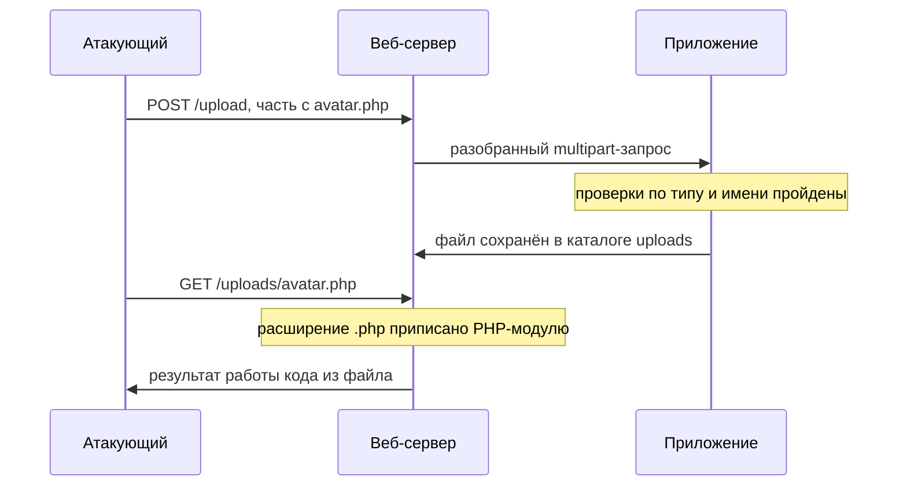
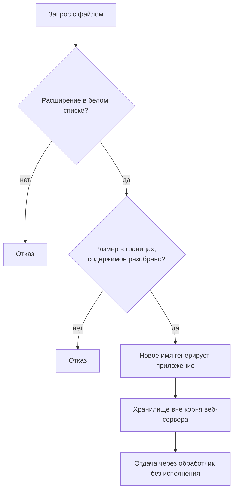

# Небезопасная загрузка файлов

На сайте с личным кабинетом есть форма загрузки аватара. Пользователь
выбирает картинку, браузер отправляет её на сервер, и дальше файл доступен
всем по адресу `/uploads/avatar.jpg`. Однажды в форму подкладывают не
картинку, а файл `avatar.php` с посторонним кодом. Проверка на форме его
принимает, потому что смотрит на тип из запроса, а заполняет это поле сам
отправитель.

Файл ложится в тот же каталог и получает адрес `/uploads/avatar.php`.
Дальше атакующий открывает этот адрес в браузере, и веб-сервер не
показывает файл, а исполняет его. Такой дефект называют небезопасной
загрузкой файлов. Эта тема разбирает, почему проверки типа, расширения и
содержимого обходятся по одной и что решает исход.

## Как файл попадает на сервер

Файл уходит на сервер внутри обычного запроса `POST`, но тело у него
устроено иначе, чем у формы входа. Там поля записаны одной строкой в
кодировании `application/x-www-form-urlencoded`, которое разбирает тема
`url-and-encoding`. Для файлов этот формат не годится, потому что в байтах
картинки встречаются любые значения, включая те, что строка считает
служебными. Поэтому для загрузки придуман другой формат —
`multipart/form-data`. Тело в нём делится на части строкой-разделителем,
и отправитель называет её заранее в параметре `boundary` заголовка
`Content-Type`.

**Запрос с файлом внутри**

```http
POST /upload HTTP/1.1
Host: app.example.com
Content-Type: multipart/form-data; boundary=abc123

--abc123
Content-Disposition: form-data; name="avatar"; filename="avatar.php"
Content-Type: image/jpeg

<?php echo "MARKER"; ?>
--abc123--
```

Каждая часть начинается со строки `--abc123`, несёт свои маленькие
заголовки и отделяется от содержимого пустой строкой. У части с файлом
заголовков два: `Content-Disposition` с именем файла и `Content-Type` с
его типом. Заметьте несоответствие в примере: имя говорит про PHP, а
объявленный тип — про картинку. Оба поля написал сам клиент, и сервер
получил их как данные, а не как факт. Кому из них верить и верить ли
вообще, решает уже сервер, и от этого решения зависит всё остальное.

Сам формат multipart похож на бандероль с отделениями. На каждом
отделении наклейка, которую заполняет отправитель, а почта читает
наклейку, но не вскрывает отделение сверить. Соответствие такое:
отделение — часть тела, наклейка — пара заголовков части, почта — сервер.
Где аналогия ломается: почта хотя бы способна досмотреть вложение на
границе, а сервер по умолчанию не досматривает ничего.

### Что сервер делает с файлом дальше

Принятые байты приложение сохраняет на диск, и само по себе сохранение
безвредно: файл лежит и ничего не делает. Опасность появляется позже,
когда тот же файл запрашивают обратно по адресу. На запрос к
`/uploads/avatar.jpg` веб-сервер отвечает байтами картинки. На запрос к
`/uploads/avatar.php` он смотрит в свою таблицу соответствий, где
расширение `.php` приписано исполняющему модулю. Тогда файл уходит не
наружу, а интерпретатору PHP, и тот выполняет код из файла. Исполняющий
модуль — это программа, которую веб-сервер вызывает по расширению: для
`.php` интерпретатор PHP, для `.jsp` контейнер JSP.

Такое устройство похоже на стойку приёма в конторе, где решение принимают
по пометке на конверте. Пометка «справка» — конверт подшивают в папку
и показывают каждому, кто спросит. Пометка «поручение» — конверт передают
исполнителю, и тот выполняет написанное внутри. Соответствие такое:
конверт — файл, пометка — расширение, папка — каталог загрузок,
исполнитель — модуль PHP. Аналогия ломается на прочтении: исполнитель-человек
мог бы прочитать поручение и отказаться, а интерпретатор выполняет всё,
что похоже на код.

Загруженный файл, который атакующий потом вызывает через браузер,
называют веб-шеллом. Такой файл принимает команду параметром запроса,
выполняет её на сервере и возвращает результат в ответе. Последствия те
же, что у внедрения команд из темы `os-command-injection`: сервер
исполняет чужие команды. Разница в пути доставки: там команда приходит в
параметре, а здесь её приносят в файле и вызывают адресом.

Чтобы рассуждать о защите предметно, проверку принятого файла раскладывают
на четыре оси. Так их перечисляет File Upload Cheat Sheet — памятка OWASP
о загрузке файлов. Первая ось — объявленный тип из запроса. Вторая —
расширение имени. Третья — содержимое файла. Четвёртая — размещение: куда
файл кладут, под каким именем и как его отдают. Первые три отвечают на
вопрос «что это за файл». Четвёртая отвечает на другой вопрос: «что
сервер сделает с файлом, когда его запросят».

**Откуда это взялось.** Форма загрузки появилась как удобство для
пользователя: аватар, скан договора, вложение к заявке. В приёме байтов
нет ничего опасного, и долгое время проверка ограничивалась вопросом «что
это за файл». Опасность возникла из другого свойства: те же байты потом
отдаются обратно по адресу внутри приложения. Тогда каталог загрузок
становится продолжением кодовой базы, и вопрос меняется на «что сервер
сделает с этим файлом, когда его запросят». Четыре оси как раз делят эти
два вопроса.

**Зачем это в работе AppSec-инженера.** Любая форма загрузки файла
получает на ревью короткий чеклист из четырёх вопросов, по одному на ось.
Дефект тут живёт в замысле, а не в строке: каждая проверка по отдельности
выглядит разумно, а класс закрывает только их сочетание с размещением.
Самый важный вопрос чеклиста последний: где окажется файл и кто его
сможет запросить. Вокруг него дальше и построена защита.

## Как это работает

Теперь посмотрим, как три первые оси ведут себя против настоящих
образцов. Сначала идёт прогон стенда, а затем каждая ось разобрана
отдельно: что она ловит и через что пропускает.

### Стенд: шесть образцов через три проверки

Стенд — программа на Python 3.14.7. Она прогоняет шесть образцов
через три проверки сразу: объявленный тип, расширение по чёрному и белому
спискам (запрещённого и разрешённого) и первые байты содержимого. Полезная нагрузка во всех образцах
безобидная: вместо кода лежит строка-маркер. Один образец — честная
картинка для контроля, остальные пять претендуют на загрузку с натяжкой.

Последняя колонка таблицы называется «магия», потому что проверка смотрит
на сигнатуру формата. Сигнатура, или магические байты, — фиксированное
начало, по которому файл узнают без имени. У формата GIF это шесть
символов `GIF89a` в самом начале файла. Проверка по сигнатуре читает их и
отвечает «картинка» или «не картинка».

```bash
python e05-filetype.py
```

```text
имя файла      Content-Type  чёрный  белый   магия
------------------------------------------------------------------
avatar.php     прошёл        отказ   отказ   не картинка
avatar.pHp     прошёл        прошёл  отказ   не картинка
avatar.php5    прошёл        прошёл  отказ   не картинка
avatar.jpg     прошёл        прошёл  прошёл  не картинка
poly.gif       прошёл        прошёл  прошёл  image/gif
real.gif       прошёл        прошёл  прошёл  image/gif
```

### Объявленный тип не отказывает никогда

Колонка `Content-Type` пропустила все шесть образцов, и это не дефект
стенда. Значение этого поля приходит из того же запроса, что и файл:
отправитель объявляет тип сам, как наклейку на отделении бандероли.
Переписать его — дело одной строки при отправке. Поэтому объявленный тип
годится как подсказка для маршрутизации, но не как ограничение. Проверка,
которая опирается только на него, спрашивает у атакующего, честный ли он.

### Чёрный список против белого

С расширением есть две стратегии, и у них бытовой прототип — контроль на
входе. Чёрный список — перечень лиц, которым вход запрещён: все остальные
проходят. Белый список — перечень приглашённых: не в списке — не
проходишь. Соответствие прямое, и ломается аналогия только в масштабе:
перечень запрещённых расширений ведут люди, а множества опасных
расширений заранее никто не знает.

В прогоне это видно по строкам. Имя `avatar.php` чёрный список отклонил,
потому что расширение в перечне есть. Имя `avatar.pHp` прошло, потому
что перечень записан в нижнем регистре, а сравнение шло без приведения
регистра. Имя `avatar.php5` прошло, потому что этого расширения в перечне
не оказалось. Так устроен любой список запрещённого: он закрывает то, что
автор вспомнил, и открыт для всего остального.

Белый список отклонил все три строки с PHP и пропустил только имена на
разрешённое расширение. Разница между списками не в аккуратности ведения,
а в направлении ошибки. Забытая запись в белом списке ломает загрузку
законного файла, и это видно сразу. Забытая запись в чёрном пропускает
опасный файл, и это не видно вовсе.

### Полиглот: почему содержимого мало

Самые важные строки прогона — две последние. Файл `poly.gif` прошёл все
три проверки, включая сверку содержимого: он начинается с сигнатуры
`GIF89a`, и для проверяющего это картинка. А дальше первых шести байт в
нём лежит посторонняя строка. Такой файл называют полиглотом: он честно
устроен как один формат и при этом несёт содержимое другого. Форматы
картинок терпимы к лишним байтам после заголовка, и сигнатура в начале
ничего не говорит об остальном файле.

Отсюда требование стандарта ASVS: проверять сигнатуру и дополнительно
разбирать файл специализированной библиотекой, а картинки пересобирать
заново (v5.0-5.2.2). Пересборка — это когда приложение читает картинку
библиотекой, получает пиксели и записывает их в новый файл. На выход идут
пиксели, а не исходные байты, поэтому полиглот пересборку не переживает:
чужого кода в пикселях нет.

Строка `avatar.jpg` показывает обратную сторону. Имя законное, а внутри
не картинка, и заметить это может только проверка содержимого: расширение
с содержимым здесь разошлись. Получается, ни одна из трёх осей не
заменяет другую. Объявленный тип подделывается, расширение перебирается,
сигнатура молчит про хвост файла.

### Распаковка архива — это запись по пути из данных

Отдельный случай загрузки — архив, который сервер распаковывает. Имя
записи внутри архива — такие же данные от отправителя, как имя файла в
запросе. Если запись называется `../escaped.txt`, а распаковщик пишет
по этому имени как есть, файл окажется за пределами каталога распаковки.
Приём называют zip slip, и по существу это переход по пути из темы
`path-traversal`, только на запись. Ломается сходство в последствии:
чтение выносит чужое наружу, а распаковка подкладывает своё внутрь,
вплоть до подмены исполняемых файлов.

Стенд сравнивает штатную распаковку с самодельной:

```bash
python e07-handrolled.py
```

```text
Python 3.14.7
=== А. штатный extractall ===
   вне каталога: False
   внутри: ['escaped.txt', 'ok.txt']
=== Б. самодельный цикл: join + open ===
   вне каталога: True
   содержимое: СНАРУЖИ
=== В. самодельный цикл с канонизацией ===
   отклонено: ['../escaped.txt']
```

Читается результат в обе стороны. Штатный `zipfile.extractall` на этой
версии переход вверх вырезает: файл лёг внутрь под именем `escaped.txt`.
Штатный `tarfile.extractall` без явного фильтра на той же версии
отказывает с ошибкой `OutsideDestinationError`. А самодельный цикл,
который берёт имя из архива и пишет по нему, выпускает файл наружу. Именно
такой цикл пишут, когда нужно распаковать «только нужные записи», и
строка В показывает его починку — канонизацией пути до записи, как в
теме `path-traversal`.

Второй риск архива — не путь, а объём. Маленький архив может
распаковаться в гигабайты данных или в сотни тысяч файлов, и такой приём
называют бомбой распаковки. Поэтому ASVS требует сверять распакованный
размер и число файлов до распаковки, а не после (v5.0-5.2.3). После
распаковки диск уже занят.

## Как это атакуют

Атакующий проходит оси от дешёвой подделки к дорогой и заканчивает
главным вопросом — исполнится ли файл. Сначала он переписывает
объявленный тип: запрос перехватывается прокси, как в теме
`tls-and-proxy`, и поле `Content-Type` меняется на `image/jpeg`. Затем
против чёрного списка он перебирает записи расширения: другой регистр
`avatar.pHp` и редкое расширение `avatar.php5`.

Отдельный приём — двойное расширение. Оно работает против серверов,
которые выбирают обработчик не по последнему суффиксу имени, а по любому
известному. Так делает Apache с mod_mime и mod_php: в имени
`avatar.php.jpg` суффикс `.php` знаком, и файл уходит интерпретатору PHP. Если стоит белый список
со сверкой первых байт, в ход идёт полиглот: настоящий заголовок GIF и
код после него. Имя файла атакующий тоже пробует: запись с `../` в имени
выводит файл за каталог загрузок.

Последний шаг решает всё. Атакующий запрашивает загруженный файл прямым
запросом к его адресу и смотрит на ответ. Пришли байты файла — проверки
обойдены, но исполнять файл некому, и находка остаётся слабой. Пришёл
результат работы кода — загрузка превратилась в выполнение команд на
сервере. Поэтому атакующий не спорит с проверками дольше нужного: он ищет
форму, где каталог загрузок отдаётся веб-сервером с исполняющим модулем.



**Описание схемы.** Схема читается сверху вниз и показывает два запроса
атакующего. Первым он отправляет файл, и приложение после пройденных
проверок сохраняет его в каталоге загрузок. Вторым он запрашивает файл по
адресу, и тут решение принимает веб-сервер. Расширение `.php` приписано
исполняющему модулю, поэтому вместо байтов файла атакующий получает
результат работы кода из него.

## Как это выглядит в коде

Дефект здесь чаще в замысле, чем в строке, поэтому разбор идёт планами.
Планов четыре: найти, откуда приходят недоверенные данные; назвать, на
что опирается каждая проверка; проследить, куда попадает имя файла;
ответить, что сделает сервер, когда файл запросят. Найдите в функции все
четыре слабых места до чтения выносок.

```python
# УЯЗВИМО — демонстрация, не для продакшена
def upload(req):
    f = req.files["avatar"]
    if not f.content_type.startswith("image/"):   # (1)
        return deny("только картинки")
    if f.filename.lower().endswith((".php", ".jsp")):  # (2)
        return deny("запрещённое расширение")
    path = os.path.join(PUBLIC_DIR, f.filename)   # (3)
    f.save(path)
    return {"url": "/uploads/" + f.filename}      # (4)
```

1. Объявленный тип пришёл из того же запроса, что и файл, и его написал
   отправитель. Проверка опирается на слово атакующего.
2. Список запрещённых расширений закрывает то, что автор вспомнил. Имена
   `avatar.pHp` и `avatar.php5` проходят мимо него, как показал прогон.
3. Имя от клиента попадает в путь без переработки. Сюда же приходит
   переход вверх из `path-traversal`, а каталог вдобавок отдаётся
   веб-сервером.
4. Файл возвращается адресом внутри приложения, то есть его будут
   запрашивать. Вопрос об исполнении решает уже не эта функция, а
   веб-сервер.

Четыре выноски — это одно правило. Проверки отвечают на вопрос «что это
за файл», а исход решает то, что сервер с ним сделает. Примените правило
сами: если хранилище убрать из-под корня веб-сервера, а имена
генерировать приложением, какие из четырёх выносок перестанут быть
дефектами?

Соседний признак виден не в коде, а в развёртывании: каталог загрузок
лежит под корнем веб-сервера и обслуживается тем же обработчиком, что и
приложение. Тогда вопрос об исполнении решает конфигурация сервера, а не
эта функция. Как устроена цепочка «веб-сервер — приложение», разбирает
тема `app-architecture`.

## Как защититься

Cheat Sheet ставит меры слоями, и порядок слоёв обратный порядку
проверок: сильнее всех последний. Логика такая. Первые три оси отвечают
на вопрос «что это за файл» и ошибаются в пользу атакующего. Поэтому они
идут первыми и отсекают грубые подделки, а последствие их ошибки снимает
четвёртая ось — размещение.

- **Размещение.** Файл, загруженный пользователем, не должен исполняться
  как серверный код при прямом запросе (ASVS v5.0-5.3.1). Надёжнее всего
  хранить его вне корня веб-сервера и отдавать через обработчик
  приложения или с отдельного домена, который ничего не исполняет.
- **Своё имя.** Имя от клиента не идёт в путь: приложение генерирует
  новое, а исходное хранит отдельным полем для показа. Это закрывает и
  переход вверх, и двойное расширение (в новом имени один суффикс, и тот
  из белого списка), и совпадение с чужим файлом.
- **Белый список расширений и разбор содержимого.** Перечень разрешённого
  плюс сверка сигнатуры плюс пересборка картинки (ASVS v5.0-5.2.2).
- **Границы.** Предельный размер, предельный распакованный размер и число
  файлов в архиве, квота на пользователя (ASVS v5.0-5.2.1, v5.0-5.2.3).
- **Документ.** ASVS требует, чтобы разрешённые типы, расширения и
  предельные размеры были записаны для каждой формы загрузки
  (v5.0-5.1.1). Без этого ревьюеру не с чем сверять код.

Цепочка защиты целиком выглядит так:



**Описание схемы.** Схема читается сверху вниз как путь файла через
защиту. Первые два ромба — проверки, которые отвечают на вопрос «что это
за файл»: расширение против белого списка, затем границы размера и разбор
содержимого. Отказ на любом ромбе обрывает путь. Три нижних прямоугольника
— четвёртая ось: своё имя, хранилище вне корня и отдача без исполнения.
Именно они решают исход, если оба ромба ошиблись.

Исправленный вариант функции читается пятью планами. Взять расширение из
перечня разрешённого. Ограничить размер до чтения всего файла. Пересобрать
картинку. Сгенерировать имя. Положить файл в хранилище вне корня.

```python
# Направление фикса: своё имя, белый список, хранение вне корня.
def upload(req):
    f = req.files["avatar"]
    ext = allowed_extension(f.filename)        # (1)
    data = f.read(MAX_BYTES + 1)
    if len(data) > MAX_BYTES:
        return deny("слишком большой")
    image = reencode_image(data, ext)          # (2)
    name = f"{uuid4().hex}{ext}"               # (3)
    private_store.write(name, image)           # (4)
    return {"url": f"/files/{name}"}           # (5)
```

1. Расширение берётся из перечня разрешённого, иначе отказ. Направление
   ошибки перевёрнуто: забытая запись ломает законную загрузку, а не
   пропускает опасную.
2. Пересборка картинки: на выход идут пиксели, и полиглот её не
   переживает.
3. Имя генерирует приложение, клиентское в пути не участвует. Переходу
   вверх и двойному расширению взяться негде.
4. Хранилище вне корня веб-сервера, и прямой запрос к файлу его не
   исполняет.
5. Отдача идёт через обработчик, который ставит тип ответа и не передаёт
   файл исполняющему модулю.

**Где это не работает.** Пересобрать можно картинку, но не документ и не
архив: для них остаются разбор библиотекой, границы размера и карантин.
Карантин — изолированное хранилище, откуда файл нельзя ни исполнить, ни
запросить, пока проверки не закончились. Антивирусная проверка (ASVS
v5.0-5.4.3) ловит известное и молчит на новом, поэтому она дополнение, а
не слой. И ни одна из мер не решает, кому файл потом покажут:
разграничение доступа к загруженному — отдельная задача.

## Как убедиться, что защита работает

Защиту испытывают теми же образцами, что и атаку, потому что проверка,
которой нечего отклонить, ничего не доказывает. Прогоните шесть образцов
стенда через исправленный обработчик. Имена `avatar.php`, `avatar.pHp` и
`avatar.php5` должны получить отказ на белом списке. Полиглот `poly.gif`
должен умереть на пересборке: файл на диске начнётся с пикселей, а
посторонней строки в нём не будет.

Главная проверка — прямая. Загрузите допустимую картинку, откройте её
адрес и посмотрите, что пришло в ответе. Байты картинки с типом
`image/jpeg` или скачивание — отдача без исполнения работает. Для
контрольного образца с кодом критерий тот же: ответ содержит байты файла,
а не результат его работы. А если хранилище вне корня веб-сервера, то
адреса вроде `/uploads/avatar.php` у файла нет вовсе, и запрашивать
нечего.

Последний взгляд — на развёртывание. Каталог загрузок не должен
обслуживаться веб-сервером напрямую, а обработчик отдачи обязан ставить
тип и не вызывать исполняющий модуль. Эта часть видна в конфигурации
сервера, а не в коде функции.

На ревью пройдите по списку.

1. Проверьте, что загруженные файлы не исполняются как серверный код при
   прямом запросе (ASVS v5.0-5.3.1).
2. Проверьте, что путь хранения строится из имени, сгенерированного
   приложением, а не из присланного.
3. Проверьте, что расширение сверяется со списком разрешённого, а
   содержимое — с заявленным типом, включая сигнатуру (ASVS v5.0-5.2.2).
4. Проверьте, что объявленный клиентом `Content-Type` не используется как
   единственная проверка типа.
5. Проверьте, что для каждой формы загрузки записаны разрешённые типы,
   расширения и предельный размер (ASVS v5.0-5.1.1).
6. Проверьте, что распакованный размер и число файлов в архиве сверяются
   до распаковки (ASVS v5.0-5.2.3).
7. Проверьте, что распаковка архива не берёт путь записи из имени внутри
   архива.

## Частая ошибка

Решите до чтения дальше: если проверять не только расширение, но и
содержимое файла, закрыта ли загрузка? Двойной контроль выглядит надёжно,
и расхожее мнение отвечает «да».

Оно неверно, и контрпример уже был в прогоне. Образец `poly.gif` прошёл
и белый список, и сверку содержимого, потому что начинается с настоящей
сигнатуры `GIF89a`. Посторонняя строка лежит за сигнатурой, и проверка
первых байт до неё не дотягивается. Проверка содержимого закрывает
несоответствие имени и содержимого, но не полиглот.

Ошибка тут в постановке вопроса. Проверки спрашивают «что это за файл», а
безопасность решается ответом на другой вопрос: «что сервер сделает,
когда этот файл запросят». Файл, который негде исполнить, безвреден
независимо от того, что у него внутри. Поэтому двойной контроль без
четвёртой оси закрывает вектор, но не класс.

## Попробуй сам

Возьмите форму загрузки в своём или учебном приложении и заполните
таблицу четырёх осей. Что проверяется по объявленному типу, по
расширению, по содержимому и что решено размещением. По каждой оси
запишите, чем именно сделана проверка и что её проходит. Для размещения
запишите три факта: куда кладётся файл, кем генерируется имя и
обслуживает ли веб-сервер этот каталог напрямую.

**Критерий выполнения** наблюдаемый: таблица четырёх осей с ответом на
главный вопрос. Будет ли загруженный файл исполнен, если все три первые
проверки ошиблись, и чем именно это предотвращено.

## Проверь себя

1. Загрузка аватаров в другом проекте:

   ```python
   def upload(req):
       f = req.files["photo"]
       if magic_bytes(f) != "image/jpeg":
           return deny("не картинка")
       name = uuid4().hex + ".jpg"
       f.save(os.path.join(PUBLIC_DIR, name))
   ```

   Что здесь проверено, что осталось открытым и что решает исход?

2. Ревью нашло: `avatar.pHp` проходит чёрный список расширений. Какую
   починку вы выберете?

   A. Дополнить чёрный список вариантами регистра и расширением `.php5`.

   B. Белый список расширений, пересборка картинки библиотекой и хранение
      вне корня веб-сервера под именами, которые генерирует приложение.

   C. Сверять поле `Content-Type` запроса со списком `image/*`.

3. Почему забытая запись в чёрном списке страшнее такой же забытой записи
   в белом?

4. Не запуская, предскажите обе строки вывода.

   ```python
   data = b"GIF89a" + b"\x01\x00\x01\x00\x80\x00\x00" + b"MARKER-string-here"

   def magic(b):
       return "image/gif" if b[:6] in (b"GIF87a", b"GIF89a") else "не картинка"

   print(magic(data))
   print("после сигнатуры:", data[13:])
   ```

5. Возврат к теме `path-traversal`: почему распаковка архива — это тот же
   дефект, только на запись?
6. Возврат к теме `app-architecture`: какой узел решает, будет ли файл в
   каталоге загрузок исполнен?

<details markdown="1">
<summary>Ответ 1</summary>

1. Проверено содержимое по первым байтам, и это закрывает несоответствие
   («не картинка»), но не полиглот: за сигнатурой лежит что угодно. Имя
   генерирует приложение, поэтому путь от клиента закрыт. Открытым
   остаётся размещение: файл лежит в публичном каталоге, и исход решит то,
   что сделает веб-сервер, когда этот файл запросят.

</details>

<details markdown="1">
<summary>Ответ 2: разбор вариантов</summary>

2. Верный ответ — B.

   A. Чёрный список закрывает то, что автор вспомнил: прогон стенда
      показывает `avatar.php5` и `avatar.pHp` проходящими рядом.
      Следующее неучтённое расширение пройдёт так же, и это будет не
      видно.

   B. Направление ошибки перевёрнуто белым списком, пересборка убивает
      полиглот — на выход идут пиксели, а не исходные байты, — а
      размещение снимает последствие целиком: исполнять файл становится
      некому.

   C. Поле приходит из того же запроса, что и файл, и его пишет
      отправитель. В таблице стенда колонка `Content-Type` не отказала ни
      разу.

</details>

<details markdown="1">
<summary>Ответ 3</summary>

3. Забытая запись в белом списке ломает законную загрузку, и это видно
   сразу. Забытая запись в чёрном пропускает опасный файл, и это не видно
   вовсе.

</details>

<details markdown="1">
<summary>Ответ 4</summary>

4. Проверка пройдена, а посторонняя строка в файле осталась. Прогон:

   ```bash
   python3 poly.py
   ```

   ```text
   image/gif
   после сигнатуры: b'MARKER-string-here'
   ```

   Сигнатура говорит о первых шести байтах и молчит про остальное —
   поэтому ASVS v5.0-5.2.2 требует разбирать файл библиотекой, а картинки
   пересобирать.

</details>

<details markdown="1">
<summary>Ответ 5</summary>

5. Имя записи внутри архива — такие же данные, как имя файла в запросе.
   Переход вверх в нём выводит запись за каталог распаковки, и закрывается
   это той же канонизацией пути до записи.

</details>

<details markdown="1">
<summary>Ответ 6</summary>

6. Веб-сервер или обработчик перед приложением: он решает, отдать файл
   как байты или передать его исполняющему модулю по расширению.

</details>

## Источники

1. PortSwigger Web Security Academy, «File upload vulnerabilities»; реестр
   `ps-file-upload`. Разделы: обход проверки `Content-Type`, обход
   проверки расширения (чёрные списки, двойные расширения, регистр),
   полиглоты, загрузка в каталог с исполнением, path traversal в имени
   файла.
   <https://portswigger.net/web-security/file-upload>
2. OWASP File Upload Cheat Sheet; реестр `owasp-cs-file-upload`. Разделы:
   Extension Validation, Content-Type Validation, File Signature,
   Filename Sanitization, File Storage Location, Public Serving of
   Uploaded Content.
   <https://cheatsheetseries.owasp.org/cheatsheets/File_Upload_Cheat_Sheet.html>

Каркас этапа: `owasp-asvs-5-document` (ASVS v5.0.0), `owasp-wstg-42`,
`owasp-top10-2025`. Наследуются всеми темами и отдельной строкой не
повторяются.

**Скоропортящийся слой.** Поведение штатной распаковки привязано к
версии: вырезание перехода вверх в `zipfile` и фильтр по умолчанию в
`tarfile` менялись между версиями Python, и на более старых средах оба
вектора открыты. Перечни расширений, которые веб-сервер отдаёт
исполняющему модулю, зависят от его конфигурации и от версии.

**Маркеры уверенности.** Поведение четырёх осей проверки на шести
образцах и разница штатной и самодельной распаковки — **проверено лично**
2026-08-24 на Python 3.14.7 (стенды `e05-filetype.py`, `e06-archive.py`,
`e07-handrolled.py`): объявленный тип не отказывает ни разу; чёрный
список пропускает `.pHp` и `.php5`; белый список отказывает всем трём;
образец с сигнатурой `GIF89a` и посторонним содержимым проходит все три
проверки; `zipfile.extractall` переход вверх вырезает,
`tarfile.extractall` без явного фильтра отказывает с
`OutsideDestinationError`, а самодельный цикл записи выпускает файл
наружу. Поведение `zipfile` и `tarfile`, а также вывод фрагмента с
сигнатурой из вопроса 4 повторно прогнаны 2026-10-03 на Python 3.14.7,
результат совпал. Требования к проверке содержимого, размещению, границам
размера и документу — **по документации** (ASVS v5.0.0, открыт лично
2026-08-24). Разбор осей проверки и порядок слоёв защиты — **по
документации** (File Upload Cheat Sheet и раздел PortSwigger о загрузке
файлов, открыты лично 2026-08-24). Исполнение загруженного файла
веб-сервером и антивирусная проверка **не воспроизводились**: стендов на
конфигурацию сервера не ставилось.
