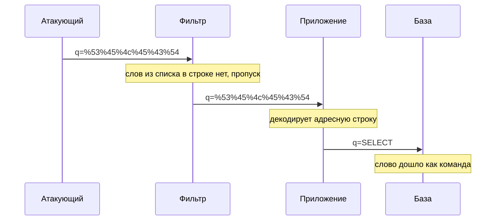

# Обход фильтров и WAF

В каталоге магазина проверяющий нашёл SQL-инъекцию: параметр поиска попадал
в запрос склейкой, и через него читалась чужая таблица (механика — в
`sqli-basics`). К релизу разработчики закрыли находку фильтром: код стал
отклонять запросы с кавычкой и словами `union` и `select`. Вектор из отчёта
он останавливает. На ретесте то же намерение прислали в числовом параметре:
`1 OR name = char(97,98)` — без единого слова из списка, фильтр промолчал.
База исполнила функцию и сравнила имена товаров с собранной строкой
`ab`. Дефект не починён: перед ним поставили табличку со списком слов.
Тема отвечает на один вопрос: почему табличка проигрывает всегда и что
ставить вместо неё.

## Заплатка, которая не починила дефект

Фильтр из истории выше устроен как чёрный список. Так называют проверку,
которая ищет во вводе запрещённые слова и символы и отклоняет запрос, если
нашла хотя бы одно из них. Ставят её из понятных побуждений: инъекцию уже
нашли, переписывать десятки запросов некогда и страшно, а перечислить
опасные слова — дело одного вечера. Заплатка честно снимает вектор из
отчёта, и на этом её действие кончается.

С чёрным списком вы уже сталкивались в чатах: модератор заносит слово
«дурак» в фильтр, и сообщение с ним не отправляется. Через день участники
пишут «дypak» с латинской буквой внутри, через неделю — «д.у.р.а.к», и
фильтр снова пуст. Соответствие такое: чат — приложение, фильтр модератора —
список запрещённых слов в коде, «дypak» — то же намерение в записи, которой
в списке нет. Где пример перестаёт работать: в чате обход читает человек
и терпит, а в SQL обход читает машина, и чужая запись становится командой.

**Заплатка поверх найденной инъекции**

```python
BAD = ("'", "union", "select", "--")
```

Такой перечень отсекает и вектор из отчёта, и похожие строки с кавычкой. Но
у той же витрины выборка товара по `id` собрана той же склейкой, только без
кавычек: параметр числовой. В него и уходит намерение
`1 OR name = char(97,98)`. Функция `char` — штатная функция SQL: она
собирает строку из кодов символов, а 97 и 98 — коды букв `a` и `b`.
База вычислит её сама, без единой кавычки в присланной строке.

**Зачем это в работе AppSec-инженера.** Фильтр — самое частое, что вы
найдёте на месте защиты от инъекции: он выглядит как решение и почти никогда
им не работает. На ревью и ретесте его закрывают доводом, а не перебором
обходов против конкретного продукта. Довод здесь один: у намерения
бесконечно много записей, ниже он разобран по классам, а разговор
переводится на параметры.

**Откуда это взялось.** Заплатка появляется там, где инъекцию нашли, а
переписывать запросы на параметры некогда или страшно: проверка перед
входом дешевле правки множества мест. Первое время она честно снимает
найденный вектор — тот, что был в отчёте. Дальше выясняется, что вектор был
одной записью из многих, а список закрыл именно её. Так фильтр и становится
постоянным: снять его страшнее, чем поставить.

## Как это работает

Заплатка из истории выше проиграла по построению, а не из-за неполного
списка. Чёрный список — модель «запретить плохое», и она требует полного
перечня плохого. Для инъекции перечня нет: язык SQL допускает одну и ту же
команду во множестве записей, которые для базы неотличимы. Такую запись
называют равнозначной: выглядит иначе, разбирается так же. Фильтр обязан
закрыть их все, атакующему довольно одной непокрытой. Ниже пять классов
таких записей. Все SQL-классы, кроме отдельно помеченного, проверены
прогоном на SQLite 3.53.4, а расхождение декодирования — прогоном на
Python.

### Регистр и комментарий

Ключевые слова SQL нечувствительны к регистру: `SeLeCt x FROM t`
исполняется наравне с `SELECT`. Поэтому фильтр без приведения регистра
обходится одной буквой. Вызов `lower()` закрывает этот класс целиком: в
заплатке из раздела «Как это выглядит в коде» он как раз есть.

Второй класс — комментарий вместо пробела. Комментарий `/* ... */` в SQL
разбирается как пробел, поэтому `1/**/OR/**/1` для базы — то же, что
`1 OR 1`. У приёма есть продолжение: комментарий внутри самого ключевого
слова, `SEL/**/ECT`. Он привязан к СУБД — системе управления базой данных:
в MySQL такая запись работает, а SQLite отклоняет её с ошибкой синтаксиса.

### Кодирование: список видит одно, база другое

Третий класс вам уже знаком по теме `url-and-encoding`: процентное
кодирование. Каждый байт адресной строки записывается знаком процента и
двумя шестнадцатеричными цифрами, и слово `SELECT` превращается в
`%53%45%4c%45%43%54`. Если фильтр проверяет строку до декодирования, а
приложение декодирует её после, список видит одно, а база — другое. Двойное
кодирование переживает и один проход декодирования: `%2553` после первого
прохода становится `%53`, и слово собирается только на втором.



**Описание схемы.** Схема читается сверху вниз и показывает два прочтения
одной строки. Фильтр проверяет строку до декодирования и видит проценты с
цифрами, поэтому пропускает. Приложение декодирует адресную строку, и до
базы слово доходит уже открытым текстом. Зазор здесь между местом проверки
и местом декодирования, и закрывается он порядком операций, а не длиной
списка.

### Функция сборки и запись числа без цифр

Четвёртый класс — сборка строки функцией. Вы уже видели `char(97,98)` во
вступлении: база вычисляет функцию и получает `ab`, а в присланной строке
нет ни кавычки, ни букв слова. Работает это там, где значение попадает в
запрос без кавычек, то есть в числовом параметре. В строковом параметре
`char(97,98)` остаётся литералом: функция внутри кавычек не исполняется.

Пятый класс — шестнадцатеричная запись. Префикс `0x` говорит базе читать
дальше цифры по основанию шестнадцать, и `0x41` — это число 65, записанное
без привычных цифр. К перечню запрещённых слов такую запись не за что
зацепить: в ней нет ни одного слова.

Сводная картина по пяти классам.

| Класс записи | Пример | Что видит фильтр | Что получает база |
|---|---|---|---|
| Регистр | `SeLeCt` | незнакомое слово | `SELECT` |
| Комментарий | `1/**/OR/**/1` | нет слова с пробелами | `1 OR 1` |
| Кодирование | `%53%45%4c%45%43%54` | цифры и проценты | `SELECT` |
| Функция сборки | `char(97,98)` | вызов без кавычек | строка `ab` |
| Основание 16 | `0x41` | буквы с цифрой | число 65 |

Таблица конечна, а классов нет: язык SQL пополняется, и каждая новая
функция сборки добавляет записей. Поэтому пополнение списка отвечает на
прошлый инцидент, а не на следующий.

### «Запретить плохое» против «разрешить хорошее»

Из бесконечности записей следует общий вывод, переносимый на любой ввод.
Негативная модель — «запретить известное плохое» — проигрывает, потому что
перечень плохого неполон по построению. Позитивная модель — «разрешить
только заведомо хорошее» — полна по построению: для числа это проверка, что
пришло число, для значения из фиксированного набора — сверка со списком
разрешённого.

При этом и позитивная проверка — второй рубеж, а не починка. Починка у
инъекции одна: текст запроса отделён от данных, и тогда фильтровать данные
на предмет SQL не требуется вовсе — их там не читают как SQL. Как устроено
такое разделение, разбирает тема `parameterized-queries` дальше по
маршруту.

### WAF — тот же список перед приложением

Тот же чёрный список продаётся и как отдельный продукт. Web Application
Firewall (WAF), межсетевой экран веб-приложения, — посредник, который стоит
перед приложением и отклоняет запросы по признакам атаки. Записанный в
правилах признак называют сигнатурой: это эталонная запись известной
нагрузки, с которой сравнивается каждый запрос.

Бытовой пример — охрана на входе в здание с перечнем запрещённых
предметов: нож отберут, потому что он в перечне. Соответствие такое:
перечень охраны — правила WAF, равнозначная запись — предмет, который
опасен так же, а в перечень не попал. Где пример ломается: охранник видит
предмет глазами и вправе задержать незнакомое, а WAF сравнивает байты с
сигнатурами и незнакомую запись пропускает всегда.

Польза у такого посредника есть, и немалая. Он гасит массовое сканирование,
ловит известные нагрузки и даёт время на патч. Отсюда правило ревью: WAF
засчитывается как слой защиты в глубину, а не как закрытие дефекта.
Защитой в глубину называют устройство из нескольких независимых рубежей,
где провал одного не открывает систему. Приёмы против конкретного продукта
здесь не разбираются: они привязаны к версии и правилам и в работу ревьюера
не входят.

## Как это атакуют

Порядок у атакующего прямой, и собран он из классов выше. Сначала вектор
идёт как есть: отказ показывает, что фильтр есть. Затем слова присылаются
по одному: по тому, на какое слово запрос отклоняется, читается содержимое
списка. Такой перебор описан у PortSwigger в разделе про обход типовых
фильтров. Дальше подбирается класс записи, которого в списке нет: другой
регистр против фильтра без `lower()`, комментарий вместо пробела,
кодирование против проверки до декодирования.

Отдельный ход — смена параметра. Фильтр из отчёта писали под строковый
поиск с кавычками, а у той же страницы есть числовые параметры: сортировка,
номер страницы, `id` товара. Там кавычка не нужна вовсе, и намерение
записывается функцией `char` или арифметикой, как во вступлении. Скажите,
не возвращаясь к таблице: фильтр приводит ввод к нижнему регистру и
проверяет его до декодирования — какие классы из пяти остаются открыты?

## Как это выглядит в коде

Ревьюер узнаёт заплатку по перечню запрещённого перед запросом. Читать её
стоит тремя планами: назвать, что фильтр считает запрещённым; назвать,
каких классов записи он не видит; проследить, куда значение попадает после
проверки. Прежде чем читать выноски, решите сами, какой класс обхода здесь
открыт.

**Уязвимый вариант**

```python
# УЯЗВИМО — демонстрация, не для продакшена
BAD = ("'", "union", "select", "--")

def search(category):
    low = category.lower()                       # (1)
    if any(w in low for w in BAD):               # (2)
        raise Denied("подозрительный ввод")
    cur.execute(
        "SELECT name FROM products "
        "WHERE category = '" + category + "'")       # (3)
    return cur.fetchall()
```

1. Приведение к нижнему регистру закрывает вариацию регистра, но не
   комментарии и не кодирование.
2. Проверка ищет вхождение подстроки: `SEL/**/ECT` на подходящей СУБД её
   минует, а `char(...)` в числовом параметре собирает строку без
   запрещённых слов.
3. Сток тот же — склейка: фильтр стоит перед дефектом, а не вместо него.

Список пополнили словом `char` и запретом `/**/` — какая запись того же
намерения пройдёт теперь?

## Как защититься

Починка заменяет фильтр на разделение кода и данных. Текст запроса пишется
один раз, а значение едет отдельным параметром:

**Исправленный вариант**

```python
# Исправлено.
def search(category):
    cur.execute(
        "SELECT name FROM products WHERE category = ?",
        (category,))
    return cur.fetchall()
```

С параметром список `BAD` не нужен вовсе. Кавычка, `union` или
`char(97,98)` внутри значения едут в базу как данные: текст запроса уже
разобран, и содержимое значения никто не читает как SQL. Это проверено
прогоном: параметр со строкой `char(97,98)` находит товар с буквально таким
значением и ничего не исполняет. Полный рецепт даёт тема `parameterized-queries`,
включая обёртки ORM (Object-Relational Mapping, объектно-реляционное
отображение): такой слой строит запрос вызовами методов, а не сборкой строки.

Cheat sheet OWASP по предотвращению SQL-инъекций называет позитивную
проверку ввода дополнительной мерой, а не основной: основная — параметр.
Дополнительная мера всё же полезна. Для числового `id` это проверка, что
пришло число; для значения из фиксированного набора — сверка со списком
разрешённого. Обе работают после полного декодирования ввода, иначе
проверка смотрит не на ту строку, что получит база.

**Границы применимости.** Параметр не везде возможен: имя таблицы, имя
колонки и направление сортировки параметром не подставить. Там фильтр
остаётся, но уже позитивный: не «запретить `UNION`», а «разрешить только
имена из известного списка колонок». WAF при этом не снимается: он остаётся
слоем защиты в глубину, только в отчёте идёт строкой «защита в глубину», а
не «дефект закрыт».

Убедиться, что защита работает, можно тем же приёмом, которым ловили
обход. Прогоните против починенного запроса все записи из таблицы выше:
кавычку, `SeLeCt`, `%53%45%4c%45%43%54`, `char(97,98)`. Каждая обязана
уехать в базу данными и вернуть обычный или пустой результат, а не
изменить запрос. Если хоть одна запись меняет ответ не как значение,
склейка осталась где-то рядом.

## Частая ошибка

Решите до чтения дальше: если перед приложением работает WAF и инъекция им
блокируется, стоит ли чинить сам запрос?

Расхожее представление говорит «нет»: периметр уже закрыт, значит, склейку
можно оставить. Оно неверно, потому что WAF — сигнатурный слой, а не
разделение кода и данных. Он ловит формы, которые кто-то занёс в правила, и
пропускает равнозначные, которых там нет. Его задача — снизить шум и
выиграть время, а не гарантировать, что данные не станут командой.

Контрпример. WAF отклоняет запросы со словом `union` в любом регистре.
Атака через числовой параметр обходится и без него:
`1 OR name = char(97,98)` собирает строку функцией и проходит WAF целиком.
В базе она срабатывает, потому что за WAF стоит та же склейка. Правило
пополнят после инцидента — и следующая равнозначная запись пройдёт снова.

## Чеклист для ревью

1. Проверьте, что защита от инъекции — параметризованный запрос, а не
   список запрещённых слов или символов (ASVS v5.0-1.2.4).
2. Проверьте, что проверка ввода построена как список разрешённого, а не
   запрещённого, там, где параметр невозможен.
3. Проверьте, что ввод проверяется после полного декодирования, а не до
   него, если проверка вообще нужна.
4. Проверьте, что WAF учтён как слой защиты в глубину, а не как закрытие
   дефекта.
5. Проверьте, что снятие конкретного вектора из отчёта не выдаётся за
   устранение класса дефекта.

## Попробуй сам

Возьмите фильтр-заплатку — свою или `search` из раздела про код. Намерение
здесь — `UNION SELECT`: оба слова есть в списке `BAD`, и в исходной записи
фильтр его отклоняет. Не атакуя чужую систему, составьте таблицу
трёх равнозначных записей этого намерения: комментарий внутри слова,
процентное кодирование, другой регистр. Для каждой назовите класс и
причину, по которой фильтр её пропускает. Запись регистром проверяйте
против варианта фильтра без приведения к нижнему регистру: в `search` этот
класс уже закрыт вызовом `lower()`.

**Критерий выполнения** наблюдаемый: таблица из трёх строк, где для каждой
записи названы класс и причина, по которой чёрный список её пропускает.
Отдельной строкой — почему параметр закрывает все три сразу.

## Проверь себя

1. Фильтр из соседнего сервиса, параметр числовой:

   ```python
   BAD = ("select", "union", "char", "/*", "--")

   def find(tag):
       if any(w in tag.lower() for w in BAD):
           raise Denied("подозрительный ввод")
       cur.execute("SELECT * FROM tags WHERE id = " + tag)
       return cur.fetchall()
   ```

   Запишите намерение, которое пройдёт этот фильтр целиком, и назовите
   класс обхода.

2. WAF отклонил нагрузку с `UNION`, и запрос в приложении остался на
   склейке. Какую починку вы выберете?

   A. Оставить запрос как есть: инъекцию уже блокирует WAF, а две защиты
      одной точки — лишняя работа.

   B. Перевести запрос на параметры, а WAF оставить слоем защиты в
      глубину.

   C. Дополнить список запрещённого словом `char` и запретом `/**/`: раз
      контрпример пройден, следующая форма не пройдёт.

3. Почему чёрный список запрещённых слов не может закрыть инъекцию
   полностью?

4. Фильтр проверяет строку до декодирования, приложение — после. Не
   запуская, предскажите обе строки вывода.

   ```python
   from urllib.parse import unquote

   BAD = ("select", "union")

   def waf(q):
       return any(w in q.lower() for w in BAD)

   raw = "%53%45%4c%45%43%54"
   print("WAF видит:", raw, "->", "отказ" if waf(raw) else "пропуск")
   decoded = unquote(raw)
   print("после декодирования:", decoded, "->",
         "отказ" if waf(decoded) else "пропуск")
   ```

5. Возврат к теме `url-and-encoding`: как расхождение места декодирования
   пропускает закодированное слово мимо фильтра?
6. Возврат к теме `sqli-basics`: что происходит со строкой `char(97,98)` в
   параметризованном запросе и почему фильтровать её больше не требуется?

<details markdown="1">
<summary>Ответ 1</summary>

1. Подойдёт `1 OR 1=1`: параметр числовой, кавычки не нужны, а запрещённых
   слов в записи нет. Класс обхода — намерение, записанное без перечисленных
   форм: фильтр стоит перед склейкой, и склейка выполнит то, что фильтр
   пропустил.

</details>

<details markdown="1">
<summary>Ответ 2: разбор вариантов</summary>

2. Верный ответ — B.

   A. WAF — сигнатурный слой: он ловит формы из правил и пропускает
      равнозначные, которых там нет. За ним остаётся та же склейка, и
      контрпример раздела «Частая ошибка» проходит его целиком.

   B. С параметром данные не читаются как SQL, и фильтровать их на предмет
      команд не требуется. WAF при этом полезен: гасит сканирование и даёт
      время на патч — слой, а не закрытие дефекта.

   C. Список требует полного перечня плохого, а равнозначных записей у
      одной команды бесконечно много: `0x41` запишет число без цифр,
      `SeLeCt` — ключевое слово без регистра. Пополнение списка отвечает на
      прошлый инцидент, не на следующий.

</details>

<details markdown="1">
<summary>Ответ 3</summary>

3. Список требует полного перечня плохого, а перечень для инъекции
   бесконечен. Регистр, комментарий вместо пробела, кодирование и сборка
   строки функцией дают ту же команду в записи, которой в списке нет.
   Довольно одной непокрытой формы.

</details>

<details markdown="1">
<summary>Ответ 4</summary>

4. WAF пропустит, а проверка после декодирования сработала бы. Проверка
   прогоном файла `wafdemo.py` с этим кодом:

   ```bash
   python3 wafdemo.py
   ```

   ```text
   WAF видит: %53%45%4c%45%43%54 -> пропуск
   после декодирования: SELECT -> отказ
   ```

   Список видит одну строку, база — другую: для фильтра это проценты и
   цифры, для базы — ключевое слово. Поэтому проверка, если она нужна,
   делается после полного декодирования.

</details>

<details markdown="1">
<summary>Ответ 5</summary>

5. Фильтр проверяет строку до декодирования, приложение декодирует после.
   `%53%45%4c%45%43%54` для фильтра не `SELECT`, а для базы — уже
   `SELECT`.

</details>

<details markdown="1">
<summary>Ответ 6</summary>

6. Она едет в базу как значение параметра: текст запроса отделён от
   данных, и содержимое значения никто не разбирает как SQL. Кавычка,
   `union` или `char(...)` внутри значения командой не становятся —
   фильтровать нечего.

</details>

## Источники

1. PortSwigger, «SQL injection: bypassing common filters» и Web Security
   Academy, «SQL injection»; реестр `ps-sqli`. Разделы: case variation,
   URL-encoding, SQL comments, комментарии внутри ключевых слов в MySQL,
   функция CHAR для сборки строк.
   <https://portswigger.net/web-security/sql-injection>
2. OWASP SQL Injection Prevention Cheat Sheet; реестр
   `owasp-cs-sqli-prevention`. Разделы: Option 3 Allow-list Input
   Validation, Additional Defenses.
   <https://cheatsheetseries.owasp.org/cheatsheets/SQL_Injection_Prevention_Cheat_Sheet.html>

Каркас этапа: `owasp-asvs-5-document` (ASVS v5.0.0), `owasp-wstg-42`,
`owasp-top10-2025`. Наследуются всеми темами и отдельной строкой не
повторяются.

**Скоропортящийся слой.** Комментарий внутри ключевого слова и функции
сборки строк привязаны к СУБД: `SEL/**/ECT` работает в MySQL и не работает
в SQLite. Правила WAF и их обходы меняются от версии к версии и в теме
сознательно не разбираются.

**Маркеры уверенности.** Равнозначность записей — **проверено лично**
2026-08-24 на SQLite 3.53.4, перепроверено 2026-09-03 и 2026-10-03:
`SeLeCt x FROM t` возвращает строку наравне с `SELECT`, `1/**/OR/**/1`
разбирается как `1 OR 1`, `char(97,98)` даёт `ab`, `0x41` даёт 65. Граница
приёма с `char()` проверена там же: в числовом параметре
`1 OR name = char(97,98)` возвращает строки без единой кавычки, а в
строковом `char(97,98)` остаётся литералом — функция внутри кавычек не
исполняется; то же подтверждено для параметризованного запроса 2026-10-03.
Комментарий внутри ключевого слова `SEL/**/ECT` на SQLite **не сработал**
(ошибка синтаксиса) — приём привязан к MySQL, помечен по документации.
Прогон `wafdemo.py` из вопроса 4 повторён 2026-10-03, вывод совпал
дословно. Приёмы регистра, комментариев, кодирования и CHAR и обход WAF
через них — **по документации** (PortSwigger, открыт лично 2026-08-24).
Расхождение места декодирования — **по документации** (тот же источник и
`url-and-encoding`).
