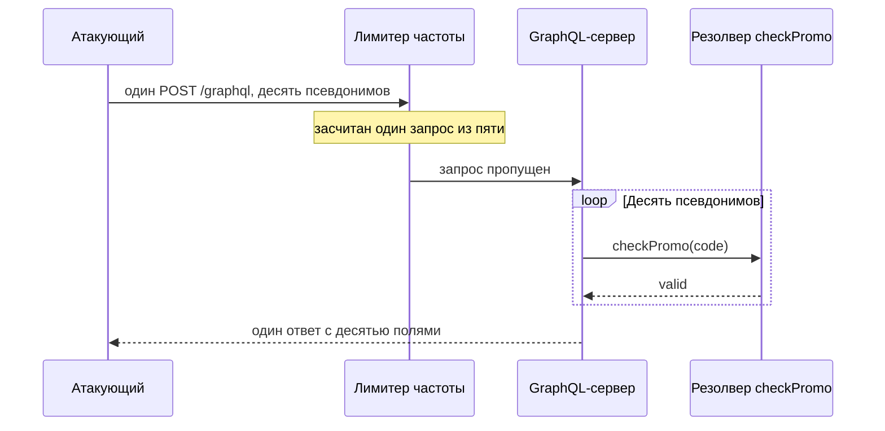

# Уязвимости GraphQL

У учебного магазина стоит честный лимит: GraphQL-эндпоинт принимает не
больше пяти запросов в минуту с одного клиента. Вот прогон перебора
промокодов по этому стенду:

```text
HTTP-запросов отправлено:      1
проверок промокода выполнено:  10
найден рабочий код:            ['SAVE20']
счётчик 'не больше 5 запросов в минуту' увидел: 1 запрос
```

Счётчик не сломался: запрос действительно был один. Внутри него лежали
десять операций, и каждая проверила свой промокод. Лимит считал конверты,
а работало содержимое.

Причина в устройстве GraphQL, знакомом вам по теме `rest-and-graphql`:
адрес у API один, и клиент сам описывает, какие поля нужны в ответе. Эта
свобода сдвигает привычные границы защиты: схема отдаётся целиком по
встроенному запросу, а одна проверка права на входе не различает поля.
Разберём, как каждое из трёх свойств превращается в дефект и как дефект
закрыть.

## Как это работает

Все три дефекта темы растут из одной модели, поэтому сначала напомним её.
Устройство GraphQL подробно разобрано в теме `rest-and-graphql`, а здесь
нужны три его следствия. У API один эндпоинт, обычно `/graphql`. За ним
стоит схема — формальное описание всех типов и полей. За каждым полем
стоит резолвер, функция, которая достаёт значение этого поля. Сервер
исполняет запрос по полям, и у каждого поля свой вызов резолвера со своим
походом в хранилище.

Из модели следуют три свойства. Первое: сервер умеет рассказать о своей
схеме сам. Второе: один запрос может нести много операций. Третье:
решение о праве принимается не на адресе, а внутри поля. Разберём каждое
на прогоне стенда.

### Интроспекция отдаёт схему целиком

Интроспекция — встроенная способность сервера отдать свою схему по
обычному запросу. Клиент спрашивает служебное поле `__schema` и получает
список типов, полей и аргументов. Зачем она придумана: по схеме работают
редакторы запросов, генераторы клиентов и документация, поэтому в
разработке интроспекцию держат включённой. Если схема — это меню
ресторана из темы `rest-and-graphql`, то интроспекция печатает это меню
для любого спросившего.

В проде та же способность отдаёт карту API атакующему. Ему не нужно
угадывать имена полей и скрытые мутации: он получает их списком и сразу
видит, что спросить. Вот прогон стенда, где интроспекцию включают и
выключают:

```text
$ python e02-graphql.py
=== А. интроспекция раскрывает схему ===
  включена:  {'__schema': {'Query': [...], 'User': [...]}}
  отключена: {'errors': ['интроспекция отключена']}
```

С включённой интроспекцией запрос к полю `__schema` возвращает типы и
поля, с отключённой — отказ. На этом можно было бы закрыть вопрос, но у
отказа есть две оговорки.

Первая оговорка — подсказки имён. Платформа Apollo в сообщении об ошибке
предлагает похожее правильное имя поля, как поисковик пишет «возможно,
вы имели в виду». Инструменты собирают схему по таким подсказкам:
предлагают имя, читают поправку сервера, повторяют.

Вторая оговорка — грубые фильтры, и здесь работает разница в том, кто
как читает запрос. GraphQL считает запятые и переводы строк незначащими
символами: для сервера запись `__schema` с дописанной запятой — то же
самое поле. А грубый фильтр ждёт точный образец, например слово `__schema` сразу со
скобкой. Дописанная запятая ломает образец, но не запрос: фильтр молчит,
а сервер исполняет. А если интроспекция закрыта только для метода `POST`,
её спрашивают методом `GET`.

### Псевдонимы упаковывают много операций в один запрос

Перебор вроде подбора промокода обычно останавливают счётчиком частоты:
сервис считает запросы клиента и отклоняет лишние. Бытовой пример — ввод
кода из SMS: банк принимает не больше пяти попыток в минуту, и перебор
тысячи вариантов растягивается на часы. Счётчик ставят на HTTP-запрос,
потому что в REST одна операция — это ровно один запрос.

В GraphQL это соответствие ломается. Имена полей в одном ответе обязаны
различаться, поэтому повторить одно поле дважды нельзя. Псевдоним решает
конфликт: полю дают собственное имя в ответе, и одна операция повторяется
под разными именами сколько угодно раз. Псевдонимы введены в теме
`rest-and-graphql`; здесь важно следствие. Для счётчика, который считает
HTTP-запросы, такой пакет — единица, а для сервера — десять обращений к
резолверу.

```graphql
query {
  c1: checkPromo(code: "SAVE10") { valid }
  c2: checkPromo(code: "SAVE11") { valid }
  c3: checkPromo(code: "SAVE12") { valid }
}
```

Три псевдонима — три проверки кода в одном HTTP-запросе. Стенд повторяет
операцию десять раз, и вот результат:

```text
=== Б. один HTTP-запрос перебирает промокоды псевдонимами ===
  HTTP-запросов отправлено:      1
  проверок промокода выполнено:  10
  найден рабочий код:            ['SAVE20']
  счётчик 'не больше 5 запросов в минуту' увидел: 1 запрос
```

Один запрос проверил десять промокодов и нашёл рабочий, а лимит увидел
единицу. Так перебирают всё, что защищено счётчиком запросов, а не
операций: промокоды, пароли, одноразовые токены. Рядом стоит вторая
возможность с тем же эффектом — пакетная отправка, batching: сервер
принимает массив из нескольких запросов одним HTTP-запросом.



**Описание схемы.** Схема читается сверху вниз и показывает прогон Б по
участникам. Лимитер стоит перед сервером и видит только конверт: один
HTTP-запрос, значит, засчитана единица. Внутри сервера тот же запрос
рассыпается на десять вызовов резолвера, по одному на псевдоним, и каждый
вызов — настоящая проверка промокода. Ответ собирается обратно в один
конверт с десятью полями.

Скажите, не заглядывая дальше: лимит в сто запросов в минуту вместо пяти
закрыл бы этот перебор?

### Право проверяют там, где данные достаются

Третий дефект — про авторизацию, проверку того, что вошедшему
пользователю можно. За одним эндпоинтом лежат все запросы и мутации
схемы. Проверка права на входе в эндпоинт не различает их: она пропускает
либо всё, либо ничего. Различать, кому какое поле можно, способен только
тот, кто поле исполняет, — резолвер.

Стенд показывает разницу на поле `email`. Резолвер имени отдаёт имя
любому вошедшему, а резолвер почты спрашивает, чей это профиль:

```text
=== В. поле email закрыто авторизацией на резолвере ===
  carlos (id=1) читает user(id=2): {'name': 'admin', 'email': '[скрыто…]'}
  сам admin (id=2) читает себя:    {'name': 'admin', 'email': 'root@…'}
```

Пользователь carlos читает чужой профиль и получает имя, но не почту, а
сам admin получает оба поля. Право проверено в резолвере поля, а не на
эндпоинте. Это главное, чем контроль доступа в GraphQL отличается от
REST: там у каждой операции свой адрес, и проверку можно поставить на
маршрут.

**Зачем это в работе AppSec-инженера.** Дефекты доступа в GraphQL те же,
что в REST, но проверять их приходится на другом уровне: авторизацию
смотрят на резолвере, а не на эндпоинте. Тема даёт три вопроса к любому
GraphQL-API: отключена ли интроспекция, где проверяется право и считает
ли лимит операции, а не запросы. Ответ на каждый наблюдаем, и способы
получить его собраны в чеклисте этой темы.

**Откуда это взялось.** Самоописываемость — часть замысла GraphQL: по
схеме строятся клиенты, редакторы запросов и документация, и интроспекция
встроена ради них. Псевдоним придуман для другого: два поля с одним
именем в ответе несовместимы, и псевдоним даёт полю своё имя. Оба решения
честно работают в разработке, а в проде каждое открывает свою дыру.
Прогоны этой темы сняты на учебном эндпоинте в несколько десятков строк,
который показывает все три свойства.

## Как это атакуют

Порядок атаки на GraphQL-API идёт от дешёвого к дорогому, и разведка в
нём почти бесплатна.

Шаг первый — спросить схему. Атакующий отправляет запрос интроспекции к
полю `__schema`. Пришла схема — дальше он читает её как перечень целей:
имена запросов, мутаций и аргументов уже известны, угадывать нечего.

Шаг второй нужен, когда пришёл отказ. Тогда схему восстанавливают по
частям. Имена перебирают, читая подсказки в ошибках. Фильтр пробуют
обойти запятой после слова `__schema`: сервер такой символ игнорирует,
а образец фильтра ломается. Запрет на метод `POST` обходят сменой метода
на `GET`. Все три хода разобраны в подразделе про интроспекцию.

Шаг третий — перебор ценностей. Промокоды, пароли или одноразовые токены
упаковываются псевдонимами в один запрос, и счётчик частоты атаку не
видит.

Шаг четвёртый — чтение чужих данных. Атакующий просит объекты по чужим
идентификаторам и смотрит, какие поля отдал резолвер без проверки. Это та
же дыра, что в теме `bola`, с одной разницей: адрес здесь один, и
проверку ищут в резолвере, а не на маршруте.

## Как это выглядит в коде

Ревьюер ищет в GraphQL-коде два места: резолвер, который достаёт данные,
не спросив о праве, и проверку доступа, привязанную к эндпоинту вместо
поля. Ниже оба места в одном файле. До чтения выносок отметьте сами, где
данные достаются без проверки и где проверка привязана не к тому уровню.

```python
# УЯЗВИМО — демонстрация, не для продакшена
def resolve_user(obj, info, id):
    return db.get_user(id)            # (1) любой аутентифицированный

# Авторизация на входе в эндпоинт, одна на все операции:
def graphql_endpoint(request):
    require_login(request)            # (2) пустил внутрь — пустил ко всему
    return schema.execute(request.body, context=request)
```

1. Резолвер отдаёт пользователя по `id` без проверки, кто спрашивает и на
   что имеет право.
2. Право проверено на эндпоинте: кто прошёл вход, тот дотянулся до всех
   полей и операций схемы.

Инвариант и декорация здесь такие. Имена функций и устройство фреймворка
— декорация: в другом стеке резолвер и эндпоинт назовутся иначе.
Инвариант — пара признаков: данные достаются без вопроса о праве, а
единственная проверка стоит на уровне, который полей не различает.
Найденный резолвер без проверки остаётся находкой и там, где схема
закрыта от интроспекции: доступ к данным не зависит от того, видно ли их
описание.

## Как защититься

Защита складывается из пяти мер, и первая из них главная: она переносит
проверку туда, где запрос уже разобран до полей.

**Авторизация на резолвере.** Право на объект и на поле проверяется в
резолвере, а не на эндпоинте: там, где данные достаются, известно, кто и
что запросил. Исправленный вариант поля `email` из прогона В:

```python
# Исправленный вариант: право проверяет резолвер поля
def resolve_email(user, info):
    if info.context.user.id != user.id:
        return None               # почту видит только владелец
    return user.email
```

Теперь чужой пользователь получает имя, а вместо почты — пустое поле:
именно это показывает прогон стенда. Такая проверка повторяется в каждом
резолвере с чувствительными данными, поэтому её выносят в общий слой, а
не пишут заново в каждом поле.

**Интроспекция отключается в проде.** Если API не предназначен для
сторонних потребителей, интроспекцию выключают, а подсказки об именах
полей в ошибках — тоже (ASVS v5.0-4.3.2). Мера не делает схему тайной:
подсказки и обходы из подраздела про интроспекцию остаются. Но бесплатную
карту она у атакующего забирает, а свои разработчики не страдают: для
команды интроспекцию оставляют на стендах.

**Лимит считает операции, а не запросы.** Счётчику HTTP-запросов
псевдонимы невидимы, поэтому ограничивают само содержимое: число
псевдонимов, глубину и сложность запроса (ASVS v5.0-4.3.1). Глубина —
это вложенность полей друг в друга: пользователь, у него счета, у счетов
позиции. Сложность — статический вес запроса: у каждого поля своя цена,
и веса суммируются по схеме. Оба числа считаются до выполнения, и запрос
выше порога отклоняется, не запустив ни одного резолвера.

**Схема не выставляет приватные поля.** Публичную схему проверяют на
поля, которых в ней быть не должно: внутренние идентификаторы, адреса,
служебные флаги. Поле, которого нет в схеме, атакующий не спросит вовсе,
а это дешевле любой проверки.

**Стоимость запроса оценивается с учётом аргументов.** Сложность
считается по схеме, но цена поля зависит и от аргументов: «первые десять
счётов» и «первые десять тысяч» выглядят одинаково, а грузят хранилище
по-разному. Поэтому оценка стоимости смотрит и на аргументы вроде
`first: 1000`, и запрос с завышенной ценой отклоняется до выполнения.
Так закрывается отказ в обслуживании, где один запрос надолго занимает
хранилище.

**Границы применимости.** У мер есть цена. Резолверная авторизация
размазывает проверки по схеме, и без общего слоя их теряют. Лимиты по
глубине и стоимости требуют поддержки в движке и настройки порогов под
свой трафик. Отключённая интроспекция ломает редакторы запросов у
сторонних потребителей, если они есть. А старый счётчик HTTP-запросов
никто не отменяет: он остаётся дешёвым первым рубежом против грубого
шума, но перестаёт быть единственной мерой.

## Частая ошибка

Ответьте до чтения дальше: что закрывает отключённая интроспекция и что —
лимит частоты?

Распространённый ответ складывается из двух пунктов: интроспекция
отключена — схема скрыта, а лимит частоты стоит — перебор закрыт. Оба
пункта неверны, и вот почему.

**Отключённая интроспекция не прячет схему полностью.** Подсказки об
именах полей в сообщениях об ошибках выдают схему по частям. А грубый
фильтр по ключевому слову обходят запятой после имени или сменой метода
на `GET`. Схему приходится не столько прятать, сколько считать известной
и защищать доступ к данным, а не к её описанию.

**Лимит частоты по HTTP-запросам перебор не закрывает.** Псевдонимы
упаковывают сотни операций в один запрос, и счётчик запросов их не видит.
Контрпример — прогон из начала темы: десять проверок промокода при одном
засчитанном запросе. Считать надо операции: число псевдонимов, глубину и
стоимость.

## Чеклист для ревью

1. Проверьте, что право на объект и на поле проверяется в резолвере, а не
   только на входе в GraphQL-эндпоинт.
2. Проверьте, что интроспекция отключена в проде, если API не предназначен
   для сторонних потребителей (ASVS v5.0-4.3.2).
3. Проверьте, что подсказки об именах полей в сообщениях об ошибках
   отключены.
4. Проверьте, что лимит ограничивает число псевдонимов, глубину и
   сложность запроса, а не только частоту HTTP-запросов (ASVS v5.0-4.3.1).
5. Проверьте, что публичная схема не выставляет приватные поля объектов.
6. Проверьте, что оценка стоимости учитывает аргументы запроса, например
   размер страницы, а не только схему.

## Попробуй сам

Поднимите или возьмите учебный GraphQL-эндпоинт. Отправьте запрос
интроспекции к полю `__schema` и посмотрите, отдаётся ли схема. Затем
составьте один запрос с десятком псевдонимов одной операции и посмотрите,
засчитает ли лимит частоты его как один запрос.

**Критерий выполнения** наблюдаемый: записано, раскрыла ли интроспекция
схему и сколько операций выполнил один запрос с псевдонимами при одном
засчитанном. Отдельной строкой названо, где проверяется право на поле, —
на резолвере или на эндпоинте.

## Проверь себя

1. Атакующий отправил один запрос:

   ```graphql
   query {
     a: checkPromo(code: "SAVE10") { valid }
     b: checkPromo(code: "SAVE20") { valid }
     c: checkPromo(code: "SAVE30") { valid }
   }
   ```

   Сколько проверок промокода выполнит сервер и что засчитает лимит «не
   больше пяти запросов в минуту»?

2. Перебор промокодов прошёл мимо счётчика частоты. Какую починку вы
   выберете?

   A. Поднять лимит со ста до пяти запросов в минуту и дождаться, пока
      перебор в него упрётся.

   B. Считать операции, а не запросы: ограничить число псевдонимов,
      глубину и сложность запроса.

   C. Отключить интроспекцию в проде, чтобы атакующий не узнал имя поля
      `checkPromo`.

3. Почему проверка права на входе в GraphQL-эндпоинт недостаточна?

4. Не запуская, предскажите обе строки вывода.

   ```python
   query = "query { " + " ".join(
       f'a{i}: checkPromo(code: "X{i}")' for i in range(10)) + " }"

   def limiter_allows(http_requests):
       return http_requests <= 5

   print("HTTP-запросов: 1, проверок внутри:", query.count("checkPromo"))
   print("лимитер пропустил:", limiter_allows(1))
   ```

5. Возврат к теме `rest-and-graphql`: чем один эндпоинт GraphQL отличается
   от множества адресов REST для контроля доступа?
6. Возврат к теме `bola`: почему резолвер, отдающий объект по `id` без
   проверки, — та же дыра, что в REST-эндпоинте?

<details markdown="1">
<summary>Ответ 1</summary>

1. Три проверки промокода: псевдоним повторяет одну операцию под разными
   именами в одном запросе. Лимит засчитает один HTTP-запрос из пяти —
   счётчик видит конверт, а работает содержимое.

</details>

<details markdown="1">
<summary>Ответ 2: разбор вариантов</summary>

2. Верный ответ — B.

   A. Сто запросов в минуту — это сто раз по сотне псевдонимов: перебор
      стал быстрее, а не остановлен. Лимит по запросам считает не ту
      единицу.

   B. Лимит по операциям видит содержимое: псевдонимы, глубина и сложность
      считаются до выполнения, и упакованный перебор отклоняется целиком
      (ASVS v5.0-4.3.1).

   C. Имя поля восстанавливается и без интроспекции: платформа сама
      подскажет похожее имя в ошибке, а фильтр по `__schema` обходится
      запятой или методом GET. Схему считают известной и защищают доступ
      к данным, а не к её описанию.

</details>

<details markdown="1">
<summary>Ответ 3</summary>

3. За одним эндпоинтом лежат все запросы и мутации схемы. Проверка на
   входе пропускает либо ко всему, либо ни к чему; различать право по
   объекту и полю она не может — это делает резолвер.

</details>

<details markdown="1">
<summary>Ответ 4</summary>

4. Одна оболочка, десять операций, и лимитер согласен:

   ```text
   $ python3 alias.py
   HTTP-запросов: 1, проверок внутри: 10
   лимитер пропустил: True
   ```

   Ответ на вопрос из раздела темы: лимит в сто запросов вместо пяти
   закрыл бы ровно ничего — считается конверт, а не содержимое.

</details>

<details markdown="1">
<summary>Ответ 5</summary>

5. В REST у каждой операции свой адрес, и право проверяют на маршруте. В
   GraphQL адрес один, поэтому право проверяют не на эндпоинте, а в
   резолвере поля.

</details>

<details markdown="1">
<summary>Ответ 6</summary>

6. Потому что дефект тот же — объект отдаётся без проверки, кто и на что
   имеет право. Меняется лишь место: не маршрут REST, а резолвер поля.

</details>

## Источники

1. PortSwigger Web Security Academy, «GraphQL API vulnerabilities»; реестр
   `ps-graphql`. Разделы: интроспекция и её обходы (спецсимвол после
   `__schema`, смена метода на `GET`), подсказки Apollo, обход ограничения
   частоты псевдонимами, GraphQL-CSRF.
   <https://portswigger.net/web-security/graphql>
2. OWASP, «GraphQL Cheat Sheet»; реестр `owasp-cs-graphql`. Разделы:
   отключение интроспекции в проде, лимит глубины и сложности, лимит на
   batching, авторизация на уровне резолвера, а не эндпоинта.
   <https://cheatsheetseries.owasp.org/cheatsheets/GraphQL_Cheat_Sheet.html>
3. GraphQL Foundation, «Learn GraphQL»; реестр `graphql-learn`. Разделы:
   резолверы и исполнение запроса, псевдонимы полей, интроспекция как
   встроенная функция.
   <https://graphql.org/learn/>

Каркас этапа: `owasp-asvs-5-document` (ASVS v5.0.0), `owasp-wstg-42`,
`owasp-top10-2025`. Наследуются всеми темами и отдельной строкой не
повторяются.

**Скоропортящийся слой.** Обходы отключённой интроспекции и поведение
подсказок — свойство конкретных серверов (Apollo и других) и меняются с
их версиями; модель GraphQL (один эндпоинт, резолверы, псевдонимы,
интроспекция) стабильна и задана спецификацией.

**Маркеры уверенности.** Раскрытие схемы интроспекцией и отказ при
отключённой, перебор десяти промокодов псевдонимами в одном запросе при
одном засчитанном и закрытие поля `email` авторизацией на резолвере —
**проверено лично** 2026-08-24 на Python 3.14.7 (стенд `e02-graphql.py`,
учебный эндпоинт без внешних пакетов): запрос к `__schema` возвращает
типы и поля; один запрос выполняет десять проверок кода; чужой
пользователь получает имя без почты. Модель GraphQL, роль резолверов и
псевдонимов — **по документации** (страница graphql.org, открыта лично
2026-08-24). Обходы интроспекции, подсказки Apollo и меры защиты — **по
документации** (страницы PortSwigger и OWASP, открыты лично 2026-08-24).
Поведение живых серверов Apollo на подсказках и обходах фильтра
**не воспроизводилось**: в стенде учебный эндпоинт, а не Apollo.
Листинг из вопроса 4 самопроверки прогнан локально 2026-10-03, Python
3.14.7; вывод совпал дословно.
