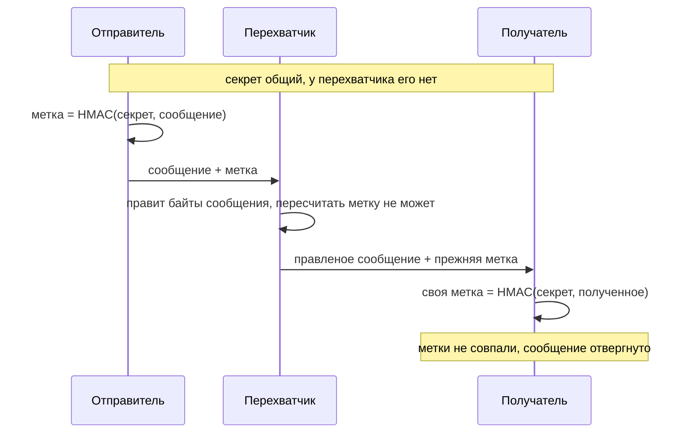

# HMAC и подпись: чем отличаются от шифрования

Приложение интернет-магазина хранит корзину в cookie, и разработчик шифрует
строку платежа шифром AES, чтобы посторонний её не прочитал. Атакующий
перехватывает свою же cookie, но не пытается ничего расшифровывать. Вместо
этого он правит три байта шифротекста и отправляет cookie обратно. Ключа у
него нет, а вот что получилось на сервере:

```text
исходный текст:  'amount=100&to=alice'
правлено байт шифротекста: 3
после правки:    'amount=999&to=alice'
расшифровка прошла без ошибки — приложение подмену не увидело
```

Прочитать содержимое атакующий не смог, а поменять смог. Шифрование
выполнило своё обещание целиком: оно спрятало текст. Обещания, что текст по
дороге никто не менял, в нём не было. Скрытность, целостность и авторство —
три разных свойства, и у каждого свой механизм.

## Три свойства вместо одного

Слово «зашифровали» в разговоре покрывает сразу три разных обещания.
Разделим их, потому что каждый механизм даёт ровно одно своё.

Скрытность значит, что содержимое читают только те, кому оно предназначено.
Бытовой пример — письмо в непрозрачном конверте: почтальон видит, что письмо
есть, и знает адрес, а текста внутри у него нет. Шифрование и есть такой
конверт: оно прячет содержимое от всех, у кого нет ключа.

Целостность значит, что данные по дороге не изменились. Здесь бытовой пример
— сургучная печать на том же конверте: вскрыть письмо, не сломав печать,
нельзя, а сломанную получатель заметит. Где аналогия ломается: сургуч можно
снять и отлить заново, если известен рисунок оттиска. Криптографическую
метку пересчитать без секрета нельзя вовсе.

Авторство значит, что можно доказать, кто поставил отметку. Пример — подпись
на бумажном заявлении: банк сверяет её с образцом, а при споре третья
сторона проверяет по тому же образцу. Где ломается эта аналогия: подпись
рукой подделывают, а цифровую подпись без закрытого ключа — нет.

За целостность отвечает отдельная величина — код аутентификации сообщения,
сокращённо MAC (message authentication code). Это короткая строка байт,
которую считают по данным вместе с секретом. Отправитель считает метку и
прикладывает её к сообщению. Получатель считает метку заново по полученным
данным и сравнивает. Совпала — значит, данные не менялись, а метку поставил
тот, кто знает секрет.

Стандартная конструкция MAC поверх хеш-функции называется HMAC. Хеш-функция
— это необратимое перемешивание: она считает по строке любой длины короткий
отпечаток фиксированного размера, а восстановить строку по отпечатку
нельзя; подробности — в теме `password-storage`. HMAC подмешивает секрет в
этот счёт дважды, и дальше будет видно, какую атаку закрывает именно
двойной проход.

Цифровая подпись решает ту же задачу целостности, но устроена иначе. Секрет
есть только у подписывающего: это закрытый ключ из пары, с которой читатель
встречался в теме `tls-and-proxy`. Проверяющий обходится открытым ключом, а
тот не секрет. Отсюда разница, определяющая выбор. Метку HMAC умеет ставить
любая из двух сторон, знающих общий секрет, поэтому доказать третьему лицу,
кто её поставил, нельзя. Подпись это доказывает: проверяющий закрытого
ключа не имеет.

| Механизм | Что даёт | Кто умеет ставить | Кто умеет проверять |
|---|---|---|---|
| Шифрование | скрытность | владеющий ключом | владеющий ключом |
| Метка HMAC | целостность | любая из двух сторон | любая из двух сторон |
| Цифровая подпись | целостность и авторство | только владелец закрытого ключа | любой с открытым ключом |

Три строки таблицы — не три заменяемых варианта, а ответы на три разных
вопроса. Последние два столбца показывают, почему подпись доказывает
авторство, а метка нет: у метки ставящих двое, у подписи один.

**Зачем это в работе AppSec-инженера.** Фраза «данные зашифрованы, подменить
их нельзя» — рабочая гипотеза, которую положено проверять, а не принимать.
Из неё вырастают токены сессии в зашифрованной cookie без метки, самописные
подписи ссылок и обмен с платёжным шлюзом, где целостности нет ни у одной
стороны. Тема даёт три вопроса к любому месту, где данные уезжают из
приложения и возвращаются. Что здесь прячут? Чем защищают от правки? Кому
надо доказать авторство?

## Как это работает

**Откуда это взялось.** Первые схемы защиты канала рассуждали так: данные
шифруют, значит, посторонний их не прочитает и не подделает. Второе не
следовало из первого, и выяснилось это на практике. Поточные режимы
устроены так, что правка байта шифротекста предсказуемо меняет тот же
байт открытого текста, а расшифровка этого не замечает: проверять нечему.
Как именно — разберём в подразделе «Почему правка трёх байт сработала».
Ответом стала отдельная величина, которую считают по данным и секрету, —
MAC. Конструкцию HMAC
зафиксировал RFC 2104 в 1997 году, а стандарт FIPS 198-1 сделал её
нормативной. Отдельное свойство получило отдельный механизм.

### Почему правка трёх байт сработала

Разберём, почему подмена из начала темы прошла незамеченной. Опыт
поставлен на стенде — учебной программе, которая шифрует строку платежа
и печатает результат каждого шага. Шифр AES блочный: он перемешивает
ровно один блок из шестнадцати байт. Длинное
сообщение шифрует не сам шифр, а режим, то есть рецепт, как прогнать
сообщение через шифр; режимы и их ловушки разбирает тема `crypto-misuse`.
В опыте стоял режим счётчика, CTR. В нём AES шифрует не текст, а идущий
подряд счётчик, и получается поток байтов, похожий на случайный шум. Этот
поток складывается с текстом по модулю два.

Сложение по модулю два, операция XOR, даёт единицу там, где биты
различаются, и обращается тем же действием. Но у него есть и второе
свойство, и оно здесь всё ломает. Перевернуть бит в шифротексте значит
перевернуть тот же бит в открытом тексте после расшифровки. Проверки нет
никакой: любая последовательность байт считается законным шифротекстом и
расшифровывается.

Атакующему остаётся догадка о структуре, а структура в приложениях
повторяется: `amount=`, `role=`, `id=`. Зная, где лежит сумма, он правит
три байта так, чтобы `100` превратилось в `999`. Смысл платежа изменился, а
приложение получило корректно расшифрованную строку без единого признака
вмешательства. Прежде чем читать дальше, ответьте: что ещё, кроме суммы
платежа, меняется такой правкой в значениях, которым доверяет ваше
приложение?

### Что добавляет метка

Теперь к тому же шифрованию добавим метку. HMAC берёт секрет `K` и данные
`text` и считает хеш дважды: `H((K ⊕ opad) ‖ H((K ⊕ ipad) ‖ text))`.
Здесь `⊕` — сложение по модулю два из раздела про режим счётчика, а `‖` —
склейка строк. Заполнители `ipad` и `opad` — две разные константы, с
которыми секрет складывается на внутреннем и внешнем проходе.

Двойной проход нужен не для красоты. Он закрывает атаку достраиванием: у
конструкции «хеш от секрета и сообщения» известный выход хеша позволяет
дописать свои данные и продолжить счёт. Разбор этой атаки — в разделе «Как
это выглядит в коде». RFC 2104 просит выбирать ключ случайно и настойчиво
не рекомендует брать его короче выхода хеша.

Тот же стенд продолжает опыт. К тому же шифрованию добавляется метка
HMAC-SHA256, посчитанная по шифротексту. Затем то же сообщение шифруется
аутентифицированным режимом AES-GCM (первая часть вывода показана в начале
темы):

```text
$ python e05-hmac.py
(2) То же шифрование плюс HMAC-SHA256 по шифротексту
  длина метки: 32 байт; проверка целого сообщения: True
  проверка правленого шифротекста: False

(3) AES-GCM: шифрование и целостность одним вызовом
  шифротекст 35 байт при открытом тексте 19: метка 16 байт внутри
  правленый шифротекст отвергнут: InvalidTag
```

Читается вывод так. Во второй части метка посчитана по шифротексту и
проверена до расшифровки, поэтому правленые данные до расшифровывающего
кода не дошли. В третьей метку посчитал сам режим: AES-GCM относится к
аутентифицированным, то есть делает шифрование и метку одним вызовом.
Правленый шифротекст отвергнут ошибкой `InvalidTag` ещё до того, как
приложение увидело хоть один байт открытого текста.



**Описание схемы.** Схема читается сверху вниз. У отправителя и получателя
один общий секрет, у перехватчика его нет. Отправитель считает метку от
сообщения и секрета и шлёт сообщение вместе с меткой. Перехватчик правит
сообщение, а метку пересчитать не может и отправляет прежнюю. Получатель
считает свою метку от полученного сообщения, сравнивает с приложенной и
видит расхождение.

Осталось назвать порядок операций, потому что от него зависит, что именно
проверяет метка. Два законных пути дают один результат. Аутентифицированный
режим, AES-GCM или ChaCha20-Poly1305, делает обе работы одним вызовом и сам
следит за порядком. Связка «шифруем, потом считаем MAC по шифротексту»
собирает то же руками. ASVS требует именно этого порядка (`v5.0-11.3.5`).
При обратном проверка целостности случается уже после расшифровки чужих
данных. Тогда различимые ошибки расшифровки становятся подсказкой: это
оракул заполнения, и его разбирает тема `padding-oracle` дальше по
маршруту.

### Общий секрет против пары ключей

Вторая пара механизмов различается не стойкостью, а устройством ключа. У
HMAC секрет один на двоих. У цифровой подписи ключей два: закрытый остаётся
у подписывающего, открытый расходится проверяющим. Последняя часть того же
прогона ставит рядом метку и подпись Ed25519 — схему подписи на эллиптических
кривых, где подпись ставится закрытым ключом, а проверяется открытым:

```text
(4) Общий секрет против пары ключей
  HMAC: обе стороны знают 16-байтовый ключ, значит метку может
        поставить любая из них — авторство не доказуемо третьему лицу
  Ed25519: подпись 64 байт, проверяется открытым ключом
        проверка исходного сообщения: принято
        проверка подменённого сообщения: отвергнуто
```

Выбор между меткой и подписью — вопрос расстановки сторон, а не стойкости.
HMAC подходит, когда обе стороны свои: приложение подписывает свою же
cookie и само её проверяет. Подпись нужна, когда проверяющих много или
возможен спор об авторстве. Провайдер входа выдаёт токен, а десяток
приложений его принимает: раздать им общий секрет значит дать каждому право
выписывать токены от имени провайдера. На этом различии стоит разбор
алгоритмов токена в теме `jwt-basics`, а как выбирают сами алгоритмы и их
сроки годности, рассказывает тема `weak-algorithms`.

## Как это выглядит в коде

Ревьюер ищет три признака: расшифровку присланного значения без проверки,
самописную метку из хеша и склейки, сравнение меток обычным оператором.
Разбор идёт по трём шагам: найти точку входа чужих данных, назвать
отсутствующий контроль, сказать, что даёт его отсутствие. До выносок
найдите сами место в каждом листинге, которое открывает подмену.

Первый признак — расшифровка присланного значения без единой проверки до
неё:

```python
# УЯЗВИМО — демонстрация, не для продакшена
def load_cart(cookie: str) -> dict:
    raw = base64.b64decode(cookie)
    plain = aes_ctr_decrypt(KEY, raw[:16], raw[16:])   # (1)
    return json.loads(plain)                           # (2)
```

1. Шифротекст пришёл от клиента и расшифрован без проверки целостности.
2. Результат сразу разбирается как данные приложения.

Второй признак — метка есть, но самописная, хеш от склейки секрета и
данных:

```javascript
// УЯЗВИМО — демонстрация, не для продакшена
const tag = crypto.createHash('sha256')
  .update(SECRET + payload)            // (3)
  .digest('hex');
if (tag === req.query.sig) { /* … */ } // (4)
```

3. Секрет приклеен к данным и пропущен через обычную хеш-функцию.
4. Метки сравниваются оператором с ранним выходом.

### Самописная метка ломается достраиванием

Склейка `SECRET + payload` ломается достраиванием. У хешей семейства SHA-2
внутреннее состояние после обработки сообщения совпадает с выходом, то есть
с самой меткой. Поэтому счёт можно продолжить с известной метки: дописать к
сообщению своё поле и получить правильную метку, не зная секрета. Стенд
делает ровно это:

```text
$ python e09-length-ext.py
(1) Самописная метка sha256(secret || msg)
  секрет атакующему неизвестен, длина 16 байт известна
  дописано: '&role=admin'
  честная метка для дописанного сообщения совпала: True
  секрет не понадобился ни разу
(2) HMAC-SHA256 на том же секрете
  совпало: False
```

Строка про длину секрета в этом выводе не случайна: зная её, атакующий
восстанавливает выравнивание сообщения и продолжает счёт с правильного
места. HMAC устоял, потому что секрет подмешан дважды. Продолжить счёт с
выхода — значит обойти внешний проход, а он подмешивает секрет ещё раз.
Это и есть ответ на вопрос, зачем конструкции два заполнителя вместо
одного.

### Сравнение подсказывает байты по времени

Третий признак — сравнение меток оператором с ранним выходом. Такой
оператор останавливается на первом же несовпавшем байте, поэтому время
сравнения зависит от длины совпавшего начала. Атакующий меряет время ответа
и подбирает метку побайтно: вариант, на котором ответ стал чуть медленнее,
угадал очередной байт. Стенд замерил все три способа, по 20 000 замеров на
точку, и взял медиану:

```text
$ python e06-compare.py
  совпало байт   ранний выход   ==      compare_digest
             0            190      70               80
             8            311      70               80
            16            411      70               80
            24            521      70               80
            31            611      70               80
```

Цикл с ранним выходом растёт со 190 до 611 нс по мере совпадения. А
`hmac.compare_digest` держит ровно 80 нс на всех пяти точках: его время от
совпадения не зависит. Оператор `==` на этом стенде роста не показал, но
это свойство конкретной реализации, а не гарантия. Реализация языка вправе
поменять сравнение строк в любой версии.

## Как защититься

Починка держится на одном принципе: проверка стоит до доверия, и считает её
готовый механизм. Дальше шесть решений, и у каждого названо место, где оно
ломается.

**Аутентифицированный режим вместо сборки руками.** AES-GCM или
ChaCha20-Poly1305 делают шифрование и метку одним вызовом: одна операция,
один ключ, собирать порядок не нужно. Исправленная cookie корзины читается
по трём шагам: отделить одноразовое значение, отвергнуть правленое до
разбора, разбирать только проверенное.

```python
# Исправленный вариант
def load_cart(cookie: str) -> dict | None:
    raw = base64.b64decode(cookie)
    nonce, ct = raw[:12], raw[12:]
    try:
        plain = AESGCM(KEY).decrypt(nonce, ct, None)  # (1)
    except InvalidTag:
        return None                                   # (2)
    return json.loads(plain)                          # (3)
```

1. Расшифровка и проверка метки — один вызов; метка лежит внутри
   шифротекста.
2. Метка не сошлась — данные отвергнуты до всякого разбора, и
   расшифрованного текста у приложения нет вообще.
3. Разбираются только данные, прошедшие проверку целостности.

Одноразовое значение, nonce, — случайное число на одно шифрование; в такой
cookie оно идёт открытым рядом с шифротекстом, и это нормально: не секрет
оно, секрет — ключ. Подробно одноразовые значения разобраны в теме
`crypto-misuse`. Этот вариант прогнан локально: целая cookie прочитана,
правленая отвергнута с `InvalidTag`.

**Готовая функция MAC вместо своей.** Достраивание закрывается конструкцией,
а не длиной секрета, поэтому метку считает стандартная функция, а не хеш от
склейки. Исправленная проверка подписи ссылки:

```javascript
// Исправленный вариант
const tag = crypto.createHmac('sha256', SECRET)   // (1)
  .update(payload)
  .digest();
const got = Buffer.from(req.query.sig, 'hex');    // (2)
const ok = got.length === tag.length
  && crypto.timingSafeEqual(got, tag);            // (3)
```

1. Стандартный `createHmac` вместо склейки: два прохода с заполнителями
   закрывают достраивание конструкцией.
2. Присланная метка заранее приводится из шестнадцатеричной записи к
   байтам.
3. `timingSafeEqual` сравнивает за постоянное время; сначала сверяются
   длины, потому что функция требует аргументы одинаковой длины.

Прогон на Node.js: своя метка принята, чужая и метка другой длины
отвергнуты.

**Порядок «шифруем, потом MAC».** Если режим не аутентифицированный, метку
считают по шифротексту и по всему, что к нему прилагается: одноразовое
значение, идентификатор ключа, версия формата. Иначе атакующий подменит
ровно ту часть, которая в метку не вошла.

**Сравнение за постоянное время.** В Python это `hmac.compare_digest`, в
Node.js — `timingSafeEqual`, в других языках есть свои аналоги. Сравнение
строк оператором для меток не годится, даже если на вашем стенде оно не
показало роста времени.

**Подпись там, где проверяющих больше одного.** Общий секрет между тремя
сторонами перестаёт быть доказательством авторства для любой из них.

**Ключ метки отдельно от ключа шифрования.** Один ключ на две операции
лишает смысла разделение обязанностей, ради которого всё и затевалось.
Если один ключ обслуживает и шифрование, и метку, его утечка отдаёт
атакующему оба свойства сразу: и чтение, и подделку.

## Частая ошибка

Решите до чтения дальше: можно ли подделать данные, не читая их? В
обсуждениях защита данных сводится к одному свойству: если содержимое
закрыто, то и подделать его нельзя, ведь подделывающий не знает, что
внутри.

**Незнание содержимого не мешает его менять.** Поточные режимы и режим
счётчика дают правку бит в бит: перевернув бит шифротекста, атакующий
переворачивает тот же бит открытого текста. Достаточно догадки о структуре,
а структура в приложениях повторяется: `role=`, `amount=`, `id=`. Опыт из
начала темы поменял сумму платежа тремя байтами, не прочитав ни одного.

Обратный случай тоже встречается: метка есть, шифрования нет, и данные
читает кто угодно, хотя подменить их не может. Это законная конструкция —
подписанный токен из темы `jwt-basics` устроен ровно так. Ошибка начинается
там, где от неё ждут скрытности.

## Чеклист для ревью

1. Проверьте, что присланный шифротекст проверяется на целостность до
   расшифровки, аутентифицированным режимом или MAC (`v5.0-11.3.3`).
2. Проверьте, что связка шифрования и MAC собрана в порядке «шифруем, потом
   считаем метку по шифротексту» (`v5.0-11.3.5`).
3. Проверьте, что метка считается готовой функцией HMAC, а не хешем от
   склейки секрета с данными.
4. Проверьте, что хеш под HMAC взят из разрешённых, а MD5 не используется
   ни для какой криптографической цели (`v5.0-11.4.1`).
5. Проверьте, что метки сравниваются функцией постоянного времени, а не
   оператором сравнения строк.
6. Проверьте, что в MAC входят все поля, от подмены которых защищаются,
   включая одноразовое значение (IV) и идентификатор ключа.
7. Проверьте, что там, где проверяющих сторон больше одной, вместо общего
   секрета стоит подпись на паре ключей.

## Попробуй сам

Возьмите в своём или учебном приложении место, где значение уезжает клиенту
и возвращается обратно: cookie корзины, параметр ссылки, скрытое поле
формы. Определите, что с ним сделано: зашифровано, подписано, и то и другое
или ничего. Переверните один бит в возвращаемом значении и посмотрите на
ответ сервера.

Одна подсказка: смотрите не только на код ответа, но и на текст ошибки.
Различимая реакция на правленое значение — сама по себе находка, а тема
`padding-oracle` показывает, до чего её можно развить.

**Критерий** наблюдаемый: записано, какой из трёх ответов дал сервер —
отверг значение, принял изменённое или упал с ошибкой разбора. Названо,
какая из двух мер закрывает случай: аутентифицированный режим или отдельная
метка.

## Проверь себя

1. Проверка подписи в сервисе купонов:

   ```python
   def verify(query, sig):
       want = hashlib.sha256((SECRET + query).encode()).hexdigest()
       return sig == want
   ```

   У атакующего есть метка от `amount=100`. Он дописал `&role=admin` и
   пересчитал метку, не зная `SECRET`. На каком свойстве SHA-2 это
   сработало?

2. Cookie с платежом шифруется AES-CTR, метки нет. Какую починку вы
   выберете?

   A. Оставить схему, но удвоить длину ключа: тогда подделать данные
      станет вдвое труднее.

   B. Аутентифицированный режим (AES-GCM) или связка «шифруем, потом MAC
      по шифротексту».

   C. Шифровать, потом считать MAC по открытому тексту — так метка
      проверяет именно то, что читает приложение.

3. Почему по HMAC нельзя сказать, кто из двоих её поставил, и в каком
   случае это мешает?

4. Не запуская, предскажите, что напечатает правка трёх байт шифротекста.

   ```python
   import os

   key, nonce = os.urandom(16), os.urandom(8)

   def ctr(data):  # учебный XOR-поток вместо AES: свойство то же
       stream = (key + nonce) * 8
       return bytes(a ^ b for a, b in zip(data, stream))

   msg = b"amount=100&to=alice"
   ct = ctr(msg)
   bad = bytearray(ct)
   bad[7] ^= ord("1") ^ ord("9")
   bad[8] ^= ord("0") ^ ord("9")
   bad[9] ^= ord("0") ^ ord("9")
   print(ctr(bad))
   ```

5. Возврат к теме `tls-and-proxy`: какие из трёх свойств — скрытность,
   целостность, авторство — даёт соединение TLS и для какого участка пути?
6. Возврат к теме `sessions-vs-tokens`: самодостаточный токен читается
   любым получателем — какое свойство даёт его подпись и какого не даёт?

<details markdown="1">
<summary>Ответ 1</summary>

1. На совпадении внутреннего состояния с выходом: у SHA-2 состояние после
   сообщения равно самому хешу, поэтому счёт продолжается с известной
   метки. Сообщение достраивается, а метка пересчитывается без секрета.
   HMAC пропускает данные через хеш дважды с разными заполнителями и
   закрывает ровно это.

</details>

<details markdown="1">
<summary>Ответ 2: разбор вариантов</summary>

2. Верный ответ — B.

   A. Скрытность и целостность — разные свойства: ключ любой длины не
      мешает правке «бит в бит», и расшифровка правленого проходит без
      ошибки. Это опыт стенда из темы.

   B. Метка считается по шифротексту и проверяется до расшифровки: чужие
      данные до расшифровывающего кода не доходят. GCM делает то же одним
      вызовом.

   C. При обратном порядке приложение сначала расшифровывает присланное, а
      различимая реакция на неудачу открывает дорогу оракулу заполнения.
      Так называют атаку, где сервер своими ошибками подсказывает, верно
      ли выравнивание, и данные читаются байт за байтом.
      ASVS v5.0-11.3.5 требует обратного: MAC по шифротексту.

</details>

<details markdown="1">
<summary>Ответ 3</summary>

3. Знающий общий секрет умеет и ставить метку, и проверять её, поэтому по
   метке авторство не различить. Это мешает, когда проверяющих много или
   возможен спор третьему лицу: десяток приложений с общим секретом
   получают право выписывать токены от имени провайдера.

</details>

<details markdown="1">
<summary>Ответ 4</summary>

4. `b'amount=999&to=alice'` — расшифровка прошла без ошибки, сумма
   подменена.

   ```text
   $ python3 ctr.py
   b'amount=999&to=alice'
   ```

   Потоковое сложение по модулю два переводит правку шифротекста в ту же
   правку открытого текста, и проверять тут нечего: любая последовательность
   байт расшифровывается.

</details>

<details markdown="1">
<summary>Ответ 5</summary>

5. Скрытность и целостность — да, авторства в смысле этой темы — нет, и оба
   свойства действуют между двумя концами, пока соединение живёт. Данные в
   cookie или ссылке живут дольше соединения и проходят узлы, для которых
   оно закончилось, — там TLS не защищает ничего.

</details>

<details markdown="1">
<summary>Ответ 6</summary>

6. Подпись даёт целостность и авторство выдавшего: утверждения подменить
   нельзя, прочитать их может каждый. Скрытности токен не даёт — значения в
   нём читаются без ключа.

</details>

## Источники

1. IETF, RFC 2104 «HMAC: Keyed-Hashing for Message Authentication»,
   Informational; реестр `rfc2104-hmac`. Разделы: § 1 (задача MAC и общий
   секрет), § 2 (конструкция с `ipad` и `opad`), § 3 (ключ: случайный
   выбор, короче выхода хеша не рекомендуется), § 5 (усечение метки — не
   короче половины выхода и не короче 80 бит).
   <https://www.rfc-editor.org/rfc/rfc2104.html>
2. NIST, FIPS 198-1 «The Keyed-Hash Message Authentication Code (HMAC)»;
   реестр `fips-198-1-hmac`. Разделы: § 3 Explanation объявления стандарта
   (MAC подтверждает и источник, и целостность, без дополнительных
   механизмов), § 3 «Cryptographic Keys», § 4 «HMAC Specification» (таблица
   шагов), § 5 «Truncation».
   <https://csrc.nist.gov/pubs/fips/198-1/final>

Каркас этапа: `owasp-asvs-5-document` (ASVS v5.0.0), `owasp-wstg-42`,
`owasp-top10-2025`. Наследуются всеми темами и отдельной строкой не
повторяются.

**Скоропортящийся слой.** Набор рекомендованных аутентифицированных
режимов и предпочтительных схем подписи меняется вместе с рекомендациями
NIST и библиотек; разделение трёх свойств и конструкция HMAC стабильны с
1997 года.

**Маркеры уверенности.** Подмена суммы платежа правкой трёх байт
шифротекста AES-CTR, отказ HMAC-SHA256 и AES-GCM на том же правленом
шифротексте, размер метки GCM в 16 байт, проверка подписи Ed25519 на
исходном и подменённом сообщении — **проверено лично** 2026-08-24 на Python
3.14.7, библиотека `cryptography` 50.0.0 (стенд `e05-hmac.py`). Достраивание
метки `sha256(secret ‖ msg)` без знания секрета и устойчивость к нему
HMAC-SHA256 — **проверено лично** там же (стенд `e09-length-ext.py`, своя
реализация сжимающей функции SHA-256). Зависимость времени сравнения от
длины совпавшего начала — **проверено лично** (стенд `e06-compare.py`,
20 000 замеров на точку, медиана): цикл с ранним выходом дал рост со 190 до
611 нс, `hmac.compare_digest` — ровно 80 нс на всех пяти точках. Оператор
`==` на этом стенде роста не показал, но это свойство конкретной
реализации, а не гарантия. Конструкция HMAC, требования к ключу и усечению
— **по документации** (RFC 2104 и FIPS 198-1, открыты лично 2026-08-24).
Исправленные листинги из раздела «Как защититься» прогнаны локально
2026-10-03: AESGCM на Python 3.14.7 с `cryptography` 50.0.0 — целая cookie
прочитана, правленая отвергнута с `InvalidTag`; `createHmac` и
`timingSafeEqual` на Node.js 26.10.0 — своя метка принята, чужая и метка
другой длины отвергнуты. Листинг вопроса 4 прогнан повторно 2026-10-03,
вывод совпал дословно. Поведение библиотек шифрования других языков за
пределами прогнанных листингов **не воспроизводилось**.
