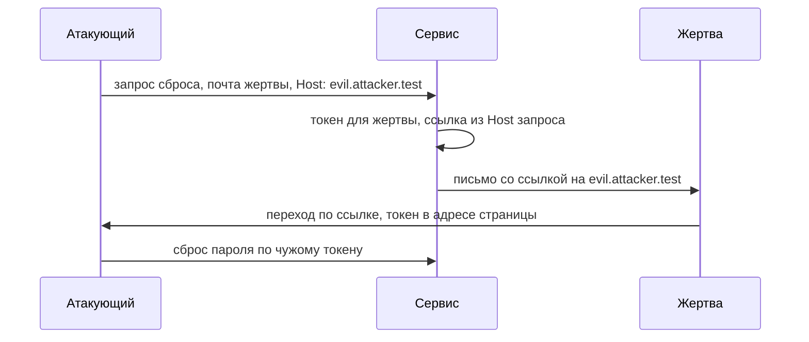

# Атаки на заголовок Host

Представьте сервис, где вы забыли пароль. Вы вводите почту в форму сброса,
и сервис присылает письмо со ссылкой. Чтобы собрать ссылку, ему нужен
домен, и он берёт его из заголовка `Host` вашего запроса. Теперь
представьте, что форму за вас заполнил чужой человек. Почту он вписал
вашу, а в `Host` подставил свой домен. Сервис честно сгенерировал токен
для вашей учётной записи и отправил письмо вам, но ссылка в письме ведёт
уже не на сайт сервиса. Вот два прогона учебного стенда, который собирает
такую ссылку:

```text
Host: accounts.example.com  -> https://accounts.example.com/reset?token=…
Host: evil.attacker.test    -> https://evil.attacker.test/reset?token=…
```

Токен в обеих ссылках один и тот же: он выписан жертве. Меняется только
домен, и во второй строке он принадлежит атакующему. Жертва получает
законное с виду письмо, переходит по ссылке — и отдаёт свой токен на
чужой сайт. Такая подмена называется отравлением ссылки сброса пароля, и
работает она потому, что приложение доверило заголовку `Host` то, чему
доверять нельзя.

## Зачем вообще нужен заголовок Host

Один сервер с одним адресом обычно обслуживает сразу много сайтов. Такое
размещение называют виртуальным хостингом: у сотни разных сайтов один
IP-адрес, а стоят они на одной машине. Бытовой пример — бизнес-центр.
Адрес у здания один, а фирм внутри сотня, и посетителю мало знать адрес:
нужно назвать фирму. В запросе роль такого названия играет заголовок
`Host`. Клиент пишет в него домен, к которому обращается, и по нему
сервер понимает, чей контент отдавать. Поэтому `Host` обязателен в
каждом запросе (RFC 9110 § 7.2): без него сервер за одним адресом не
различил бы сайты.

Граница у аналогии есть. На проходной бизнес-центра фирму сверяют со
списком арендаторов, а `Host` по умолчанию никто не сверяет: запрос дошёл
до приложения — значение считается рабочим.

Второй факт важнее первого. Значение `Host` пишет клиент, а не сервер.
Браузер подставляет туда домен из адресной строки, и тут всё честно. Но
запрос можно собрать вручную — в curl, скриптом, через перехватывающий
прокси из темы `tls-and-proxy`. Тогда в `Host` попадёт любая строка,
какую напишет отправитель. Проверить её по самому заголовку нельзя: для
сервера это текст из запроса, как параметр адреса или поле формы.
Устройство этих полей разбирает тема `http-basics`, и по устройству
`Host` ничем от них не отличается.

## Как это работает

**Откуда это взялось.** Готовые приложения не знают своего домена: он
задаётся при установке, и одна и та же сборка кода служит и на стенде, и
в продакшене. Когда коду нужен домен, например для абсолютной ссылки в
письме, типовой приём — взять его из `Host` текущего запроса. Так сборка
работает на любом домене без перенастройки, и потому приём распространён.
Цена у него одна: значение управляемо клиентом. Отсюда правило этой темы:
`Host` — это вход, а не факт о сервере.

Домен приложению нужен чаще, чем кажется. Абсолютная ссылка в письме
строится из домена, потому что почтовый клиент читает письмо вне сайта и
относительную ссылку раскрыть не сможет. Домен решает маршрут: на какой
внутренний узел направить запрос. Домен попадает в тело ответа и в запрос
к базе, а ещё в ключ общего кэша: по этому ключу кэш различает, чей
отклик он хранит. Каждое из этих мест читает `Host` как доверенное
значение, и каждое становится точкой подмены, как только значение напишет
атакующий.

**Зачем это в работе AppSec-инженера.** Заголовок `Host` приходит от
клиента, и проверять его положено как любой другой недоверенный ввод —
только заметен он меньше параметра или тела формы. На ревью тема даёт
один вопрос к любому месту, где домен, маршрут или адрес берутся из
`Host`. Вопрос один: откуда взялось это значение и что будет, если его
подставит атакующий.

## Как это атакуют

Самый наглядный сценарий — отравление ссылки сброса пароля из начала
темы. Разложим его по шагам.

1. Атакующий выбирает жертву: достаточно знать её почту.
2. Он отправляет запрос сброса с её почтой, но с подставленным `Host`:
   `evil.attacker.test`.
3. Сервис генерирует токен для учётной записи жертвы и строит ссылку из
   `Host` запроса.
4. Письмо уходит жертве, и оно настоящее: отправитель, текст и токен —
   всё с сервера.
5. Жертва переходит по ссылке, и её браузер открывает домен атакующего с
   токеном в адресе.
6. Сервер атакующего, как любой сервер, пишет в журнал адрес каждого
   запроса. Оттуда атакующий читает токен и сбрасывает пароль уже на
   настоящем сайте.

Причин насторожиться у жертвы нет: письмо пришло от настоящего сервиса,
и единственное, что в нём подменено, — домен в ссылке.



**Описание схемы.** Атакующий просит сброс пароля чужой учётной записи и
подставляет в `Host` свой домен. Сервис выписывает токен жертве, но
ссылку собирает из запроса, и письмо ведёт на домен атакующего. Переход
жертвы по ссылке отдаёт токен атакующему, и с ним он завершает сброс уже
на настоящем сайте.

Тот же опыт воспроизводится на учебном стенде. Стенд собирает ссылку
сброса из `Host` и показывает, куда уходит токен жертвы при подстановке
чужого домена:

```text
$ python e03-host.py
Заголовок Host запроса управляет ссылкой (УЯЗВИМО):
  Host: accounts.example.com  -> https://accounts.example.com/reset?token=…
  Host: evil.attacker.test    -> https://evil.attacker.test/reset?token=…
  Host: accounts.example.com + X-Forwarded-Host: evil.attacker.test
    -> перекрытый Host 'evil.attacker.test' -> https://evil.attacker.test/…
```

Первые две строки повторяют начало темы: токен один, меняется только
домен. Третья строка показывает другой ход: сам `Host` остался
правильным, но соседний заголовок `X-Forwarded-Host` его перекрыл. Что
это за заголовок и почему фреймворк ему верит — ниже, после разбора
остальных мест, куда бьёт тот же корень.

Все три строки — то же правило в трёх видах: приложение приняло ввод
клиента за факт о сервере и отдало по нему токен. Какие ещё места в вашем
приложении читают `Host` — письма, редиректы, кэш, запросы к базе?

### Не только сброс пароля

Тот же корень бьёт ещё в двух местах. Если решение о маршруте принимается
по `Host`, то с подставленным доменом внешний узел цепочки направит запрос
к внутреннему узлу, куда снаружи хода нет. Это маршрутный вариант
серверного запроса по адресу из данных, и устроен он так же, как в теме
`ssrf-basics`. А `Host`, подставленный в тело ответа или в общий кэш,
отравляет ответ для других посетителей — этот приём разбирает тема
`cache-poisoning`. Полный разбор того, как ломается сам поток сброса, —
в теме `password-reset-flaws`.

### Заголовки-перекрытия

Третья строка стенда работает через заголовок-перекрытие. За обратным
прокси приложение видит не исходный `Host`, а тот, что подставил прокси:
как устроена эта цепочка, разбирает тема `app-architecture`. Чтобы
приложение могло узнать настоящий домен, прокси передаёт его отдельным
заголовком `X-Forwarded-Host`, и фреймворки читают этот заголовок по
умолчанию, чтобы восстановить исходный домен. Но пишут в него не только
прокси. Клиент тоже может прислать `X-Forwarded-Host`, и если по пути
его никто не стёр, фреймворк примет подмену за честное восстановление.
Там, где заголовок не нужен, он остаётся включённым и даёт второй путь к
той же подмене. Родня у него есть: `X-Host`, `X-Forwarded-Server` и
подобные.

## Как это выглядит в коде

Ревьюер ищет домен, маршрут или адрес, собранный из `Host` без проверки.
Разбор идёт тремя планами: найти точку входа недоверенных данных,
проследить, куда попадает значение, назвать, кто в итоге получит токен.
Попробуйте до выносок: какие две строки отправляют токен жертвы на чужой
домен?

```python
# УЯЗВИМО — демонстрация, не для продакшена
def send_reset(request, user):
    token = new_token(user)
    host = request.headers["Host"]                 # (1)
    link = f"https://{host}/reset?token={token}"   # (2)
    send_mail(user.email, f"Сброс пароля: {link}")
```

1. Точка входа: домен взят из заголовка запроса, то есть из ввода клиента.
2. Значение попадает в ссылку: токен жертвы вложен в адрес на домене,
   которым управляет отправитель запроса.

Соседний признак — чтение `X-Forwarded-Host` там, где оно не нужно:
заголовок перекрывает `Host`, и проверка одного `Host` его не ловит.
Вопрос самопроверки в конце темы собран ровно про такой код.

## Как защититься

Защита сводится к одному приёму: перестать спрашивать домен у запроса.
Дальше пять мер, и первая закрывает больше всех.

**Домен из конфигурации, а не из запроса.** Абсолютную ссылку строят по
домену, заданному при развёртывании, и `Host` в её сборке не участвует.
Это закрывает отравление сброса целиком: из запроса здесь не читают
ничего, и подставлять попросту нечего. Исправленный обработчик отличается
от уязвимого одной строкой:

```python
# Исправленный вариант
APP_ORIGIN = "https://accounts.example.com"  # задан при развёртывании

def send_reset(request, user):
    token = new_token(user)
    link = f"{APP_ORIGIN}/reset?token={token}"     # (1)
    send_mail(user.email, f"Сброс пароля: {link}")
```

1. Домен — константа из конфигурации. Она задана при развёртывании, от
   запроса не зависит, и токен жертвы всегда уезжает на настоящий домен.

**`Host` сверяется с белым списком.** Там, где домен из запроса всё же
нужен, его проверяют по списку разрешённых и отклоняют или перенаправляют
незнакомый. Например, один код обслуживает несколько имён, и без `Host`
их не различить. Это мера второй очереди: список работает, пока проверены
все точки чтения, и одна пропущенная — письмо, редирект, кэш — оставляет
дыру.

**Относительная ссылка вместо абсолютной.** Часто абсолютный адрес не
нужен вовсе: относительная ссылка не несёт домена, и подставлять нечего.
В письме так не выйдет, потому что почтовый клиент не знает, относительно
чего её раскрывать. А в ответе сайта — редиректе, ссылке на странице —
выходит почти всегда.

**Заголовки-перекрытия отключаются.** `X-Forwarded-Host` и родню
выключают там, где они не нужны, а где нужны — сверяют с тем же белым
списком. Заодно внешний узел стирает такие заголовки из входящих
запросов: тогда написать их может только ваш прокси, а не любой клиент.

**Маршрут не зависит от `Host`.** Обратный прокси направляет запрос
только на список разрешённых узлов, а не по домену из запроса. Тогда
подставленный `Host` не приведёт запрос туда, куда снаружи хода нет.

Пять мер не равноправны, и выбирают между ними по месту. Ссылки в письмах
строят из конфигурации: домен из запроса там всегда чужой, и других
вариантов у письма нет. Белый список — там, где один код обслуживает
несколько имён: домен из запроса нужен, и его остаётся сверять.
Относительные ссылки — в ответах сайта, где абсолютный адрес не нужен.
Перекрытия и маршрут живут в конфигурации прокси, и чинятся они на нём, а
не в коде приложения.

Убедиться, что меры работают, можно повтором атаки: отправить тот же
запрос с чужим доменом и посмотреть на ссылку. Стенд делает это сам и
прогоняет запрос с подставленным `Host` через три меры:

```text
Тот же запрос с Host: evil.attacker.test через три меры:
  фиксированный домен:  https://accounts.example.com/reset?token=…
  белый список:         400: неизвестный Host 'evil.attacker.test'
  относительная ссылка: /reset?token=…
```

Первая строка: домен взят из конфигурации, и подстановка ни на что не
повлияла. Вторая: незнакомый `Host` отклонён с кодом 400, до сборки
ссылки дело не дошло. Третья: в ссылке нет домена вовсе. Если ваше
приложение на такой запрос отвечает иначе, например ссылкой на чужой
домен, мера до этого кода не дошла.

## Частая ошибка

Прикиньте заранее: кто на самом деле ставит значение `Host`, которое
читает приложение?

Эту работу ждут от инфраструктуры: `Host` подставляет веб-сервер или
прокси, приложение получает уже проверенное значение. Представление
живуче, потому что через браузер подмену не увидеть: браузер всегда
ставит честный `Host`, и ручная проверка выглядит чисто.

**`Host` доходит до приложения таким, каким его послал клиент, если
специально не настроено иначе.** Веб-сервер по умолчанию передаёт
заголовок дальше, а не подменяет его доверенным. Хуже того: даже
правильно зафиксированный `Host` перекрывается `X-Forwarded-Host`,
который фреймворк читает по умолчанию. Пока в конфигурации явно не задан
домен и не сверяется список хостов, значение остаётся вводом атакующего.

## Чеклист для ревью

1. Проверьте, что абсолютные ссылки в письмах и ответах строятся из
   домена в конфигурации, а не из заголовка `Host`.
2. Проверьте, что там, где `Host` всё же читается, он сверяется с белым
   списком разрешённых доменов.
3. Проверьте, что заголовки-перекрытия `X-Forwarded-Host` и родня
   отключены или тоже сверяются с белым списком.
4. Проверьте, что решение о маршруте к внутреннему узлу не зависит от
   значения `Host` из запроса.
5. Проверьте, что ссылка сброса пароля проверена на увод токена
   подстановкой чужого домена в `Host`.
6. Проверьте, что значение `Host` не попадает без проверки в запрос к
   базе или в тело ответа.

## Попробуй сам

Возьмите поток сброса пароля в своём или учебном приложении. Отправьте
запрос сброса с подставленным заголовком `Host`, затем с правильным
`Host` и добавленным `X-Forwarded-Host`. Посмотрите на домен в письме.

**Критерий выполнения** наблюдаемый: записано, какой домен попал в ссылку
в каждом из двух опытов и дошёл ли туда токен жертвы. Отдельной строкой
названо, чем закрыт увод: доменом из конфигурации, белым списком или
относительной ссылкой.

## Проверь себя

1. Обработчик сброса за обратным прокси:

   ```python
   def send_reset(request, user):
       token = new_token(user)
       host = request.headers.get("X-Forwarded-Host",
                                  request.headers["Host"])
       link = f"https://{host}/reset?token={token}"
       send_mail(user.email, link)
   ```

   Приходит запрос с правильным `Host` и с `X-Forwarded-Host:
   evil.attacker.test`. Куда уйдёт токен жертвы и почему?

2. Письмо сброса пароля строит ссылку из `Host`. Какую починку вы
   выберете?

   A. Сверять `Host` с белым списком в обработчике сброса.

   B. Строить ссылку из домена, заданного в конфигурации при
      развёртывании, а `Host` из сборки убрать.

   C. Оставить как есть: `Host` подставляет веб-сервер, и приложение
      получает уже проверенное значение.

3. Почему заголовок `Host` считается вводом клиента, а не фактом о
   сервере?

4. Приложение собирает ссылку из `Host` вот так:

   ```python
   class H(BaseHTTPRequestHandler):
       def do_GET(self):
           host = self.headers["Host"]
           body = f"https://{host}/reset?token=t1".encode()
           self.send_response(200); self.end_headers()
           self.wfile.write(body)
   ```

   Не запуская, предскажите, что вернёт
   `curl -H "Host: evil.attacker.test" http://127.0.0.1:8903/reset`.

5. Возврат к теме `app-architecture`: почему за обратным прокси
   приложение видит не исходный `Host`?
6. Возврат к теме `http-basics`: зачем заголовок `Host` вообще обязателен
   в запросе?

<details markdown="1">
<summary>Ответ 1</summary>

1. На домен атакующего: фреймворк читает `X-Forwarded-Host` по умолчанию
   и позволяет ему перекрыть `Host`. Правильный `Host` здесь не спасает —
   проверка одного заголовка второй не ловит. Письмо с токеном жертвы
   ведёт на `evil.attacker.test`, и переход по ссылке отдаёт токен
   атакующему.

</details>

<details markdown="1">
<summary>Ответ 2: разбор вариантов</summary>

2. Верный ответ — B.

   A. Белый список работает, пока проверяются все точки чтения `Host`:
      одна пропущенная точка — письмо, редирект, кэш — оставляет дыру.
      Это мера второй очереди там, где домен из запроса действительно
      нужен.

   B. Домен из конфигурации не зависит от запроса вовсе — подставить
      нечего, и отравление сброса закрыто целиком, а не в одном
      обработчике.

   C. Веб-сервер по умолчанию передаёт заголовок дальше таким, каким его
      послал клиент, а не подменяет доверенным: это ровно то
      представление, которое разбирает «Частая ошибка».

</details>

<details markdown="1">
<summary>Ответ 3</summary>

3. Потому что его значение выбирает клиент и подставляет вместе с
   запросом, как любой другой заголовок. Сервер узнаёт из него свой
   домен, но проверить, что значение настоящее, по самому заголовку
   нельзя.

</details>

<details markdown="1">
<summary>Ответ 4</summary>

4. Ссылку на чужом домене: `Host` попадает в тело ответа как есть.

   ```text
   $ curl -s -H "Host: evil.attacker.test" http://127.0.0.1:8903/reset
   https://evil.attacker.test/reset?token=t1
   ```

   Токен в ссылке выписан жертве, меняется только домен — это вторая
   строка стенда темы, воспроизведённая голым стеком без приложения.

</details>

<details markdown="1">
<summary>Ответ 5</summary>

5. Потому что прокси принимает соединение от клиента и открывает своё к
   приложению; приложение видит `Host`, который подставил прокси, а
   исходный домен приходит отдельным заголовком.

</details>

<details markdown="1">
<summary>Ответ 6</summary>

6. Один адрес обслуживает много доменов, и по `Host` сервер понимает, чей
   контент отдавать. Без него виртуальный хостинг не различил бы сайты.

</details>

## Источники

1. PortSwigger Web Security Academy, «HTTP Host header attacks»; реестр
   `ps-host-header`. Разделы: `Host` как управляемый клиентом ввод,
   отравление ссылки сброса пароля, маршрутный запрос на внутренний узел,
   перекрытие через `X-Forwarded-Host`, меры (домен из конфигурации,
   белый список, отключение заголовков-перекрытий).
   <https://portswigger.net/web-security/host-header>
2. IETF, RFC 9110 «HTTP Semantics», STD 97; реестр
   `rfc9110-http-semantics`. Разделы: § 7.2 «Host and :authority» —
   обязательность заголовка `Host`, его роль в определении целевого
   ресурса и указании на управляемость значения клиентом.
   <https://www.rfc-editor.org/rfc/rfc9110.html>

Каркас этапа: `owasp-asvs-5-document` (ASVS v5.0.0), `owasp-wstg-42`,
`owasp-top10-2025`. Наследуются всеми темами и отдельной строкой не
повторяются.

**Скоропортящийся слой.** Перечень заголовков-перекрытия и то, какие из
них фреймворк читает по умолчанию, — свойство конкретных фреймворков и
прокси и меняется с их версиями; корень (значение `Host` управляемо
клиентом) стабилен.

**Маркеры уверенности.** Сборка ссылки сброса из `Host`, увод токена на
чужой домен, перекрытие через `X-Forwarded-Host` и три меры — **проверено
лично** 2026-08-24 на Python 3.14.7 (стенд `e03-host.py`): токен один и
тот же, домен берётся из `Host`; фиксированный домен и относительная
ссылка увод закрывают, белый список отвергает чужой хост кодом 400.
Обязательность `Host` и его роль в адресации — **по документации** (RFC
9110 § 7.2, открыт лично 2026-08-24). Отравление сброса, маршрутный
запрос и поведение заголовков-перекрытия — **по документации** (страница
PortSwigger, открыта лично 2026-08-24). Поведение живых фреймворков и
прокси при чтении `X-Forwarded-Host` **не воспроизводилось**: сетевого
узла в стенде нет.
