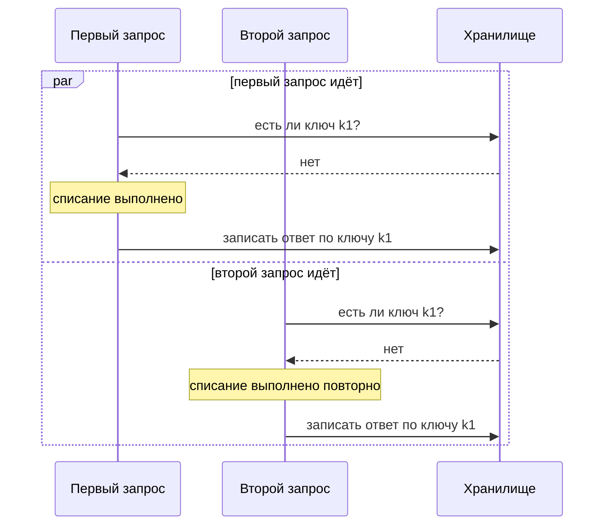

# Идемпотентность операций

В одном платёжном обработчике от двойных списаний защищаются ключом
идемпотентности. Это строка-ярлык, которую клиент придумывает для запроса:
пришёл повтор с тем же ярлыком — сервер отдаёт запомненный ответ, и работа
заново не выполняется. Стенд этой темы прогнал сто одновременных повторов
одного списания на трёх вариантах обработчика:

```text
без ключа                    прогонов с дублем: 100 из 100
ключ, проверка потом запись  прогонов с дублем:  96 из 100
ключ занимается первым       прогонов с дублем:   0 из 100
```

Вторая строка — сюрприз темы: ключ заведён, повтор находится, сохранённый
ответ отдаётся, а в 96 прогонах из ста списание всё равно выполнено дважды.
Причина в порядке действий: проверка «есть ли такой ключ» и запись результата
— две разные операции, и между ними второй запрос проходит целиком.

Это та же гонка, что разбирает тема `race-conditions`, только здесь окно
открыл сам защитный механизм. Читатель, который дальше не пойдёт, пусть уносит
одно правило: повтор закрывает не наличие ключа, а момент, когда он занят.
Занят — значит вставлен в хранилище отдельной строкой до начала работы, и
вторую такую же вставку база отклоняет сама.

## Что такое идемпотентность

Начнём с бытовой картинки. Кнопка вызова лифта устроена снисходительно:
нажмите её один раз или десять — лифт приедет один и тот же. Повтор нажатия не
меняет результата. Свойство «повтор не меняет следствие» называется
идемпотентностью. Здесь нажатие соответствует запросу, а приехавший лифт —
следствию на сервере. Аналогия ломается в одном месте: лифт помнит нажатие
сам, а в HTTP никакой памяти о повторах нет. Есть только обещание о том, что
запрос задуман так, будто повтор безвреден.

Спецификация HTTP объявляет идемпотентными методы `PUT` и `DELETE`, а также
безопасные методы вроде `GET`, которые состояние не меняют вовсе. Метод `POST`
идемпотентным не объявлен: им создают заказы и платежи, и каждый вызов — новое
следствие. Из свойства методов спецификация выводит правило повтора. Если
ответ на идемпотентный запрос не дошёл, клиент вправе повторить запрос
автоматически, а посредник на линии обязан не повторять неидемпотентный.

Тонкость в том, что это обещание о задуманном следствии, а не свойство
конкретного обработчика. Обработчик `PUT`, который на каждый вызов начисляет
бонус, обещание нарушает, и спецификация его не остановит: она прямо разрешает
серверу побочные следствия вроде записи в журнал. Поэтому «метод идемпотентен»
и «обработчик переживает повтор» — два разных утверждения, и второе каждый раз
заслуживает отдельной проверки.

**Откуда это взялось.** Правило повтора появилось в HTTP как ответ на разрыв
соединения. Клиент отправил `PUT`, связь оборвалась до прихода ответа — и
неизвестно, дошёл запрос или нет. Для идемпотентного метода спецификация
разрешает открыть новое соединение и повторить запрос, потому что задуманное
следствие от этого не изменится. Для остальных методов автоматический повтор
посреднику запрещён, а клиенту не советован. Но клиенты всё равно повторяют.
Часть из них угадывает, когда повтор возможен, — например, по тому, что
соединение закрылось раньше первого байта ответа.

## Как это работает

Повторы бывают двух видов, и закрываются они по-разному. Последовательный
повтор приходит после того, как первая обработка закончилась. Одновременный
приходит, пока первая ещё идёт.

### Кто повторяет запрос без ведома пользователя

Повтор приходит из мест, до которых приложение не дотягивается. Пользователь
нажимает кнопку оплаты второй раз, потому что первая не отреагировала.
Клиентская библиотека, код, который за разработчика ходит в сеть, теряет ответ
в мобильной сети и по таймауту повторяет запрос сама. Очередь сообщений,
посредник для фоновых задач, доставляет задание дважды, потому что
подтверждение о доставке потерялось. Ни в одном из этих случаев атаки нет.
А списание выполняется дважды.

```text
$ python e06-idempotency.py
=== А. последовательный повтор (клиент не дождался ответа) ===
  без ключа                      списаний после трёх попыток: 3
  ключ, проверка потом запись    списаний после трёх попыток: 1
  ключ занимается первым         списаний после трёх попыток: 1
```

Первая строка — дефект в чистом виде: три попытки дают три списания, и ни одна
из них не отличается от законной. Вторая и третья строки показывают, что
последовательный повтор закрывается ключом без затей. К моменту повтора
результат первой обработки уже записан, ключ находится, и вместо новой работы
отдаётся сохранённый ответ.

### Ключ идемпотентности

Механизма ключа в спецификации HTTP нет — его придумала практика, и устроен
он так. Клиент генерирует для запроса уникальную строку, ключ, и кладёт её в
заголовок. Сервер по ключу запоминает результат первой обработки, а на всех
последующих запросах с тем же ключом отдаёт сохранённое, ничего не выполняя
заново.

Бытовой пример — номерок в гардеробе. Предъявите его второй раз, и вам не
выдадут вторую куртку, а вернут вашу же, потому что номерок уже привязан к
ней. Соответствие такое: номерок — это ключ, куртка — сохранённый ответ,
гардеробщик — сервер. Аналогия ломается на том, кто выдаёт номерок. В
гардеробе это делает гардеробщик, а ключ идемпотентности придумывает сам
клиент. Поэтому серверу приходится отдельно разбираться с ключом, который
вернулся с чужим содержимым, — об этом ниже, в разделе про три кода отказа.

Ближе всего к нормативному описанию подошёл черновик IETF о заголовке
`Idempotency-Key`. Черновик, Internet-Draft, — это рабочий документ со сроком
жизни, а не стандарт: он может стать RFC, а может истечь и остаться заброшенным.
Этот истёк, поэтому ссылаться на него как на норму нельзя. Действующее описание
практики даёт документация Stripe, платёжной платформы, чей API принимает такой
ключ много лет. Обе записи в главном сходятся.

Ключ генерирует клиент, и это должно быть значение с достаточной энтропией, то
есть с запасом случайности, который нельзя угадать перебором. Рекомендуется
`UUID` версии 4, стандартный случайный идентификатор из 122 бит случайности,
или подобная строка длиной до 255 знаков; персональные данные ключом быть не
должны. Сервер сохраняет код ответа и тело первой обработки, включая ответ с
ошибкой пятисотого рода, и повторяет их на всех последующих запросах с тем же
ключом. Ключи чистятся не раньше чем через сутки, после чего тот же ключ
считается новым запросом.

### Ключ, который сам стал гонкой

Последовательный повтор — не единственный. Клиентская библиотека, повторяющая
запрос по таймауту, нередко шлёт повтор раньше, чем сервер закончил первую
обработку. Здесь и ломается обработчик, который проверяет ключ отдельным
запросом к хранилищу, а записывает результат после работы.

```text
=== Б. одновременный повтор (10 потоков, 100 прогонов) ===
  без ключа                      прогонов с дублем: 100 из 100, максимум 10
  ключ, проверка потом запись    прогонов с дублем:  96 из 100, максимум 10
  ключ занимается первым         прогонов с дублем:   0 из 100, максимум 1
```

Вторая строка — главное число темы: ключ есть, а дубль остался в 96 прогонах
из ста. Причина ровно та же, что в теме `race-conditions`: проверка «есть ли
такой ключ» и запись результата разнесены по разным операциям, и между ними
лежит окно. Оба одновременных запроса с одним ключом проходят через это окно
так:



**Описание схемы.** Два запроса с одним ключом `k1` идут параллельно, ветки
читаются сверху вниз и перемежаются. Каждый запрос спрашивает хранилище, есть
ли ключ, и каждый получает «нет», потому что оба спросили раньше, чем первый
записал результат. Оба выполняют списание, и оба записывают ответ. Окно гонки —
между вопросом о ключе и записью по нему.

Третья строка прогона отличается одним: ключ занимается первой же операцией.
Его охраняет уникальное ограничение — правило в схеме базы, которое отвергает
вторую строку с тем же значением. Вставку выполняет сама база, и «проверить»
с «записать» в ней слиты в один шаг, поэтому окна нет. Дальше обработка идёт,
зная, что второго исполнителя нет, и дублей не остаётся вовсе.

Разница между второй и третьей строкой и есть правило темы: повтор закрывает
не наличие ключа, а момент, когда он занят. В вашем обработчике ключ
занимается до работы или после неё — и чем вы это докажете без стенда?

### Три кода отказа

Когда сервер отказывает запросу с ключом, отказы различаются по смыслу, и
черновик перечисляет их с кодами.

| Ситуация | Код | Что делать клиенту |
|---|---|---|
| Ключ обязателен, а его нет | 400 | прислать ключ и повторить |
| Тот же ключ пришёл с другим телом | 422 | не повторять: обещание нарушено |
| Повтор пришёл, пока первая обработка идёт | 409 | подождать и повторить |

Если ключ обязателен, а его нет, отвечают кодом 400, «запрос неверен»: клиент
не выполнил договорённость о ключе. Если тот же ключ пришёл с другим
содержимым запроса, отвечают кодом 422, «содержимое неприемлемо»: клиент
нарушил обещание уникальности, и повторять такое бессмысленно. Если повтор
пришёл, пока первая обработка ещё идёт, отвечают кодом 409, «конфликт»:
клиенту тут исправлять нечего, ему надо подождать.

Отдельная тонкость в том, когда результат не сохраняется. Практика Stripe:
результат не запоминается, если запрос не прошёл проверку параметров или
столкнулся с одновременно выполняющимся запросом; такие запросы клиент вправе
повторить. Ключи принимаются только на `POST` — `GET` и `DELETE`
идемпотентны по определению метода, и ключ им не нужен.

**Зачем это в работе AppSec-инженера.** К любому изменяющему обработчику здесь
один вопрос: что произойдёт, если ровно этот запрос придёт второй раз, и чем
это закрыто. Повтор приходит сам. Его шлют пользователь с заевшей кнопкой,
клиентская библиотека и очередь сообщений, а атакующему остаётся только
направить его туда, где дубль дороже всего. Вред при этом тот же, что у
двойного списания из темы `race-conditions`, когда повторы приходят
одновременно.

## Как это выглядит в коде

Ревьюер ищет изменяющий обработчик без опоры на что-либо уникальное, а если
опора есть — смотрит, когда она занимается. Разбор идёт тремя планами: найти,
где ключ проверяется; найти, где выполняется списание; сравнить оба места с
тем, где ключ записывается. Проследите порядок этих трёх действий до чтения
выносок.

```python
# УЯЗВИМО — демонстрация, не для продакшена
def charge(conn, key, body):
    row = conn.execute("SELECT response FROM idem WHERE key=?",
                       (key,)).fetchone()          # (1)
    if row:
        return json.loads(row[0])
    cur = conn.execute("INSERT INTO charge(account, amount) VALUES (?,?)",
                       (body["account"], body["amount"]))   # (2)
    conn.execute("INSERT OR REPLACE INTO idem VALUES (?,?)",
                 (key, json.dumps({"id": cur.lastrowid})))  # (3)
    return {"id": cur.lastrowid}
```

1. Проверка ключа — отдельная операция чтения. С этой строки её ответ
   устарел: пока обработчик работает дальше, второй запрос прочитает то же
   «ключа нет».
2. Списание выполняется до того, как ключ занят. Повтор, пришедший в это
   окно, пройдёт ту же проверку с тем же результатом и спишет второй раз.
3. Ключ записывается последним, да ещё с `OR REPLACE`: даже если два запроса
   дошли до записи, второй молча перезапишет первый, и дубль заметён.

Соседний признак — отсутствие уникального ограничения на столбец ключа:
хранилище, в котором ключ лежит без ограничения, ничем не мешает записать его
дважды. Поэтому ревьюер смотрит не только на код обработчика, но и на схему
таблицы. Если в объявлении столбца нет `UNIQUE` или отдельного уникального
индекса, опора на ключ ненастоящая.

## Как защититься

Защита переносит проверку в само хранилище: ключ занимается первой операцией,
а его уникальность отвергает второго исполнителя силами базы. Четыре меры
ниже собирают это в целое, и каждая закрывает своё окно.

- **Ключ занимается первой операцией.** Вставка строки с ключом идёт до
  всякой работы, а уникальность объявлена в схеме. Второй запрос получает
  отказ от базы и дальше не идёт. Окна между «проверить» и «записать» больше
  нет, потому что обе части слились в одну вставку.
- **Ответ сохраняется вместе с кодом.** На повтор отдаётся то же тело и тот
  же код, что и в первый раз, — включая ответ с ошибкой. Иначе клиент,
  получивший на повтор другой ответ, решит, что первый не прошёл, и повторит
  снова.
- **Отпечаток тела сверяется с ключом.** Отпечаток — контрольная сумма тела
  запроса или его отобранных полей; по нему сервер отличает законный повтор
  от переиспользования ключа с другим содержимым и отвечает кодом 422.
- **Операция целиком или никак.** ASVS требует, чтобы бизнес-операция либо
  выполнялась полностью, либо откатывалась к прежнему состоянию
  (v5.0-2.3.3). Ключ без этого требования закрывает повтор, но оставляет
  наполовину выполненную первую попытку.

Исправленный обработчик читается теми же тремя планами, что и уязвимый, и
видно, как каждый план переехал. Ключ теперь занимается первым, отказ
разбирается по смыслу, результат дописывается по уже занятому ключу.

```python
# Исправлено: ключ занимается первым, уникальность — в схеме.
def charge(conn, key, body):
    try:
        conn.execute("INSERT INTO idem VALUES (?,?,?,?)",
                     (key, fingerprint(body), "running", None))   # (1)
    except sqlite3.IntegrityError:
        return replay(conn, key, body)                            # (2)
    cur = conn.execute("INSERT INTO charge(account, amount) VALUES (?,?)",
                       (body["account"], body["amount"]))
    conn.execute("UPDATE idem SET status='done', response=? WHERE key=?",
                 (json.dumps({"id": cur.lastrowid}), key))         # (3)
    return {"id": cur.lastrowid}
```

1. Первая операция — занять ключ: вставка с отпечатком тела и состоянием
   `running`. Уникальный ключ объявлен в схеме, поэтому вторая такая вставка
   отвергается базой сама, без отдельной проверки и без окна.
2. Отказ по уникальности разбирается функцией `replay`: другой отпечаток тела
   даёт 422, состояние `running` даёт 409, готовый результат отдаётся
   повтору как есть.
3. Результат записывается по уже занятому ключу, поэтому второй исполнитель
   до работы не доходит никогда.

**Где это не работает.** Ключ закрывает повтор одной операции и не закрывает
повтор процесса: два разных ключа на два одинаковых по смыслу платежа —
законные разные запросы. Отличать их надо правилом предметной области из темы
`business-logic-flaws`, а не ключом. Не помогает ключ и там, где следствие
живёт вне базы: письмо, отправленное первой попыткой, вторым ответом не
отменяется.

**Что добавляется поверх.** Естественный уникальный признак самой операции —
номер счёта, номер заказа, пара из отправителя и назначения платежа — работает
как ключ там, где клиент ключа не присылает.

## Частая ошибка

Скажите сами: раз `PUT` идемпотентен по спецификации, безопасен ли повтор
такого запроса?

Документ читают как обещание: `PUT` идемпотентен по спецификации, значит,
повтор безопасен, а `POST` неидемпотентен, и сделать с этим нечего.

**Спецификация описывает задуманное следствие запроса, а не поведение
обработчика.** Она прямо оговаривает, что свойство относится к тому, что
запросил пользователь. Сервер вправе вести журнал и историю ревизий, то есть
иметь неидемпотентные побочные следствия на каждый запрос. Обработчик `PUT`,
начисляющий бонус при каждом вызове, спецификации не противоречит, а обещание
всё равно нарушает.

Вторая половина мнения неверна ровно наоборот. Из того, что `POST`
неидемпотентен, следует не «сделать нечего», а «повтор надо закрыть самому» —
и сложившаяся практика описывает, чем именно: ключом, занятым первой
операцией.

Третий вид той же ловушки — считать, что заведённого ключа достаточно. Строка
прогона с 96 дублями из ста показывает обратное: ключ, проверяемый отдельной
операцией, повторяет ровно ту гонку, от которой должен был спасти.

## Чеклист для ревью

1. Проверьте, что для каждого изменяющего обработчика записано, что произойдёт
   при повторе того же запроса.
2. Проверьте, что ключ идемпотентности занимается первой операцией обработки,
   а не проверяется отдельным запросом.
3. Проверьте, что уникальность ключа объявлена ограничением в схеме хранилища.
4. Проверьте, что на повтор отдаётся сохранённый код ответа и тело первой
   обработки, включая ответ с ошибкой.
5. Проверьте, что ключ, пришедший с другим содержимым запроса, отвергается, а
   повтор во время выполнения получает отдельный код.
6. Проверьте, что срок хранения ключей объявлен и не короче срока, в течение
   которого клиент повторяет запрос.
7. Проверьте, что бизнес-операция выполняется целиком либо откатывается
   (ASVS v5.0-2.3.3).

## Попробуй сам

Возьмите изменяющий обработчик в своём или учебном приложении и опишите его
поведение при повторе. Отправьте один и тот же запрос дважды подряд, затем два
таких запроса одновременно, затем тот же ключ с изменённым телом.

Одна подсказка: опыт «два одновременно» решает не проверка ключа чтением, а
уникальное ограничение в хранилище — ищите, где оно объявлено.

**Критерий:** для каждого из трёх опытов записано наблюдаемое поведение —
сколько записей создано, какой код и тело получил второй запрос. Названо, чем
закрыт повтор: ключом, естественным уникальным признаком или ничем.

## Проверь себя

1. Корзина принимает установку количества так:

   ```python
   @app.put("/cart/items/<int:item_id>")
   def set_item(item_id):
       cart.set_qty(item_id, request.json["qty"])
       bonus.add(request.json["qty"])
       return {"ok": True}
   ```

   Метод `PUT` идемпотентен по спецификации. Безопасен ли повтор этого
   запроса и почему?

2. Обработчик списания из раздела «Как это выглядит в коде» проверяет ключ
   отдельным запросом:

   ```python
   def charge(conn, key, body):
       row = conn.execute("SELECT response FROM idem WHERE key=?",
                          (key,)).fetchone()
       if row:
           return json.loads(row[0])
       cur = conn.execute("INSERT INTO charge(account, amount) VALUES (?,?)",
                          (body["account"], body["amount"]))
       conn.execute("INSERT OR REPLACE INTO idem VALUES (?,?)",
                    (key, json.dumps({"id": cur.lastrowid})))
       return {"id": cur.lastrowid}
   ```

   Какую починку вы выберете?

   А. Проверять ключ дважды — до работы и после неё, чтобы точно не
      пропустить повтор.

   Б. Занимать ключ первой операцией — вставкой с уникальным ограничением в
      схеме, — а отказ разбирать по отпечатку тела и состоянию записи.

   В. Перевести операцию с `POST` на `PUT`, который идемпотентен по
      спецификации.

3. Почему ключ идемпотентности, проверяемый отдельным запросом, оставляет
   дубли в 96 прогонах из ста?
4. Предскажите, что напечатает этот фрагмент, — почему такая вставка это
   единственная надёжная проверка ключа?

   ```python
   import sqlite3
   db = sqlite3.connect(":memory:")
   db.execute("CREATE TABLE idem (key TEXT UNIQUE, response TEXT)")
   db.execute("INSERT INTO idem VALUES ('k1', 'first')")
   try:
       db.execute("INSERT INTO idem VALUES ('k1', 'second')")
       print("вторая запись прошла")
   except sqlite3.IntegrityError:
       print("IntegrityError — второй запрос отвергнут базой")
   print(db.execute("SELECT response FROM idem WHERE key='k1'").fetchone()[0])
   ```

5. Возврат к теме `race-conditions`: какой приём закрывает и двойное списание,
   и повтор с одним ключом?
6. Возврат к теме `business-logic-flaws`: почему «что будет при повторе» —
   вопрос к требованиям, а не к коду?

<details markdown="1">
<summary>Ответ 1</summary>

1. Нет. Спецификация говорит о задуманном следствии — установить количество
   позиции, — и оно от повтора не меняется. Начисление бонуса — побочное
   следствие, и оно неидемпотентно: два одинаковых запроса дадут двойной бонус.
   Идемпотентность метода — обещание о замысле, а не свойство конкретного
   обработчика; спецификация прямо разрешает серверу побочные следствия вроде
   журнала.

</details>

<details markdown="1">
<summary>Ответ 2: разбор вариантов</summary>

2. Верный ответ — Б.

   А. Любая проверка чтением оставляет окно: между «есть ли такой ключ» и
      записью результата второй запрос проходит целиком, и стенд показывает 96
      дублей из ста. Вторая проверка чтением добавляет второе такое же окно.

   Б. Уникальность отвергает второй ключ силами базы, без окна между проверкой
      и записью. Отказ разбирается по смыслу: другой отпечаток тела даёт 422,
      состояние `running` даёт 409, готовый результат отдаётся повтору.
      Стенд: ключ, занятый первой операцией, даёт ровно одно списание во всех
      ста прогонах.

   В. Смена метода не меняет обработчик: `PUT`, начисляющий на каждый вызов,
      обещание нарушает так же. Из неидемпотентности `POST` следует не
      «сделать нечего», а «повтор закрыть самому».

</details>

<details markdown="1">
<summary>Ответ 3</summary>

3. Проверка ключа и запись результата разнесены по разным операциям, и между
   ними лежит окно: второй запрос успевает проверить ключ до того, как первый
   его записал. Это та же гонка вида «проверка отдельно от применения», что в
   теме `race-conditions`, — ключ сам повторил её структуру.

</details>

<details markdown="1">
<summary>Ответ 4</summary>

4. `IntegrityError — второй запрос отвергнут базой`, затем `first`: вторая
   вставка с тем же ключом отвергнута ограничением, а сохранённый ответ первой
   на месте. Ответ подтверждается запуском этого фрагмента интерпретатором.
   Уникальность в схеме срабатывает атомарно — в ней нет окна между
   «проверить» и «записать», поэтому опора на хранилище закрывает то, что
   проверка чтением оставляет.

</details>

<details markdown="1">
<summary>Ответ 5</summary>

5. Перенос правила в схему хранилища. Уникальное ограничение отвергает второе
   начисление и второй ключ силами базы, без окна между проверкой и записью.

</details>

<details markdown="1">
<summary>Ответ 6</summary>

6. Потому что ответ зависит от правила предметной области: повторный платёж
   недопустим, повторное добавление в избранное безвредно, повторная отправка
   письма раздражает. Код показывает, что происходит, а требования говорят,
   что должно происходить.

</details>

## Источники

1. IETF, RFC 9110 «HTTP Semantics», STD 97; реестр `rfc9110-http-semantics`.
   Разделы: § 9.2.2 «Idempotent Methods» — определение, перечень
   идемпотентных методов, правило автоматического повтора для клиента и
   запрет повтора для посредника.
   <https://www.rfc-editor.org/rfc/rfc9110.html>
2. Stripe, «Idempotent requests»; реестр `stripe-api-idempotent-requests`.
   Разделы: генерация ключа клиентом, сохранение кода и тела первого ответа,
   срок хранения не меньше суток, сверка параметров, случаи, когда результат
   не сохраняется, применимость к `POST`.
   <https://docs.stripe.com/api/idempotent_requests>
3. IETF, «The Idempotency-Key HTTP Header Field»,
   draft-ietf-httpapi-idempotency-key-header-07; реестр
   `ietf-idempotency-key`. Разделы: синтаксис заголовка, уникальность и срок
   действия ключа, отпечаток запроса, обязанности сторон, обработка ошибок с
   кодами 400, 422 и 409. Черновик истёк и нормой не служит.
   <https://datatracker.ietf.org/doc/draft-ietf-httpapi-idempotency-key-header/>

Каркас этапа: `owasp-asvs-5-document` (ASVS v5.0.0), `owasp-wstg-42`,
`owasp-top10-2025`. Наследуются всеми темами и отдельной строкой не
повторяются.

**Скоропортящийся слой.** Описание практики взято у одной платформы и
меняется вместе с её документацией: срок хранения ключей, предельная длина и
перечень методов — её решения, а не общее правило. Черновик IETF истёк
18 апреля 2026 года и может как получить продолжение, так и остаться
заброшенным.

**Маркеры уверенности.** Поведение трёх обработчиков при последовательном и
одновременном повторе, отказ на том же ключе с другим телом и поведение
`DELETE` — **проверено лично** 2026-08-24 на Python 3.14.7 и SQLite 3.53.4
(стенд `e06-idempotency.py`): без ключа три попытки дают три списания и десять
одновременных — десять; ключ с отдельной проверкой оставляет дубль в 96
прогонах из ста; ключ, занятый первой операцией, даёт ровно одно списание во
всех ста прогонах; тот же ключ с другим телом получает отказ 422; второй
`DELETE` возвращает 404 при том же итоговом состоянии. Листинг из вопроса 4
прогнан заново 2026-10-03 на Python 3.14.7; вывод совпал дословно. Определение
идемпотентности, перечень методов и правила повтора — **по документации**
(RFC 9110 § 9.2.2, открыт лично 2026-08-24). Порядок работы с ключом, срок
хранения, сверка параметров и случаи, когда результат не сохраняется, — **по
документации** (страница Stripe, открыта лично 2026-08-24). Синтаксис
заголовка, отпечаток запроса и три кода отказа — **по документации**
(черновик IETF, редакция 07 от 15 октября 2025, открыт лично 2026-08-24);
статус «Expired Internet-Draft» на странице каталога проверен тогда же.
Поведение живых клиентских библиотек и посредников при потере ответа **не
воспроизводилось**: сети в стенде нет.
