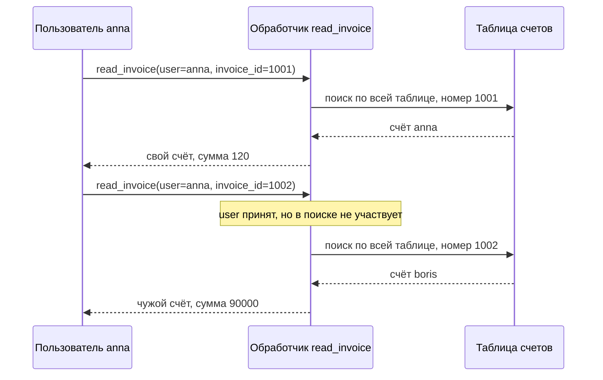
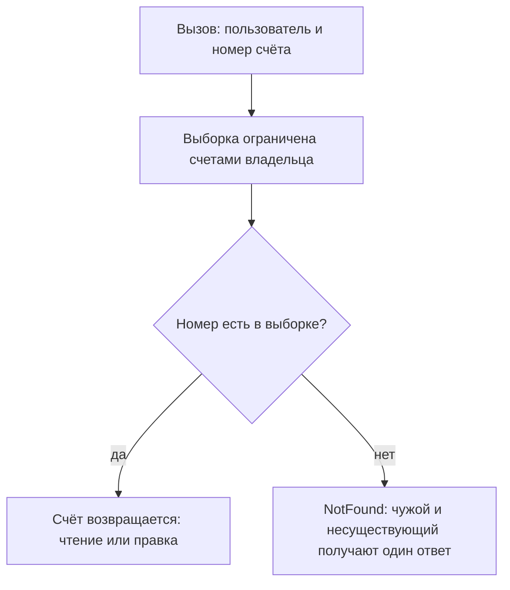

# Горизонтальная эскалация и IDOR

Пользователь `anna` открывает свой счёт в кабинете биллинга — страницу по
адресу `/invoices/1001`. Из любопытства она меняет номер на `1002` и видит
чужой счёт: девяносто тысяч, чужая почта, чужая дата. Инструментов не
понадобилось, хватило одной цифры в адресной строке. Приложение нашло
запись по номеру и отдало её, не спросив, чья она.

Дефект с таким ходом называют IDOR — небезопасной прямой ссылкой на
объект. Название читается по частям. Номер — это ссылка на запись. Прямая —
потому что приложение использует её как есть. Небезопасная — потому что
проверки «ваша ли это запись» нет. А доступ к данным другого пользователя
с тем же уровнем прав называют горизонтальной эскалацией.

Вот те же два вызова глазами приложения. Обработчик `read_invoice` получает
имя вошедшего и номер счёта из адреса:

**Свой счёт**

```text
read_invoice(user="anna", invoice_id=1001)
→ {"owner":"anna","email":"anna@acme.test","sum":120,"at":"2026-08-01"}
```

**Соседний номер**

```text
read_invoice(user="anna", invoice_id=1002)
→ {"owner":"boris","email":"boris@globex.test","sum":90000,
  "at":"2026-08-02"}
```

Заметьте, чего в этой истории нет. Нет подбора: номер `1002` не угадан, а
получен прибавлением единицы. Нет повышения прав: `anna` осталась обычным
пользователем. Нет обхода входа: она вошла под собой. Дефект ровно один —
`read_invoice` принял параметр `user` и не использовал его при поиске
записи.

И дело не в самом номере, а в выборке — множестве записей, среди которых
код ищет объект. Пока поиск идёт по всей таблице, права приходится
проверять отдельным условием, и каждая новая функция над тем же объектом —
новый шанс это условие не написать. Дальше разберём, из чего дефект
складывается, как его находят руками и как его закрыть так, чтобы проверку
было негде забыть.

**Зачем это в работе AppSec-инженера.** Обработчик, который достаёт запись
по идентификатору из адреса, вы писали десятки раз: `Invoice.get(id)`,
`find(params[:id])`. Строки о том, чья это запись, в нём нет, и ревью её не
требовало — функция работает. Этот дефект находят руками и почти не находят
инструментами: сканер не знает, кто владелец записи. Ревьюер здесь делает
работу, которую сканер сделать не может, и должен уметь объяснить почему.

То же самое в терминах программных интерфейсов называется
BOLA (Broken Object Level Authorization, сломанная авторизация на уровне
объекта) и разбирается в теме `bola`. Здесь — механика целиком, там — что
меняется, когда клиентом становится не браузер.

## Подумай, прежде чем читать

1. Приложение отдаёт счёт по адресу `/invoices/1001`. Что должно произойти
   при запросе `/invoices/1002`, если счёт с таким номером принадлежит
   другому человеку?
2. Номера счетов заменили на длинные случайные значения. Что изменилось для
   атакующего и что не изменилось?
3. В приложении на каждой функции стоит проверка роли. Достаточно ли этого,
   чтобы IDOR не было?

Ответы приходят по ходу чтения, а в конце темы те же вопросы встретятся
снова — уже как проверка.

## Как это работает

**Откуда это взялось.** Приложение хранит объекты в таблице и адресует их
первичным ключом — номером записи. Ключ понадобился в интерфейсе: страница
счёта должна знать, какой счёт показывать, и номер поехал в адрес. Пока
страницу собирал сервер, он же и решал, какие ссылки на ней ставить, — и
решение о доступе выглядело принятым. На деле оно принято не было: ссылку
не поставили, а функцию не закрыли. Название дефекта появилось в списке
OWASP Top Ten 2007 — рейтинге важнейших рисков веб-приложений. С тех пор
оно означает ровно этот случай: прямую ссылку на объект, которой можно
управлять.

Бытовой пример такой ссылки — номерок в гардеробе. Номерок указывает на
ваше пальто, и гардеробщик находит по нему нужное. Если он выдаёт пальто по
любому предъявленному номерку, не сверяя, ваш ли он, чужой номерок
сработает так же, как свой. Соответствие точное: номерок — идентификатор в
адресе, пальто — запись в базе, сверка — проверка прав на объект. Ломается
аналогия на подделке: бумажный номерок сложно нарисовать заново, а цифру в
адресе меняют за секунду.

Памятка OWASP по IDOR (Cheat Sheet) раскладывает дефект на три
составляющие, и по ним читают чужой код: каждая видна отдельно. **Объект** —
то, что защищают: учётная запись, документ, обращение, транзакция. **Ссылка
на него** — значение, которым объект называют в запросе: идентификатор,
номер счёта, токен или слаг, то есть слово в адресе вроде
`/articles/privet-mir`. **Отсутствующая проверка прав на объект** — то, из-за
чего подстановка чужой ссылки срабатывает.

### Разбор по общей рамке

Уязвимости в гайдбуке раскладываются по одной рамке из пяти подцелей —
она введена в теме `privilege-escalation-vertical`. Для IDOR она заполняется
так. **Источник** — значение ссылки в запросе: его задаёт отправитель.
**Путь** — код, который берёт это значение и передаёт в выборку. **Сток** —
выборка по всей таблице, возвращающая объект по ключу. **Отсутствующий
контроль** — сверка владельца объекта с личностью вошедшего. **Условие
эксплуатации** — знание чужой ссылки; учётная запись нужна обычная, своя.

Оба вызова из начала темы проходят один и тот же маршрут:



**Описание схемы.** Схема читается сверху вниз и показывает два вызова
подряд. В первом `anna` спрашивает свой счёт, и обработчик находит его
поиском по всей таблице. Во втором она подставляет соседний номер, и
обработчик повторяет те же шаги без изменений. Параметр `user` принят, но
в поиске не участвует, поэтому таблица возвращает чужую запись. Проверки
«чей это счёт» на схеме нет — именно её и должен был сделать обработчик.

Отсюда видно и главное отличие от вертикальной эскалации из темы
`privilege-escalation-vertical`. Там атакующий попадал в функцию, которая
ему не положена. Здесь функция положена: свой счёт `anna` читать вправе. Не
положен объект.

### Четыре места, где живёт ссылка

Руководство OWASP по тестированию (WSTG) в разделе ATHZ-04 перечисляет
четыре типовых случая, и различать их стоит, потому что чинятся они
по-разному.

**Ссылка на запись базы.** Запрос вида `/somepage?invoice=12345`: значение
идёт в запрос к базе как ключ. Подстановка чужого номера возвращает чужую
запись.

**Ссылка на операцию над учётной записью.** Запрос
`/changepassword?user=someuser`: значение говорит приложению, чей пароль
менять. Часто это первый шаг мастера, и второй шаг нового пароля уже не
спрашивает старый.

**Ссылка на файл.** Запрос `/showImage?img=img00011`: значение называет
файл. PortSwigger добавляет сюда случай статики: чужая расшифровка
разговора лежит в каталоге `/static/` под предсказуемым именем.

**Ссылка на функциональность.** Запрос `/accessPage?menuitem=12`: значение
выбирает пункт меню, то есть доступную операцию. Здесь горизонтальная
ссылка открывает вертикальный доступ.

Разница между случаями — в том, кто отвечает за проверку. Запись базы и
файл проверяются там, где их достают. Операция над учётной записью
проверяется дважды: и на объект, и на само действие. Пункт меню вообще не
должен приезжать от клиента: набор доступных операций вычисляет сервер.

Та же страница предупреждает: ссылка бывает разнесена по нескольким
параметрам, и проверять надо их сочетание, а не каждый по отдельности.

### Непредсказуемая ссылка

Идентификаторы, которые нельзя угадать, — отдельный разговор, потому что
проверки они не отменяют. Вместо соседних номеров приложение выдаёт длинные
случайные значения вроде UUID — строки вида
`b9f1c0d6-7a41-4a2e-9d3b-6c5e0f2a1d84`. Перебрать такое пространство не
хватит никакого времени. Но памятка по IDOR говорит прямо: сложные
идентификаторы делают подбор практически невозможным, а проверка прав нужна
и при них. Если атакующий получил адрес чужого объекта, приложение обязано
отказать.

Получают такие адреса из соседних функций. Лента событий, список
участников, экспорт в таблицу, сообщение об ошибке, письмо с уведомлением —
всюду идентификаторы ездят как служебные поля. У случая есть номер в CWE,
общем реестре видов дефектов: CWE-639, обход авторизации через ключ,
которым управляет пользователь. Маскировку и рандомизацию ключей памятка
OWASP по авторизации относит к мерам недостаточным.

### Где стоит проверка

Место проверки решает, переживёт ли она следующий коммит. Вариантов три, и
различаются они тем, что нужно помнить разработчику.

**Проверка после выборки.** Объект достали, владельца сверили, при
несовпадении отказали. Работает, читается — и забывается при добавлении
следующей операции над тем же объектом. Каждая новая функция — новый шанс
не написать три строки.

**Проверка внутри выборки.** Объект ищут не в таблице, а в множестве,
которое пользователю доступно. Забыть проверку негде: её нет как отдельного
действия. Этот вариант памятка и называет основным приёмом.

**Проверка в общем слое.** Единая функция принимает пользователя, класс
объекта и действие. Окупается там, где право не сводится к владению, — и
требует, чтобы через неё ходили все, включая фоновые задачи и выгрузки.

Разница видна на изменяющих операциях. Читающую функцию проверяют почти
всегда: она заметна в интерфейсе. Правку, удаление, экспорт и смену
состояния проверяют реже — и в лабе этой темы опыт 2 сделан ровно об этом.

### Куда это ведёт дальше

Горизонтальная эскалация редко остаётся горизонтальной. PortSwigger
описывает типовой ход: чужая учётная запись даёт сброс или перехват пароля,
а если целью выбран администратор — и административный доступ. Второй ход —
многопользовательские системы, где одно приложение обслуживает много
организаций сразу; каждая такая организация называется арендатором.
Стандарт ASVS, по которому сверяют требования к приложению, выносит их в
требование v5.0-8.4.1: операции одного арендатора не должны затрагивать
другого. Третий ход — сама природа объекта: серьёзность находки оценивают
по тому, что в ней лежит. Чужой счёт на четыре с половиной миллиона из
опыта 3 и чужой список учётных записей — разные разговоры в отчёте.

## Как это атакуют

Стенд — лаба этой темы, каталог `pilot/lab/idor`. Кабинет счетов: `anna` из
компании `acme`, `boris` из `globex`, три счёта. Функции кабинета
вызываются напрямую, HTTP не поднимается.

Шаг первый — понять, чем адресуются объекты. Свой счёт `anna` открывает по
номеру `1001`. Номер короткий и последовательный, значит, соседние значения
существуют.

Шаг второй — подставить соседнее. Шаг третий — повторить то же на
изменяющей операции: чтение чужого счёта и подмена адреса его доставки —
разные строки в отчёте и разная серьёзность.

```bash
python3 hack.py
```

```text
Цель: code.py
  опыт 1 — чтение чужого счёта 1002: ПОЛУЧЕН, сумма 90000
  опыт 2 — подмена адреса в чужом счёте: АДРЕС ЗАМЕНЁН на anna@acme.test
  опыт 3 — счёт с UUID из ленты: ПОЛУЧЕН, сумма 4500000
  опыт 4 — контроль, свой счёт: доступен

ЭКСПЛОЙТ СРАБОТАЛ: чужой объект достался по идентификатору (3 из 3 опытов)
```

Опыт 3 — тот самый случай непредсказуемой ссылки. Третий счёт адресован
UUID, подобрать его нельзя. Но лента компании отдаёт события всех
участников рынка, и в каждом событии остался идентификатор счёта: поле
завели при отладке и забыли убрать. Атакующему остаётся прочитать ленту.

Опыт 4 — контроль. Свой счёт обязан остаться доступным, иначе починка
свелась к запрету. На живом приложении эту роль играет обычный сценарий
пользователя, пройденный после правки от начала до конца: вход, список,
открытие своей записи, правка, выход. Без него отчёт о закрытом дефекте
приходится переписывать после первой жалобы из поддержки.

Шаг четвёртый в живом приложении — оценить охват. Один найденный маршрут
почти никогда не единственный: если объект достают глобальной выборкой в
одной функции, так же его достают в соседних. Отчёт, называющий один адрес,
чинится одной строкой и оставляет дефект в приложении. Отчёт, называющий
приём и все места, где он повторяется, чинится один раз.

Отдельно стоит заметить, чего в этой атаке нет. Нет подбора: во всех трёх
опытах значение известно заранее — из соседнего номера или из ленты. Нет
повышения прав: `anna` остаётся обычным пользователем. Нет обхода
аутентификации: она вошла под собой.

## Как это выглядит в коде

Ревьюер ищет **выборку**: по всей таблице или по множеству, которое
пользователю доступно. Разбор идёт двумя планами: найти, где поиск уходит
во всю таблицу, и назвать, что в этой строке должно было измениться. До
выносок отметьте сами каждую такую строку.

```python
# УЯЗВИМО — демонстрация, не для продакшена
def read_invoice(user, invoice_id):
    invoice = Invoice.get(invoice_id)        # (1)
    if invoice is None:
        raise NotFound
    return dict(invoice)                     # (2)

def set_invoice_email(user, invoice_id, email):
    invoice = Invoice.get(invoice_id)        # (3)
    invoice["email"] = email
    return dict(invoice)
```

1. Глобальная выборка: `Invoice.get` ищет по всей таблице. Параметр `user`
   принят функцией и не участвует в поиске — это и есть признак.
2. Объект возвращается целиком, вместе с суммой и адресом.
3. Тот же дефект на изменяющей операции. Читающую находят чаще, потому что
   её проще заметить в интерфейсе.

Разобранный фрагмент сводит тему к одному признаку: виновата не форма
идентификатора, а выборка — `user` принят функцией и в поиске не участвует.
Остановитесь здесь и ответьте себе: останется ли дефект, если номер счёта
клиент присылать перестанет, а обработчик станет брать его из подписанного
токена сессии?

Тот же код на втором стеке различается одной строкой. Памятка по IDOR
приводит пару на Ruby on Rails — сравните сами, чем две строки различаются
по множеству поиска.

```ruby
# УЯЗВИМО: ищет среди всех проектов
@project = Project.find(params[:id])
# безопасно: ищет среди проектов текущего пользователя
@project = @current_user.projects.find(params[:id])
```

**Что искать глазами.** Три признака, и все видны без запуска. Первый:
получатель вызова — класс-таблица (`Invoice`, `Project`, `Report`), а не
связь пользователя. Второй: идентификатор пришёл параметром и попал в поиск
без изменений. Третий: в функции есть `user` или `current_user`, и в
выборке его нет.

**Обёртки, которые не спасают.** Проверка роли: `anna` имеет право читать
счета — вопрос в том, чьи. Проверка «пользователь вошёл». Сравнение
идентификатора объекта с идентификатором пользователя из токена решает
только случай, когда объект — сам пользователь, как в адресе `/users/42`.
Номер счёта номеру владельца не равен, поэтому на счёте такая сверка
откажет и владельцу. Разбор API1:2023, первого пункта списка уязвимостей
программных интерфейсов от OWASP, прямо называет это решением малого
подмножества случаев.

**Ложное срабатывание.** Глобальная выборка в фоновой задаче, в отчёте
администратора, в служебном обработчике очереди. Признак — в функции нет
пользователя, потому что запроса нет вовсе. Второй законный случай —
публичный объект: открытая статья по идентификатору из адреса.

## Как защититься

Проверка прав и поиск объекта соединяются в одно действие. Памятка по IDOR
формулирует это как основной приём: искать объект в наборе, доступном
пользователю. Листинг читается в три шага. Первый — увидеть, где выборка
сужается владельцем. Второй — понять, почему чужому и несуществующему
отвечают одинаково. Третий — проследить, как одна функция доступа
обслуживает обе операции.

```python
# Исправленный вариант
def _own_invoice(user, invoice_id):
    invoice = Invoice.owned_by(user).get(invoice_id)   # (1)
    if invoice is None:
        raise NotFound                                 # (2)
    return invoice

def read_invoice(user, invoice_id):
    return dict(_own_invoice(user, invoice_id))

def set_invoice_email(user, invoice_id, email):
    invoice = _own_invoice(user, invoice_id)           # (3)
    invoice["email"] = email
    return dict(invoice)
```

1. Выборка ограничена владельцем. Чужой идентификатор не находится не
   потому, что его проверили, а потому, что его нет в множестве поиска.
2. Чужой и несуществующий объект отвечают одинаково. Разные ответы
   подтверждали бы существование чужого счёта — это отдельная утечка.
3. Одна функция доступа на чтение и на запись: забыть проверку в новой
   операции негде.

Тот же порядок схемой:



**Описание схемы.** Схема читается сверху вниз. Вызов несёт пользователя и
номер счёта, и первым делом множество поиска сужается до счетов этого
пользователя. Если номер в выборке есть, счёт возвращается — чужим он быть
не может, потому что чужих в выборке нет. Если номера нет, ответ один и тот
же для чужого и для несуществующего счёта.

Три приёма дополняют основной, и каждый решает свою задачу. Первый: не
выносить идентификатор наружу, когда объект выводится из личности
вошедшего, — свой профиль не нуждается в номере в адресе. Второй: в
многошаговых процессах держать идентификатор в сессии, а не в скрытом поле
формы. Третий: заменить перечислимые числовые ключи длинными случайными
значениями — но именно как меру в глубину, поверх проверки, а не вместо
неё. Памятка отдельно не советует шифровать идентификаторы: сделать это
правильно трудно.

Идентификаторы, которые уже разошлись, — отдельный вопрос, и решается он не
заменой ключей. Заменить ключи в работающем приложении дорого: они лежат в
закладках, в письмах, во внешних интеграциях. Порядок такой же, как со
всяким переходом. Сначала проверка прав: она закрывает дефект. Замена
ключей — вторым шагом и только там, где утечка самого ключа что-то значит.

**Границы применимости.** Выборка по владельцу описывает право через связь
«пользователь — объект». Она не описывает права, которые зависят от
состояния объекта, от роли в проекте или от отношений между людьми. Доступ
бухгалтера к счетам своего подразделения связью не выражается. Там нужна
модель, где право — это правило, а не поле, и разговор возвращается к теме
`access-control-models`.

**Чем за это платят.** Каждая выборка обрастает условием, а условие —
индексом в базе. Отчёты и выгрузки приходится писать дважды: для
пользователя и для администратора. И самое неприятное: связь владения надо
проводить через все слои, включая кеш, очередь и фоновые задачи, где
пользователя рядом нет.

## Частая ошибка

Своё решение примите первым: замена номеров на UUID закрывает дефект или
только поднимает цену перебора? Счёт из начала темы адресован номером
`1001`, и первое, что приходит на такую находку, — заменить номера на
UUID. Отсюда представление: с непредсказуемым ключом IDOR закрыт, потому
что чужой ключ подобрать нельзя.

**Идентификаторы не подбирают, их получают.** Памятка по IDOR ставит это
условием. Сложные идентификаторы делают подбор практически невозможным, и
проверка прав нужна и при них: адрес объекта доходит до атакующего другими
путями.

Почему так выходит. Идентификатор — служебное поле, и попадает оно всюду,
где приложение говорит о своих объектах. Это ленты событий, выгрузки,
письма, сообщения об ошибках, ответы соседних функций. Убрать его отовсюду
труднее, чем проверить права один раз.

Контрпример — опыт 3 лабы. Счёт адресован значением
`b9f1c0d6-7a41-4a2e-9d3b-6c5e0f2a1d84`: перебор бессмыслен. Лента компании
отдаёт события всех участников, и поле `invoice_ref` в каждом событии несёт
этот самый UUID. Атака занимает два вызова: прочитать ленту, запросить
счёт.

## Как убедиться, что защита работает

Ретест — повторная проверка после починки — делается двумя учётными
записями, и это не формальность. WSTG в разделе ATHZ-02 даёт процедуру.
Заводят двух пользователей с одинаковыми правами и держат две живые
сессии. В каждом запросе параметры подменяют вместе с идентификатором
сессии. Совпавшие ответы или чужие данные в ответе означают уязвимость.

В лабе роль двух учётных записей играют `anna` и `boris`, а ретестом служит
тот же `hack.py`, нацеленный на исправленный файл:

```bash
LAB_TARGET=solution.py python3 hack.py
```

```text
Цель: solution.py
  опыт 1 — чтение чужого счёта 1002: NotFound
  опыт 2 — подмена адреса в чужом счёте: NotFound
  опыт 3 — идентификатор в ленте не найден
  опыт 4 — контроль, свой счёт: доступен

эксплойт не сработал: все три опыта отвергнуты, свой счёт остался доступен
```

Три отказа и один пропуск. Опыт 3 отвергнут иначе, чем первые два: чужой
идентификатор в ленту больше не попадает, и подставлять нечего.

Регресс закрывается тестами функциональности. В лабе их семь, и все должны
остаться зелёными: починка не имеет права ломать штатную работу.

```bash
LAB_TARGET=solution.py python3 tests.py
```

```text
Цель: solution.py
  OK   свой счёт читается
  OK   в своём счёте видна сумма и адрес
  OK   список своих счетов содержит только свои
  OK   у второго пользователя свой список
  OK   свой адрес доставки меняется
  OK   несуществующий счёт не отдаётся
  OK   лента компании отдаёт события всех участников

упало: 0
```

Три негативных случая проверяются отдельно. Первый: ответ на чужой объект
не отличается от ответа на несуществующий. Второй: администратор, которому
чужие объекты положены по роли, доступ сохранил — иначе выборка по
владельцу закрыла лишнее. Третий: фоновые задачи и выгрузки, где
пользователя нет, продолжают работать.

Тест на регресс, который стоит написать один раз и держать вечно: два
пользователя, объект первого, вызов от имени второго — и утверждение, что
ответ отрицательный. Такой тест ловит возврат дефекта при каждой новой
операции над объектом.

**Чеклист для ревью.** Всё сказанное выше собирается в восемь проверок,
каждая смотрит на своё место дефекта:

1. Проверьте, что объект ищется в выборке, доступной текущему пользователю,
   а не по всей таблице (ASVS v5.0-8.2.2).
2. Проверьте, что проверка прав на объект стоит и на изменяющих операциях,
   а не только на читающих (ASVS v5.0-8.2.2).
3. Проверьте, что проверка не сводится к сравнению идентификатора из токена
   с идентификатором из запроса.
4. Проверьте, что ответ на чужой объект не отличается от ответа на
   несуществующий там, где само существование чувствительно.
5. Проверьте, что идентификаторы чужих объектов не попадают в ленты,
   выгрузки и сообщения об ошибках.
6. Проверьте, что операции одного арендатора не затрагивают объекты других
   (ASVS v5.0-8.4.1).
7. Проверьте, что правила доступа к данным записаны до кода и доступны для
   сверки (ASVS v5.0-8.1.1).
8. Проверьте, что ссылка на объект, разнесённая по нескольким параметрам,
   проверяется целиком, а не по одному из них (WSTG-v42-ATHZ-04).

## Как это находят инструменты

Здесь автоматика работает плохо, и это стоит сказать прямо. Статический
анализ — это разбор кода без запуска: инструмент читает текст программы и
ищет в нём фрагменты по правилам. Для IDOR таких правил толком не
существует, и причина понятна из механики. Инструмент не знает, кто
владелец объекта, какая выборка «правильная» и есть ли проверка прав в
трёх слоях выше по стеку. Он видит вызов, а решение о доступе — это
соглашение предметной области.

Ловится **синтаксическая тень** дефекта: глобальная выборка по
идентификатору, пришедшему параметром, в функции, которая приняла и
пользователя.

Правило целиком — `pilot/semgrep/object-lookup-unscoped.yaml`, написано для
Semgrep, инструмента статического анализа, который ищет фрагменты кода по
шаблону. Уровень `WARNING`, уверенность `LOW`. Прогон: две находки на
уязвимом файле лабы, ноль на решении, семь размеченных тест-кейсов сошлись.

**Что правило пропустит.** Выборку в другой форме — через построитель
запросов, через сырой SQL, через кеш. Любой стек, где пользователь приходит
не первым параметром. И главное — случай, когда выборка глобальна, а
проверка прав стоит строкой ниже: такой код правильный, и правило его не
отличит от дефекта.

**Какой шум даст.** Фоновые задачи и административные отчёты, где
глобальная выборка законна. Именно поэтому уровень — предупреждение, а не
ошибка: правило даёт список мест для чтения глазами, а не вердикт.

Есть и третий род находок, который автоматика отдаёт дёшево, — утечка
чужих идентификаторов. Поле с ключом в ответе, где ключ не нужен, ищется
поиском по именам полей и по форме значений. Это топливо дефекта, а не он
сам: опыт 3 лабы без такого поля не состоялся бы.

**Чем это дополняется.** Динамикой: два аккаунта, повтор каждого запроса с
подменённым идентификатором, сравнение ответов. Такой обход
автоматизируется целиком, и он находит то, чего сигнатура не видит.
Инструменты для него называет раздел WSTG IDNT-01 — расширение Autorize
для Burp Suite и надстройка Access Control Testing для ZAP, свободного
аналога Burp Suite.

## Попробуй сам

`lab-idor`, каталог `pilot/lab/idor`. Формат «почини»: правится `code.py`,
пока `hack.py` и `tests.py` не станут зелёными одновременно.

**Цель одной фразой:** добиться, чтобы `hack.py` вышел с кодом 0, а
`tests.py` продолжил выходить с кодом 0.

Всё локально, только стандартной библиотекой Python, без сети и без Docker.

Подсказка: проверка «а его ли это счёт» и поиск счёта — не два действия, а
одно.

**Отдельная задача «почини».** Опыт 3 закрывается не там же, где первые
два. Найдите функцию, из-за которой атакующий вообще узнал чужой UUID, и
решите, что с ней делать. Вариантов три: убрать поле, заменить его ссылкой,
своей у каждого получателя, или закрыть саму ленту. Каждое решение имеет
цену — назовите её.

Решение лежит в `solution.py` и открывается после того, как своя попытка
сделана.

## Проверь себя

1. В кабинете заказов два обработчика, написанных в разное время:

   ```python
   @app.get("/orders/<int:order_id>")
   def read_order(order_id):
       order = Order.get(order_id)
       if order is None or order.user != current_user():
           raise NotFound
       return jsonify(order)

   @app.post("/orders/<int:order_id>/refund")
   def refund_order(order_id):
       order = Order.get(order_id)
       order.refund()
       return jsonify(order)
   ```

   В каком из них IDOR и почему проверка первого обработчика его не
   закрыла?

2. Изменяющая операция из раздела «Как это выглядит в коде» приняла
   пользователя и не использовала его в поиске:

   ```python
   def set_invoice_email(user, invoice_id, email):
       invoice = Invoice.get(invoice_id)
       invoice["email"] = email
       return dict(invoice)
   ```

   Какую починку вы выберете?

   А. Заменить числовые номера счетов на UUID: чужой номер больше не
      подобрать.

   Б. Искать счёт в выборке текущего пользователя:
      `Invoice.owned_by(user).get(invoice_id)`.

   В. Сверять номер счёта из запроса с идентификатором пользователя из
      токена и отказывать при несовпадении.

3. Почему проверки роли на каждой функции недостаточно, чтобы IDOR не было?
4. Приложение отдаёт счёт по адресу `/invoices/1001`. Что произойдёт при
   запросе `/invoices/1002` после починки, если счёт принадлежит другому
   человеку, и что напечатает `hack.py` на исправленном файле?
5. Возврат к теме `rest-and-graphql`: где искать ссылку на объект в запросе
   GraphQL, если в адресе её нет?
6. Возврат к теме `sessions-vs-tokens`: обработчик перестал принимать номер
   счёта от клиента и берёт его из подписанного токена сессии. Закрыт ли
   дефект?

<details markdown="1">
<summary>Ответ 1</summary>

1. В `refund_order`: `Order.get` ищет по всей таблице, а пользователь в
   поиске не участвует — тот самый признак из раздела «Как это выглядит в
   коде». Проверка в `read_order` стоит после выборки и закрывает одну
   функцию. Каждая новая операция над тем же объектом — новый шанс её не
   написать, и изменяющие операции проверяют реже читающих. Починка,
   которую нельзя забыть, — общая функция доступа `own_order(user, order_id)`
   на обе операции: чужой номер не находится, потому что его нет в
   множестве поиска.

</details>

<details markdown="1">
<summary>Ответ 2: разбор вариантов</summary>

2. Верный ответ — Б.

   А. UUID поднимает цену перебора и не закрывает дефект. Чужой
      идентификатор не подбирают, а получают: ленты событий, выгрузки,
      письма и сообщения об ошибках разносят его как служебное поле. Опыт 3
      лабы достаёт UUID именно из ленты — проверка прав нужна и при
      непредсказуемом ключе.

   Б. Выборка ограничена владельцем, и проверку негде забыть: её нет как
      отдельного действия. Это основной приём памятки по IDOR, и одна
      функция доступа законно обслуживает и чтение, и запись.

   В. Такая сверка решает только случай «объект — сам пользователь»: номер
      счёта не равен номеру владельца, поэтому она откажет и на своём
      счёте. Разбор API1:2023 называет это решением малого подмножества
      случаев.

</details>

<details markdown="1">
<summary>Ответ 3</summary>

3. Роль отвечает на вопрос «какие функции положены», а IDOR — «чей объект».
   Проверка роли пропустит `anna` к чтению счетов, потому что читать счета
   ей положено; вопрос в том, чьи. При вертикальной эскалации атакующему не
   положена функция, здесь функция положена — не положен конкретный объект,
   и проверка роли про объекты ничего не знает.

</details>

<details markdown="1">
<summary>Ответ 4</summary>

4. Тот же ответ, что на несуществующий номер, — NotFound: разные ответы
   подтверждали бы существование чужого счёта, а это отдельная утечка.
   Проверяется прогоном в каталоге `pilot/lab/idor`:

   ```bash
   LAB_TARGET=solution.py python3 hack.py
   ```

   ```text
   Цель: solution.py
     опыт 1 — чтение чужого счёта 1002: NotFound
     опыт 2 — подмена адреса в чужом счёте: NotFound
     опыт 3 — идентификатор в ленте не найден
     опыт 4 — контроль, свой счёт: доступен

   эксплойт не сработал: все три опыта отвергнуты, свой счёт остался доступен
   ```

   Опыт 3 отвергнут иначе, чем первые два: чужой идентификатор в ленту
   больше не попадает, и подставлять нечего. Свой счёт при этом остался
   доступным — иначе починка свелась бы к запрету.

</details>

<details markdown="1">
<summary>Ответ 5</summary>

5. В теле запроса: в переменных операции и в аргументах поля. Точка входа в
   GraphQL одна на все операции, поэтому по адресу маршрута объект не виден.

</details>

<details markdown="1">
<summary>Ответ 6</summary>

6. Подстановка чужого значения закрыта: содержимое подписанного токена
   клиент не выбирает и не подделывает. Но входов у ссылки четыре, и токен
   убрал один: переключение между своими счетами, выгрузка, ссылка из ленты
   снова принесут идентификатор от клиента. Выборка по владельцу нужна при
   любом входе, а не только при номере в адресе.

</details>

## Источники

1. PortSwigger Web Security Academy, «Insecure direct object references
   (IDOR)»; реестр `ps-idor`. Разделы: IDOR по ссылке на запись базы, IDOR
   по ссылке на статический файл, связь с горизонтальной и вертикальной
   эскалацией.
   <https://portswigger.net/web-security/access-control/idor>
2. OWASP WSTG-ATHZ-04 «Testing for Insecure Direct Object References»,
   WSTG v4.2; реестр `wstg-v42-athz-04-idor`. Разделы: Summary, How to
   Test, четыре типовых сценария.
   <https://owasp.org/www-project-web-security-testing-guide/v42/4-Web_Application_Security_Testing/05-Authorization_Testing/04-Testing_for_Insecure_Direct_Object_References>
3. OWASP Insecure Direct Object Reference Prevention Cheat Sheet; реестр
   `owasp-cs-idor`. Разделы: Introduction, Identifier complexity, Verifying
   access controls, Mitigation.
   <https://cheatsheetseries.owasp.org/cheatsheets/Insecure_Direct_Object_Reference_Prevention_Cheat_Sheet.html>
4. OWASP Authorization Cheat Sheet; реестр `owasp-cs-authorization`.
   Раздел: Ensure Lookup IDs are Not Accessible Even When Guessed or Cannot
   Be Tampered With.
   <https://cheatsheetseries.owasp.org/cheatsheets/Authorization_Cheat_Sheet.html>

Каркас этапа: `owasp-asvs-5-document` (ASVS v5.0.0), `owasp-wstg-42`,
`owasp-top10-2025`; якорь подраздела: `ps-access-control`. Наследуются
всеми темами и отдельной строкой не повторяются. Authorization Cheat Sheet
наследуется тоже и назван сноской: из него взято отнесение случая к
CWE-639.

**Скоропортящийся слой.** Оба Cheat Sheet — живые документы без даты
публикации, формулировки в них меняются без уведомления. Страница Web
Security Academy — живая платформа. Версии Python и Semgrep, на которых
снимались прогоны, названы в маркерах уверенности ниже.

**Маркеры уверенности.** Прогоны лабы — **проверено лично** 2026-10-03 на
Python 3.14.7: три опыта эксплойта проходят на `code.py` и отвергаются на
`solution.py`, семь тестов функциональности зелёные в обоих случаях. Прогон
правила статического анализа — **проверено лично** 2026-08-23 на Semgrep
1.174.0: две находки на уязвимом файле и ноль на решении, семь размеченных
тест-кейсов сошлись. Три составляющие IDOR, оговорка про сложность
идентификатора и приёмы починки — **по документации** (Cheat Sheet по IDOR,
открыт лично 2026-08-23). Четыре типовых места ссылки и оговорка про
несколько параметров — **по документации** (WSTG-ATHZ-04, открыт лично
2026-08-23). Ход от горизонтальной эскалации к вертикальной — **по
документации** (Web Security Academy, открыта лично 2026-08-23). Листинг на
Ruby **не запускался**: он приведён дословно как пара из Cheat Sheet,
стенда с Rails не собиралось. Требования 8.1.1, 8.2.1, 8.2.2 и 8.4.1
сверены с текстом ASVS v5.0.0 (открыт лично 2026-08-23).
