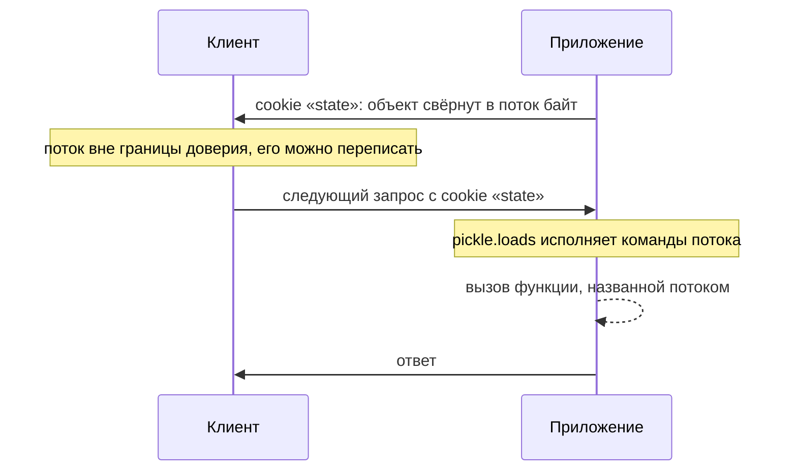

# Небезопасная десериализация

Приложению нужно помнить состояние между запросами: что лежит в корзине,
какой шаг мастера регистрации пройден. Хранилище на сервере заводить не
хочется, поэтому объект сворачивается в поток байт, отдаётся клиенту в cookie
и при следующем запросе восстанавливается обратно. Теперь представьте, что
клиент вскрывает cookie и кладёт туда поток, где записана не корзина, а имя
функции и просьба её вызвать. Если формат потока умеет такую запись,
приложение выполнит вызов ещё до того, как разбор вернёт результат.

Это небезопасная десериализация: восстановление объекта из присланного потока
оборачивается исполнением чужих команд. Проверять полученный объект поздно,
потому что к моменту, когда есть что проверять, вызов уже отработал. Тема
разбирает весь класс дефекта: откуда у форматов берётся такая возможность,
как вход выглядит в коде и какая мера закрывает класс целиком. Конкретные
цепочки вызовов под каждый язык идут в этапе 7.

## Что такое сериализация

### Сериализация и десериализация

Объект живёт в памяти программы, пока она работает: у него есть поля, методы
и связи с другими объектами. Чтобы пережить перезапуск или доехать до другого
процесса, объект переводят в поток байт. Такой перевод называют
сериализацией, а обратное восстановление — десериализацией. Бытовой аналог —
сохранение в игре: состояние мира сворачивается в файл, а при загрузке
разворачивается обратно. Аналогия ломается в одном месте: файл сохранения
пишет и читает одна игра, а в вебе поток байт может прислать кто угодно.

В Python сериализацией занимается стандартный модуль `pickle`. Вызов
`pickle.dumps(obj)` возвращает поток байт, а `pickle.loads(data)` строит
объект обратно. Поток устроен не как запись значений, а как программа для
небольшой машины внутри разборщика: последовательность команд вроде «запомни
строку» или «найди объект по имени». Устройство этих команд станет видно на
прогоне ниже.

### Два вида форматов

Форматы обмена делятся на два вида, и различие между ними решает всё в этой
теме. Форматы данных — JSON, CSV, обычный YAML — умеют выразить словари,
списки, строки и числа, и больше ничего. Это как записка «молоко, 2 шт,
хлеб»: в ней перечислены значения, и читателю остаётся их переписать.

Форматы с воссозданием объектов умеют больше. Это `pickle` в Python,
собственная сериализация Java и PHP, расширенный синтаксис YAML. Такой формат
может назвать класс или функцию и попросить среду выполнения их применить.
Записка из аналогии превращается в поручение: «найди мастера и вызови его» —
и читатель уже не переписывает значения, а исполняет. Граница аналогии такая:
живой исполнитель может отказаться от странного поручения, а разборщик не
может, потому что команда для него — приказ.

**Откуда это взялось.** Сериализация задумана для работы внутри границы
доверия, то есть там, где поток пишет и читает один и тот же код. Типовые
применения такие: сохранить состояние на диск, передать объект между
процессами своей системы, положить в кэш. В такой постановке возможность
восстановить любой объект — свойство, а не риск, потому что автор потока
свой. Потом тот же механизм вынесли наружу: в cookie, в скрытое поле формы, в
очередь сообщений. Граница доверия сдвинулась, формат остался прежним, и
сторона, которая теперь пишет поток, перестала быть своей.

## Как это работает

### Разбор — это исполнение

Посмотрим на поток `pickle` изнутри. Стенд на Python 3.14.7 сериализует
объект с безобидной нагрузкой: при восстановлении объект просит вызвать
обычную функцию, которая дописывает строку в список. Вредоносного кода здесь
нет — задача стенда показать, кто и когда решает, что будет вызвано.

```text
$ python e08-pickle.py
=== А. что лежит в потоке pickle ===
   длина: 90 байт
   коды операций: PROTO FRAME SHORT_BINUNICODE MEMOIZE
     SHORT_BINUNICODE MEMOIZE STACK_GLOBAL MEMOIZE ... REDUCE ... STOP
   среди них REDUCE — команда «вызови»: True

=== Б. загрузка ===
   до загрузки MARKER = []
   pickle.loads вернул: "вызвана note('данные превратились в вызов')"
   после загрузки MARKER = ['данные превратились в вызов']
```

Раздел А читается так. Поток — последовательность команд небольшой машины, и
среди них видны две важные. `STACK_GLOBAL` говорит: «найди в модуле объект с
таким именем». `REDUCE` говорит: «вызови то, что нашёл, с теми аргументами,
что лежат рядом». Именно так поток называет функцию и просит её вызвать, и
возможность эта заложена в самом формате, а не появляется из-за ошибки
программиста.

Раздел Б показывает следствие. Список `MARKER` изменился к моменту, когда
`loads` вернул управление, то есть функция вызвалась внутри разбора. Отсюда
правило темы: любая проверка результата опаздывает, потому что между «принять
байты» и «посмотреть, что получилось» стоит вызов, и что вызвать — решил
отправитель потока.

Остаётся вопрос, где тут дефект: в команде `REDUCE` или в том, кто прислал
поток. Ответ — во втором. Команда нужна формату для честной работы внутри
границы доверия, потому что без неё не восстановить сложный объект. Дефектом
её делает происхождение потока: команды чужой программы исполняются в вашем
процессе.

### Форматы данных так не умеют

Тот же стенд разбирает документ форматом данных:

```text
=== В. json на тех же данных ===
   json.loads: JSONDecodeError
   json восстанавливает только словари, списки, строки и числа:
    {'a': [1, 2, 'три']}
```

В JSON нет конструкции «назови функцию и вызови её». Разбор возвращает
структуру из встроенных типов, и что бы в документе ни стояло, кода из этого
не получится. Отсюда сила главной меры защиты — смены формата: она убирает не
вектор атаки, а саму возможность назвать код.

### YAML: граница проходит по загрузчику

YAML сложнее, потому что один и тот же формат обслуживают загрузчики с
разными правами. Загрузчик — это компонент, который строит объекты из
документа, и от его прав зависит, примет ли разбор конструкцию с вызовом.
Стенд прогоняет через все загрузчики один документ, называющий функцию
приложения:

```text
$ python e09-yaml.py
Python 3.14.7 | PyYAML 6.0.3
документ: !!python/object/apply:__main__.note ['через YAML']

  yaml.load без Loader           отказ: TypeError
  yaml.safe_load                 отказ: ConstructorError
  yaml.load(Loader=SafeLoader)   отказ: ConstructorError
  yaml.load(Loader=FullLoader)   отказ: ConstructorError
  yaml.unsafe_load               вернул "вызвана note('через YAML')"
```

Тег `!!python/object/apply` — это и есть конструкция «назови и примени»:
после двоеточия стоит имя функции, следом в скобках — её аргументы. Из
прогона следуют три вывода, и каждый поправляет расхожее мнение. Первый:
на PyYAML 6 вызов `yaml.load` без загрузчика не опасен, а невозможен —
аргумент стал обязательным, и без него разбор падает с `TypeError`. Второй:
документ с вызовом отвергают и `SafeLoader`, и `FullLoader`, а принимают его
только `Loader`, `UnsafeLoader` и `CLoader`. Третий: сам по себе YAML не
бывает ни безопасным, ни опасным — решает выбранный загрузчик, а это выбор
одной строки кода.

Границу доверия и место разбора показывает схема.



**Описание схемы.** Схема читается сверху вниз. Приложение сворачивает объект
в поток байт и отдаёт его клиенту в cookie. За пределами сервера поток ничто
не защищает: клиент или подсмотревший его атакующий может переписать поток
как угодно. Со следующим запросом поток возвращается, и разборщик исполняет
его команды, то есть вызов происходит внутри приложения до того, как
составлен ответ.

**Зачем это в работе AppSec-инженера.** На ревью вопрос к каждому месту, где
приложение что-то разбирает, один: этот формат воссоздаёт объекты или только
данные. Ответ решает, дефект перед вами или обычный разбор. Корень у класса
один — доверие потоку из-за границы без проверки целостности, то есть без
проверки, что поток по дороге никто не переписал.

## Как это атакуют

Атакующему нужны три вещи, и все три видны из механики выше. Первая — место,
где поток пересекает границу доверия: значение cookie, скрытое поле формы,
тело запроса, сообщение из очереди, кэш, файл, принятый загрузкой. Тема
`file-upload` описывает последний случай с другой стороны: принятый файл
может оказаться не картинкой, а входом разборщика.

Вторая — узнать формат по виду потока. Сериализованные потоки узнаются с
первых байт. Поток Java открывается двумя постоянными байтами и часто едет в
base64, где эти байты дают одно и то же начало. Поток PHP записан печатным
текстом с однобуквенными метками типов. Поток `pickle` открывается заголовком
протокола. Точные байты и примеры для каждого стека приводит раздел
PortSwigger из «Источников».

Третья — собрать свой поток, и для этого нужен гаджет. Гаджет — это метод в
коде приложения или его библиотек, который при восстановлении объекта делает
что-то полезное атакующему, например выполняет команду системы. Дверь к
гаджету у языков разная: в Java разборщик сам вызывает `readObject`, в PHP —
`__wakeup`. В Python поток называет вызов прямо, командой `REDUCE` из
механики выше. А `__reduce__` нужен атакующему при сборке потока: он кладёт в
поток нужный вызов, и исполнит его уже разбор.

Если одного гаджета мало, несколько сцепляют в цепочку, где выход одного
вызова становится входом следующего, как костяшки домино.
Аналогия ломается на сборке: домино расставляет сам атакующий, а гаджеты уже
лежат в чужом коде, и искать их приходится по библиотекам приложения.

Поэтому даже безобидный на вид объект в cookie — входная точка: атакующему
остаётся подобрать цепочку под зависимости приложения. Сборка цепочек —
работа со спецификой языка, и она разобрана в этапе 7: темы 7.1.01 (Python),
7.3.04 (Node.js) и 7.4.02 (Java). Эта тема намеренно остаётся на уровне
класса дефекта: распознать формат, найти вход, выбрать меру.

## Как это выглядит в коде

Признак дефекта читается по двум местам сразу: имени вызова и источнику
аргумента. В типовом фрагменте ниже главное происходит во второй строке, и
выноски разбирают почему.

```python
# УЯЗВИМО — демонстрация, не для продакшена
def load_state(request):
    raw = base64.b64decode(request.cookies["state"])   # (1)
    state = pickle.loads(raw)                          # (2)
    if not isinstance(state, UserState):               # (3)
        raise ValueError("чужой объект")
    return state
```

1. Источник — cookie, значение выбирает клиент. Поток байт непечатный,
   поэтому в cookie его носят в base64, и декодирование здесь — только
   распаковка, а не проверка.
2. Разбор форматом, воссоздающим объекты. Здесь всё и происходит.
3. Проверка типа стоит после разбора и потому не работает: строка 2 уже
   отработала к моменту, когда есть что проверять.

**Тот же дефект на другом стеке.** Меняется имя вызова, инвариант тот же:

```javascript
// УЯЗВИМО — демонстрация, не для продакшена
const state = nodeSerialize.unserialize(req.cookies.state);
```

Инвариант — поток из-за границы доверия попадает в разбор, воссоздающий
объекты. Декорация — язык, имя функции и способ доставки потока.

**Где ревьюер ошибается.** Не всякий `loads` опасен: `json.loads` на том же
месте дефекта не даёт, потому что в формате данных нет конструкции вызова.
Обратная ошибка — считать, что раз объект после разбора проверяется, всё в
порядке. Порядок операций здесь решает больше, чем наличие проверки.

## Как защититься

Меры выстраиваются по силе, и первая отличается от остальных по сути: она
убирает класс дефекта целиком, а остальные только сужают вектор.

**Сменить формат.** Обмен через JSON или другой формат данных: восстановить
объект нечем, потому что в формате нет такой конструкции. Cheat Sheet OWASP
называет это основным ответом. Прогон выше показывает почему: `json.loads` на
конструкции с вызовом падает с ошибкой разбора, а не молча её исполняет.

**Не принимать поток извне.** Состояние держится на сервере, а клиенту
отдаётся идентификатор — случайная строка, по которой сервер находит запись у
себя. Это тот же приём, что с именем файла в `path-traversal`: наружу уходит
ссылка, а не содержимое. Совпадение неполное: имя документа приложение и так
хранит, а серверное состояние — новое хранилище, которое надо ещё и чистить.

**Ограничить типы.** Если формат сменить нельзя, разбор ведётся со списком
разрешённых классов, а механизмы, объявленные небезопасными, с недоверенным
входом не применяются вовсе (ASVS v5.0-1.5.2). В Python это `safe_load` для
YAML и отказ от `pickle` на внешних данных. Мера слабее первых двух, потому
что разбор всё ещё исполняет поток, а список держат в актуальности руками.

**Проверить целостность до разбора.** Поток снабжается подписью — припиской,
которую вычисляют от данных и секретного ключа сервера; без ключа её не
подделать. Такая подпись на серверном ключе разобрана в `csrf-tokens`. Подпись
отвечает на вопрос «наш ли это поток», и проверяется она до того, как поток
попадёт в разборщик. Мера слабее остальных в этом списке, потому что она
защищает от чужого потока, но не от своего, собранного неверно.

Направление фикса в коде — формат данных плюс серверное состояние:

```python
# Направление фикса: формат данных плюс серверное состояние.
def load_state(request):
    sid = request.cookies["sid"]          # (1)
    raw = session_store.get(sid)          # (2)
    return UserState(**json.loads(raw))   # (3)
```

1. Клиент носит идентификатор, а не состояние.
2. Само состояние лежит на сервере и снаружи не приходит.
3. Разбор идёт форматом данных, а объект собирает свой код из проверенных
   полей.

**Где это не работает.** Формат сменить удаётся не всегда: очередь сообщений
или библиотека кэша могут навязывать свой. XML — отдельный случай: объекты он
не воссоздаёт, но его разборщик умеет ходить за внешними сущностями, и
закрывается это настройкой парсера (ASVS v5.0-1.5.1, тема `xxe`). Подпись не
спасает, если ключ утёк или поток собирает та же сторона, которая его
подписывает.

## Частая ошибка

«Опасен `pickle`, а YAML — обычный текстовый формат, и разбирать им внешние
данные можно». Прежде чем читать дальше, прикиньте свой ответ: согласны ли
вы?

Опасен не формат, а загрузчик. Расширенный синтаксис YAML умеет назвать
объект по имени модуля и попросить его применить — ровно то же, что делает
`pickle`. Контрпример из прогона выше: один и тот же документ отвергают
`safe_load`, `SafeLoader` и `FullLoader`, а `unsafe_load` вызывает названную
функцию. Разница между безопасным и опасным разбором — одно слово в имени
вызова.

Заблуждение держится на том, что YAML читается глазами. Печатный вид создаёт
впечатление, что перед нами данные, а не команды, но команда, записанная
буквами, остаётся командой. Заодно стоит поправить и обратное поверье: совет
«никогда не вызывайте `yaml.load`» на PyYAML 6 устарел. Без загрузчика этот
вызов не работает вовсе, и внимание надо переносить на то, какой загрузчик
выбран.

## Чеклист для ревью

1. Проверьте, что недоверенные данные не разбираются механизмом, воссоздающим
   объекты (ASVS v5.0-1.5.2).
2. Проверьте, что формат обмена с клиентом — формат данных, а не сериализация
   объектов языка.
3. Проверьте, что при разборе YAML выбран безопасный загрузчик, а не тот, что
   применяет названные объекты.
4. Проверьте, что проверка типа или содержимого не поставлена после разбора
   как единственная защита.
5. Проверьте, что состояние, которое незачем отдавать клиенту, хранится на
   сервере, а наружу уходит идентификатор.
6. Проверьте, что XML-разборщики настроены без разрешения внешних сущностей
   (ASVS v5.0-1.5.1).
7. Проверьте, что подпись потока, если она применяется, проверяется до
   разбора, а не после.

## Попробуй сам

Пройдите по своему или учебному приложению и составьте перечень мест, где
что-либо разбирается: тело запроса, cookie, сообщения очереди, кэш, файлы,
конфигурация. Для каждого места запишите формат, имя вызова разбора и
источник потока. Подсказка одна: вызов разбора ищется по имени функции, а не
по имени переменной, поэтому прогоните поиском и `loads`, и `unserialize`, и
`load` с загрузчиком.

**Наблюдаемый критерий:** таблица «место — формат — вызов — источник» с
пометкой у каждой строки, воссоздаёт ли формат объекты и пересекает ли поток
границу доверия. Строки, где оба ответа «да», — список задач.

## Проверь себя

1. Импорт макета страницы принимает файл от пользователя:

   ```python
   def import_layout(request):
       raw = base64.b64decode(request.files["layout"].read())
       layout = pickle.loads(raw)
       if not isinstance(layout, dict):
           raise ValueError("нужен словарь настроек")
       return render_layout(layout)
   ```

   Где здесь дефект и почему проверка `isinstance` его не закрывает?

2. Состояние кабинета ездит в cookie потоком `pickle`:

   ```python
   def load_state(request):
       raw = base64.b64decode(request.cookies["state"])
       state = pickle.loads(raw)
       if not isinstance(state, UserState):
           raise ValueError("чужой объект")
       return state
   ```

   Какую починку вы выберете?

   A. Оставить `pickle`, но подписывать поток и проверять подпись до разбора.

   B. Сменить формат на JSON, а состояние держать на сервере по
      идентификатору из cookie.

   C. Оставить `pickle`, но разбирать со списком разрешённых классов.

3. Почему проверка восстановленного объекта на тип стоит слишком поздно?
4. Предскажите, что напечатает этот фрагмент и в каком порядке пойдут строки.

   ```python
   import pickle

   class Note:
       def __reduce__(self):
           return (print, ("данные превратились в вызов",))

   data = pickle.dumps(Note())
   print("поток собран, вызова ещё не было")
   pickle.loads(data)
   ```

5. Возврат к теме `os-command-injection`: что общего у этого класса с
   инъекцией команды и в чём разница по месту, где данные становятся кодом?
6. Возврат к теме `path-traversal`: чем приём «состояние на сервере, клиенту —
   идентификатор» похож на идентификатор вместо имени файла?

<details markdown="1">
<summary>Ответ 1</summary>

1. Дефект в строке с `pickle.loads`: файл пришёл из-за границы доверия, а
   разбор потока с воссозданием объектов — это исполнение названных в нём
   вызовов. Проверка `isinstance` стоит после разбора: к моменту, когда объект
   есть и его можно посмотреть, вызовы уже отработали. Порядок операций здесь
   решает больше, чем наличие проверки.

</details>

<details markdown="1">
<summary>Ответ 2: разбор вариантов</summary>

2. Верный ответ — B.

   A. Подпись отвечает на вопрос «наш ли это поток» и не отвечает на вопрос
      «что этот поток заставит выполнить». Свой же поток, собранный неверно,
      или поток, подписанный утёкшим ключом, она пропустит. Мера сужает
      вектор, а не закрывает класс.

   B. В JSON нет конструкции «назови функцию и вызови её» — мера убирает саму
      возможность, а не вектор. Состояние на сервере убирает и сам приход
      потока извне: клиент носит идентификатор, а не содержимое.

   C. Список классов сужает набор того, что можно построить, но оставляет сам
      механизм построения: разбор всё ещё исполняет поток, а список держат в
      актуальности руками. Cheat Sheet называет основным ответом смену
      формата, а не ограничение типов.

</details>

<details markdown="1">
<summary>Ответ 3</summary>

3. Разбор отрабатывает раньше проверки: `REDUCE` в потоке — команда «вызови»,
   и названная потоком функция выполняется до того, как `loads` вернёт
   результат. Когда появилось то, что можно проверять, вызов уже произошёл.

</details>

<details markdown="1">
<summary>Ответ 4</summary>

4. Сначала «поток собран, вызова ещё не было», затем «данные превратились в
   вызов». Функция, чьё имя в поток положил `__reduce__` при сборке,
   сработала внутри `loads`, до возврата результата. Прогон фрагмента
   командой `python3` подтверждает ответ. Разбор такого потока — не чтение, а
   исполнение.

</details>

<details markdown="1">
<summary>Ответ 5</summary>

5. Общее — данные, которые интерпретатор читает как команды. Разница в
   интерпретаторе и в месте: при инъекции команды данные попадают в оболочку
   операционной системы, здесь — в разборщик формата внутри самого процесса
   приложения.

</details>

<details markdown="1">
<summary>Ответ 6</summary>

6. В обоих случаях клиент присылает значение из ограниченного множества, а
   настоящее содержимое приложение находит у себя: по номеру документа — имя
   файла, по идентификатору — состояние. Присланное не становится ни путём,
   ни потоком объектов.

</details>

## Источники

1. PortSwigger Web Security Academy, «Insecure deserialization»; реестр
   `ps-deserialization`. Разделы: как выглядят сериализованные данные разных
   стеков, правка объекта, магические методы как точка входа, цепочки
   гаджетов.
   <https://portswigger.net/web-security/deserialization>
2. OWASP Deserialization Cheat Sheet; реестр `owasp-cs-deserialization`.
   Разделы: Python (`pickle`, PyYAML `load` против `safe_load`), PHP, Java с
   фильтрами десериализации, общее правило смены формата данных.
   <https://cheatsheetseries.owasp.org/cheatsheets/Deserialization_Cheat_Sheet.html>

Каркас этапа: `owasp-asvs-5-document` (ASVS v5.0.0), `owasp-wstg-42`,
`owasp-top10-2025`. Наследуются всеми темами и отдельной строкой не
повторяются.

**Скоропортящийся слой.** Поведение загрузчиков PyYAML привязано к версии:
обязательный аргумент `Loader` появился не сразу, и на более старых версиях
`yaml.load` без него работает и опасен. Набор загрузчиков и их права между
версиями тоже менялись. Перечень небезопасных механизмов в других языках
зависит от версии среды выполнения и от установленных фильтров.

**Маркеры уверенности.** Устройство потока `pickle`, момент вызова при
загрузке, поведение JSON на тех же данных и права пяти загрузчиков PyYAML —
**проверено лично** 2026-08-24 на Python 3.14.7 и PyYAML 6.0.3 (стенды
`e08-pickle.py` и `e09-yaml.py`): в потоке присутствуют коды `STACK_GLOBAL` и
`REDUCE`; названная функция вызывается до возврата из `loads`; `json.loads`
той же конструкции не даёт; `yaml.load` без загрузчика падает с `TypeError`;
`safe_load`, `SafeLoader` и `FullLoader` отвергают документ с
`ConstructorError`; `Loader`, `UnsafeLoader` и `CLoader` вызывают названную
функцию. Полезная нагрузка во всех стендах безобидна — дописывает строку в
список. Требования к безопасному разбору и к настройке XML-парсеров — **по
документации** (ASVS v5.0.0, открыт лично 2026-08-24). Меры защиты и разбор
по стекам — **по документации** (Deserialization Cheat Sheet, открыт лично
2026-08-24). Вид сериализованных потоков Java и PHP и поведение Node-стека
**не воспроизводились**: описаны по источнику, стендов на них не ставилось.
