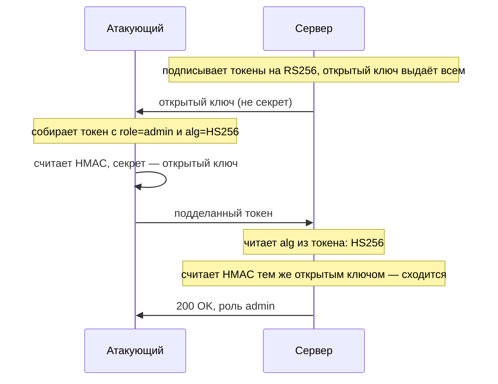
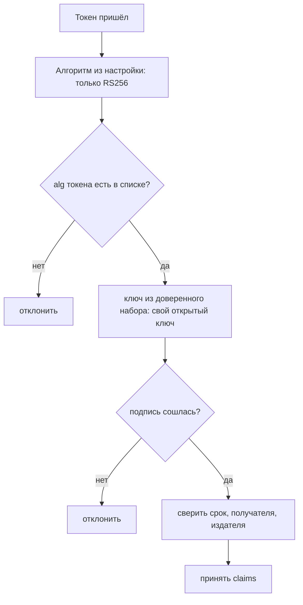

# Атаки на JWT: alg=none, путаница ключей

Пользователь кабинета вошёл под своим именем и получил токен с ролью `user`.
Он раскодировал нагрузку, поменял роль на `admin`, а потом сделал ход, от
которого его должна была спасти подпись: стёр её и написал в заголовке
`alg=none`. Кабинет принял токен и отдал права администратора. Криптографию
при этом никто не ломал: сервер сам решил, что проверять нечего, потому что
так сказано в присланном токене.

Эта тема про то, как заголовок токена получает власть над проверкой подписи,
и про то, как эту власть отобрать. Приёмов несколько: снять подпись,
подменить алгоритм, подсунуть свой ключ. Корень у них один, и чинится он
одним правилом, а не заплаткой на каждый приём.

## Подумай, прежде чем читать

1. Токен приходит с заголовком `{"alg":"none"}`. Почему сервер вообще может
   его принять, если подписи в токене нет?
2. Открытый ключ сервера не секрет и публикуется. Как из него собрать
   подделку, если подпись на паре ключей атакующий сделать не может?
3. Поле `kid` в заголовке говорит серверу, каким ключом проверять токен. Что
   плохого, если сервер берёт ключ по этому полю?

## Как это работает

Проверка подписанного токена состоит из двух решений: каким алгоритмом
сверять подпись и каким ключом. Сам токен, его три части и смысл поля `alg`
разобраны в теме `jwt-basics`; там же названо главное: содержимому токена
доверяют только после проверки подписи. Здесь начинается вопрос, который та
тема только поставила: кто решает, как именно проверять. Если решение
принимает приложение, подпись работает. Если его принимает присланный
заголовок, подпись защищает ровно от тех изменений, которые атакующий делать
не собирался.

**Откуда это взялось.** Поле `alg` задумано ради смены алгоритмов. Библиотека
читает его, чтобы знать, какой проверкой сверять подпись, и это позволяет
менять алгоритмы, не переписывая формат токена. Пока `alg` считали служебной
подсказкой, никто не замечал, что подсказку даёт предъявитель. Первые
библиотеки честно исполняли то, что написано в токене: и `alg=none`, и выбор
ключа по полю из заголовка. Оказалось, что доверять этим полям до проверки
подписи нельзя: они и есть та часть токена, которую подделывают.

У такого доверия есть имя. Данные, которые прислал предъявитель и которые
ничем ещё не подтверждены, называют неаутентифицированным вводом. Заголовок
токена — именно он. Бытовой пример — записка «пропуск в порядке», приклеенная
к чужому пропуску: охраннику надо проверять сам пропуск, а не записку на нём.
Подпись посчитана по заголовку тоже, поэтому после проверки подмену видно.
Но сверить подпись можно, только когда алгоритм и ключ уже выбраны, а читают
их из того же, ещё не проверенного заголовка. Получается круг: чтобы
проверить заголовок, надо ему довериться. Разрывают круг одним ходом —
алгоритм и ключ берут из настройки приложения, а не из токена.

Четыре приёма темы делятся не поровну. Три живут в этом круге: первый
объявляет подпись ненужной, второй подменяет семейство алгоритма, четвёртый
подсовывает свой ключ через поля заголовка. Третий стоит особняком: он
угадывает сам секрет, и круг ему не нужен. Разберём все четыре по одному.

**Зачем это в работе AppSec-инженера.** На ревью любого механизма на JWT
вопрос один: что решает, каким алгоритмом и ключом проверять токен, —
приложение или присланный заголовок. Ответ читается в двух-трёх строках кода
проверки, и эта тема учит их видеть.

О границах темы. Срок жизни и отзыв уже выданного токена разбирает тема
`token-lifetime-revocation`, подмену роли в контроле доступа —
`role-parameter-tampering`. Механизм, к которому в итоге сводится поле `jku`
заголовка, разбирает тема `ssrf-basics`. Здесь они не повторяются.

### alg=none: подпись, объявленная ненужной

Стандарт допускает токен без подписи: поле `alg` равно `none`, а третья часть
пуста, и точка перед ней остаётся на месте. RFC 7519 называет такой токен
незащищённым (Unsecured JWT), и тема `jwt-basics` уже показала главное:
токен имеет право заявить о себе «я не подписан». Сам по себе формат не
дефект: он применим там, где содержимое защищено чем-то внешним. Дефект
начинается у проверяющего. Он читает алгоритм из токена, встречает `none` и
решает не сверять подпись вовсе.

Первая починка, которая приходит на ум, — чёрный список: перечислить
запрещённые значения и отбрасывать их на входе. Это как список гостей,
которым вход в клуб закрыт: работает, пока гость называет себя ровно тем
именем, что в списке. Атакующий это знает и искажает запись, оставляя смысл.
Такой приём называют обфускацией. Гость из примера называет то же имя с
ошибкой или в другом регистре, и строгий привратник его уже не узнаёт.
Академия PortSwigger описывает ту же судьбу у фильтра строки `none`. Смешанный
регистр, лишние символы, неожиданная кодировка — и библиотека по-прежнему
понимает значение как «без подписи», а запрет его не узнаёт.

Стенд гонит одну подделку с ролью `admin` против трёх проверяющих:

```text
вариант заголовка         A: alg из токена   B: чёрный список   C: PyJWT
alg="none"                ПРИНЯТ             откл.              откл.
alg="None"                ПРИНЯТ             ПРИНЯТ             откл.
alg="nOnE"                ПРИНЯТ             ПРИНЯТ             откл.
alg="none" + мусор в подписи  ПРИНЯТ         откл.              откл.
```

Проверяющий A читает алгоритм из токена и принимает всё, включая вариант с
мусором на месте подписи. Проверяющий B завёл чёрный список со строкой
`none`, но регистр не разобрал: `None` и `nOnE` проходят мимо запрета. Это
типичная судьба чёрного списка: его обходят обфускацией. Проверяющий C —
библиотека PyJWT, которой приложение задало список алгоритмов. Она сверяет
`alg` токена с этим списком и отвергает все четыре варианта.

### Путаница ключей: открытый ключ как секрет

Второй приём тоньше, и у него есть имя: путаница ключей (algorithm
confusion). Напомним опору из темы `jwt-basics`: при подписи `RS256` ключа
два, закрытым подписывают, а открытым проверяют, и открытый ключ не секрет,
его публикуют. При подписи `HS256` ключ один, общий секрет, и им и
подписывают, и проверяют. Чем семейства различаются и почему секрет нельзя
публиковать, разбирает тема `hmac-vs-signature`.

Теперь сама атака. Атакующий берёт открытый ключ сервера — секрета тут нет,
ключ лежит в открытом доступе. Он собирает токен с ролью `admin`, пишет в
заголовке `alg=HS256` и подписывает подделку открытым ключом, как будто это
общий секрет HMAC. Проверяющий, который выбирает алгоритм по токену, видит
`HS256` и берёт свой единственный ключ проверки — тот самый открытый. Он
считает HMAC тем же ключом, и подпись сходится. Закрытый ключ атакующему не
понадобился: вся атака собрана из того, что сервер и так отдаёт наружу.

Бытовой пример — печать организации. Документы заверяют печатью, а образец
оттиска висит на стенде у входа, чтобы любой мог сверить. Подделать оттиск
по образцу трудно, поэтому стенд не опасен. Теперь представьте, что приёмщик
документов сменил способ проверки: вместо сверки оттиска он спрашивает
секретное слово, а слово — то самое, что написано на стенде. Любой, кто видел
стенд, теперь «заверяет» любой документ.

Соответствие такое: печать — закрытый ключ, оттиск на стенде — открытый,
секретное слово — общий секрет HMAC, а смена способа проверки — подмена
`RS256` на `HS256`. Где пример ломается: слово со стенда ещё надо
подсмотреть, а открытый ключ сервер отдаёт сам, по запросу любого
предъявителя.



**Описание схемы.** Схема читается сверху вниз и показывает путаницу ключей
по шагам. Сервер заранее публикует открытый ключ — это штатная работа, а не
утечка. Атакующий собирает подделку, подписывает её этим ключом как секретом
и отправляет. Сервер берёт способ проверки из самого токена, применяет тот
же ключ, и подпись сходится. Закрытый ключ в этой схеме не участвует вовсе.

Стенд проверяет подделку на четырёх проверяющих. Проверяющего B здесь нет:
его чёрный список писали про строку `none`, и к подмене семейства он не
относится.

```text
подделка HS256 на открытом ключе, role="admin"
  A. проверка, читающая алгоритм из токена (ключ один): ПРИНЯТ, role=admin
  C. PyJWT, algorithms=['RS256'] — список закрыт:       отклонён
  C'. PyJWT, оба семейства в списке, ключ в PEM:        отклонён
  D. та же библиотека, ключ подан сырыми байтами:       ПРИНЯТ, role=admin
```

Корень атаки — смешение двух семейств. При асимметричной подписи ключа два,
и роли у них разные: закрытый подписывает, открытый проверяет. При MAC ключ
один, и та же сторона им и подписывает, и проверяет. Проверяющий, который
берёт «ключ» и «алгоритм» по отдельности, стирает эту разницу: открытый
ключ, публичный по замыслу, встаёт на место секрета, который публичным быть
не должен.

RFC 8725 в разделе об угрозах называет этот случай среди первых. Значение
`RS256` меняют на `HS256`, и уязвимая библиотека проверяет подпись,
используя открытый ключ RSA как общий секрет HMAC. Отсюда предписание
различать ключи по назначению и не позволять одному ключу работать с двумя
алгоритмами.

Строки C′ и D показывают границу приёма. Проверяет одна и та же свежая
библиотека, и список у неё один — оба семейства сразу. Разница только в
форме поданного ключа. Ключ в PEM-обёртке, то есть текстом между
строками `-----BEGIN PUBLIC KEY-----` и `-----END PUBLIC KEY-----`,
отвергнут. По обёртке библиотека узнала открытый ключ и отказалась считать
им HMAC (InvalidKeyError). Тот же ключ сырыми байтами, без обёртки, она
принимает: отличить открытый ключ от случайного секрета по одним байтам
нельзя.

### Слабый секрет: подбор ключа HMAC

Третий приём не ломает проверку, а угадывает ключ. Если сервер подписывает
`HS256` слабым секретом — паролем, значением из примера документации,
настройкой по умолчанию, — секрет подбирают перебором.

Перебор пароля через форму входа — онлайн-атака: каждая догадка идёт на
сервер и видна ему, а тема `brute-force-defense` разбирает, как такой перебор
тормозят. С токеном иначе. Атакующему достаточно одного валидного токена и
словаря. Догадку он проверяет у себя: считает подпись от заголовка и
нагрузки и сравнивает её с третьей частью токена. Совпала — секрет найден, и
с ним подписывается любой токен. Это офлайн-перебор: сервер о нём не узнает,
потому что запросов нет. Как взломщик, который не крутит кодовый замок на
месте, под камерой, а снял его и унёс домой: там он перебирает без лимита и
свидетелей.

Академия PortSwigger рекомендует для такого перебора готовый инструмент и
напоминает, что работает он локально, без обращений к серверу, и потому
быстро. Защита одна: не пароль в роли секрета, а случайное значение
достаточной длины. Какой длины и откуда его брать, разбирает тема
`jwt-basics`.

### kid, jku, jwk: ключ, выбранный токеном

Четвёртый приём не трогает алгоритм, а подменяет сам ключ. Спецификация
подписи разрешает заголовку нести подсказки о ключе, и cheat sheet OWASP
перечисляет опасные поля. `kid` — идентификатор ключа, как номер ячейки в
камере хранения: «возьми ключ номер такой-то». `jku` — адрес, по которому
лежит набор ключей. `jwk` — сам ключ, целиком, прямо в заголовке. `x5u` и
`x5c` — сертификат или ссылка на него. Все пять полей выбирают ключ проверки,
и все пять приходят от предъявителя.

Поле `kid` часто служит именем: путём к файлу ключа или значением в запросе к
базе. Тогда оно открывает два знакомых класса атак. Первый — обход каталога:
вместо имени файла подставляют путь с подъёмами `../`, чтобы выйти из
положенного каталога. Это как номерок в гардеробе, по которому выдают вещь:
посетитель называет «номерок» вида «выйди в коридор и открой третью дверь»,
и служитель послушно идёт.

Так проверку уводят на предсказуемый пустой файл: пустой файл читается как
пустой ключ, и токен, подписанный пустым ключом, проходит. Второй класс —
инъекция в запрос к базе ключей. Как склейка строки превращает значение в
команду, разбирают темы `sqli-basics` и `parameterized-queries`.

```text
А. kid как имя файла в каталоге ключей:
  честный токен, kid="k1": role=user
  подделка, kid="../../…/dev/null", пустой ключ: ПРИНЯТ, role=admin
  та же подделка проверкой со списком известных kid: отклонён
Б. kid как значение в запросе к базе ключей:
  склейка строки     kid из инъекции -> 'attacker-chosen-key'
  параметр запроса   kid из инъекции -> None
```

Первый прогон уводит проверку на `/dev/null`, и описанное выше срабатывает
дословно: подделка проходит, а проверка со списком известных `kid` её
отклоняет. Второй показывает, что `kid` доезжает до базы: запрос, собранный
склейкой строки, отдаёт значение из инъекции, а параметризованный — нет.
Поле `jku` уводит проверку на набор ключей по адресу. Это уже запрос
сервера по ссылке из присланных данных — подделка запроса на стороне
сервера, разобранная в теме `ssrf-basics`. Поле `jwk` кладёт ключ прямо в
заголовок: наивный сервер проверит токен ключом, который атакующий же и
приложил.

У этих полей есть законное применение, и cheat sheet проводит границу точно.
Дело не в том, чтобы их запретить, а в том, чтобы не делать их источником
доверия. Ключ берут из материала, установленного заранее: из закреплённого
ключа или из адреса ключей в метаданных издателя. А `kid`, `x5t` и подобные
служат выбором среди уже доверенных ключей, а не вводом нового. Разница в
одном слове: подсказка внутри доверия против самого источника доверия. Именно
эту границу и проверяют на ревью.

### Общий корень

Три приёма из четырёх — про одно: способ проверки подписи взят из токена.
Поле `alg` решает, сверять ли и чем; поля `kid`, `jku`, `jwk` решают, каким
ключом. Пока эти решения принимает присланный заголовок, подпись не защищает
ничего: атакующий подписывает подделку так, как её же и будут проверять.

Из этого следует и порядок разбора на ревью. Сначала смотрят, откуда берётся
алгоритм: из литерала приложения или из токена. Потом — откуда берётся ключ:
из доверенного набора или из заголовка. Два вопроса закрывают три приёма
сразу, потому что все они бьют ровно в эти два места. Отдельные поля —
лишь разные двери к одному и тому же: подставить атакующему выбор ключа.

Четвёртый приём, подбор слабого секрета, этой парой вопросов не закрыть. Он
работает и против сервера, который берёт алгоритм и ключ строго из своей
настройки, скажем литералом `algorithms=["HS256"]`, — если сам секрет
угадываем. Его закрывает не правило выбора алгоритма, а длина и случайность
секрета, разобранные в теме `jwt-basics`.

## Как это атакуют

Приёмы разобраны на стенде — это лаба темы, каталог `pilot/lab/jwt-attacks`.
Кабинет подписывает роль на `RS256` и проверяет токен алгоритмом из
заголовка. Ключи генерируются локально при запуске, сети нет, закрытый ключ
есть только у сервера. Эксплойт — файл `hack.py`: он прогоняет две подделки
из прошлых разделов и два контроля.

```bash
cd pilot/lab/jwt-attacks
../../../.venv-tools/bin/python hack.py
```

```text
Цель: code.py
  опыт 1 — alg=none, подпись пустая: РОЛЬ ADMIN БЕЗ ПОДПИСИ
  опыт 2 — HS256 на открытом ключе сервера: РОЛЬ ADMIN БЕЗ ЗАКРЫТОГО КЛЮЧА
  опыт 3 — контроль, честный RS256 wiener: роль user
  опыт 4 — контроль, подмена role в RS256 без ключа: отвергнута

ЭКСПЛОЙТ СРАБОТАЛ: способ проверки выбран заголовком токена (2 из 2 опытов)
```

Опыт 1 объявляет `alg=none` и шлёт токен с ролью `admin` и пустой подписью.
Проверяющий видит `none` и не сверяет подпись — роль принята. Опыт 2 берёт
открытый ключ сервера, объявляет `HS256` и подписывает подделку этим ключом
как секретом HMAC. Проверяющий берёт тот же открытый ключ, считает HMAC — и
подпись сходится.

Опыт 3 — контроль на живучесть: честный токен `RS256` обязан работать и
после починки. Опыт 4 — контроль на целостность: подмена роли в честном
токене без ключа отвергается. Вместе они показывают, что дефект не в самой
подписи, а в выборе способа её проверки. Скажите, не забегая вперёд:
справится ли с обоими опытами закрытый список из двух алгоритмов, `RS256` и
`HS256`, если ключ проверки всё тот же открытый?

Тяжесть здесь предельная, и это не преувеличение. Токен на JWT почти всегда
несёт аутентификацию и права: подделав его, атакующий выдаёт себя за любого
пользователя и с любой ролью. Издание OWASP отмечает, что при компрометации
учётной записи с правами администратора отдано приложение целиком. Поэтому
обход проверки подписи — не локальная ошибка одного обработчика, а сквозной
отказ всего механизма доверия.

## Как это выглядит в коде

Ревьюер ищет одно: откуда берутся алгоритм и ключ проверки. Разбор идёт
четырьмя планами. Первый — найти, откуда читается алгоритм. Второй — найти
ветку, где подпись не сверяется. Третий — проверить, не обслуживает ли один
ключ два семейства. Четвёртый — найти, не выбирает ли ключ сам токен.
Первые три признака видны в листинге — найдите их сами, прежде чем читать
выноски.

```python
# УЯЗВИМО — демонстрация, не для продакшена
alg = json.loads(_unb64u(header)).get("alg")    # (1)
if alg == "none":
    claims = jwt.decode(token, options={"verify_signature": False})  # (2)
elif alg == "HS256":
    verify_hmac(token, public_key)              # (3)
elif alg == "RS256":
    verify_rsa(token, public_key)
```

1. Алгоритм читается из заголовка токена до всякой проверки. Это
   неаутентифицированный ввод, и именно он решает, чем сверять подпись.
2. Ветка, где подпись не сверяется вовсе. Параметр `verify_signature: False`
   законен для чтения заведомо чужого токена, но здесь результат идёт в
   решение о правах.
3. Один и тот же ключ подан и в HMAC, и в RSA. Открытый ключ, публичный по
   замыслу, встаёт на место секрета, и путаница ключей открыта.
4. Четвёртого признака в листинге нет: выбора ключа по `kid`, `jku` или
   `jwk`. Он появляется, когда проверяющий берёт ключ по полю из заголовка.

**Тот же дефект на другом стеке.** В Node он прячется в широком списке
алгоритмов. Попробуйте увидеть щель, не заглядывая в разбор:

```javascript
// УЯЗВИМО — демонстрация, не для продакшена
jwt.verify(token, key, { algorithms: ["RS256", "HS256"] });
```

Список из двух семейств сразу открывает путаницу ключей: токен с `alg=HS256`
проверят тем же ключом, что и `RS256`, и подпись подделки сойдётся. Это
коварнее ветвления по `alg`: код выглядит правильно, список алгоритмов задан
явно, и всё же щель открыта, потому что в списке стоят оба семейства.
Инвариант здесь — «алгоритм проверки задан предъявителем», а декорация —
язык и то, спрятан выбор в ветвлении или в списке. Поведение Node-стека в
прогоне этой темы не воспроизводилось: листинг показывает форму дефекта, а
не результат запуска.

**Где ревьюер ошибается.** Чтение заголовка без проверки подписи законно,
если результат никуда не идёт в решение: например, прочитать `kid`, чтобы
выбрать ключ из заранее доверенного набора. Дефект не в чтении заголовка, а
в доверии ему — когда из него берут сам способ проверки.

## Как защититься

Правило одно: алгоритм и ключ задаёт сервер, а не токен. Список принимаемых
алгоритмов — постоянный литерал на стороне проверки. Разбор исправленного
вызова идёт тремя планами: подать ключ явно, закрыть список одним
семейством, сверить получателя.

```python
# Исправлено: список закрыт, ключ — открытый, только RS256.
claims = jwt.decode(
    token,
    public_key_pem,                # (1)
    algorithms=["RS256"],          # (2)
    audience="api.shop.example",   # (3)
)
```

1. Ключ подан явно и один: открытый, для `RS256`. Подменить его полем из
   заголовка здесь нечем — источник ключа на стороне приложения.
2. Список принимаемых алгоритмов задан приложением, а не взятым из
   заголовка. Библиотека сверяет `alg` токена со списком и отвергает и
   `none`, и `HS256`: они в список не входят.
3. Сверка получателя отсекает токен, выписанный для другого сервиса.

RFC 8725 формулирует это требованием § 3.1: библиотека обязана дать
вызывающему указать набор алгоритмов и не использовать другие. ASVS требует
того же в v5.0-9.1.2. Проверка после починки идёт в одном порядке, и его
видно на схеме.



**Описание схемы.** Схема читается сверху вниз. Сначала приложение берёт
алгоритм из собственной настройки и сверяет с ним заголовок токена: чужой
алгоритм отклонён до всякой проверки подписи. Затем ключ берётся из
доверенного набора, и только после этого сверяется подпись. В конце —
проверки утверждений из темы `jwt-basics`. На каждом отказе токен
отбрасывается целиком.

**Где это не работает.** Закрытый список не спасает, если в него включены
оба семейства сразу: путаница ключей тогда открыта изнутри «правильной»
настройки, как в листинге на Node выше. Не спасает список и от полей `kid`,
`jku`, `jwk`. Их закрывают отдельно: сверкой `kid` со списком известных
ключей и запретом брать ключ из заголовка или по чужому адресу.

**Что добавляется поверх.** Ключи разного назначения держат разными: ключ
подписи JWT не совпадает с транспортным ключом TLS и не работает в двух
алгоритмах сразу. Секрет `HS256` случаен и длинён, иначе его подберут
офлайн, как в разделе про слабый секрет. Проверка `aud` и `iss` отсекает
подстановку чужого токена. Ключ проверки берут из доверенного источника —
закреплённого ключа или метаданных издателя, — а не из заголовка токена. Всё
это предписания RFC 8725, и читаются они вместе, а не поодиночке: закрытый
список алгоритмов без различения ключей или без проверки получателя
оставляет свою щель.

## Как убедиться, что защита работает

Ретест — повторная проверка после починки — прогоняет те же опыты против
исправленного проверяющего и добавляет контроль на живучесть.

```bash
cd pilot/lab/jwt-attacks
LAB_TARGET=solution.py ../../../.venv-tools/bin/python hack.py
```

```text
Цель: solution.py
  опыт 1 — alg=none, подпись пустая: отвергнут
  опыт 2 — HS256 на открытом ключе сервера: отвергнут
  опыт 3 — контроль, честный RS256 wiener: роль user
  опыт 4 — контроль, подмена role в RS256 без ключа: отвергнута

эксплойт не сработал: алгоритм не берётся из токена, …
```

Финальная строка укорочена многоточием, потому что целиком не влезает в
колонку: в оригинале после запятой идут слова «честные токены проходят,
подмена отвергнута». Оба обхода закрыты, честный токен проходит, подмена
роли отвергнута.

Функциональность держат пять проверок лабы: вход пользователя и
администратора, отказ на мусоре и на битых частях, доступность открытого
ключа.

```bash
LAB_TARGET=solution.py ../../../.venv-tools/bin/python tests.py
```

```text
Цель: solution.py
  OK   пользователь входит по честному RS256
  OK   администратор входит по честному RS256
  OK   мусор вместо токена отвергнут
  OK   битые части отвергнуты
  OK   открытый ключ доступен для проверки

упало: 0
```

Все пять зелёные и на уязвимом коде, и на решении: тема правит проверку, а
не поведение кабинета, поэтому рабочие сценарии не ломаются.

Полумеры видны по остатку. Запрет одной строки `none` в чёрном списке
оставляет `None` и `nOnE`; закрытый список из двух семейств оставляет
путаницу ключей. Проверка проходит, только когда список закрыт одним
семейством и ключ задан явно.

На ревью пройдите по списку.

1. Проверьте, что список принимаемых алгоритмов задан постоянным литералом
   на стороне проверки, а не берётся из заголовка токена (ASVS v5.0-9.1.2).
2. Проверьте, что в списке нет `none` ни в каком регистре и нет ветки, где
   подпись не сверяется при принятии решения о правах.
3. Проверьте, что список не смешивает симметричное и асимметричное
   семейства, иначе открыта путаница ключей.
4. Проверьте, что ключ проверки задан приложением, а не берётся из `jwk`,
   `jku` или `x5u` заголовка.
5. Проверьте, что `kid` перед использованием сверяется со списком известных
   ключей и не доходит до файловой системы или базы как имя.
6. Проверьте, что ключ подписи JWT не совпадает с ключом другого назначения
   и не используется в двух алгоритмах сразу.

## Как это находят инструменты

Статический анализ (SAST) проверяет исходный код без запуска: правило ищет
опасные формы вызовов. Правило этой темы написано на выбор алгоритма из
токена и на снятие проверки. Оно ловит вызов разбора токена с выключенной
проверкой подписи и список алгоритмов, взятый из заголовка самого токена.

Правило целиком — в `pilot/semgrep/jwt-alg-from-token.yaml`, и оно сверено
прогоном:

```bash
.venv-tools/bin/python pilot/semgrep/check.py jwt-alg
```

```text
=== jwt-alg: pilot/semgrep/jwt-alg-from-token.yaml
  jwt-alg-from-token.py: ожидалось 5, найдено 5
    пропущено (ложноотрицательные): нет
    на строках ok (ложноположительные): нет
    вне разметки: нет
  лаба, code.py — находки: [(88, 'jwt-alg-from-token')]
  лаба, solution.py — находки: []  (…)
  ПРАВИЛО СВЕРЕНО
```

Файл с восемью размеченными тест-кейсами лёг без расхождений: пять мест с
дефектом найдены, три чистых места не помечены. На уязвимом файле лабы одна
находка, на решении — ноль. Строка у `solution.py` укорочена многоточием: в
оригинале программа добавляет, что список алгоритмов закрыт литералом, а
подпись проверяется.

**Чего это правило не ищет.** Оно ловит идиому библиотеки. Самодельный
проверяющий, который разбирает токен вручную и считает HMAC своими руками,
правило не увидит: там нет вызова `decode`. Путаницу ключей из-за широкого
списка `["RS256","HS256"]` оно тоже пропустит. Оба значения законны по
отдельности, опасна их пара, а пару правило по одному вызову без
дополнительной проверки не оценивает.

**Какой шум даст.** Законное `verify_signature=False` для чтения заведомо
ненадёжного токена оно пометит: отличить «прочитать, чтобы показать
сообщение» от «прочитать, чтобы принять решение» по одной строке нельзя.
Такое срабатывание не глушат правкой правила — его разбирают глазами и, если
чтение действительно безобидно, помечают в самом коде.

**Что здесь сильнее автоматики.** Список принимаемых алгоритмов и источник
ключа достаются из одного места проверки и читаются глазами. Вопрос «оба ли
семейства в списке» человек решает за секунду, а правило — только ценой
второго прохода.

## Частая ошибка

Часто слышно: библиотеки JWT давно закрыли `alg=none`, значит, тема
историческая, и проверять нечего. Сначала прикиньте сами: если библиотека
свежая, закрыт ли вопрос выбора алгоритма целиком?

Дефект не в конкретной библиотеке, а в том, кто выбирает алгоритм. Стенд
показывает три уровня. Библиотека с объявленным списком и правда отвергает
`none` во всех регистрах. Но самодельный проверяющий принимает его, а чёрный
список пропускает `None` и `nOnE`. Путаница ключей проходит и через свежую
библиотеку — строка D того же стенда, где список не сведён к одному
семейству, а ключ подан без обёртки.
Исторической эта тема не стала.

Контрпример из прогона — путаница ключей. Библиотека новая, `alg=none`
закрыт, а подделка на открытом ключе всё равно принята, когда ключ подан ей
сырыми байтами и список не сведён к одному семейству. «Атака не
воспроизводится на умолчаниях» — не то же самое, что «проверка построена
правильно». Умолчание закрывает один известный приём; правильная проверка
закрывает сам класс, откуда приёмы растут. Разница видна ровно тогда, когда
появляется новый приём: умолчание его пропустит, а закрытый список
алгоритмов и заданный ключ — нет.

## Попробуй сам

Лаба темы — `lab-jwt-attacks`, каталог `pilot/lab/jwt-attacks`. Формат
«почини»: правится файл `code.py`, пока `hack.py` и `tests.py` не станут
зелёными одновременно.

**Цель одной фразой:** добиться, чтобы `hack.py` вышел с кодом 0, а
`tests.py` продолжил выходить с кодом 0.

Запуск из корня репозитория:

```bash
cd pilot/lab/jwt-attacks
../../../.venv-tools/bin/python hack.py
../../../.venv-tools/bin/python tests.py
```

Первый прогон покажет два сработавших опыта из разбора атаки, второй — пять
зелёных проверок функциональности. Всё локально: пара ключей `RS256`
генерируется в памяти при каждом запуске, сети нет.

Подсказка одна: дефект не в конкретном алгоритме, а в том, что алгоритм
проверки берётся из токена. Закройте список принимаемых алгоритмов литералом
на стороне проверки и сверяйте подпись строго открытым ключом.

**Отдельная задача «почини».** Закрыть список алгоритмов до `["RS256"]` и
проверять токен только открытым ключом, не читая `alg` из заголовка.
Решение — в `solution.py`, открывается после своей попытки.

## Проверь себя

1. Проверка токена переписана с нуля:

   ```python
   def check(token):
       header = json.loads(_unb64u(token.split(".")[0]))
       key = KEYS[header["kid"]]
       return jwt.decode(token, key, algorithms=["HS256", "RS256"])
   ```

   Список алгоритмов задан литералом. Назовите обе двери, через которые сюда
   всё равно заходит подделка.

2. Проверяющий из раздела про код читает `alg` из заголовка и ветвится по
   нему:

   ```python
   alg = json.loads(_unb64u(header)).get("alg")
   if alg == "none":
       claims = jwt.decode(token, options={"verify_signature": False})
   elif alg == "HS256":
       verify_hmac(token, public_key)
   elif alg == "RS256":
       verify_rsa(token, public_key)
   ```

   Какую починку вы выберете?

   A. Оставить ветвление, но запретить строку `none` чёрным списком.

   B. Задать на стороне проверки список из одного алгоритма `["RS256"]` и
      сверять подпись строго открытым ключом.

   C. Закрыть список из двух рабочих алгоритмов `["RS256", "HS256"]`: оба
      разрешены явно, `none` в список не входит.

3. Поле `kid` в заголовке говорит серверу, каким ключом проверять токен. Что
   плохого, если сервер берёт ключ по этому полю?
4. Проверяющий читает `alg` из токена и на `none` не сверяет подпись. Токен
   приходит с `{"alg":"none"}` и пустой третьей частью. Что вернёт проверка
   и как это подтвердить прогоном?
5. Возврат к теме `jwt-basics`: что именно защищает подпись токена и почему
   выбор алгоритма проверки нельзя доверять самому токену?
6. Возврат к теме `ssrf-basics`: почему поле `jku` с адресом набора ключей
   опасно и без всякого JWT?

<details markdown="1">
<summary>Ответ 1</summary>

1. Первая дверь — список смешивает два семейства: токен с `alg=HS256`
   проверят тем же ключом, что `RS256`, и если это открытый ключ сервера,
   включается путаница ключей. Вторая — `kid` берётся из заголовка без
   сверки с набором известных: атакующий называет ключ сам. Литерал списка
   закрыл только выбор `alg` вне списка, а выбор ключа и смешение семейств
   остались.

</details>

<details markdown="1">
<summary>Ответ 2: разбор вариантов</summary>

2. Верный ответ — B.

   A. Чёрный список обходится обфускацией: `None` и `nOnE` проходят мимо
      запрета на строку, а библиотека всё равно понимает их как «без
      подписи». Прогон темы показывает это на трёх проверяющих: чёрный
      список принял оба регистровых варианта.

   B. Алгоритм задаёт приложение, а не токен; семейство одно, и открытый
      ключ не встаёт на место секрета. Прогон `hack.py` против `solution.py`
      в `pilot/lab/jwt-attacks` отвергает обе подделки и пропускает честный
      токен.

   C. Оба значения законны по отдельности, опасна их пара в одном списке:
      токен с `alg=HS256` проверят тем же открытым ключом, и подпись
      подделки сойдётся. Список закрывается не до «рабочих алгоритмов», а до
      одного ожидаемого.

</details>

<details markdown="1">
<summary>Ответ 3</summary>

3. `kid` приходит от предъявителя и выбирает ключ проверки. Как имя файла
   без проверки он открывает обход каталога: проверку уводят на
   предсказуемый пустой файл, и токен, подписанный пустым ключом, проходит.
   Как значение в запросе к базе — инъекцию. Законная роль `kid` — выбор
   среди уже доверенных ключей, а не ввод нового: подсказка внутри доверия,
   а не его источник.

</details>

<details markdown="1">
<summary>Ответ 4</summary>

4. Токен принят, роль `admin` выдана без подписи: проверяющий доверил
   предъявителю решение, сверять ли подпись вовсе. Прогон (показан первый
   опыт из четырёх):

   ```bash
   cd pilot/lab/jwt-attacks
   ../../../.venv-tools/bin/python hack.py
   ```

   ```text
   опыт 1 — alg=none, подпись пустая: РОЛЬ ADMIN БЕЗ ПОДПИСИ
   ```

   Стандарт разрешает токену заявить «я не подписан»; что делает с этим
   заявлением проверяющий, решает список алгоритмов на его стороне.

</details>

<details markdown="1">
<summary>Ответ 5</summary>

5. Подпись защищает целостность: подмену видно. Но какой проверкой её
   сверять, решает `alg`, а `alg` — часть токена; доверив выбор токену,
   сервер проверяет подделку так, как её же и подписали.

</details>

<details markdown="1">
<summary>Ответ 6</summary>

6. Это запрос сервера по ссылке из присланных данных — подделка запроса на
   стороне сервера: адрес набора ключей выбирает предъявитель, и проверка
   уходит на чужой ключ.

</details>

## Источники

1. PortSwigger Web Security Academy, «JWT attacks»; реестр `ps-jwt`. Разделы:
   Exploiting flawed JWT signature verification, Accepting tokens with no
   signature, Brute-forcing secret keys, JWT header parameter injections (jwk,
   jku, kid), JWT algorithm confusion.
   <https://portswigger.net/web-security/jwt>
2. RFC 8725, «JSON Web Token Best Current Practices»; реестр `rfc8725-jwt-bcp`.
   Разделы: 2.1 Weak Signatures and Insufficient Signature Validation, 3.1
   Perform Algorithm Verification, 3.2 Use Appropriate Algorithms, 3.10 Do Not
   Trust Received Claims.
   <https://www.rfc-editor.org/rfc/rfc8725.html>
3. OWASP JSON Web Token Cheat Sheet; реестр `owasp-cs-jwt`. Разделы: Unsecured
   JWTs, Key type confusion, Trusting key material named in the token header.
   <https://cheatsheetseries.owasp.org/cheatsheets/JSON_Web_Token_Cheat_Sheet.html>

Каркас этапа: `owasp-asvs-5-document` (ASVS v5.0.0), `owasp-wstg-42`,
`owasp-top10-2025`. Наследуются всеми темами и отдельной строкой не
повторяются.

**Скоропортящийся слой.** Поведение конкретных библиотек по умолчанию меняется
с версией: `alg=none` в свежих изданиях закрыт, регистр разбирается, ключ
типизирован. Что именно принято по умолчанию, проверяют на текущей версии, а
не по памяти.

**Маркеры уверенности.** Подделка на `alg=none`, путаница ключей и обход через
`kid` — **проверено лично** 2026-08-24 на PyJWT 2.13.0, cryptography 50.0.0 и
Python 3.14.7 (стенды `e02-algnone.py`, `e03-confusion.py`, `e05-kid.py` и
`hack.py` лабы): наивный проверяющий принимает `none` во всех регистрах и
путаницу ключей; PyJWT с закрытым списком отвергает обоих; путаница проходит,
когда открытый ключ подан сырыми байтами; обход `kid` уводит проверку на пустой
файл, параметризованный запрос инъекцию не пропускает; правило SAST даёт одну
находку на уязвимом файле и ноль на решении; пять тестов функциональности
зелёные в обоих случаях. Строка C′ стенда путаницы добавлена при перепроверке
2026-10-03 на той же PyJWT 2.13.0: ключ в PEM-обёртке отвергнут с
InvalidKeyError, тот же ключ сырыми байтами принят. Формулировки атак `jku`, `jwk`, `x5u` и обхода чёрного
списка — **по документации** (Web Security Academy и JSON Web Token Cheat Sheet,
открыты лично 2026-08-24). Предписания проверки алгоритма и различения ключей —
**по документации** (RFC 8725, открыт лично 2026-08-24). Поведение Node-стека
**не воспроизводилось**: листинг показывает форму дефекта, а не прогон.
