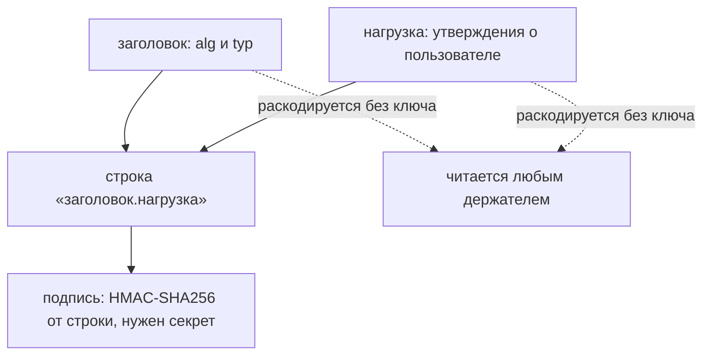
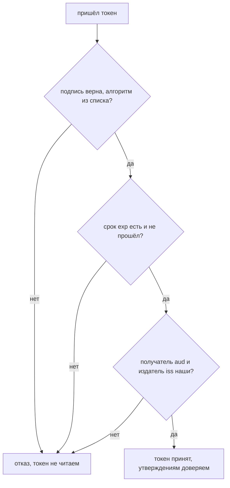

# JWT: структура, подпись, алгоритмы

Вы вошли в кабинет магазина и открыли отладчик браузера. Среди запросов лежит
строка, которую сервер выдал после входа: браузер теперь прикладывает её к
каждому запросу кабинета. Вот она, из лабы этой темы — переносы строк наши,
токен один:

```text
eyJhbGciOiJIUzI1NiIsInR5cCI6IkpXVCJ9.eyJzdWIiOiJhZG1pbmlzdHJhdG9yIiwicm9sZSI
6ImFkbWluIiwiZW1haWwiOiJhZG1pbkBzaG9wLmV4YW1wbGUiLCJkaXNjb3VudF9jb2RlIjoiUFJ
PTU8tMDAwMS1JTlRFUk5BTCIsImlhdCI6MTc1NjAwMDAwMCwiZXhwIjoxNzU2MDAzNjAwfQ.-8eh
y2Mojlbhl52oz3Qe-Vt6NM__nJmyvuJRKDjZhiI
```

Глаз читает здесь шифртекст: набор букв и цифр без смысла. Возьмите вторую
часть между точками и раскодируйте её из base64url. Ключа для этого не нужно,
потому что base64url — кодирование, а не шифрование; тема `sessions-vs-tokens`
уже показывала это на частях токена. Получается осмысленный текст:

```text
{"sub":"administrator","role":"admin","email":"admin@shop.example",
 "discount_code":"PROMO-0001-INTERNAL","iat":1756000000,...}
```

Почта администратора и внутренний скидочный код читаются любым, кто держал
токен: журналом прокси, историей браузера, расширением. Подпись в третьей части
этому не мешает, потому что отвечает она на другой вопрос. Эта строка и есть
JSON Web Token (JWT) — самый частый формат самодостаточного токена. Тема
строится вокруг одной мысли: подпись защищает от изменения, но не прячет
содержимое.

## Подумай, прежде чем читать

1. Сервер выдал вошедшему пользователю подписанный JWT с полем `role`. Может ли
   пользователь прочитать своё поле `role`, не зная ключа подписи?
2. Внутрь токена положили идентификатор договора, который пользователь видеть
   не должен. Скроет ли его подпись от того, кто держит токен в руках?
3. Подпись токена проверена, и она верна. Достаточно ли этого, чтобы принять
   токен?

## Зачем токену утверждения внутри

**Откуда это взялось.** Сессию долго держали ссылочным значением: клиент носил
бессмысленный идентификатор, а всё о пользователе лежало на сервере; обе модели
разбирает тема `sessions-vs-tokens`. У ссылочной модели есть цена: каждый узел,
принявший запрос, обязан спросить о сессии у общего хранилища. Когда приложения
разъехались на много узлов, хранилище стало узким местом. Так появился
самодостаточный токен: он несёт утверждения о пользователе прямо в себе, а
подпись защищает их от подмены, и серверу хранить ничего не нужно. JWT — самый
распространённый формат такого токена. Отказ от хранилища обошёлся ценой, о
которой забывают: раз данные едут в самом токене, они и читаются из самого
токена.

## Как это работает

### Три части и точки между ними

JWT — это три части, разделённые точками, и каждая закодирована в base64url.
Стандарт формата — RFC 7519 — показывает разбор на примере. Разберём тот самый
токен из начала темы. Его выдаёт лаба: команда ниже воспроизводит его байт в
байт и раскодирует первые две части, ключ при этом не нужен. Момент выдачи
зафиксирован параметром `now`, чтобы ваш вывод совпал с печатным дословно.

```bash
cd pilot/lab/jwt-basics
../../../.venv-tools/bin/python - <<'EOF'
import base64, code, json
t = code.issue("administrator", now=1756000000)
parts = t.split(".")
print("частей в токене:", len(parts))
print("длина токена:", len(t), "символов")
for n, part in enumerate(parts[:2], 1):
    raw = base64.urlsafe_b64decode(part + "=" * (-len(part) % 4))
    print(f"часть {n} (base64url -> JSON, ключ не нужен):")
    print(json.dumps(json.loads(raw), indent=1))
sig = base64.urlsafe_b64decode(parts[2] + "=" * (-len(parts[2]) % 4))
print("часть 3, подпись:", len(sig), "байта двоичных данных")
EOF
```

```text
частей в токене: 3
длина токена: 267 символов
часть 1 (base64url -> JSON, ключ не нужен):
{
 "alg": "HS256",
 "typ": "JWT"
}
часть 2 (base64url -> JSON, ключ не нужен):
{
 "sub": "administrator",
 "role": "admin",
 "email": "admin@shop.example",
 "discount_code": "PROMO-0001-INTERNAL",
 "iat": 1756000000,
 "exp": 1756003600
}
часть 3, подпись: 32 байта двоичных данных
```

Первая часть — заголовок. В стандартах его зовут заголовком JOSE, от JSON
Object Signing and Encryption: так называется семейство стандартов о том, как
подписывать и шифровать документы JSON. Заголовок несёт метаданные о самом
токене, как сопроводительная надпись на конверте: не содержимое, а пометка,
чем пакет запечатан. Обязательное поле здесь одно — `alg`, алгоритм подписи.
Второе частое поле — `typ`, тип; для обычного JWT его значение — `JWT`.

Вторая часть — нагрузка, набор утверждений. Утверждение (claim) — это одно
поле объекта JSON о пользователе или о самом токене: «токен про пользователя
wiener», «выдан магазином», «годен ещё час». Бытовой аналог — анкета на
ресепшене: каждая графа отвечает на один вопрос, и вся анкета лежит открыто.
RFC 7519 регистрирует несколько стандартных имён таких граф; все они по
стандарту необязательны, но приложение вправе требовать любые из них.

| claim | смысл | что проверяет приложение |
|---|---|---|
| `iss` | издатель токена | что токен выдан доверенной стороной |
| `sub` | субъект: о ком токен | по нему находят пользователя на сервере |
| `aud` | получатель токена | что токен предъявлен именно этой стороне |
| `exp` | время истечения | что срок ещё не прошёл |
| `nbf` | не действует раньше | что время начала уже наступило |
| `iat` | время выдачи | возраст токена, отсчёт для политик |
| `jti` | идентификатор токена | однократность, вход в список отзыва |

Cheat sheet OWASP добавляет к таблице предупреждение. Поля `iss`, `aud` и `sub`
участвуют в решении о доверии, и их нельзя принимать на веру от непроверенного
токена: сначала подпись, потом смысл утверждений. Иначе приложение поверит
словам того, кто напечатал токен сам.

Третья часть — подпись. Её считают по строке «заголовок.нагрузка», то есть по
первым двум частям в их закодированном виде. Устройство такой подписи на общем
секрете разбирает тема `hmac-vs-signature`. Проверка на том же токене это
подтверждает: HMAC-SHA256 от строки «заголовок.нагрузка» с секретом лабы
совпадает с третьей частью байт в байт.



**Описание схемы.** Схема читается сверху вниз. Заголовок и нагрузка сходятся в
одну строку, и от неё секретом считается подпись. Пунктирные стрелки показывают
другое свойство тех же двух частей: каждая раскодируется из base64url без
ключа, поэтому их читает любой, кто держал токен.

Из схемы видно, что у токена два разных свойства живут рядом. Читаемость —
свойство кодирования, и отменить её подписью нельзя. Защита от подмены —
свойство подписи, и читаемости она не мешает. Дальше это различие встречается
в каждом разделе.

### Подпись не прячет содержимое

Ключевая мысль темы читается прямо из разбора выше. Заголовок и нагрузка
раскодированы без всякого ключа, значит, содержимое токена открыто любому, кто
его держит. Подпись меняет ровно одно: изменить заголовок или нагрузку и
остаться незамеченным нельзя. Стенд меняет в нагрузке роль на `admin`, подпись
оставляет прежней и предъявляет токен проверке:

```text
роль в нагрузке подменена на admin, подпись не тронута
  проверка подписи: отклонён (InvalidSignatureError)
  нагрузка подделки читается без ключа: admin
```

Две строки вместе и есть тема. Подмену видно — целостность защищена. Но
подделанная нагрузка всё равно читается без ключа — конфиденциальности нет.
Подписанный JWT похож на письмо в прозрачном конверте с сургучной печатью:
текст виден всем, а сорвать печать незаметно не выйдет. Аналогия перестаёт
работать на прочности: сургуч подделывают в мастерской, а подпись без секрета
не пересчитать ни на каком железе.

RFC 7519 говорит о том же с другой стороны (§ 11.1). Содержимому токена нельзя
доверять в решении, пока оно не проверено криптографически и не привязано к
нужному контексту. Проверено — значит подпись сверена ожидаемым алгоритмом и
ключом. Привязано — значит срок, получатель и издатель сверены с ожиданиями
приложения.

### Подписанный и зашифрованный: JWS и JWE

Стандарт JWT сам по себе описывает только формат утверждений. Как именно их
защитить, задают два соседних стандарта. JSON Web Signature (JWS) описывает
подписанный токен: содержимое открыто, подпись подтверждает целостность. JSON
Web Encryption (JWE) описывает зашифрованный: содержимое закрыто, и без ключа
его не прочитать. Если продолжить аналогию, JWE — это уже непрозрачный конверт.

На практике словом «JWT» почти всегда называют именно JWS, подписанный токен.
Всё, о чём идёт речь в этой теме и в теме атак, — про JWS. Если содержимое
действительно нужно скрыть от предъявителя, применяют JWE или, чаще, не кладут
секрет в токен вовсе. Вывод один: секрету в токене не место.

Стандарт допускает и третий случай — токен без подписи вовсе. RFC 7519 называет
его незащищённым (unsecured) JWT: поле `alg` равно `none`, а третья часть —
пустая строка; тема `sessions-vs-tokens` уже показывала этот случай. Такой
токен применим лишь там, где содержимое защищено чем-то другим, например
подписью на внешней структуре. Запомните сам факт: токен имеет право заявить о
себе «я не подписан». Что делает с этим заявлением неаккуратный проверяющий,
разбирает тема `jwt-attacks`.

### Чем подписывают: поле alg

Поле `alg` называет, чем подписан токен, и делит алгоритмы на два семейства.
Сами семейства уже знакомы по теме `hmac-vs-signature`, поэтому здесь они
показаны только применительно к токенам.

Первое семейство — код аутентификации сообщения (MAC) на общем секрете. Одним и
тем же секретом издатель подписывает, а получатель проверяет. Сюда входят
`HS256`, `HS384` и `HS512` — это HMAC поверх хешей семейства SHA-2, и цифра в
имени — длина хеша. Секрет здесь — то же, что пароль, только машинный: его
нельзя ни угадать, ни подобрать.

Cheat sheet OWASP задаёт ему две планки: длина не короче выхода хеша —
для `HS256` это 256 бит — и энтропия не ниже 160 бит. Планки разные,
потому что меряют разное: длина — размер строки ключа, а энтропия —
случайность в ней. Длинный, но предсказуемый ключ, например любимая фраза
из песни, первую планку проходит, а вторую нет.

Второе семейство — цифровая подпись на паре ключей. Издатель подписывает
закрытым ключом, получатель проверяет открытым, и открытый ключ не секрет: его
можно публиковать. Сюда входят `RS256`, `ES256`, `PS256` и `EdDSA`. Cheat sheet
рекомендует `EdDSA`, `ES256` и `PS256`, а `RS256` помечает как не
рекомендованный.

Разница семейств — не деталь. На ней держится целая атака: если проверяющий
сам выбирает алгоритм по заголовку токена, открытый ключ можно подсунуть на
место секрета MAC. Разбирает это тема `jwt-attacks`, а здесь важно запомнить
другое. Поле `alg` управляет проверкой, а значение его приходит из токена, то
есть от предъявителя.

### Что проверяется, кроме подписи

Проверенная подпись означает «этот токен выдали мы и его не меняли». Она не
означает «токен ещё годен» и не означает «токен выдан для нас». За это отвечают
отдельные проверки утверждений, и часть из них по умолчанию молчит. Прогон на
PyJWT 2.13.0 перебирает варианты на верной подписи:

```text
А. срок жизни, ожидаемое не объявлено:
  exp час назад                          откл. (ExpiredSignatureError)
  claims exp нет вовсе                          ПРИНЯТ
Б. получатель (aud):
  aud='other', audience='api.shop'       откл. (InvalidAudienceError)
  aud='other', audience не объявлен      откл. (InvalidAudienceError)
  aud='other', verify_aud=False                 ПРИНЯТ
  aud нет, audience не объявлен                 ПРИНЯТ
В. издатель (iss):
  iss='evil.test', issuer='auth.shop'          отклонён (InvalidIssuerError)
  iss='evil.test', issuer не объявлен           ПРИНЯТ
```

Читается это так. Срок `exp` библиотека проверяет сама, но только если поле в
токене есть: токен без `exp` она пропустит, пока приложение явно не потребует
это поле. Получателя `aud` она стережёт строже. Токен, который несёт `aud`,
при необъявленном ожидаемом значении отклоняется. Принять его можно, лишь явно
отключив сверку (`verify_aud=False`); зато токен без `aud` проходит.
Издателя `iss` она сверяет лишь тогда, когда приложение назвало ожидаемое
значение: не назвало — сверять не с чем, и чужой издатель проходит. Отсюда
правило: проверка токена — это подпись, ожидаемый алгоритм, срок и, для
многосторонних систем, получатель и издатель.



**Описание схемы.** Схема читается сверху вниз и показывает проверку входящего
токена тремя воротами. Любой ответ «нет» ведёт в отказ: токен отклоняется
целиком, а не частично. Только три ответа «да» приводят к принятию, и лишь
после этого утверждениям из нагрузки доверяют.

Схема объясняет, почему прогон выше устроен именно так. Каждая строка прогона —
это одни ворота при прочих открытых. Умолчания библиотеки видны по строкам
«ПРИНЯТ»: ворота срока и издателя стоят открытыми, пока приложение не сказало
обратного.

RFC 7519 задаёт порядок проверки списком из десяти шагов (§ 7.2) и требует
одного: если любой шаг не прошёл, токен отклоняется целиком. Библиотеки
исполняют эти шаги за приложение, но решают за него не всё. Какие утверждения
обязательны и с какими значениями их сверять, задаёт протокол приложения, а не
библиотека. Именно этот выбор чаще всего оставляют на умолчании.

**Зачем это в работе AppSec-инженера.** Любой механизм на JWT получает на ревью
два быстрых вопроса: что лежит в нагрузке выданного токена и чем именно
проверяется подпись на входе. Оба вопроса закрываются чтением двух-трёх строк
кода. Где эти строки искать, показывает раздел «Как это выглядит в коде».

## Как это атакуют

Стенд — лаба этой темы, `pilot/lab/jwt-basics`. Кабинет магазина держит сессию
на JWT: при входе выдаёт токен, на каждом запросе читает из него роль и
внутренние поля. Подпись HS256 проверяется честно, и подделать роль нельзя.
Но в нагрузку положено то, чему там не место: адрес почты и внутренний
скидочный код. Прогон эксплойта (вывод сокращён: опущены строка цели и итог,
а у опыта 3 убран хвост «проверкой подписи», не влезший в колонку):

```text
$ python hack.py
  опыт 1 — discount_code из нагрузки без ключа: ПОЛУЧЕН PROMO-8842-INTERNAL
  опыт 2 — email из нагрузки без ключа: ПОЛУЧЕН wiener@shop.example
  опыт 3 — контроль, подмена role=admin с той же подписью: отвергнута
  опыт 4 — контроль, честный вход wiener: роль user
```

Опыт 1 берёт свой законный токен, отрезает вторую часть и раскодирует её из
base64url. Ключа для этого не нужно — в этом и состоит весь приём. В нагрузке
лежит внутренний скидочный код, и он утёк к тому, кто его в глаза видеть не
должен.

Опыт 2 тем же приёмом достаёт адрес почты. Персональные данные в нагрузке —
такая же утечка, как секрет: адрес привязан к человеку, а читается любым
держателем токена.

Опыт 3 — контроль на целостность. Атакующий меняет роль на `admin`, кодирует
новую нагрузку обратно и оставляет старую подпись. Проверка подписи это
отвергает: подмену видно. Целостность работает, конфиденциальности нет, и это
не одно и то же.

Опыт 4 — контроль на живучесть. Честный вход обязан работать и после починки,
иначе защита сломала само приложение.

Тяжесть утечки решает не факт чтения, а то, что именно прочитано. Внутренний
скидочный код — это доступ к чужой цене; адрес и телефон — персональные данные,
попавшие к любому, кто держал токен. Токен часто оседает в журналах прокси, в
истории браузера, в отчётах об ошибках: всё это места, где нагрузку прочтут уже
без всякого участия пользователя. Один и тот же токен утекает не однажды и не в
одни руки.

Четыре опыта вместе выводят правило темы: подпись закрывает подмену и не
закрывает чтение. Остаётся вопрос, на который стенд не отвечает: защитит ли
нагрузку от чтения передача токена только по шифрованному каналу? Ответ — в
разделе «Как защититься».

## Как это выглядит в коде

Ревьюер смотрит на два места: что кладётся в нагрузку при выдаче и чем
проверяется токен на входе. Первое место — здесь. До чтения разбора отметьте
сами, какие поля в этом вызове лишние.

```python
# ФРАГМЕНТ — срез, самостоятельно не компилируется
# УЯЗВИМО — демонстрация, не для продакшена
return jwt.encode({
    "sub": username,
    "role": profile["role"],
    "email": profile["email"],               # конфиденциально: PII
    "discount_code": profile["discount_code"],  # внутреннее
    "iat": issued,
    "exp": issued + 3600,
}, _SECRET, algorithm="HS256")
```

Признак дефекта — поле в нагрузке, значение которого предъявитель не должен
видеть: адрес, телефон, внутренний код, секрет, номер карты. Адрес и телефон —
это персональные данные, по-английски PII (personally identifiable
information): по ним узнаётся конкретный человек, и комментарий в листинге
выше про это. Подпись здесь ни при чём: она защитит эти поля от подмены, но не
от чтения.

**Тот же дефект на другом стеке.** В Node он выглядит так же, меняется только
имя вызова:

```javascript
// УЯЗВИМО — демонстрация, не для продакшена
const token = jwt.sign(
  { sub: username, role: profile.role, ssn: profile.ssn },
  SECRET, { algorithm: "HS256", expiresIn: "1h" }
);
```

Инвариант здесь — «конфиденциальное поле в нагрузке подписанного токена».
Декорация — язык и имя функции: `encode` на одном стеке, `sign` на другом.

**Второе место — проверка на входе.** Дефект тут — доверие содержимому без
проверки подписи или с ослабленной проверкой:

```python
# УЯЗВИМО — подпись не проверяется вовсе
claims = jwt.decode(token, options={"verify_signature": False})
if claims["role"] == "admin":
    ...
```

Назовите про себя, что ещё снимает такой вызов, кроме проверки подписи, и
сверьтесь с прогоном умолчаний из раздела «Что проверяется, кроме подписи».
Отключение подписи снимает и сверку срока: просроченный токен при
`verify_signature=False` проходит. Такой вызов законен ровно в одном случае — прочитать заведомо
ненадёжный токен, чтобы показать сообщение, а не принять решение о правах.

Найти оба места помогает один приём. Выпишите каждый вызов, который выдаёт
токен, и каждый, который его принимает. У первых смотрите состав нагрузки, у
вторых — набор проверок. Двух списков обычно хватает: механизм на JWT в
приложении один, и оба вызова стоят рядом с ним.

**Где ревьюер ошибается.** Чтение нагрузки без ключа — не всегда дефект.
Публичные, неконфиденциальные поля (`sub`, `role`, `exp`) в нагрузке — норма:
именно для них токен и нужен. Дефект начинается там, где значение поля
закрытое. И обратная ошибка: наличие подписи ещё не значит, что её проверяют.
Проверку надо увидеть на входе, а не предположить по формату токена.

## Как защититься

Защита начинается с правила выдачи: в нагрузку идёт только то, что предъявителю
и так известно и что нужно для проверки. Всё конфиденциальное держат на сервере
и достают по проверенному `sub`.

```python
# ФРАГМЕНТ — срез, самостоятельно не компилируется
# Исправлено: в нагрузке только несекретные утверждения.
return jwt.encode({
    "sub": username,
    "role": profile["role"],
    "iat": issued,
    "exp": issued + 3600,
}, _SECRET, algorithm="HS256")
```

Почта и скидочный код теперь берутся из серверного профиля по `sub`, а сам `sub`
читается из токена только после проверки подписи. ASVS подходит с той же
стороны. Требование v5.0-14.1.1 велит выявить и классифицировать все
чувствительные данные приложения. Оно прямо напоминает, что чувствительны и
данные, которые «только закодированы»: строки Base64 и открытая нагрузка JWT
названы в нём как пример.

Второе правило — правило проверки: назвать ожидаемый алгоритм и ожидаемые
утверждения.

```python
# Исправлено: алгоритм закрыт списком, срок и получатель сверяются.
claims = jwt.decode(
    token, _SECRET,
    algorithms=["HS256"],          # список закрыт: не из заголовка токена
    audience="api.shop.example",   # требует, что токен выдан именно нам
    options={"require": ["exp"]},  # иначе токен без срока живёт вечно
)
```

Каждая строка здесь закрывает дыру из прогона умолчаний. Список `algorithms`
не даёт токену диктовать алгоритм проверки. Параметр `audience` требует, чтобы
токен был выписан именно этой стороне. Требование `exp` не пускает токен без
срока, который умолчание пропускало.

**Где это не работает.** Если содержимое действительно нужно скрыть от
предъявителя, одной подписи мало по определению: нужен зашифрованный токен
(JWE) или отказ от передачи данных в токене вовсе. Список утверждений для
проверки задаёт протокол приложения, а не библиотека: где участвует одна
сторона, `aud` и `iss` избыточны, где несколько — обязательны. И
шифрованный канал не отменяет правила выдачи: TLS прячет токен от сети по
дороге, но не от самого предъявителя и не от журналов на концах. Это и есть
ответ на вопрос из раздела про атаку.

**Что добавляется поверх.** Секрет подписи HS256 обязан быть случайным и
длинным. Обе планки задаёт cheat sheet: ключ не короче выхода хеша —
256 бит для `HS256` — и энтропия не ниже 160 бит. Пароль секретом быть
не может: он короткий и
предсказуемый, поэтому секрет генерируют, а не придумывают. Устройство отзыва
и сроков — тема `token-lifetime-revocation`. Отдельный вопрос — где хранить сам
токен на клиенте: место хранения решает, кто до него дотянется, и разбирается
он в теме `sessions-vs-tokens`.

## Как убедиться, что защита работает

Ретест повторяет опыты эксплойта против исправленного модуля и добавляет то,
что обязано работать. Вывод ниже сокращён так же: опущены строка цели и итог,
у опыта 3 убран хвост.

```text
$ LAB_TARGET=solution.py python hack.py
  опыт 1 — discount_code из нагрузки без ключа: нет в токене
  опыт 2 — email из нагрузки без ключа: нет в токене
  опыт 3 — контроль, подмена role=admin с той же подписью: отвергнута
  опыт 4 — контроль, честный вход wiener: роль user
```

Два поля исчезли из нагрузки, целостность как проверялась, так и проверяется,
вход работает. Функциональность закрывается тестами: в лабе их пять — вход
пользователя и администратора, отказ на мусоре, доступность скидки и почты
через сервер. Все пять зелёные и на уязвимом коде, и на решении: тема правит
не поведение кабинета, а состав нагрузки.

На ревью пройдите по списку.

1. Проверьте, что в нагрузке выданного токена нет секретов, персональных данных
   и внутренних кодов (ASVS v5.0-14.1.1).
2. Проверьте, что подпись каждого входящего токена проверяется, а не только
   декодируется.
3. Проверьте, что ожидаемый алгоритм задан списком на стороне проверки, а не
   берётся из заголовка токена.
4. Проверьте, что срок `exp` присутствует и требуется при проверке, иначе токен
   живёт бессрочно.
5. Проверьте, что получатель `aud` и издатель `iss` сверяются, когда токен
   ходит между несколькими сторонами.
6. Проверьте, что секрет HS256 случаен, не короче размера выхода алгоритма и не
   задан паролем.
7. Проверьте, что отключение проверки подписи применяется только для чтения
   заведомо ненадёжного токена, а не для решения о правах.

## Как это находят инструменты

Правило написано на выдачу: конфиденциальное имя поля — `email`, `ssn`,
`api_key` — в нагрузке `jwt.encode`. Правило целиком лежит в
`pilot/semgrep/jwt-confidential-claim.yaml`, и оно сверено прогоном: на
уязвимом файле лабы одна находка, на решении ноль, на пяти размеченных
тест-кейсах расхождений нет.

**Чего это правило не ищет.** Оно судит о конфиденциальности по имени поля.
Поле `internal_tier` или `contract_ref` оно пропустит: имя ему ничего не
говорит. Обратная сторона — ложные срабатывания: поле с именем `address`,
хранящее почтовый индекс города доставки, а не домашний адрес, оно пометит зря.

**Что правило пропустит.** Нагрузку, собранную по частям в переменную и потом
переданную в `encode`: правило смотрит на литерал в самом вызове. И вторую
половину темы — доверие токену без проверки подписи — оно не ловит: `decode` с
отключённой проверкой выглядит как обычный вызов.

**Что здесь сильнее автоматики.** Список полей нагрузки достаётся из одного
места выдачи токена и читается глазами за минуту; решение, какое поле
закрытое, — тоже человеческое. Правило годится как сеть на известные имена,
а не как ответ.

## Частая ошибка

Часто слышно: раз токен подписан, данные в нём защищены, и класть туда можно
что угодно. Подпись же криптографическая. Ответьте до чтения опровержения:
поле `discount_code` в подписанном токене защищено от чтения посторонним или
только от подмены?

**Подпись подтверждает целостность, а не скрывает содержимое.** Это разные
операции, и путать их дорого. Нагрузка подписанного токена — открытый текст в
base64url: её читает любой предъявитель без ключа. Стенд достаёт из неё
скидочный код и почту, не зная секрета. Подпись при этом честная: подменить
поле нельзя, но прочитать можно всё.

Заблуждение держится на виде токена. Строка base64url выглядит как шифртекст —
набор букв без смысла, — и глаз принимает непонятное за закрытое. Но непонятное
человеку не значит закрытое для машины: одна операция декодирования возвращает
исходный JSON. Проверьте это руками хоть раз, чтобы вид токена перестал
обманывать.

Контрпример из прогона — опыт 3 против опытов 1 и 2. В опыте 3 подмена роли
отвергнута: целостность работает. В опытах 1 и 2 те же данные утекают:
скрытности нет. Один токен, одна подпись — и оба исхода сразу.

## Попробуй сам

Лаба `lab-jwt-basics`, каталог `pilot/lab/jwt-basics`. Формат «почини»:
правится `code.py`, пока `hack.py` и `tests.py` не станут зелёными
одновременно. Всё локально: сети нет, база профилей — словарь в модуле.

```bash
cd pilot/lab/jwt-basics
../../../.venv-tools/bin/python hack.py    # против code.py: сработает
../../../.venv-tools/bin/python tests.py   # функциональность: упало 0
```

**Цель одной фразой:** добиться, чтобы `hack.py` вышел с кодом 0, а `tests.py`
продолжил выходить с кодом 0.

Подсказка одна: дефект не в проверке подписи (она честная), а в том, что в
нагрузку положено то, что читается без ключа. Оставьте в токене `sub`, `role`,
`iat`, `exp`; почту и скидку доставайте по проверенному `sub` с сервера.
Образец починки лежит в `solution.py` и открывается после своей попытки.

Сверка решения идёт тем же эксплойтом против образца:
`LAB_TARGET=solution.py ../../../.venv-tools/bin/python hack.py` — оба поля
отвечают «нет в токене», а контрольные опыты остаются на месте.

**Критерий выполнения.** Против вашего `code.py` эксплойт `hack.py` выходит с
кодом 0, а все пять тестов `tests.py` остаются зелёными: вход работает, скидка
и почта по-прежнему доступны через сервер.

## Проверь себя

1. Мобильное приложение выдаёт токен так:

   ```python
   # ФРАГМЕНТ — срез, самостоятельно не компилируется
   return jwt.encode({
       "sub": user.id,
       "role": user.role,
       "password_hint": user.password_hint,
       "api_secret": user.api_secret,
       "exp": issued + 3600,
   }, _SECRET, algorithm="HS256")
   ```

   Подпись честная, срок есть. Какие два поля здесь лишние и почему подпись их
   не защищает?

2. Выдача токена кладёт в нагрузку почту и внутренний код:

   ```python
   # ФРАГМЕНТ — срез, самостоятельно не компилируется
   return jwt.encode({
       "sub": username,
       "role": profile["role"],
       "email": profile["email"],
       "discount_code": profile["discount_code"],
       "iat": issued,
       "exp": issued + 3600,
   }, _SECRET, algorithm="HS256")
   ```

   Какую починку вы выберете?

   A. Ничего не менять: нагрузка закодирована в base64url и без ключа не
      читается.

   B. Убрать из нагрузки `email` и `discount_code` и доставать их на сервере
      по проверенному `sub`.

   C. Перейти с HS256 на HS512: более длинная подпись закроет и чтение.

3. Проверка подписи прошла успешно. Почему этого недостаточно, чтобы принять
   токен?

4. Пользователь держит свой токен и ключа подписи не знает. Предскажите, что
   напечатает этот фрагмент: может ли пользователь прочитать своё поле `role`?

   ```python
   import base64
   token = ("eyJhbGciOiJIUzI1NiIsInR5cCI6IkpXVCJ9."
            "eyJzdWIiOiJhZG1pbmlzdHJhdG9yIiwicm9sZSI6ImFkbWluIn0."
            "-8ehy2Mojlbhl52oz3Qe-Vt6NM__nJmyvuJRKDjZhiI")
   parts = token.split(".")
   print("частей:", len(parts))
   payload = parts[1] + "=" * (-len(parts[1]) % 4)
   print(base64.urlsafe_b64decode(payload).decode())
   ```

5. Возврат к теме `sessions-vs-tokens`: чем самодостаточный токен отличается
   от ссылочного и какой ценой даётся отказ от серверного хранилища?
6. Возврат к теме `hmac-vs-signature`: почему секрет HS256 нельзя задавать
   паролем?

<details markdown="1">
<summary>Ответ 1</summary>

1. Лишние `password_hint` и `api_secret`: нагрузка подписанного токена —
   открытый текст в base64url, её читает любой предъявитель без ключа. Подпись
   защитит эти поля от подмены и не скроет от чтения — это разные операции.
   Оба значения обязаны жить на сервере и доставаться по проверенному `sub`.

</details>

<details markdown="1">
<summary>Ответ 2: разбор вариантов</summary>

2. Верный ответ — B.

   A. base64url — кодирование, а не шифрование: одна операция декодирования
      возвращает исходный JSON любому, кто держал токен, — журналу прокси,
      истории браузера, расширению. Непонятное глазу не значит закрытое для
      машины.

   B. Конфиденциальное уходит из токена туда, где его нельзя предъявить, — в
      серверный профиль. Ретест лабы это и показывает: `LAB_TARGET=solution.py
      python hack.py` в `pilot/lab/jwt-basics` отвечает «нет в токене» на оба
      поля, а пять тестов функциональности остаются зелёными.

   C. HS512 меняет длину подписи и ничего больше: чтению нагрузки не мешает
      ни одна подпись. Путать целостность с конфиденциальностью здесь — значит
      оставить утечку на месте.

</details>

<details markdown="1">
<summary>Ответ 3</summary>

3. Подпись говорит «выдали мы и не меняли», но не «токен ещё годен» и не
   «выдан для нас». Срок, получателя и издателя проверяют отдельно. Умолчания
   при этом слабые: токен без `exp` проходит, пока поле не затребовано; токен
   без `aud` проходит; чужой `iss` проходит, пока ожидаемое не объявлено.

</details>

<details markdown="1">
<summary>Ответ 4</summary>

4. `частей: 3`, затем `{"sub":"administrator","role":"admin"}`: нагрузка
   раскодирована без ключа, и поле `role` прочитано. Прочитать может, а
   подменить нельзя: изменённая нагрузка не сойдётся с подписью. Поэтому же
   внутренний идентификатор договора подпись от предъявителя не скрывает.

</details>

<details markdown="1">
<summary>Ответ 5</summary>

5. Самодостаточный токен несёт утверждения в себе, и сервер о сессии ничего не
   хранит. Цена — отзыв: до истечения срока нужен список завершённых токенов,
   отказ от старых или ротация ключа.

</details>

<details markdown="1">
<summary>Ответ 6</summary>

6. Секрет HS256 — вход HMAC, и его планки жёстко задаёт cheat sheet:
   не короче выхода хеша (256 бит) и энтропия не ниже 160 бит.
   Пароль таких требований не держит — он короткий и предсказуемый,
   поэтому секрет генерируют, а не придумывают.

</details>

## Источники

1. RFC 7519 «JSON Web Token (JWT)»; реестр `rfc7519-jwt`. Разделы: § 3 JWT
   Overview, § 4.1 Registered Claim Names, § 5 JOSE Header, § 6 Unsecured JWTs,
   § 7.2 Validating a JWT, § 11.1 Trust Decisions.
   <https://www.rfc-editor.org/rfc/rfc7519.html>
2. OWASP JSON Web Token Cheat Sheet; реестр `owasp-cs-jwt`. Разделы: Token
   Structure, Considerations about using JWTs, Public-key Signatures vs. MAC,
   Header fields, Claims.
   <https://cheatsheetseries.owasp.org/cheatsheets/JSON_Web_Token_Cheat_Sheet.html>
3. RFC 8725 «JSON Web Token Best Current Practices»; реестр `rfc8725-jwt-bcp`.
   Разделы: § 3.1 Perform Algorithm Verification, § 3.2 Use Appropriate
   Algorithms, § 3.5 Ensure Cryptographic Keys Have Sufficient Entropy.
   <https://www.rfc-editor.org/rfc/rfc8725.html>

Каркас этапа: `owasp-asvs-5-document` (ASVS v5.0.0), `owasp-wstg-42`,
`owasp-top10-2025`. Наследуются всеми темами и отдельной строкой не
повторяются.

**Скоропортящийся слой.** Список рекомендованных и не рекомендованных
алгоритмов из cheat sheet меняется вместе с криптографической практикой:
`RS256` уже помечен как не рекомендованный, семейство постквантовых подписей
добавлено черновиком. Поведение конкретной библиотеки по умолчанию тоже
привязано к её версии.

**Маркеры уверенности.** Разбор токена, чтение нагрузки без ключа и утечка
полей из лабы — **проверено лично** 2026-08-24 на PyJWT 2.13.0 и Python 3.14.7
(стенд `e01-anatomy.py` и `hack.py` лабы): нагрузка декодируется без ключа;
подмена роли при неизменной подписи отклоняется; правило SAST даёт одну
находку на уязвимом файле и ноль на решении; пять тестов функциональности
зелёные в обоих случаях. Поведение проверки claims по умолчанию — **проверено
лично** 2026-08-30 прямым прогоном `jwt.decode` на тех же PyJWT 2.13.0 и
Python 3.14.7: токен без `exp` проходит, пока поле не затребовано; токен,
несущий `aud`, при необъявленном ожидаемом значении отклоняется с
InvalidAudienceError и принимается лишь при явном `verify_aud=False`; токен
без `aud` проходит; чужой `iss` проходит, пока ожидаемое не объявлено. Состав
частей, зарегистрированные claims, шаги проверки и требование о доверии — **по
документации** (RFC 7519, открыт лично 2026-08-24). Разница JWS и JWE,
семейства алгоритмов и требования к секрету — **по документации** (JSON Web
Token Cheat Sheet и RFC 8725, открыты лично 2026-08-24). Поведение Node-стека
**не воспроизводилось**: листинг показывает форму дефекта, а не прогон.
При переписывании темы 2026-10-03 прогоны повторены на тех же версиях без
сети: вводный токен воспроизведён выдачей лабы `code.issue("administrator",
now=1756000000)` байт в байт (длина 267); разбор анатомии повторён командой
из раздела «Три части и точки между ними»; подмена роли на свежем токене
`wiener` отклонена с InvalidSignatureError; HMAC-SHA256 от строки
«заголовок.нагрузка» с секретом лабы совпал с третьей частью; `hack.py` и
`tests.py` прогнаны против `code.py` и `solution.py`; сверка правила
`jwt-confidential` и таблица умолчаний `jwt.decode` дали те же исходы.
