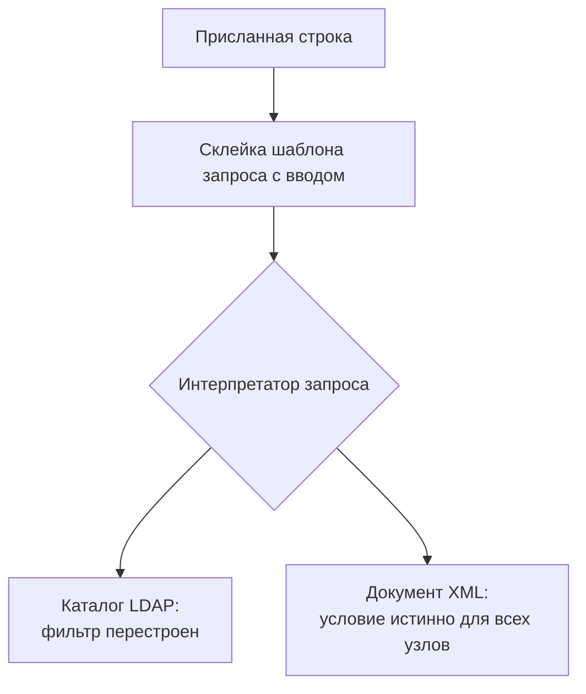

# LDAP- и XPath-инъекции

Приложение небольшого портала хранит учётные записи не в базе данных, а в
XML-документе. Вход в него проверяется запросом
`//user[name='<ввод>' and password='<ввод>']`: документу задают вопрос «есть
ли пользователь с таким именем и таким паролем». Один из посетителей в поле
пароля вводит строку `' or '1'='1`. Условие в запросе становится истинным для
каждой записи, и проверка пускает его под чужим именем.

В соседнем сервисе поиск сотрудника по корпоративному справочнику собран так
же, склейкой строки. Туда вместо фамилии присылают один символ `*`, и сервис
вместо одной карточки выдаёт все записи подряд. Оба приёма — инъекции, та же
болезнь, что разбирает тема `sqli-basics`: присланная строка попала в текст
запроса и поменяла его смысл. Поменялись только собеседник и его язык: не
база данных и SQL, а каталог LDAP и документ XML.

## Два собеседника: каталог и документ

LDAP (Lightweight Directory Access Protocol, облегчённый протокол доступа к
каталогу) — протокол, по которому приложение задаёт вопросы службе каталогов.
Служба каталогов — это хранилище записей в виде дерева, где у каждой записи
есть атрибуты: логин `uid`, почта, тип записи `objectClass`. Бытовой пример
такой службы — корпоративная телефонная книга. Компания заводит в ней по
карточке на сотрудника, а внутренние системы спрашивают у неё, есть ли такой
человек и верен ли его пароль. Так пароль хранится в одном месте, и вход во
все системы идёт через один каталог.

У каждой записи в этом дереве есть точный адрес — различающее имя, сокращённо
DN (distinguished name). Оно выглядит как `uid=ivan,ou=people,dc=example,dc=com`
и работает как почтовый адрес: набор частей однозначно ведёт к одной
карточке. Аналогия ломается в порядке записи. В почтовом адресе части идут от
крупной к мелкой: страна, город, улица, дом. В различающем имени наоборот:
сначала сама карточка, а крупные ветки дерева — в конце. Различающее имя
понадобится ближе к концу темы: у него свои специальные знаки, и на этом
споткнётся защита.

Найти запись приложение просит фильтром — текстовым условием по атрибутам.
Фильтр `(&(uid=ivan)(objectClass=person))` читается так: «дай запись, где
логин `ivan` и тип записи — сотрудник». Знак `&` в начале требует оба условия
разом, а скобки их группируют. У этого языка есть специальные знаки, и именно
на них дальше всё сломается.

Второй собеседник — документ XML. Это текст, где данные размечены тегами и
сложены деревом, как складская опись: коробка, внутри полки, на полках вещи
с подписями. XPath — язык вопросов к такому дереву. Выражение XPath похоже на
путь к файлу, только с условием: `//user[name='ivan']` читается «найди все
узлы `user`, у которых имя — `ivan`». Вход в портал из начала темы задаёт
такой вопрос про имя и пароль сразу.

## Как это работает

**Откуда это взялось.** И каталог, и XML-документ принимают запросы текстом:
у фильтра LDAP своя грамматика, описанная в стандарте RFC 4515, у XPath —
своя. Программисту проще всего собрать такой текст склейкой: взять шаблон
запроса и подставить в него присланное. Пока присланное — обычная фамилия,
всё срабатывает. Но введённая строка оказалась внутри чужого языка, и знаки,
которые для человека — обычные символы, для интерпретатора запроса — команды.
Интерпретатор здесь — та часть каталога или библиотеки, которая читает текст
запроса и исполняет его. Тем же путём склейка ломает SQL в теме `sqli-basics`
и запросы NoSQL в теме `nosql-injection`: форма у языков разная, причина
одна.

В фильтре LDAP специальных знаков пять: звёздочка `*`, скобки `(` и `)`,
обратная косая черта `\` и невидимый символ NUL. Звёздочка означает «любое
значение атрибута», а скобки со знаками `&` и `|` строят логику условия.
Обратная косая начинает служебную запись символа: за ней следуют две
шестнадцатеричные цифры. Символ NUL обрывает строку в реализациях на языке
C, и фильтр срезается раньше конца. Соберём фильтр склейкой, как это делает
уязвимое приложение; пример упрощён, и в продакшен его нести нельзя.

**Уязвимая склейка фильтра (Java, упрощено для примера)**

```java
// УЯЗВИМО — демонстрация, не для продакшена
String filter = "(&(uid=" + ввод + ")(objectClass=person))";
```

При честном логине `ivan` получается фильтр `(&(uid=ivan)(objectClass=person))`.
Присланная звёздочка превращает его в `(&(uid=*)(objectClass=person))` —
«дай всех сотрудников с любым логином». Фильтр при этом остаётся валидным,
меняется только смысл: вместо одной записи каталог отдаёт все.

Дальше атакующий дописывает в фильтр свою часть: руководство по тестированию
WSTG-v42-INPV-06 показывает обход вводом `*))(&(uid=*`. Склейка даёт строку
`(&(uid=*))(&(uid=*)(objectClass=person))`. По грамматике фильтра это уже не
один фильтр: первый, `(&(uid=*))`, закончен, а вторая половина висит хвостом.
Строгий интерпретатор такую строку отвергнет. Приём срабатывает там, где
реализация читает первый фильтр и игнорирует остаток.

Аккуратный вариант той же идеи — ввод `*)(objectClass=*`. Он оставляет строку
одним фильтром: `(&(uid=*)(objectClass=*)(objectClass=person))`, три условия
под знаком `&`, и каждое истинно для любой записи сотрудника. В обоих случаях
присланное перестало быть данными и стало частью программы поиска.

С XPath история повторяется почти дословно. Приложение склеивает условие
входа из ввода, и строка `' or '1'='1` замыкает кавычку раньше срока, а
дальше дописывает в условие «или истина». Это та же тавтология, что и в
SQL-инъекции из темы `sqli-basics`: условие верно для каждого узла, и
совпадение находится всегда. Отличие в масштабе урона. У XPath нет разделения
прав внутри документа: запрос, который нашёл хоть что-то, читает документ
целиком. Поэтому обход входа открывает все записи разом, а не одну строку про
искомого пользователя. Порядок проверки такого дефекта описан в
WSTG-v42-INPV-09.



**Описание схемы.** Схема читается сверху вниз и показывает общий ход обеих
инъекций. Присланная строка сливается с шаблоном запроса, и текст целиком
уходит интерпретатору. Интерпретаторов два: каталог LDAP получает
перестроенный фильтр, а документ XML — условие, которое стало истинным для
всех узлов. Языки разные, а сломано одно место: граница между шаблоном и
данными.

Скажите, не возвращаясь к тексту: чем звёздочка в фильтре LDAP похожа на
строку `' or '1'='1` в XPath и чем различается?

## Как закрыть обход

Починка та же, что в теме `parameterized-queries`: разделить код запроса и
данные, чтобы введённое никогда не сливалось с языком. Для XPath такое
разделение даёт предкомпилированный запрос со связанными переменными. Условие
пишется один раз, с метками вместо значений, а сами значения передаются
отдельно. Интерпретатор разбирает структуру запроса до того, как увидит ввод.
Поэтому строка `' or '1'='1` для него — не часть условия, а значение, с
которым сравнивают. Именно такой способ требует стандарт проверки ASVS,
требование v5.0-1.2.7.

**Исправленный вариант для XPath (псевдокод, упрощён для примера)**

```text
условие = компилировать("//user[name=$имя and password=$пароль]")
условие.связать("имя", ввод_имени)
условие.связать("пароль", ввод_пароля)
```

Метки `$имя` и `$пароль` живут внутри скомпилированного условия, а `связать`
подставляет присланные строки как данные. Кавычки и слово `or` внутри такого
значения для XPath ничего не значат: интерпретатор сравнивает их как текст, и
тавтологии взяться неоткуда.

У LDAP параметров в протоколе нет, и роль разделителя берёт экранирование:
перед склейкой специальные знаки ввода заменяются на безопасную запись.
Тонкость в том, что контекстов два, и наборы специальных знаков у них разные.
Внутри фильтра опасны звёздочка и скобки. Внутри различающего имени, то есть
в адресе записи, опасны другие знаки: запятая, плюс, равно. Поэтому
библиотека OWASP ESAPI даёт две разные функции: `encodeForLDAP` для значения
в фильтре и `encodeForDN` для значения в различающем имени. Стандарт ASVS
требует именно экранирования под контекст, это требование v5.0-1.2.6.

**Исправленный вариант для LDAP (Java, упрощено для примера)**

```java
// Исправленный вариант
String safe = encoder.encodeForLDAP(ввод);
String filter = "(&(uid=" + safe + ")(objectClass=person))";
```

После экранирования звёздочка в значении перестаёт быть командой «любое
значение»: фильтр ищет сотрудника, чей логин буквально равен `*`, и такого в
каталоге нет. Поиск снова точный, а не «дай всех».

Вопрос на перенос. Программист экранировал ввод функцией `encodeForDN`, то
есть по правилам различающего имени, а подставляет результат в фильтр поиска.
Закрыт ли дефект? Нет. Функция обезвредила запятую и плюс, а звёздочку и
скобки оставила как есть: в адресе записи они безобидны. В фильтре те же
знаки — команды, и инъекция проходит. Контекст защиты обязан совпадать с
контекстом, в котором значение окажется.

Поверх разделения ставят второй рубеж — список разрешённых символов ввода.
Например, в логине оставляют только буквы, цифры и дефис, и звёздочка со
скобками отсекаются ещё на границе приложения. Рубеж именно второй, а не
основной: список режет лишнее на входе, но не знает, в какой язык значение
уходит. Гарантию даёт разделение кода и данных, а список лишь отсекает часть
опасных строк ещё до склейки запроса.

**Зачем это в работе AppSec-инженера.** Обе инъекции встречаются реже SQL, но
узнаются той же рамкой: источник, путь, сток, отсутствующий контроль. Признак
в коде один и тот же — склейка строки рядом с вызовом поиска по каталогу или
выборки по XML. Фильтр LDAP ищите при входе через корпоративный каталог, а
запрос XPath — там, где приложение читает конфигурацию или документ XML. В
каталоге слабостей MITRE этим классам присвоены номера CWE-90 и CWE-643.
Находка чинится не чёрным списком символов, а разделением кода и данных. Где
есть параметр, спасает параметр; где его нет — экранирование по правилам
именно этого интерпретатора.

## Источники

1. OWASP LDAP Injection Prevention Cheat Sheet; реестр `owasp-cs-ldap-injection`.
   Разделы: special characters in search filters (RFC 4515) and in DN, Defense
   Option 1 — escaping, Allow-List Input Validation.
   <https://cheatsheetseries.owasp.org/cheatsheets/LDAP_Injection_Prevention_Cheat_Sheet.html>
2. OWASP WSTG-INPV-09 «Testing for XPath Injection», WSTG v4.2; реестр
   `wstg-v42-inpv-09-xpath`. Разделы: Summary, How to Test.
   <https://owasp.org/www-project-web-security-testing-guide/v42/4-Web_Application_Security_Testing/07-Input_Validation_Testing/09-Testing_for_XPath_Injection>

Каркас этапа: `owasp-asvs-5-document` (ASVS v5.0.0), `owasp-wstg-42`,
`owasp-top10-2025`. Наследуются всеми темами и отдельной строкой не
повторяются.

**Скоропортящийся слой.** Имена функций экранирования привязаны к библиотеке:
`encodeForLDAP` и `encodeForDN` в OWASP ESAPI, свои — в других. Страница cheat
sheet — живой документ без даты публикации.

**Маркеры уверенности.** Наборы специальных символов LDAP, приёмы фильтра и
меры защиты — **по документации** (LDAP Injection Prevention Cheat Sheet,
открыт лично 2026-08-24). Обход входа через XPath и способ тестирования —
**по документации** (WSTG-INPV-09, открыт лично 2026-08-24). Строки фильтров
из раздела механики **проверены прогоном** 2026-10-03: конкатенация и разбор
скобок по грамматике фильтра показали, что вводы `*` и `*)(objectClass=*`
дают по одному валидному фильтру, а `*))(&(uid=*` — два фильтра подряд.
Прогон синтаксический, без сервера. Лично **не воспроизводились**: стенда с
каталогом LDAP и с целевым XML-приложением не собиралось, поведение
конкретных интерпретаторов с битым фильтром не проверялось. Требования 1.2.6
и 1.2.7 сверены с текстом ASVS v5.0.0 (открыт лично 2026-08-24).
