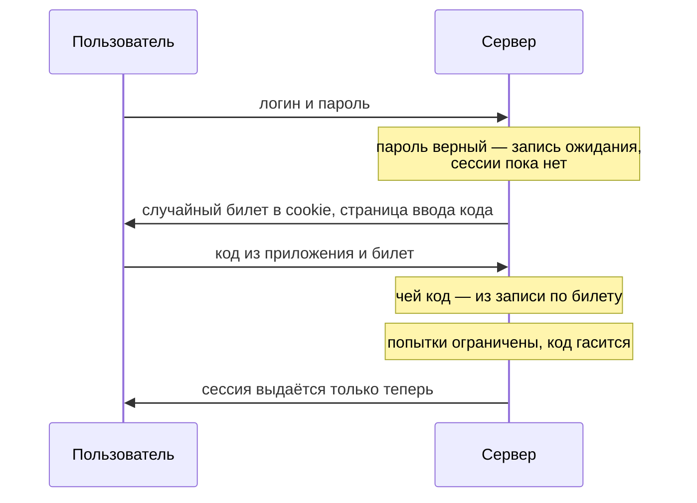
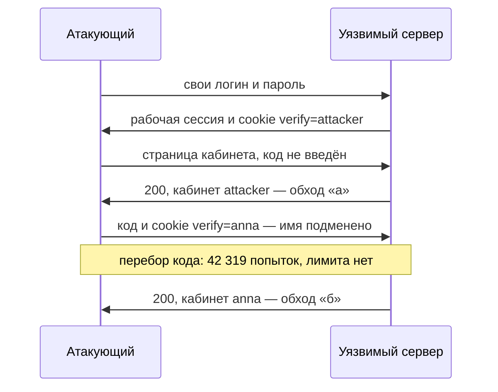

# Обходы MFA

Представьте приложение, у которого вход защищён дважды: сначала пароль,
потом шестизначный код из приложения на телефоне. Код считается исправно
и меняется каждые полминуты, подобрать его наугад не выходит. Вот прогон
атакующего по такому приложению:

```text
а) сразу в кабинет, код не введён:   200 кабинет attacker
б) подмена имени и перебор кода:     42319 попыток, вошли как anna
```

Первой строкой атакующий вошёл в собственный кабинет, вообще не показав
кода: рабочая сессия выдалась сразу после пароля. Второй строкой он
подставил в cookie чужое имя и перебрал чужой шестизначный код за
42 319 попыток, потому что счётчика попыток не было. Сам фактор оба раза
работал безупречно: коды считались верно и вовремя. Сломан был не фактор,
а логика потока вокруг него.

## Что такое второй фактор

Пароль — это то, что пользователь знает. Достаётся он атакующему
по-разному: утёкшая база паролей, поддельная страница входа, перебор —
про перебор и защиту от него рассказывает тема `brute-force-defense`.
Поэтому вход усиливают вторым фактором — тем, что у пользователя есть.
Чаще всего это телефон: код из приложения или из SMS. Проверка входа
двумя разными факторами сразу называется многофакторной аутентификацией,
сокращённо MFA (multi-factor authentication).

Бытовой пример — банкомат. Он требует и карту, которой вы владеете, и
PIN, который вы знаете. Украденный PIN без карты бесполезен, украденная
карта без PIN — тоже. Соответствие такое: карта — это телефон, PIN — это
пароль. Перестаёт аналогия работать на том, как доказывается владение.
Карту банкомат читает сам, а телефон участвует косвенно: владение им
доказывает знание кода, а код с телефона можно переслать. Поэтому
поддельная страница, которая спросит и пароль, и код, обходит второй
фактор честно: владелец сообщает ей оба сам.

### Откуда берётся код

При настройке второго фактора сервер и телефон запоминают общий секрет —
его обычно передают один раз QR-кодом. Дальше приложение каждые тридцать
секунд вычисляет из секрета и текущего времени шесть цифр, а сервер,
зная тот же секрет, считает то же самое и сверяет. Сеть для этого не
нужна: код рождается на телефоне автономно. Такой код называется TOTP
(time-based one-time password, одноразовый пароль от времени): по замыслу
он живёт один временной шаг и принимается один раз. Что бывает, когда
приложение это не проверяет, — в разделе про атаки.

Второй носитель кода — SMS. Здесь код едет через сеть оператора, и это
слабое место: сообщения в сети оператора перехватывают, а номер уводят
подменой SIM. Подмена SIM — это когда атакующий получает у оператора
дубликат SIM-карты жертвы, например по поддельному паспорту в салоне
связи. Связь у жертвы пропадает, а коды приходят атакующему. Шпаргалка
OWASP по многофакторной аутентификации и руководство NIST по цифровой
идентичности называют SMS слабым каналом. А код на почту Академия
PortSwigger, учебный полигон авторов Burp Suite, не считает вторым
фактором вовсе. Доступ к почте держится на том же пароле, то есть один
фактор проверяется дважды.

Есть и сильный носитель — аппаратный ключ по стандарту FIDO, маленькое
устройство вроде флешки. Ключ сам знает, какому сайту он отвечает:
браузер передаёт ему адрес страницы, и на чужом адресе ключ молчит.
Поэтому его называют устойчивым к фишингу: поддельная страница может
спрашивать что угодно, ключ ей не ответит.

Всё перечисленное — свойства самого фактора: слабый канал SMS, сильный
ключ. У второго фактора есть и вторая половина — поток, который его
спрашивает и проверяет. Даже безупречный фактор не спасает, если поток
вокруг него собран неверно. Эта тема — про поток.

## Как это работает

**Откуда это взялось.** Вход со вторым фактором разбивают на два шага:
сначала пароль, потом код. Между шагами приложению нужно помнить, кто
именно проходит проверку, — иначе второй шаг не поймёт, чей код
сверять. Это промежуточное состояние и есть хрупкое место схемы. Хранить
его можно на сервере, в записи под случайным именем, или у клиента, в
cookie. Все четыре дефекта темы — про то, что с этим состоянием и с
порядком шагов пошло не так.

Правильный поток выглядит так:



**Описание схемы.** Схема читается сверху вниз по времени. После верного
пароля сервер создаёт запись ожидания и отдаёт клиенту только случайный
билет — её имя. Код клиент присылает вместе с билетом, и сервер по билету
находит, чей код проверять. Рабочая сессия рождается в последней строке,
после верного кода.

Билет здесь работает как номерок в гардеробе. Сам номерок ничего не
значит и ничего не открывает: пальто выдаёт гардеробщик, сверив номерок
со своей записью. Так же и с билетом: клиент носит с собой только имя
записи, а «кого проверяют» остаётся на сервере. Где аналогия ломается.
Номерок можно сфотографировать и изготовить дубликат: номера в гардеробе
последовательные, угадать чужой несложно. Билет поэтому делают длинным и
случайным — случайность свойство билета, а не номерка. И гардеробщик
выдаёт пальто сразу, по одному номерку, а сервер по билету только находит
запись — код он проверяет отдельно.

### Четыре дефекта потока

Академия PortSwigger и шпаргалка OWASP перечисляют дефекты порознь; здесь
они сведены к четырём признакам.

- **Сессия до второго фактора.** После пароля пользователю выдают рабочую
  сессию, а код спрашивают «сверх». Защищённые страницы смотрят на
  наличие сессии — а она уже есть, и код обходится прямым переходом.
- **Проверяемого выбирает клиент.** Чей код проверять и кому выдавать
  сессию, приложение берёт из cookie или параметра запроса. Атакующий
  проходит первый шаг со своей учётной записью и подменяет имя на чужое.
  Дальше две реализации. Бывает, сервер сверяет код с секретом того, кто
  прошёл первый шаг, а сессию выдаёт подменённому имени. Тогда атакующий
  вводит свой действующий код и входит как жертва: перебор не нужен
  вовсе. Бывает, сверка идёт с секретом жертвы — тогда остаётся перебор,
  как в строке «б» стендового прогона.
- **Нет лимита на код.** Код короткий, четыре-шесть цифр, то есть от
  десяти тысяч до миллиона вариантов. Без счётчика попыток он
  перебирается целиком — это тот же механизм, что лимит на ввод пароля из
  темы `brute-force-defense`, только на коротком секрете.
- **Код принимается повторно.** Один код годится больше одного раза или
  дольше своего шага. Подсмотренный код тогда работает снова, а
  действующий можно подбирать без спешки.

**Зачем это в работе AppSec-инженера.** «У нас есть MFA» звучит как
готовая защита, но защищает поток, а не галочка. Ревьюер проверяет четыре
вещи: когда именно выдаётся сессия, откуда берётся имя проверяемого
пользователя, считаются ли попытки ввода кода и гасится ли код после
применения. Три дефекта из четырёх не требуют знать ни пароль, ни код
жертвы; четвёртому нужен действующий код.

## Как это атакуют

Стенд темы — учебное приложение с двухшаговым входом в двух сборках,
уязвимой и исправленной. Прогон по обеим (сценарий
`.smgr/appsec-stage1-auth/exp/e09-mfa.py`, Python 3.14.7):

```text
=== уязвимое ===
а) сразу в кабинет, код не введён:            200 кабинет attacker
б) подмена имени и перебор кода:              42319 попыток, вошли как anna
=== исправленное ===
а) сразу в кабинет, код не введён:            403 не вошли
б) подмена имени, перебор кода:      остановлено на 6-й попытке (429)
```

Строка «а» — это первый дефект. Уязвимое приложение пустило в кабинет
сразу после пароля, кода не спросив: прямой переход на адрес кабинета
сработал, потому что сессия уже была выдана. Исправленная сборка на тот
же запрос ответила кодом 403, «доступ запрещён»: без пройденного второго
шага сессии нет, и показывать нечего.

Строка «б» соединяет второй и третий дефекты. Имя проверяемого лежало в
cookie, и атакующий подменил его на `anna`: с этого момента сервер сверял
коды с её секретом. Лимита на ввод кода не было, и перебор нашёл её
шестизначный код за 42 319 попыток. У исправленной сборки имя живёт на
сервере в записи ожидания, подменять нечего. А перебор остановлен на
шестой попытке ответом 429, «слишком много запросов», — тот самый
механизм ограничения частоты из темы `brute-force-defense`.

Как эти два обхода выглядят со стороны атакующего:



**Описание схемы.** Первые четыре строки — обход пропуском шага: сессия
выдана после пароля, и кабинет открывается без кода. Последние три —
обход подменой: имя проверяемого приходит из cookie, сервер сверяет коды
уже с чужим секретом, и перебор в конце концов попадает.

Отдельный прогон — про четвёртый дефект, повторное использование кода
(сценарий `.smgr/appsec-stage1-auth/exp/e06-totp.py`). У TOTP есть допуск
на расхождение часов: часы телефона и сервера никогда не идут идеально
вровень, поэтому сервер принимает коды соседних временных шагов. На
стенде с допуском в один шаг код без пометки об использовании принимался
пятьдесят секунд подряд. С допуском в три шага окно приёма выросло до
210 с. За такое окно миллион вариантов шестизначного кода перебирается
примерно при 4 761 попытке в секунду. Стандарт этого кода — RFC 6238.

## Как это выглядит в коде

Ревьюер ищет в коде две вещи: когда выдаётся сессия и откуда берётся имя
проверяемого. Фрагмент читается двумя планами: «найти, где рождается
сессия» и «найти, откуда второй шаг узнаёт, чей код сверять». Сколько из
четырёх дефектов темы видно в этом фрагменте — сосчитайте до разбора.

```python
# УЯЗВИМО — демонстрация, не для продакшена
def login(request):
    user = check_password(request)
    if user:
        session = grant_session(user)            # (1)
        session["mfa"] = False
        set_cookie("verify", user)               # (2)
    return "введите код"

def verify_code(request):
    user = request.cookies["verify"]             # (3)
    if totp(user) == request.form["code"]:       # (4)
        session["mfa"] = True
    return "ок"
```

1. Сессия выдана после пароля, до кода. Страницы, смотрящие на наличие
   сессии, уже открыты.
2. Имя проверяемого положено в cookie — им управляет клиент.
3. Второй шаг берёт имя из этой cookie. Атакующий подменит его на чужое.
4. Попытки ввода кода не считаются: перебор ничем не ограничен.

Полный список признаков такого потока в чужом коде. Рабочая сессия
выдаётся между шагами. Имя или идентификатор проверяемого лежит в cookie,
параметре или скрытом поле. Счётчика попыток на коде нет. Пометки «код
использован» нет. Защищённая страница проверяет факт сессии, а не флаг
пройденного второго фактора.

## Как защититься

Правило собирается из четырёх дефектов одно к одному: промежуточное
состояние держит сервер, сессия выдаётся только после кода, попытки кода
ограничены, код одноразовый. Исправленный листинг читается четырьмя
планами: где живёт промежуточное состояние, что считает попытки, чем
гасится код, в какой строке рождается сессия.

```python
# Исправлено.
def login(request):
    user = check_password(request)
    if not user:
        return error("Неверный логин или пароль")
    ticket = new_ticket()
    PENDING[ticket] = {"user": user, "tries": 0}   # (1)
    set_cookie("ticket", ticket)
    return "введите код"

def verify_code(request):
    rec = PENDING.get(request.cookies.get("ticket"))
    if not rec or rec["tries"] >= 5:               # (2)
        return error("Слишком много попыток")
    rec["tries"] += 1
    if not code_valid_once(rec["user"], request.form["code"]):  # (3)
        return error("Неверный код")
    del PENDING[request.cookies["ticket"]]
    return grant_session(rec["user"])              # (4)
```

1. Кого проверяют, лежит на сервере под непредсказуемым билетом. Клиент
   имя не выбирает.
2. Счётчик попыток на билете: перебор кода упирается в лимит.
3. Код проверяется одноразово — использованный не принимается повторно.
4. Сессия выдаётся только теперь, после кода. И по правилу темы
   `session-fixation` это новый идентификатор.

Листинг закрывает все четыре дефекта разом: имя проверяемого живёт на
сервере, попытки считает билет, код сгорает после применения, сессия
выдаётся последней строкой. Проверьте себя, не возвращаясь к тексту: что
вернётся, если билет оставить, а сессию по-прежнему выдавать сразу после
пароля?

**Что ставится рядом.** Там, где риск высок, вместо SMS — фактор,
устойчивый к фишингу: аппаратный ключ FIDO из раздела «Что такое второй
фактор». Так рекомендуют шпаргалка OWASP и руководство NIST. Смена идентификатора
сессии при подтверждении второго фактора — правило темы
`session-fixation`: подъём уровня доверия требует нового идентификатора.
И ограничение частоты нужно на первом шаге тоже (`brute-force-defense`):
иначе пароль перебирают ещё до MFA.

## Как убедиться, что защита работает

Проверка идёт теми же приёмами, что атака, — разница в ожидаемом ответе.
Первый дефект: после ввода пароля, до кода, открыть защищённую страницу —
ждём отказ, а не кабинет. Второй: подменить идентификатор пользователя в
запросе второго шага и отправить с ним свой действующий код. Сервер
обязан отказать: имени в запросе вовсе нет. Третий: отправить шесть-семь
неверных кодов подряд — ждём блокировку. Четвёртый: отправить верный код
дважды — повтор обязан не пройти.

На стенде темы это уже проделано, и вторая половина транскрипта из
раздела про атаки — именно её результат. На исправленной сборке прямой
переход в кабинет получил ответ 403, а перебор чужого кода остановлен на
шестой попытке ответом 429. Защита, которую не пробуют сломать, ничего не
доказывает: отказ виден только тогда, когда атаку повторяют честно.

На ревью пройдите по списку.

1. Проверьте, что рабочая сессия выдаётся только после подтверждения
   второго фактора, а не между шагами.
2. Проверьте, что имя проверяемого пользователя хранится на сервере, а не
   в cookie, параметре или скрытом поле.
3. Проверьте, что число попыток ввода кода ограничено (ASVS v5.0-6.6.3).
4. Проверьте, что код одноразовый и не принимается повторно
   (ASVS v5.0-6.5.1).
5. Проверьте, что защищённые страницы проверяют флаг пройденного второго
   фактора, а не факт наличия сессии.
6. Проверьте, что для высокорисковых действий доступен фактор,
   устойчивый к фишингу (ASVS v5.0-6.3.3), а SMS не единственный вариант
   (ASVS v5.0-6.6.1).

## Частая ошибка

Решите до чтения дальше: включённый второй фактор — это уже защищённый
вход?

Расхожее рассуждение такое. MFA включили, значит, вход защищён вторым
фактором, и вопрос закрыт.

Оно неверно, потому что MFA защищает поток, а не факт включения. Второй
фактор бесполезен, если сессию выдают до него, если имя проверяемого
выбирает клиент или если код перебирается. Ни один из этих дефектов не
трогает сам код — они трогают логику вокруг него. Цепочка «включили —
значит защищает» пропускает проверку потока: фактор исправен по
построению, а порядок шагов вокруг него никто не смотрел.

Контрпример — прогон из начала темы. Приложение с исправным TOTP пустило
атакующего в чужой кабинет. Имя проверяемого лежало в cookie, лимита на
код не было, и перебор нашёл шестизначный код за 42 319 попыток. Фактор
работал безупречно — обход прошёл мимо него.

## Попробуй сам

Возьмите вход с двухфакторной аутентификацией, к которому у вас есть
доступ: свой почтовый ящик или банк. После ввода пароля, до ввода кода,
попробуйте открыть страницу, доступную только вошедшим. Затем на шаге
кода посмотрите, что в запросе говорит, чей код проверяют.

**Критерий выполнения** наблюдаемый: ответ на два вопроса с приложенным
запросом. Открылась ли защищённая страница до кода. Есть ли в запросе
второго шага имя или идентификатор пользователя, которым управляет
клиент. И вывод: какой из четырёх дефектов присутствует, если присутствует.

## Проверь себя

1. Поток второго фактора переписали: состояние на сервере, сессия
   выдаётся после кода:

   ```python
   def login(request):
       user = check_password(request)
       if user:
           ticket = new_ticket()
           PENDING[ticket] = {"user": user, "tries": 0}
           set_cookie("ticket", ticket)
       return "введите код"

   def verify_code(request):
       rec = PENDING.get(request.cookies.get("ticket"))
       if not rec:
           return error("Вход не начат")
       if totp(rec["user"]) == request.form["code"]:
           return grant_session(rec["user"])
       return error("Неверный код")
   ```

   Какие два дефекта из четырёх здесь остались?

2. Поток из раздела «Как это выглядит в коде» выдаёт сессию после пароля
   и берёт имя проверяемого из cookie. Какую починку вы выберете?

   A. Удлинить код до восьми цифр и перевести второй фактор с SMS на
      приложение.

   B. Хранить промежуточное состояние на сервере под непредсказуемым
      билетом, считать попытки на билете, гасить код после применения и
      выдавать сессию только после кода.

   C. Оставить имя проверяемого в cookie, но подписать её, чтобы клиент
      не мог подменить значение.

3. Почему код на почту Академия не считает вторым фактором?
4. Модель исправленного второго шага с лимитом в пять попыток.
   Предскажите, что она напечатает.

   ```python
   PENDING = {"t1": {"user": "anna", "tries": 0}}
   CODE = "42319"

   def verify(ticket, code):
       rec = PENDING.get(ticket)
       if not rec or rec["tries"] >= 5:
           return "429"
       rec["tries"] += 1
       return "200" if code == CODE else "401"

   print([verify("t1", str(i).zfill(6)) for i in range(7)])
   ```

5. Возврат к теме `brute-force-defense`: почему лимит на ввод кода — тот
   же механизм, что лимит на ввод пароля, и где он должен стоять?
6. Возврат к теме `session-fixation`: почему при подтверждении второго
   фактора идентификатор сессии меняют?

<details markdown="1">
<summary>Ответ 1</summary>

1. Остались два. Лимита на код нет: поле `tries` заведено, но не
   увеличивается и не проверяется, и перебор шестизначного кода ничем не
   ограничен. И код принимается повторно: пометки об использовании нет, и
   один действующий код годится много раз внутри своего шага. Наличие
   билета и сессии после кода закрывает первые два дефекта и не трогает
   эти.

</details>

<details markdown="1">
<summary>Ответ 2: разбор вариантов</summary>

2. Верный ответ — B.

   A. Длина кода и канал — свойства фактора, а дефекты сидят в потоке.
      Сессия, выданная после пароля, пускает в кабинет без кода при любой
      его длине. Перебор восьмизначного кода без лимита — вопрос времени.
      Фактор здесь исправен и так.

   B. Имя проверяемого живёт на сервере, и клиент его не выбирает;
      перебор упирается в счётчик на билете; использованный код не
      принимается; сессия рождается только после подтверждения. Все
      четыре дефекта закрыты одной схемой.

   C. Подпись закрывает подмену имени и только её. Сессия по-прежнему
      выдаётся после пароля, и защищённые страницы, смотрящие на факт
      сессии, открыты без кода. Перебор кода остаётся без лимита. Подпись
      отвечает на вопрос о целостности и не отвечает на вопрос о порядке
      шагов.

</details>

<details markdown="1">
<summary>Ответ 3</summary>

3. Доступ к почте держится на пароле — том же факторе знания. Значит,
   проверяется один фактор дважды, а не два разных.

</details>

<details markdown="1">
<summary>Ответ 4</summary>

4. `['401', '401', '401', '401', '401', '429', '429']`: пять неверных
   кодов дают отказ, а шестая и седьмая попытки не доходят до сверки
   вовсе — билет заблокирован. Проверка — запуск фрагмента:
   `python3 - <<'EOF' … EOF`. Именно так лимит останавливает перебор
   шестизначного кода: без него на стенде темы код нашёлся за 42 319
   попыток.

</details>

<details markdown="1">
<summary>Ответ 5</summary>

5. Это счётчик неудачных попыток на коротком секрете; без него
   шестизначный код перебирается. Ставить его надо на серверном
   промежуточном состоянии (билете), а не по адресу или в клиенте.

</details>

<details markdown="1">
<summary>Ответ 6</summary>

6. Подтверждение второго фактора — подъём уровня доверия, а правило
   требует менять идентификатор при каждом таком переходе, иначе сеанс
   уязвим к закреплению.

</details>

## Источники

1. PortSwigger Web Security Academy, «Vulnerabilities in multi-factor
   authentication»; реестр `ps-mfa`. Разделы: Bypassing two-factor
   authentication, Flawed two-factor verification logic, Brute-forcing 2FA
   verification codes.
   <https://portswigger.net/web-security/authentication/multi-factor>
2. OWASP Multifactor Authentication Cheat Sheet; реестр `owasp-cs-mfa`.
   Разделы: типы факторов и устойчивость к фишингу, слабость SMS,
   восстановление доступа.
   <https://cheatsheetseries.owasp.org/cheatsheets/Multifactor_Authentication_Cheat_Sheet.html>
3. NIST SP 800-63B-4 «Digital Identity Guidelines», Final, июль 2025;
   реестр `nist-sp-800-63b`. Разделы: уровни AAL, phishing-resistant
   аутентификация, ограничения PSTN (SMS) как канала.
   <https://csrc.nist.gov/pubs/sp/800/63/b/4/final>

Каркас этапа: `owasp-asvs-5-document` (ASVS v5.0.0), `owasp-wstg-42`,
`owasp-top10-2025`; якоря подраздела: `ps-authentication`,
`owasp-cs-authentication`. Наследуются всеми темами и отдельной строкой не
повторяются.

**Скоропортящийся слой.** Длина кода (4–6 цифр), окно допуска часов у
TOTP и оценка устойчивости SMS привязаны к текущим редакциям Cheat Sheet
и NIST, живым документам; числа перебора зависят от железа. Устойчивость
SMS и оценка FIDO — самое быстроживущее в теме.

**Маркеры уверенности.** Пропуск второго шага, подмена проверяемого с
перебором кода (42 319 попыток) и остановка перебора лимитом —
**проверено лично** 2026-08-24 на Python 3.14.7 стендом `e09-mfa.py`.
Одноразовость и окно приёма TOTP (50 с без пометки, 210 с при допуске
трёх шагов) — **проверено лично** стендом `e06-totp.py` (RFC 6238,
HMAC-SHA-1). Типы факторов, слабость SMS, устойчивость к фишингу и
требования к ограничению частоты кода — **по документации**: MFA Cheat
Sheet, PortSwigger Academy, NIST SP 800-63B-4, ASVS v5.0.0, открыты лично
2026-08-24. Перехват SMS и подмена SIM **не воспроизводились**: названы
по Cheat Sheet и NIST. Модель из вопроса 4 прогнана повторно 2026-10-03
локально на Python 3.14.7: вывод совпал с приведённым в ответе.
