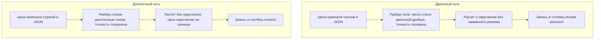

# Округление и работа с деньгами

Вечер, магазин закрывается, и учётная программа запускает сверку, то есть
сравнение одного и того же итога, посчитанного двумя независимыми путями.
За день касса пробила тысячу чеков по 19.99. Программа складывает их одну
за другой и сравнивает с ожидаемым 19990.0. Ответ отрицательный: сумма на
месте, а равенства нет. Тот же фокус виден и без всякого магазина, одной
строкой в консоли языка:

```text
0.1 + 0.2          = 0.30000000000000004
0.1 + 0.2 == 0.3   : False
```

Числа записаны верно, сложение одно, а равенства нет. Причина в типе,
который хранит дробные числа: это двоичная дробь, а одна десятая в двоичной
записи бесконечна. В памяти лежит ближайшее представимое значение, и иллюзия
точности держится до первой арифметики. Для денег это рабочая тема, а не
курьёз: копейка — единица счёта, а не приближение. На такой арифметике
стоят сверка итогов, расчёт комиссий и делёж сумм между строками. Дальше
разберём, что лежит в памяти вместо 0.1, где это ломает сверку и как
считать деньги, чтобы копейка сходилась с копейкой.

**Зачем это в работе AppSec-инженера.** Быстрый вопрос ревью здесь один: в
каком типе живёт сумма и кто выбрал режим её округления. Если ответ «в
двоичной дроби, режим не выбирал никто», находка есть уже до чтения кода. Свой номер
у дефекта тоже есть: в каталоге CWE, общем реестре типовых слабостей, он
идёт под номером CWE-682, неверный расчёт. Это случай, когда результат
вычисления участвует в решении и небольшая систематическая разница в нём
накапливается, а такой разницей пользуется атакующий.

## Как это работает

Дробное число в программе хранится одним из двух способов. Первый — число
с плавающей точкой, стандартный тип для дробных величин; в Python он
называется float. Значение в нём записано двоичной дробью фиксированной
длины. Плавающей точку называют потому, что её положение между разрядами
хранится вместе с числом. Поэтому один и тот же тип держит и одну сотую, и
миллиард. Второй способ — десятичный тип, он хранит цифры десятичной записи
как есть. Про него разговор впереди, а пока про первый.

**Откуда это взялось.** Двоичное представление появилось как размен:
аппаратура считает так быстро, а цена размена — некоторые десятичные дроби
не записываются в нём точно. Документация Python объясняет это на знакомом
примере. Одна треть не записывается конечной десятичной дробью: сколько
троек ни поставь после запятой, до одной трети всегда не хватает хвоста.
Ровно так же одна десятая не записывается конечной двоичной дробью.

Где аналогия ломается: обрезание десятичной записи видно, и место его
выбирают сами, а двоичный тип приближает одну десятую молча, ещё при записи
значения в коде. Для физической величины размен выгоден: погрешность лежит
далеко за пределами точности измерения. Для денег он не выгоден вовсе:
копейка — не приближение, а единица, в которой считают.

### Что лежит в памяти вместо `0.1`

Стенд печатает точное значение того, что хранится на месте 0.1, и складывает
одни и те же копейки двумя типами.

**Вывод стенда `e04-money.py`**

```text
=== А. представление ===
0.1 + 0.2            = 0.30000000000000004
0.1 + 0.2 == 0.3     : False
точное значение 0.1:
  0.1000000000000000055511151231257827021181583404541015625
Decimal('0.1')       = 0.1
0.1+0.1+0.1-0.3 float= 5.551115123125783e-17
0.1+0.1+0.1-0.3 dec  = 0.0
```

Строка под подписью «точное значение 0.1» и есть то, что лежит в памяти:
пятьдесят с лишним знаков, из которых видно, что это не одна десятая. Почему
же консоль обычно печатает `0.1`? Документация Python отвечает прямо: язык
печатает кратчайшую десятичную запись, которая при чтении обратно даёт то же
хранимое значение. Печать и хранение — разные вещи, поэтому иллюзия точности
и держится до первой арифметики.

Последние три строки разводят два типа. `Decimal` — десятичный тип из
одноимённого модуля: он хранит цифры десятичной записи, поэтому
`Decimal('0.1')` равен ровно одной десятой. Отсюда разница в итоге:
выражение `0.1+0.1+0.1-0.3` в двоичной арифметике даёт `5.55e-17`, в
десятичной — точный ноль. Документация модуля называет практическое
следствие дословно: десятичная арифметика предпочтительна в бухгалтерских
приложениях со строгими инвариантами равенства. Инвариант здесь — условие,
которое обязано держаться всегда, например «сумма частей равна целому».

### Сверка: где ломается равенство

У сверки из начала темы есть бытовой образец. Вечером кассир считает
наличные в кассе и сравнивает с лентой чеков: сошлось — день закрыт, не
сошлось — ищут, где разошлись. В программе то же делают закрытие дня,
разнесение платежей по счетам и проверка баланса. У такого сравнения есть
свойство, которое не обсуждают, пока оно не сломано: оно сравнивает на
равенство, а не на похожесть.

Второй прогон показывает, чем это оборачивается на объёме.

**Вывод стенда `e04-money.py`**

```text
=== Б. накопление на миллионе операций ===
     1000 раз по 0.01: float=9.999999999999831   расхождение -1.69E-13
   100000 раз по 0.01: float=999.9999999992356   расхождение -7.644E-10
  1000000 раз по 0.01: float=10000.000000171856  расхождение 1.71856E-7

=== Ж. сверка на равенство ===
  float:   19990.000000000135 == 19990.0 -> False
  Decimal: 19990.00 == 19990.00 -> True
```

Здесь важно не преувеличить. Расхождение после миллиона сложений — меньше
одной десятимиллионной, и до копейки оно не дорастает. Дефект не в величине
ошибки, а в том, что равенства больше нет: тысяча цен по `19.99` даёт
`19990.000000000135`, и сверка итога с ожидаемым не сходится. Ровно на этой
сверке стоят закрытие дня, разнесение платежей и проверка баланса.

Обходной приём «сравнивать с допуском», то есть считать суммы равными, если
разница меньше заданной, работает, пока допуск не начинают подбирать. С
деньгами он вдобавок неверен по существу: расхождение в одну копейку в
отчёте — не погрешность, а недостача. Посмотрите на свою сверку итогов:
чем она сравнивает суммы — на равенство или с допуском, и кто выбирал этот
допуск?

### Режим округления: одно число, несколько правил

До копейки округлять приходится постоянно: налог или комиссия почти никогда
не дают ровно сотых. Если точное значение попало ровно посередине между
двумя копейками, ближайшего ответа нет, и выбирает правило. Правил
несколько. Школьное, половина вверх: 0.045 становится 0.05. Банковское,
половина к чётному: 0.045 становится 0.04, зато на большом объёме
округления вверх и вниз встречаются поровну и не смещают итог. Есть и
отбрасывание: лишние знаки режут, куда бы ни смотрела половина. Такие
правила называют режимами округления, и в модуле `decimal` их восемь; по
умолчанию действует банковское.

Третий прогон разводит два разных вопроса: как округляют одно число и чем
режимы различаются между собой.

**Вывод стенда `e04-money.py`**

```text
=== Г. округление до копейки ===
       сумма     round()   HALF_EVEN   HALF_UP     DOWN
       2.675        2.67        2.68      2.68     2.67
       0.045        0.04        0.04      0.05     0.04
```

Строка `2.675` показывает первый вопрос в чистом виде. Встроенное округление
над двоичной дробью даёт `2.67`, десятичное с тем же банковским правилом —
`2.68`. Причина не в правиле: в памяти на месте `2.675` лежит значение чуть
меньше, и до середины оно не достаёт. Округляется не то число, которое
написано, а то, которое хранится.

Строка `0.045` показывает второй вопрос — расхождение самих правил:
банковское даёт `0.04`, школьное — `0.05`. Двоичный подвох здесь тоже есть:
в памяти на месте `0.045` лежит чуть меньшее значение, и встроенное
округление даёт `0.04` уже поэтому. Правило, взятое по умолчанию, — тоже
выбор, только сделанный не автором.

### Кому достаётся копейка и что даёт режим на объёме

Остались два вопроса, которые выбором режима не решаются. Первый —
разнесение: сумму делят между строками документа, а делится она не всегда.
Сто рублей на троих — по 33.33, и копейка остаётся неделимой. Второй —
цена режима на большом объёме.

**Вывод стенда `e04-money.py`**

```text
=== Е. разнесение копеек ===
  100.00 на троих: 33.33 x 3 = 99.99, расхождение 0.01
  НДС 20 % с трёх строк по 0.09: по строкам 0.06, на сумму сразу 0.05

=== З. режим округления на большом объёме ===
  комиссия 1,5 % на миллионе сумм
  ROUND_HALF_EVEN: 7499925.00
  ROUND_HALF_UP:   7499950.00
  расхождение:     25.00
```

Сто на троих не делится, и сумма трёх округлённых долей на копейку меньше
целого. Налог, посчитанный по строкам, и тот же налог, посчитанный на итог,
различаются тем же образом. По строкам: налог со строки 0.09 — это 0.018,
до копейки 0.02, и три строки дают 0.06. На итог: 20 % от 0.27 — это
0.054, до копейки 0.05. Ни один режим округления этого не устраняет:
правило должно назвать, кому достаётся остаток, например первой строке
документа. Без такого правила копейка зависает между строками.

Последний прогон переводит выбор режима в деньги. Комиссия — это плата
посреднику в процентах от суммы. Комиссия в полтора процента, посчитанная
на миллионе сумм, различается между двумя законными режимами на 25 единиц.
Разница набегает по копейке там, где точное значение попало на середину.
Это и есть случай CWE-682: расчёт даёт результат, участвующий в решении, и
небольшая систематическая разница накапливается.

## Как это выглядит в коде

Ревьюер смотрит на тип, в котором живёт сумма, и на границы, где она входит
в приложение и выходит из него. Разбор ниже идёт тремя планами. Первый —
найти, где сумма впервые становится двоичной дробью. Второй — найти
округление, у которого не назван режим. Третий — проверить, не теряют ли
точность хранилище и обмен. Вот расчёт итога заказа с налогом. До выносок
назовите сами, какие строки закрывают первые два плана.

```python
# УЯЗВИМО — демонстрация, не для продакшена
def order_total(lines, vat_rate=0.2):
    total = 0.0                                  # (1)
    for price, qty in lines:
        total += float(price) * qty              # (2)
    return round(total * (1 + vat_rate), 2)      # (3)
```

1. Итог заведён двоичной дробью, и с этой строки точное значение
   недостижимо: каждое следующее сложение идёт в приближениях.
2. Цена переведена в двоичную дробь на входе: погрешность внесена до
   всякого расчёта, и исходное значение уже не восстановить.
3. Округление сделано встроенной функцией над двоичной дробью: значение под
   ним не то, каким выглядит, и режим не назван нигде.

Соседний признак живёт вне кода расчёта — это тип столбца в базе. Столбец
`double precision`, двоичной дроби двойной точности, для суммы означает, что
значение теряет точность при записи независимо от того, чем его посчитали.
Тот же разговор — про формат обмена. В JSON, которым клиент говорит с
сервером (тема `rest-and-graphql`), у числа один тип. Разницы между целым
и дробным в записи нет, и разборщик читает дробное в двоичную дробь. Денежная
величина, ушедшая в JSON числом, вернётся двоичной дробью.



**Описание схемы.** Схема читается сверху вниз и показывает два пути одной
суммы от запроса до хранилища. В двоичном пути точность теряется дважды:
при разборе тела, где число становится двоичной дробью, и при записи в
столбец двойной точности. В десятичном пути цена приезжает строкой,
разбирается десятичным типом и округляется один раз, на границе.

## Как защититься

Порядок мер такой: сперва выбрать представление, потом назвать правило.
Почему в таком порядке: режим округления решает, что делать с серединой,
но середина вообще существует, только если значение записано точно.

- **Хранить в десятичном типе или в целых копейках.** Документация
  `decimal` прямо называет десятичную арифметику предпочтительной там, где
  нужны строгие инварианты равенства. У неё есть и вторая опора для денег:
  запись помнит свой разряд, и `1.30 + 1.20` даёт `2.50`, а не `2.5`.
  Документация называет такие значащие нули принятым представлением для
  денежных приложений. Второй рабочий вариант — целые единицы младшего
  разряда: цена живёт как целое число копеек, и вопроса о точности нет
  вовсе.
- **Не пускать двоичную дробь внутрь.** Значение читается из строки, а не
  из числа с плавающей точкой: `Decimal("19.99")`, а не `Decimal(19.99)`.
  Второе переносит внутрь ту самую погрешность, от которой уходили, и
  вопрос 4 самопроверки показывает это вживую.
- **Называть точность и режим округления.** Округление до копейки делается
  явным приведением к нужному разряду с названным режимом, а не встроенной
  функцией округления. Модуль даёт восемь режимов. Какой из них требует
  предметная область, решает не язык, а учётная политика. Режим виден в
  деньгах, поэтому его согласуют с тем, кто за деньги отвечает.
- **Округлять один раз и в известном месте.** Каждое округление отбрасывает
  хвост, и округление округлённого может отличиться от округления точного
  значения. Поэтому промежуточные величины считаются с запасом разрядов, а
  округление ставится на границе — там, где сумма становится документом:
  чеком, платёжным поручением, отчётом.

Исправленный вариант написан на тех же трёх планах, что и разбор уязвимого.
Первый план — принять цену без потери. Второй — держать расчёт без
округления. Третий — округлить один раз с названным режимом.

```python
# Исправлено: десятичный тип, значение из строки, названный режим.
from decimal import Decimal, ROUND_HALF_UP

CENT = Decimal("0.01")

def order_total(lines, vat_rate=Decimal("0.20")):
    total = sum(Decimal(price) * qty for price, qty in lines)  # (1)
    with_vat = total * (Decimal(1) + vat_rate)                 # (2)
    return with_vat.quantize(CENT, rounding=ROUND_HALF_UP)     # (3)
```

1. Цена приходит строкой и разбирается десятичным типом: погрешность не
   попадает внутрь, и точность сохраняется от начала до конца.
2. Промежуточная величина не округляется: она живёт в контексте, наборе
   настроек десятичной арифметики. По умолчанию контекст держит 28 значащих
   цифр, и этого хватает, чтобы округление в расчёте осталось одним.
3. Единственное округление стоит на границе, с явно названными разрядом и
   режимом: `CENT` задаёт копейку, `ROUND_HALF_UP` — школьное правило.

**Где это не работает.** Десятичный тип не отменяет деления: одна треть в
нём тоже бесконечна, и остаток от разнесения по строкам придётся кому-то
отдать правилом. Не отменяет он и валютных тонкостей: у части валют младший
разряд не сотая, а тысячная или целая единица, и константу `CENT` под такую
валюту переписывают.

**Что добавляется поверх.** Модуль умеет превращать сигнал `Inexact`,
отметку о том, что результат пришлось округлить, в исключение. Ловушка
ставится на свежий контекст одной строкой. Прогон показывает разницу:
сложение `0.10 + 0.20` проходит, а деление одного на три падает.

```python
import decimal
from decimal import Decimal

ctx = decimal.Context()
ctx.traps[decimal.Inexact] = True

ctx.add(Decimal("0.10"), Decimal("0.20"))
print("0.10 + 0.20: прошло без сигнала")
ctx.divide(Decimal(1), Decimal(3))
```

**Вывод**

```text
0.10 + 0.20: прошло без сигнала
Traceback (most recent call last):
  File "<stdin>", line 9, in <module>
decimal.Inexact: [<class 'decimal.Inexact'>]
```

Это готовая точка для теста, который утверждает: в этом расчёте округления
быть не должно. Если однажды расчёт изменят и результат перестанет быть
точным, тест упадёт раньше сверки.

## Частая ошибка

Здесь стоит задержаться: годится ли для учёта двоичная дробь, если
округлять значение каждый раз при выводе? Решите сами, прежде чем читать
дальше.

Расхожее мнение звучит так: считать в двоичной дроби можно, если округлять
при выводе. Оно неверно. Округление на выводе прячет расхождение, но не
убирает его из хранимого значения. Контрпример из прогона — сверка на
равенство: тысяча цен по `19.99` даёт `19990.000000000135`, и сравнение с
ожидаемым итогом ложно. На экране обе величины показались бы одинаково,
по `19990.00`.

Мнение опирается на верное наблюдение: погрешность одной операции лежит
далеко за копейкой. Документация Python приводит эту же оценку и добавляет
условие, которое обычно теряют. Оценка годится для обиходного счёта, а не
для расчётов, где нужна точная десятичная запись; для последних страница
отсылает к десятичному модулю.

Второй вид той же ловушки — доверие встроенному округлению. Строка `2.675`
в прогоне даёт `2.67` вместо `2.68` не потому, что правило другое, а
потому, что округляемое значение не то, каким выглядит.

## Чеклист для ревью

1. Проверьте, что денежная величина хранится в десятичном типе или в целых
   единицах младшего разряда, а не в числе с плавающей точкой.
2. Проверьте, что значение попадает в десятичный тип из строки, а не из
   двоичной дроби.
3. Проверьте, что разряд и режим округления названы явно в коде, а не взяты
   по умолчанию языка.
4. Проверьте, что округление выполняется один раз, на известной границе, а
   не на каждом промежуточном шаге.
5. Проверьте, что правило разнесения остатка при делении суммы между
   строками записано и реализовано.
6. Проверьте, что тип столбца в хранилище и формат обмена сохраняют
   точность денежной величины.
7. Проверьте, что сверка итогов не полагается на сравнение чисел с
   плавающей точкой на равенство.

## Попробуй сам

Возьмите расчёт с деньгами в своём или учебном приложении и пройдите путь
одной суммы от входа до документа. Выпишите каждое место, где меняется тип:
разбор запроса, поле модели, столбец базы, ответ в JSON, отчёт. Схема из
раздела «Как это выглядит в коде» — готовый шаблон для такой выписки.

Одна подсказка: первое место потери — разбор запроса. Число в JSON
приезжает уже двоичной дробью, и точность теряется раньше всякого расчёта.

**Критерий выполнения** наблюдаемый: для каждого перехода назван тип и
сказано, теряется ли на нём точность. Для места, где сумма округляется,
названы разряд и режим, а также кому достаётся остаток при делении на
несколько строк.

## Проверь себя

1. Новый обработчик принимает цену из тела запроса:

   ```python
   @app.post("/orders")
   def create_order():
       price = request.json["price"]
       store_price(price)
   ```

   Клиент прислал `{"price": 19.99}`. В каком типе приехала цена и на
   какой строке потеряна точность?

2. Расчёт из раздела «Как это выглядит в коде» живёт в двоичной дроби:

   ```python
   def order_total(lines, vat_rate=0.2):
       total = 0.0
       for price, qty in lines:
           total += float(price) * qty
       return round(total * (1 + vat_rate), 2)
   ```

   Какую починку вы выберете?

   А. Оставить float, но сверять итоги с допуском: `abs(got - expected) <
      0.005`.

   Б. Перевести суммы в десятичный тип, читать значения из строк и
      округлять один раз на границе, с явно названными разрядом и режимом.

   В. Оставить float и округлять значение при каждом выводе на экран.

3. Почему встроенное округление даёт `2.67` там, где десятичное с тем же
   правилом даёт `2.68`?

4. Предскажите, что напечатает этот фрагмент, — почему первая строка
   длиннее второй?

   ```python
   import json
   from decimal import Decimal
   price = json.loads('{"price": 19.99}')["price"]
   print(Decimal(price))
   print(Decimal(str(price)))
   ```

5. Возврат к теме `business-logic-flaws`: почему выбор режима округления —
   правило предметной области, а не деталь реализации?

6. Возврат к теме `rest-and-graphql`: почему денежная величина в JSON-теле
   приезжает уже двоичной дробью и как это обходят в схеме API?

<details markdown="1">
<summary>Ответ 1</summary>

1. Цена приехала двоичной дробью: у JSON один числовой тип, и разборщик
   тела читает его в float. Точность потеряна ещё в `request.json` — раньше
   всякого расчёта, и дальше исходное `19.99` не восстановить. Денежные поля
   принимают строкой и разбирают десятичным типом из строки:
   `Decimal("19.99")`.

</details>

<details markdown="1">
<summary>Ответ 2: разбор вариантов</summary>

2. Верный ответ — Б.

   А. Допуск работает, пока его не начинают подбирать, и неверен по
      существу: расхождение в одну копейку в отчёте — не погрешность, а
      недостача. Кто выбирал допуск и почему именно такой — на этот вопрос
      у приёма ответа нет.

   Б. Десятичная арифметика предпочтительна там, где нужны строгие
      инварианты равенства — документация модуля `decimal` говорит это
      прямо. Значение из строки не несёт погрешности, а единственное
      округление с названным режимом стоит там, где сумма становится
      документом.

   В. Округление на выводе прячет расхождение, но не убирает его из
      хранимого значения. Тысяча цен по `19.99` даёт
      `19990.000000000135`: сверка итога с ожидаемым ложна, хотя на экране
      обе величины выглядят одинаково.

</details>

<details markdown="1">
<summary>Ответ 3</summary>

3. Округляется не `2.675`, а ближайшее к нему двоичное значение, которое
   чуть меньше и до середины между копейками не достаёт. Причина не в
   правиле округления, а в том, что округляемое значение не то, каким
   выглядит.

</details>

<details markdown="1">
<summary>Ответ 4</summary>

4. Сначала `19.989999999999998436805981327779591083526611328125`, затем
   `19.99`. Проверка прогоном: сохраните код из вопроса как `q4.py` и
   запустите:

   ```bash
   python3 q4.py
   ```

   ```text
   19.989999999999998436805981327779591083526611328125
   19.99
   ```

   `Decimal` от числа с плавающей точкой честно показывает, что лежит в
   памяти вместо `19.99`, — и переносит погрешность внутрь десятичного типа
   навсегда. Разбор строки даёт ровно то число, которое написано. Отсюда
   правило: значение читается из строки, а не из двоичной дроби.

</details>

<details markdown="1">
<summary>Ответ 5</summary>

5. Потому что выбор виден в деньгах и согласуется с тем, кто за деньги
   отвечает: на миллионе комиссий два законных режима расходятся на 25
   единиц. Язык выбирает за автора тогда, когда автор не выбрал сам.

</details>

<details markdown="1">
<summary>Ответ 6</summary>

6. У JSON один числовой тип, и разборщик читает его в двоичную дробь:
   точность теряется при разборе тела, до любого расчёта. В схеме API
   денежные поля объявляют строкой и разбирают десятичным типом из строки.

</details>

## Источники

1. Документация Python, «Floating-Point Arithmetic: Issues and
   Limitations»; реестр `python-floating-point`. Разделы: двоичное
   представление десятичной дроби, кратчайшая печатаемая запись, накопление
   ошибки, `math.isclose`, `math.fsum`, отсылка к десятичному модулю.
   <https://docs.python.org/3/tutorial/floatingpoint.html>
2. Документация Python, «decimal — Decimal fixed-point and floating-point
   arithmetic»; реестр `python-decimal`. Разделы: точное представление,
   инварианты равенства, значащие нули, пользовательская точность, восемь
   режимов округления, сигналы и ловушки, `quantize`.
   <https://docs.python.org/3/library/decimal.html>
3. MITRE, «CWE-682: Incorrect Calculation», CWE 4.20; реестр `cwe-682`.
   Разделы: описание класса, последствия для решений о ресурсах и правах,
   меры уровня реализации, перечень потомков.
   <https://cwe.mitre.org/data/definitions/682.html>

Каркас этапа: `owasp-asvs-5-document` (ASVS v5.0.0), `owasp-wstg-42`,
`owasp-top10-2025`. Наследуются всеми темами и отдельной строкой не
повторяются.

**Скоропортящийся слой.** Числа прогонов сняты на одной версии среды;
точность по умолчанию у десятичного модуля и набор режимов округления
привязаны к версии языка. Младший разряд денежной единицы зависит от валюты
и от учётной политики, а не от языка.

**Маркеры уверенности.** Представление `0.1`, накопление на миллионе
сложений, расхождение сверки на равенство, поведение четырёх режимов
округления, разнесение копеек и расхождение двух режимов на миллионе
комиссий — **проверено лично** 2026-08-24 на Python 3.14.7 (стенд
`e04-money.py`): `0.1 + 0.2` даёт `0.30000000000000004`; миллион сложений по
`0.01` даёт `10000.000000171856`; тысяча цен по `19.99` не равна `19990.0`;
`round` над двоичной дробью даёт `2.67` там, где десятичное округление к
чётному даёт `2.68`; два законных режима расходятся на 25 единиц на
миллионе комиссий; сигнал `Inexact` в виде исключения останавливает деление
`1/3` и пропускает `0.10 + 0.20`. Повторный прогон 2026-10-03 на том же
Python 3.14.7 подтвердил дословно: представление `0.1`, накопление на трёх
объёмах, сверку на равенство, таблицу четырёх режимов, разнесение копеек,
налог по строкам и на итог, падение деления `1/3` на ловушке `Inexact` и
вывод ответа 4; там же проверены значащие нули `1.30 + 1.20 = 2.50`.
Расхождение двух режимов на миллионе комиссий повторно не прогонялось.
Утверждения о предпочтительности десятичной арифметики, о значащих нулях и
о наборе режимов — **по документации** (страницы Python о плавающей точке и
о десятичном модуле, открыты лично 2026-08-24). Отнесение к классу
неверного счёта — **по документации** (CWE-682, CWE 4.20, открыт лично
2026-08-24). Отсутствие этих номеров в категориях OWASP 2025 года и
отсутствие требования о денежной точности в ASVS 5.0.0 — **проверено
лично** 2026-08-24 поиском по разделам «List of Mapped CWEs» десяти
категорий и по полному перечню требований стандарта. Поведение других
языков и денежных типов в СУБД **не воспроизводилось**.
