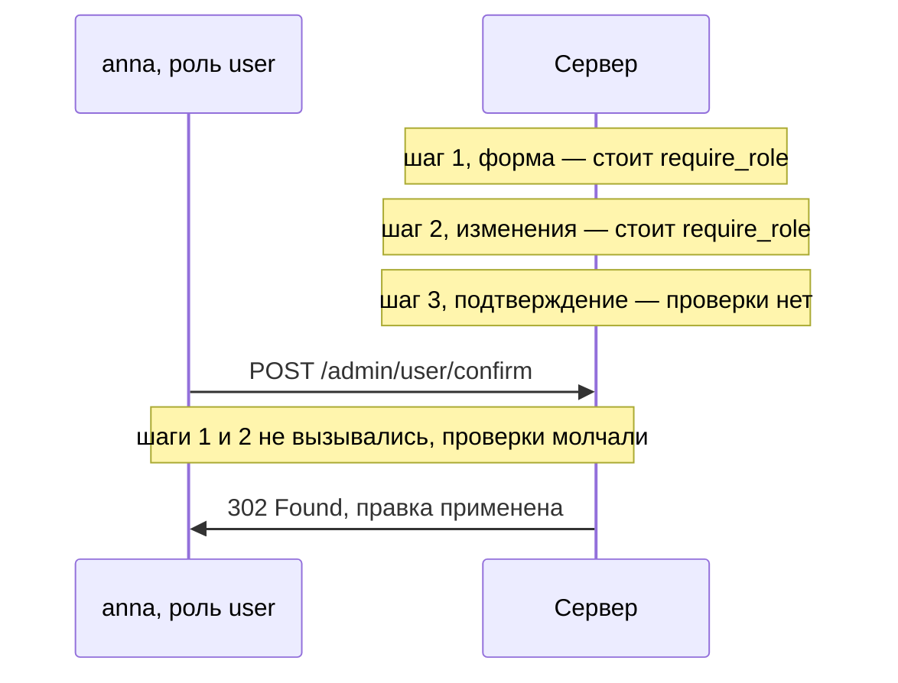

# Проверка только на первом шаге многошагового процесса

В административной панели портала есть операция правки чужого профиля, и
сделана она в три шага. Первый шаг загружает форму с данными пользователя,
второй принимает изменения, третий показывает сводку и применяет правку.
Проверку `require_role("admin")` разработчик поставил на первые два шага, а
на третий не стал: до третьего экрана всё равно не дойти, минуя первые два.
Адрес третьего шага при этом записан в скрипте панели, который сервер отдаёт
любому посетителю. Пользователь `anna`, у которой роль `user`, читает адрес
из скрипта и отправляет запрос третьего шага первым, не открывая ни форму,
ни отправку изменений.

**Запрос `anna`: третий шаг, отправленный первым**

```http
POST /admin/user/confirm HTTP/1.1
Host: portal.example.com
Cookie: session=3Rk8p
Content-Type: application/x-www-form-urlencoded

uid=1042&role=admin
```

**Ответ**

```http
HTTP/1.1 302 Found
Location: /admin/users
```

Код `302` означает, что сервер принял запрос и отправляет браузер на список
пользователей, то есть правка применена. Первые два шага процесса не
выполнялись вовсе, поэтому `require_role("admin")` не срабатывал ни разу:
обе проверки живут в функциях, которые `anna` не вызывала. Третий шаг взял
`uid` из тела запроса и применил присланные поля. Ни одна проверка не
отработала неверно, на этом пути их не стояло. Дальше разберём, почему
такая расстановка кажется достаточной, где именно теряется проверка и как
закрыть процесс целиком.

## Три экрана и три независимые точки

Операцию, которую приложение разбило на несколько экранов, называют
многошаговым процессом. Одним запросом её не оформить: полей много, перед
списанием денег пользователь должен увидеть сводку, а часть данных
подтягивается между шагами. Бытовой пример — оформление заказа в магазине:
корзина, адрес и оплата, подтверждение. Каждый экран обслуживает своя
функция на сервере, обработчик, то есть код, который принимает запросы к
своему адресу. Поэтому процесс из трёх экранов — это три независимые точки
входа, а не одна дверь с коридором.

Порядок шагов существует только в браузере. Именно там кнопка второго шага
появляется после первого, а ссылка на третий — после второго. Сервер про
такой порядок ничего не знает, потому что HTTP не помнит предыдущих
запросов, и принимает каждый запрос сам по себе. Значит, запрос любого шага
можно отправить первым, повторить его или пропустить шаг целиком. Дефект
этой темы стоит ровно здесь: проверка прав живёт в одном обработчике, а
действие выполняет другой.

Представьте сдачу документов в три окна. В первом окне проверяют паспорт,
во втором принимают заявление, в третьем выдают решение. Порядок держится
не на барьерах, а на привычке: стойки стоят в ряд, и люди идут слева
направо. Если же к третьему окну можно подойти с улицы напрямую, привычка
перестаёт быть защитой. Соответствие аналогии теме такое:

| В аналогии | В процессе |
|---|---|
| Окно приёма | Обработчик одного шага |
| Проверка паспорта у первого окна | `require_role("admin")` на первом шаге |
| Подход к третьему окну с улицы | Запрос третьего шага, отправленный первым |

Где аналогия ломается. Сотрудник третьего окна видит, что посетитель пришёл
с улицы, минуя первые два, и вправе отказать уже поэтому. Сервер по голому
запросу не видит, какие экраны клиент открывал до него: у запроса нет такой
памяти.

**Откуда это взялось.** Многошаговый процесс родился из ограничений формы:
полей много, сводку нужно показать до списания денег, часть данных
подтягивается между шагами. Экраны разделили, и вместе с ними разделились
обработчики. Проверка осталась там, где стоял вход в процесс: она уже была
написана, и повторять её на каждом шаге казалось лишней работой.
Предположение «до третьего шага доходят только прошедшие первый» верно для
браузера и неверно для HTTP, потому что запрос третьего шага можно
отправить сам по себе.

**Зачем это в работе AppSec-инженера.** Процесс из трёх экранов вы
разбивали сами: форма, отправка, подтверждение. Проверку прав ставили на
входе, потому что она уже написана, а на третий экран иначе не попасть.
Дефект не виден ни в одном отдельно взятом обработчике: каждый по-своему
корректен, а ошибка живёт в предположении между ними. Поэтому ревьюер
находит его, только читая процесс целиком, и это тот случай, где автоматика
бесполезна, а знание предметной области даёт прямое преимущество.

О границах темы. Механика здесь из контроля доступа, а вред считается в
терминах предметной области. Поэтому дальше по маршруту ту же пару разбирает
тема `business-logic-flaws`, уже со стороны логики.



**Описание схемы.** Схема читается сверху вниз и показывает один запрос
`anna` на фоне трёх шагов процесса. Проверка роли стоит на первом и втором
шаге, но их обработчики `anna` не вызывала, поэтому обе проверки промолчали.
Запрос попал сразу в третий шаг, где проверки нет, и сервер применил правку.

## Как это работает

### Где именно теряется проверка

Пример из начала темы не выдуман. Его разбирает PortSwigger Web Security
Academy как канонический случай многошагового процесса. Административная
правка профиля идёт там в три шага: загрузка формы с данными, отправка
изменений, просмотр и подтверждение. Правила стоят на первом и втором шаге,
а третий их не несёт, потому что сюда якобы попадают только прошедшие
предыдущие. Атакующий шлёт запрос третьего шага с нужными параметрами и
выполняет действие. Правка `anna` из начала темы — этот пример целиком.

Здесь полезно различить два дефекта, которые часто идут рядом. Отсутствие
проверки на шаге — дефект контроля доступа: обработчик выполняет закрытое
действие, не спросив права. Возможность пройти шаги в другом порядке или
бросить процесс на середине — уже дефект логики: проверки могут стоять на
всех шагах, а вред всё равно получается. Руководство WSTG, собрание приёмов
тестирования приложений от OWASP, приводит два таких случая из практики.
Первый — начисленные и не отменённые бонусы. Второй — правка публикации,
которую проверяют при первом сохранении, а при редактировании нет.

### Что хранит состояние

Ключевой вопрос к любому многошаговому процессу: где лежит то, что уже
решено. Состоянием процесса называют данные, накопленные к текущему шагу:
какой объект правим, что именно меняем, какие шаги пройдены. Бытовой
пример — корзина на кассе самообслуживания: к третьему экрану в ней уже
лежат товары, выбранные на первом.

Если шаг получает идентификатор объекта из скрытого поля формы, состояние
лежит в запросе. Скрытое поле — это элемент формы, который страница не
показывает, но браузер отправляет вместе с остальными, и значение в нём
целиком выбирает отправитель. Про такую подстановку предупреждает справка
OWASP: Cheat Sheet по IDOR (Insecure Direct Object Reference), то есть по
подстановке чужого идентификатора объекта. Ей посвящена пройденная тема
`idor`, и рекомендация там прямая: в многошаговых процессах передавать
идентификаторы через сессию, чтобы их нельзя было подменить. Сессия здесь
серверная; её устройство разбирает тема `sessions-vs-tokens`.

Требования к таким процессам записаны и в стандартах, и формулируются они
именно через порядок шагов. Раздел WSTG-v42-BUSL-06 требует от приложения
двух вещей: шаги выполняются в заданном порядке, а если процесс завершён
неправильно, все действия и порождённые ими действия откатываются. Откат —
это возврат к состоянию до начала шага, как будто шага не было. Бытовой
пример — отмена набранного заказа, после которой со счёта уходит и резерв
на его сумму.

Стандарт ASVS, свод проверяемых требований к приложению, повторяет то же
двумя пунктами. Первый, v5.0-2.3.1: приложение обрабатывает шаги одного
пользователя только в ожидаемом порядке и без пропусков. Второй,
v5.0-2.3.3: операция либо выполняется целиком, либо откатывается к
предыдущему верному состоянию. Первый пункт читается как прямое описание
дефекта из начала темы: порядка шагов на сервере не существовало вовсе.

## Как это атакуют

Технического трюка здесь нет: весь приём — это выбор момента и адреса.
Порядок действий такой. Сначала атакующий один раз честно проходит процесс
в своей роли и записывает адрес и параметры каждого шага. Адреса видны и
без прохода: они лежат в скриптах страниц и в адресах форм, как адрес
третьего шага из начала темы. Затем запрос последнего шага повторяется
отдельно, из чистой сессии. Чистой называют свежий вход, в котором первые
шаги процесса не выполнялись и состояние не накоплено.

Дальше атакующий варьирует сам порядок. Шаг пропускают, шаг повторяют,
возвращаются к первому шагу после завершения процесса. Отдельно меняют
данные: в параметры последнего шага подставляют чужой идентификатор
объекта, как `uid=1042` у `anna`. Ответ читается прямо: если действие
выполнено, находка есть. Если пришёл отказ, проверяют, к чему привязано
состояние процесса — к пользователю, к объекту или ни к чему. Задача
«Попробуй сам» в конце темы построена ровно на этом опыте.

## Как это выглядит в коде

Ревьюер читает не один обработчик, а цепочку обработчиков целиком, и ищет
два признака: проверку, которой нет, и данные, которые пришли от клиента
вместо сессии. Оба обработчика из начала темы стоят рядом, в одном файле.
Разбор идёт тремя планами. Первый — найти, где заканчивается проверка роли.
Второй — найти, откуда третий шаг берёт идентификатор объекта. Третий —
найти место, где шаг мог бы узнать, что предыдущий шаг был. Не подглядывая
в выноски, ответьте сами, какие строки закрывают каждый план.

```python
@app.post("/admin/user/edit")
def edit_step2():
    require_role("admin")                       # (1)
    session["pending"] = request.form["uid"]
    return render("confirm.html", uid=request.form["uid"])

# УЯЗВИМО — демонстрация, не для продакшена
@app.post("/admin/user/confirm")
def edit_step3():
    uid = request.form["uid"]                   # (2)
    User.get(uid).apply(request.form)           # (3)
    return redirect("/admin/users")
```

1. Проверка роли стоит на втором шаге и там же заканчивается: третий
   обработчик её не повторяет.
2. Третий шаг берёт идентификатор из формы, а не из `session["pending"]`.
   Состояние процесса приехало от клиента, и клиент меняет его целиком.
3. Действие выполняется без проверки роли и без проверки того, что второй
   шаг вообще был.

Три обёртки выглядят защитой, а ею не стали. Первая — скрытое поле с меткой
шага: оно сообщает серверу, какой экран показан клиенту, но значение ставит
отправитель. Вторая — одноразовый токен формы, случайная строка, которую
сервер вкладывает в страницу и ждёт обратно. Она доказывает, что форма
отправлена со страницы сайта, а не подделана с чужого сайта: так закрывается
подделка межсайтового запроса, отдельный класс дефектов. Но на вопрос о
правах и о порядке шагов токен не отвечает. Третья — проверка заголовка
`Referer`, адреса страницы, с которой якобы пришёл запрос: PortSwigger
разбирает её отдельно, потому что этот заголовок целиком управляется
отправителем.

Бывает и ложное срабатывание — обработчик без проверки роли, который
дефектом не считается. Признак такой: функция не читает параметры запроса
вовсе, потому что её вызывает другая функция, уже сделавшая проверку и
передающая объект аргументом. Здесь проверка не потеряна, а стоит выше по
вызову.

Отсюда видно, почему дефект переживает ревью каждого обработчика по
отдельности. Сервер видит не процесс, а точки, и проверка в одной из них не
говорит ничего остальным. Последний шаг сделайте сами: что закроет и что
оставит перенос `require_role("admin")` в третий обработчик, если `uid`
по-прежнему берётся из формы?

## Как защититься

Защита складывается из двух переносов. Первый — проверка прав: каждый шаг
проверяет роль заново, независимо от того, что делали предыдущие. Второй —
состояние процесса: шаг берёт его оттуда, куда клиент не пишет, то есть из
серверной сессии. Читая листинг, отследите две строки: на какой запрос без
роли получит отказ и на какой — запрос без пройденного второго шага.

```python
@app.post("/admin/user/edit")
def edit_step2():
    require_role("admin")
    session["pending"] = request.form["uid"]       # объект — в сессии
    session["pending_changes"] = dict(request.form)
    return render("confirm.html", uid=request.form["uid"])

@app.post("/admin/user/confirm")
def edit_step3():
    require_role("admin")                       # проверка на каждом шаге
    uid = session.get("pending")                # состояние из сессии
    if uid is None:
        abort(409)
    with db.transaction():                      # ASVS v5.0-2.3.3
        User.get(uid).apply(session.pop("pending_changes"))
        session.pop("pending")
    return redirect("/admin/users")
```

Запрос `anna` из начала темы теперь отвергнут сразу: первая строка тела
`edit_step3` — проверка роли, а она стоит на каждом шаге. Если бы роль
администратора у неё была, запрос остановился бы строкой ниже. Ключ
`pending` появляется в сессии только после второго шага, а у `anna`
второго шага не было, поэтому `session.get("pending")` вернёт `None`, и
сервер ответит кодом `409`. Этот код читается как «состояние не то»:
запрос сам по себе грамотный, но процесс до него не дошёл.

Осталась строка `db.transaction()`. Транзакция — это способ выполнить
набор изменений по принципу «либо всё, либо ничего»: если середина упала,
база откатывает уже сделанную часть. Бытовой пример — перевод между
счетами: списание без зачисления недопустимо, поэтому оба изменения живут в
одной транзакции. Здесь она закрывает требование v5.0-2.3.3 из раздела
«Как это работает»: правка профиля и снятие меток процесса применяются
вместе, и незавершённый процесс не оставляет следов. Заодно снимается
вопрос повторной отправки: `session.pop` забирает ключи из сессии, и второй
такой же запрос упрётся в отсутствие `pending`.

**Границы применимости.** Приём подходит процессам, которые идут в одной
сессии и укладываются в её срок жизни. Он не работает там, где процесс
живёт дольше: согласование в несколько дней, оплата с возвратом от
платёжного шлюза, работа с нескольких устройств. Там состояние переносят в
хранилище с собственным идентификатором процесса. Вопрос о правах на
процесс становится тогда обычным вопросом о правах на объект — тем самым,
который разбирает тема `idor`. Цена решения — состояние на сервере: его
надо чистить, потому что брошенные процессы копятся.

## Частая ошибка

Сначала решите сами, не читая дальше. Если вход в процесс закрыт проверкой
прав, закрыт ли весь процесс?

Из дефекта растёт представление, которое не даёт его увидеть. Первый шаг
закрыт проверкой прав, значит, закрыт и весь процесс: на следующие экраны
иначе не попасть. Представление неверно, и ломается оно о
различие из первого раздела. Экран и запрос — разные вещи. Порядок экранов
задаёт интерфейс, а сервер принимает запросы независимо друг от друга.

Контрпример — тот самый процесс правки профиля из начала темы. Атакующий
один раз проходит его до конца в своей роли и записывает запрос третьего
шага. Дальше он отправляет этот запрос сам по себе, уже с изменёнными
параметрами. Первый шаг при этом не выполняется вовсе, и проверка на нём не
срабатывает ни разу. Проверка входа осталась на месте, а процесс она не
закрыла.

## Чеклист для ревью

1. Проверьте, что каждый шаг процесса проверяет права заново, а не полагается на
   проверку предыдущего шага (ASVS v5.0-8.2.1).
2. Проверьте, что приложение обрабатывает шаги только в ожидаемом порядке и без
   пропусков (ASVS v5.0-2.3.1).
3. Проверьте, что состояние процесса хранится на сервере, а не в скрытых полях
   формы и параметрах запроса.
4. Проверьте, что незавершённый процесс откатывается целиком, вместе с порождёнными
   действиями (ASVS v5.0-2.3.3).
5. Проверьте, что повторная отправка запроса последнего шага не выполняет действие
   дважды.
6. Проверьте, что порядок шагов не подтверждается заголовком `Referer` или другим
   полем, которое ставит отправитель.

## Попробуй сам

Выберите в знакомом приложении процесс из трёх и более шагов, пройдите его
целиком с записью запросов и повторите последний шаг из чистой сессии. Она
названа чистой, потому что первые шаги в ней не выполнялись и накопленного
состояния процесса в ней нет.

Одна подсказка: если последний шаг отвечает отказом, повторите опыт из
сессии, где первый шаг пройден для **другого** объекта. Так видно, привязано
ли состояние процесса к объекту или только к пользователю.

**Критерий выполнения** наблюдаемый: записан запрос последнего шага, ответ
на его отправку из чистой сессии и ответ на отправку из сессии с чужим
объектом. Против каждого ответа стоит вывод — действие выполнено или
отвергнуто.

## Проверь себя

1. Оформление заказа в два шага, проверка роли стоит на обоих, состояние
   лежит в сессии:

   ```python
   @app.post("/cart/checkout")
   def checkout_step1():
       require_role("customer")
       session["order_id"] = new_order(session["user"], cart())
       return render("payment.html", order_id=session["order_id"])

   @app.post("/cart/pay")
   def checkout_step2():
       require_role("customer")
       order = Order.get(request.form["order_id"])
       order.mark_paid()
       return redirect("/orders")
   ```

   Оба признака вроде бы закрыты. Что здесь всё же упустили?

2. Третий шаг правки профиля из раздела «Как это выглядит в коде» берёт
   идентификатор из формы:

   ```python
   @app.post("/admin/user/confirm")
   def edit_step3():
       uid = request.form["uid"]
       User.get(uid).apply(request.form)
       return redirect("/admin/users")
   ```

   Какую починку вы выберете?

   А. Перенести `require_role("admin")` в этот обработчик — роль будет
      проверяться на каждом шаге.

   Б. Проверять на третьем шаге заголовок `Referer`: запрос обязан приходить со
      страницы подтверждения.

   В. Проверять роль на каждом шаге и брать `uid` из `session["pending"]`,
      отказывая, если второго шага в этой сессии не было.

3. Почему проверка на первом шаге кажется достаточной и в чём предположение
   ошибочно?
4. Вот модель исправленного третьего шага. Предскажите, что она напечатает.

   ```python
   def edit_step3(session, form):
       if session.get("role") != "admin":
           return 403
       if session.get("pending") is None:
           return 409
       return 302

   print(edit_step3({"role": "user"}, {"uid": 1042}),
         edit_step3({"role": "admin"}, {"uid": 1042}),
         edit_step3({"role": "admin", "pending": 1042}, {}))
   ```

5. Возврат к теме `sessions-vs-tokens`: почему хранение состояния процесса в
   самодостаточном токене возвращает ту же задачу?
6. Возврат к теме `idor`: процесс живёт дольше сессии, и его состояние
   перенесли в хранилище с собственным идентификатором процесса. В какой
   вопрос из темы про IDOR превращается теперь вопрос о правах на процесс?

<details markdown="1">
<summary>Ответ 1</summary>

1. Второй шаг берёт `order_id` из формы, а не из `session["order_id"]`:
   состояние процесса приехало от клиента, и отправитель меняет его целиком.
   Проверка роли здесь отвечает не на тот вопрос: она подтверждает, что
   запрос от покупателя, а вопрос в том, чей заказ отмечается оплаченным.
   Чужой идентификатор подставляется в форму, и `mark_paid()` выполняется над
   чужим объектом. Правильный шаг берёт идентификатор из сессии, куда его
   положил первый шаг.

</details>

<details markdown="1">
<summary>Ответ 2: разбор вариантов</summary>

2. Верный ответ — В.

   А. Перенос `require_role("admin")` закрывает отсутствие проверки и оставляет
      второй дефект: `uid` по-прежнему приходит из формы, так что процесс можно
      начать с последнего шага, а состояние подменить. От атакующей сессии с
      ролью `user` это защитит, от подмены объекта и обхода порядка — нет.

   Б. Заголовок `Referer` целиком ставит отправитель: PortSwigger разбирает
      такую проверку как самостоятельную уязвимость. Она не говорит ни о
      правах, ни о том, был ли второй шаг.

   В. Проверка роли стоит на каждом шаге, состояние процесса лежит в сессии,
      куда клиент не пишет. Пустое `session["pending"]` означает, что второго
      шага не было, и даёт отказ 409. Закрыты оба признака.

</details>

<details markdown="1">
<summary>Ответ 3</summary>

3. Предполагается, что до следующего шага доходят только через первый. Это
   верно для интерфейса, где кнопка второго шага появляется после первого, и
   неверно для HTTP: запрос любого шага отправляется сам по себе. На сервере у
   процесса нет порядка, есть только точки, и проверка в одной из них не
   говорит ничего остальным.

</details>

<details markdown="1">
<summary>Ответ 4</summary>

4. `403 409 302`: сессии без роли отказано в правах, администратору без
   пройденного второго шага — конфликт состояния, полному процессу —
   перенаправление. Проверяется прогоном: сохраните фрагмент в `m.py` и
   выполните `python3 m.py`, либо скормите его интерпретатору командой
   `python3 - <<'EOF' … EOF`.

</details>

<details markdown="1">
<summary>Ответ 5</summary>

5. Токен несёт утверждения и приходит от клиента. Приложение снова получает
   состояние процесса из запроса, и подмену закрывает подпись, а не хранение:
   подписанный токен нельзя переписать, но можно предъявить чужой или
   повторить старый.

</details>

<details markdown="1">
<summary>Ответ 6</summary>

6. В вопрос о выборке: процесс ищут не по всей таблице, а в множестве,
   доступном текущему пользователю. Права на процесс перестают быть частным
   случаем и становятся обычным вопросом о правах на объект.

</details>

## Источники

1. OWASP WSTG-BUSL-06 «Testing for the Circumvention of Work Flows», WSTG v4.2;
   реестр `wstg-v42-busl-06-workflow-circumvention`. Разделы: Summary,
   Example 1, Example 2, How to Test.
   <https://owasp.org/www-project-web-security-testing-guide/v42/4-Web_Application_Security_Testing/10-Business_Logic_Testing/06-Testing_for_the_Circumvention_of_Work_Flows>
2. PortSwigger Web Security Academy, «Access control vulnerabilities and
   privilege escalation»; реестр `ps-access-control`. Разделы: Access control
   vulnerabilities in multi-step processes, Referer-based access control.
   <https://portswigger.net/web-security/access-control>
3. OWASP Insecure Direct Object Reference Prevention Cheat Sheet; реестр
   `owasp-cs-idor`. Раздел: Mitigation (передача идентификаторов через сессию в
   многошаговых процессах).
   <https://cheatsheetseries.owasp.org/cheatsheets/Insecure_Direct_Object_Reference_Prevention_Cheat_Sheet.html>

Каркас этапа: `owasp-asvs-5-document` (ASVS v5.0.0), `owasp-wstg-42`,
`owasp-top10-2025`; якорь подраздела: `owasp-cs-authorization`. Наследуются
всеми темами и отдельной строкой не повторяются.

**Скоропортящийся слой.** Обе страницы OWASP — Cheat Sheet и WSTG — живые
документы без даты публикации; WSTG версионирован, Cheat Sheet нет.

**Маркеры уверенности.** Требование к порядку шагов и откату незавершённого
процесса, два разобранных случая — **по документации** (WSTG-BUSL-06, открыт
лично 2026-08-23). Пример трёхшаговой правки профиля и разбор проверки по
`Referer` — **по документации** (Web Security Academy, открыта лично
2026-08-23). Рекомендация передавать идентификаторы через сессию — **по
документации** (Cheat Sheet по IDOR, открыт лично 2026-08-23). Требования
2.3.1, 2.3.3 и 8.2.1 сверены с текстом ASVS v5.0.0 (открыт лично 2026-08-23).
Листинги обработчиков **не запускались**: это фрагменты для чтения, а не
исполняемый стенд. Модель из вопроса 4 прогнана локально 2026-10-03,
Python 3.14.7: вывод `403 409 302` совпал дословно.
