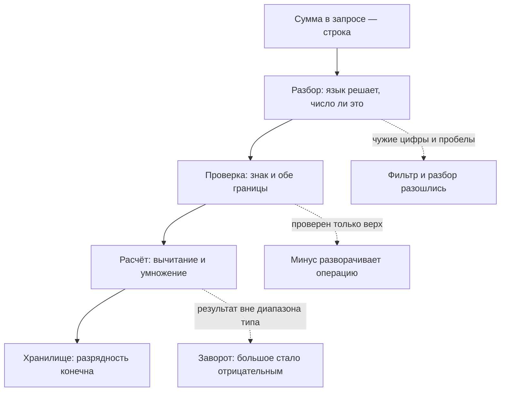

# Отрицательные значения и переполнения

Магазин принимает переводы со счёта на счёт, и проверка в коде одна: сумма
не больше остатка. Условие честное, и прогон стенда это подтверждает — но
только дважды из трёх.

**Прогон стенда**

```text
баланс 100, перевод     50: остаток 50
баланс 100, перевод    150: отказ
баланс 100, перевод  -1000: остаток 1100
```

Третья строка прошла честно: минус тысяча меньше ста, и условие истинно.
Вычитание отрицательной суммы пополнило счёт отправителя, то есть перевод
развернулся в обратную сторону. Проверка закрыла верхнюю границу и
промолчала про нижнюю: в форме минуса нет, а в запросе, собранном вручную,
он есть. Дальше разберём три дефекта, которые живут на числе из запроса, —
знак, запись и разряды, — и соберём проверку, закрывающую все три.

## Одна проверка на две стороны

Правило предметной области почти всегда задаёт величину с двух сторон.
Количество живёт от единицы до остатка на складе, сумма — от копейки до
предела перевода. Проверка в коде обычно закрывает одну сторону, верхнюю.
Нижняя кажется невозможной, потому что форма не даёт ввести минус, — и вся
защита нижней границы держится на разметке, которой в ручном запросе нет.

**Откуда это взялось.** Проверка родилась из вопроса «хватит ли»: хватит ли
товара на складе, хватит ли денег на счёте. Вопрос естественный, и ответ на
него — сравнение сверху. Нижняя граница в этом вопросе не возникает вовсе:
никто не собирался заказывать минус три единицы. Пока значение вводили
через форму, нижнюю границу держала разметка поля. Как только запрос стало
можно собрать вручную, у величины появилась вторая сторона, которую никто
не описывал.

**Зачем это в работе AppSec-инженера.** Проверка знака, диапазона и формата
числа из запроса требуется прямо, а логика часто ждёт, что результат
окажется больше исходного, и получает очень маленькое или отрицательное.
Тема даёт один вопрос к любому числу из запроса: чем закрыта его нижняя
граница и что произойдёт на верхней. Допущение «ввод будет обычным», из
которого этот класс растёт, разобрано в теме `business-logic-flaws`.

## Как это работает

Под одним заголовком живут три разных дефекта. Первый — знак:
отрицательное значение проходит проверку «не больше» и разворачивает
операцию. Второй — запись: разбор числа принимает больше, чем проверка по
диапазону `0-9`, и фильтр с разбором расходятся. Третий — разряды: слишком
большое значение не помещается в отведённые разряды и превращается в
маленькое или отрицательное. Разберём их по порядку нарастания устройства:
сначала знак, потом запись числа, потом разряды. Отдельным случаем в конце
стоит нечисло: оно приходит не через разбор целого и ломает не границу, а
само сравнение.

### Минус проходит проверку

Стенд повторяет пример академии PortSwigger: перевод, у которого проверен
только верхний предел.

```bash
python e05-numbers.py
```

**Вывод стенда**

```text
=== А. проверка только сверху ===
  баланс 100, перевод     50: остаток 50
  баланс 100, перевод    150: отказ
  баланс 100, перевод  -1000: остаток 1100

=== Б. количество в корзине ===
  цена 1999, остаток 10, количество     2: 3998
  цена 1999, остаток 10, количество   999: нет на складе
  цена 1999, остаток 10, количество    -3: -5997
```

Третья строка каждого раздела — дефект. Условие `amount <= balance` для
минус тысячи истинно, и перевод проходит: сумма уходит со счёта получателя
к отправителю. Академия описывает ровно этот случай и добавляет важное:
такой ввод отсекается интерфейсом, поэтому его редко пробуют при
тестировании.

Раздел Б повторяет ту же ошибку на количестве товара. Условие `qty > stock`
отсекает избыток, а отрицательное количество даёт отрицательную сумму
строки и уменьшает итог заказа. Дальше этот итог встречается с округлением
из темы `money-rounding` и с порядком шагов из `business-logic-flaws`.

Оба прогона сводятся к одному правилу: условие отсекает то, о чём его
спросили, и молчит о том, о чём спросить забыли. Найдите в своём коде
величины, которые проверяются только сверху: чем закрыта их нижняя
сторона, если закрыта вообще?

### Что язык считает числом

Число в запросе приходит строкой, и прежде чем его сравнивать, строку
разбирают: функция разбора читает запись и строит целое. В Python это вызов
`int()`, и у него своё мнение о том, как выглядит число. Проверка «состоит
из цифр» кажется полной ровно до прогона.

**Вывод стенда**

```text
=== В. что int() принимает за число ===
  int(    '10') = 10     цифры: ONE/ZERO
  int(  ' 10 ') = 10     цифры: ONE/ZERO
  int(   '1_0') = 10     цифры: ONE/ZERO
  int(    '０１') = 1      цифры: ZERO/ONE
  int(     '٣') = 3      цифры: THREE
  int(    '१०') = 10     цифры: ONE/ZERO
  int(  '10.0') -> ValueError
  int(   '1e2') -> ValueError

=== Г. предел разбора длинного числа ===
  sys.get_int_max_str_digits() = 4300
  int("1" * 4300) — принято
  int("1" * 4301) -> ValueError
```

Колонка справа называет знаки по каталогу Unicode: видно, что разбор
принимает не только привычные цифры. Подчёркивание внутри числа
заведено для записей вроде `1_000_000`, чтобы глаз не считал нули. Пробелы
по краям срезаются. Полноширинные цифры из типографики CJK-письменностей,
арабо-индийские цифры и цифры деванагари для языка — законные записи
целого. А вот `10.0` и `1e2` отвергаются: это записи дробного числа, а не
целого.

Следствие практическое. Проверка регулярным выражением по диапазону `0-9`
и разбор числа расходятся: выражение пропускает только привычные цифры, а
разбор принимает шире. На этом расхождении живёт целый класс обходов
фильтров. Строка не прошла одну проверку и прошла другую, и дальше всё
решает то, чья проверка стоит на входе.

Прогон Г показывает границу, которую ставит сам язык. Разбор десятичной
записи длиннее 4300 цифр отвергается. Перевод длинной записи в целое стоит
процессорного времени, и без предела одной записью можно занять сервер
надолго. Это защита от расхода времени, а не проверка величины:
четыре тысячи цифр проходят её, поэтому полагаться на неё как на границу
суммы нельзя.

### Где число теряет разряды

Целое в Python не переполняется: язык сам добавляет разряды, пока хватает
памяти. Это усыпляет, потому что границы стоят там, где число покидает
язык. У типа с фиксированной разрядностью диапазон конечен: тридцатидвухбитный
знаковый тип хранит значения от минус 2 147 483 648 до 2 147 483 647.
Знаковым он называется, потому что хранит и отрицательные значения, а
беззнаковый хранит только от нуля вверх.

Бытовой пример — одометр, счётчик пробега на панели машины. У механического
одометра шесть барабанов, и после 999 999 километров он показывает 000 000:
старшему разряду некуда переноситься. Такое поведение называют заворотом:
значение перешагнуло край диапазона и появилось с другого края. Где
аналогия ломается: ноль одометра стоит на краю его диапазона. У знакового
типа ноль посередине, поэтому заворот прыгает из самого большого плюса
сразу в самый большой минус.

У прогона Ж три границы, по одной на каждый способ, которым число покидает
язык. Первый — упаковка в бинарный формат: функция `struct` складывает
значение в байты по шаблону, и шаблон `<i` означает ровно тридцатидвухбитное
знаковое целое. Второй — запись в базу: колонка `INTEGER` в SQLite хранит
шестидесятичетырёхбитное знаковое, и шире него значению места нет. Третий —
вызов кода на C: библиотека `ctypes` передаёт число в чужую функцию,
приведя его к типу из C, а там разрядность фиксирована.

**Вывод стенда**

```text
=== Ж. разрядность за пределами Python ===
  struct <i: 2147483648 -> struct.error (вне диапазона)
  SQLite INTEGER: 9223372036854775807 записано
  SQLite INTEGER: 9223372036854775808 -> OverflowError (не влезает)
  ctypes c_int32(2**31) -> -2147483648

=== З. потеря точности при переводе в float ===
  float(9007199254740992) == float(9007199254740993): True
```

Граница здесь видна вживую: самое большое целое ещё записывается, а
следующее за ним уже отвергнуто, и упаковка в `struct` тоже отвечает
отказом. Это лучший из исходов: система сказала «нет», а не сделала тихо
неверное. Четвёртая строка показывает заворот вживую — то же число в
тридцатидвухбитном знаковом типе становится отрицательным без всякой
ошибки. Реестр CWE, каталог типовых слабостей, который ведёт организация
MITRE, описывает этот
класс карточкой CWE-190: логика ждёт роста, а получает очень маленькое или
отрицательное значение. Зеркальная карточка CWE-191 описывает тот же шаг
через нижний край диапазона.

Последняя строка — тихий случай. Устройство числа с плавающей точкой
разбирает тема `money-rounding`; здесь важно следствие. Целое больше двух
в пятьдесят третьей степени не помещается в двоичную дробь без потери, и
два разных числа становятся одним. Идентификатор заказа, ушедший в браузер
числом, вернётся соседним значением, и никакой ошибки при этом не будет.

Отдельно стоит нечисло, особое значение NaN. В прогон В оно не попало
неспроста: разбор целого его не возвращает никогда. Приходит оно туда, где
значение читают как дробное: вызов `float("nan")` принимает строку «nan»,
а разборщик JSON в Python по умолчанию принимает константу `NaN`. У отметки
удивительное свойство: все сравнения с ней ложны сразу, и «больше тысячи»,
и «не больше тысячи». Поэтому проверка на отклоняющем условии — «отклонить,
если больше предела» — такое значение пропускает: условие ложно, и отказа
не случается.

Три дефекта срываются с пути числа на разных шагах, и картина целиком
такая.



**Описание схемы.** Схема читается сверху вниз и показывает путь числа
через приложение. Строка из запроса разбирается в целое, целое проверяется,
участвует в расчёте и записывается в хранилище. Три пунктирные ветки — три
дефекта темы, и каждый срывается с прямого пути на своём шаге.

Из схемы следует и порядок защиты. Одной проверки на входе мало, потому что
заворот случается уже после неё, на шаге расчёта. Границы нужны на каждом
шаге, где значение может испортиться.

## Как это атакуют

У атакующего работы меньше, чем у ревьюера: код не нужен, нужен ручной
запрос. Приём уже знаком по теме `business-logic-flaws`: пробовать
значения, которых законный пользователь не введёт никогда. Академия
PortSwigger советует этот порядок прямо — очень большие, очень маленькие,
необычайно длинные.

По этой теме порядок такой. Сначала минус единица и ноль — самый дешёвый
пробный камень. Затем границы типов: 2147483647 и 2147483648 для
тридцати двух разрядов, 9223372036854775807 для шестидесяти четырёх. Потом
форма записи: пробелы по краям, подчёркивание, чужие цифры, запись в четыре
тысячи знаков.

Ответ читают по итогу операции. Баланс вырос после списания — сработал
первый дефект. Принято значение, которое не обязано пройти, — второй.
Молчаливый заворот выдаёт себя странным итогом: счёт увеличился после
перевода, заказ подешевел после добавления товара.

## Как это выглядит в коде

Ревьюер ищет два признака: сравнение с одной стороной и приведение типа без
границ. Разбор ниже идёт двумя планами: найти, где строка запроса стала
числом, и назвать, какие границы у числа спросили. Найдите обе границы
проверки раньше выносок — и заметьте, какой из них нет.

```python
# УЯЗВИМО — демонстрация, не для продакшена
def transfer(account, req):
    amount = int(req["amount"])          # (1)
    if amount > account.balance:         # (2)
        raise ValueError("недостаточно средств")
    account.balance -= amount
    return account.balance
```

1. Строка стала числом без границ: принимается и минус, и запись любой
   длины, и чужие цифры.
2. Сравнение только сверху: нижней границы нет, и минус проходит.

Соседний признак живёт в описании интерфейса. Из темы `rest-and-graphql` вы
помните, что API описывают схемой, документом, который объявляет поля
запроса и их типы. Поле, объявленное `integer` без `minimum` и `maximum`, —
то же сравнение с одной стороной, только записанное в схеме: тип закрыт,
диапазон нет.

## Как защититься

Защита складывается из четырёх проверок, и каждая закрывает свою ветку со
схемы выше.

- **Границы с обеих сторон и по правилу, а не по типу.** Количество — от
  единицы до остатка, сумма — от копейки до предела перевода. Каталог
  требований ASVS велит проверять ввод против ожиданий предметной области:
  по списку разрешённых значений, образцу или диапазону (v5.0-2.2.1).
- **Знак, диапазон и формат против переполнения.** Требование названо в
  каталоге прямо (ASVS v5.0-1.4.2). MITRE советует то же в карточке
  CWE-190: беззнаковый тип там, где значение не бывает отрицательным, а при
  знаковом — проверка и минимума, и максимума.
- **Разбор на границе языка, а не после неё.** Число разбирается один раз,
  в известном месте, с явной верхней границей длины записи. Всё, что не
  прошло разбор, отвергается целиком, до всякого сравнения.
- **Согласованность связанных величин.** Отдельное требование
  (ASVS v5.0-2.2.3): сочетание значений проверяется на разумность, а не
  каждое поле по отдельности. Сумма, скидка и итог заказа обязаны сходиться
  друг с другом.

### Исправленный вариант

Три вопроса закрываются тремя проверками, и каждая стоит до арифметики.

```python
# Исправлено: форма записи, длина записи, обе границы диапазона.
MAX_TRANSFER = 1_000_000
MAX_DIGITS = len(str(MAX_TRANSFER))

def transfer(account, req):
    raw = req["amount"]
    if not isinstance(raw, str) or not raw.isascii() or not raw.isdigit():
        raise ValueError("сумма должна быть записана арабскими цифрами")
    if len(raw) > MAX_DIGITS:
        raise ValueError("запись суммы слишком длинная")
    amount = int(raw)
    if not 1 <= amount <= min(account.balance, MAX_TRANSFER):
        raise ValueError("сумма вне допустимого диапазона")
    account.balance -= amount
    return account.balance
```

Форма записи отсекает чужие цифры, подчёркивания, знаки и нечисло: минус
состоит не из цифр, поэтому не проходит уже здесь. Граница длины не даёт
прислать вместо суммы запись в четыре тысячи знаков. Диапазон закрывает
ноль и избыток: верхняя граница складывается из остатка и предела перевода,
а не из одного остатка.

**Где это не работает.** Проверка на входе не спасает от переполнения
внутри расчёта. Произведение двух допустимых величин выходит за границу
типа там, где разрядность конечна: цена и количество по отдельности
разумны, а их произведение в тридцатидвухбитном типе заворачивается.
Поэтому границу ставят и на результат расчёта, а не только на слагаемые.

### Прогон тех же атак

Убеждает не написанная проверка, а повторный прогон тех же проб. Соберите
пробы из раздела «Как это атакуют» в один список и прогоните исправленный
вариант: каждая проба обязана получить отказ, а разумная сумма — пройти.

```python
# Исполняемый пример, Python 3.14: transfer — исправленный вариант выше.
class Account:
    def __init__(self, balance):
        self.balance = balance

probes = ["50", "150", "-1000", "0", "1_0", " 10", "１２", "1" * 4301]
for raw in probes:
    label = raw if len(raw) <= 8 else "«1» 4301 раз"
    try:
        left = transfer(Account(100), {"amount": raw})
        print(f"  перевод {label:>12}: остаток {left}")
    except ValueError as e:
        print(f"  перевод {label:>12}: отказ — {e}")
```

**Вывод прогона**

```text
  перевод           50: остаток 50
  перевод          150: отказ — сумма вне допустимого диапазона
  перевод        -1000: отказ — сумма должна быть записана арабскими цифрами
  перевод            0: отказ — сумма вне допустимого диапазона
  перевод          1_0: отказ — сумма должна быть записана арабскими цифрами
  перевод           10: отказ — сумма должна быть записана арабскими цифрами
  перевод           １２: отказ — сумма должна быть записана арабскими цифрами
  перевод «1» 4301 раз: отказ — запись суммы слишком длинная
```

Вывод читают по колонке итога. Единственный пропуск — перевод пятидесяти:
он внутри диапазона и обязан пройти. Всё остальное отклонено, причём
разными проверками: минус и чужие записи отсеяла форма, ноль и избыток —
диапазон, длинную запись — граница длины. Подпись причины показывает, что
каждая проверка несёт свой участок, а не дублирует соседнюю.

Полезен и обратный прогон: уберите одну из проверок и убедитесь, что её
проба проходит. Тест, который остаётся зелёным при сломанной проверке,
ничего не проверяет.

## Частая ошибка

Сначала ваш ответ: если поле объявлено числом, о диапазоне можно не думать?

Тип как будто решает за границы: поле объявлено числом, чужого туда не
положишь, значит, диапазон закрывать не нужно.

**Тип отвечает на вопрос «какого рода значение», а границы — на вопрос
«какое именно», и второй вопрос тип не решает.** Контрпример из первого
прогона — перевод на минус тысячу: он проходит проверку остатка и
разворачивает операцию. Значение целое, поле объявлено верно, а правило
нарушено.

Представление держится на том, что нижнюю границу подразумевают, а не
записывают. Против него академия PortSwigger советует практический приём:
пробовать значения, которых законный пользователь не введёт никогда. Очень
большие, очень маленькие, необычайно длинные — и смотреть, какие пределы
приложение вообще признаёт.

## Чеклист для ревью

1. Проверьте, что величина из запроса проверена и снизу, и сверху по правилу
   предметной области, а не только по типу (ASVS v5.0-2.2.1).
2. Проверьте, что знак, диапазон и формат проверяются для предотвращения
   переполнения (ASVS v5.0-1.4.2).
3. Проверьте, что разбор числа выполняется один раз, в известном месте, и
   отвергает записи с чужими цифрами, разделителями и пробелами.
4. Проверьте, что длина десятичной записи ограничена явно, а не пределом
   разбора в языке.
5. Проверьте, что границы поставлены и на результат расчёта, а не только на
   входные величины.
6. Проверьте, что значения, не ставшие числом при разборе, отвергаются до
   сравнения, а не проходят его молча.
7. Проверьте, что сочетание связанных величин проверяется на разумность
   (ASVS v5.0-2.2.3).

## Попробуй сам

Возьмите форму или интерфейс, принимающий число, и выпишите для каждого
поля четыре ответа: какой тип, какая нижняя граница, какая верхняя, что
происходит за границами. Отправьте по каждому полю четыре пробы: минус
единицу, ноль, значение на порядок больше разумного и запись из четырёх
тысяч цифр.

Одна подсказка: нижней границы чаще всего нет вовсе. Ищите условия вида «не
больше остатка», где снизу не проверяется ничего.

**Критерий:** для каждого поля названы обе границы и источник, откуда они
взяты. По каждой из четырёх проб записано наблюдаемое поведение: отказ,
принятие или ошибка.

## Проверь себя

1. Контракт перевода описан схемой:

   ```yaml
   TransferRequest:
     type: object
     properties:
       amount:
         type: integer
       to:
         type: string
   ```

   Поле объявлено числом, и схема будет проверена до кода. Какие две границы
   здесь всё равно не закрыты?

2. Проверка перевода из раздела «Как это выглядит в коде» смотрит только
   вверх:

   ```python
   def transfer(account, req):
       amount = int(req["amount"])
       if amount > account.balance:
           raise ValueError("недостаточно средств")
       account.balance -= amount
       return account.balance
   ```

   Какую починку вы выберете?

   A. Добавить проверку `isinstance(amount, int)` и отвергать остальное.

   B. Проверять форму записи (только привычные цифры), длину записи и обе
      границы диапазона.

   C. Положиться на предел разбора языка: запись длиннее 4300 цифр он и так
      отвергнет.

3. Почему сравнение «отклонить, если больше предела» не отсекает значение,
   которое числом не стало?
4. Предскажите, что напечатает этот фрагмент, — на каком расхождении
   строится обход фильтра?

   ```python
   import re
   ok = re.compile(r"^[0-9]+$")
   for s in ["10", "１２", "1_0", " 10"]:
       mark = "да" if ok.match(s) else "нет"
       print(repr(s), "| выражение:", mark, "| int():", end=" ")
       try:
           print(int(s))
       except ValueError:
           print("ValueError")
   ```

5. Возврат к теме `business-logic-flaws`: какое из четырёх допущений
   разработчика порождает этот класс и почему форма его маскирует?
6. Возврат к теме `money-rounding`: почему идентификатор заказа, ушедший
   клиенту числом в JSON, теряет так же, как цена?

<details markdown="1">
<summary>Ответ 1</summary>

1. Нижняя и верхняя. `integer` без `minimum` и `maximum` — то же сравнение с
   одной стороной, записанное в схеме. Тип отвечает на вопрос «какого рода
   значение» и не отвечает на вопрос «какое именно». Минус единица и число из
   тысячи цифр — законные целые для этой схемы. Границы задаёт правило
   предметной области: сумма от копейки до предела перевода.

</details>

<details markdown="1">
<summary>Ответ 2: разбор вариантов</summary>

2. Верный ответ — B.

   A. Тип закрывает вид значения и не закрывает его величину: минус тысяча —
      целое число и такую проверку пройдёт, а перевод развернётся в обратную
      сторону. Это ровно ловушка темы: «поле объявлено числом» не решает
      вопрос о диапазоне.

   B. Три проверки закрывают три разных вопроса. Форма записи отсекает чужие
      цифры и нечисло, граница длины — записи в тысячи знаков, диапазон —
      минус, ноль и избыток. Прогон из раздела
      «Как защититься» отвечает отказом на `-1000` при остатке 100.

   C. Предел разбора — защита от расхода процессорного времени, а не проверка
      величины: четыре тысячи цифр проходят его, и ни знак, ни разумность
      суммы он не оценивает.

</details>

<details markdown="1">
<summary>Ответ 3</summary>

3. Все сравнения с `NaN` ложны сразу — и «больше», и «не больше». Условие
   «отклонить, если больше предела» не срабатывает, и значение проходит
   дальше. Поэтому нечисло отвергается до сравнения, а не через него.

</details>

<details markdown="1">
<summary>Ответ 4</summary>

4. `'10'` проходит обе проверки; `'１２'`, `'1_0'` и `' 10'` выражение
   отвергает, а `int()` принимает — как `12`, `10` и `10`. Фрагмент прогнан
   локально 2026-10-03 на Python 3.14.7: вывод совпал дословно. Разбор
   принимает сверх ожидаемого набора цифр подчёркивание, пробелы и
   полноширинные знаки, и на расхождении «проверка по выражению против
   разбора числа» живёт целый класс обходов фильтров.

</details>

<details markdown="1">
<summary>Ответ 5</summary>

5. Допущение «ввод будет обычным». Форма подставляет поле нужного типа и не
   даёт ввести минус, поэтому нижняя граница нигде не записывается — она
   держится разметкой, которой в запросе нет.

</details>

<details markdown="1">
<summary>Ответ 6</summary>

6. Граница та же — двоичная дробь. Целое больше двух в пятьдесят третьей
   степени не помещается в неё без потери. `9007199254740993` вернётся как
   `9007199254740992` — два разных идентификатора станут одним без всякой
   ошибки.

</details>

## Источники

1. MITRE, «CWE-190: Integer Overflow or Wraparound», CWE 4.20; реестр
   `cwe-190`. Разделы: описание и альтернативные названия, последствия для
   решений о квотах и пределах, меры уровня требований, выбора языка и
   реализации; зеркальный класс CWE-191.
   <https://cwe.mitre.org/data/definitions/190.html>
2. PortSwigger Web Security Academy, «Business logic vulnerabilities»;
   реестр `ps-business-logic`. Разделы страницы примеров: неспособность
   обработать необычный ввод, перевод с отрицательной суммой, подбор значений
   вне разумного диапазона.
   <https://portswigger.net/web-security/logic-flaws>

Каркас этапа: `owasp-asvs-5-document` (ASVS v5.0.0), `owasp-wstg-42`,
`owasp-top10-2025`. Наследуются всеми темами и отдельной строкой не
повторяются.

**Скоропортящийся слой.** Предел разбора десятичной записи и набор принимаемых
цифр привязаны к версии языка; в других языках и то и другое иное. Границы
разрядности зависят от целевого типа и платформы: приведённые числа сняты на
шестидесятичетырёхбитной сборке.

**Маркеры уверенности.** Прохождение отрицательного значения через проверку
верхней границы, набор записей, принимаемых разбором целого, предел длины
записи, поведение нечисла, границы разрядности и потеря точности при переводе
в двоичную дробь — **проверено лично** 2026-08-24 на Python 3.14.7 и SQLite
3.53.4 (стенд `e05-numbers.py`) и перепроверено 2026-10-03 на тех же версиях:
выводы совпали, включая остаток 1100 при переводе `-1000` с баланса 100,
предел в 4300 цифр, ложь обоих сравнений с `NaN`, отказ упаковки 2147483648,
заворот до −2147483648 через `ctypes`, отказ SQLite на 2**63 и слияние
`9007199254740992` с `9007199254740993` в двоичной дроби. Путь, которым
нечисло приходит из запроса, — **проверено лично** 2026-10-03: `float("nan")`
принимает строку «nan», разборщик JSON по умолчанию принимает константу `NaN`
в теле, а деление нуля на ноль в Python поднимает `ZeroDivisionError`, поэтому
пример с делением из текста убран. Прогон исправленного варианта из раздела
«Как защититься» — **проверено лично** 2026-10-03 на Python 3.14.7: из восьми
проб прошла только разумная сумма, вывод приведён дословно. Описание класса и меры — **по документации** (CWE-190, CWE 4.20,
открыт лично 2026-08-24). Пример перевода с отрицательной суммой и приём
подбора значений вне разумного диапазона — **по документации** (раздел
примеров академии, открыт лично 2026-08-24). Отсутствие CWE-190 и CWE-191 в
перечнях категорий издания OWASP 2025 года — **проверено лично** 2026-08-24
поиском по разделам «List of Mapped CWEs» десяти категорий. Поведение других
языков и типов СУБД **не воспроизводилось**.
