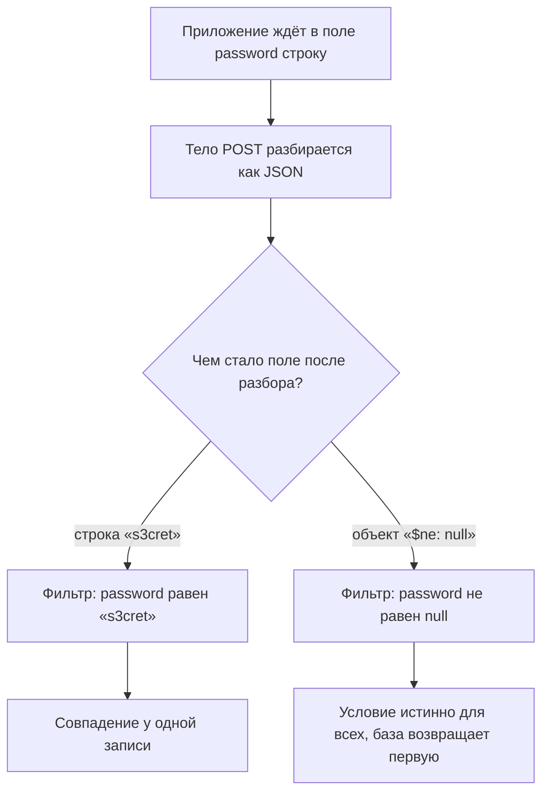
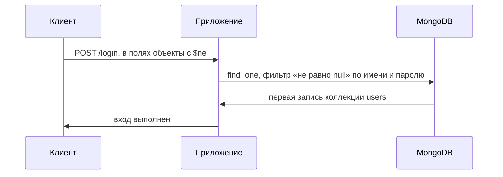

# NoSQL-инъекции: операторы MongoDB

Вот тело запроса на вход в учётную запись, присланное обычным POST, как его
шлёт форма входа любого сайта:

```json
{"username": {"$ne": null}, "password": {"$ne": null}}
```

Здесь нет сломанной кавычки, как в классической SQL-инъекции, и нет склейки
строк: запрос к этой базе вообще не строка. И тем не менее вход проходит без
пароля: приложение ждало от поля `password` строку, а получило объект.
Оператор `$ne`, «не равно», стал частью условия, по которому база отбирает
записи. Условие «пароль равен присланному» превратилось в «пароль не равен
null», истинное для каждой записи. База вернула первого пользователя, и
приложение впустило атакующего как этого пользователя.

Это NoSQL-инъекция: как и в теме `sqli-basics`, данные из запроса стали
частью команды. Только командой здесь служит не строка, а структура, и данные
дотягиваются до её оператора.

## Запрос как объект, а не строка

MongoDB — документная база: вместо таблиц с одинаковыми колонками она хранит
документы, объекты с полями, устроенные как JSON. Документы одного назначения
лежат в коллекции. Учётные записи из примера выше — документы коллекции
`users` с полями `username` и `password`. Жёсткой схемы, как у таблицы, здесь
нет: набор полей у документов может различаться.

Чтобы выбрать документы, приложение задаёт фильтр — условие отбора, какие
поля чему должны быть равны. Фильтр в MongoDB — тоже объект. Запрос к базе
не собирается из текста, а строится как структура: поле, значение и, при
желании, оператор.

Бытовой пример — библиотечная картотека. В ящике лежат карточки, у каждой
поля: автор, название, год. Чтобы найти книгу, вы заполняете бланк отбора:
название — «Война и мир». Библиотекарь идёт по ящику и отдаёт карточки,
которые подходят под условие. Соответствие такое: карточка — это документ,
поле карточки — поле документа, ящик — коллекция, бланк — фильтр, а
библиотекарь — сама база.

Условие на бланке не обязано быть равенством. У MongoDB есть операторы
запроса: `$ne` — «не равно», `$gt` — «больше», `$regex` — «подходит под
шаблон». На бланке это выглядело бы как «год больше 2000». Здесь аналогия и
ломается: библиотекарь, получивший в строке «название» запись «не равно
пустому месту», удивился бы и отказал. Программа не удивляется. Она
проверяет тип присланного только там, где эту проверку кто-то написал.

Теперь главное. Обработчик входа берёт из тела запроса два поля и строит из
них фильтр:

```text
фильтр = { "username": <имя>, "password": <пароль> }
```

Когда присланное — строки, фильтр ищет точное совпадение. Но JSON передаёт не
только строки: объект из тела после разбора остаётся объектом и в коде,
в Python это словарь. Проверки, что в поле пришла строка, никто не написал.
Объект с оператором встаёт в фильтр на место значения, и запрос меняет смысл.

## Как это работает

**Откуда это взялось.** SQL-инъекция живёт в том, что команда — текст, и
данные склеивают в этот текст; механизм «источник, путь, сток, отсутствующий
контроль» разобран в `sqli-basics`. Документные базы ушли от текста: запрос
к MongoDB — структура данных, и склеивать нечего. Казалось, инъекция этим
закрыта. Но API стали принимать от клиента готовые структуры: JSON-тело
разбирается в объекты языка и подставляется в запрос напрямую, как это
устроено в теме `rest-and-graphql`. Данные снова получили доступ к тому, что
раньше решал только код, — к выбору оператора. Форма инъекции сменилась,
причина осталась.

### Две формы инъекции

Web Security Academy, учебный полигон авторов Burp Suite, делит NoSQL-инъекцию
на две формы.

**Синтаксическая** — знакомая по SQL: сломать разбор выражения. MongoDB умеет
исполнять код на JavaScript прямо внутри запроса, оператором `$where`. Если
приложение отдаёт базе присланную строку как такое выражение, кавычка снова
решает всё: `'||'1'=='1` превращает условие в истинное для всех записей.
Случай редкий, потому что приложение ещё должно согласиться исполнять
присланное.

**Операторная** — своя для документных баз, и потому основная. Ломать ничего
не нужно: вместо строки присылают объект с оператором, и приложение само
подставляет его в фильтр. Кавычек в запросе-объекте нет, поэтому и обходить
нечего. Дальше тема разбирает именно эту форму.

### Как поле становится оператором

Проследим судьбу поля `password` от тела запроса до базы:



**Описание схемы.** Схема читается сверху вниз и показывает две судьбы одного
поля. Слева честный вход: строка из тела уходит в фильтр как значение, и
совпадает одна запись. Справа вход из начала темы: объект из тела уходит в
фильтр как условие с оператором, и условие истинно для всех записей.

Это проверено прогоном, а не выведено по схеме. Разбор тела функцией
`json.loads` превращает поле `password` из запроса-обхода в словарь
`{'$ne': None}`, тогда как честный вход даёт строку. Словарь внутри фильтра —
не значение, а условие: MongoDB читает ключ с `$` как оператор. Сам прогон
стоит в блоке «Попробуй сам», и база для него не нужна.

**Зачем это в работе AppSec-инженера.** MongoDB и подобные базы называют в
требованиях вакансий, а операторная инъекция — типовой дефект API,
принимающего JSON. Ревьюеру важно узнать её в коде: место, где значение из
тела запроса уходит в фильтр напрямую, без проверки, что это строка.
Механизм «источник — путь — сток — отсутствующий контроль» уже знаком по
`sqli-basics`; здесь меняется только форма команды.

## Как это атакуют

Запрос входа сравнивает присланные имя и пароль с записью. Когда они —
строки, фильтр ищет точное совпадение. Атакующий шлёт в теле не строки, а
объекты:

```json
{"username": {"$ne": null}, "password": {"$ne": null}}
```

Приложение строит фильтр, не глядя на типы, и база выполняет новое условие:
имя не равно `null` и пароль не равен `null`. Обе половины истинны для
каждой записи, поэтому запрос возвращает первого пользователя коллекции. Вход
пройден без знания пароля.



**Описание схемы.** Обмен читается сверху вниз. Клиент присылает тело, где
вместо строк стоят объекты с оператором. Приложение переносит их в фильтр как
есть, и база честно выполняет полученное условие: оно истинно для всех
записей. Ответ базы — первый пользователь, и приложение считает вход
успешным.

### Тот же приём через строку запроса

JSON — не единственная дверь. Когда параметры приходят в строке запроса, там
всё — строки, и тип теряется. Но у фреймворков есть разборщик параметров,
часть фреймворка, которая превращает строку запроса в структуру данных.
Многие разборщики понимают запись со скобками как вложенный объект. Поэтому
атакующий заменяет `username=wiener` на `username[$ne]=invalid`, и разборщик
собирает из этого объект `{"username": {"$ne": "invalid"}}`. Дальше всё идёт
как в JSON: объект встаёт в фильтр, условие меняет смысл.

### Что дают другие операторы

Оператор `$ne` доказывает одно: запись существует. Оператор `$regex`, «поле
подходит под регулярное выражение», достаёт пароль по символу. Атакующий
проверяет «начинается на a», «начинается на ab» и по ответу видит, угадан ли
следующий символ. Оператор `$gt`, «больше», сравнивает значения по порядку и
тоже даёт перебор. Разбор этих приёмов — за пределами L2; здесь важно одно:
на входе объект вместо строки.

Разбор сходится на правиле темы: дефект не в операторе `$ne`, а в
отсутствующей проверке, что присланное — строка. Скажите, не подглядывая в
текст: что сломается в этом разборе, если завтра базу сменят с MongoDB на
другую документную, а обработчик останется прежним?

## Как это выглядит в коде

Ревьюер ищет место, где значение из тела запроса уходит в фильтр без проверки
типа. Разбор идёт двумя планами: найти, где присланное входит в запрос, и
назвать, где оно получает права команды. Объект `db` — подключение к базе,
которое выдаёт драйвер, библиотека, через которую приложение говорит с базой,
а `find_one` — метод поиска одной записи по фильтру. Отметьте до чтения
выносок, в какой строке это происходит, и объясните почему.

```python
# УЯЗВИМО — демонстрация, не для продакшена
def login(body):
    user = db.users.find_one({
        "username": body["username"],   # (1)
        "password": body["password"],   # (2)
    })
    return user
```

1. План «вход в запрос»: значение берётся из разобранного JSON как есть.
   Если клиент прислал объект, в фильтр попадёт объект.
2. План «права команды»: `{"$ne": null}` здесь становится оператором фильтра,
   а не строкой пароля.

Признак дефекта — поле фильтра, равное значению из тела запроса, без
приведения к строке и без проверки, что это не объект. Оператор `$where` с
присланным кодом — отдельный, более явный признак: там приложение исполняет
присланное.

## Как защититься

Два приёма, оба про то, чтобы данные не стали оператором.

**Привести к ожидаемому типу.** Поле, которое обязано быть строкой,
приводится к строке до запроса. Объект `{"$ne": null}`, приведённый к строке,
уже не оператор, а текст `{'$ne': None}`. Такого пароля нет ни у одной
записи, и обход не проходит.

```python
# Исправлено.
def login(body):
    username = str(body["username"])   # (1)
    password = str(body["password"])
    user = db.users.find_one({"username": username, "password": password})
    return user
```

1. Приведение к строке снимает операторную инъекцию: в фильтр уходит строка,
   а не объект. Проверять стоит и явно — отвергать значение, если оно не
   строка. Иначе `str({...})` молча превратится в мусорную строку, и ошибка
   клиента останется незамеченной.

**Список разрешённых ключей.** Там, где фильтр строится из нескольких полей,
принимают только известные ключи, а ключи, начинающиеся с `$`, отвергают.
Cheat sheet OWASP по безопасности NoSQL даёт такие меры. Клиентские
операторы `$where`, `$regex` и `$expr` запрещаются; `$expr` — оператор,
собирающий условие из выражения. Символ `$` в ключах запрещается тоже.
Запросы собираются через объекты драйвера, а не склейкой строки. А там, где
серверный JavaScript приложению не нужен, cheat sheet советует отключить его
настройкой самой базы: тогда синтаксическая форма через `$where` закрыта
целиком.

**Границы применимости.** Приведение к типу закрывает поля с фиксированным
типом. Там, где поле по замыслу принимает структуру, например сложный фильтр
отчёта, приведением не обойтись. Нужен разбор присланного в известную форму и
сборка запроса из проверенных частей, как список разрешённого в
`parameterized-queries`. Драйвер MongoDB параметризует значения сам, но
только если ему передают значение, а не объект с оператором.

### Как проверить починку

Починку проверяют тем же запросом, которым атаковали: тело с объектом в поле
пароля отправляют ещё раз. Ожидание — отказ. Если поле приводится к строке,
фильтр ищет пароль `{'$ne': None}` и не находит ни одной записи. Если
значение отвергается по типу, запрос до базы не доходит вовсе. Оба исхода
закрывают обход, и оба отличаются от поведения до починки, когда тот же
запрос возвращал первого пользователя. Ту же проверку повторяют через строку
запроса: запись `password[$ne]=x` не должна собираться разборщиком в объект.

## Частая ошибка

Форму входа перевели с SQL на MongoDB, и склейки строк в коде больше нет.
Закрыта ли инъекция? Решите до чтения дальше.

Уверенность родилась из смены базы: документная база не собирает запрос из
строки, значит, склеивать нечего и инъекции нет.

Инъекция сменила форму: команда здесь не строка, а структура, и данные
дотягиваются до оператора. Отсутствие склейки убрало синтаксическую инъекцию
и открыло операторную. Присланный объект вместо строки — тот же переход
«данные стали кодом», только код записан не текстом, а полем `$ne`.

Контрпример. Форма входа перешла с SQL на MongoDB, и разработчик уверен, что
инъекция осталась в прошлом: кавычки в имени больше ничего не ломают. Запрос
`{"username":{"$ne":null},"password":{"$ne":null}}` в теле проходит вход без
пароля. Ни одной сломанной кавычки, ни одной склейки — и полный обход
аутентификации.

## Чеклист для ревью

1. Проверьте, что поля запроса с фиксированным типом приводятся к этому типу
   до запроса, а не берутся из тела как есть (ASVS v5.0-1.2.4).
2. Проверьте, что значение поля отвергается, если это объект там, где
   ожидается строка или число.
3. Проверьте, что ключи фильтра сверяются со списком разрешённых, а ключи
   с `$` в начале отклоняются.
4. Проверьте, что оператор `$where` и серверный JavaScript отключены, если
   функция их не требует.
5. Проверьте, что разбор параметров строки запроса не собирает вложенные
   объекты из записи вида `field[$ne]=...`.

## Попробуй сам

Возьмите обработчик входа на документной базе — свой или `login` из раздела
«Как это выглядит в коде». Не атакуя чужую систему, ответьте письменно на три
вопроса. Какой тип у поля `password` при честном входе и какой — при запросе
`{"$ne": null}`? Что делает с этим объектом приведение к строке и почему
после него оператор перестаёт работать? Какой второй приём нужен, если поле
по замыслу принимает структуру?

Типы из первого вопроса видны прогоном, и база для него не нужна:

```bash
python3 - <<'EOF'
import json
honest = json.loads('{"username": "anna", "password": "s3cret"}')
attack = json.loads('{"username": "anna", "password": {"$ne": null}}')
print(type(honest["password"]).__name__)
print(type(attack["password"]).__name__, attack["password"])
EOF
```

```text
str
dict {'$ne': None}
```

Честный вход даёт строку, обход — словарь с оператором. Из этой пары и
следует починка темы: привести поле к строке до запроса. Прогон выполнен на
Python 3.14.7.

**Критерий выполнения** наблюдаемый: три письменных ответа. Для первого
названы оба типа (строка и объект), для второго — что оператор становится
частью строки-значения, для третьего — список разрешённых ключей и запрет
ключей с `$`.

## Проверь себя

1. Обработчик сброса пароля сверяет токен из письма:

   ```python
   def reset_password(body):
       user = db.users.find_one({
           "username": str(body["username"]),
           "reset_token": body["reset_token"],
       })
       if user is None:
           abort(403)
       set_password(user, body["new_password"])
   ```

   Атакующий шлёт `{"username": "anna", "reset_token": {"$gt": ""},
   "new_password": "x"}`. Что произойдёт и почему приведение `username` к
   строке не спасло?

2. Функция входа из раздела «Как это выглядит в коде» берёт оба поля из тела
   как есть:

   ```python
   def login(body):
       user = db.users.find_one({
           "username": body["username"],
           "password": body["password"],
       })
       return user
   ```

   Какую починку вы выберете?

   А. Запретить в теле запроса опасные символы: кавычки, скобки, точку с
      запятой.

   Б. Приводить поля к ожидаемому типу, отвергать значения-объекты там, где
      ждут строку, и отклонять ключи с `$`.

   В. Экранировать специальные символы в значениях полей, как это делали бы
      при SQL-инъекции.

3. Почему отсутствие склейки строк не означает отсутствия инъекции в MongoDB?
4. Предскажите, что напечатает этот фрагмент и почему из двух его строк
   следует починка темы.

   ```python
   import json
   body = json.loads('{"username": "admin", "password": {"$ne": null}}')
   print(type(body["password"]).__name__, body["password"])
   print(str(body["password"]))
   ```

5. Возврат к теме `sqli-basics`: что общего у SQL- и NoSQL-инъекции в рамке
   источник — путь — сток — отсутствующий контроль?
6. Возврат к теме `rest-and-graphql`: почему API, принимающий JSON-тело,
   открывает операторную форму инъекции, которой у формы
   `application/x-www-form-urlencoded` нет?

<details markdown="1">
<summary>Ответ 1</summary>

1. Пароль anna будет заменён. Поле `username` приведено к строке и безопасно,
   а `reset_token` уходит в фильтр как есть: клиент прислал объект, и `$gt`
   («больше») стал частью запроса. Условие «токен больше пустой строки»
   истинно для любого непустого токена, поэтому запись anna находится без
   знания токена. Приведение одного поля не защищает соседнее: проверять тип
   надо у каждого поля, попадающего в фильтр.

</details>

<details markdown="1">
<summary>Ответ 2: разбор вариантов</summary>

2. Верный ответ — Б.

   А. Запрет символов целится в синтаксическую форму, а здесь ломать нечего:
      кавычек в запросе к документной базе нет, команда — структура. Объект
      `{"$ne": null}` пройдёт такой фильтр, не содержа ни одного запрещённого
      символа.

   Б. Приведение к строке превращает объект в значение, и оператор перестаёт
      работать; явный отказ на не-строке не даёт `str({...})` молча стать
      мусорной строкой. Запрет ключей с `$` закрывает путь туда, где поле по
      замыслу принимает структуру.

   В. Экранировать символы в значении некуда и незачем: драйвер и так передаёт
      значение как значение. Дефект в том, что вместо значения приезжает
      объект с оператором, — экранирование типа не меняет.

</details>

<details markdown="1">
<summary>Ответ 3</summary>

3. Команда в MongoDB — структура, а не строка. Данные дотягиваются не до
   кавычки, а до оператора: присланный объект становится частью фильтра.
   Склейка строк убрала синтаксическую инъекцию и открыла операторную.

</details>

<details markdown="1">
<summary>Ответ 4</summary>

4. Первая строка — `dict {'$ne': None}`: поле пароля стало объектом, и `$ne`
   работает как оператор фильтра. Вторая — `{'$ne': None}`: после приведения
   оператор оказался внутри строки-значения и в фильтре ничего не решает. Из
   пары следует починка темы: привести поле к строке до запроса. Снимается
   прогоном фрагмента интерпретатором: `python3 - <<'EOF' … EOF`.

</details>

<details markdown="1">
<summary>Ответ 5</summary>

5. Источник — значение из запроса, путь — построение фильтра, сток — вызов к
   базе, отсутствующий контроль — разделение данных и команды. Меняется лишь
   форма команды: строка в SQL, структура в MongoDB.

</details>

<details markdown="1">
<summary>Ответ 6</summary>

6. JSON сохраняет типы: присланный объект доезжает до кода объектом, и поле
   фильтра можно подменить структурой. В строке запроса всё — строки, тип
   теряется, и операторная форма там появляется только через разборщик,
   собирающий вложенный объект из записи вида `field[$ne]=...`.

</details>

## Источники

1. PortSwigger Web Security Academy, «NoSQL injection»; реестр `ps-nosqli`.
   Разделы: Types of NoSQL injection, NoSQL operator injection, Submitting
   query operators, Exploiting syntax injection.
   <https://portswigger.net/web-security/nosql-injection>
2. OWASP NoSQL Security Cheat Sheet; реестр `owasp-cs-nosql-security`. Разделы:
   Safe Query APIs, disallow client-controlled query operators (`$where`,
   `$regex`, `$expr`), reject operator injection by disallowing `$` in keys.
   <https://cheatsheetseries.owasp.org/cheatsheets/NoSQL_Security_Cheat_Sheet.html>

Каркас этапа: `owasp-asvs-5-document` (ASVS v5.0.0), `owasp-wstg-42`,
`owasp-top10-2025`. Наследуются всеми темами и отдельной строкой не
повторяются.

**Скоропортящийся слой.** Имена и набор операторов привязаны к MongoDB и версии
драйвера: `$ne`, `$gt`, `$regex`, `$where`. Способ разбора вложенных объектов из
строки запроса зависит от библиотеки. Страница Web Security Academy — живая
площадка без даты публикации.

**Маркеры уверенности.** Форма операторной инъекции — **проверено лично**
2026-08-24 на Python 3.14.7: `json.loads('{"username":{"$ne":null},...}')`
даёт для поля `password` объект `{'$ne': None}`, тогда как честный вход даёт
строку. Прогон повторён 2026-10-03 на той же версии, вывод совпал; тогда же
выполнен фрагмент из блока «Попробуй сам», его вывод приведён на месте. Обход
входа, приёмы через строку запроса и операторы `$regex`, `$gt`, `$where` —
**по документации** (Web Security Academy, открыта лично 2026-08-24). Запрет
клиентских операторов, запрет `$` в ключах, запросы через объекты драйвера и
отключение серверного JavaScript — **по документации** (NoSQL Security Cheat
Sheet, открыт лично 2026-08-24, перепроверен 2026-09-03); приведение к типу как
защита взято из Web Security Academy. Запрос к самой MongoDB **не
воспроизводился**: базы в стенде нет, границы миссии её не предполагают.
Требование 1.2.4 (перечисляет NoSQL прямо) сверено с текстом ASVS v5.0.0
(открыт лично 2026-08-24).
