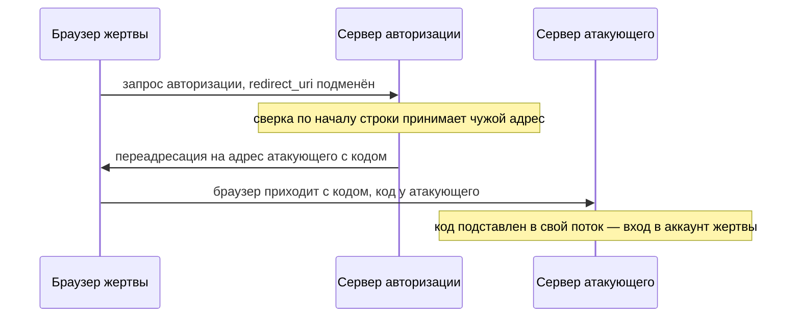
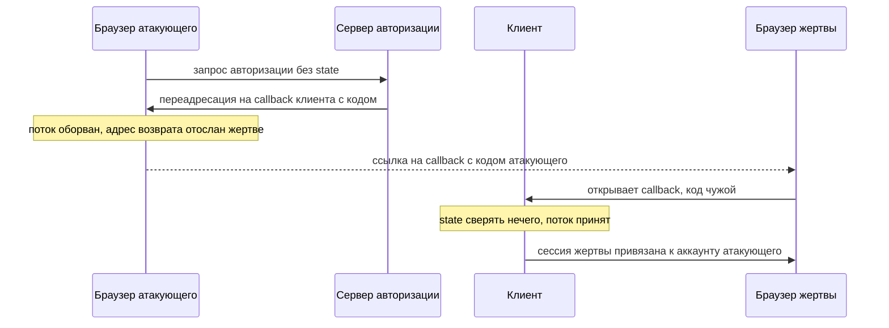

# Атаки на OAuth: `redirect_uri` и state

Утром вам приходит письмо: «Мы обновили приложение, войдите заново». Ссылка
ведёт на настоящий сервер авторизации, и страница входа настоящая. Вы вводите
пароль у своего провайдера, и тот честно выдаёт код авторизации. Вот только
адрес возврата в запросе подменён, и код уезжает на сервер атакующего. Второе
письмо из той же серии работает и без подмены адреса. Жертва нажимает ссылку,
и в её браузере завершается поток, который начинал атакующий: её сессия в
магазине оказывается связана с чужим аккаунтом.

Оба сюжета держатся на двух значениях, которые удерживают поток OAuth на
своём пути, — адресе возврата `redirect_uri` и метке потока `state`. Сам
поток и его участники разобраны в теме `oauth-basics`. Здесь — конечный
список дефектов вокруг двух параметров: куда вернуть код и чем связать поток
с тем, кто его начал.

**Зачем это в работе AppSec-инженера.** Интеграция OAuth на ревью получает
два вопроса: точно ли сервер сверяет `redirect_uri` и шлёт ли клиент
непредсказуемый `state`. Оба закрываются одним разбором перехваченного
потока: находите запрос авторизации, смотрите, что в `redirect_uri` и есть ли
`state`, затем находите возврат и смотрите, что сверяет callback.

## Как это работает

**Откуда это взялось.** Оба параметра появились как удобство, а защитой стали
потом. `redirect_uri` говорит серверу авторизации, куда вернуть браузер с
кодом: адресов у клиента может быть несколько, и запрос называет нужный.
`state` клиент придумал, чтобы узнать свой поток на возврате. Пока оба
считались служебными, никто не проверял их строго: адрес сверяли по началу
строки, `state` не слали вовсе. Оказалось, что именно они удерживают код и
токен на своём пути, и ослабление любого уводит поток.

### Адрес возврата и его сверка

Адрес возврата, или callback, — это адрес клиента, на который сервер
авторизации отправляет браузер с кодом. Клиент регистрирует свои адреса у
сервера заранее, и сервер обязан вернуть код только на зарегистрированный.
Вопрос в том, как сервер сравнивает присланный в запросе адрес с записанным
в настройках.

Нестрогая сверка — это сравнение вида «адрес начинается с
зарегистрированного». Бытовой пример — охранник, который сверяет пропуск по
первым буквам фамилии: начинается на «Смир», значит, Смирнов, проходи. Такой
охранник пропустит и Смирнова, и выдуманного Смирновского. Здесь пропуск —
адрес возврата, первые буквы — начало строки, охранник — сервер авторизации.
Аналогия ломается в одном месте: чужие фамилии совпадают случайно, а
атакующий подбирает адрес нарочно, зная, с чего начинается
зарегистрированный.

Чем это кончается, показывает стенд: сервер сверяет семь адресов-кандидатов
двумя способами, по началу строки и точным совпадением.

**Вывод стенда `e06-redirect.py`**

```text
кандидат                                префикс   точно
точный адрес                               ПУСК    ПУСК
чужой поддомен                             ПУСК    стоп
подкаталог                                 ПУСК    стоп
добавленный параметр                       ПУСК    стоп
другой хост, тот же префикс пути           стоп    стоп
localhost-обход                            стоп    стоп
чужой хост целиком                         стоп    стоп
```

Три чужих адреса проходят колонку «префикс»: чужой поддомен
`client.shop.example.evil.test`, подкаталог с обходом каталога и адрес с
дописанным параметром. По любому из них код авторизации уедет к атакующему:
браузер жертвы придёт по этому адресу с кодом в строке запроса. Точная сверка
отвергает всё, кроме одного зарегистрированного адреса.

Сам угон выглядит так.



**Описание схемы.** Схема читается сверху вниз. Жертва открывает ссылку на
запрос авторизации, где адрес возврата подменён. Сервер сверяет его нестрого
и отправляет браузер на адрес атакующего вместе с кодом. Атакующий
подставляет украденный код в поток, начатый им самим у того же клиента, и
попадает в аккаунт жертвы.

Учебный полигон PortSwigger Web Security Academy — его делают авторы Burp
Suite — добавляет к этому набор приёмов обхода нестрогой сверки. Дописать к
адресу путь, параметр или фрагмент. Столкнуть разбор адреса между частями
сервиса: одна часть читает адрес так, другая иначе. Продублировать
`redirect_uri` в запросе дважды. Сыграть на особом отношении к `localhost`.
Общее у приёмов одно: живут они только там, где сверка не точная.

Действующий свод правил безопасности OAuth отвечает однозначно: адрес
возврата сверяется точным совпадением строк, посимвольно, по правилам
сравнения адресов из RFC 3986. Этот свод — RFC 9700. Исключение в нём одно: у
нативного приложения, программы на устройстве пользователя, а не сайта в
браузере, адресом возврата служит `localhost`, и порт там разрешён любой.
Приложение занимает свободный порт в момент запуска и заранее его не знает.

### Метка потока: state

Второй параметр, `state`, уже встречался в запросе авторизации в теме
`oauth-basics`. Клиент кладёт в него непредсказуемое значение, привязанное к
сессии того, кто начал вход, и на возврате сверяет. Роль у него та же, что у
синхронизирующего токена из темы `csrf-mechanics`: отличить своё действие от
подсунутого. Разница в предмете привязки: CSRF-токен связывает с сессией
форму, а `state` связывает с ней целый поток входа.

Без `state` работает подделка завершения потока. Атакующий начинает вход в
своём браузере и доходит до переадресации на callback клиента. Поток он
обрывает, а адрес возврата со своим кодом отсылает жертве: письмом, в чате,
картинкой на странице. Жертва открывает адрес, и клиент завершает чужой поток
в её сессии, потому что отличить его от своего ему нечем.

Что это даёт атакующему, зависит от устройства входа. Если вход в приложении
только через OAuth, жертва оказывается в аккаунте атакующего: всё, что она
там введёт и сохранит, достаётся ему. Тяжелее, когда рядом есть обычный вход
и привязка внешнего профиля к существующей учётной записи. Тогда профиль
атакующего привязывается к учётной записи жертвы, и он заходит в неё своим
входом.

Стенд моделирует callback клиента дважды: с проверкой `state` и без неё.

**Вывод стенда `e07-state.py`**

```text
Атака: поток начат атакующим, завершён в браузере жертвы
  без проверки state: аккаунт привязан по коду code-attacker-aaa
  с проверкой state:  None  <- state чужой сессии не сошёлся
  честный поток жертвы: аккаунт привязан по коду code-victim-777
```

Без проверки callback принимает чужой код, и привязка проходит. С проверкой
чужой поток отвергается: присланный `state` не совпал с тем, что ждёт сессия
жертвы, а честный поток той же жертвы проходит. Этот прогон — правило темы в
миниатюре: поток держится на значении, которое атакующий не может ни
предсказать, ни подделать.



**Описание схемы.** Схема читается сверху вниз. Атакующий начинает честный
поток, но вместо завершения отсылает жертве адрес возврата со своим кодом.
Жертва открывает его, и клиент без сверки `state` не отличает чужой поток от
своего: сессия жертвы привязывается к аккаунту атакующего.

Остаётся контрольный вопрос: закрывает ли проверяемый `state` утечку кода
через Referer на странице callback? Ответ — нет. Код утекает в заголовке
Referer: браузер шлёт его с запросами к чужим ресурсам уже после возврата на
callback. Эта утечка не зависит от того, кто начинал поток, поэтому `state`
против неё ничего не решает. Дальше — про эти пути.

### Куда ещё утекает код

Даже при точной сверке адреса и проверяемом `state` код идёт через браузер
жертвы, и украсть его можно косвенно, не трогая сверку.

Первый путь — заголовок Referer. Уходя со страницы на внешний ресурс, браузер
сообщает тому адрес, с которого пришёл. Если в адресе callback был код, код
уезжает вместе с Referer: например, когда на странице callback стоит чужая
картинка или ссылка наружу. Сколько адреса уйдёт дальше, задаёт политика
`Referrer-Policy` из темы `security-headers`.

Второй путь — открытый редирект. Так называют страницу-проходную, которая
пересылает посетителя на любой адрес из параметра, например
`/out?next=https://evil.test`. Заводят проходные для учёта кликов: ссылка
ведёт на свою страницу, та считает переход и отправляет дальше. Если
проходная живёт на адресе callback, код уезжает по ней вместе с жертвой на
чужой адрес.

Третий путь — промежуточная страница. Иногда между согласием пользователя и
возвратом кода сервер авторизации показывает свою страницу, и уже с неё идёт
переход на callback клиента. Если промежуточная страница сама ведёт через
открытый редирект, код проезжает его вместе с жертвой. Полигон PortSwigger
разбирает этот сценарий отдельно: код крадут через страницу-посредника,
которой пользователь доверяет.

Действующий свод правил отвечает набором мер, и читаются они вместе. На
адресах callback не держать открытых редиректов. Гасить Referer политикой.
Привязывать код к клиенту: конфиденциальный клиент подтверждает обмен своим
секретом, публичный — привязкой PKCE из темы `oauth-basics`. Гасить код после
первого обмена.

## Как это выглядит в коде

Дефект узнаётся по двум местам: как сверяется `redirect_uri` и что происходит
со `state`. Листинг разбирается тремя планами: найти сверку адреса, назвать,
что она пропускает, найти, где в запросе появляется `state`. Найдите оба
места до чтения выносок.

```python
# УЯЗВИМО — демонстрация, не для продакшена
def validate_redirect(candidate):
    return candidate.startswith("https://client.shop.example")  # (1)

def build_auth_request(client_id, redirect):
    return f"/authorize?client_id={client_id}&redirect_uri={redirect}"
    # state в запрос не добавлен  # (2)
```

1. Сверка адреса отвечает на вопрос «начинается ли кандидат с
   зарегистрированного»: поддомен, подкаталог и дописанный параметр из
   прогона выше проходят.
2. Запрос авторизации собирается без `state`: потоку не с чем связаться, и
   на возврате клиент не отличит свой поток от подсунутого.

Признаки дефекта — три. Сверка `redirect_uri` через `startswith`, `in` или
регулярное выражение с необязательным хвостом вместо точного равенства.
Запрос авторизации без `state`. Callback, который не сверяет вернувшийся
`state` с сессией.

**Где ревьюер ошибается.** Наличие `state` в запросе ещё не защита: значение
должно быть непредсказуемым, привязанным к сессии и сверяемым на возврате.
Присланный, но не проверенный `state` — украшение. Смотреть надо на обе
стороны: и выдачу, и сверку.

## Как защититься

Правило двойное, по числу значений, удерживающих поток. Адрес возврата
сверяется точным совпадением. `state` делается непредсказуемым, привязанным
к сессии инициатора и сверяемым на возврате. Листинг решает три подзадачи:
держать зарегистрированный адрес одной константой, свести проверку адреса к
точному равенству, сделать чужой или отсутствующий `state` отказом.

```python
# Исправлено.
REGISTERED = "https://client.shop.example/callback"

def validate_redirect(candidate):
    return candidate == REGISTERED                     # (1)

def callback(session_now, code, state_returned):
    if not compare_digest(make_state(session_now), state_returned or ""):
        return None                                    # (2)
    return exchange_code(code)
```

1. Адрес сверяется точным равенством строки с константой: поддомен,
   подкаталог и дописанный параметр из прогона отвергаются все.
2. Вернувшийся `state` сравнивается с тем, что ждёт сессия инициатора;
   отсутствие значения подменяется пустой строкой и даёт отказ, а не пропуск.
   `compare_digest` сравнивает так, что время ответа не зависит от позиции
   первого различия.

RFC 9700 требует обе половины: точное совпадение `redirect_uri` (§ 4.1.3) и
защиту от подделки запроса (§ 4.7). Для второй половины названы `state`, PKCE
и `nonce` — одноразовое случайное значение, которое клиент кладёт в запрос и
потом сверяет в ответе.

**Границы применимости.** Один `state` не закрывает утечку кода вне браузера:
код стоит в строке адреса и может осесть, например, в журнале сервера. Против
этого сервер авторизации требует `redirect_uri` ещё и при обмене кода и
сверяет его с исходным запросом. Обменять украденный код можно, только назвав
тот самый адрес возврата, а вместе с секретом клиента или PKCE это привязывает
обмен к самому клиенту. Точная сверка адреса не спасает, если на самом
callback живёт открытый редирект: его убирают отдельно. Публичный клиент
вместо секрета привязывает обмен через PKCE.

**Что добавляется поверх.** Код гасят после первого обмена: повторное
предъявление того же кода — признак перехвата. Область (`scope`) при обмене
сверяют с исходным запросом, иначе клиент атакующего «повысит» токен,
запросив шире, чем согласовал владелец. Referer с callback гасят политикой.

## Частая ошибка

Решите, не читая дальше: вход в приложении возможен только через OAuth,
пароля рядом нет — нужен ли там `state`?

Расхожий ответ звучит так: `state` нужен, только если рядом с OAuth есть
вход по паролю, а при входе исключительно через OAuth он не важен.

Он неверен, потому что `state` защищает поток, а не выбор способа входа.
Даже когда вход только через OAuth, без `state` работает подделка завершения:
жертве подсовывают конец потока атакующего, и она оказывается в его аккаунте.
При смешанном входе последствие тяжелее: привязка учётной записи жертвы к
профилю атакующего и захват аккаунта. Но и «только OAuth» без `state`
уязвим.

Контрпример — прогон стенда из раздела про `state`. Без проверки callback
принял код чужой сессии, с проверкой тот же код отвергнут. Разница ровно в
одном сверяемом значении, а не в том, есть ли рядом второй способ входа.

## Чеклист для ревью

1. Проверьте, что сервер авторизации сверяет `redirect_uri` точным совпадением
   строк, а не по началу или подстроке (ASVS v5.0-10.4.1).
2. Проверьте, что запрос авторизации несёт непредсказуемый `state`, привязанный к
   сессии инициатора.
3. Проверьте, что callback сверяет вернувшийся `state` и отвергает поток при его
   отсутствии или несовпадении.
4. Проверьте, что `redirect_uri` предъявляется и при обмене кода и сверяется с
   исходным запросом.
5. Проверьте, что на адресах callback нет открытых редиректов, а Referer погашен
   политикой (CWE-601).
6. Проверьте, что код одноразовый и гасится после первого обмена, а область при
   обмене сверяется с исходной.

## Попробуй сам

Возьмите интеграцию OAuth, с которой работаете, и разберите один поток входа
в перехваченном трафике. Найдите запрос авторизации и его возврат. Подсказка
одна: запрос авторизации узнаётся по параметрам `client_id`, `redirect_uri` и
`response_type`, его вид показан в теме `oauth-basics`.

**Критерий выполнения** наблюдаемый. Записано, есть ли в запросе `state` и
меняется ли он между двумя входами. Записано, как сервер отвечает на
подменённый `redirect_uri`: чужой хост, поддомен, дописанный путь. Записано,
сверяется ли `state` на callback. Вывод одной фразой: удерживают ли код и
токен на своём пути точная сверка адреса и проверяемый `state`.

## Проверь себя

1. Сверку адреса возврата переписали на регулярное выражение:

   ```python
   import re
   ALLOWED = re.compile(r"^https://client\.shop\.example/callback(\?.*)?$")

   def validate_redirect(candidate):
       return bool(ALLOWED.match(candidate))
   ```

   Пройдёт ли адрес
   `https://client.shop.example/callback?next=https://evil.test/collect`
   и чем это грозит, если на callback живёт переход по параметру `next`?

2. Клиент из раздела «Как это выглядит в коде» сверяет адрес по началу строки
   и не шлёт `state`:

   ```python
   def validate_redirect(candidate):
       return candidate.startswith("https://client.shop.example")

   def build_auth_request(client_id, redirect):
       return f"/authorize?client_id={client_id}&redirect_uri={redirect}"
   ```

   Какую починку вы выберете?

   A. Добавить `state` в запрос и на callback проверять, что параметр пришёл.

   B. Сверять `redirect_uri` точным равенством с зарегистрированной константой,
      а `state` делать непредсказуемым, привязанным к сессии инициатора и
      сверяемым на возврате.

   C. Заменить `startswith` на разбор адреса со сверкой хоста.

3. Вход в приложении возможен только через OAuth, пароля рядом нет. Почему
   `state` нужен и там?
4. Не запуская, предскажите, что напечатает этот фрагмент, — почему три
   значения первой колонки это три находки?

   ```python
   REGISTERED = "https://client.shop.example/callback"
   candidates = [
       REGISTERED,
       "https://client.shop.example.evil.test/callback",
       "https://client.shop.example/callback/../admin",
       "https://client.shop.example/callback?next=https://evil.test",
   ]
   for c in candidates:
       print(c.startswith("https://client.shop.example"), c == REGISTERED)
   ```

5. Возврат к теме `csrf-mechanics`: чем `state` в OAuth похож на
   синхронизирующий токен и что он связывает?
6. Возврат к теме `oauth-basics`: почему код, идущий через браузер,
   безопаснее токена, идущего тем же путём?

<details markdown="1">
<summary>Ответ 1</summary>

1. Пройдёт: необязательный хвост `(\?.*)?` пускает адрес с дописанным
   параметром — тот же приём, что обходит сверку по началу строки. Если на
   callback есть переход по `next`, код авторизации уедет на чужой адрес
   вместе с переходом. Отсюда два правила сразу: сверка только точным
   совпадением строки, а на адресах callback открытых редиректов не держат.

</details>

<details markdown="1">
<summary>Ответ 2: разбор вариантов</summary>

2. Верный ответ — B.

   A. Присланный, но не сверяемый `state` ничего не связывает: callback по-
      прежнему не отличит свой поток от подсунутого. Защита работает, когда
      значение непредсказуемо, привязано к сессии и сверяется на возврате, —
      наличие параметра само по себе украшение.

   B. Точное равенство отвергает поддомен, подкаталог и дописанный параметр;
      проверяемый `state` отвергает поток, начатый не этой сессией. Оба
      значения, удерживающих код на своём пути, на месте.

   C. Сверка хоста точнее префикса, но подкаталог с обходом и адрес с
      параметром на том же хосте проходят. RFC 9700 предписывает точное
      совпадение строк по RFC 3986, а не согласие по хосту.

</details>

<details markdown="1">
<summary>Ответ 3</summary>

3. `state` защищает поток, а не выбор способа входа. И при входе только через
   OAuth атакующий начинает поток у себя и подсовывает жертве его завершение:
   она оказывается в его аккаунте. Разница ровно в одном сверяемом значении, а
   не в том, есть ли рядом второй способ входа.

</details>

<details markdown="1">
<summary>Ответ 4</summary>

4. Первая колонка — `True True True True`, вторая — `True False False False`.
   Сверка по префиксу пропускает чужой поддомен, обход подкаталога и адрес с
   параметром. Точное равенство принимает один зарегистрированный адрес.
   Каждое `True` первой колонки — адрес, по которому код уедет к атакующему.
   Проверка прогоном фрагмента:

   ```text
   True True
   True False
   True False
   True False
   ```

</details>

<details markdown="1">
<summary>Ответ 5</summary>

5. `state` — тот же CSRF-токен: непредсказуемое значение, привязанное к сессии
   инициатора, которое сверяют на возврате. Он связывает завершение потока с
   тем, кто его начал.

</details>

<details markdown="1">
<summary>Ответ 6</summary>

6. Код одноразовый и бесполезен без обмена по обратному каналу — секретом
   клиента или PKCE; токен, ушедший через браузер, работает сразу и у любого.

</details>

## Источники

1. RFC 9700, «Best Current Practice for OAuth 2.0 Security»; реестр
   `rfc9700-oauth-bcp`. Разделы: 4.1 Insufficient Redirection URI Validation
   (Countermeasures — точное совпадение), 4.2 Credential Leakage via Referer
   Headers, 4.7 Cross-Site Request Forgery (state, PKCE, nonce).
   <https://www.rfc-editor.org/rfc/rfc9700.html>
2. PortSwigger Web Security Academy, «OAuth 2.0 authentication vulnerabilities»;
   реестр `ps-oauth`. Разделы: Flawed redirect_uri validation, Stealing codes
   and access tokens via a proxy page, Flawed CSRF protection, Leaking
   authorization codes and access tokens.
   <https://portswigger.net/web-security/oauth>

Каркас этапа: `owasp-asvs-5-document` (ASVS v5.0.0), `owasp-wstg-42`,
`owasp-top10-2025`. Наследуются всеми темами и отдельной строкой не
повторяются.

**Скоропортящийся слой.** Приёмы обхода сверки `redirect_uri` зависят от того,
как конкретный сервер разбирает адрес, и меняются вместе с реализациями.
Действующий норматив — точное совпадение — задан BCP и устойчив.

**Маркеры уверенности.** Разница нестрогой и точной сверки `redirect_uri` и роль
`state` — **проверено лично** 2026-08-24 на Python 3.14.7 (стенды
`e06-redirect.py`, `e07-state.py`): сверка по началу строки пропускает три чужих
адреса из набора, точное совпадение — ноль; callback без проверки `state`
принимает код чужой сессии, с проверкой отвергает его, а честный поток проходит.
Стенды моделируют логику сервера и клиента, а не поднимают провайдера. Логика
обоих стендов и фрагменты самопроверки перепроверены повторным прогоном
эквивалентного кода 2026-10-03 на Python 3.14.7: вывод совпал. Приёмы обхода
сверки, пути утечки через Referer и промежуточную страницу, «повышение»
области — **по документации** (Web Security Academy, открыта лично 2026-08-24).
Предписания точной сверки и защиты `state`, PKCE, `nonce` — **по документации**
(RFC 9700, § 4.1, § 4.2, § 4.7, открыт лично 2026-08-24).
